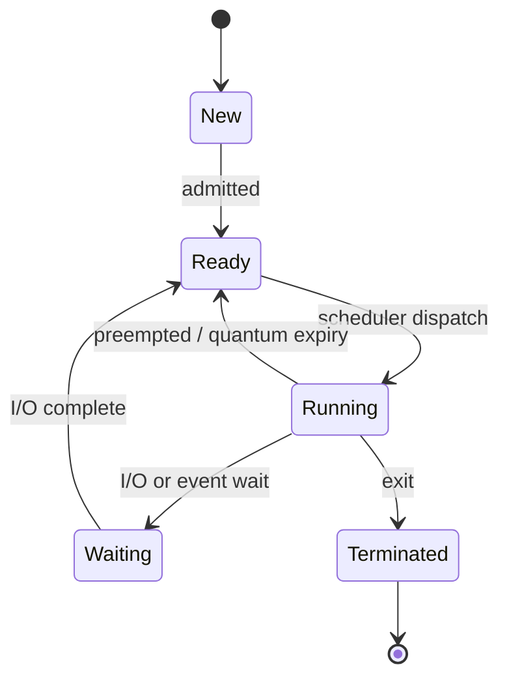
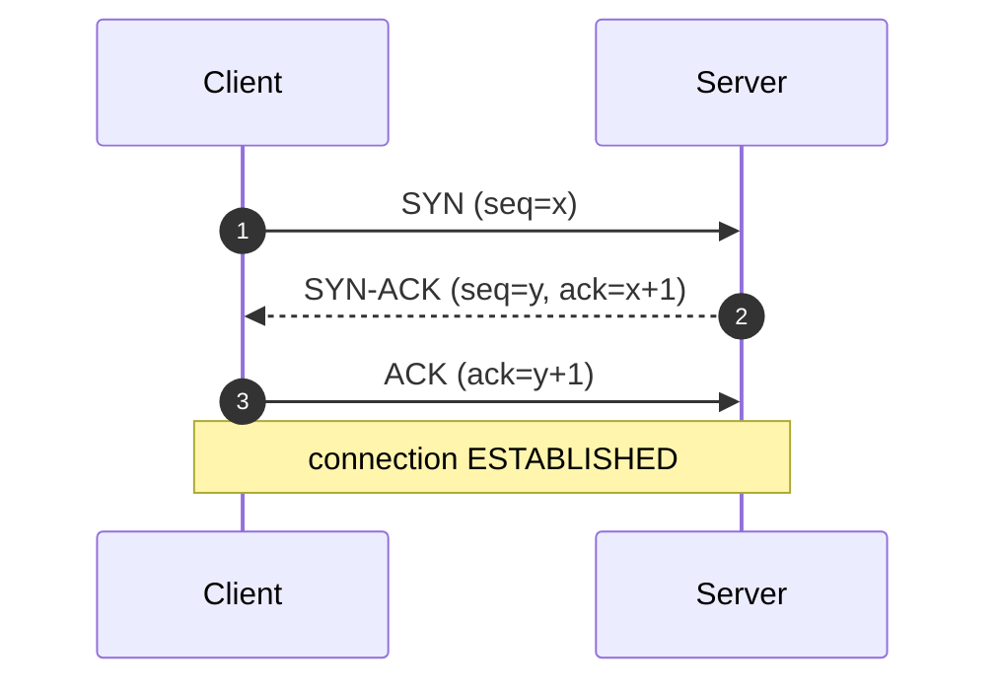
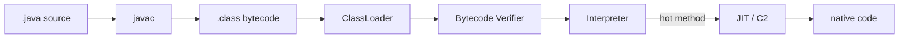
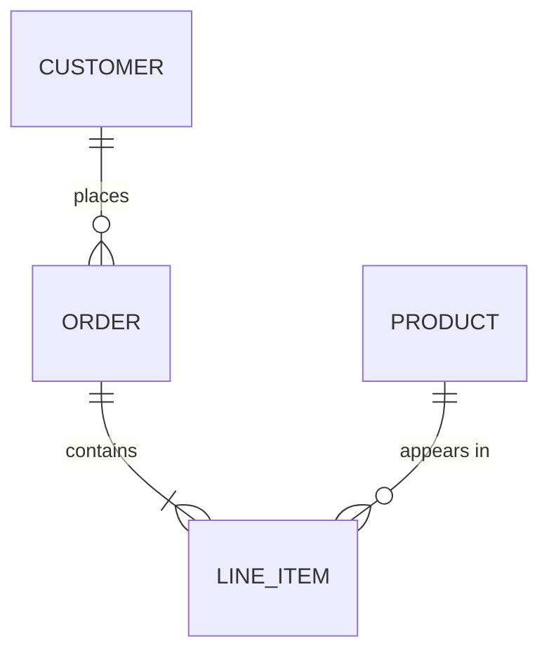

# Content Authoring Contract

**This is the single document you need to author or improve a curriculum topic.**
If you are an agent assigned one topic file, read this file, read the exemplar named
in §9, read your target file, and write. You do not need to read anything else.

---

## 1. What you are writing

`cs-fundamentals-with-ui` is an interview-preparation platform for computer-science
fundamentals. Each topic is **one Markdown file** in `content/<category>/`, rendered in
the app's "Study" tab.

The five categories are exactly: `os`, `networking`, `dbms`, `java-spring`, `aiml`.

Your reader is a software engineer preparing for technical interviews. They want to
understand mechanisms deeply enough to answer follow-up questions, not to memorise
definitions.

---

## 2. The one file you may edit

```
content/<category>/<NN><letter?>-<topic-slug>.md
```

Examples: `content/dbms/06-transactions-acid.md`, `content/java-spring/01j-java-hashmap-internals.md`

**Do not modify any other file.** Not `.java`, not `.jsx`, not `.js`, not `.json`.
Every topic in this repository is already registered in the backend, the frontend
router, the category hub and the home page. Adding content requires **zero**
registration work. If you believe a registration change is needed, stop and report it
instead of making it.

Do not rename the file. The `NN` numeric prefix controls curriculum ordering and the
suffix after it must keep matching the registered topic id.

---

## 3. Required document structure

Every file follows this exact skeleton. The three tier headings are **mandatory,
exact, and in this order** — the app and the validator both key off them.

```markdown
# <Topic Title>

<2-3 sentence orientation: what this is, where it sits in a real system,
and why interviewers ask about it.>

---

## 🟢 Beginner Level

### <concept>
<prose, diagrams, tables>

### <concept>
...

---

## 🟡 Intermediate Level

### <concept>
...

---

## 🔴 Expert Level

### <concept>
...

### Common Misconceptions
<3-5 items. State the wrong belief, then correct it.>

### Interview Questions
<12-15 Q&A pairs. Format in §7.>
```

Tier guidance:

| Tier | Sections | Covers |
|---|---|---|
| 🟢 Beginner | 3-5 `###` | Vocabulary, the mental model, the "what and why" |
| 🟡 Intermediate | 4-6 `###` | Mechanisms, at least one fully worked example with real numbers |
| 🔴 Expert | 3-5 `###` | Internals, failure modes, trade-offs, production behaviour |

---

## 4. Depth target

**400-600 lines per file.**

Current files average 134 lines, which is cheatsheet depth. That is the problem this
contract exists to fix. Do not pad to hit the number — hit it by actually explaining
mechanisms, working examples end to end, and covering failure cases.

Also required in every file:

- **≥ 3 Mermaid diagrams**, at least one per tier (§5)
- **≥ 1 worked example** carried through with concrete numbers, not hand-waved
- **≥ 1 comparison table**
- **1 Common Misconceptions** section (3-5 items)
- **12-15 interview Q&A pairs** (§7)

---

## 5. Diagrams — use Mermaid

Diagrams are written as fenced ` ```mermaid ` blocks directly in the Markdown. They
render as real diagrams in the app. **Do not draw ASCII box art** — older files in this
repo do, and that is legacy to be replaced, not a pattern to copy.

Pick the diagram type that matches the shape of the concept:

| Concept shape | Mermaid type | Example use |
|---|---|---|
| Pipeline, decision path, layering | `flowchart` | Java execution pipeline, kernel I/O stack |
| Protocol exchange between parties | `sequenceDiagram` | TCP handshake, DNS lookup, 2PC, TLS 1.3 |
| Lifecycle with discrete states | `stateDiagram-v2` | Process states, transaction states, bean lifecycle |
| Type or class relationships | `classDiagram` | Collections hierarchy, design patterns, OOP |
| Data model | `erDiagram` | ER modelling, schema normalisation |
| Ordered phases with duration | `gantt` | Scheduling algorithm comparison |

### Worked diagram examples

**Lifecycle — `stateDiagram-v2`:**

````markdown

````

**Protocol exchange — `sequenceDiagram`:**

````markdown

````

**Pipeline — `flowchart`:**

````markdown

````

**Data model — `erDiagram`:**

````markdown

````

### Diagram rules

- Every diagram must **parse** — a syntax error shows an error box to the reader.
- Quote any label containing spaces, punctuation or special characters: `A["Ready / Runnable"]`.
- Keep diagrams under ~15 nodes. Two focused diagrams beat one unreadable one.
- Diagrams must add information, not restate the adjacent sentence.

---

## 6. Markdown you may use

The renderer supports **full GitHub-Flavoured Markdown**, plus math and Mermaid:

- Headings `#` through `######`, **nested** lists, ordered lists, task lists
- **Bold**, *italic*, ~~strikethrough~~, `inline code`, links
- Blockquotes (`>`), horizontal rules (`---`), footnotes
- Pipe tables, including alignment rows
- Fenced code blocks with a language tag for syntax highlighting:
  ` ```java `, ` ```sql `, ` ```python `, ` ```bash `
- **Math via KaTeX**: inline `$O(\log n)$` and block `$$ ... $$`
- **Mermaid diagrams** as above

**Not allowed:** raw HTML tags. The validator rejects them.

> **Note on `$`:** `$` now means math. Writing a literal dollar amount in prose
> (`$50`) can be parsed as math. Escape it as `\$50`, or keep it inside a code block.

---

## 7. Interview questions — the most valuable section

12-15 pairs, at the end of the Expert tier. Format:

```markdown
### Interview Questions

**Q1. Why does a B+ tree store all records in leaf nodes rather than internal nodes?** `[medium]`

Internal nodes hold only keys and child pointers, so each node fits more keys in a
single disk page, which lowers the tree's fan-out height. A shorter tree means fewer
disk seeks per lookup. Keeping records only in leaves also lets the leaves be linked
into a sorted list, which is what makes range scans efficient — you find the start key
once and then walk sideways without revisiting internal nodes.

**Q2. ...** `[hard]`
```

Rules:

- Difficulty tag on every question: `` `[easy]` ``, `` `[medium]` ``, or `` `[hard]` ``
- Rough spread: **4 easy, 6 medium, 4 hard**
- **No answer shorter than 3 sentences.** An answer that restates the question fails.
- Answer in interviewer-satisfying order: **direct answer → mechanism → trade-off or failure case**
- **At least 2 must be scenario questions** — "Your service shows X, what do you check?" — not definitions
- **Migrate first:** if `frontend/src/data/` contains a JSON file for your topic, its
  `theoryData.interviewQA` and `quizData` entries are existing questions. Fold them in
  (improving the answers to meet the 3-sentence bar) before writing new ones. Do not
  delete or edit the JSON file — just copy from it.

---

## 8. Voice

- Direct and technical. Assume a working engineer, not a beginner to programming.
- Explain **why**, not just what. "Reads block writes" is weak; "readers hold a shared
  lock, so a writer requesting an exclusive lock queues behind them, which is how a
  long analytical query stalls an OLTP write path" is right.
- Use concrete numbers: real page sizes, real latencies, real thresholds.
- No filler ("In today's fast-paced world"), no emoji outside the three tier headings.
- British or American spelling — just be consistent within a file.

---

## 9. Exemplar

Before writing, read **`content/dbms/06-transactions-acid.md`**. It is the reference
implementation of this contract. Match its depth, structure and voice.

---

## 10. Verify before reporting done

```bash
node scripts/validate-content.mjs content/<category>/<your-file>.md
```

The validator checks structure, depth, diagram count, diagram syntax, Q&A count and
banned syntax. **Do not report your work as complete while it exits non-zero.**

Then confirm it renders. From the repo root:

```bash
./start.sh --local
# open http://localhost:5173/topic/<topic-id> and read the Study tab
```

Report back:

- final line count
- number of Mermaid diagrams
- number of Q&A pairs
- validator exit code
