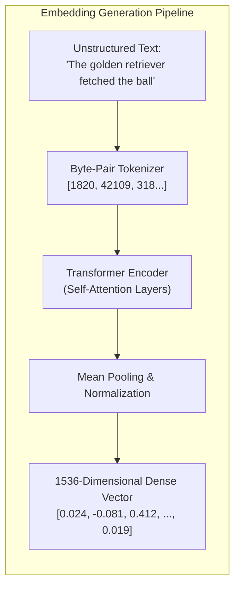
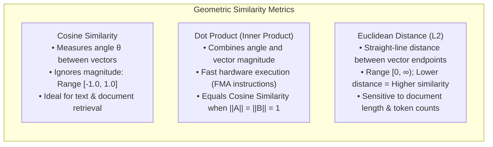
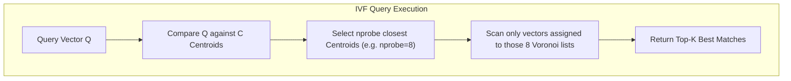
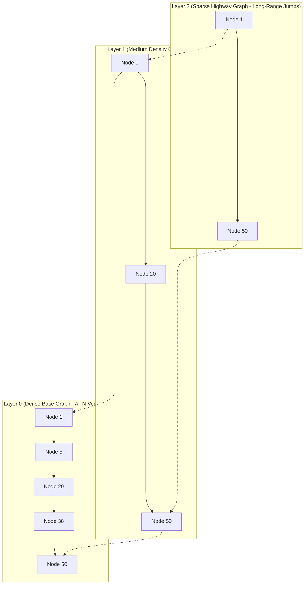
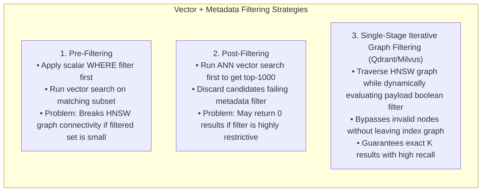

# Vector Embeddings, Similarity Search & Vector Databases

Vector embeddings transform unstructured data—such as natural language text, images, audio waveforms, and user interaction histories—into dense, high-dimensional numerical vectors where geometric proximity directly reflects semantic similarity. In modern enterprise machine learning architectures, vector databases serve as the specialized non-volatile retrieval layer for Large Language Model (LLM) Retrieval-Augmented Generation (RAG) pipelines, multimodal search engines, and real-time recommendation engines. System design and AI infrastructure interviews frequently evaluate candidate mastery of embedding dimension trade-offs, Approximate Nearest Neighbor (ANN) indexing mechanics (such as HNSW and IVF-PQ), memory footprint estimation, and hybrid scalar-vector filtered query execution.

---

## 🟢 Beginner Level

### The Core Problem: Searching Unstructured Data
Traditional databases store and index structured scalar attributes (e.g., integers, dates, strings) and match them using exact equality (`WHERE status = 'ACTIVE'`) or lexicographical range queries via B+ Trees. However, unstructured human language and media cannot be compared using exact string matches: "automobile" and "car" share zero identical characters, yet express identical conceptual meaning. Similarly, a user searching an e-commerce catalog for "durable waterproof winter footwear" should seamlessly match product listings titled "heavy-duty snow boots" even if none of the query words appear in the product description.

Traditional keyword search engines (like Lucene and BM25) rely on inverted indexes that match exact lexical terms. While effective for matching specific entity names, serial numbers, or acronyms, lexical search fails when queries use synonyms, misspellings, colloquial expressions, or conceptual descriptions. Vector embeddings solve this fundamental limitation by mapping unstructured content into continuous mathematical spaces where semantic meaning is encoded geometrically.

### What is a Vector Embedding?
A **Vector Embedding** is an array of floating-point numbers generated by a deep neural network (such as a BERT transformer, OpenAI `text-embedding-3`, or CLIP visual encoder) that positions a data item in an $N$-dimensional semantic space. 



In this vector space:
- Related concepts cluster closely together: $\text{distance}(\text{"dog"}, \text{"puppy"}) \approx 0.08$.
- Unrelated concepts sit far apart: $\text{distance}(\text{"dog"}, \text{"quantum mechanics"}) \approx 0.92$.
- Vector arithmetic preserves linear semantic analogies: $\vec{v}(\text{"King"}) - \vec{v}(\text{"Man"}) + \vec{v}(\text{"Woman"}) \approx \vec{v}(\text{"Queen"})$.

### Static Word Embeddings vs Modern Contextual Embeddings
To understand modern embeddings, it is essential to distinguish between historical static embeddings and current contextual representations:

1. **Static Embeddings (Word2Vec, GloVe, FastText)**: In early NLP architectures, each unique vocabulary word was assigned a single fixed numerical vector. The word "bank" had the exact same embedding vector regardless of whether it appeared in "river bank" or "investment bank". This created severe polysemy ambiguity and failed to represent syntactic dependencies.
2. **Contextual Transformer Embeddings (BERT, RoBERTa, E5, OpenAI)**: Modern transformer models compute representations dynamically by running multi-head self-attention over the entire input sequence. The token "bank" receives distinct geometric coordinates depending on the surrounding words in the sentence. Sentence and document representations are produced by applying mean pooling across all output token vectors or extracting the specialized `[CLS]` token representation.

### Vector Dimensionality and Data Types
The dimensionality ($d$) of an embedding corresponds to the width of the transformer model's hidden representation layer:
- **Small Embeddings ($d = 384$ to $768$)**: Models like `all-MiniLM-L6-v2` or `BERT-base`. Lightweight, fast inference, lower memory footprint.
- **Medium Embeddings ($d = 1024$ to $1536$)**: Models like OpenAI `text-embedding-3-small` or `bge-large-en-v1.5`. Standard for enterprise search and RAG.
- **Large Embeddings ($d = 3072$ to $4096$)**: Models like `text-embedding-3-large` or multimodal models. Capture subtle domain-specific nuances at the expense of higher memory usage.

By default, embedding coordinates are stored as 32-bit single-precision floating-point numbers (`float32`), meaning each dimension occupies 4 bytes of memory. A single 1536-dimensional vector consumes:
$$\text{Vector Size} = 1536 \times 4\text{ bytes} = 6{,}144\text{ bytes } (\approx 6\text{ KB})$$
Storing $10{,}000{,}000$ such vectors in uncompressed RAM requires $\approx 60\text{ GB}$ of dedicated memory exclusively for the raw vector payloads, excluding index overhead.

### Vector Distance and Similarity Metrics
To determine how closely related two embeddings $A$ and $B$ are, vector engines compute geometric similarity metrics:



| Metric | Mathematical Formula | Range | Best Used For |
|---|---|---|---|
| **Cosine Similarity** | $\cos(\theta) = \frac{A \cdot B}{\|A\| \|B\|} = \frac{\sum_{i=1}^d A_i B_i}{\sqrt{\sum A_i^2} \sqrt{\sum B_i^2}}$ | $[-1, 1]$ ($1 = \text{identical}$) | Natural language text, document search, topic clustering |
| **Dot Product** | $A \cdot B = \sum_{i=1}^d A_i B_i$ | $(-\infty, \infty)$ | Normalized embeddings, neural network classification |
| **Euclidean ($L_2$)** | $d(A, B) = \sqrt{\sum_{i=1}^d (A_i - B_i)^2}$ | $[0, \infty)$ ($0 = \text{identical}$) | Computer vision, facial recognition, physical coordinates |
| **Manhattan ($L_1$)** | $d(A, B) = \sum_{i=1}^d \|A_i - B_i\|$ | $[0, \infty)$ | High-dimensional sparse categorical feature vectors |

---

## 🟡 Intermediate Level

### Exact Nearest Neighbors (KNN) vs Approximate Nearest Neighbors (ANN)
Given a query vector $Q$ and a database containing $N$ stored vectors, finding the top-$K$ most similar vectors can be approached in two ways:

1. **Exact K-Nearest Neighbors (Flat / Brute-Force KNN)**: Computes the exact cosine or $L_2$ distance between $Q$ and every single one of the $N$ stored vectors, sorting the resulting scores.
   - *Time Complexity*: $O(N \cdot d)$.
   - *Accuracy (Recall)*: $100\%$ perfect recall.
   - *Limitation*: For $N = 10{,}000{,}000$ and $d = 1536$, answering a single query requires evaluating $\sim 15.36\text{ billion}$ floating-point operations, causing query latencies $> 500\text{ ms}$ and overwhelming CPU cores.
2. **Approximate Nearest Neighbors (ANN)**: Constructs specialized pre-computed graph or cluster indexes that prune the search space, examining only a tiny fraction ($< 1\%$) of candidate vectors.
   - *Time Complexity*: $O(\log N)$ or $O(\sqrt{N})$.
   - *Accuracy (Recall)*: $95\%\text{ to }99\%$ recall (statistically indistinguishable from exact search for practical applications).
   - *Query Latency*: Sub-$5\text{ ms}$ responses under high queries per second (QPS).

### The Mathematics of the Curse of Dimensionality
In standard 2D or 3D Euclidean space, spatial partitioning structures such as $k$-d trees, quadtrees, and R-Trees divide space into recursive bounding boxes, achieving $O(\log N)$ exact search times. However, as the dimensionality $d$ increases past $\sim 20$ dimensions, these geometric partitioning structures break down completely due to three mathematical realities:

1. **Exponential Volume Expansion**: The volume of a hypercube of dimension $d$ scales as $L^d$. To maintain constant point density as dimensionality increases, the number of required data points grows exponentially.
2. **Surface Area Concentration**: In high dimensions, virtually all the volume of a hypersphere is concentrated in a paper-thin shell immediately adjacent to its outer surface. The volume of a sphere of radius $r$ in $d$ dimensions is $V_d(r) = \frac{\pi^{d/2}}{\Gamma(d/2 + 1)} r^d$. The fraction of volume contained in the inner shell of radius $(1 - \epsilon)r$ is $(1 - \epsilon)^d \to 0$ as $d \to \infty$.
3. **Distance Equidistance Phenomenon**: As $d \to \infty$, the relative difference between the distance to the nearest neighbor and the distance to the farthest neighbor vanishes:
   $$\lim_{d \to \infty} \frac{d_{\max} - d_{\min}}{d_{\min}} = 0$$
   Because every point becomes nearly equidistant from every other point in high-dimensional space, tree partitioning algorithms end up inspecting every single leaf node, degrading into an $O(N)$ brute-force linear scan. This mathematical constraint is why graph-based and quantization-based ANN indexing became mandatory.

### Core ANN Indexing Algorithms

#### 1. Inverted File Index (IVF)
IVF partitions the high-dimensional vector space into $C$ Voronoi cells using K-Means clustering during an offline indexing phase. Each cell is represented by a centroid vector.



- **Parameters**: `nlist` (total clusters built) and `nprobe` (number of adjacent clusters searched per query).
- **Trade-off**: Higher `nprobe` increases recall accuracy but increases query latency towards brute-force scan.

#### 2. Locality-Sensitive Hashing (LSH)
Locality-Sensitive Hashing (LSH) projects high-dimensional vectors onto random hyperplanes. If two vectors $u$ and $v$ have a small angle $\theta$ between them, the probability that a random hyperplane separates them is proportional to $\theta / \pi$:
$$P(h(u) = h(v)) = 1 - \frac{\theta}{\pi}$$
By combining $K$ random projections into hash keys, vectors falling into identical hash buckets are examined as candidate nearest neighbors. While fast to build, LSH is largely superseded by HNSW in modern systems due to lower recall per unit of memory.

#### 3. Hierarchical Navigable Small World (HNSW)
HNSW is the industry gold-standard graph-based ANN algorithm. It builds a multi-layer geometric graph inspired by probabilistic skip lists:



- **Search Procedure**: The search starts at an entry point in the topmost sparse layer, greedily jumping to neighbors closest to query vector $Q$. When no closer neighbor exists in Layer 2, the algorithm drops to Layer 1, repeating until reaching the bottom Layer 0 for fine-grained local beam search.
- **HNSW Parameters**:
  - `M`: Maximum number of bi-directional connection links per node (typical: $16\text{ to }64$). Higher $M$ improves recall on high-dimensional data but increases RAM consumption and index build time.
  - `efConstruction`: Size of the dynamic candidate priority queue evaluated during index build (typical: $100\text{ to }400$).
  - `efSearch`: Size of the dynamic candidate list evaluated during live queries (typical: $32\text{ to }128$). Tuning `efSearch` at runtime lets operators dial the exact speed-vs-recall trade-off without rebuilding the index.

### Worked Numerical Example: Product Quantization (PQ) Compression
When storing millions of vectors in RAM, memory consumption is the primary cost driver. **Product Quantization (PQ)** is a lossy compression technique that dramatically reduces memory usage while enabling ultra-fast distance calculations via pre-computed lookup tables.

#### Step-by-Step Compression Trace:
1. **Original Vector**: A 1536-dimensional `float32` vector ($1536 \times 4\text{ bytes} = 6{,}144\text{ bytes}$).
2. **Sub-vector Decomposition**: Split the 1536 dimensions into $M = 64$ distinct sub-vectors of dimension $d^* = \frac{1536}{64} = 24$.
3. **Centroid Codebook Generation**: For each of the 64 sub-spaces, run K-Means clustering to identify $K^* = 256$ cluster centroids.
4. **Byte Index Assignment**: Because $256 = 2^8$, each centroid within a sub-space can be uniquely identified by a single 8-bit byte (`uint8`, values $0\text{ to }255$).
5. **Quantized Vector Storage**: Replace each 24-dimension float sub-vector with the 1-byte ID of its nearest centroid.

$$\text{Compressed Vector Size} = 64\text{ sub-vectors} \times 1\text{ byte} = 64\text{ bytes}$$
$$\text{Compression Ratio} = \frac{6{,}144\text{ bytes}}{64\text{ bytes}} = 96\times \text{ Reduction } (98.96\%\text{ RAM savings!})$$

#### Asymmetric Distance Computation (ADC):
When query vector $Q$ arrives:
1. Deconstruct $Q$ into 64 sub-vectors.
2. Compute the exact float distance between each of $Q$'s 64 sub-vectors and all 256 pre-computed centroids, populating an in-memory lookup table of size $64 \times 256$ floats ($\sim 65\text{ KB}$).
3. To compute the distance between $Q$ and any stored quantized vector, simply sum 64 byte lookups from the table:
$$d(Q, \vec{v}) \approx \sum_{m=1}^{64} \text{LookupTable}[m][\vec{v}_m]$$
This replaces thousands of floating-point multiplications with 64 CPU memory lookups and additions.

### Concrete Similarity Calculation Example
Let vector $A = [0.6, 0.8, 0.0]$ and vector $B = [0.0, 0.8, 0.6]$:

1. **Dot Product**:
   $$A \cdot B = (0.6 \times 0.0) + (0.8 \times 0.8) + (0.0 \times 0.6) = 0.0 + 0.64 + 0.0 = 0.64$$
2. **Vector Magnitudes**:
   $$\|A\| = \sqrt{0.6^2 + 0.8^2 + 0.0^2} = \sqrt{0.36 + 0.64 + 0.0} = \sqrt{1.0} = 1.0$$
   $$\|B\| = \sqrt{0.0^2 + 0.8^2 + 0.6^2} = \sqrt{0.0 + 0.64 + 0.36} = \sqrt{1.0} = 1.0$$
3. **Cosine Similarity**:
   $$\cos(\theta) = \frac{0.64}{1.0 \times 1.0} = 0.64$$
4. **Euclidean ($L_2$) Distance**:
   $$d(A, B) = \sqrt{(0.6 - 0.0)^2 + (0.8 - 0.8)^2 + (0.0 - 0.6)^2} = \sqrt{0.36 + 0.0 + 0.36} = \sqrt{0.72} \approx 0.8485$$

### Matryoshka Representation Learning (MRL)
Recent embedding architectures (e.g., OpenAI `text-embedding-3` and Nomic Embed) employ **Matryoshka Representation Learning (MRL)**. During training, the loss function forces the most critical semantic features into the earliest dimensions of the vector (like nested Russian Matryoshka dolls):
- A 1536-dimensional vector can be truncated to its first 256 or 512 dimensions by simple slice notation (`v[:256]`).
- Truncating from 1536 to 256 dimensions yields a $6\times$ storage reduction and $6\times$ faster distance calculations while retaining $> 97\%$ of the full embedding's downstream retrieval recall.
- **Two-Stage Cascaded Retrieval**: Production systems use truncated 256-dim embeddings for rapid candidate retrieval of the top-500 items, followed by exact reranking of those 500 items using the full 1536-dim vectors.

---

## 🔴 Expert Level

### Filtered Vector Search: Pre-Filtering vs Post-Filtering vs Iterative Traversal
Enterprise queries almost never search raw vector space alone; they combine semantic search with scalar metadata filters:
```sql
SELECT id, title, content FROM documents 
WHERE tenant_id = 'acme_corp' AND created_year >= 2024
ORDER BY embedding <=> :query_vector LIMIT 10;
```

Handling metadata filters in high-dimensional vector spaces introduces critical performance and recall challenges:



| Filtering Approach | Execution Order | Failure Mode / Limitation |
|---|---|---|
| **Pre-Filtering** | 1. Filter metadata records $\to$ 2. Brute-force scan surviving vectors. | If $100{,}000$ rows match the filter, searching them requires an expensive brute-force scan because the pre-filtered subset cannot use the global HNSW graph. |
| **Post-Filtering** | 1. Retrieve top-$K$ vectors via HNSW $\to$ 2. Discard rows failing metadata filter. | If the metadata filter matches only $0.1\%$ of the dataset, none of the top-$K$ vector candidates may satisfy the filter, returning an empty result set to the user. |
| **Single-Stage Filtered HNSW** | Evaluates metadata predicates dynamically *during* HNSW graph traversal. | Optimal industry approach. Keeps traversing neighboring nodes until $K$ valid matching items are found, preserving both sub-10ms query speeds and complete recall. |

### Vector Database Architectural Landscape
Vector retrieval capabilities are provided by two distinct system paradigms:

1. **Purpose-Built Vector Databases (Qdrant, Pinecone, Milvus, Weaviate, Chroma)**:
   - Written in high-performance native systems languages (Rust for Qdrant, C++/Go for Milvus).
   - Designed from the ground up for dynamic vector indexing, custom SIMD/AVX-512 distance evaluation hardware acceleration, and integrated payload storage.
   - Separate compute and storage nodes, supporting horizontal scaling across distributed shards.
2. **Relational / Generalized Databases with Vector Extensions (`pgvector`, ClickHouse, Elasticsearch)**:
   - Integrate vector data types directly into existing ACID relational tables (`CREATE EXTENSION vector;`).
   - Allow seamless relational joins between vector search results and transactional business tables in a single SQL query.
   - Ideal when operational simplicity and transactional ACID consistency outweigh the need for tens of thousands of vector QPS.

### Complete pgvector Configuration Example
In PostgreSQL, setting up high-performance vector search requires choosing the appropriate distance operator and index parameters:

```sql
-- 1. Enable the pgvector extension
CREATE EXTENSION IF NOT EXISTS vector;

-- 2. Create the document table with 1536-dimensional embeddings
CREATE TABLE documents (
    id BIGSERIAL PRIMARY KEY,
    tenant_id VARCHAR(64) NOT NULL,
    title TEXT NOT NULL,
    content TEXT NOT NULL,
    embedding vector(1536)
);

-- 3. Create HNSW index using Cosine Distance operator class
CREATE INDEX idx_documents_embedding_hnsw 
ON documents 
USING hnsw (embedding vector_cosine_ops)
WITH (m = 16, ef_construction = 128);

-- 4. Tune runtime query beam-search depth
SET hnsw.ef_search = 64;

-- 5. Execute similarity query (<=> denotes Cosine Distance; <#> denotes Negative Dot Product; <-> denotes L2)
SELECT id, title, 1 - (embedding <=> :query_vector) AS cosine_similarity
FROM documents
WHERE tenant_id = 'org_enterprise_99'
ORDER BY embedding <=> :query_vector
LIMIT 10;
```

### Python Qdrant Client Implementation Example
Modern vector databases expose clean SDKs for managing collections, payload schemas, and payload-filtered vector searches:

```python
from qdrant_client import QdrantClient
from qdrant_client.models import Distance, VectorParams, PointStruct, Filter, FieldCondition, MatchValue

# 1. Connect to Qdrant cluster
client = QdrantClient(url="http://localhost:6333")

# 2. Create collection with Cosine Distance
client.recreate_collection(
    collection_name="enterprise_knowledge_base",
    vectors_config=VectorParams(size=1536, distance=Distance.COSINE),
)

# 3. Create payload index on metadata fields for fast filtering
client.create_payload_index(
    collection_name="enterprise_knowledge_base",
    field_name="tenant_id",
    field_schema="keyword",
)

# 4. Insert vectors with structured payload
points = [
    PointStruct(
        id=1,
        vector=[0.023, -0.084, 0.412] + [0.0] * 1533,
        payload={"tenant_id": "acme_corp", "category": "engineering", "access_level": 2}
    )
]
client.upsert(collection_name="enterprise_knowledge_base", points=points)

# 5. Search with single-stage payload filter
results = client.search(
    collection_name="enterprise_knowledge_base",
    query_vector=[0.021, -0.080, 0.405] + [0.0] * 1533,
    query_filter=Filter(
        must=[
            FieldCondition(key="tenant_id", match=MatchValue(value="acme_corp")),
            FieldCondition(key="access_level", match=MatchValue(value=2)),
        ]
    ),
    limit=5
)
```

### Index Comparison Table

| Index Strategy | Query Latency | Recall Accuracy | RAM Footprint | Build / Update Time | Best Suited For |
|---|---|---|---|---|---|
| **Flat (Exact)** | $O(N \cdot d)$ (Slow) | $100\%$ | Lowest (Raw Vectors) | Instant (0 Build) | Datasets $< 50{,}000$ vectors; Ground truth evaluation |
| **HNSW** | $O(\log N)$ (Sub-5ms) | $95\% - 99\%$ | **High** ($1.5\times - 2\times$ raw size) | Moderate | Production real-time RAG & search with high QPS |
| **IVF-Flat** | $O(\sqrt{N})$ ($10-30\text{ms}$) | $90\% - 95\%$ | Low (Centroids only) | Fast | Moderate datasets ($1\text{M} - 10\text{M}$) with modest RAM |
| **IVF-PQ** | $O(\sqrt{N})$ ($5-15\text{ms}$) | $80\% - 92\%$ | **Ultra-Low** ($95\%$ savings) | Slow (Clustering step) | Massive scale ($100\text{M}+$ vectors) on cost-constrained RAM |
| **DiskANN (Vamana)**| $O(\log N)$ ($10-25\text{ms}$) | $95\% - 98\%$ | Very Low (Compressed in RAM, graph on SSD) | Slow | Billion-scale datasets utilizing fast NVMe drives |

### Production Gotchas & Scaling Bottlenecks
1. **Unnormalized Embedding Cosine Discrepancy**: If an application stores unnormalized embeddings and configures the vector index for Inner Product (`dot product`), queries will return vectors with large raw magnitudes rather than true directional similarity. Always L2-normalize vectors prior to insertion or strictly configure Cosine distance operators (`vector_cosine_ops` in `pgvector`).
2. **Graph Degeneration on Frequent Deletions**: In graph-based indexes like HNSW, deleting vectors leaves "tombstone" holes in the graph network, severing navigational links between remaining nodes and degrading recall over time. Vector engines require periodic background index compaction or vacuuming to reconstruct optimal graph topologies.
3. **RAM Starvation in High-Dimensional Spaces**: Indexing 5 million 1536-dimensional vectors with HNSW ($M=32, ef=200$) easily consumes $> 40\text{ GB}$ of RAM. In production, under-provisioning RAM forces OS page faults and SSD swapping, causing query latencies to spike from $5\text{ ms}$ to $> 800\text{ ms}$. Use scalar quantization (SQ8) or product quantization (PQ) when RAM is constrained.
4. **Embedding Model Drift**: Generating embeddings with a new or updated model version (e.g., upgrading from `text-embedding-ada-002` to `text-embedding-3-small`) invalidates the entire existing vector index. Vectors generated by different model architectures or training runs live in completely incompatible geometric vector spaces and cannot be compared. Upgrading embedding models requires a complete re-indexing batch job across the entire historical dataset.

---

### Common Misconceptions

1. **"Cosine similarity is always more accurate than Euclidean distance."**
   *Correction*: When vectors are unit-normalized ($\|A\| = \|B\| = 1$), Cosine similarity, Dot Product, and Euclidean distance are monotonically equivalent ($d_{L2}^2 = 2 - 2 \cdot \cos(\theta)$) and produce identical ranking results.
2. **"Vector databases replace traditional relational databases."**
   *Correction*: Vector databases specialize in fuzzy approximate similarity ranking over unstructured data. They lack the fine-grained transactional ACID controls, complex relational multi-table join capabilities, and strict consistency guarantees of standard RDBMS engines.
3. **"HNSW indexes can be queried instantly as soon as vectors are written to disk."**
   *Correction*: Inserting a vector into an HNSW graph requires traversing existing layers and performing $M$ nearest-neighbor evaluations to establish bi-directional links, making ingestion significantly more CPU-heavy than appending to a flat log or B+ Tree.
4. **"You can compare embeddings generated from two different embedding models if they have the same number of dimensions."**
   *Correction*: Even if two models both output 1536-dimensional vectors, their internal coordinate axes and latent semantic representations are completely different. Comparing vectors across different models produces meaningless random noise.

---

### Interview Questions

**Q1. What is the fundamental difference between a scalar database index (like a B+ Tree) and a vector index (like HNSW)?** `[easy]`
A B+ Tree indexes one-dimensional scalar data by sorting keys into strict linear order, allowing exact binary searches and range queries in $O(\log N)$ time. In contrast, high-dimensional vector spaces have no natural total ordering due to the curse of dimensionality. Vector indexes like HNSW use multi-layer geometric proximity graphs to navigate approximate spatial neighborhoods rather than partitioning sorted keys.

**Q2. Why is Dot Product faster to compute than Cosine Similarity during high-throughput vector search?** `[easy]`
Cosine similarity requires computing the dot product and dividing it by the product of both vector Euclidean norms, which involves two square-root operations and multiple divisions. If all embeddings are normalized to unit length ($\|A\| = 1$) upon insertion, the denominator is always $1.0$, allowing the engine to execute pure dot-product multiply-accumulate (FMA) CPU SIMD instructions without square-roots or division.

**Q3. What does the `efSearch` parameter control in an HNSW index, and what is its operational trade-off?** `[easy]`
The `efSearch` parameter defines the size of the dynamic candidate priority queue maintained during query traversal of the Layer 0 graph. Increasing `efSearch` explores more potential neighbor paths, which increases recall accuracy at the expense of higher CPU consumption and increased query latency. Lowering `efSearch` decreases latency and increases QPS capacity at the cost of lower recall.

**Q4. What is the difference between Dense Embeddings and Sparse Embeddings in search systems?** `[easy]`
Dense embeddings (e.g., from OpenAI or BERT) represent text as compact arrays where nearly all coordinates are non-zero floating-point numbers capturing high-level semantic meaning. Sparse embeddings (e.g., BM25 or SPLADE) contain thousands of dimensions corresponding to vocabulary words where only a few coordinates are non-zero, excelling at exact keyword matching, technical term lookup, and specific ID retrieval.

**Q5. How does Product Quantization (PQ) achieve up to 95% memory reduction on high-dimensional vectors?** `[medium]`
Product Quantization divides a high-dimensional vector into $M$ smaller sub-vectors and clusters each sub-space into $K^*$ centroids using K-Means. Each original float sub-vector is then replaced by the 1-byte integer ID of its nearest centroid. For a 1536-dimensional float32 vector ($6{,}144\text{ bytes}$), dividing into 64 sub-vectors of 24 dimensions compressed to 1-byte centroid IDs reduces the total vector footprint to just $64\text{ bytes}$.

**Q6. What is the "Curse of Dimensionality" and how does it impact nearest-neighbor search?** `[medium]`
As the number of dimensions increases into the hundreds or thousands, the volume of the space grows exponentially, causing data points to become extremely sparse. In high-dimensional spaces, the distance between any point and its nearest neighbor approaches the distance to its farthest neighbor, causing spatial partitioning structures (like KD-Trees or R-Trees) to degrade to brute-force $O(N)$ linear scans.

**Q7. Explain why Post-Filtering often fails in production vector search queries with restrictive metadata.** `[medium]`
Post-Filtering executes the vector ANN search across the entire global index first to retrieve the top-$K$ candidates, and subsequently applies the metadata `WHERE` clause to eliminate non-matching items. If the metadata predicate matches only a tiny fraction (e.g., $< 0.1\%$) of the total database rows, it is highly likely that none of the top-$K$ semantic neighbors satisfy the filter, returning an empty result set despite valid matching records existing elsewhere in the table.

**Q8. How does Single-Stage Iterative Graph Filtering solve the limitations of Pre-Filtering and Post-Filtering?** `[medium]`
Single-Stage Iterative Graph Filtering evaluates scalar metadata predicates directly during the HNSW graph traversal step. When visiting candidate nodes in the proximity graph, the engine dynamically checks payload attributes; if a node fails the filter, its payload is skipped from the result list while its graph edges are still traversed to reach valid connected neighbors. This guarantees returning exactly $K$ valid matching records while preserving sub-10ms graph retrieval speeds.

**Q9. What are the trade-offs of choosing `pgvector` in PostgreSQL versus a standalone vector database like Qdrant?** `[medium]`
`pgvector` allows teams to maintain vector embeddings directly alongside relational business tables within an existing ACID PostgreSQL database, eliminating ETL data pipelines and enabling standard SQL joins. However, standalone vector databases like Qdrant or Milvus provide superior multi-threaded ingestion throughput, dedicated hardware SIMD optimization, distributed sharding for billions of vectors, and advanced payload filtering that surpasses relational extension performance under heavy QPS.

**Q10. How does Scalar Quantization (SQ8) differ from Product Quantization (PQ)?** `[medium]`
Scalar Quantization (SQ8) compresses vectors by scaling each 32-bit floating-point coordinate individually into an 8-bit integer (`uint8`) based on minimum and maximum coordinate bounds across the dataset, yielding a fixed $4\times$ ($75\%$) memory reduction with $> 98\%$ recall retention. Product Quantization (PQ) divides the vector into sub-spaces and replaces entire sub-vectors with centroid IDs, achieving $16\times$ to $64\times$ ($95\%+$) compression but incurring higher recall loss and requiring an offline K-Means training phase.

**Q11. What causes graph degeneration in HNSW indexes and how is it mitigated in production?** `[medium]`
When vectors are deleted from an HNSW index, the engine removes nodes and leaves tombstones or severed connection links between neighboring vectors in the multi-layer graph. Over time, high deletion volumes fragment the graph, trapping search traversals in local minima and lowering query recall. Production vector databases mitigate this by running asynchronous background compaction routines that re-wire broken neighbor links and rebuild degraded graph sub-trees.

**Q12. How does Hybrid Search combine Dense Vector search with Sparse BM25 keyword search?** `[hard]`
Hybrid search executes two parallel retrieval queries: a dense vector ANN search to capture broad semantic intent and conceptual similarity, and a sparse BM25 query to capture exact keyword, acronym, and serial number matches. The engine then normalizes and merges the two candidate lists using algorithms like **Reciprocal Rank Fusion (RRF)** ($RRF\_Score(d) = \sum \frac{1}{k + r_i(d)}$) or learned cross-encoder rerankers, producing superior relevance than either retrieval strategy could achieve alone.

**Q13. Scenario: A legal search engine using an HNSW index reports that search recall dropped from 97% to 62% for queries containing strict client account filters. What is the root cause and architectural fix?** `[hard]`
The system is using Post-Filtering or disconnected Pre-Filtering. Because each client account represents a small fraction of the total legal corpus, standard HNSW top-$K$ search returns candidates belonging to other clients that are subsequently discarded by the metadata filter, leaving fewer than $K$ (or low-quality) results. The architectural fix is to migrate to a vector engine supporting Single-Stage Iterative Graph Filtering (evaluating the client ID predicate during graph exploration) or partition vectors into per-client isolated index namespaces/collections.

**Q14. Scenario: After updating an LLM embedding model from `text-embedding-ada-002` to `text-embedding-3-large`, users complain that newly ingested documents are never returned for search queries. What happened?** `[hard]`
The application stored new embeddings in the existing vector index alongside historical vectors generated by the older model. Even though both models output floating-point vectors, their semantic vector spaces are completely incompatible geometrically—a vector from model A cannot be meaningfully compared against a vector from model B. The remediation requires generating a new index collection, backfilling and re-embedding the entire historical dataset using the new model, and atomically switching live query traffic to the new index once backfill is complete.

### Further Reading

- [Sentence Transformers: semantic-search patterns](https://www.sbert.net/examples/sentence_transformer/applications/semantic-search/README.html) explains the separate query and document encoders used by asymmetric retrieval systems.
- [Elasticsearch reciprocal rank fusion reference](https://www.elastic.co/docs/reference/elasticsearch/rest-apis/reciprocal-rank-fusion) documents rank-based fusion, including the rank constant and candidate-window trade-offs.
- [HNSW: Efficient and robust approximate nearest-neighbor search](https://arxiv.org/abs/1603.09320) is the original paper behind the hierarchical graph structure used by many vector indexes.

Use an exact flat index as a recall baseline before adopting ANN. An ANN setting that improves p99 latency but silently drops recall for important filters is not an optimisation; it is a product regression.

Version embeddings as production data. Store the model identifier, dimensions, preprocessing version, and creation time with each vector so a re-embedding migration can be measured, replayed, and rolled back.

Measure retrieval quality separately from answer quality. A generation model can write fluent text over poor retrieval results, which makes an answer-only metric hide the actual failure mode.

Keep a labelled evaluation set that includes semantic paraphrases, exact identifiers, restrictive metadata filters, and recently changed documents before changing an index or embedding model.
