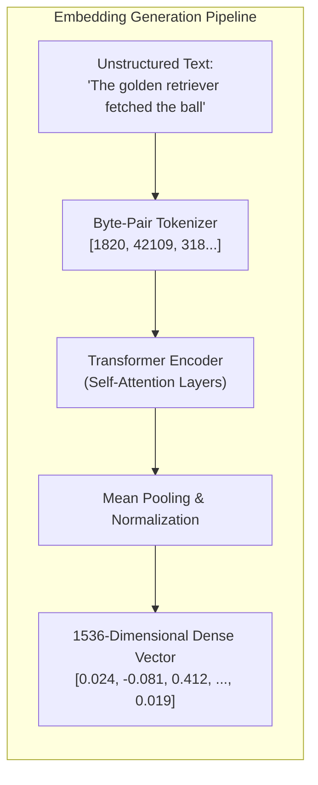
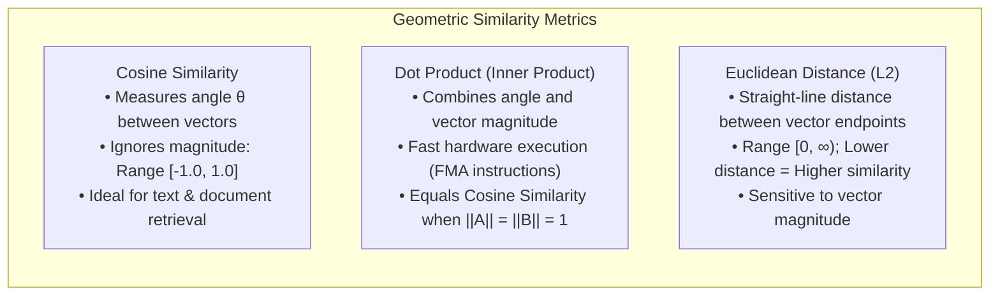
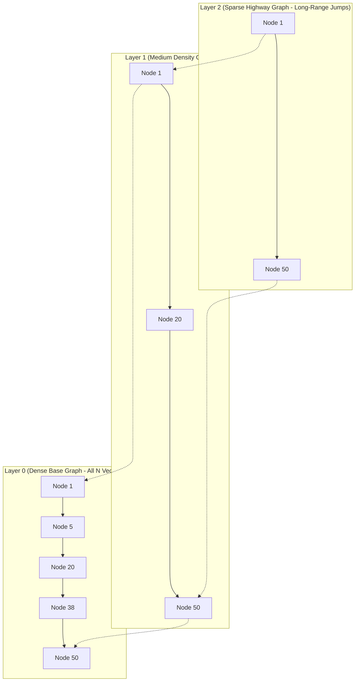
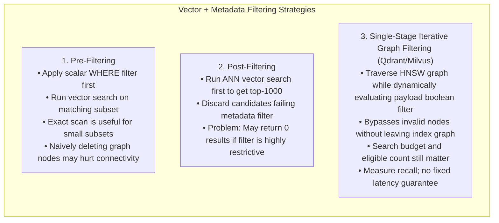

# Vector Embeddings, Similarity Search & Vector Databases

An embedding is a list of numbers a model produces for a piece of text, image, or other input. A search system can compare those lists to find items that are related even when their words differ. This lesson starts with that simple idea, then shows how a backend engineer stores, filters and evaluates embeddings; the advanced index algorithms belong in the later tiers.

**Before you start:** Read [ML fundamentals](07-ml-fundamentals.md) at Beginner level.
You need only lists, numbers and a basic database query to begin.

**After this lesson, you should be able to:** explain an embedding without claiming each
coordinate has a human-readable meaning; calculate storage for a known dimension;
distinguish exact from approximate search; and explain why tenant filtering and
retrieval evaluation matter more than choosing a fashionable vector database.

---

## 🟢 Beginner Level

### The Core Problem: Searching Unstructured Data
Traditional databases store and index structured scalar attributes (e.g., integers, dates, strings) and match them using exact equality (`WHERE status = 'ACTIVE'`) or lexicographical range queries via B+ Trees. However, unstructured human language and media cannot be compared using exact string matches: "automobile" and "car" are different strings that can refer to the same kind of object. Similarly, a user searching an e-commerce catalog for "durable waterproof winter footwear" should seamlessly match product listings titled "heavy-duty snow boots" even if none of the query words appear in the product description.

Keyword search engines use inverted indexes and ranking algorithms such as BM25.
They are excellent for exact IDs and terms; analyzers, stemming, synonyms and fuzzy
matching can also handle many non-exact queries. Embeddings add another signal for
semantic paraphrases. Compare keyword-only, vector-only and combined search on
your own questions before deciding which is better.

### Embeddings and semantic similarity
A **Vector Embedding** is an array of floating-point numbers generated by a deep neural network (such as a BERT transformer, OpenAI `text-embedding-3`, or CLIP visual encoder) that positions a data item in an $N$-dimensional semantic space. 


```mermaid
flowchart LR
    subgraph Ingestion["Embedding Generation Pipeline"]
        RawText["Unstructured Text:<br/>'The golden retriever fetched the ball'"] 
        Tokenizer["Byte-Pair Tokenizer<br/>[1820, 42109, 318...]"]
        Encoder["Transformer Encoder<br/>(Self-Attention Layers)"]
        Pooler["Mean Pooling & Normalization"]
        Vector["1536-Dimensional Dense Vector<br/>[0.024, -0.081, 0.412, ..., 0.019]"]
        
        RawText --> Tokenizer
        Tokenizer --> Encoder
        Encoder --> Pooler
        Pooler --> Vector
    end
```

The Transformer creates contextual token representations through **self-attention**. Each token
projects query, key, and value vectors; attention weights let its representation incorporate the
other tokens that matter in this sequence. That is why “bank” moves to a finance neighborhood in
“bank approved the loan” but to a geography neighborhood in “sat on the river bank.”

Retrieval needs one fixed-size vector rather than one vector per token. An embedding model
therefore pools token representations—commonly mean pooling or a trained special token—and often
normalizes the result. Query and document encoders are trained so relevant pairs occupy nearby
positions in the same space; self-attention supplies context, while the retrieval objective
teaches which kinds of meaning should count as near.

Within one embedding model and one distance metric, relevant examples should often rank
near each other. A raw similarity score has no universal meaning across models, data
sets or normalization choices. Famous word-vector analogies are historical examples,
not a guarantee for modern sentence or document embeddings. Test ranking against
labelled, domain-specific queries instead of memorising a "good" distance cutoff.

### Static Word Embeddings vs Modern Contextual Embeddings
To understand modern embeddings, it is essential to distinguish between historical static embeddings and current contextual representations:

1. **Static Embeddings (Word2Vec, GloVe, FastText)**: In early NLP architectures, each unique vocabulary word was assigned a single fixed numerical vector. The word "bank" had the exact same embedding vector regardless of whether it appeared in "river bank" or "investment bank". This created severe polysemy ambiguity and failed to represent syntactic dependencies.
2. **Contextual Transformer Embeddings (BERT, RoBERTa, E5, OpenAI)**: Modern transformer models compute representations dynamically by running multi-head self-attention over the entire input sequence. The token "bank" receives distinct geometric coordinates depending on the surrounding words in the sentence. Sentence and document representations are produced by applying mean pooling across all output token vectors or extracting the specialized `[CLS]` token representation.

### Vector Dimensionality and Data Types
The dimensionality ($d$) is the number of coordinates the embedding API returns.
It may equal a model layer's width, or it may be projected or shortened by the
embedding system. More dimensions increase raw storage and comparison work but
do not guarantee better relevance. Record the chosen model, dimensions and
normalization method together; vectors from different versions should not be
silently mixed in one nearest-neighbor ranking.

By default, embedding coordinates are stored as 32-bit single-precision floating-point numbers (`float32`), meaning each dimension occupies 4 bytes of memory. A single 1536-dimensional vector consumes:
$$\text{Vector Size} = 1536 \times 4\text{ bytes} = 6{,}144\text{ bytes } (\approx 6\text{ KB})$$
Ten million such raw vectors occupy 61.44 GB, or about 57.22 GiB, before row headers, graph links, payloads, replicas and allocator overhead. Storage types and engine layouts add their own costs; raw coordinates are only the starting budget.

**Small worked example:** for two unit vectors $A=(1,0)$ and
$B=(0.8,0.6)$, cosine similarity is $A\cdot B=0.8$. For
$C=(0,1)$ it is $A\cdot C=0$. This only demonstrates the
calculation. Real embeddings have many coordinates, and a score of 0.8
is not automatically "relevant"; choose thresholds using labelled queries.

### Vector Distance and Similarity Metrics
To determine how closely related two embeddings $A$ and $B$ are, vector engines compute geometric similarity metrics:


```mermaid
flowchart TD
    subgraph Metrics["Geometric Similarity Metrics"]
        direction TB
        Cos["Cosine Similarity<br/>• Measures angle θ between vectors<br/>• Ignores magnitude: Range [-1.0, 1.0]<br/>• Ideal for text & document retrieval"]
        Dot["Dot Product (Inner Product)<br/>• Combines angle and vector magnitude<br/>• Fast hardware execution (FMA instructions)<br/>• Equals Cosine Similarity when ||A|| = ||B|| = 1"]
        Euc["Euclidean Distance (L2)<br/>• Straight-line distance between vector endpoints<br/>• Range [0, ∞); Lower distance = Higher similarity<br/>• Sensitive to vector magnitude"]
    end
```

| Metric | Mathematical Formula | Range | Best Used For |
|---|---|---|---|
| **Cosine Similarity** | $\cos(\theta) = \frac{A \cdot B}{\|A\| \|B\|} = \frac{\sum_{i=1}^d A_i B_i}{\sqrt{\sum A_i^2} \sqrt{\sum B_i^2}}$ | $[-1, 1]$ ($1 = \text{same direction}$) | Natural language text, document search, topic clustering |
| **Dot Product** | $A \cdot B = \sum_{i=1}^d A_i B_i$ | $(-\infty, \infty)$ | Normalized embeddings, neural network classification |
| **Euclidean ($L_2$)** | $d(A, B) = \sqrt{\sum_{i=1}^d (A_i - B_i)^2}$ | $[0, \infty)$ ($0 = \text{identical}$) | Computer vision, facial recognition, physical coordinates |
| **Manhattan ($L_1$)** | $d(A, B) = \sum_{i=1}^d \|A_i - B_i\|$ | $[0, \infty)$ | High-dimensional sparse categorical feature vectors |

---

## 🟡 Intermediate Level

### Vector retrieval, chunking, and reranking

A production retrieval pipeline separates inexpensive broad recall from expensive precise ranking.
The same versioned embedding model must encode indexed chunks and live queries; vectors from
different models do not share a meaningful coordinate system.


```mermaid
flowchart LR
    Doc["Source document"] --> Split["Structure-aware chunking"]
    Split --> Embed["Document embeddings"]
    Embed --> Index["ANN vector index"]
    Query["User query"] --> QEmbed["Query embedding"]
    QEmbed --> Retrieve["Retrieve top 100 candidates"]
    Index --> Retrieve
    Retrieve --> Filter["Apply metadata and access filters"]
    Filter --> Rerank["Cross-encoder reranks top 30"]
    Rerank --> Context["Return best 5 chunks"]
```

The online path normally has four stages:

1. **Embed the query** using the query instruction and model version used during indexing.
2. **Retrieve candidates** with cosine, dot-product, or Euclidean ANN search.
   Candidate count is intentionally larger than the final result count to protect recall.
3. **Filter and fuse** metadata-safe vector results with lexical results when exact names,
   identifiers, or rare terms matter.
4. **Rerank** the reduced set with a more accurate model, then pass only the highest-value chunks
   to the search result page or LLM context window.

Chunking determines the unit the index can retrieve. A perfect ANN index cannot return a fact that
was split away from its required context or buried inside an oversized chunk:

| Chunking choice | Benefit | Failure mode | Typical use |
|---|---|---|---|
| Fixed token window | Simple, predictable batches | Splits headings, tables, or code | Uniform plain text |
| Sliding window with overlap | Preserves facts near boundaries | Duplicates storage and results | Long prose |
| Structure-aware | Keeps sections and paragraphs intact | Produces variable sizes | Documentation and Markdown |
| Semantic boundary | Groups coherent sentences | Extra model cost and instability | Mixed narrative corpora |
| Parent-child | Retrieves small child, returns larger parent | More IDs and joins to manage | Manuals with nested sections |

A useful starting point for prose is 300–600 tokens with 10–20% overlap, but it is a hypothesis,
not a universal constant. Code should respect functions and classes, tables should retain headers,
and question-answer material often works best as one logical pair. Store source ID, section path,
token offsets, model version, and access-control metadata beside each chunk so results can be
traced, filtered, and reindexed.

Overlap rescues information crossing a boundary, but excessive overlap produces near-duplicate
candidates, increases embedding and storage cost, and wastes an LLM's context window. Deduplicate
by source and neighboring offsets before final context assembly. Evaluate chunking with labelled
queries that require both local facts and cross-paragraph context.

Embedding retrieval is usually a **bi-encoder** operation: query and chunk are encoded separately,
so chunk vectors can be precomputed and millions can be searched quickly. A **cross-encoder
reranker** reads the query and each candidate together, allowing token-level attention between
them. That interaction improves ordering but cannot be precomputed, so it should process tens or
hundreds of candidates rather than the full corpus.

For example, retrieve 100 ANN candidates, enforce authorization, fuse lexical matches, rerank the
best 30 in one batch, and return 5. If a reranker takes 4 ms per pair sequentially, 100 pairs would
cost roughly 400 ms before network overhead; reducing to 30 and batching is the difference between
an offline-quality model and a usable request path. Reranking improves precision only among
retrieved candidates—it cannot recover a relevant chunk that candidate retrieval omitted.

### Exact Nearest Neighbors (KNN) vs Approximate Nearest Neighbors (ANN)
Given a query vector $Q$ and a database containing $N$ stored vectors, finding the top-$K$ most similar vectors can be approached in two ways:

1. **Exact K-Nearest Neighbors (Flat / Brute-Force KNN)**: Scores every eligible stored vector using the selected metric and retains the best $K$; a bounded heap or selection algorithm avoids sorting the whole corpus.
   - *Time Complexity*: $O(N \cdot d)$.
   - *Accuracy (Recall)*: $100\%$ perfect recall.
   - *Limitation*: For $N = 10{,}000{,}000$ and $d = 1536$, a scan compares 15.36 billion coordinate pairs. This is a work estimate, not an instruction count or latency guarantee; hardware, batching, SIMD, GPU use and memory layout change the elapsed time.
2. **Approximate Nearest Neighbors (ANN)**: Constructs specialized pre-computed graph or cluster indexes that prune the search space, often examining fewer candidates at the cost of potentially missing exact neighbors.
   - *Work*: Depends on the index, search budget, vector geometry and filters; a universal logarithmic worst-case bound does not apply.
   - *Recall*: Measure overlap with exact top-$K$ results for the same authorized subset; recall below 100% can materially affect the product.
   - *Latency*: Measure p50/p95/p99 at representative concurrency rather than adopting a benchmark from another dataset.

### The Mathematics of the Curse of Dimensionality
In standard 2D or 3D Euclidean space, spatial partitioning structures such as $k$-d trees, quadtrees, and R-Trees divide space into recursive bounding boxes, can prune many points on suitable low-dimensional data, although worst-case exact queries may still scan all points. High intrinsic dimensionality can weaken this pruning; there is no universal twenty-dimension cutoff. Three useful intuitions are:

1. **Exponential Volume Expansion**: The volume of a hypercube of dimension $d$ scales as $L^d$. To maintain constant point density as dimensionality increases, the number of required data points grows exponentially.
2. **Surface Area Concentration**: In high dimensions, virtually all the volume of a hypersphere is concentrated in a paper-thin shell immediately adjacent to its outer surface. The volume of a sphere of radius $r$ in $d$ dimensions is $V_d(r) = \frac{\pi^{d/2}}{\Gamma(d/2 + 1)} r^d$. The fraction of volume contained in the inner shell of radius $(1 - \epsilon)r$ is $(1 - \epsilon)^d \to 0$ as $d \to \infty$.
3. **Distance Equidistance Phenomenon**: For suitable high-dimensional data distributions, relative distance contrast can shrink; this is an illustrative concentration limit, not a theorem about every embedding dataset:
   $$\lim_{d \to \infty} \frac{d_{\max} - d_{\min}}{d_{\min}} = 0$$
   When pruning loses effectiveness, exact tree search can approach a full scan. Structured data can still have useful distance contrast, and exact scans remain appropriate for small filtered subsets or recall baselines. ANN is an engineering trade-off, not a mandatory replacement for every dataset.

### Core ANN Indexing Algorithms

#### 1. Inverted File Index (IVF)
IVF partitions the high-dimensional vector space into $C$ Voronoi cells using K-Means clustering during an offline indexing phase. Each cell is represented by a centroid vector.


```mermaid
flowchart TD
    subgraph IVFQuery["IVF Query Execution"]
        Q["Query Vector Q"] --> CompareCentroids["Compare Q against C Centroids"]
        CompareCentroids --> SelectTop["Select nprobe closest Centroids (e.g. nprobe=8)"]
        SelectTop --> ScanInvertedLists["Scan only vectors assigned to those 8 Voronoi lists"]
        ScanInvertedLists --> TopK["Return Top-K Best Matches"]
    end
```

- **Parameters**: `nlist` (total clusters built) and `nprobe` (number of adjacent clusters searched per query).
- **Trade-off**: Higher `nprobe` increases recall accuracy but increases query latency towards brute-force scan.

#### 2. Locality-Sensitive Hashing (LSH)
Locality-Sensitive Hashing (LSH) projects high-dimensional vectors onto random hyperplanes. If two vectors $u$ and $v$ have a small angle $\theta$ between them, the probability that a random hyperplane separates them is proportional to $\theta / \pi$:
$$P(h(u) = h(v)) = 1 - \frac{\theta}{\pi}$$
By combining $K$ random projections into hash keys, vectors falling into identical hash buckets are examined as candidate nearest neighbors. While fast to build, LSH is largely superseded by HNSW in modern systems due to lower recall per unit of memory.

#### 3. Hierarchical Navigable Small World (HNSW)
HNSW is a widely used graph-based ANN algorithm. It builds a multi-layer geometric graph inspired by probabilistic skip lists:


```mermaid
flowchart TD
    subgraph Layer2["Layer 2 (Sparse Highway Graph - Long-Range Jumps)"]
        L2_N1["Node 1"] --------------------------------------> L2_N50["Node 50"]
    end

    subgraph Layer1["Layer 1 (Medium Density Graph)"]
        L1_N1["Node 1"] ------------> L1_N20["Node 20"] ------------> L1_N50["Node 50"]
    end

    subgraph Layer0["Layer 0 (Dense Base Graph - All N Vectors)"]
        L0_N1["Node 1"] --> L0_N5["Node 5"] --> L0_N20["Node 20"] --> L0_N38["Node 38"] --> L0_N50["Node 50"]
    end

    L2_N1 -.-> L1_N1
    L1_N1 -.-> L0_N1
    L2_N50 -.-> L1_N50
    L1_N50 -.-> L0_N50
```

- **Search Procedure**: The search starts at an entry point in the topmost sparse layer, greedily jumping to neighbors closest to query vector $Q$. When no closer neighbor exists in Layer 2, the algorithm drops to Layer 1, repeating until reaching the bottom Layer 0 for fine-grained local beam search.
- **HNSW Parameters**:
  - `M`: A graph connectivity parameter; base-layer limits may differ from upper-layer limits by implementation (typical: $16\text{ to }64$). Higher $M$ improves recall on high-dimensional data but increases RAM consumption and index build time.
  - `efConstruction`: Size of the dynamic candidate priority queue evaluated during index build (typical: $100\text{ to }400$).
  - `efSearch`: Size of the dynamic candidate list evaluated during live queries (typical: $32\text{ to }128$). Tuning `efSearch` at runtime lets operators dial the exact speed-vs-recall trade-off without rebuilding the index.

### Worked Numerical Example: Product Quantization (PQ) Compression
When storing millions of vectors in RAM, memory consumption is the primary cost driver. **Product Quantization (PQ)** is a lossy compression technique that dramatically reduces memory usage while enabling ultra-fast distance calculations via pre-computed lookup tables.

#### Step-by-Step Compression Trace:
1. **Original Vector**: A 1536-dimensional `float32` vector ($1536 \times 4\text{ bytes} = 6{,}144\text{ bytes}$).
2. **Sub-vector Decomposition**: Split the 1536 dimensions into $M = 64$ distinct sub-vectors of dimension $d^* = \frac{1536}{64} = 24$.
3. **Centroid Codebook Generation**: For each of the 64 sub-spaces, run K-Means clustering to identify $K^* = 256$ cluster centroids.
4. **Byte Index Assignment**: Because $256 = 2^8$, each centroid within a sub-space can be uniquely identified by a single 8-bit byte (`uint8`, values $0\text{ to }255$).
5. **Quantized Vector Storage**: Replace each 24-dimension float sub-vector with the 1-byte ID of its nearest centroid.

$$\text{Compressed Vector Size} = 64\text{ sub-vectors} \times 1\text{ byte} = 64\text{ bytes}$$
$$\text{Compression Ratio} = \frac{6{,}144\text{ bytes}}{64\text{ bytes}} = 96\times \text{ smaller codes } (98.96\%\text{ raw-code savings})$$

These code savings exclude the shared codebooks, IDs, graph or posting-list structure, payloads, and any retained full vectors for reranking. They do not imply the whole database uses 98.96% less RAM.

#### Asymmetric Distance Computation (ADC):
When query vector $Q$ arrives:
1. Deconstruct $Q$ into 64 sub-vectors.
2. Compute the exact float distance between each of $Q$'s 64 sub-vectors and all 256 pre-computed centroids, populating an in-memory lookup table of size $64 \times 256$ floats ($\sim 65\text{ KB}$).
3. To compute the distance between $Q$ and any stored quantized vector, simply sum 64 byte lookups from the table:
$$d_{L_2}^2(Q, \vec{v}) \approx \sum_{m=1}^{64} \text{LookupTable}[m][\vec{v}_m]$$
Here the table contains squared Euclidean distances to subspace centroids; the sum approximates squared distance to the original vector.
This replaces thousands of floating-point multiplications with 64 CPU memory lookups and additions.

### Concrete Similarity Calculation Example
Let vector $A = [0.6, 0.8, 0.0]$ and vector $B = [0.0, 0.8, 0.6]$:

1. **Dot Product**:
   $$A \cdot B = (0.6 \times 0.0) + (0.8 \times 0.8) + (0.0 \times 0.6) = 0.0 + 0.64 + 0.0 = 0.64$$
2. **Vector Magnitudes**:
   $$\|A\| = \sqrt{0.6^2 + 0.8^2 + 0.0^2} = \sqrt{0.36 + 0.64 + 0.0} = \sqrt{1.0} = 1.0$$
   $$\|B\| = \sqrt{0.0^2 + 0.8^2 + 0.6^2} = \sqrt{0.0 + 0.64 + 0.36} = \sqrt{1.0} = 1.0$$
3. **Cosine Similarity**:
   $$\cos(\theta) = \frac{0.64}{1.0 \times 1.0} = 0.64$$
4. **Euclidean ($L_2$) Distance**:
   $$d(A, B) = \sqrt{(0.6 - 0.0)^2 + (0.8 - 0.8)^2 + (0.0 - 0.6)^2} = \sqrt{0.36 + 0.0 + 0.36} = \sqrt{0.72} \approx 0.8485$$

### Matryoshka Representation Learning (MRL)
Some embedding models are trained with **Matryoshka Representation Learning (MRL)**: shorter prefixes of the representation receive training supervision too. Only use shorter dimensions that the model or provider supports, and normalize again when the selected metric requires unit vectors.
- Shortening 1536 float32 coordinates to 256 reduces raw coordinate storage and comparison work by $6\times$; it does not promise a sixfold request-speed improvement or a fixed recall percentage.
- Compare quality at each supported dimension on your own queries. Arbitrarily slicing a model not trained for this can destroy useful information.
- **Two-stage retrieval:** shorter vectors can retrieve candidates and full vectors can rerank them. This needs storage for both representations and cannot recover an item missed in the first stage.

---

## 🔴 Expert Level

### Filtered Vector Search: Pre-Filtering vs Post-Filtering vs Iterative Traversal
Enterprise queries almost never search raw vector space alone; they combine semantic search with scalar metadata filters:
```sql
SELECT id, title, content FROM documents 
WHERE tenant_id = 'acme_corp' AND created_year >= 2024
ORDER BY embedding <=> :query_vector LIMIT 10;
```

Handling metadata filters in high-dimensional vector spaces introduces critical performance and recall challenges:


```mermaid
flowchart TD
    subgraph Strategies["Vector + Metadata Filtering Strategies"]
        direction TB
        Pre["1. Pre-Filtering<br/>• Apply scalar WHERE filter first<br/>• Run vector search on matching subset<br/>• Exact scan is useful for small subsets<br/>• Naively deleting graph nodes may hurt connectivity"]
        Post["2. Post-Filtering<br/>• Run ANN vector search first to get top-1000<br/>• Discard candidates failing metadata filter<br/>• Problem: May return 0 results if filter is highly restrictive"]
        Iter["3. Single-Stage Iterative Graph Filtering (Qdrant/Milvus)<br/>• Traverse HNSW graph while dynamically evaluating payload boolean filter<br/>• Bypasses invalid nodes without leaving index graph<br/>• Search budget and eligible count still matter<br/>• Measure recall; no fixed latency guarantee"]
    end
```

| Filtering Approach | Execution Order | Failure Mode / Limitation |
|---|---|---|
| **Pre-Filtering** | 1. Filter metadata records $\to$ 2. Brute-force scan surviving vectors. | An exact scan is attractive for a small eligible subset; larger subsets may need a filter-aware index or partition. Restricting traversal to an arbitrary induced subgraph is not equivalent to all pre-filtering strategies. |
| **Post-Filtering** | 1. Retrieve top-$K$ vectors via HNSW $\to$ 2. Discard rows failing metadata filter. | If the metadata filter matches only $0.1\%$ of the dataset, none of the top-$K$ vector candidates may satisfy the filter, returning an empty result set to the user. |
| **Single-Stage Filtered HNSW** | Evaluates metadata predicates dynamically *during* HNSW graph traversal. | Can improve filtered candidate coverage, but exploration limits, topology and the number of eligible records still bound results. Approximate traversal does not promise complete recall or a fixed latency. |

### Vector Database Architectural Landscape
Vector retrieval capabilities are provided by two distinct system paradigms:

1. **Purpose-Built Vector Databases (Qdrant, Pinecone, Milvus, Weaviate, Chroma)**:
   - Written in high-performance native systems languages (Rust for Qdrant, C++/Go for Milvus).
   - Designed from the ground up for dynamic vector indexing, custom SIMD/AVX-512 distance evaluation hardware acceleration, and integrated payload storage.
   - Deployment, replication, sharding and storage designs vary by product and edition; a dedicated vector engine is not automatically a disaggregated cluster.
2. **Relational / Generalized Databases with Vector Extensions (`pgvector`, ClickHouse, Elasticsearch)**:
   - PostgreSQL/pgvector keeps vectors in ACID relational tables (`CREATE EXTENSION vector;`). Other search or analytical engines have their own transaction and consistency contracts.
   - Allow seamless relational joins between vector search results and transactional business tables in a single SQL query.
   - Ideal when operational simplicity and transactional ACID consistency outweigh the need for tens of thousands of vector QPS.

### pgvector configuration excerpt
Install the pgvector extension on the server first. This SQL excerpt uses application-bound `:query_vector`; it is not a complete psql script or a relevance benchmark. For pgvector 0.8.0+, iterative scans can continue a filtered ANN scan until enough results or a configured limit is reached:

```sql
-- 1. Enable the pgvector extension
CREATE EXTENSION IF NOT EXISTS vector;

-- 2. Create the document table with 1536-dimensional embeddings
CREATE TABLE documents (
    id BIGSERIAL PRIMARY KEY,
    tenant_id VARCHAR(64) NOT NULL,
    title TEXT NOT NULL,
    content TEXT NOT NULL,
    embedding vector(1536)
);

-- 3. Create HNSW index using Cosine Distance operator class
CREATE INDEX idx_documents_embedding_hnsw 
ON documents 
USING hnsw (embedding vector_cosine_ops)
WITH (m = 16, ef_construction = 128);

-- 4. Tune runtime query beam-search depth
SET hnsw.ef_search = 64;
SET hnsw.iterative_scan = strict_order; -- pgvector 0.8.0+; still approximate recall

-- 5. Execute similarity query (<=> denotes Cosine Distance; <#> denotes Negative Dot Product; <-> denotes L2)
SELECT id, title, 1 - (embedding <=> :query_vector) AS cosine_similarity
FROM documents
WHERE tenant_id = 'org_enterprise_99'
ORDER BY embedding <=> :query_vector
LIMIT 10;
```

### Python Qdrant Client Implementation Example
This current Qdrant client API excerpt uses `create_collection` and `query_points`. Install compatible client/server versions and run a local Qdrant server first. The padded vectors are synthetic geometry for learning, not real text embeddings or measured semantic relevance:

```python
from qdrant_client import QdrantClient
from qdrant_client.models import Distance, VectorParams, PointStruct, Filter, FieldCondition, MatchValue, PayloadSchemaType

# 1. Connect to Qdrant cluster
client = QdrantClient(url="http://localhost:6333")

# 2. Create collection with Cosine Distance
if not client.collection_exists("enterprise_knowledge_base"):
    client.create_collection(
        collection_name="enterprise_knowledge_base",
        vectors_config=VectorParams(size=1536, distance=Distance.COSINE),
    )

# 3. Create payload index on metadata fields for fast filtering
client.create_payload_index(
    collection_name="enterprise_knowledge_base",
    field_name="tenant_id",
    field_schema=PayloadSchemaType.KEYWORD,
)

# 4. Insert vectors with structured payload
points = [
    PointStruct(
        id=1,
        vector=[0.023, -0.084, 0.412] + [0.0] * 1533,
        payload={"tenant_id": "acme_corp", "category": "engineering", "access_level": 2}
    )
]
client.upsert(collection_name="enterprise_knowledge_base", points=points)

# 5. Search with single-stage payload filter
results = client.query_points(
    collection_name="enterprise_knowledge_base",
    query=[0.021, -0.080, 0.405] + [0.0] * 1533,
    query_filter=Filter(
        must=[
            FieldCondition(key="tenant_id", match=MatchValue(value="acme_corp")),
            FieldCondition(key="access_level", match=MatchValue(value=2)),
        ]
    ),
    limit=5
).points
```

### Index Comparison Table

| Index strategy | Main trade-off | Measure before choosing |
|---|---|---|
| **Flat/exact** | Scores all eligible vectors; exact metric top-$K$ | Filtered subset size, memory bandwidth, batching and latency |
| **HNSW** | Graph links and exploration trade memory/work for recall | Recall per filter, build cost, update behavior and tail latency |
| **IVF-Flat** | Searches selected clusters using full stored vectors | Cluster balance, probes, drift and missed-neighbor rate |
| **IVF-PQ** | Clustered search with compressed approximate distances | Codebook quality, total storage and reranking cost |
| **DiskANN family** | Uses disk-resident graph data with in-memory support | SSD I/O, caching, implementation version and loaded concurrency |

There is no universal dataset-size cutoff, recall percentage or millisecond latency for these algorithms. Compare like-for-like dimensions, filters, hardware and concurrent load.

### Production Gotchas & Scaling Bottlenecks
1. **Unnormalized Embedding Cosine Discrepancy**: If an application stores unnormalized embeddings and configures the vector index for Inner Product (`dot product`), queries will return vectors with large raw magnitudes rather than true directional similarity. Use the metric and normalization required by the embedding model; for cosine search, configure appropriate distance operators (`vector_cosine_ops` in `pgvector`).
2. **Update and deletion cost**: Engines differ in tombstones, vacuuming, graph repair and background compaction. Measure recall after realistic updates; follow that engine's maintenance contract rather than assuming every deletion severs all links.
3. **RAM budget**: Five million 1536-dimensional float32 vectors alone occupy 30.72 GB. Graphs, metadata, replicas and any retained originals add to that; paging can damage tail latency, but no specific slowdown follows without measurement.
4. **Embedding version migration**: Keep query/document encoders, preprocessing and dimensions compatible. For an incompatible model change, create a separate versioned index, backfill and capture ongoing writes, evaluate it, then switch ingestion and queries together with a rollback path. Equal dimensions do not prove compatibility.

---

### Common Misconceptions

1. **"Cosine similarity is always more accurate than Euclidean distance."**
   *Correction*: When vectors are unit-normalized ($\|A\| = \|B\| = 1$), Cosine similarity, Dot Product, and Euclidean distance are monotonically equivalent ($d_{L2}^2 = 2 - 2 \cdot \cos(\theta)$) and produce identical ranking results.
2. **"Vector databases replace traditional relational databases."**
   *Correction*: Vector databases specialize in fuzzy approximate similarity ranking over unstructured data. They lack the fine-grained transactional ACID controls, complex relational multi-table join capabilities, and strict consistency guarantees of standard RDBMS engines.
3. **"HNSW indexes can be queried instantly as soon as vectors are written to disk."**
   *Correction*: Inserting a vector into an HNSW graph requires traversing existing layers and performing $M$ nearest-neighbor evaluations to establish bi-directional links, making ingestion significantly more CPU-heavy than appending to a flat log or B+ Tree.
4. **"You can compare embeddings generated from two different embedding models if they have the same number of dimensions."**
   *Correction*: Even if two models both output 1536-dimensional vectors, their internal coordinate axes and latent semantic representations are completely different. Equal dimensions alone do not establish compatibility; compare vectors only within a documented, evaluated query/document encoder pair.

---

### Interview Questions

**Q1. What is the fundamental difference between a scalar database index (like a B+ Tree) and a vector index (like HNSW)?** `[easy]`
A B+ Tree indexes one-dimensional scalar data by sorting keys into strict linear order, allowing exact binary searches and range queries in $O(\log N)$ time. In contrast, high-dimensional vector spaces have no natural total ordering due to the curse of dimensionality. Vector indexes like HNSW use multi-layer geometric proximity graphs to navigate approximate spatial neighborhoods rather than partitioning sorted keys.

**Q2. Why is Dot Product faster to compute than Cosine Similarity during high-throughput vector search?** `[easy]`
Cosine similarity requires computing the dot product and dividing it by both vector norms, which adds square roots and division. If embeddings are normalized to unit length on insertion, the denominator is always $1.0$, so SIMD hardware can execute only multiply-accumulate instructions. The optimization is valid only when query and stored vectors use the same normalization policy; otherwise dot product changes the ranking.

**Q3. What does the `efSearch` parameter control in an HNSW index, and what is its operational trade-off?** `[easy]`
The `efSearch` parameter defines the size of the dynamic candidate priority queue maintained during query traversal of the Layer 0 graph. Increasing `efSearch` explores more potential neighbor paths, which increases recall accuracy at the expense of higher CPU consumption and increased query latency. Lowering `efSearch` decreases latency and increases QPS capacity at the cost of lower recall.

**Q4. What is the difference between Dense Embeddings and Sparse Embeddings in search systems?** `[easy]`
Dense embeddings represent text as compact arrays whose non-zero coordinates capture semantic relationships learned by a model. Sparse representations such as BM25 or SPLADE have vocabulary-linked dimensions and excel at exact names, technical terms, and identifiers. Hybrid retrieval combines both because semantic recall and lexical precision fail on different queries.

**Q5. How does Product Quantization (PQ) achieve up to 95% memory reduction on high-dimensional vectors?** `[medium]`
Product Quantization divides a high-dimensional vector into $M$ smaller sub-vectors and clusters each sub-space into $K^*$ centroids using K-Means. Each original float sub-vector is then replaced by the 1-byte integer ID of its nearest centroid. For a 1536-dimensional float32 vector ($6{,}144\text{ bytes}$), dividing into 64 sub-vectors of 24 dimensions compressed to 1-byte centroid IDs reduces the per-vector code to $64\text{ bytes}$. Shared codebooks and any retained original vectors add storage, so this is not a whole-index memory reduction.

**Q6. What is the "Curse of Dimensionality" and how does it impact nearest-neighbor search?** `[medium]`
As dimensions increase into the hundreds or thousands, space volume grows exponentially and sampled points become sparse. Nearest and farthest distances become less distinguishable, causing KD-Trees and similar spatial partitions to inspect most leaves. ANN graphs and quantization trade exact recall for useful latency rather than eliminating the mathematical problem.

**Q7. Explain why Post-Filtering often fails in production vector search queries with restrictive metadata.** `[medium]`
Post-filtering retrieves global ANN candidates and only then applies the metadata predicate. If a tenant filter matches $0.1\%$ of rows, none of the initial top-$K$ may belong to that tenant even though valid results exist deeper in the index. Oversampling helps only probabilistically; iterative scans, suitable partitions or an exact filtered baseline can improve coverage, but an ANN recall guarantee must not be assumed.

**Q8. How does Single-Stage Iterative Graph Filtering solve the limitations of Pre-Filtering and Post-Filtering?** `[medium]`
Single-Stage Iterative Graph Filtering evaluates scalar metadata predicates directly during the HNSW graph traversal step. When visiting candidate nodes in the proximity graph, the engine dynamically checks payload attributes; if a node fails the filter, its payload is skipped from the result list while its graph edges are still traversed to reach valid connected neighbors. This can improve coverage of eligible candidates, but traversal budgets and fewer than $K$ eligible records can still yield fewer results. Benchmark against an exact filtered baseline; neither complete recall nor sub-10ms latency is guaranteed.

**Q9. What are the trade-offs of choosing `pgvector` in PostgreSQL versus a standalone vector database like Qdrant?** `[medium]`
`pgvector` keeps embeddings beside ACID business data, reducing synchronization work and enabling normal SQL joins. A dedicated engine can offer stronger distributed sharding, ingestion throughput, vector-specific compression, and filtered traversal at very high QPS. Choose from measured scale and operational ownership rather than assuming a specialized database is automatically necessary.

**Q10. How does Scalar Quantization (SQ8) differ from Product Quantization (PQ)?** `[medium]`
Scalar Quantization maps each float coordinate to a smaller scalar such as `uint8`, commonly giving a $4\times$ reduction with modest error. Product Quantization replaces whole sub-vectors with learned centroid IDs, achieving much greater compression at higher training cost and recall loss. Benchmark both against an exact index because dataset geometry determines whether the saved RAM justifies the ranking error.

**Q11. Scenario: Retrieval finds relevant sentences, but answers miss qualifications in adjacent paragraphs. What do you change?** `[hard]`
The chunks are likely too small or split without respecting document structure, so the retrieved fact lacks its conditions. Compare larger or parent-child chunks, preserve headings, and add modest overlap while measuring retrieval recall and grounded-answer quality. Do not merely increase overlap everywhere because duplicates consume index storage, reranker capacity, and the LLM context window.

**Q12. How does Hybrid Search combine Dense Vector search with Sparse BM25 keyword search?** `[hard]`
Hybrid search runs dense ANN for semantic intent and sparse BM25 for exact keywords, acronyms, and identifiers. It combines their rankings with Reciprocal Rank Fusion or sends the union to a cross-encoder reranker. Fusion protects candidate recall, while reranking improves ordering but adds latency and cannot recover a document omitted by both retrievers.

**Q13. Scenario: A legal search engine using an HNSW index reports that search recall dropped from 97% to 62% for queries containing strict client account filters. What is the root cause and architectural fix?** `[hard]`
Investigate whether filtering, search-budget limits, stale payloads or the evaluation denominator changed; the percentage drop alone does not prove one root cause. Because each client account represents a small fraction of the total legal corpus, standard HNSW top-$K$ search returns candidates belonging to other clients that are subsequently discarded by the metadata filter, leaving fewer than $K$ (or low-quality) results. Compare exact search within the authorized subset, iterative/filter-aware search and tenant partitioning before migrating databases. Tune and evaluate the chosen design per filter; changing engines alone does not guarantee recall.

**Q14. Scenario: After updating an LLM embedding model from `text-embedding-ada-002` to `text-embedding-3-large`, users complain that newly ingested documents are never returned for search queries. What happened?** `[hard]`
Check stored model IDs and dimensions first: incompatible dimensions may have been rejected at ingestion, while compatible-sized but unrelated vectors can be silently mixed. Even though both models output floating-point vectors, their semantic vector spaces are completely incompatible geometrically—a vector from model A cannot be meaningfully compared against a vector from model B. The remediation requires generating a new index collection, backfilling and re-embedding the entire historical dataset using the new model, capturing concurrent writes during backfill, and switching query and ingestion versions together only after completeness and relevance checks pass.

### Further Reading

- [Sentence Transformers: semantic-search patterns](https://www.sbert.net/examples/sentence_transformer/applications/semantic-search/README.html) explains the separate query and document encoders used by asymmetric retrieval systems.
- [Elasticsearch reciprocal rank fusion reference](https://www.elastic.co/docs/reference/elasticsearch/rest-apis/reciprocal-rank-fusion) documents rank-based fusion, including the rank constant and candidate-window trade-offs.
- [pgvector filtering and iterative scans](https://github.com/pgvector/pgvector#filtering) documents the 0.8.0+ scan controls and their limits.
- [Qdrant Python client source](https://github.com/qdrant/qdrant-client/blob/master/qdrant_client/qdrant_client.py) defines the current collection and query methods used in the excerpt.
- [HNSW: Efficient and robust approximate nearest-neighbor search](https://arxiv.org/abs/1603.09320) is the original paper behind the hierarchical graph structure used by many vector indexes.

Use an exact flat index as a recall baseline before adopting ANN. An ANN setting that improves p99 latency but silently drops recall for important filters is not an optimisation; it is a product regression.

Version embeddings as production data. Store the model identifier, dimensions, preprocessing version, and creation time with each vector so a re-embedding migration can be measured, replayed, and rolled back.

Measure retrieval quality separately from answer quality. A generation model can write fluent text over poor retrieval results, which makes an answer-only metric hide the actual failure mode.

Keep a labelled evaluation set that includes semantic paraphrases, exact identifiers, restrictive metadata filters, and recently changed documents before changing an index or embedding model.
