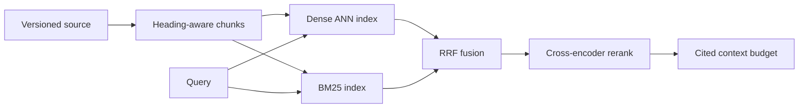
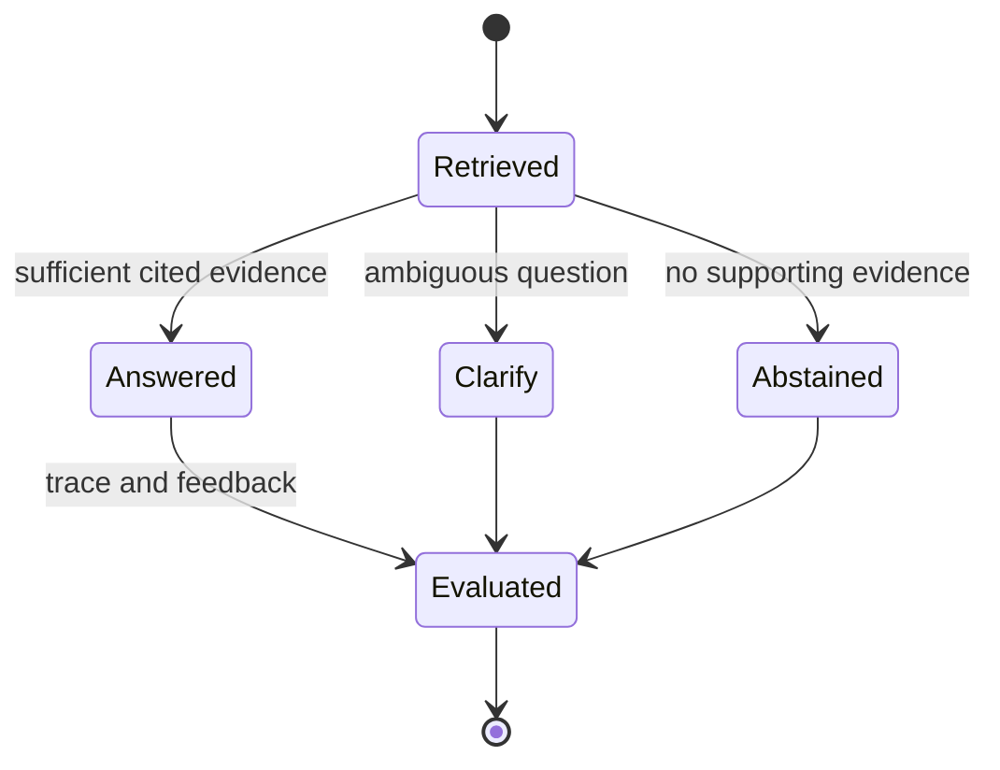

# Retrieval-Augmented Generation (RAG) Systems Architecture

Retrieval-augmented generation connects a language model to an external knowledge source at request time. It is useful when facts change, answers must be traceable, or a model needs private domain context without fine-tuning on every document revision. A convincing response is not evidence that retrieval, permissions, or freshness works.

## 🟢 Beginner Level

### The mental model: open-book answering

An ordinary language model answers from parameters learned before deployment. A RAG system first looks in an approved collection, then gives selected passages to the model as an open-book exam. The model writes the answer, while retrieval supplies evidence it should use.

For example, a support assistant receives: “Can a Pro customer receive a refund after 21 days?” The system searches the current refund policy rather than trusting whatever policy text happened to occur in model training data. It should cite the policy version and ask for clarification if the account tier or purchase channel changes the rule.

RAG is not a magical truth layer. A poor query, stale source, weak chunking rule, or wrong access filter can retrieve persuasive but irrelevant evidence. The generation layer may also overstate a source, so production designs check both retrieval quality and answer faithfulness.

### The parts of a RAG system

Most systems contain five responsibilities:

1. **Ingestion** reads source documents, extracts text, attaches metadata, and records a version.
2. **Chunking** divides text into retrieval-sized passages while retaining source identity.
3. **Indexing** creates lexical and vector representations that can be searched quickly.
4. **Retrieval** finds candidate passages permitted for the requesting user or tenant.
5. **Generation** receives the question and selected evidence, then answers or declines to answer.

The source of truth is the original document or database row, not the vector index. An index is a derived cache: it must be rebuilt safely when parsing, embeddings, or access rules change.

| Component | Primary job | Typical failure | First diagnostic |
|---|---|---|---|
| Ingestion | Capture current source text | Missed update | Compare source and indexed versions |
| Chunker | Preserve a retrievable idea | Sentence split in half | Inspect retrieved text around boundaries |
| Retriever | Find permitted evidence | Low recall or access leak | Review top-k with metadata |
| Reranker | Order candidates | Useful evidence pushed down | Compare before and after labels |
| Generator | Explain evidence | Unsupported claim | Check claims against citations |

### Chunks are retrieval units

Large documents are rarely useful as one embedding. A 40-page handbook may contain refunds, security, and employment topics whose meanings should not be averaged into one vector. Chunking creates small units with enough local context to answer one question.

A basic policy is 350 tokens per chunk with 50 tokens of overlap. Overlap protects a sentence or table that spans a boundary, but too much overlap duplicates evidence and wastes context-window space. A heading-aware splitter is usually better: split at sections first, then paragraphs, then sentences only if needed.

Metadata travels with every chunk. Useful fields include `document_id`, `source_url`, `title`, `section`, `updated_at`, `tenant_id`, `classification`, and `embedding_model`. Metadata makes a result inspectable and allows filters before evidence reaches the model.

### What is RAG (Retrieval-Augmented Generation)?
**Retrieval-Augmented Generation (RAG)** is an enterprise architecture pattern that connects Large Language Models (LLMs) to external domain-specific knowledge bases (databases, documentation, APIs) to ground responses in factual data and eliminate hallucinations.

---

## 🟡 Intermediate Level

### The 5-Step RAG Pipeline

1. **Document Ingestion & Chunking**: Splits large documents into smaller chunks (e.g. 512 tokens with 50-token overlap).
   - *Fixed-size Chunking*: Fast, but breaks sentences in half.
   - *Semantic Chunking*: Splits at natural paragraph/heading boundaries using NLP models.
2. **Embedding Generation**: Converts chunks into dense vectors using embedding models (e.g., `text-embedding-3-small`).
3. **Vector Storage**: Stores embeddings alongside text metadata in a vector database (`Qdrant`, `Pinecone`, `pgvector`).
4. **Hybrid Retrieval**: Combines **Dense Vector Search** (HNSW semantic search) with **Sparse Keyword Search** (BM25 / TF-IDF) using Reciprocal Rank Fusion (RRF).
5. **Re-Ranking & Generation**: Re-ranks top 50 retrieved chunks down to top 5 using a Cross-Encoder model (`cohere-rerank`), passes them into LLM context window.

### Worked hybrid retrieval example

Dense retrieval is strong for paraphrases: “cancel recurring billing” can match “terminate subscription.” Lexical search is strong for exact terms such as `ERR-4921`, plan names, and clause numbers. Production systems commonly retrieve candidates with both signals and fuse the rankings.

For reciprocal rank fusion, with rank constant $k=60$:

$$
\operatorname{RRF}(d) = \sum_r \frac{1}{k + \operatorname{rank}_r(d)}
$$

If the Pro refund policy ranks first in dense search and fourth in BM25, its score is $1/61 + 1/64 \approx 0.0320$. A standard policy ranked fifth and first scores $1/65 + 1/61 \approx 0.0318$. The result illustrates why RRF rewards evidence supported by different retrieval paths without comparing incompatible raw scores.

### Freshness and access control

Treat the vector index as derived data. A document update emits a versioned event; workers parse, chunk, embed, publish the new version, and retire the old one. A successful job that extracts empty text is still a retrieval failure, so monitor source-to-index lag and chunk counts.

Tenant IDs, ACLs, classifications, and effective dates are server-controlled retrieval filters. They are not instructions the model may infer from a prompt. Recheck selected source IDs before generation because a semantically relevant document from another tenant is still a data leak.

### Query transformation and routing

Users rarely phrase questions in the vocabulary used by source authors.

A query rewriter can turn “what happens if I stop paying?” into a retrieval query about cancellation,
grace periods, and subscription termination.

The rewrite must preserve the original question for display and evaluation.

Otherwise an overconfident rewrite can silently change user intent.

Decomposition helps compound questions.

“Can I cancel, receive a refund, and retain my data?” has at least three evidence needs.

Retrieve each sub-question separately, then assemble an answer with distinct citations.

Do not decompose a simple identifier lookup merely to look sophisticated.

Query expansion adds synonyms, product aliases, and spelling variants.

It can rescue recall when documents use historic names.

It can also broaden a precise query into an unsafe or irrelevant search, so log the expansion.

Routing selects the appropriate knowledge path.

A live balance belongs to a transactional API, not a stale prose index.

An error code may route first to lexical search, while a conceptual “why” question benefits from hybrid search.

The router should return a reason and a confidence value for observability.

Multi-query retrieval asks several differently phrased queries and merges their candidates.

This can improve recall for ambiguous language.

It also increases index load and duplicate candidates, so cap query count and deduplicate by document and span.

HyDE-style approaches generate a hypothetical answer or document for retrieval.

They can help when a user question is short.

They are risky in regulated domains because a hypothetical answer can pull retrieval toward an invented premise.

Keep the original query as one retrieval branch.

### Context budgeting and citation design

Every model call has a finite token budget.

Reserve tokens for system instructions, the user question, retrieved evidence, model output, and safety margin.

If a model supports 16,000 input tokens, allocating 14,000 to context leaves little room for a detailed answer or tool result.

Budgeting should be explicit in code and trace data.

Rank alone is insufficient when the top six chunks are all from one document.

Diversification can limit chunks per source or prefer different sections after the first strong hit.

That gives the model corroboration and reduces duplicated wording.

Citation IDs should be stable across a response.

For example, render `[S1] Refund policy, section 4, updated 2026-08-01` rather than a bare opaque vector ID.

The UI can show a short quoted span and link the user to the canonical source.

The generator must not manufacture citations.

Pass only the source IDs available in the assembled context and validate emitted IDs after generation.

If validation fails, repair the response or return a safe fallback.

Contradictory sources need a declared precedence rule.

An effective-date policy may outrank a FAQ, and a source marked withdrawn should never be retrieved.

When sources of equal authority conflict, report the conflict rather than selecting whichever passage the model likes.

### Retrieval evaluation with concrete numbers

Consider a labelled evaluation set of 200 support questions.

For each question, reviewers mark the source passages required for a complete answer.

If 176 questions retrieve at least one required passage in the first five results, recall@5 is $176 / 200 = 0.88$.

If those five-result lists contain 1,000 total passages and 260 are judged useful, precision@5 is $260 / 1000 = 0.26$.

High recall with low precision can still make generation hard because the model must sift noise.

Mean reciprocal rank rewards putting the first useful result early.

If the first relevant ranks for three queries are 1, 2, and 4, MRR is $(1 + 1/2 + 1/4) / 3 \approx 0.583$.

Use recall to choose candidate depth and MRR to evaluate ranking quality.

Faithfulness is not measured from answer fluency alone.

Human reviewers or carefully calibrated judges compare each factual claim with the retrieved evidence.

Track unsupported claims separately from incomplete answers.

An answer can be faithful but incomplete if retrieval missed the exception clause.

Latency evaluation must include the whole path.

Measure query embedding, lexical search, ANN search, reranking, prompt assembly, generation, and citation validation separately.

A 50 ms retrieval improvement is unhelpful if it causes a 400 ms reranking queue at peak load.

Evaluate filtered search separately from unfiltered search.

Tenant or date filters can change ANN recall characteristics drastically.

Use representative restrictive filters in test data, not just an unrestricted public corpus.

---

## 🔴 Expert Level

### Advanced RAG Optimization & Hallucination Guardrails

- **Parent-Child Chunk Retrieval**: Embeds small child chunks (128 tokens) for precise vector matching, but passes the parent document context (1024 tokens) to the LLM.
- **RAG Triad Metrics (Ragas Framework)**:
  1. **Faithfulness**: Is the LLM answer strictly derived from the retrieved context? (Prevents hallucination).
  2. **Answer Relevance**: Does the LLM answer address the user query?
 3. **Context Precision**: Are the top retrieved chunks actually relevant to the prompt?

Parent-child retrieval indexes a small child chunk for precise matching but sends its larger parent section to the model. This avoids answering from an isolated sentence that omits a qualification, exception, or effective date. Structured documents need structure-aware extraction: table headers, code-file context, and policy dates must survive ingestion.

### Production failure modes

**Prompt injection in sources** occurs when retrieved text attempts to change system instructions. Treat retrieved text as untrusted data, delimit it clearly, and never allow it to choose tools, credentials, or authorisation scope.

**Citation laundering** occurs when an answer cites a nearby source that does not support the actual claim. For high-risk answers, map claims to source spans and test contradictions in the evaluation set.

**Context overload** occurs when top-k is too large. Duplicate or contradictory passages dilute important evidence, raise latency, and increase cost. Prefer a diversified reranked set with explicit source dates over blindly filling a context window.

### Capacity and operational design

Vector capacity is a product requirement, not just an infrastructure number.

Estimate document count, average chunks per document, vector dimension, metadata size, replica count, and update rate before selecting an index.

One million 1,536-dimensional float32 vectors require roughly 6 GB for raw vectors alone.

Graph links, metadata, replicas, and working memory can multiply that footprint substantially.

Quantisation can reduce memory, but it changes recall.

Evaluate scalar or product quantisation against labelled questions before using it to meet a budget.

Cache only deterministic boundaries.

Embedding a repeated query can be cached using a normalised query and embedding-model version.

Retrieval caches must include tenant, permissions, corpus version, filter set, and query in their key.

Answer caches need all of those fields plus prompt and model version.

Missing one key component can become a privacy or freshness incident.

Rate limits protect both cost and relevance.

An attacker can submit long prompts that fan out into query rewrites, multiple retrievals, and expensive reranking.

Bound query length, rewrite count, candidate count, and maximum evidence tokens.

Return a clear response when a request exceeds the supported limit.

Trace every request with an opaque correlation ID.

A useful trace records route, retriever versions, filter hash, candidate IDs, reranker scores, selected context IDs, model version, latency breakdown, and answer outcome.

Do not log raw sensitive evidence by default.

Use access-controlled samples for debugging and define a retention policy.

An incident runbook begins with containment.

For an access-control leak, disable the affected collection or route before attempting an index rebuild.

For stale content, identify the last known good corpus version and either roll back an alias or reprocess affected sources.

For relevance collapse, compare a golden evaluation set across recent embedding, chunking, and ranking changes.

Canary releases reduce blast radius.

Publish a new index under a versioned name, send a small percentage of traffic to it, and compare retrieval and answer metrics.

Promote an alias only after quality and error budgets pass.

Keep rollback data until the new version is proven stable.

### When RAG is the wrong tool

RAG is poor at exact computation when a trusted deterministic service exists.

Use a calculator, database query, rules engine, or workflow API for balances, eligibility, and current inventory.

RAG can explain the result and cite the policy behind it, but should not substitute for authoritative computation.

RAG is also weak when the corpus is tiny and stable.

A maintained FAQ or direct prompt context can be cheaper and more reliable than operating ingestion, indexes, and evaluation.

Fine-tuning and RAG solve different problems.

Fine-tuning can improve output style, tool selection, or domain patterns.

RAG provides updatable facts and citations.

Many production systems use both, with RAG remaining the evidence path.

Choose the simplest evidence path that can meet the required freshness, access-control, latency, and citation guarantees.

### Common Misconceptions

1. **“RAG eliminates hallucinations.”** Retrieval reduces dependence on stale model knowledge, but the generator can still misread or invent around evidence. Faithfulness checks and abstention remain necessary.
2. **“The vector database is the source of truth.”** It is a derived retrieval index. Canonical source versions and access rules must drive reindexing.
3. **“More context always improves answers.”** Excess context competes for attention and exposes contradictions. Ranking and token budgeting matter more than volume.
4. **“Metadata filtering is optional.”** In a multi-tenant system it is an authorisation boundary. Relevance never authorises disclosure.

### Interview Questions

**Q1. What problem does RAG solve that fine-tuning does not solve well?** `[easy]`

RAG supplies changing or private facts at query time without retraining weights for every document revision. The retrieval layer can cite an effective policy version and enforce user access rules before generation. Fine-tuning can teach style or behaviour, but it does not itself provide provenance.

**Q2. Why keep metadata with every chunk?** `[easy]`

Metadata provides source identity, version, permissions, and a displayable citation. It lets the server constrain retrieval before text reaches the model. Without it, relevance debugging and access-control proof become difficult.

**Q3. When is lexical retrieval preferable to dense retrieval?** `[easy]`

Lexical retrieval is strong when exact tokens matter, such as error codes, SKUs, clause numbers, or acronyms. BM25 rewards rare matching terms that an embedding can blur into a broad concept. Hybrid retrieval retains this exact-match path.

**Q4. What does an abstaining RAG assistant do?** `[easy]`

It states that retrieved sources do not support a confident answer instead of filling the gap with plausible text. It can request a missing identifier or direct the user to an owner. Abstention must be designed and evaluated, not assumed from a prompt.

**Q5. Why is a reranker placed after ANN retrieval?** `[medium]`

A cross-encoder reads a query and passage together, so it is precise but expensive per pair. ANN retrieval cheaply narrows millions of chunks to a candidate set first. Running the cross-encoder across the corpus would make interactive latency impractical.

**Q6. Why use reciprocal rank fusion for hybrid search?** `[medium]`

RRF combines ranked lists without assuming vector and BM25 scores share a numeric scale. It rewards a document appearing near the top of multiple retrievers. It ignores score magnitude, so learned ranking can win when labelled relevance data exists.

**Q7. How should a policy update reach a vector index?** `[medium]`

Emit a versioned change event, parse and chunk the source, embed it, and publish the new chunk set atomically. Retire older chunks so search cannot blend conflicting versions. Monitor event lag and extraction counts because successful jobs can still create unusable text.

**Q8. What is parent-child retrieval's trade-off?** `[medium]`

Small child chunks improve match precision and reduce unrelated index text. Larger parent sections provide qualifications and neighbouring facts for generation. The pattern costs more storage and assembly logic but reduces answers based on isolated sentences.

**Q9. Why evaluate retrieval separately from generation?** `[medium]`

A fluent answer can hide that retrieval selected the wrong evidence, while correct evidence can be summarised poorly. Recall@k and context precision diagnose retrieval; faithfulness and answer relevance diagnose generation. Separating them makes remediation clear.

**Q10. How should a multi-tenant RAG service enforce access control?** `[medium]`

The server derives tenant and principal filters from authenticated identity, never from the prompt. It applies them during retrieval and rechecks selected source IDs before generation. Isolated collections provide defence in depth for sensitive data.

**Q11. What causes context-window degradation?** `[medium]`

Many weakly relevant or duplicate chunks dilute important evidence and can expose contradictory versions. They also increase token cost and latency. Use reranking, deduplication, source diversity, and a deliberate context budget.

**Q12. Scenario: users receive old policy answers after a CMS update. What do you check?** `[hard]`

Compare the CMS version and timestamp with indexed chunk versions and ingestion-event status. Inspect parser output, chunk counts, and retirement of old chunks. The cause may be a missed CDC event, non-atomic index swap, or cache key lacking a source version; increasing top-k does not fix freshness.

**Q13. Scenario: an employee receives a cited answer about another customer. What failed?** `[hard]`

The retrieval path treated authorisation as optional metadata rather than a server-enforced filter. Disable the affected collection, inspect traces for cross-tenant results, and follow incident policy for exposure. Remediate with authenticated filters, retrieval tests, and tenant-isolated indexes where appropriate.

**Q14. Scenario: relevance falls after top-k rises from 8 to 40. Why?** `[hard]`

The larger context likely introduced marginal, duplicate, or contradictory passages that competed with the relevant policy section. Compare reranker scores, source versions, and faithfulness labels for both configurations. Restore a budgeted diversified context and tune retrieval depth separately from generation context.

### Further Reading

- [Lewis et al., Retrieval-Augmented Generation for Knowledge-Intensive NLP Tasks](https://arxiv.org/abs/2005.11401) introduces the original RAG formulation.
- [Sentence Transformers semantic-search documentation](https://www.sbert.net/examples/sentence_transformer/applications/semantic-search/README.html) explains query and document encoders.
- [Elasticsearch reciprocal rank fusion reference](https://www.elastic.co/docs/reference/elasticsearch/rest-apis/reciprocal-rank-fusion) documents practical RRF parameters and trade-offs.
