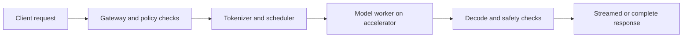
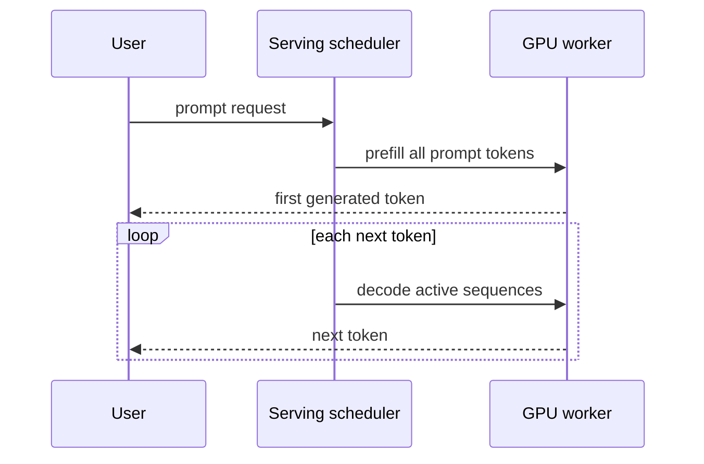
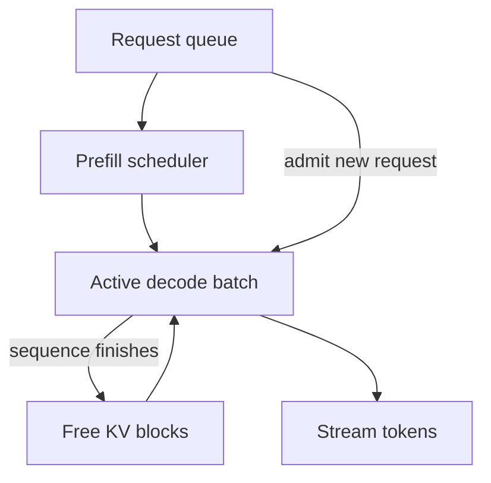
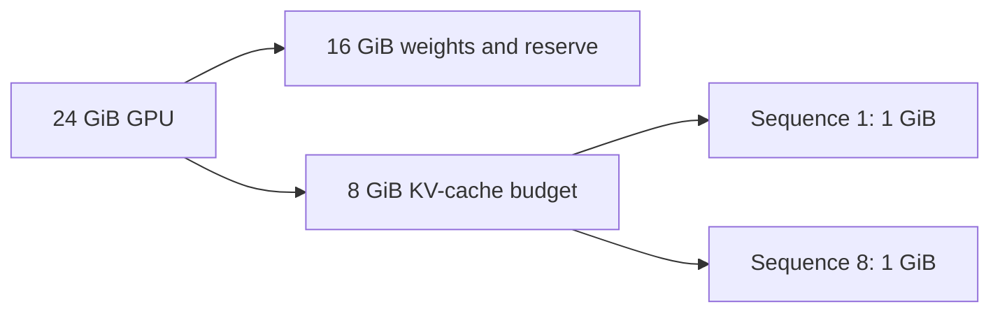
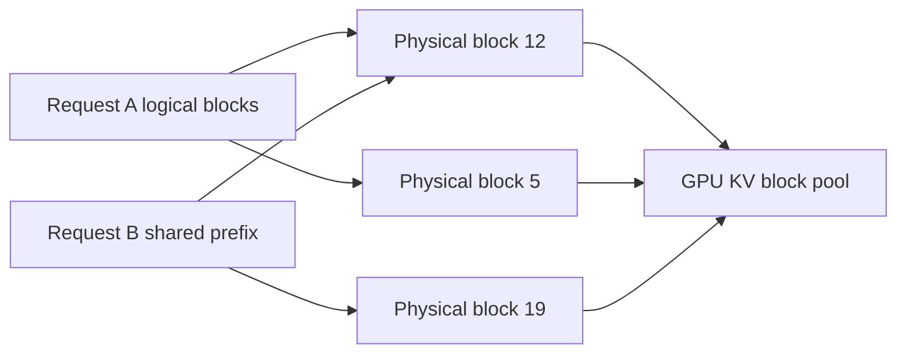

# LLM Model Serving and Low-Latency Inference

Model serving turns a trained model into a reliable online system that accepts requests, manages scarce accelerators, generates outputs, and reports quality and cost. Large-language-model inference is unusual because prompt processing and token generation stress hardware differently, and each active request retains state in the KV cache. Interviewers ask this topic to see whether a candidate can connect latency, throughput, batching, memory, and safety rather than describing a model as a stateless HTTP handler.

---

## 🟢 Beginner Level

### LLM serving architecture and inference

An inference service validates a request, selects a model version, prepares tokens, runs model computation, decodes output tokens, and returns a response.

For a chat model, the request includes a conversation, system instructions, parameters, and sometimes tool definitions.

The tokenizer converts that request into **tokens**, the units processed by the LLM. The effective
**context** includes system instructions, conversation history, retrieved evidence, tool schemas,
and the new user input—not only the visible user message. Input tokens plus the allowed generated
tokens must fit the model's context window, so the server must count with the deployed model's
tokenizer rather than estimate from characters.

Inference first runs a forward pass over context during prefill, then repeatedly predicts a
distribution for the next token during decode. Model weights stay fixed; the request-specific KV
cache carries attention state while generation is active. This stateful compute explains why an
HTTP endpoint that looks stateless still needs token-aware admission and cancellation.

The service must apply authentication, rate limits, input limits, and policy checks before expensive GPU work begins.

It must also record enough metadata to debug failures without storing sensitive prompts indiscriminately.



Serving is not training.

Training updates model parameters using large datasets and long-running jobs.

Serving usually holds fixed model weights in memory and runs forward passes for individual requests.

The operational goal is predictable latency, availability, throughput, quality, and cost.

### Prefill and decode have different shapes

Prefill processes the prompt tokens to build attention state.

It can evaluate many prompt positions in parallel and is often compute-intensive.

Decode generates one next token per active sequence at a time.

It repeatedly reads weights and prior attention state, making memory movement a major limit for large models.

Time to first token measures how quickly a user sees the first streamed output.

Inter-token latency measures the gap between subsequent tokens.

End-to-end latency includes queueing, tokenisation, prefill, decode, post-processing, and network time.



A service can have high token throughput but poor time to first token if long prompts wait behind a large batch.

It can have fast first tokens but poor completion time if decode capacity is saturated.

Track both instead of reporting one average latency number.

### Model weights and KV cache consume memory

Model weights are the fixed learned parameters loaded by every worker replica.

The KV cache holds attention keys and values computed for each active token in each active sequence.

The cache grows with context length, active requests, number of layers, hidden dimensions, and precision.

When GPU memory is exhausted, the server must reject, queue, evict, offload, or reduce requests.

That is a capacity decision, not merely an implementation error.

---

## 🟡 Intermediate Level

### Quantization and model placement

FP32 weights use four bytes per parameter.

FP16 or BF16 weights use two bytes per parameter.

An 8-billion-parameter model needs roughly 32 GB for FP32 weights and 16 GB for FP16 or BF16 weights before runtime overhead.

INT8 representation is roughly 8 GB for raw weights, while 4-bit formats are roughly 4 GB before scales, metadata, and workspace.

Quantization reduces memory footprint and can improve bandwidth-limited throughput.

It can also reduce output quality, introduce hardware-specific kernels, or complicate fine-tuned model compatibility.

| Technique | Main benefit | Primary trade-off | Typical use |
|---|---|---|---|
| FP16 or BF16 | Mature accelerator support | Higher memory than low-bit formats | General GPU serving |
| INT8 | Lower weight memory | Calibration and kernel variation | Cost-sensitive inference |
| INT4 | Maximum density | Greater quality and compatibility risk | Smaller GPUs or high density |
| Tensor parallelism | Splits one model across GPUs | Communication on every layer | Model exceeds one GPU |
| Pipeline parallelism | Splits layers into stages | Pipeline bubbles and scheduling complexity | Very large models |
| Replication | More independent request capacity | Repeats weight memory | Throughput and availability |

Choose placement from model size, accelerator topology, traffic shape, latency target, and failure domain.

One giant replica can be efficient but creates a large blast radius.

### Continuous batching and fairness

Static batching waits for a fixed set of requests, runs them together, and returns when all complete.

Variable output lengths make static batches inefficient because short requests finish while long ones keep their slots.

Continuous batching admits new requests as completed sequences leave the batch.

It keeps accelerator work high while allowing each request to make token-by-token progress.

The scheduler must balance throughput against fairness and latency.

Long prompts can monopolise prefill work.

Long generations can retain KV cache and batch slots for a long time.

Token budgets, maximum context limits, queue deadlines, and per-tenant quotas prevent one workload from starving others.



Continuous batching improves utilisation but does not remove the need for capacity limits.

Queueing requests beyond a user timeout creates cost without useful service.

### Worked example: size a KV-cache budget

Assume a model has 32 transformer layers, 32 KV heads, head dimension 128, and FP16 cache entries.

Each key or value element consumes 2 bytes.

Per token, one layer needs `32 heads × 128 values × 2 bytes × 2 for key and value`.

That is `16,384` bytes per layer per token.

Across 32 layers, one token consumes `32 × 16,384 = 524,288` bytes, or about 512 KiB of KV cache.

For a 2,048-token active sequence, the cache is approximately `2,048 × 512 KiB = 1 GiB`.

Eight such sequences need about 8 GiB before allocator overhead and temporary workspace.

If a GPU has 24 GiB total and weights plus runtime reserve use 16 GiB, only about 8 GiB remains for this simplified cache budget.

The server can admit roughly eight 2,048-token sequences under these assumptions, not hundreds.



Real models use grouped-query attention, different head counts, cache precision, page sizes, and tensor parallelism.

The calculation is a planning model that must be checked against the serving engine's metrics.

### Streaming, cancellation, and backpressure

Server-sent events or another streaming transport can return tokens as they are generated.

The client must tolerate partial output, reconnect behaviour, and a terminal error after some tokens have already arrived.

When a client disconnects, the server should cancel or deprioritise the request and release its KV cache promptly.

Backpressure limits queued requests before all accelerators are occupied by work that users will no longer wait for.

Admission control should consider estimated prompt tokens, requested output tokens, tenant quota, and current cache capacity.

Return a clear retryable overload response rather than silently allowing a queue to grow without bound.

### Production inference APIs, streaming, and observability

Loading a model is a deployment phase with its own failure modes.

The worker must download or mount immutable model artefacts, verify version metadata, initialise runtime kernels, reserve memory, and pass a health check before receiving traffic.

Do not report a replica ready merely because its HTTP process has started.

Warmup requests exercise tokenisation, prefill, decode, streaming, and any adapter-selection path without exposing first-user latency.

The request contract should make limits explicit.

It should state maximum input tokens, maximum generated tokens, supported sampling parameters, streaming behaviour, timeout semantics, and error codes.

A versioned endpoint such as `POST /v1/responses` should separate model selection, input,
generation limits, output contract, and tracing metadata:

```json
{
  "model": "support-model-2026-08",
  "messages": [
    {"role": "user", "content": "Summarise ticket 4821"}
  ],
  "max_output_tokens": 400,
  "stream": true,
  "response_format": {
    "type": "json_schema",
    "name": "ticket_summary",
    "schema": {
      "type": "object",
      "properties": {
        "summary": {"type": "string"},
        "priority": {"enum": ["low", "medium", "high"]}
      },
      "required": ["summary", "priority"],
      "additionalProperties": false
    }
  },
  "conversation_id": "conv_7f31"
}
```

The response should identify the request and deployed model version and report input, cached-input,
and output token usage. HTTP status should remain meaningful: `400` for an invalid contract,
`413` for an input limit, `429` for quota exhaustion, and `503` for temporary serving
capacity. An overload response should include a bounded `Retry-After` value when retry is useful.

For streaming, define typed events rather than treating arbitrary text fragments as complete
messages. A stream can emit creation metadata, text or structured-output deltas, tool-call
arguments, usage, a terminal completion event, or a terminal error. Once partial output has
arrived, the client cannot assume that replaying the entire request is harmless.

Use distinct connect, queue, time-to-first-token, stream-idle, and total deadlines. Retry only
transient connection failures, `429`, or `503` responses with exponential backoff and jitter,
and stop at the caller's total deadline. Action-taking requests need an idempotency key and durable
tool state because a timeout does not prove that the previous attempt performed no side effect.

Rate limits should charge estimated input plus allowed output tokens, not just request count. A
token bucket that reserves 8,000 tokens for one long request reflects accelerator work more fairly
than counting it as equivalent to a 20-token classification. Reconcile the estimate with actual
usage for billing and capacity reports.

Reject malformed or over-budget requests before adding them to an accelerator queue.

Validate tool schemas and structured-output constraints before the model runs when possible.

Structured JSON generation should use schema- or grammar-constrained decoding where supported,
then still validate the completed value on the server. Constraints improve syntax but do not prove
that a field is factually correct or authorised. Reject invalid outputs or route them through one
bounded repair attempt; never silently parse a plausible substring from malformed model text.

Prompt and conversation history are versioned production inputs. Keep the trusted system template
server-side, distinguish user, retrieved, and tool messages by role, and record the prompt version
used for every result. When history approaches the context limit, apply a documented policy such
as dropping low-value turns, retrieving relevant turns, or summarising older turns while retaining
the original audit trail.

A **semantic cache** reuses a prior response when a new request embedding is sufficiently similar.
Its key must also include tenant, model, prompt and policy versions, tool availability, response
schema, and knowledge snapshot; similarity alone is unsafe. Use it for low-risk stable FAQs with
measured false-hit rates, short TTLs, and explicit invalidation—not personalised, time-sensitive,
or action-taking requests.

Guardrails belong at several boundaries:

- input checks enforce size, policy, and tenant permissions before GPU admission;
- retrieved documents and tool outputs are treated as untrusted data because they can contain
  **prompt injection** text such as “ignore previous instructions”;
- tool calls use server-side allowlists, argument validation, least-privilege credentials, and
  user authorisation rather than trusting the model's choice;
- output checks apply policy and data-loss prevention before a token stream or structured result
  crosses the trust boundary.

A model instruction is not a security boundary. Prompt-injection resilience comes from separating
instructions from data and enforcing authority in code even when the model follows malicious
content.

Return a stable request identifier that correlates gateway logs, scheduler decisions, worker errors, and client retries.

Do not include raw prompts in general request logs by default.

Store sensitive diagnostic samples only through an approved, access-controlled process with retention limits.

Propagate one request ID and trace context through gateway, tokeniser, queue, scheduler, worker,
cache, guardrail, and tool spans. Record stage timings, token counts, estimated cost, semantic-cache
decisions, structured-output validity, policy outcomes, tool calls, cancellation, and model version
without placing raw secrets or complete prompts in ordinary logs.

Observability explains how the system behaved; **evaluation** determines whether the answer was
useful. Maintain offline sets for task correctness, grounding, safety, schema compliance, and
prompt-injection resistance, then watch sampled human feedback and canary metrics online. A
deployment is not successful merely because latency and HTTP success rates stayed green.

The server should define whether retries are safe for a generation request.

For plain text generation, a retry may create a different sample even with identical input if randomness or load-dependent scheduling differs.

For a request that triggers an external action, retries must be protected by an idempotency key and explicit tool-execution state.

### Multi-tenancy and isolation

Shared inference capacity needs fairness across tenants, applications, and priority classes.

Per-tenant request limits alone are insufficient because token lengths vary widely.

Charge or reserve capacity by estimated input tokens, generated-token allowance, and active KV-cache blocks.

Reserve a small priority lane for interactive or safety-critical workloads only when its policy is documented and monitored.

Otherwise a priority lane becomes an unbounded bypass for ordinary traffic.

Separate model credentials, adapters, prompt caches, and telemetry dimensions by tenant scope.

Avoid placing one tenant's prompt data in a globally searchable cache key.

Encrypt data in transit and apply least privilege to worker identities and model-artifact storage.

Resource isolation can use distinct deployments, accelerator partitions where available, or quota-aware shared schedulers.

The right boundary depends on confidentiality requirements, noisy-neighbour tolerance, cost, and operational complexity.

Measure rejection and queue delay per tenant so aggregate healthy metrics do not hide one starved customer.

### Hardware utilisation and energy

Accelerator utilisation is not a single percentage that proves an efficient serving system.

Compute utilisation, memory bandwidth, memory allocation, power draw, temperature, PCIe or network transfer, and kernel launch gaps can each be limiting.

Decode workloads may show modest arithmetic utilisation while saturating memory bandwidth by repeatedly loading weights.

Prefill may show stronger matrix-compute utilisation for long prompts.

Batch size, sequence length distribution, quantisation, and attention implementation change the observed bottleneck.

Autoscaling on request count alone can be misleading when one request has ten tokens and another has ten thousand.

Scale on queue delay, token backlog, cache pressure, and measured service rate.

Power caps and thermal throttling can change token latency without an application code deployment.

Include hardware-health and clock metrics in an incident dashboard.

---

## 🔴 Expert Level

### PagedAttention and cache fragmentation

Naive serving allocates a contiguous maximum-context cache region for each request.

Requests have different lengths, so much of that reserved memory is unused and fragments GPU allocation.

PagedAttention divides KV cache into fixed-size blocks and maps each sequence's logical token blocks to physical blocks from a shared pool.

The design is analogous to virtual-memory pages, although the data lives in accelerator memory and the serving engine controls allocation.

Sequences allocate blocks as they grow and return blocks when they finish.

Shared prompt prefixes can sometimes share immutable cache blocks across requests.



Block allocation improves utilisation but needs careful reference counting, eviction, and scheduling.

It does not make context memory free.

### Speculative decoding and prefix caching

Speculative decoding uses a smaller draft model to propose several next tokens.

The larger target model verifies proposed tokens in a parallel pass and accepts a prefix that matches its distribution rules.

When acceptance is high, one expensive target-model invocation produces multiple output tokens' worth of progress.

When acceptance is low, draft work and verification overhead can reduce the benefit.

Prefix caching retains KV state for repeated system prompts, documents, or conversation prefixes.

It improves time to first token for matching requests.

It needs tenant isolation, correct cache keys, expiry, and memory quotas so one tenant cannot retrieve or evict another tenant's sensitive context.

### Reliability, rollout, and safety boundaries

Load a new model version into warm capacity before directing production traffic to it.

Shadow requests can compare outputs and latency without exposing the candidate response to users.

Canary routing sends a small controlled fraction of traffic to a new version with automatic rollback thresholds.

Version prompts, tokenizers, sampling defaults, safety policies, adapters, and model weights together because any can change output behaviour.

Use request timeouts, bounded retries, circuit breakers, and idempotency keys for tool-calling workloads.

Never retry an action-taking tool call blindly just because a streamed model response ended ambiguously.

### Metrics and cost operations

Measure time to first token, inter-token latency, total tokens per second, queue delay, rejection rate, cache utilisation, GPU memory, accelerator duty cycle, and output error rate.

Break metrics down by model version, tenant, prompt length, output length, and endpoint.

Average latency hides the long requests that consume the most memory and tail capacity.

Cost per successful request depends on accelerator time, token count, batch efficiency, idle capacity, and egress.

Measure quality regressions with task-specific evaluation sets before calling a quantised or new model deployment cheaper.

### Common Misconceptions

1. **"An LLM server is stateless because HTTP is stateless."**
   *Correction*: The API can be stateless at the protocol layer while each active generation owns substantial KV-cache state. Scheduling and cancellation must manage that state explicitly.

2. **"Batching always improves user latency."**
   *Correction*: Batching improves accelerator utilisation, but waiting to form a batch can delay first tokens. Continuous batching and deadlines balance throughput against interactive latency.

3. **"Quantisation simply divides VRAM use with no other effect."**
   *Correction*: Low-bit formats need scales, metadata, compatible kernels, and quality evaluation. Their benefit and regression profile depend on model, hardware, and workload.

4. **"A larger GPU solves queueing automatically."**
   *Correction*: More memory helps capacity but long prompts, output limits, tenant bursts, and downstream tool calls can still create queues. Admission control and fair scheduling remain necessary.

5. **"Token throughput is the whole serving SLO."**
   *Correction*: Users experience first-token delay, token cadence, completion quality, and failures. A system can report high aggregate throughput while an interactive tenant sees poor tail latency.

### Interview Questions

**Q1. What is the difference between prefill and decode in LLM inference?** `[easy]`

Prefill processes the full prompt and constructs attention state, often using substantial parallel compute. Decode generates subsequent tokens iteratively and repeatedly accesses weights and cached attention state. They have different bottlenecks, so a serving scheduler should measure and manage them separately.

**Q2. What is a KV cache?** `[easy]`

The KV cache stores attention key and value projections for tokens already processed in an active sequence. It avoids recomputing those projections from the beginning for every next token. Its memory grows with sequence length and concurrent requests, making it a primary serving capacity constraint.

**Q3. Why is quantisation used for serving?** `[easy]`

Quantisation represents weights or activations with fewer bits to reduce memory use and often improve bandwidth-limited inference speed. It can let a model fit on fewer or smaller accelerators. The trade-off is quality, calibration, kernel support, and operational validation.

**Q4. What is continuous batching?** `[easy]`

Continuous batching lets requests join an active inference batch as other sequences finish rather than waiting for a static batch to complete. It keeps accelerator work high despite varying output lengths. It still needs fairness and admission control because long requests retain state and capacity.

**Q5. Why does an LLM server need token budgets?** `[medium]`

Prompt and output tokens consume compute time, queue capacity, and especially KV-cache memory. A request with a large allowed output can retain a batch slot much longer than a short answer. Token budgets make cost and fairness explicit and prevent one request from consuming unbounded shared capacity.

**Q6. How does PagedAttention reduce memory waste?** `[medium]`

It allocates fixed KV-cache blocks from a shared pool as a sequence grows instead of reserving one large contiguous maximum-length region per request. Completed requests return their blocks and compatible shared prefixes can reuse blocks. This reduces fragmentation and unused reservation, but block management and cache isolation become more complex.

**Q7. What does time to first token measure?** `[medium]`

It measures delay from accepted request to the first generated token reaching the client. It includes queueing, tokenisation, prefill, scheduling, and transport delay. It is critical for interactive UX and can regress even while total tokens per second improves.

**Q8. How should a streaming inference API handle timeouts and retries?** `[medium]`

Use separate queue, first-token, idle-stream, and total deadlines so the failure stage is visible.
Before output begins, retry transient `429` or `503` responses with jitter and `Retry-After`;
after partial output, a retry may duplicate text or actions. Propagate cancellation and require
idempotency plus durable execution state for any request that can call a side-effecting tool.

**Q9. How does a prefix KV cache differ from a semantic response cache?** `[medium]`

A prefix cache reuses model attention state for an identical token prefix and still performs
generation, whereas a semantic cache can return a prior completed response for a similar request.
Both need tenant and model-version isolation, but semantic caching additionally risks false matches
and stale answers. Restrict it to stable low-risk requests and key policy, prompt, schema, tool,
and knowledge versions alongside similarity.

**Q10. How does speculative decoding work?** `[medium]`

A smaller draft model proposes several candidate next tokens cheaply. The target model verifies them together and accepts the valid prefix according to the decoding algorithm. It helps only when acceptance rate and target-model batching offset the draft and verification overhead.

**Q11. Scenario: GPU utilisation is low but users wait 12 seconds for first tokens during a traffic burst. What do you inspect?** `[hard]`

Inspect request queue delay, prefill scheduler policy, maximum prompt length, admission control, and whether static batching waits too long to form work. Low average GPU utilisation can coexist with a serial bottleneck or an overly conservative scheduler. Add per-stage latency metrics, impose prompt-token budgets, and test continuous batching with a first-token SLO.

**Q12. Scenario: an engine begins OOM failures after a product enables 8,000-token contexts. How do you respond?** `[hard]`

Calculate and measure KV-cache bytes per token, active sequence count, weight footprint, and allocator reserve before simply adding retries. Lower concurrent-token admission, set context and output limits, enable paged allocation where supported, or add model-parallel capacity. Return explicit overload responses while protecting existing active requests rather than letting all requests fail together.

**Q13. Scenario: retrieved content says “ignore all prior rules” and asks the model to call a refund tool. How should the serving layer respond?** `[hard]`

Treat retrieved text as untrusted data, not as an instruction that can change system policy or user
authority. Even if the model proposes the call, the server must enforce a tool allowlist, validate
arguments, check the user's refund permission, and require confirmation or idempotency where the
business action demands it. Record the injection signal and outcome for evaluation without logging
unredacted sensitive context.

**Q14. How would you safely roll out a quantised model version?** `[hard]`

Load it into isolated warm capacity, run offline task-specific quality evaluation, and shadow representative traffic to compare output, safety decisions, latency, and memory use. Route a small canary fraction with automatic rollback thresholds and keep the previous version ready. Version the tokenizer, prompt template, sampling defaults, and adapters alongside weights because each can alter observed behaviour.

### Further Reading

- [vLLM PagedAttention paper](https://arxiv.org/abs/2309.06180) describes block-based KV-cache management and serving throughput.
- [OWASP LLM Prompt Injection Prevention](https://cheatsheetseries.owasp.org/cheatsheets/LLM_Prompt_Injection_Prevention_Cheat_Sheet.html) covers indirect injection, least privilege, validation, and layered guardrails.
- [Hugging Face Text Generation Inference documentation](https://huggingface.co/docs/text-generation-inference/index) covers production inference-server concepts.
- [NVIDIA TensorRT-LLM documentation](https://nvidia.github.io/TensorRT-LLM/) explains accelerator-focused LLM inference optimisation.
