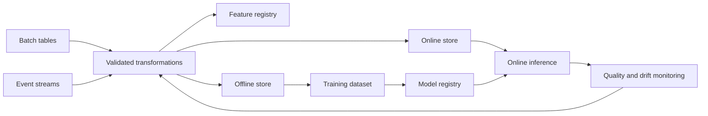
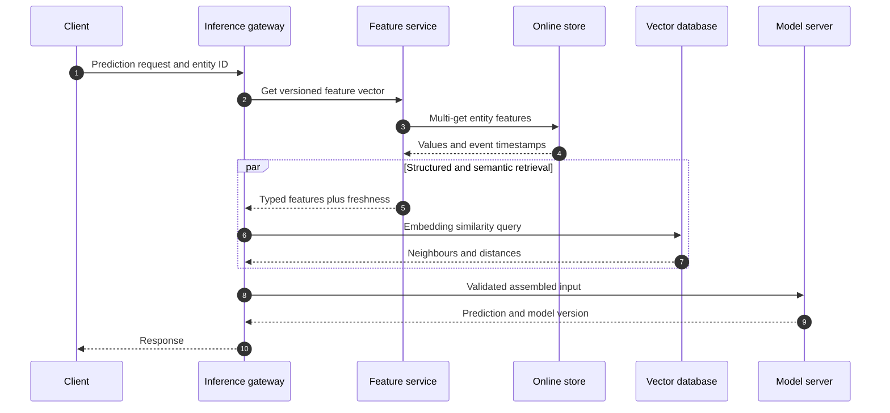
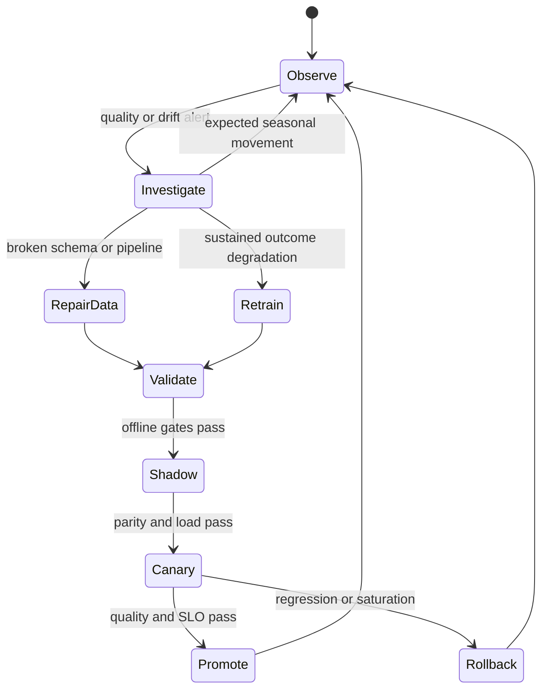
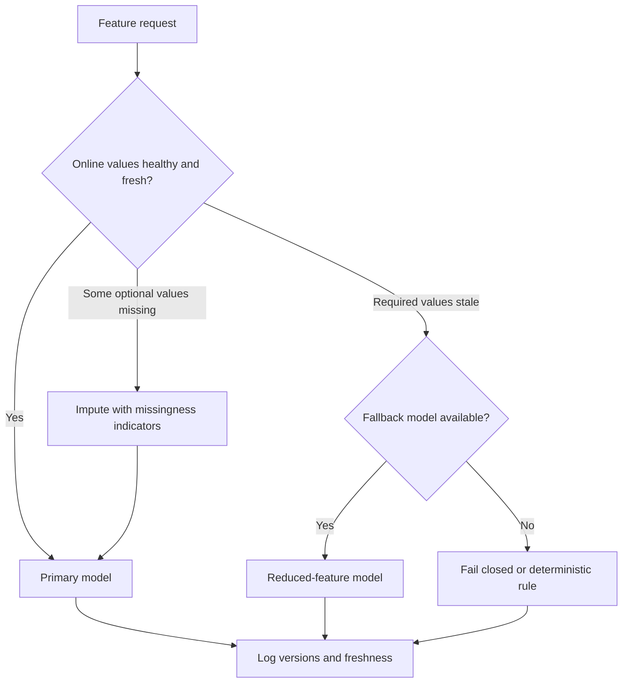

# Feature Stores, Data Drift, and MLOps Operations

A feature store is the consistency layer between raw production data, reproducible model training, and low-latency inference. It makes feature definitions, historical values, online values, ownership, and freshness observable so a model can be trained and served with the same meaning. Interviewers use this topic to test whether a backend engineer can reason about event time, distributed serving, data quality, and safe model operations rather than treating deployment as a single prediction endpoint.

---

## 🟢 Beginner Level

### Features and the purpose of a feature store

A **feature** is a model input derived from one or more raw facts. A payment service may emit an immutable transaction event, while a fraud model consumes derived values such as `card_payments_10m`, `account_age_days`, and `merchant_chargeback_rate_30d`.

A **feature store** is a system for defining, computing, discovering, storing, and serving those values consistently. It usually coordinates several specialised stores rather than replacing a data warehouse, stream processor, cache, or vector database.

The central problem is reuse with correctness. Without a shared feature definition, a training notebook might compute a 30-day average in SQL while the serving service computes a subtly different 29-day average in Java, producing **training-serving skew**.

A useful feature record includes more than a scalar value:

| Field | Example | Why it matters |
|---|---|---|
| Entity key | `customer_id=4182` | Identifies the subject of the feature |
| Feature name | `purchase_total_24h` | Provides a stable semantic contract |
| Value | `286.40` | Becomes a model input |
| Event timestamp | `2026-08-30T09:58:00Z` | Enables historical time-correct joins |
| Created timestamp | `2026-08-30T09:58:12Z` | Exposes pipeline delay and late arrival |
| Definition version | `purchase_total_24h:v3` | Links the value to code and schema |

### The feature lifecycle

Feature management spans both data engineering and model operations. Raw events are validated, transformed into reusable features, written to historical storage, materialised into an online store, consumed by models, and monitored after deployment.



The **feature registry** stores metadata: names, types, owners, entity keys, transformation versions, and expected freshness. The offline and online stores hold values optimised for different access patterns.

### Offline store versus online store

An **offline store** retains large historical datasets for training, backfills, audits, and batch inference. Columnar tables in a warehouse or object store favour scans over billions of rows and can preserve months or years of event-time history.

An **online store** serves the latest feature vector for one entity during an interactive request. A key-value system favours predictable point lookups, replication, and millisecond latency over arbitrary analytical queries.

| Dimension | Offline store | Online store |
|---|---|---|
| Primary use | Training and batch scoring | Real-time inference |
| Query shape | Historical scans and joins | Point lookup by entity key |
| Typical retention | Months or years | Latest value or short history |
| Latency target | Seconds to minutes | Single-digit to low tens of milliseconds |
| Common backing system | Warehouse, lakehouse, Parquet | Redis, DynamoDB, Cassandra |
| Source of truth | Historical feature events | Derived serving projection |

The two stores are not independent truths. The online value should be a materialised projection of the same versioned transformation used to build offline training data.

### Batch, stream, and request-time features

Features arrive through three common computation paths:

1. **Batch features** run on a schedule, such as a nightly 90-day customer lifetime value.
2. **Streaming features** update as events arrive, such as failed logins within the last ten minutes.
3. **Request-time features** are only available within the current request, such as the amount of a proposed transaction.

These paths can meet in one inference vector. The serving layer may fetch stored features, combine them with request fields, validate the resulting schema, and invoke the model.

### Freshness, staleness, and availability

**Feature freshness** measures how far the served value lags behind the newest source event that should influence it. It is not the same as cache age: a value written five seconds ago can still be stale if its upstream stream processor is thirty minutes behind.

A feature contract should declare a freshness service-level objective, for example: “99.9% of `failed_logins_10m` values are no more than 60 seconds behind event time.” Monitoring needs both the feature timestamp and pipeline watermark to verify that promise.

If a feature is missing or stale, the service needs an explicit policy. Options include a safe default, the last known value with a staleness indicator, a reduced-feature fallback model, or failing closed for high-risk decisions.

---

## 🟡 Intermediate Level

### MLOps, feature serving, and operational monitoring

**MLOps** treats data, feature definitions, models, deployments, and observations as versioned production assets. A reliable control plane records ownership and lineage, while a data plane computes and serves feature values.

The feature registry belongs to the control plane. Batch jobs, stream processors, offline tables, online key-value stores, caches, vector indexes, and inference services form the data plane.

Operational monitoring must cover four layers:

| Layer | Signals | Example failure |
|---|---|---|
| Infrastructure | Latency, errors, saturation, availability | Online store shard is overloaded |
| Data quality | Missingness, range, type, cardinality | Age becomes a string or is 80% null |
| Feature behaviour | Freshness, distribution, skew | A counter stops updating |
| Model outcome | Calibration, slice metrics, business KPI | Recall falls for one region |

An inference endpoint returning HTTP 200 only proves that code ran. It does not prove that the feature vector was current, semantically correct, or useful.

### Point-in-time correctness and leakage prevention

A historical training row must use only information that was available when its label event occurred. A **point-in-time join** chooses the latest feature event whose event timestamp is less than or equal to the observation timestamp, subject to any validity window.

Suppose a fraud-training example represents a transaction at `10:00:00`:

| Feature event | Event time | Arrival time | Value |
|---|---:|---:|---:|
| Account risk update A | `09:45:00` | `09:45:08` | `0.18` |
| Account risk update B | `10:03:00` | `10:03:04` | `0.91` |
| Late risk update C | `09:55:00` | `10:08:00` | `0.32` |

An offline job run at noon must not simply select the physically latest row, because that would choose `0.91`, a value produced after the transaction. With an event-time point-in-time join, update A is available in the first training build; after late update C is accepted and the dataset is rebuilt, `0.32` is correct because its event time preceded the transaction.

```sql
SELECT observation.transaction_id,
       feature.risk_score
FROM fraud_observations AS observation
LEFT JOIN account_risk_history AS feature
  ON feature.account_id = observation.account_id
 AND feature.event_time <= observation.transaction_time
QUALIFY ROW_NUMBER() OVER (
  PARTITION BY observation.transaction_id
  ORDER BY feature.event_time DESC, feature.created_time DESC
) = 1;
```

This join needs event timestamps, deterministic tie-breaking, and a documented policy for late data. Using processing time alone leaks future information or silently changes a training dataset between reruns.

### Materialisation and freshness budgets

**Materialisation** copies computed historical features into the online store. A backfill materialises a range of past partitions; an incremental job advances from a recorded watermark; streaming updates may write each entity as soon as its window changes.

Consider a pipeline with these measured p99 delays:

| Stage | p99 delay |
|---|---:|
| Event ingestion | 8 seconds |
| Window aggregation | 19 seconds |
| Validation and write | 7 seconds |
| Online replication | 4 seconds |

The end-to-end p99 freshness lag is approximately $8 + 19 + 7 + 4 = 38$ seconds. A 60-second freshness objective leaves 22 seconds of headroom; a 30-second objective is impossible without changing the pipeline, even if the Redis lookup itself takes only 2 milliseconds.

Freshness monitoring compares source watermarks with feature timestamps per partition and entity cohort. A single global “last job succeeded” metric hides stuck partitions and hot-key failures.

### Preventing training-serving skew

Training-serving skew means the model sees different semantics, preprocessing, or distributions online than it saw during training. Typical causes include duplicated transformation code, different null defaults, mismatched time zones, schema changes, and a feature definition upgraded in only one path.

Prevention mechanisms include:

- Define each transformation once and assign an immutable version.
- Reuse the same schema and validation rules in offline and online paths.
- Log sampled online feature vectors and compare them with offline recomputation.
- Record the feature service version and model version with every prediction.
- Gate deployment when feature signatures do not match the model signature.

Shared code helps but does not prove parity. Batch and streaming engines can interpret windows, late events, floating-point operations, or nulls differently, so parity tests must compare actual outputs on representative events.

### Serving with caches and vector retrieval

An AI-enabled backend may combine structured features with semantic retrieval. A feature store provides typed entity attributes; a **vector database** retrieves nearest neighbours by embedding similarity; a short-lived request cache avoids repeating an identical assembled context.



Cache keys must include entity, feature-view version, and relevant request context. A key such as `customer:4182` is unsafe after a feature-definition change; `customer:4182:risk-v3` supports controlled invalidation.

Vector indexes have a different freshness model from key-value features. An updated product price might reach the online feature store immediately while its new product embedding is indexed minutes later, so the response should expose or monitor both versions rather than pretending the joined input is atomic.

### TTL, retention, and default semantics

An online **time to live (TTL)** limits how long a key remains stored; it does not certify that the value was correct or fresh before expiry. Set TTL from the feature's business validity and recovery plan, not merely from available cache memory.

Offline retention must extend beyond the largest training lookback, label-maturation delay, audit window, and rebuild period. If labels mature after 30 days and training uses a 90-day window, retaining only 90 days of features makes the oldest observations impossible to reconstruct correctly.

Expiry should produce a typed “missing” state rather than an ambiguous zero. The model can then use an explicit missingness indicator, a documented default, or a fallback path while monitoring records why the value was absent.

### A concrete online latency and capacity budget

Assume an endpoint has a 50 ms p99 objective and 2,000 requests per second. Its measured p99 budget is 4 ms at the gateway, 8 ms for an online feature multi-get, 13 ms for vector search, 17 ms for model inference, and 3 ms for serialization.

The composed path costs $4 + 8 + 13 + 17 + 3 = 45$ ms, leaving only 5 ms of contingency. Sequentially fetching three feature groups at 8 ms each would add roughly 16 ms and violate the objective, so co-located multi-get or bounded parallel fan-out is necessary.

At 2,000 requests per second with an average of six feature keys per request, the online store sees 12,000 key reads per second before retries. Provisioning for a 2.5-times burst and 10% retry allowance requires capacity for about $12{,}000 \times 2.5 \times 1.1 = 33{,}000$ reads per second.

### Data drift, concept drift, and Population Stability Index

**Data drift** means the input distribution $P(X)$ changed. **Label drift** means $P(Y)$ changed, while **concept drift** means the relationship $P(Y \mid X)$ changed; concept drift cannot be confirmed from unlabelled feature distributions alone.

The Population Stability Index (PSI) compares bucket proportions in a reference population $E_i$ with a current population $A_i$:

$$
\operatorname{PSI} = \sum_i (A_i-E_i)\ln\left(\frac{A_i}{E_i}\right)
$$

Suppose a risk score has reference proportions `[0.50, 0.30, 0.20]` and current proportions `[0.35, 0.40, 0.25]` across low, medium, and high buckets:

| Bucket | $E_i$ | $A_i$ | Contribution |
|---|---:|---:|---:|
| Low | 0.50 | 0.35 | $(-0.15)\ln(0.70)=0.0535$ |
| Medium | 0.30 | 0.40 | $(0.10)\ln(1.333)=0.0288$ |
| High | 0.20 | 0.25 | $(0.05)\ln(1.25)=0.0112$ |
| Total | 1.00 | 1.00 | **0.0935** |

A team might treat 0.0935 as a warning below its action threshold, but PSI thresholds are operational conventions, not universal statistical laws. Bucket boundaries, sample size, seasonality, and near-zero proportions can materially change the value, so PSI should be paired with schema checks, slice metrics, and outcome evaluation.

---

## 🔴 Expert Level

### Lineage and reproducible training

Lineage answers, “Which raw data, transformation, feature definitions, and model code produced this prediction?” A production prediction record should link at least the model version, feature service version, feature-view versions, source snapshot or partition range, transformation commit, and inference timestamp.

Reproducibility requires immutable inputs or snapshots. Re-running a mutable query against “the last 90 days” cannot reproduce yesterday's training set because late data, corrections, and retention may have changed the result.

Feature ownership is part of lineage. An owner approves semantic changes, declares compatibility, publishes deprecation dates, and defines what consumers should do when the feature is unavailable.

### Evaluation with delayed labels

Infrastructure and data metrics are available immediately, but ground-truth labels may arrive hours or weeks later. A fraud chargeback label can take 30 days, while a click label may arrive within seconds.

Monitoring therefore operates in stages:

1. Validate request schema, feature presence, ranges, and freshness synchronously.
2. Track prediction distribution, confidence, slice volume, and model disagreement without labels.
3. Join predictions to matured labels using a stable prediction ID.
4. Compute precision, recall, calibration, cost, and fairness by relevant slice.
5. Compare the candidate against the deployed baseline before retraining or promotion.

Proxy signals are useful for early warning but can be gamed or decouple from the real objective. A click-through increase does not prove long-term satisfaction improved.

### Drift response, retraining, and release control

Drift is a diagnostic signal, not an automatic instruction to retrain. A schema break requires a pipeline fix; a seasonal change may require no action; confirmed concept drift with mature labels may justify new training data and model selection.



A retraining run should use a versioned dataset, record hyperparameters and evaluation slices, and register a candidate model without moving production traffic. Promotion then uses shadow evaluation, canary traffic, and explicit rollback thresholds.

### Shadow, canary, and champion-challenger releases

In a **shadow deployment**, the candidate receives a copy of production requests but its result is not returned to users. This reveals latency, dependency, feature-parity, and disagreement issues without changing decisions, although it can double downstream load.

In a **canary deployment**, a small, representative percentage of real decisions uses the candidate. Canary analysis must segment by traffic cohort and compare both model quality and service health; a random 5% sample may miss a rare high-value region.

A **champion-challenger** setup evaluates one or more challengers against the current champion over time. The model registry should make promotion atomic and rollback quick, but the serving layer must pin a resolved version per request so an alias change cannot mix artifacts inside one decision.

### Failure modes and graceful degradation



Important production failures include:

- **Partial materialisation:** some entity partitions advance while others remain stale.
- **Hot keys:** celebrity or shared-tenant entities overload one online-store partition.
- **Retry amplification:** feature timeouts trigger unbounded retries and deepen an outage.
- **Poisoned backfill:** a bad transformation overwrites correct online values at high speed.
- **Silent defaulting:** missing features become zeros, keeping availability green while accuracy collapses.
- **Version mismatch:** a new model expects `risk_v4`, but serving still returns `risk_v3`.
- **Vector lag:** structured metadata and embeddings represent different product versions.

Defences include bounded deadlines, circuit breakers, per-feature freshness metadata, idempotent writes, dead-letter handling, staged backfills, schema signatures, and a tested reduced-feature model. Defaults must be visible to monitoring and preferably supplied with missingness indicators so zero is not confused with an observed value.

### Consistency and disaster recovery

The offline store is generally the durable recovery source; the online store is a rebuildable projection. Recovery objectives must account for how long it takes to re-materialise billions of entity values, not just how quickly a new cache cluster starts.

Dual writes from a stream processor to offline and online destinations can partially succeed. Prefer an immutable source log, idempotent sinks, checkpoints, and reconciliation jobs rather than pretending the two writes form a distributed transaction.

For a regional failure, the model server, feature registry, online data, and compatible model artifacts must fail over together. Serving a model in the backup region against an empty or hours-old online store is availability without correctness.

### Common Misconceptions

1. **“A feature store is just Redis with feature names.”**
   A key-value store can serve latest values, but it does not provide historical point-in-time joins, transformation lineage, ownership, offline materialisation, or training-serving parity by itself.
2. **“Shared transformation code eliminates training-serving skew.”**
   Shared code reduces one cause, but different engines, event-time policies, late data, schemas, and defaults can still produce different values. Output parity tests and logged online vectors remain necessary.
3. **“High PSI proves that the model needs immediate retraining.”**
   PSI only reports distribution movement under chosen buckets. It cannot distinguish a data bug, expected seasonality, harmless covariate shift, or actual concept drift without more evidence.
4. **“The freshest cached value is always correct.”**
   Recent cache write time says nothing about upstream watermark lag or whether the value used the right transformation version. Correct freshness is measured against source event time and contract.
5. **“Failing open with zeros is a safe way to protect availability.”**
   Silent defaults can systematically change decisions while dashboards remain green. Fallback behaviour must be modelled, logged, monitored, and validated as a distinct operating mode.

### Interview Questions

**Q1. What problem does a feature store solve beyond storing computed columns?** `[easy]`

A feature store gives training and serving a shared, versioned definition of each model input. It coordinates historical retrieval, low-latency latest-value serving, metadata, lineage, and freshness so teams do not independently reimplement semantics. It adds operational complexity, so it is most valuable when several models or paths reuse features and need strong consistency controls.

**Q2. Why are online and offline feature stores designed differently?** `[easy]`

The offline store serves historical scans and point-in-time joins over large datasets, while the online store serves current values through low-latency entity-key lookups. Columnar warehouses and object stores optimise throughput and compression; key-value systems optimise predictable point reads and replication. Maintaining both creates materialisation and reconciliation work, which is why the online store should remain a rebuildable projection.

**Q3. What is point-in-time correctness?** `[easy]`

Point-in-time correctness means every training observation uses only feature values whose event time was available at that observation's timestamp. The historical join selects the newest eligible prior value and uses deterministic rules for late or tied events. Without it, future information leaks into training metrics and produces a model that cannot reproduce its apparent accuracy online.

**Q4. What is feature freshness, and how is it different from lookup latency?** `[easy]`

Feature freshness is the delay between the newest source event that should affect a feature and the value currently served. Lookup latency measures how long the feature service takes to return that value, so a 2 ms response can still contain data that is hours old. Production contracts must monitor both because optimising cache speed does not repair a stalled upstream pipeline.

**Q5. How do you detect and prevent training-serving skew?** `[medium]`

Version transformations and schemas, reuse definitions across paths, and compare sampled online vectors with offline recomputation for the same entity and event time. Log model, feature-service, and feature-view versions on every prediction so mismatches are traceable. Shared code alone is insufficient because batch and stream engines can differ on windows, nulls, time zones, floating-point behaviour, and late data.

**Q6. How would you design safe feature materialisation?** `[medium]`

Read from an immutable or replayable source, advance explicit watermarks, and write idempotently with event-time and definition-version guards. Stage large backfills, validate distributions and freshness on a small cohort, then expand while a reconciliation job compares offline and online values. A blind overwrite is faster but lets late or corrupted jobs replace newer correct values across the entire serving fleet.

**Q7. How should a backend combine feature-store values with vector search?** `[medium]`

Fetch typed entity features from the online store and semantic neighbours from the vector database under one bounded latency budget, then validate the assembled model signature. Track structured-feature versions and embedding-index versions independently because their update cycles are not atomic. Cache the assembled result only with keys containing entity, context, and both relevant versions, or stale mixed inputs will survive deployments.

**Q8. What does PSI measure, and what can it not tell you?** `[medium]`

PSI summarises how bucket proportions moved between a reference and current population using a weighted log ratio. It can flag covariate movement, but its value depends on bucket design, sample size, seasonality, and treatment of zero proportions. It does not prove concept drift or model harm, so teams must correlate it with data-quality checks, delayed-label metrics, and business outcomes.

**Q9. What lineage should be captured for a model prediction?** `[medium]`

Capture prediction ID and timestamp, resolved model artifact version, feature-service version, every feature-view definition version, source or snapshot identifiers, and relevant freshness metadata. That chain lets an incident responder reproduce the input and determine whether code, data, or deployment changed. Rich lineage costs storage and governance effort, so high-volume systems often log all identifiers but sample full feature vectors with privacy controls.

**Q10. Labels arrive 30 days after predictions; how would you monitor the model meanwhile?** `[medium]`

Monitor schema validity, missingness, feature freshness, latency, prediction distributions, confidence, slice volume, and disagreement with a shadow baseline immediately. Persist stable prediction IDs so matured labels can later join back to the exact model and feature versions for precision, recall, calibration, and cost analysis. Proxy signals provide early warnings but must not become automatic proof of model quality because their relationship to the final label can drift.

**Q11. Scenario: p99 inference latency is healthy, but fraud recall suddenly falls; feature lookups return many zero values. What do you investigate?** `[hard]`

First determine whether zero is an observed value or a silent default by checking missingness indicators, event timestamps, watermarks, and per-partition materialisation status. Compare sampled online vectors with point-in-time offline recomputation and inspect recent schema, transformation, and cache-key version changes. If required features are unavailable, route to a validated reduced-feature model or fail closed rather than preserving latency with semantically corrupt inputs.

**Q12. Scenario: PSI rises sharply after a holiday, but labelled model metrics remain stable. Should you retrain?** `[hard]`

Do not retrain solely because PSI crossed a generic threshold; first segment the shift, check sample size and bucket sensitivity, and determine whether it reflects expected seasonality. Stable mature-label performance suggests the moved feature may not have changed the decision boundary, although rare slices can still be harmed. Record the event, strengthen slice monitoring, and retrain only when evaluation shows a durable benefit or the current model no longer meets an agreed objective.

**Q13. Scenario: a shadow model looks accurate, but its 5% canary overloads the online store. How do you respond?** `[hard]`

Stop or reduce the canary using the predeclared saturation rollback threshold, because model quality does not excuse a dependency outage. Compare feature call count, multi-get behaviour, cache hit rate, hot-key distribution, and retries against the champion; shadow traffic may have hidden load by using sampled or asynchronously cached inputs. Fix the serving plan and repeat load plus shadow gates before attempting another representative canary.

**Q14. Scenario: a region fails and the model starts in the backup region against an empty online store. How should recovery be designed?** `[hard]`

Treat the online store as a rebuildable projection, but pre-provision or continuously replicate enough version-compatible state to meet the recovery objective. Fail over the model artifact, registry metadata, feature definitions, and online values as one compatibility set, validating freshness before accepting traffic. If rebuilding exceeds the business deadline, use a tested reduced-feature model or deterministic rule rather than silently serving the primary model with defaults.

### Further Reading

- [Feast architecture and components](https://docs.feast.dev/getting-started/architecture-and-components/overview) explains the registry, offline store, online store, and feature-server roles.
- [Feast point-in-time joins](https://docs.feast.dev/getting-started/concepts/point-in-time-joins) describes historical retrieval without future-feature leakage.
- [TensorFlow Data Validation guide](https://www.tensorflow.org/tfx/guide/tfdv) documents schema checks, training-serving skew detection, and drift comparison.
- [MLflow Model Registry](https://mlflow.org/docs/latest/ml/model-registry/) covers model versioning, aliases, lineage, and controlled promotion workflows.
