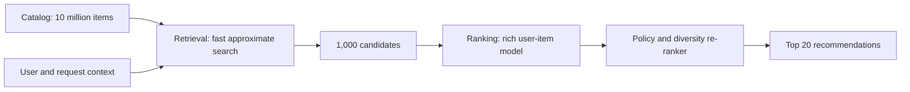
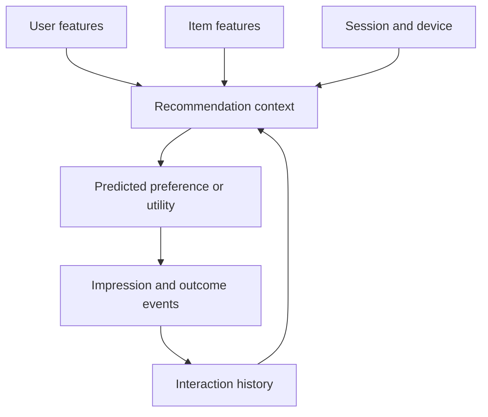
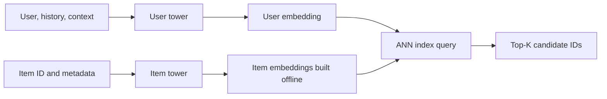
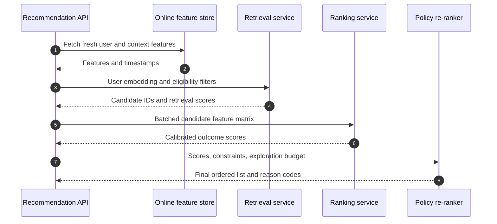
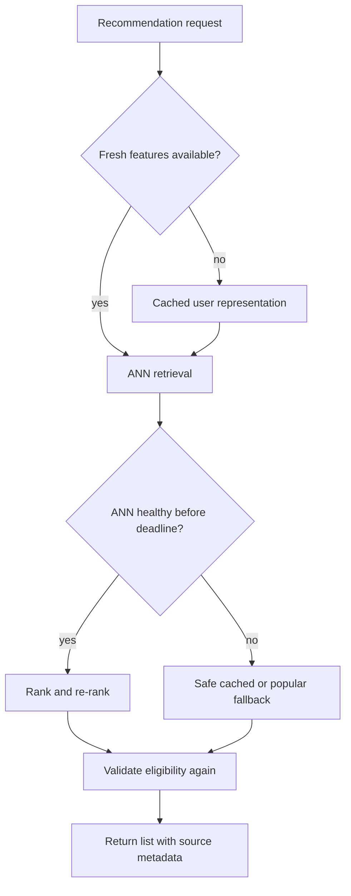
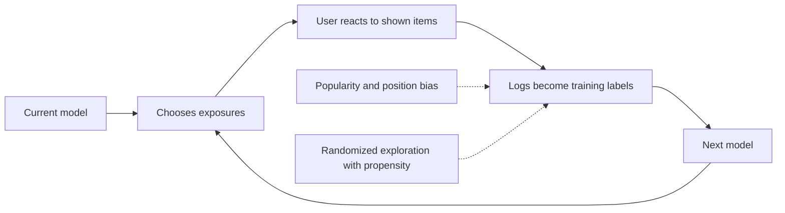

# Two-Stage Recommendation Systems: Retrieval, Ranking, and Production Serving

A recommendation system selects a small, useful set of items for a user from a catalog that may contain millions of products, videos, songs, or posts.
Production systems separate fast candidate retrieval from richer ranking, then apply policy and diversity rules before serving the final list.
Interviewers ask about this architecture because it combines machine learning, information retrieval, experimentation, and low-latency backend design.

---

## 🟢 Beginner Level

### The Recommendation Problem

A search system starts with an explicit query such as “wireless keyboard.”
A recommendation system often has only implicit context: the user, recent activity, device, time, and current page.
Its job is to predict which eligible items will create useful outcomes.

Those outcomes may be clicks, purchases, listening time, completed videos, saves, or long-term retention.
Optimizing the wrong outcome can produce a technically accurate but harmful feed.
For example, maximizing click-through rate alone may reward sensational thumbnails that users quickly abandon.

The catalog is too large for a complex model to score every item per request.
If a catalog has 10 million items and one ranking inference takes only $0.1\text{ ms}$, exhaustive scoring still requires $1{,}000\text{ seconds}$ of serial work.
Parallel hardware helps, but it does not remove memory bandwidth, feature lookup, and cost constraints.

### Why Production Systems Use Two Stages

The standard architecture narrows the problem in stages:

1. **Candidate retrieval** searches millions of items with a cheap similarity function and returns hundreds or thousands.
2. **Ranking** scores those candidates with a richer model using user-item interactions and current context.
3. **Re-ranking** applies eligibility, freshness, diversity, business, and safety rules to produce the final list.

Retrieval maximizes **recall**: do not lose items the user would love.
Ranking maximizes ordering quality among the retrieved set.
The re-ranker protects product constraints that a single learned score cannot safely represent.

### Users, Items, Interactions, and Context

Recommendation data usually contains four feature groups:

- **User features**: account age, locale, subscriptions, long-term preferences, and aggregated history.
- **Item features**: category, creator, text, image embedding, price, age, and availability.
- **Interaction features**: impressions, clicks, watch time, purchases, ratings, skips, and hides.
- **Context features**: time, device, page, session sequence, network conditions, and current intent.

Explicit feedback such as a five-star rating is clear but sparse.
Implicit feedback such as a click is abundant but ambiguous: a click can mean interest, curiosity, or an accidental tap.
An impression without a click is not automatically a true negative because position and visibility affect exposure.

The feedback arrow matters.
Recommendations change what users can interact with, and those interactions become future training data.
The system is therefore a control loop, not a static prediction API.

### Collaborative, Content-Based, and Hybrid Approaches

**Collaborative filtering** learns from interaction patterns.
Users who behaved similarly provide evidence for one another, even when item metadata is weak.
It can discover latent taste but struggles with new users and new items.

**Content-based recommendation** compares item and user attributes.
A user who watches database tutorials may receive another database lesson because titles, tags, and embeddings are similar.
It handles new items better but can over-specialize around what the user already knows.

**Hybrid systems** combine several candidate sources and rank them together.
One source may retrieve co-viewed items, another semantic matches, another recent popular items, and another editorial content.
Source attribution is useful for debugging coverage and enforcing quotas.

| Approach | Primary signal | Strength | Failure mode |
|---|---|---|---|
| User-user collaborative | Similar users | Human taste patterns | Expensive at scale; sparse users |
| Item-item collaborative | Co-interaction | Stable and explainable | Popularity bias; new-item gap |
| Matrix factorization | Latent user/item factors | Compact scoring | Limited context and cold start |
| Content-based | Item/user metadata | Works for unseen items | Narrow recommendations |
| Hybrid | Multiple sources | Better coverage and resilience | More serving and attribution complexity |

### Cold Start and Simple Baselines

**User cold start** means a new user has little or no interaction history.
Ask for a small number of preferences, use locale and entry context, and mix popular or editorial items with exploration.
Do not infer sensitive traits from weak proxies.

**Item cold start** means a new item has no interactions.
Content embeddings, creator/category priors, and a controlled exploration budget can expose it to suitable users.
An item cannot accumulate collaborative evidence if the system never shows it.

Simple baselines remain valuable:

- Most popular eligible items by locale and time window.
- Recently trending items with decay.
- Continue-watching or recently viewed lists.
- Item-to-item co-occurrence for the current item.

A learned system should beat these baselines online, not merely on a complicated offline metric.
Baselines also provide a safe fallback when model or vector infrastructure fails.

---

## 🟡 Intermediate Level

### Two-Tower Candidate Retrieval

A **two-tower model** encodes users and items independently into the same embedding space.
The user tower consumes profile, history, and request context to produce vector $e_u$.
The item tower consumes item metadata and learned ID features to produce vector $e_i$.

A compatible score is usually a dot product or cosine similarity:

$$
s(u,i) = e_u^\top e_i
$$

Independent encoding is the architectural advantage.
Item vectors can be precomputed and indexed, so request-time work computes one user vector plus an approximate nearest-neighbour query.
A cross-encoder that jointly processes every user-item pair may be more expressive but cannot search millions of items directly.

### Approximate Nearest-Neighbour Search

Exact nearest-neighbour search compares the query with every item vector.
Approximate nearest-neighbour (ANN) indexes trade a small amount of recall for large latency and cost reductions.
Common families include graph indexes such as HNSW and partition-based indexes such as IVF.

Important tuning dimensions are:

- **Recall@K**: how many exact top-$K$ neighbours the ANN result retains.
- **Query latency**: especially p95 and p99, not only the mean.
- **Memory**: vectors, graph edges, quantization codes, and replicas.
- **Build/update cost**: how quickly new and changed items become searchable.
- **Filtering support**: availability, region, age restrictions, and inventory must remain correct.

An ANN index is not the source of truth for eligibility.
Deleted, blocked, or unavailable items require a fast filter and timely index updates.
When filtering removes too many results, retrieve more than the final candidate count or query multiple sources.

### Training Retrieval Models and Negative Sampling

Implicit datasets contain observed positive interactions but not labelled dislikes for every unclicked item.
Training therefore samples **negatives** from items the user did not positively interact with.

Negative strategies include:

| Strategy | Benefit | Risk |
|---|---|---|
| Uniform random | Cheap and broad | Often too easy to teach useful boundaries |
| Popularity-weighted | Represents exposed inventory better | Reinforces popularity bias |
| In-batch negatives | Reuses other examples efficiently | Accidental positives and batch bias |
| Hard negatives | Sharpens close decisions | Label noise if the item was relevant but unseen |
| Impression negatives | Reflects actually shown choices | Position and presentation bias |

A sampled-softmax objective raises the positive item's score relative to sampled alternatives.
Hard negatives can be mined from the current ANN index, but stale mining and false negatives destabilize training.
Down-weighting uncertain negatives and logging actual exposure reduce this problem.

Two-tower training must match serving.
If training uses features unavailable online or a different embedding normalization, offline results will not reproduce in production.
Version user tower, item tower, embeddings, and index together as a compatible bundle.

### Ranking Models and Objectives

The ranker receives hundreds or thousands of candidates and can use expensive cross features.
Examples include user-item category affinity, time since the user's last interaction with the creator, price sensitivity, and session sequence features.

A pointwise click model predicts **pCTR**, the probability of a click given an impression.
For binary label $y$ and predicted probability $p$, binary cross-entropy is:

$$
\mathcal{L}_{\text{click}} = -\left[y\log(p) + (1-y)\log(1-p)\right]
$$

Products often optimize several outcomes:

$$
\text{utility} = w_c\,\text{pCTR} + w_v\,\text{E[watch time]} + w_p\,\text{pPurchase} - w_h\,\text{pHide}
$$

Weights encode product values, not mathematical truth.
Multiplying `pCTR × pCVR × margin` estimates expected margin only when probabilities are calibrated and the funnel assumptions match reality.
Pairwise and listwise losses can learn ordering more directly than independent pointwise labels.

### Worked Example: Retrieve Five, Rank Two

Assume a normalized two-dimensional user embedding is $e_u=(0.8, 0.6)$.
For clarity, use exact dot products even though production retrieval uses far more dimensions and ANN.

| Item | Embedding $e_i$ | Retrieval dot product $e_u^\top e_i$ |
|---|---|---:|
| A | $(0.9, 0.4)$ | $0.8(0.9)+0.6(0.4)=0.96$ |
| B | $(0.4, 0.9)$ | $0.8(0.4)+0.6(0.9)=0.86$ |
| C | $(-0.2, 0.9)$ | $0.8(-0.2)+0.6(0.9)=0.38$ |
| D | $(0.1, 0.2)$ | $0.8(0.1)+0.6(0.2)=0.20$ |
| E | $(-0.6, 0.1)$ | $0.8(-0.6)+0.6(0.1)=-0.42$ |

Retrieval selects A and B.
The ranker then adds context unavailable to the dot-product search:

| Item | pCTR | pPurchase after click | Margin units | Expected margin score |
|---|---:|---:|---:|---:|
| A | 0.16 | 0.08 | 25 | $0.16\times0.08\times25=0.32$ |
| B | 0.12 | 0.20 | 15 | $0.12\times0.20\times15=0.36$ |

The final order is B then A even though A had higher embedding similarity.
Retrieval answered “which items are plausibly relevant?” while ranking answered “which candidate has higher contextual utility?”

Suppose the true relevant set for this request is `{A, B, C, F}` and retrieval returns `{A, B, D, E}`.
Then Recall@4 is $2/4=0.50$ because A and B were recovered.
The ranker cannot rescue C or F; a candidate omitted by retrieval has zero chance of reaching the final page.

### Re-Ranking for Eligibility, Diversity, and Exploration

A final re-ranker enforces hard constraints before optimizing soft preferences.
It removes blocked creators, unavailable inventory, age-inappropriate material, duplicates, and items the user just consumed.

Relevance-only ranking tends to return near-duplicates.
**Maximal Marginal Relevance (MMR)** balances relevance against similarity to already selected items:

$$
\text{MMR}(i)=\lambda\,\text{relevance}(i)-(1-\lambda)\max_{j\in S}\text{similarity}(i,j)
$$

Here $S$ is the set already chosen.
A category or creator cap is a simpler deterministic alternative and is easier to explain operationally.

Exploration deliberately gives uncertain items some exposure.
Contextual bandits, Thompson sampling, or a small randomized slot can estimate value beyond the current policy.
Exploration needs safety constraints and a measurable budget; pure randomness is not responsible experimentation.

### Offline Evaluation and Online Experiments

Offline evaluation is fast and repeatable, but it uses data generated by an older recommendation policy.
That creates selection bias: unshown items have no outcomes.

| Layer | Useful offline metrics | Typical question |
|---|---|---|
| Retrieval | Recall@K, hit rate, coverage | Did we keep relevant items in the candidate set? |
| Ranking | NDCG@K, MAP, AUC, log loss | Are relevant items ordered early and probabilities calibrated? |
| Diversity | Intra-list diversity, catalog coverage | Are lists repetitive or narrow? |
| System | p95/p99 latency, error rate, index freshness | Can the model satisfy the serving contract? |

An online A/B test measures causal product outcomes under actual exposure.
Primary metrics might be qualified watch time, purchase conversion, or retention.
Guardrails should include hides, complaints, latency, cancellations, creator concentration, and revenue quality.

A statistically significant CTR increase can still be a product loss.
Check experiment duration, novelty effects, sample-ratio mismatch, interaction between concurrent experiments, and long-term outcomes.

---

## 🔴 Expert Level

### Production Serving Path and Latency Budget

An online request coordinates feature stores, embedding inference, ANN retrieval, ranker inference, and policy services.
Every remote dependency consumes part of the tail-latency budget.

Consider a 100 ms p99 service target:

| Step | Budget |
|---|---:|
| Feature lookup | 8 ms |
| User-tower inference | 4 ms |
| ANN retrieval | 15 ms |
| Candidate feature hydration | 12 ms |
| Batched ranker inference | 25 ms |
| Policy and diversity | 6 ms |
| Network and serialization reserve | 20 ms |
| Failure reserve | 10 ms |
| **Total** | **100 ms** |

Batch candidate inference to use vectorized CPU or GPU work.
Parallelize independent candidate sources, but cap fan-out so one request cannot overload every downstream service.
Use deadlines smaller than the API deadline and cancel work that can no longer affect the response.

### Caching, Freshness, and Degraded Modes

Precompute item embeddings because they change less often than request context.
Cache popular candidate lists, item features, and safe fallback feeds by coarse segments.
Cache keys must include model, index, policy, locale, and eligibility versions where those affect correctness.

Freshness has different requirements:

- Inventory and safety removals may require seconds or immediate invalidation.
- Item metadata embeddings may tolerate minutes.
- Long-term user preferences may tolerate hours.
- Session actions such as “already watched” need request-time or near-real-time filtering.

A degraded mode should be intentionally designed and tested.
If ANN fails, serve eligible segment-popular or editorial items rather than returning an error or stale blocked content.
Record fallback source and reason so product metrics are not attributed to the main model.

### Feedback Loops, Bias, and Causal Logging

The model observes outcomes only for items the previous policy exposed.
This produces **exposure bias**, while prominent positions produce **position bias**.
Training naively on clicks treats policy choices as user preferences.

Popularity feedback can become self-reinforcing:

1. A popular item is retrieved more often.
2. More impressions create more clicks.
3. The model interprets extra clicks as higher relevance.
4. The item receives even more exposure while new items remain unseen.

Log the complete slate, position, model version, candidate sources, scores, eligibility decisions, and exploration propensity.
Randomized traffic enables inverse-propensity or doubly robust evaluation, though variance can be high.
Delayed conversions require stable impression identifiers and an attribution window.

### Failure Modes and Observability

Monitor quality and system health by stage rather than only the final click metric:

- Retrieval candidate count, source coverage, Recall@K proxy sets, ANN latency, and index age.
- Ranking feature missingness, score distribution, calibration, inference errors, and model version.
- Policy rejection counts, diversity, duplicates, blocked-item leakage, and fallback rate.
- Outcome CTR, conversion, long-term retention, complaints, and segment fairness.

Common production failures include:

1. **Training-serving skew**: online feature definitions or defaults differ from training.
2. **Model-index mismatch**: new user tower queries item embeddings produced by an incompatible item tower.
3. **Stale eligibility**: deleted or out-of-stock items remain in ANN or caches.
4. **Candidate collapse**: one source or creator dominates due to a scoring or filtering regression.
5. **Retry amplification**: timeouts cause clients and gateways to multiply expensive inference work.
6. **Silent fallback**: the API stays green while most traffic receives generic lists.

Version every artefact and emit stage-level reason codes.
A recommendation endpoint returning HTTP 200 can still be deeply unhealthy if candidates are stale or fallback traffic is rising.

### Architecture Trade-Offs

| Decision | Advantage | Cost or failure case |
|---|---|---|
| One shared retrieval model | Simpler operations | Misses intent-specific candidate pools |
| Multiple candidate sources | Coverage and resilience | Deduplication, quotas, and calibration complexity |
| Large retrieval K | Better recall ceiling | Ranker cost and tail latency grow |
| Complex deep ranker | Captures feature interactions | Expensive inference and harder debugging |
| Cached candidates | Low latency and outage tolerance | Personalization and eligibility become stale |
| Aggressive exploration | Faster learning and cold-start coverage | Short-term metric and user-experience risk |

Capacity planning should start with request rate, candidates per request, feature bytes, and inference cost.
At 5,000 requests per second and 1,000 ranked candidates per request, the ranker evaluates 5 million pairs per second.
Reducing K from 1,000 to 500 halves that work but may lower the maximum achievable recall.

### Common Misconceptions

1. **“The ranking model can recover any relevant item.”**
   A ranker sees only retrieved candidates, so retrieval misses are unrecoverable for that request.
   Retrieval recall sets the quality ceiling for every later stage.

2. **“An unclicked impression is always a negative preference.”**
   The user may not have noticed the item because of position, scrolling, or presentation.
   Treating every non-click equally teaches exposure policy and interface bias as if they were taste.

3. **“Higher offline AUC guarantees a better product.”**
   Offline data comes from an older policy and may reward leakage or historical bias.
   Only a controlled online experiment can estimate causal product impact under the new policy.

4. **“Two-tower retrieval and ranking are interchangeable.”**
   Independent towers enable ANN because item vectors are precomputable, but they limit direct user-item interactions.
   A ranker can use rich cross features precisely because it scores only a small candidate set.

5. **“Caching recommendations is harmless because preferences change slowly.”**
   Eligibility, inventory, safety, session history, and current intent can change within seconds.
   Cached lists require versioned keys, bounded TTLs, and final request-time validation.

### Interview Questions

**Q1. Why do large recommendation systems use separate retrieval and ranking stages?** `[easy]`

Retrieval cheaply narrows millions of items to a candidate set, while ranking spends more computation on that small set.
This separation makes expressive user-item models practical within a strict serving deadline.
Its key trade-off is that any item missed by retrieval cannot be recovered by ranking.

**Q2. How do collaborative and content-based recommendation differ?** `[easy]`

Collaborative methods learn preference from patterns of user-item interactions, while content-based methods compare user and item attributes.
Collaborative signals discover latent taste but are weak for new entities; content signals handle new items but can over-specialize.
Production systems commonly combine both to improve coverage and resilience.

**Q3. What are user cold start and item cold start?** `[easy]`

User cold start means the system lacks enough history to estimate a new user's preferences.
Item cold start means a new item lacks interactions, so collaborative retrieval has little evidence to surface it.
Onboarding signals, content embeddings, popularity priors, and controlled exploration help, but each introduces bias or short-term risk.

**Q4. What does pCTR represent, and why is calibration important?** `[easy]`

pCTR estimates the probability of a click conditional on an impression and its context.
A calibrated model predicting 0.20 should see clicks on roughly 20 percent of comparable impressions.
Calibration matters when pCTR is combined with conversion, margin, or policy thresholds; a well-ordered but miscalibrated score distorts those decisions.

**Q5. Why is a two-tower model suitable for candidate retrieval?** `[medium]`

It encodes users and items independently, allowing item embeddings to be precomputed and placed in an ANN index.
At request time the service computes one user vector and performs a fast similarity query instead of running a joint model for every item.
The efficiency costs expressiveness because early scoring cannot use arbitrary cross features between the specific user and item.

**Q6. Why does negative sampling matter for implicit-feedback training?** `[medium]`

The event log identifies positives but does not label every unseen item as a genuine dislike, so the learner needs a tractable comparison set.
Uniform negatives may be too easy, while hard or impression negatives improve discrimination but introduce false negatives and exposure bias.
The sampling distribution must be chosen deliberately and, when necessary, corrected in the loss or evaluation.

**Q7. Which metrics would you use for retrieval and ranking offline?** `[medium]`

Use Recall@K or hit rate for retrieval because the first stage should preserve relevant items in its candidate set.
Use NDCG@K, MAP, log loss, and calibration for ranking because order and probability quality matter there.
Also measure catalog coverage, diversity, latency, and segment results so a global relevance metric does not hide operational or distributional failures.

**Q8. Why can ranking by `pCTR × pCVR × margin` be misleading?** `[medium]`

The expression approximates expected margin only when pCTR and conditional pCVR are calibrated and attribution matches the actual funnel.
It can undervalue long-term retention, returns, satisfaction, and negative feedback while over-rewarding high-margin clickbait.
A production utility function needs guardrails and online validation rather than assuming the product is the complete objective.

**Q9. How do diversity and exploration solve different problems?** `[medium]`

Diversity reduces redundancy within the current list, for example by penalizing items similar to those already selected.
Exploration exposes uncertain options to learn their value and correct a policy that otherwise sees only its own choices.
Both may reduce immediate predicted relevance, so they need explicit budgets and product-level evaluation.

**Q10. How would you keep a recommendation API within a 100 ms p99 budget?** `[medium]`

Precompute item vectors, batch ranker inference, parallelize bounded candidate sources, cache safe artefacts, and set per-stage deadlines.
Measure feature, ANN, hydration, ranking, and policy latency separately so the slow stage is visible.
Design degraded results for timeout paths; uncontrolled retries or unlimited fan-out can turn a small slowdown into an outage.

**Q11. Scenario: offline NDCG improves by 8 percent, but the A/B test lowers retention. What do you investigate?** `[hard]`

Check whether the offline split leaked future interactions, overrepresented heavy users, or evaluated only items exposed by the old policy.
Inspect online diversity, novelty, hides, session depth, latency, and segment-level effects rather than assuming the rank order metric represents satisfaction.
Keep the experiment controlled and use the discrepancy to revise labels or objectives instead of shipping based on offline gain alone.

**Q12. Scenario: recommendations become dominated by a few popular creators. How do you break the feedback loop?** `[hard]`

Audit exposure and candidate-source distributions to confirm that popularity affects both retrieval probability and training labels.
Add creator caps or diversity re-ranking, reserve propensity-logged exploration traffic, and correct evaluation for exposure where feasible.
Monitor long-tail coverage and user outcomes because forcing uniform exposure can damage relevance without fixing label quality.

**Q13. Scenario: the ANN service is unavailable during peak traffic. What should the API do?** `[hard]`

Enforce a short retrieval deadline and switch to a prevalidated fallback such as segment-popular, editorial, or cached candidate lists.
Run final eligibility and already-consumed filters, mark the response source, and suppress retry amplification with circuit breaking.
Alert on fallback rate because HTTP success alone would otherwise hide that personalized retrieval is down.

**Q14. Scenario: a new high-quality item never receives impressions. Where can the pipeline be failing?** `[hard]`

The item may lack a fresh content embedding, be absent from the ANN index, fail eligibility filters, or lose to collaborative popularity before ranking.
Trace it through ingestion, index version, candidate-source counts, rank score, and re-ranker reason codes.
Use content retrieval and bounded exploration to create evidence, while keeping safety and inventory constraints non-negotiable.

### Further Reading

- [Deep Neural Networks for YouTube Recommendations](https://research.google/pubs/deep-neural-networks-for-youtube-recommendations/) presents a production candidate-generation and ranking architecture.
- [Wide & Deep Learning for Recommender Systems](https://research.google/pubs/wide-deep-learning-for-recommender-systems/) explains how memorization and generalization are combined in ranking.
- [TensorFlow Recommenders: Basic Retrieval](https://www.tensorflow.org/recommenders/examples/basic_retrieval) demonstrates two-tower retrieval and candidate evaluation with official tooling.
- [Deep Learning Recommendation Model for Personalization and Recommendation Systems](https://arxiv.org/abs/1906.00091) describes Meta's DLRM architecture and feature interactions.
