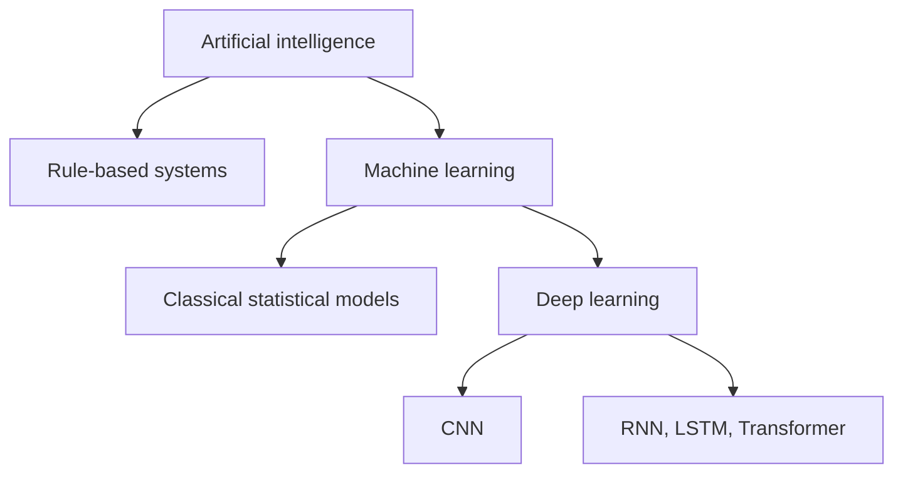
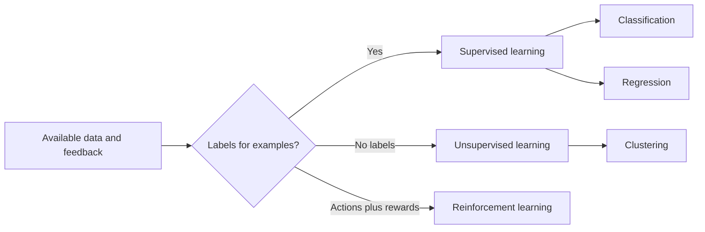
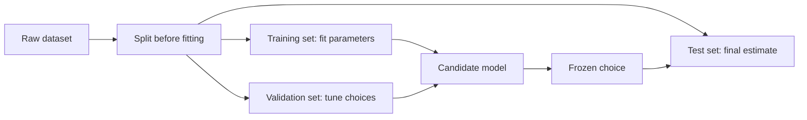
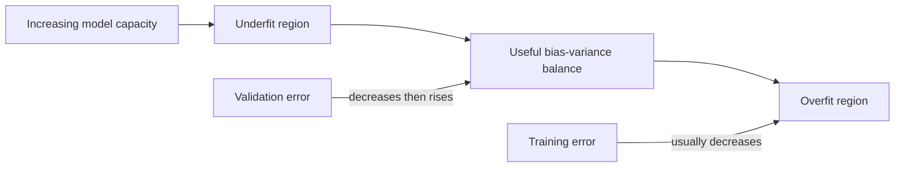
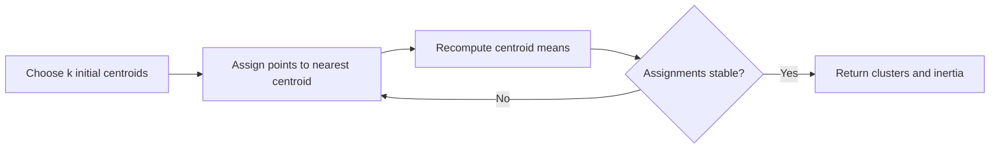
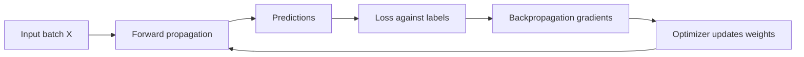
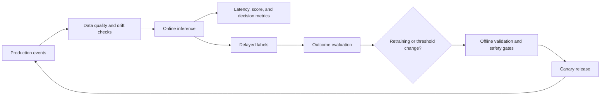

# Machine Learning Fundamentals & Model Evaluation

Machine learning builds programs whose behaviour is fitted from data rather than expressed entirely as hand-written rules. It sits between data pipelines and production inference services: training estimates model parameters, evaluation measures generalisation, and serving applies the frozen model to new examples. Backend interviews increasingly test this vocabulary because engineers integrating models must recognise invalid evaluation, choose useful metrics, and reason about model behaviour even when they are not training specialists.

---

## 🟢 Beginner Level

### Machine learning foundations, evaluation, and neural networks

**Artificial intelligence (AI)** is the broad field of building systems that perform tasks associated with intelligent behaviour. **Machine learning (ML)** is an AI approach that learns statistical patterns from examples. **Deep learning** is a subset of ML based on multi-layer neural networks that learn progressively useful representations.

A hand-written fraud rule might reject transactions over a fixed amount in a new country. An ML classifier instead learns a boundary from labelled historical transactions. The learned boundary can capture interactions that rules miss, but it can also reproduce biased labels, fail after behaviour changes, or be confidently wrong.

Every deployed model therefore needs four explicit contracts:

1. What real-world outcome is being predicted?
2. What information is available at prediction time?
3. Which errors matter most to users and the business?
4. How will drift, latency, and failure be monitored?

### Features, labels, examples, and datasets

An **example** is one observation, such as one loan application. **Features** are measured inputs available to the model, such as income, debt ratio, and account age. A **label** is the target value observed during training, such as whether the loan defaulted within 90 days.

| Term | Loan-risk example | Important constraint |
|---|---|---|
| Example | One application | Sampling unit must be defined |
| Feature | Debt-to-income ratio | Must exist at inference time |
| Label | Default within 90 days | Must match the business outcome |
| Prediction | Estimated default probability | Requires a decision threshold |
| Dataset | Historical applications | Must represent deployment traffic |

A feature matrix $X$ usually has one row per example and one column per feature. A target vector $y$ holds labels. Training estimates parameters $\theta$ for a function $f_\theta(X)$ that minimises a chosen loss on training data.

Data quality bounds model quality. Duplicated entities, inconsistent units, missing-not-at-random values, delayed labels, and leakage can make an impressive metric meaningless.

### Supervised, unsupervised, and reinforcement learning

**Supervised learning** uses examples paired with known labels. Classification predicts a discrete category, while regression predicts a continuous number.

**Unsupervised learning** works without target labels and searches for structure. Clustering groups similar observations, dimensionality reduction compresses features, and anomaly detection identifies unusual patterns.

**Reinforcement learning** trains an agent to select actions in an environment to maximise cumulative reward. Feedback can be delayed, and the agent must balance exploring unknown actions with exploiting what currently appears best.

| Learning type | Feedback | Typical output | Example |
|---|---|---|---|
| Classification | Category label | Class or probability | Fraud probability |
| Regression | Numeric label | Continuous value | Delivery time |
| Clustering | No label | Cluster assignment | Customer segments |
| Reinforcement | Reward after actions | Policy | Robot navigation |

### Train, validation, and test sets

The training set fits parameters such as weights and tree splits. The validation set guides hyperparameters, feature choices, model selection, and thresholds. The test set is held back until the end to estimate performance on unseen data.

A common starting split is 70% training, 15% validation, and 15% test, but the right split depends on dataset size and dependence structure. Time-dependent data should usually be split chronologically; random splitting can let future information predict the past.

All learned preprocessing belongs inside the training pipeline. Computing normalisation statistics, imputations, vocabulary, or feature selection on the whole dataset leaks test information into training.

### Classification, regression, and clustering outputs

A classifier often produces a score or probability rather than a final decision. A threshold converts that score into a class; changing it trades false positives against false negatives.

A regressor produces a numeric estimate. Its error has magnitude and direction, and different metrics penalise large misses differently.

A clustering algorithm assigns groups based on a similarity notion. Cluster numbers are arbitrary labels, and a mathematically compact cluster is not automatically meaningful to a business domain.

The model output is only one component of a product decision. Policy constraints, uncertainty, manual review capacity, and the cost of mistakes determine how predictions are used.

---

## 🟡 Intermediate Level

### Generalisation, overfitting, and underfitting

**Generalisation** is performance on new examples from the deployment distribution. **Overfitting** occurs when a model learns noise or peculiarities of training data and performs much worse elsewhere. **Underfitting** occurs when a model is too restricted, poorly trained, or missing signal and performs badly even on training data.

**Bias** is systematic error caused by restrictive assumptions, such as fitting a straight line to a curved relationship. **Variance** is sensitivity to the particular training sample. More flexible models tend to reduce bias but can increase variance.

Regularisation discourages excessive complexity:

- L2 regularisation adds $\lambda\sum_j w_j^2$ and smoothly shrinks weights.
- L1 regularisation adds $\lambda\sum_j |w_j|$ and can set weights exactly to zero.
- Tree depth, minimum leaf size, and pruning regularise decision trees.
- Dropout, weight decay, early stopping, and data augmentation regularise neural networks.

The regularisation strength $\lambda$ is a hyperparameter selected using validation data. It is not learned solely by minimising the ordinary training loss.

### Feature engineering, parameters, and hyperparameters

**Parameters** are learned during fitting: regression coefficients, tree split values, cluster centroids, or network weights. **Hyperparameters** control the learning process or model class: regularisation strength, tree depth, neighbour count, learning rate, or number of layers.

Feature engineering converts raw data into useful, available, and stable signals. Examples include logarithms for skewed amounts, cyclical encoding for hour-of-day, interaction terms, text tokenisation, and time-window aggregates.

Avoid target leakage. A "refund completed" timestamp cannot predict fraud at payment-authorisation time because it occurs after the decision. Leakage also arises indirectly when records from the same customer appear in both training and test sets or when aggregate features include future events.

Numerical scaling matters for distance- and gradient-based algorithms such as KNN, SVM, and logistic regression. Trees generally do not require standardisation because they split on ordered thresholds.

### Linear and logistic regression

Linear regression predicts a continuous value:

$$
\hat{y} = w_0 + w_1x_1 + \cdots + w_dx_d
$$

Ordinary least squares chooses weights that minimise squared residuals. Coefficients are interpretable under assumptions, but correlated features, outliers, nonlinear relationships, and distribution shift can destabilise conclusions.

Logistic regression is a linear classifier despite its name. It maps a linear score $z$ to a probability with the sigmoid:

$$
p(y=1 \mid x)=\sigma(z)=\frac{1}{1+e^{-z}}
$$

Training usually minimises binary cross-entropy, which strongly penalises confident wrong probabilities. A threshold such as 0.5 is a product decision, not a law; an imbalanced or high-cost problem often uses another threshold.

| Model | Task | Decision shape | Strength | Limitation |
|---|---|---|---|---|
| Linear regression | Regression | Linear surface | Fast, interpretable | Sensitive to nonlinear signal/outliers |
| Logistic regression | Classification | Linear boundary | Calibratable probability baseline | Needs engineered nonlinearities |
| SVM with linear kernel | Classification | Maximum-margin linear boundary | Effective in high dimensions | Probability output is not native |

### Trees, ensembles, neighbours, Bayes, and margins

A **decision tree** recursively selects feature thresholds that reduce impurity or target error. It captures nonlinear interactions and mixed feature scales, but a deep tree has high variance.

A **random forest** fits many decorrelated trees on bootstrap samples and random feature subsets, then averages or votes. Averaging reduces variance and is robust as a baseline, at the cost of a larger, less interpretable model.

**Gradient boosting** builds shallow trees sequentially, each focusing on residual error or negative loss gradient left by the current ensemble. It often performs extremely well on tabular data but requires careful depth, learning-rate, and iteration tuning.

**K-nearest neighbours (KNN)** predicts from nearby training points under a distance metric. It has almost no fitting cost, but inference scans or indexes stored examples, is sensitive to scaling, and degrades in high dimensions.

**Naive Bayes** combines class priors with feature likelihoods under a conditional-independence assumption. The assumption is rarely literally true, yet the model can be fast and effective for sparse text classification.

A **support vector machine (SVM)** chooses a boundary with maximum margin. Kernels can represent nonlinear similarity, but training and tuning become expensive on very large datasets.

| Algorithm | Natural task | Key hyperparameters | Useful starting context |
|---|---|---|---|
| Decision tree | Both | depth, leaf size | Explainable nonlinear rules |
| Random forest | Both | tree count, depth, features | Robust tabular baseline |
| Gradient boosting | Both | learning rate, depth, rounds | High-quality tabular prediction |
| KNN | Both | $k$, distance, weighting | Small, locally structured data |
| Naive Bayes | Classification | smoothing | Sparse counts or text |
| SVM | Both | $C$, kernel, gamma | Medium-sized high-dimensional data |

### K-means clustering

K-means assigns every example to one of $k$ centroids, then recomputes each centroid as the mean of its assigned points. It repeats until assignments or the within-cluster sum of squares stabilise.

K-means assumes Euclidean geometry and roughly compact, similarly scaled groups. It is sensitive to scaling, outliers, initialisation, and the chosen $k$. K-means++ initialisation and multiple starts reduce poor local solutions but do not make arbitrary clusters meaningful.

### Confusion matrix and a worked metric example

For binary classification:

| Actual / predicted | Positive | Negative |
|---|---:|---:|
| Positive | True positive (TP) | False negative (FN) |
| Negative | False positive (FP) | True negative (TN) |

Suppose 1,000 transactions include 40 actual frauds. A model catches 30 frauds, misses 10, incorrectly flags 90 legitimate transactions, and correctly clears 870. Thus $TP=30$, $FN=10$, $FP=90$, and $TN=870$.

$$
\text{Accuracy}=\frac{TP+TN}{TP+TN+FP+FN}=\frac{900}{1000}=0.90
$$

$$
\text{Precision}=\frac{TP}{TP+FP}=\frac{30}{120}=0.25
$$

$$
\text{Recall}=\frac{TP}{TP+FN}=\frac{30}{40}=0.75
$$

$$
F1=2\frac{\text{Precision}\times\text{Recall}}{\text{Precision}+\text{Recall}}
=2\frac{0.25\times0.75}{0.25+0.75}=0.375
$$

The 90% accuracy sounds strong but is worse than the naive "never fraud" classifier's 96% accuracy. Recall says the model finds 75% of fraud, while precision says only 25% of alerts are fraud. If investigators can review 50 cases per day, the threshold must be chosen with that capacity and the costs of missed fraud in mind.

### ROC-AUC and regression metrics

The ROC curve plots true-positive rate against false-positive rate over thresholds. ROC-AUC is the probability that a randomly chosen positive receives a higher score than a randomly chosen negative. It measures ranking, not calibration or performance at one operational threshold.

On severely imbalanced data, precision-recall curves are often more informative because false positives directly affect precision. Always report a confusion matrix or threshold-specific metrics alongside an aggregate area.

For regression errors $e_i=y_i-\hat{y}_i$:

$$
MAE=\frac{1}{n}\sum_{i=1}^{n}|e_i|
$$

$$
MSE=\frac{1}{n}\sum_{i=1}^{n}e_i^2
\qquad
RMSE=\sqrt{MSE}
$$

MAE is in the target's units and weights errors linearly. MSE heavily penalises large misses and has squared units. RMSE restores the original unit while retaining squared-error sensitivity.

---

## 🔴 Expert Level

### Neural networks, forward propagation, and learning

A neuron computes a weighted sum plus bias, then applies an activation:

$$
a=\phi(Wx+b)
$$

Stacking layers lets a neural network learn hierarchical nonlinear functions. During **forward propagation**, inputs flow through layers to predictions and a loss. **Backpropagation** applies the chain rule to compute each parameter's loss gradient, and **gradient descent** updates parameters in the direction that reduces loss.

Common activations include ReLU for hidden layers, sigmoid for a binary output, and softmax for mutually exclusive classes. ReLU avoids much of sigmoid's saturation in deep hidden networks but can produce inactive units. The output activation and loss must match the task.

The learning rate controls update size. Too large can diverge or oscillate; too small makes training slow or trapped. Mini-batches estimate gradients from subsets, improving hardware efficiency and adding useful stochasticity.

### CNN, RNN, LSTM, and Transformer intuitions

A **convolutional neural network (CNN)** applies shared local filters, exploiting spatial locality and translation patterns. It is efficient for images, signals, and grid-like data.

A **recurrent neural network (RNN)** processes a sequence while carrying a hidden state. Basic RNNs struggle with long-range dependencies because gradients can vanish or explode.

An **LSTM** adds gated memory paths controlling what to write, retain, and expose. The gates improve long-range gradient flow, although recurrence still limits parallel training.

A **Transformer** uses attention to let tokens directly combine information from other positions. It trains sequences in parallel and models long-range relationships, but standard self-attention has quadratic time and memory in sequence length.

| Architecture | Core inductive bias | Strength | Constraint |
|---|---|---|---|
| CNN | Local shared patterns | Efficient spatial features | Long-range context needs depth/design |
| RNN | Sequential state | Natural streaming order | Vanishing gradients, sequential compute |
| LSTM | Gated recurrent memory | Better long dependencies | Still sequential and stateful |
| Transformer | Content-based attention | Parallel training, global interaction | Attention cost and large data demand |

### Experimental design and trustworthy evaluation

Random splits assume examples are independent and identically distributed. Real datasets often violate this through time, customers, devices, locations, or repeated entities. Use group-aware splits to keep one entity in one partition and temporal splits when deployment predicts the future.

Cross-validation rotates validation folds to estimate performance more robustly on limited data. Any feature selection and preprocessing must be fitted inside each fold; performing it once on all data leaks validation information.

Hyperparameter search overfits the validation set when enough alternatives are tried. A final untouched test set estimates the selected pipeline only once, while nested cross-validation provides a more rigorous estimate for small datasets.

Report confidence intervals or variation across folds and random seeds. A change from F1 0.812 to 0.814 may be noise rather than progress.

Class probabilities also need calibration. A calibrated model's predictions near 0.8 should be positive about 80% of the time; ranking metrics such as ROC-AUC do not guarantee this.

### Production drift, thresholds, and feedback

**Covariate drift** changes the feature distribution. **Label drift** changes target prevalence. **Concept drift** changes the relationship between features and the outcome, so an old boundary no longer predicts correctly.

Production thresholds may change without retraining when costs or review capacity change. Re-evaluate the confusion matrix and calibration instead of assuming a threshold selected on historical data remains optimal.

Feedback loops can corrupt labels. If a fraud model blocks transactions, later data contains outcomes only for accepted transactions; the model never observes what rejected cases would have done. Evaluation needs deliberate exploration, review samples, or causal reasoning.

Fairness must be assessed across relevant groups and intersections. Removing a protected attribute does not remove correlated proxies, and one global accuracy can hide severe subgroup failure.

### Algorithm choice as an engineering decision

Start with a simple baseline that establishes data and metric correctness. Logistic regression or a shallow tree often reveals leakage, feature mistakes, and achievable signal before a complex model obscures them.

Choose by constraints as well as leaderboard performance:

- Inference latency and memory budget.
- Training cost and update frequency.
- Interpretability and reason requirements.
- Missing data and feature types.
- Calibration and threshold stability.
- Dataset size and dimensionality.
- Monitoring and rollback capability.

A model that improves offline AUC slightly but triples latency, cannot be explained to reviewers, and fails on missing values may be the worse production system.

### Common Misconceptions

1. **"Deep learning is always more accurate than classical ML."**
   Deep networks excel with large unstructured datasets, but tree ensembles often dominate medium-sized tabular problems. Accuracy depends on data, target, tuning, and evaluation rather than architectural prestige.
2. **"A 99% accuracy model is production-ready."**
   With a 1% positive rate, predicting every example negative already achieves 99% accuracy. Precision, recall, thresholds, costs, and subgroup behaviour determine whether the model is useful.
3. **"The test set can guide feature engineering as long as it is not used for gradient descent."**
   Repeatedly inspecting test performance changes modelling choices and therefore fits human decisions to the test set. Keep it sealed until a final pipeline is selected.
4. **"ROC-AUC measures probability quality."**
   ROC-AUC measures pairwise ranking across thresholds and is invariant to many score transformations. A model can rank perfectly while producing badly calibrated probabilities.
5. **"Unsupervised clusters reveal natural customer types."**
   Clusters reflect the chosen features, scaling, distance, algorithm, and $k$. Domain validation is required before treating them as real or actionable groups.

### Interview Questions

**Q1. How do AI, machine learning, and deep learning relate?** `[easy]`

AI is the broad field of systems that perform intelligent tasks, including hand-written search and rule systems. Machine learning is an AI approach that fits behaviour from data, and deep learning is ML based on multi-layer neural networks. The nesting does not imply that deep learning is the right tool for every dataset or constraint.

**Q2. What is the difference between a feature and a label?** `[easy]`

A feature is an input available to the model when it makes a prediction. A label is the outcome used as the training target, such as fraud confirmed after investigation. A feature that becomes known only after the outcome creates leakage and cannot support honest inference-time performance.

**Q3. How do classification and regression differ?** `[easy]`

Classification predicts a discrete category or probability of a category, while regression predicts a continuous numeric value. Classification commonly uses cross-entropy and confusion-matrix metrics, whereas regression uses magnitude-based losses and metrics. Some problems can be framed either way, but the product decision and cost of error should determine the target.

**Q4. What are training, validation, and test sets for?** `[easy]`

Training data fits model parameters. Validation data chooses hyperparameters, features, thresholds, and the candidate pipeline. Test data remains untouched until the end so it can estimate generalisation without inheriting those choices.

**Q5. What is the bias-variance trade-off?** `[medium]`

High-bias models impose restrictive assumptions and can underfit both training and validation data. High-variance models react strongly to one training sample and can overfit, producing a large train-validation gap. Capacity, regularisation, data volume, and ensembling move this balance, so learning curves are more useful than labelling one algorithm inherently biased or variable.

**Q6. Why can accuracy be misleading on imbalanced data?** `[medium]`

The majority class can dominate the total, letting a model achieve high accuracy while finding no rare positives. Precision reveals alert quality and recall reveals positive coverage at a chosen threshold. The confusion matrix and business costs should accompany accuracy so the failure distribution is visible.

**Q7. What does ROC-AUC measure?** `[medium]`

ROC-AUC measures how often a random positive receives a higher score than a random negative across all thresholds. It assesses ranking rather than probability calibration or one operating point. On highly imbalanced problems, precision-recall analysis and a threshold-specific confusion matrix can be more actionable.

**Q8. Compare random forests and gradient boosting.** `[medium]`

Random forests train decorrelated trees largely independently and average them to reduce variance. Gradient boosting builds trees sequentially to correct the current ensemble's errors, often achieving stronger tabular accuracy with more tuning sensitivity. Forests parallelise naturally and are robust defaults, while boosting needs careful learning rate, depth, iteration, and overfitting control.

**Q9. Why must preprocessing be fitted only on training data?** `[medium]`

Learned means, imputations, vocabularies, and feature selections contain information about the examples used to compute them. Fitting them on validation or test data leaks future evaluation information into the model pipeline. Encapsulate preprocessing and estimation together so each split or cross-validation fold fits transformations independently.

**Q10. How are forward propagation and backpropagation different?** `[medium]`

Forward propagation computes layer activations, predictions, and loss from inputs using current parameters. Backpropagation applies the chain rule in reverse to calculate how every parameter affected that loss. An optimiser then uses those gradients to update parameters, and a poor learning rate can still make this process diverge or stall.

**Q11. Scenario: A fraud model reports 98% test accuracy but catches only 5% of fraud. What do you change?** `[hard]`

Accuracy is dominated by legitimate transactions and does not represent the cost of missed fraud. Inspect the confusion matrix, precision-recall curve, score distribution, and label quality, then choose a threshold or loss weighting aligned with recall and review capacity. Re-evaluate on a representative time-based test set because class imbalance and fraud behaviour may also have shifted.

**Q12. Scenario: Validation performance is excellent, but production performance collapses in the first month. What do you investigate?** `[hard]`

Check leakage, random splitting across time or repeated entities, training-serving feature skew, missing-value handling, and changes in feature or label distributions. Compare production slices with the training dataset and evaluate delayed labels when they become available. Fix the data and evaluation pipeline before increasing model complexity, because a stronger learner can exploit the same leakage more effectively.

**Q13. Scenario: A delivery-time model has MAE 4 minutes and RMSE 18 minutes. What does that gap suggest?** `[hard]`

RMSE's squared penalty indicates a smaller number of very large errors are dominating even though the typical absolute error is modest. Segment residuals by route, weather, distance, missing features, and target range to identify the tail population. Decide whether to improve those cases, use robust losses, or report quantile predictions based on the product cost of extreme misses.

**Q14. Scenario: A team tunes 500 models against the same validation set and publishes the best result. Why might it fail to reproduce?** `[hard]`

Repeated model selection has overfit the validation set even though gradient training never used it directly. The best score includes selection noise from hundreds of comparisons and may not generalise. Evaluate the frozen winner once on an untouched test set, report uncertainty across seeds or folds, and use nested cross-validation when data is limited.

### Further Reading

- [scikit-learn User Guide](https://scikit-learn.org/stable/user_guide.html) documents classical algorithms, preprocessing, model selection, and evaluation metrics.
- [Google Rules of Machine Learning](https://developers.google.com/machine-learning/guides/rules-of-ml) provides production-oriented guidance on baselines, features, pipelines, and monitoring.
- [Deep Learning](https://www.deeplearningbook.org/) by Goodfellow, Bengio, and Courville develops neural-network optimisation and generalisation from first principles.
- [Attention Is All You Need](https://arxiv.org/abs/1706.03762) is the original Transformer architecture paper.
