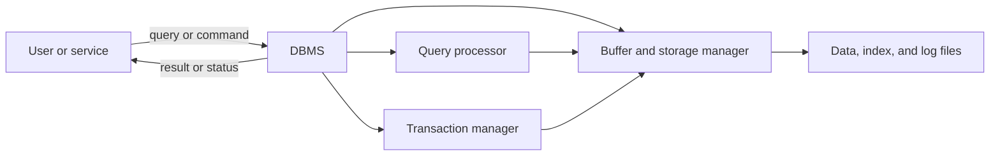
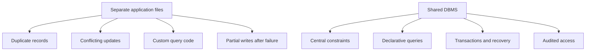
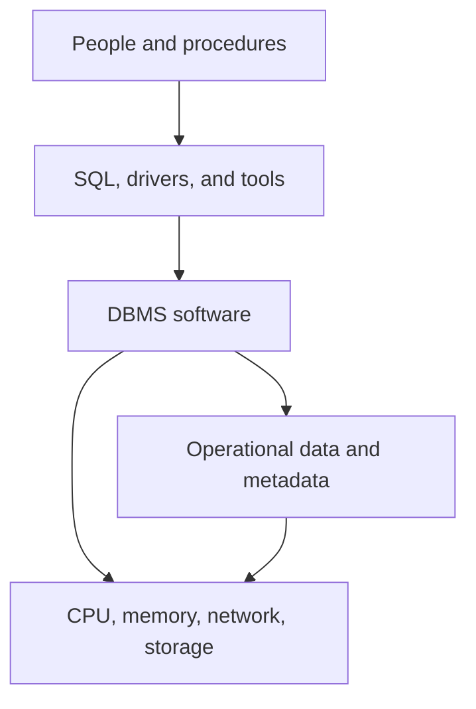
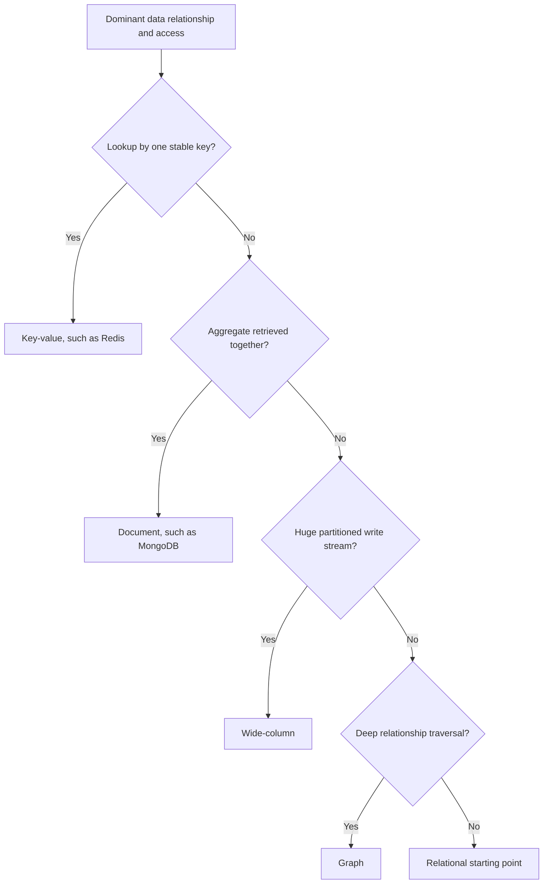
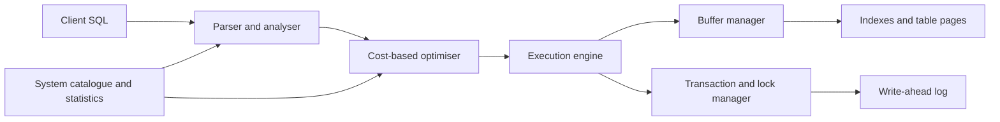
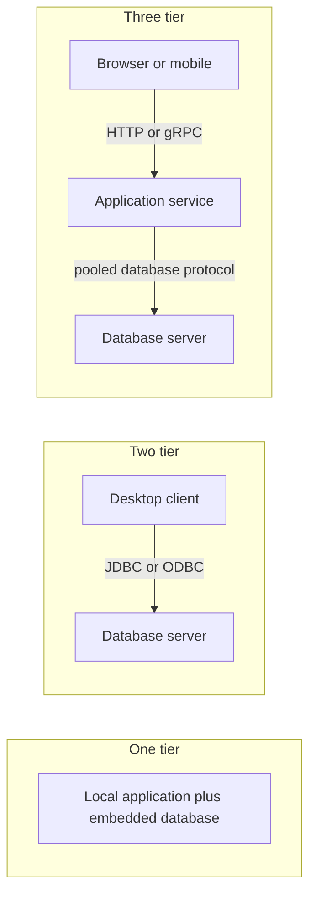
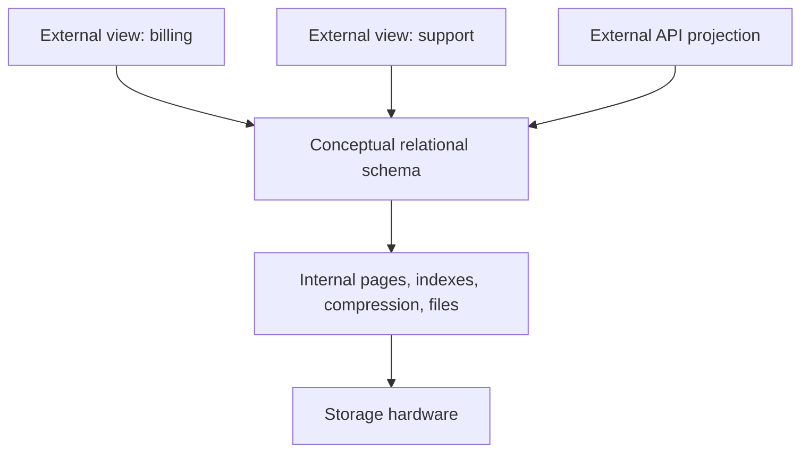

# DBMS Introduction & Architecture

A database management system turns durable bytes into shared, constrained, queryable information. It sits between applications and storage, coordinating schemas, query plans, memory, concurrency, recovery, and access control so many clients can use the same data safely. Interviewers begin with DBMS architecture because every later topic—indexes, transactions, optimisation, replication, and NoSQL—depends on understanding which subsystem owns each guarantee.

---

## 🟢 Beginner Level

### Data, databases, and management systems

**Data** is a recorded fact such as a customer identifier, timestamp, image, or temperature. **Information** is data interpreted in context, such as "customer 42 paid invoice 91 at 10:15 UTC." A **database** is an organised collection of related data, while a **database management system (DBMS)** is software that defines, stores, queries, updates, protects, and recovers that collection.



The DBMS provides a logical interface while deciding how to access physical bytes. An application asks for orders matching a predicate; it does not issue block offsets, coordinate concurrent writers, or replay a recovery log after power loss.

A database is the managed data and metadata. PostgreSQL, MySQL, MongoDB, and Redis are management systems or servers; an individual application's schema and records are its database.

### DBMS, RDBMS, and database types

A **relational database management system (RDBMS)** represents data as relations, commonly implemented as tables of rows and typed columns. Declarative SQL describes the required result, keys relate tables, constraints reject invalid states, and transactions provide controlled concurrency and durability.

Not every DBMS is relational. Database types reflect different data models and operational goals:

| Type | Logical model | Strong fit | Examples |
|---|---|---|---|
| Relational | Tables and relations | Transactions, joins, structured records | PostgreSQL, MySQL |
| Key-value | Key mapped to opaque value | Cache, session, simple lookup | Redis, DynamoDB |
| Document | Nested documents | Aggregate-oriented, evolving records | MongoDB, Couchbase |
| Wide-column | Partitioned sparse rows | High-volume distributed writes | Cassandra, Bigtable |
| Graph | Nodes, edges, properties | Multi-hop relationship traversal | Neo4j, Neptune |
| Object | Persistent objects | Specialised object-centric domains | ObjectDB |
| Hierarchical | Parent-child tree | Fixed navigation hierarchy | IBM IMS |

"Relational" describes a data model, not whether the system runs on one machine. Distributed SQL databases retain tables, SQL, and transactions while partitioning and replicating storage across nodes.

### Why applications use a DBMS instead of plain files

A file system manages byte streams, directories, names, and permissions. It does not automatically understand that a customer ID must be unique, an order must reference an existing customer, or two balance updates form one indivisible transfer.

A DBMS adds shared mechanisms:

1. **Declarative query processing** chooses an access and join strategy from SQL.
2. **Integrity constraints** enforce types, uniqueness, references, and checks centrally.
3. **Transactions** group operations with atomicity, isolation, and durability.
4. **Concurrency control** coordinates many readers and writers.
5. **Recovery** uses logs, checkpoints, and backups after failures.
6. **Security** grants operations on schemas, tables, rows, or columns.
7. **Data independence** hides many physical changes from applications.
8. **Administration** exposes statistics, monitoring, replication, and maintenance.



Plain files remain appropriate for immutable media, application binaries, append-only interchange, and small single-process state. SQLite is useful when relational semantics are needed without a separate server; "use a DBMS" does not always mean "operate a distributed cluster."

### Schema, instance, tables, and constraints

A **schema** defines structure: relation names, columns, types, keys, constraints, views, and indexes. A database **instance** is the data stored at a particular moment.

```sql
CREATE TABLE customer (
    customer_id BIGINT PRIMARY KEY,
    email       TEXT NOT NULL UNIQUE,
    status      TEXT NOT NULL CHECK (status IN ('ACTIVE', 'SUSPENDED'))
);

CREATE TABLE customer_order (
    order_id    BIGINT PRIMARY KEY,
    customer_id BIGINT NOT NULL REFERENCES customer(customer_id),
    total       NUMERIC(12, 2) NOT NULL CHECK (total >= 0)
);
```

The primary key identifies a row. The foreign key prevents an order from referencing a missing customer. `NOT NULL`, `UNIQUE`, `CHECK`, and domain types turn business invariants into reusable database rules rather than relying on every application code path to remember them.

Rows are unordered unless a query uses `ORDER BY`. Physical page order, insertion order, or one observed execution plan is not a query contract.

### Database users and responsibilities

Several roles interact with a database environment:

- Application engineers design schemas, queries, migrations, and data-access boundaries.
- Database administrators manage availability, backups, security, capacity, and tuning.
- Data engineers build ingestion and analytical pipelines.
- Analysts issue reporting queries through governed interfaces.
- End users interact through applications rather than direct database credentials.
- The DBMS itself records metadata, statistics, privileges, and transaction state.

Separation of duties reduces risk. An application runtime account should usually perform only required DML, while schema migration and administrative accounts receive narrower, separately audited powers.

---

## 🟡 Intermediate Level

### The six parts of a database environment

A working database environment contains more than the server process:

| Part | Contents | Failure example |
|---|---|---|
| Hardware | CPU, RAM, storage, network | Saturated disk stalls WAL flushes |
| Software | DBMS, OS, drivers, tools | Driver protocol incompatibility |
| Data | Rows, indexes, logs, catalogue | Corrupt page or stale statistics |
| Procedures | Backup, restore, migration, incident steps | Backup exists but restore is untested |
| Access languages | SQL, APIs, protocol commands | Unsafe dynamic SQL injection |
| People | Developers, DBAs, analysts, operators | Excess production privileges |



Availability is limited by the weakest part. Replicated hardware does not help if every replica receives the same destructive migration, and a correct backup does not help if no one knows the recovery procedure.

### SQL language families and database APIs

SQL is declarative: clients state the desired data or change while the optimiser selects a physical plan. Common teaching categories are:

| Family | Purpose | Representative commands |
|---|---|---|
| DDL | Define schema objects | `CREATE`, `ALTER`, `DROP` |
| DML | Change stored rows | `INSERT`, `UPDATE`, `DELETE` |
| DQL | Query rows | `SELECT` |
| DCL | Control privileges | `GRANT`, `REVOKE` |
| TCL | Control transactions | `COMMIT`, `ROLLBACK`, `SAVEPOINT` |

These labels are useful vocabulary, but engine behaviour matters more than memorisation. Some databases transactionally roll back DDL; others implicitly commit around particular schema commands.

Applications connect using database protocols through APIs such as JDBC, ODBC, or vendor drivers. A connection owns session state, transaction context, temporary objects, and settings, so connection pools must reset state before reuse.

### SQL and NoSQL data models

**NoSQL** means a family of non-relational or not-only-relational systems, not one consistency model. A model should match the dominant access pattern and invariants.



**Key-value** databases map a key to a value and optimise direct retrieval. Redis adds data structures, expiry, and atomic commands, but arbitrary relational joins are not its central model.

**Document** databases store nested records, commonly JSON-like documents. MongoDB supports indexes and transactions, but embedding versus referencing determines consistency boundaries and document growth.

**Wide-column** databases partition sparse rows by keys and optimise distributed write paths. Query patterns must align with partition and clustering keys.

**Graph** databases represent relationships as first-class edges. They excel when queries traverse an unpredictable number of hops, while simple key access may not justify their operational cost.

| Concern | Relational SQL | Common NoSQL approach |
|---|---|---|
| Schema | Declared types and constraints | Flexible or application-governed shape |
| Relationship | Foreign keys and joins | Embed, reference, edge, or duplicate |
| Query | Declarative relational operations | Model-specific API/query language |
| Scaling | Scale-up, replicas, partitioning | Often partition-first distribution |
| Consistency | Transaction and isolation options | Varies from strong to eventual |
| Evolution cost | Managed migration | Reader/writer compatibility required |

NoSQL does not mean "no schema." Schema responsibility may move from the database catalogue into application validation, serializers, and deployment compatibility rules.

### Inside a DBMS server

A typical RDBMS divides work among cooperating subsystems:



The parser checks syntax and builds an internal representation. Semantic analysis resolves names, types, functions, and privileges. The optimiser estimates alternative plan costs from statistics. The executor runs operators such as scans, joins, sorts, and aggregates.

The buffer manager caches fixed-size pages in RAM and coordinates reads and dirty writes. The transaction manager assigns identities or snapshots, tracks locks or versions, and records changes in a write-ahead log. Recovery replays or reverses logged work after a crash.

The **system catalogue** is a database about the database. It stores relations, columns, indexes, constraints, users, privileges, functions, and statistics that both administrators and the optimiser query.

### A query's path through the engine

Consider:

```sql
SELECT order_id, total
FROM customer_order
WHERE customer_id = 42
  AND total >= 100
ORDER BY total DESC;
```

The server:

1. Authenticates the session and checks privileges.
2. Parses SQL into a syntax tree.
3. Resolves table and column references from the catalogue.
4. Rewrites views or policy rules where applicable.
5. Estimates selectivity and compares scan/sort plans.
6. Executes the selected operators against buffer-pool pages.
7. Applies snapshot visibility or locks.
8. Sorts if no usable index supplies the required order.
9. Encodes rows in the wire protocol and returns them.

The optimiser makes an estimate, not a proof. Stale statistics, correlated columns, parameter skew, or changing cache state can make a legal plan unexpectedly slow.

### Worked example: managed pages versus a file scan

Assume an order relation contains 100 million fixed-size rows. Each 8 KiB data page holds about 80 rows after headers and free space, so the table occupies approximately:

$$
\frac{100{,}000{,}000\ \text{rows}}{80\ \text{rows/page}}=1{,}250{,}000\ \text{pages}
$$

At 8 KiB per page, that is about $1{,}250{,}000 \times 8\ \text{KiB}=9.54\ \text{GiB}$. A plain file program searching one order by ID may need to inspect all 1.25 million pages in the worst case.

Suppose a B+ tree index has fan-out 200. Its approximate height for 100 million entries is:

$$
\lceil \log_{200}(100{,}000{,}000) \rceil = 4
$$

An indexed lookup may read roughly four index pages plus one table page rather than 1.25 million table pages. If all five are random SSD reads at 100 microseconds each, storage time is roughly $5 \times 0.1\text{ ms}=0.5\text{ ms}$; a 2 GiB/s sequential full scan of 9.54 GiB takes about $4.77$ seconds before filtering and transfer.

This simplified comparison ignores caching, parallelism, clustering, and write overhead, but it demonstrates the abstraction's value. The DBMS maintains index pages, selects the access path, validates concurrent visibility, and keeps the index consistent with every row change.

### One-tier, two-tier, and three-tier deployment



One-tier deployment is simple and works for local tools, tests, and embedded devices. Two-tier systems connect rich clients directly to a database and can work on trusted networks, but distribute credentials and couple every client to the schema.

Three-tier systems put an application service between clients and the database. The service centralises business rules, authentication, API compatibility, and pooling, while the database remains on a private network. The extra hop adds complexity and latency but creates a controlled security and scaling boundary.

---

## 🔴 Expert Level

### Data independence and abstraction boundaries

The ANSI-SPARC model distinguishes external, conceptual, and internal schemas. External views expose audience-specific representations. The conceptual schema describes the logical database, and the internal schema describes pages, files, indexes, and placement.



**Physical data independence** lets an administrator add an index, reorganise pages, change compression, or migrate storage without changing application SQL. **Logical data independence** lets the conceptual schema evolve while compatible views preserve external contracts.

Logical independence is harder. Splitting one table, changing semantics, or removing a column can require view logic, dual writes, backfills, and coordinated application releases. A DBMS supplies abstraction tools; it cannot automatically preserve changed business meaning.

### Metadata, planning, caching, and durability

The catalogue and runtime state turn persistent bytes into a managed system:

- Schema metadata gives each value a name, type, relationship, and constraint.
- Statistics estimate cardinality and distribution for plan selection.
- The buffer pool converts repeated storage reads into memory access.
- Locks or multiversion concurrency control define concurrent visibility.
- Write-ahead logging makes committed updates recoverable before dirty pages reach final files.
- Checkpoints bound recovery work without requiring every data page at commit.

These layers trade work across time. An index makes reads cheaper but consumes storage and adds write maintenance. A large buffer pool improves cache hits but competes with connection memory and the operating system. Stronger isolation reduces anomalies but may add blocking or retries.

### Centralised guarantees and their cost

A DBMS is valuable because shared guarantees apply to every client, but those guarantees are not free.

| Guarantee or service | Mechanism | Cost or limitation |
|---|---|---|
| Atomic durability | WAL flush and recovery | Commit latency and log storage |
| Isolation | Locks, timestamps, or MVCC | Waiting, aborts, version cleanup |
| Integrity | Constraint checks | CPU, index probes, coordination |
| Fast access | Indexes and buffer cache | Memory, storage, write amplification |
| Flexible query | Optimiser and executors | Planning cost and estimate errors |
| Central security | Roles, grants, auditing | Administrative complexity |
| Availability | Replication and failover | Lag, consensus, operational testing |

Centralisation can create a blast radius. Connection leaks, destructive migrations, runaway queries, or a failed primary can affect many services simultaneously. Resource limits, least privilege, tested backups, replicas, and admission control are part of database design, not optional operations polish.

### Choosing a database model responsibly

Start from invariants and access patterns rather than product popularity:

1. Which updates must be atomic together?
2. Which relationships and joins are frequent?
3. Is schema flexibility needed, or is schema enforcement valuable?
4. What are read/write volume, item size, and latency targets?
5. Which keys distribute load, and can one partition become hot?
6. How soon must every reader observe a write?
7. What queries will appear next year, not only at launch?
8. Can the team operate backup, restore, upgrades, and failure recovery?

Polyglot persistence can be sensible: PostgreSQL may own orders, Redis may cache derived sessions, and a search engine may index product text. Each additional store introduces replication pipelines, consistency windows, backup procedures, observability, and specialised expertise.

Keep one authoritative owner for each fact. Treat caches, search indexes, and analytical projections as derived data unless their consistency model explicitly makes them a source of truth.

### Production failure modes

**Untested restores** create the illusion of safety. A backup is useful only when restoration, permissions, encryption keys, and recovery-time objectives are exercised.

**Connection exhaustion** occurs when clients open unbounded sessions or hold transactions while doing network work. Pool limits, timeouts, short transaction boundaries, and database-side monitoring contain it.

**Schema drift** occurs when application versions assume different structures. Versioned migrations, expand-contract releases, and compatibility tests prevent one deployment from breaking another.

**Hot partitions** defeat nominal horizontal scale when most traffic targets one tenant or time bucket. Partition-key choice must be tested against skew, not only average volume.

**Stale replicas** return older values after a successful write. Read-your-writes routing, lag limits, or primary reads are required for flows that cannot tolerate that window.

**Missing constraints** push integrity into every producer. A forgotten code path or bulk import then creates records that later queries cannot interpret safely.

### Common Misconceptions

1. **"A database and a DBMS are the same thing."**
   The database is the organised data and metadata; the DBMS is the software that manages it. One server process can manage multiple databases, and database files without the matching engine may be unusable.
2. **"NoSQL databases have no schema or transactions."**
   NoSQL systems use non-relational models, but data still has an expected shape and many products support scoped transactions. The schema and invariant responsibility may move into applications rather than disappear.
3. **"A file system is just a slower database."**
   A file system provides durable named byte streams, not declarative relations, query optimisation, cross-record constraints, or transactional isolation. It can outperform a DBMS for simple immutable blobs because it avoids services that workload does not need.
4. **"Adding a DBMS automatically prevents bad data."**
   The engine enforces only declared constraints and correctly bounded transactions. Missing rules, excessive privileges, and incorrect application semantics still create inconsistent information.
5. **"Three-tier architecture means three physical machines."**
   Tiers are responsibility boundaries: presentation, application logic, and data management. They may share hardware in development or span many replicas in production.

### Interview Questions

**Q1. What is a DBMS?** `[easy]`

A DBMS is software that defines, stores, queries, updates, secures, and recovers organised data. It mediates between logical operations and physical pages while coordinating concurrent clients. A database is the managed data itself, so the two terms are related but not identical.

**Q2. How does an RDBMS differ from a general DBMS?** `[easy]`

An RDBMS implements the relational model using relations, typically exposed as typed tables with keys and constraints. SQL describes operations over those relations, and joins reconstruct related information. DBMS is the broader category that also includes document, graph, key-value, hierarchical, and other models.

**Q3. Why are constraints valuable if an application already validates input?** `[easy]`

Database constraints protect the invariant for every writer, including scripts, imports, migrations, and future services. Application validation improves error messages and avoids unnecessary round trips, but it can race or be bypassed. The database is the final shared enforcement boundary for facts it can express.

**Q4. What is the system catalogue?** `[easy]`

The system catalogue stores metadata about tables, columns, indexes, constraints, users, privileges, and often optimiser statistics. Parsing, name resolution, planning, and administrative tools consult it. Corrupt or stale metadata can therefore affect both correctness and performance even though it is not ordinary business data.

**Q5. What advantages does a DBMS provide over plain files?** `[medium]`

A DBMS adds declarative queries, central constraints, transactions, concurrency control, recovery, access control, and physical data independence. These mechanisms prevent every application from reinventing locking, indexing, and crash handling. They add operational and runtime overhead, so immutable media or tiny single-process state can still belong in files.

**Q6. What happens between receiving SQL and returning rows?** `[medium]`

The server authenticates and authorises the session, parses SQL, resolves names and types, rewrites expressions, and compares candidate physical plans. The executor runs the selected scans, joins, filters, and sorts against visible buffer-pool pages. Statistics or cache assumptions can be wrong, so a valid plan is not guaranteed to be the fastest under current data.

**Q7. Explain logical and physical data independence.** `[medium]`

Physical independence hides storage changes such as new indexes, page reorganisation, or different hardware from the logical schema. Logical independence preserves external views while the conceptual schema evolves. Logical changes are harder because changed meaning may require compatibility views, backfills, and coordinated releases.

**Q8. Why does NoSQL not mean "no schema"?** `[medium]`

Every useful record has fields, types, relationships, and evolution rules even when the database does not enforce a fixed table definition. Document validation and application serializers still define acceptable shape. Moving enforcement out of the catalogue increases flexibility but also requires disciplined reader/writer compatibility.

**Q9. Compare key-value and document databases.** `[medium]`

A key-value database primarily retrieves an opaque or structured value using one known key. A document database understands nested document fields and commonly supports secondary indexes and field predicates. Documents enable richer queries, while a simple key-value model can offer a smaller and more predictable access surface.

**Q10. Why is a three-tier architecture common for web applications?** `[medium]`

The application tier centralises authentication, business rules, transactions, API compatibility, and database connection pooling. Clients do not hold direct database credentials or couple every release to the physical schema. The additional network hop and service fleet increase latency and operational complexity, so small local tools may not need it.

**Q11. Scenario: A service's query for one order scans a 100-million-row table. What DBMS components do you inspect?** `[hard]`

Inspect the schema and candidate indexes, then use the execution plan to see the optimiser's chosen scan and cardinality estimates. Check catalogue statistics, predicate types, parameter skew, index selectivity, and whether functions prevent index use. Also measure buffer-cache state and returned row count, because an index can be correctly rejected for a query that reads most of the table.

**Q12. Scenario: Every microservice stores its own copy of customer email, and updates leave them inconsistent. How would you redesign ownership?** `[hard]`

Choose one authoritative customer record and expose a controlled update boundary rather than allowing independent facts to drift. Other stores should keep identifiers or explicitly derived projections updated through reliable events and reconciliation. Duplication may remain for availability or query performance, but its freshness contract and recovery path must be defined.

**Q13. Scenario: A team proposes Redis as the sole ledger because key lookups are fast. What questions do you ask?** `[hard]`

Ask which multi-record invariants, durability boundary, audit history, query patterns, backup process, and recovery objectives the ledger requires. Redis supports persistence and atomic operations, but a fast key lookup alone does not establish that its data model and failure semantics fit financial records. Compare an RDBMS transaction design against the measured workload before making latency the only criterion.

**Q14. Scenario: Backups complete every night, yet a restore exercise cannot start the application. What failed?** `[hard]`

The organisation validated backup creation but not recoverability of the whole system. A usable recovery includes compatible schema migrations, roles, encryption keys, configuration, logs or incremental backups, and a documented restore order. Automate restore drills and measure recovery point and recovery time rather than treating a successful upload as proof.

### Further Reading

- [PostgreSQL architectural fundamentals](https://www.postgresql.org/docs/current/tutorial-arch.html) describes client/server processes and database responsibilities.
- [PostgreSQL system catalogues](https://www.postgresql.org/docs/current/catalogs.html) documents the metadata relations used by the engine and administrators.
- [MongoDB data modelling introduction](https://www.mongodb.com/docs/manual/data-modeling/) explains document embedding, references, and access-pattern design.
- [Redis data types](https://redis.io/docs/latest/develop/data-types/) documents the structures and operations behind the key-value model.
