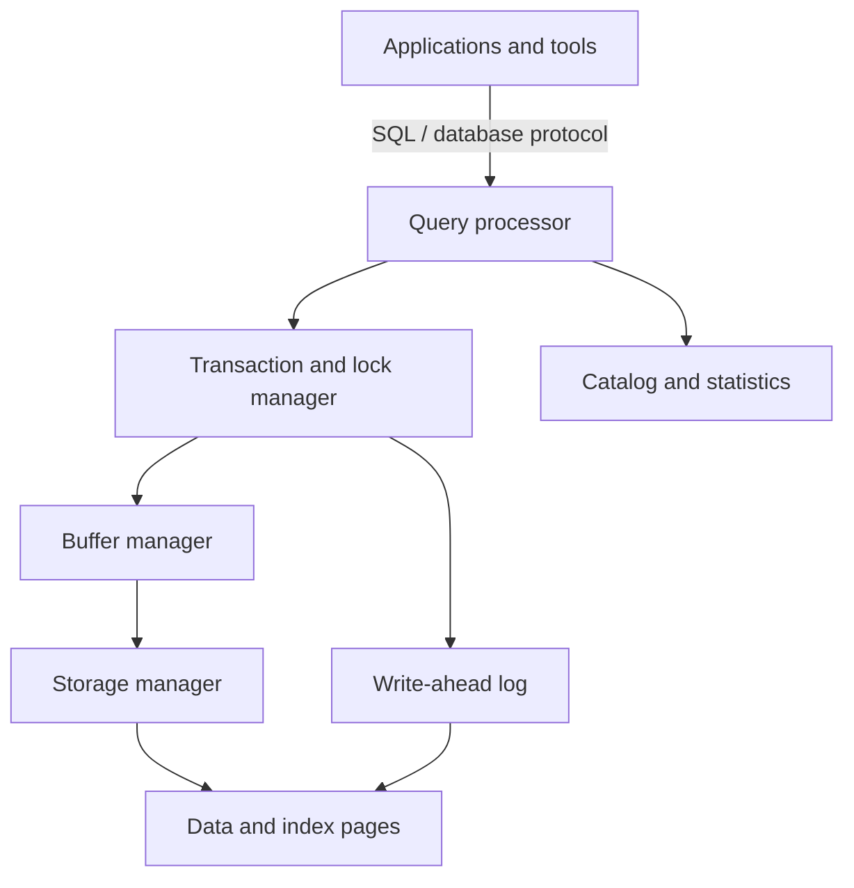
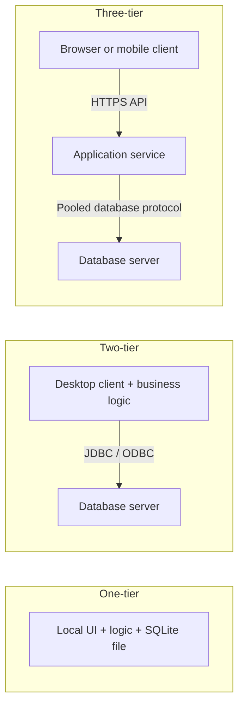
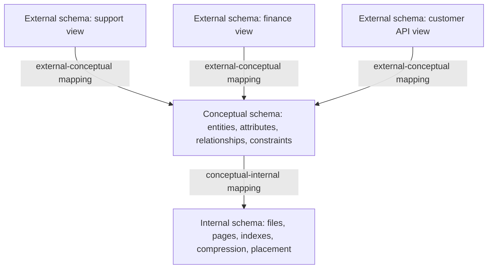
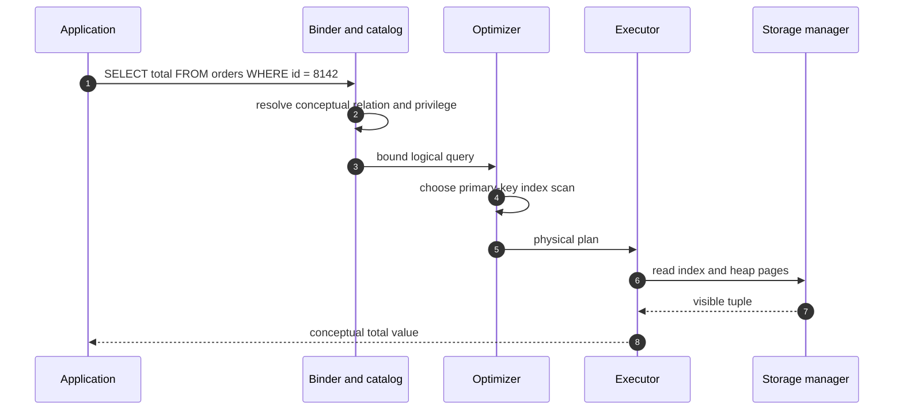
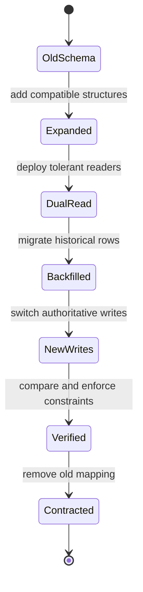

# DBMS Architecture, ANSI-SPARC & Data Independence

A Database Management System separates application-facing data models from query execution, concurrency control, and physical storage. Its architecture determines who owns business access, how schemas can evolve, and whether thousands of clients overwhelm the database with connections. Interviewers use ANSI-SPARC and deployment tiers to test whether a candidate can distinguish logical abstraction from physical topology.

---

## 🟢 Beginner Level

### What a DBMS provides

A **Database Management System (DBMS)** is software that defines, stores, retrieves, changes, protects, and recovers structured data. Applications express requests through SQL or a database API; the DBMS translates them into operations on pages, logs, indexes, and storage devices.

Compared with application-owned files, a DBMS centralizes mechanisms that are difficult to implement correctly in every service:

- A schema and constraints that define valid data.
- Declarative query processing and optimization.
- Transactions and concurrency control.
- Authorization, roles, and auditable access.
- Buffering, indexing, and storage allocation.
- Write-ahead logging, backup, and crash recovery.
- A shared system catalog describing database objects.



The query processor parses SQL, resolves names and types, rewrites expressions, selects an execution plan, and runs operators. The transaction manager coordinates isolation and atomicity. The buffer manager keeps frequently accessed pages in memory, while the storage manager organizes persistent files and pages.

A DBMS does not make every data problem relational. Large binary objects may live in object storage, streams may live in a log, and search documents may live in a dedicated index. The DBMS remains the source of truth when relational constraints and transactions define correctness.

### File storage versus database management

A plain file can be the right choice for a small, single-writer, append-only data set. Problems appear when many independent programs must update shared facts safely.

| Concern | Application-managed files | DBMS |
|---|---|---|
| Structure | Convention in program code | Declared schema and catalog |
| Concurrent updates | Application must coordinate | Transactions and locks or MVCC |
| Querying | Custom scans and parsers | Declarative SQL and optimizer |
| Integrity | Repeated validation logic | Keys, checks, and constraints |
| Recovery | Custom backup and repair | WAL, checkpoints, and recovery |
| Access control | File permissions or custom code | Users, roles, grants, row policies |
| Data independence | File format coupled to readers | Schema mappings hide many changes |

File processing often duplicates the same customer address across reports. Updates can then change one copy and leave others stale. A normalized database stores the fact once and presents purpose-specific views to different consumers.

The trade-off is operational weight. A DBMS needs memory, background processes, backups, upgrades, monitoring, and skilled administration; it is not automatically simpler than a file for a tiny local tool.

### Core DBMS components and request flow

A typical relational engine contains cooperating subsystems:

1. **Parser and binder** validate syntax, resolve tables and columns, and check types and privileges.
2. **Rewrite system** expands views and applies semantics-preserving transformations.
3. **Optimizer** estimates cardinality and cost for candidate access paths and join orders.
4. **Executor** runs scans, joins, sorts, aggregates, and mutations.
5. **Transaction manager** assigns transaction identity and enforces isolation.
6. **Lock or version manager** coordinates concurrent visibility.
7. **Buffer manager** maps database pages into memory and schedules dirty-page writes.
8. **Recovery manager** writes log records and restores a consistent state after failure.
9. **Catalog** stores schemas, constraints, indexes, privileges, and statistics.

A SQL statement crosses these components even when it returns one row. The optimizer may choose an index without the application knowing its page layout, which is a first example of physical data independence.

### One-tier, two-tier, and three-tier deployment

A **tier** describes a deployment and communication boundary, not an ANSI-SPARC schema level.



**One-tier architecture** places interface, logic, and local storage on one machine. SQLite in a desktop application is easy to distribute and operates offline, but sharing and centralized governance require additional design.

**Two-tier architecture** lets a desktop or internal client connect directly to a database server using JDBC or ODBC. It can be effective on a controlled local network, but credentials and database permissions reach every client, business rules are distributed, and each installation may hold a connection.

**Three-tier architecture** inserts an application server between presentation and database tiers. The service authenticates callers, enforces use cases, owns transactions, and multiplexes requests through a database connection pool. The database can remain on a private network and expose a narrow account to the application.

| Property | One-tier | Two-tier | Three-tier |
|---|---|---|---|
| Database access | Local process | Client connects directly | Application service connects |
| Business logic | Local executable | Mostly client | Central service |
| Credential exposure | Local file/process | Every installed client | Server-side secret store |
| Horizontal scaling | Limited | Database becomes direct bottleneck | Stateless app tier can scale |
| Best fit | Embedded/offline tool | Controlled departmental system | Web and mobile platform |

Three-tier does not mean exactly three physical machines. Twenty application instances and a replicated database cluster still form the same three logical responsibilities.

### Database languages and catalog metadata

SQL includes several kinds of operation, even though engines expose them through one language:

- Data Definition Language creates and alters schemas, tables, views, and indexes.
- Data Manipulation Language selects, inserts, updates, and deletes rows.
- Data Control Language grants and revokes privileges.
- Transaction Control Language commits, rolls back, and establishes savepoints.

Definitions are stored in the **system catalog**. When a query references `orders.total`, the binder consults catalog metadata for the table, column type, privileges, constraints, and available indexes. The catalog is itself persistent database data and must be transactionally consistent.

---

## 🟡 Intermediate Level

### The ANSI-SPARC 3-Schema Architecture

ANSI-SPARC separates database description into **external**, **conceptual**, and **internal** schemas. The model is about abstraction and mappings, not about browser, service, and database deployment machines.



The three levels answer different questions:

| Schema level | Primary question | Typical definitions |
|---|---|---|
| External | What does this user or application see? | Views, renamed fields, derived columns, restricted rows |
| Conceptual | What facts and rules exist for the enterprise? | Relations, attributes, keys, relationships, constraints |
| Internal | How are those facts represented physically? | Pages, heap files, B+ trees, partitions, compression |

One conceptual schema can support many external schemas. A support agent may see an order identifier and delivery status, finance may see payment totals, and a customer API may see only orders belonging to the authenticated customer.

The model is idealized. Real products expose different feature boundaries, but the separation remains useful for reasoning about compatibility and ownership.

### External schemas and external-conceptual mappings

An external schema is a user- or application-specific view of conceptual data. It can hide sensitive columns, rename implementation-oriented fields, combine relations, or derive a stable value.

```sql
CREATE VIEW support_order_view AS
SELECT
    o.id AS order_id,
    c.display_name AS customer_name,
    o.status,
    o.created_at
FROM orders AS o
JOIN customers AS c ON c.id = o.customer_id;
```

The **external-conceptual mapping** explains how `customer_name` comes from the conceptual customer relation. Applications querying the view need not know which join or base column supplies it.

Views do not automatically create a security boundary. The database account still needs carefully scoped grants, and definer/invoker rights differ among engines. Complex views may also be non-updatable or require triggers and explicit write APIs.

External schemas can be expressed through database views, API response models, semantic layers, or combinations of them. A Java DTO is not part of the database catalog, but it serves a similar application-facing abstraction role.

### Conceptual schema and enterprise constraints

The conceptual schema describes logical entities and their relationships independently of page placement. For an order domain it may define:

- Customer and Order relations.
- Primary keys identifying each row.
- A foreign key from order to customer.
- A non-negative total constraint.
- A uniqueness rule for an external payment reference.
- Data types and nullability.

```sql
CREATE TABLE orders (
    id BIGINT PRIMARY KEY,
    customer_id BIGINT NOT NULL REFERENCES customers(id),
    payment_reference TEXT UNIQUE,
    status TEXT NOT NULL,
    total NUMERIC(12, 2) NOT NULL CHECK (total >= 0),
    created_at TIMESTAMP NOT NULL
);
```

These declarations state what constitutes valid data without prescribing whether rows live in a heap, clustered index, or compressed partition. The DBMS enforces them for every authorized writer, including scripts that bypass an application service.

Conceptual design should use business meaning rather than current screen layout. A field duplicated only because two pages display it creates update anomalies and weakens independence.

### Internal schema and conceptual-internal mappings

The internal schema describes physical representation and access paths:

- File organization and tablespaces.
- Fixed- or variable-length pages.
- Heap, clustered, or index-organized storage.
- B+ tree, hash, bitmap, and inverted indexes.
- Row or column compression.
- Horizontal partitions and physical placement.
- Buffer replacement and prefetch metadata.

A **conceptual-internal mapping** tells the engine how a conceptual relation and attribute map to physical records. The optimizer uses catalog statistics and indexes to choose an access path, while the executor and storage manager translate logical row operations to pages.



Adding an index changes the internal schema and available plan but not the conceptual definition of `orders`. The application still issues the same SQL.

### Logical and physical data independence

**Data independence** is the ability to change one schema level without forcing changes at the next higher level.

**Physical data independence** means internal changes do not alter the conceptual or external contracts. Examples include:

- Creating or dropping a performance index.
- Moving a table to faster storage.
- Changing compression or page organization.
- Partitioning a logical table by date.
- Rebuilding a table without changing its columns.

**Logical data independence** means conceptual changes can be hidden from external schemas and applications through mappings. Examples include splitting one relation into normalized relations behind a compatibility view, adding an optional attribute, or renaming a conceptual column while retaining the old external name.

| Dimension | Physical independence | Logical independence |
|---|---|---|
| Changed level | Internal schema | Conceptual schema |
| Protected level | Conceptual and external | External schemas and programs |
| Typical mapping | Conceptual to internal | External to conceptual |
| Relative difficulty | Usually stronger/easier | Usually weaker/harder |
| Example | Add B+ tree index | Split customer address into another relation |

Logical independence is harder because applications depend on column meaning, shape, constraints, and write behaviour. A view can preserve reads after a table split, but writes may need triggers, migration logic, or a new API.

Adding a non-null column without a default is not logically independent for existing inserts. Compatibility must cover reads *and* writes, not merely make old SELECT statements parse.

### Worked example: connection multiplexing and memory

Consider 12,000 active web users. Each user submits an average of 0.04 database-backed requests per second, so database request arrival rate is:

$$
\lambda = 12{,}000 \times 0.04 = 480\text{ requests/s}
$$

If each database interaction holds a connection for an average of 40 ms, Little's Law estimates average concurrent connection demand:

$$
L = \lambda W = 480 \times 0.040 = 19.2
$$

A three-tier service might start with a pool near 24 to 30 connections, then load-test tail latency and database capacity. It does not need one connection per logged-in user.

In a two-tier design where all 12,000 clients keep a dedicated connection and each database backend consumes approximately 8 MB, connection process memory alone is:

$$
12{,}000 \times 8\text{ MB} = 96{,}000\text{ MB} \approx 93.75\text{ GiB}
$$

A pool of 30 comparable backends consumes about $30 \times 8\text{ MB} = 240\text{ MB}$ before shared database memory. Connection pooling reduces session overhead by roughly 400 times in this simplified comparison.

The pool is not free capacity. If average hold time rises from 40 ms to 400 ms during a slow query, demand becomes $480 \times 0.400 = 192$ concurrent connections. A 30-connection pool then queues requests, providing backpressure instead of allowing 192 sessions to overload the database.

Pool sizing must account for database CPU, storage latency, transaction length, replicas, and total pools across every service instance. Ten application replicas with pool size 30 create up to 300 database connections, not 30.

---

## 🔴 Expert Level

### Schema mappings during zero-downtime evolution

Data independence is exercised during deployments. A safe expand-and-contract migration separates compatibility from cleanup:

1. **Expand** the conceptual schema with a nullable column, new table, or compatible index.
2. Deploy code that can read old and new representations.
3. Backfill historical rows in bounded batches.
4. Switch writes to the new representation, sometimes dual-writing temporarily.
5. Verify completeness and enforce new constraints.
6. Move external views or API mappings to the new conceptual form.
7. **Contract** by removing the old representation only after all consumers migrate.



Renaming a column in one deployment is often a breaking conceptual change. Adding the new column, mapping both names during migration, and removing the old one later preserves external contracts across independently deployed services.

A database view can preserve a read contract, but it may hide performance costs or make writes ambiguous. Measure the mapped path and document which layer owns the compatibility deadline.

### Catalog, statistics, and prepared-plan coupling

The system catalog connects all three schema levels. It stores conceptual definitions, external views, internal indexes, ownership, privileges, and optimizer statistics.

Schema changes acquire locks and invalidate dependent metadata or cached plans. A supposedly harmless migration can block behind a long transaction, while new requests queue behind the schema lock. Production migrations need lock timeouts, small steps, and observation of active transactions.

Statistics are internal metadata rather than conceptual truth. Stale or unrepresentative statistics can make an unchanged SQL query choose a poor physical plan, demonstrating that physical independence protects correctness but does not guarantee stable performance.

Prepared statements also couple to inferred parameter and result types. Changing a column type behind a compatibility view can require plan invalidation and driver metadata refresh even when the external column name remains stable.

### Deployment topology, security, and failure boundaries

Three-tier architecture centralizes controls but introduces network and process boundaries. The application tier needs bounded connection pools, statement timeouts, transaction deadlines, TLS to the database, secret rotation, and graceful degradation.

The database account should follow least privilege. A read service does not need schema-alter permissions, and a tenant-aware application may combine scoped queries with database row policies as defence in depth.

Connection pools multiplex idle time, not active transactions. A request holding a connection while making a slow remote call prevents reuse and can exhaust the pool. Keep transactions short and avoid network calls inside them.

A database proxy can further multiplex connections, but session state, temporary tables, prepared statements, and transaction pooling modes affect compatibility. Adding a proxy changes the physical deployment without intending to change conceptual data, yet applications that depend on session-local behaviour may reveal hidden coupling.

Read replicas improve capacity but introduce replication lag. Routing a read immediately after a write to an asynchronous replica can violate read-your-writes expectations even though the conceptual schema is identical.

### Architecture trade-offs and anti-patterns

Common architectural failure modes include:

- **Shared database with uncontrolled ownership**: many services alter the same tables, making conceptual evolution require coordinated releases.
- **Business logic only in clients**: old two-tier clients continue submitting obsolete rules after a policy change.
- **One pool per request**: repeatedly creating connections defeats pooling and overloads authentication.
- **Oversized pools**: every service instance opens its maximum, causing database context switching and memory pressure.
- **External views treated as free**: nested views hide expensive joins and prevent simple ownership reasoning.
- **Physical detail leaked into APIs**: page offsets, shard identifiers, or storage keys become permanent client contracts.
- **Schema migration without compatibility period**: one deployment breaks old application replicas still serving traffic.

A well-separated architecture does not eliminate change. It localizes change behind mappings and creates explicit contracts whose compatibility can be tested.

### Common Misconceptions

1. **"ANSI-SPARC three-schema architecture is the same as three-tier web architecture."**
   *Correction*: ANSI-SPARC describes external, conceptual, and internal data abstraction. Three-tier deployment describes presentation, application, and database communication boundaries; either can exist without the other.
2. **"Physical data independence guarantees unchanged query performance."**
   *Correction*: It guarantees that physical changes do not alter logical meaning or require query rewrites. Indexes, statistics, storage, and plan choices can still change latency dramatically.
3. **"A view always provides complete logical data independence."**
   *Correction*: A view can preserve a read shape but may be non-updatable, slower, or unable to reproduce old constraint semantics. Writes, privileges, and performance are part of the external contract too.
4. **"Connection pools allow an unlimited number of concurrent database operations."**
   *Correction*: A pool bounds active database sessions and queues excess demand. It protects the database only when its size, acquisition timeout, and transaction duration are controlled across all replicas.
5. **"Adding a column is always backward compatible."**
   *Correction*: A required column without a default breaks old inserts, and `SELECT *` consumers may break on a changed result shape. Compatibility depends on defaults, nullability, writers, drivers, and external mappings.

### Interview Questions

**Q1. What are the three ANSI-SPARC schema levels?** `[easy]`

The external level defines user- or application-specific views, the conceptual level defines enterprise entities and constraints, and the internal level defines physical representation. Mappings connect external schemas to the conceptual schema and the conceptual schema to storage. This separation lets many consumers share data without knowing every physical detail.

**Q2. What is physical data independence?** `[easy]`

Physical data independence is the ability to change internal storage without changing the conceptual schema or application queries. Adding an index, changing compression, or moving files to another device are typical examples. Performance may change, but logical values and contracts must remain the same.

**Q3. How does a two-tier deployment differ from a three-tier deployment?** `[easy]`

In two-tier deployment, the client connects directly to the database and often contains substantial business logic. Three-tier deployment inserts an application service that owns authentication, use cases, transactions, and pooled database access. The added tier improves central control and scale but adds network, deployment, and operational complexity.

**Q4. What is stored in a DBMS system catalog?** `[easy]`

The catalog stores schema objects, columns, types, constraints, views, indexes, ownership, privileges, and optimizer statistics. Parsing, authorization, optimization, migration tooling, and administration all consult it. Because it defines how logical names map to implementation objects, catalog consistency is critical to every query.

**Q5. Why is logical data independence harder than physical data independence?** `[medium]`

Applications depend directly on conceptual names, types, relationships, constraints, and write behaviour. Physical structures can often change behind the storage manager, while a conceptual change may alter the meaning or shape consumers observe. Compatibility views and expand-contract migrations help, but they must preserve both reads and writes.

**Q6. How do external-conceptual and conceptual-internal mappings differ?** `[medium]`

An external-conceptual mapping translates a consumer view into conceptual entities and attributes. A conceptual-internal mapping translates those logical entities into records, files, pages, and access paths. The first supports logical independence, while the second supports physical independence.

**Q7. Why does three-tier architecture usually use a connection pool?** `[medium]`

HTTP clients are mostly idle and should not each own a database session. A pool reuses a bounded set of authenticated connections across short transactions, reducing setup cost and protecting database memory and CPU. Excess work waits or times out, so pool capacity and transaction duration become deliberate backpressure controls.

**Q8. Does creating an index violate data independence?** `[medium]`

Creating an index changes the internal schema but normally leaves conceptual tables and external views unchanged. It is therefore a textbook use of physical data independence. The optimizer may choose a different plan and performance can improve or regress, so operational validation is still required.

**Q9. How can a view preserve compatibility during table normalization?** `[medium]`

The conceptual model can split one table into related tables while a view joins them and retains the old external columns. Existing read consumers continue using the view as an external-conceptual mapping. Update behaviour, constraints, and performance need explicit handling because the compatibility view may not be naturally writable or cheap.

**Q10. Why can adding more pooled database connections reduce throughput?** `[medium]`

Once database CPU, storage, locks, or memory are saturated, extra sessions add context switching and contention rather than useful parallelism. Multiple application replicas also multiply their configured pool sizes, so a modest per-instance value can become a large global total. Size pools from measured database capacity and transaction hold time, not from web-client count.

**Q11. Scenario: a column rename breaks old service replicas during a rolling deployment. How should the migration be redesigned?** `[hard]`

Use an expand-and-contract sequence: add the new representation, deploy readers tolerant of both names, backfill, and switch writes before removing the old column. A compatibility view or temporary dual mapping can preserve the external contract while replicas roll. Contract only after telemetry proves no old consumer remains and constraints on the new representation are enforced.

**Q12. Scenario: 10 application replicas each configure a pool of 50, but the database supports 200 sessions. What happens and what do you change?** `[hard]`

The fleet can attempt 500 pooled sessions, exceeding the database limit before administrative and background connections are counted. Connection creation will fail or the database will thrash, and requests may cascade into timeouts and retries. Establish a fleet-wide connection budget, divide it among replicas with headroom, shorten transactions, and apply bounded acquisition timeouts.

**Q13. How can a physical deployment change expose hidden application coupling?** `[hard]`

Introducing transaction-pooling middleware may break code that relies on session variables, temporary tables, or session-bound prepared statements. Those behaviours were physical session assumptions even though application SQL appeared logically stable. Inventory session state, test the chosen pooling mode, and either preserve session affinity or remove the hidden dependency.

**Q14. Scenario: an online index migration is blocked for minutes despite being advertised as non-blocking. What do you inspect?** `[hard]`

Inspect long-running transactions and the exact metadata locks required at the migration's start and finalization phases. Online operations often reduce data-copy blocking but still need brief schema locks that can queue behind an old transaction, with new requests then queuing behind the migration. Use lock timeouts, terminate or drain blockers safely, schedule bounded phases, and monitor lock queues during rollout.

### Further Reading

- [PostgreSQL documentation: system catalogs](https://www.postgresql.org/docs/current/catalogs.html) describes the metadata used for schemas, types, indexes, privileges, and planning.
- [PostgreSQL documentation: views](https://www.postgresql.org/docs/current/sql-createview.html) documents external-style mappings, security options, and update behaviour.
- [PostgreSQL documentation: database physical storage](https://www.postgresql.org/docs/current/storage.html) explains pages, files, tablespaces, and internal representation.
- [HikariCP configuration reference](https://github.com/brettwooldridge/HikariCP#configuration-knobs-baby) documents pool sizing controls, timeouts, and connection lifecycle behaviour.
