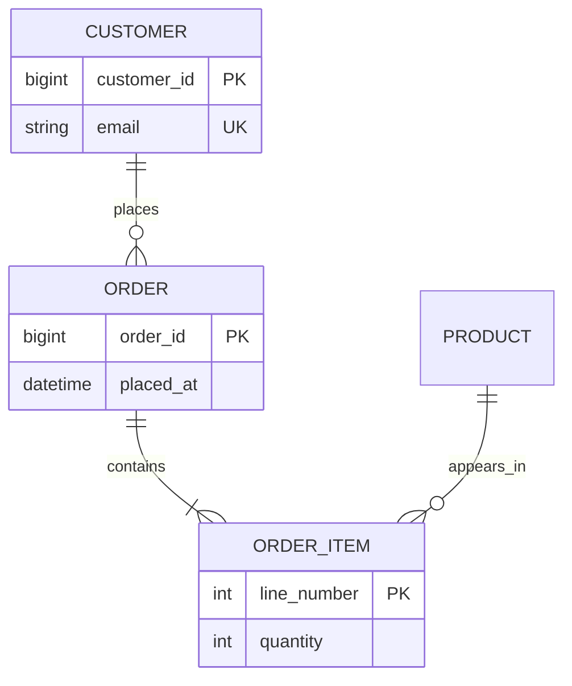
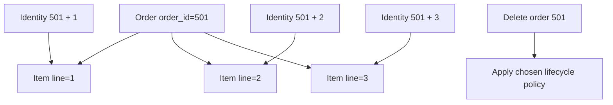
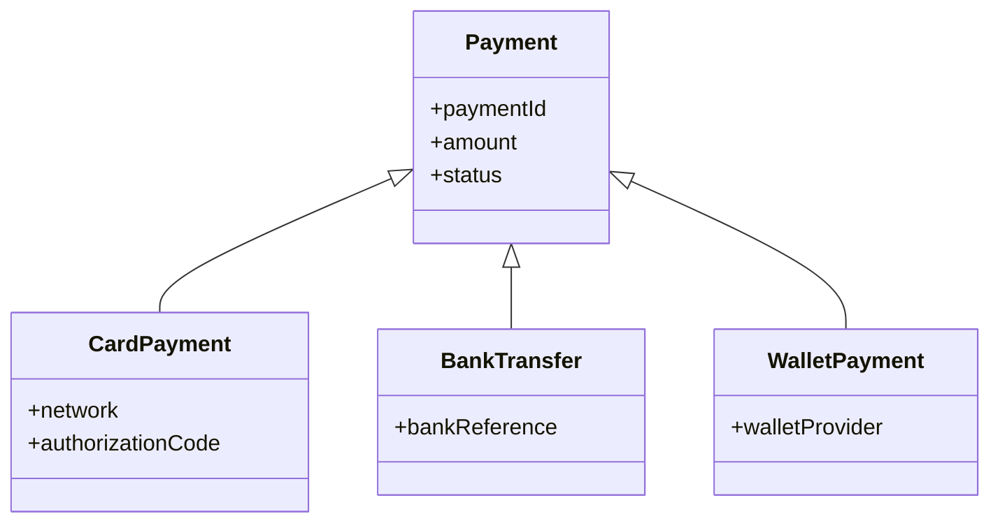
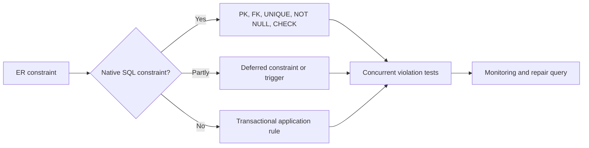

# Entity-Relationship Modeling and Relational Mapping

Entity-relationship modeling turns business rules into a conceptual design before tables, indexes, and vendor-specific SQL distract from the domain. Interviewers use ER problems to test whether an engineer can translate ambiguous requirements into identity, relationships, and enforceable constraints without silently losing meaning.

---

## 🟢 Beginner Level

### Entities, attributes, relationships, and mapping

An **entity** is a distinguishable thing about which a system retains facts: a particular customer, product, invoice, or shipment. An **entity type** describes the common structure, while an **entity set** is the collection of current instances. The `Customer` type may define `customer_id` and `email`; customers 101 and 102 are instances.

An **attribute** records a property of an entity or relationship. A **relationship** records an association among entity instances, such as a customer placing an order. **Mapping** converts this conceptual model into relational tables, primary keys, foreign keys, and constraints.


The ER model is implementation-neutral. It says what must be true in the domain before deciding how PostgreSQL, MySQL, or another engine will enforce it.

### Entity identity and keys

A strong entity has an independent identifier:

- A **superkey** is any attribute set that uniquely identifies an instance.
- A **candidate key** is a minimal superkey.
- A **primary key** is the candidate key selected for relational identity.
- An **alternate key** is a candidate key not selected as primary.
- A natural key comes from the domain; a surrogate key is generated.

For `Employee`, both `employee_number` and a verified corporate email might be candidate keys. If `employee_id` is a generated primary key, email still needs a `UNIQUE` constraint when the domain says it cannot repeat.

Keys identify instances; names usually do not. Two people can share a name, and an email can change, so identity follows domain stability rather than convenient sample data.

### Attribute classifications

Attributes carry different mapping implications:

| Attribute kind | Example | Relational treatment |
|---|---|---|
| Simple | `salary` | One column |
| Composite | Address with street and city | Flatten useful components |
| Multivalued | Several phone numbers | Separate child relation |
| Derived | Age from birth date | Compute when practical |
| Optional | Middle name | Nullable when absence has one meaning |
| Key | `course_id` | Primary or unique constraint |

A composite attribute should be decomposed only to the level the application queries and validates. Storing both `date_of_birth` and changing `age` values creates inconsistency. Packing phone numbers into a comma-separated column sacrifices relational querying and integrity.

### Relationships have roles and attributes

A relationship type states how entity types associate. A relationship instance is one concrete fact, such as student 42 enrolling in course offering 301.

Relationships can have attributes. `Enrollment` can carry `enrolled_at`, `status`, and `grade` because these describe the student-offering association. Role names matter in recursive relationships: an `Employee` participates in `ReportsTo` as both **manager** and **subordinate**.

| Degree | Participants | Example |
|---|---:|---|
| Unary | 1 type in multiple roles | Employee supervises Employee |
| Binary | 2 types | Customer places Order |
| Ternary | 3 types | Supplier supplies Part to Project |
| N-ary | N types | Multi-party agreement |

A ternary relationship must not be split automatically into three binary relationships. The original fact may depend on the combination of all three participants.

### Cardinality and participation

**Cardinality** sets the maximum number of associations: one-to-one (1:1), one-to-many (1:N), or many-to-many (M:N). **Participation** sets the minimum: optional participation has minimum zero, while total participation has minimum one.

Min-max notation makes both explicit:

- `Customer (0..N) Order` means a customer may place no orders or many.
- `Order (1..1) Customer` means every order belongs to exactly one customer.
- Together these form 1:N with total participation on `Order`.



In crow's-foot notation, `||` means exactly one, `o{` means zero or many, and `|{` means one or many. The relational schema must still enforce the same rules.

### Strong and weak entities

A **strong entity** has an independent key. A **weak entity** lacks a complete independent key and is identified through an owner plus a **partial key**, also called a discriminator.

`OrderItem` is weak when line number 1 is unique only inside one order. Its identity is `(order_id, line_number)`, and it has total participation in the identifying relationship. Deleting the owner often deletes its dependants, but retention requirements can make cascading deletion inappropriate.

Adding a surrogate `order_item_id` may simplify references, but it does not erase semantic weakness. Preserve the domain uniqueness of `(order_id, line_number)`.

---

## 🟡 Intermediate Level

### From requirements to a model

Use a repeatable discovery process:

1. Extract nouns that may represent entity types.
2. Extract verbs that may represent relationships.
3. Identify candidate keys and facts that change over time.
4. Ask for minimum and maximum participation on both sides.
5. Attach facts to the entity or relationship they describe.
6. Test create, update, deletion, and historical scenarios.
7. Translate the model and trace each constraint to enforcement.

Suppose a university says: “Students register for course offerings. A course can run in several terms, and lecturers teach particular offerings.” `Course` and `CourseOffering` must differ because an offering has a term, capacity, and lecturer. Connecting a student directly to `Course` loses the term in which registration occurred.

### Mapping strong entities and attributes

Map each strong entity to a table. Flatten useful composite components, retain the selected primary key, and translate alternate keys to unique constraints.

```sql
CREATE TABLE student (
    student_id BIGINT PRIMARY KEY,
    university_email VARCHAR(254) NOT NULL UNIQUE,
    given_name VARCHAR(80) NOT NULL,
    family_name VARCHAR(80) NOT NULL,
    date_of_birth DATE NOT NULL
);

CREATE TABLE student_phone (
    student_id BIGINT NOT NULL
        REFERENCES student(student_id) ON DELETE CASCADE,
    phone_number VARCHAR(32) NOT NULL,
    phone_type VARCHAR(16) NOT NULL,
    PRIMARY KEY (student_id, phone_number)
);
```

`student_phone` maps a multivalued attribute. Its composite key prevents duplicates for one student, while its foreign key preserves ownership.

### Mapping binary one-to-many relationships

For 1:N, put the one-side primary key as a foreign key on the many side. Nullability expresses participation on the many side: `NOT NULL` makes association mandatory.

```sql
CREATE TABLE department (
    department_id BIGINT PRIMARY KEY,
    name VARCHAR(120) NOT NULL UNIQUE
);

CREATE TABLE employee (
    employee_id BIGINT PRIMARY KEY,
    department_id BIGINT NOT NULL
        REFERENCES department(department_id),
    manager_id BIGINT
        REFERENCES employee(employee_id),
    display_name VARCHAR(160) NOT NULL
);
```

Each employee belongs to one department. `manager_id` maps an optional recursive relationship, so a top executive can have no manager.

Putting employee identifiers in the department row would create a repeating group or arbitrary column limit. The N-side foreign key represents each association with one scalar value.

### Mapping one-to-one relationships

For 1:1, place a foreign key on one side and add `UNIQUE`. Prefer the side with total participation to avoid nulls and expose the mandatory rule.

```sql
CREATE TABLE passport (
    passport_id BIGINT PRIMARY KEY,
    citizen_id BIGINT NOT NULL UNIQUE
        REFERENCES citizen(citizen_id),
    expires_on DATE NOT NULL
);
```

The foreign key enforces existence, but only `UNIQUE (citizen_id)` enforces at most one passport per citizen. `NOT NULL` gives every passport a citizen. Requiring every citizen to have a passport may need deferred validation because this foreign key cannot demand a reverse row.

### Mapping many-to-many relationships

Map M:N as an associative relation containing foreign keys to both participants. Relationship attributes live on that relation.

```sql
CREATE TABLE course_offering (
    offering_id BIGINT PRIMARY KEY,
    course_code VARCHAR(20) NOT NULL,
    term_code VARCHAR(12) NOT NULL,
    capacity INTEGER NOT NULL CHECK (capacity > 0),
    UNIQUE (course_code, term_code)
);

CREATE TABLE enrollment (
    student_id BIGINT NOT NULL REFERENCES student(student_id),
    offering_id BIGINT NOT NULL REFERENCES course_offering(offering_id),
    enrolled_at TIMESTAMP NOT NULL,
    status VARCHAR(16) NOT NULL,
    grade VARCHAR(2),
    PRIMARY KEY (student_id, offering_id)
);
```

The composite key prevents duplicate enrollment. If repeat attempts are valid, introduce an attempt discriminator or separate identity and define the new uniqueness rule.

### Worked example: relation count

Model an order domain:

- `Customer` is strong and has multivalued phones.
- `Order` is strong; each order belongs to one customer.
- `Product` is strong and has multivalued certifications.
- `OrderItem` is weak, identified by order and `line_number`.
- Each item refers to one product; a product appears on many items.

Count the mapped relations:

| ER element | Relation | Running total |
|---|---|---:|
| Customer | `customer` | 1 |
| Customer phones | `customer_phone` | 2 |
| Order | `sales_order` with customer FK | 3 |
| Product | `product` | 4 |
| Certifications | `product_certification` | 5 |
| Weak OrderItem | `order_item` | 6 |

Customer–Order adds a foreign key, not a seventh table. Product–OrderItem also uses `product_id` on the many side. The exact answer is therefore **six relations**.

For the original quiz variant—two strong entities in M:N, each with one multivalued attribute—the count is **five**: two entity relations, two multivalue relations, and one junction.

### Worked cardinality estimate

Suppose 12,000 students can each take at most 6 offerings, while 800 offerings allow at most 120 students:

$$
\text{student maximum} = 12{,}000 \times 6 = 72{,}000
$$

$$
\text{offering maximum} = 800 \times 120 = 96{,}000
$$

Both constraints apply, so at most $\min(72{,}000, 96{,}000) = 72{,}000$ enrollment rows can exist. This is a capacity bound, not proof of schedule feasibility because prerequisites and timetable clashes add constraints.

### Weak-entity mapping and lifecycle

The weak entity relation includes owner key, partial key, descriptive attributes, and a composite primary key.



An item cannot exist without an order, so the owner key is non-null. `ON DELETE CASCADE` expresses ownership only when deletion should truly remove dependant history.

### Ternary relationships preserve three-way facts

Consider `Supplier supplies Part to Project` with `agreed_price`. Price can depend on all three identifiers. Three binary tables cannot necessarily say which supplier provided which part to which project.

```sql
CREATE TABLE project_supply (
    supplier_id BIGINT NOT NULL REFERENCES supplier(supplier_id),
    part_id BIGINT NOT NULL REFERENCES part(part_id),
    project_id BIGINT NOT NULL REFERENCES project(project_id),
    agreed_price NUMERIC(12, 2) NOT NULL CHECK (agreed_price >= 0),
    PRIMARY KEY (supplier_id, part_id, project_id)
);
```

The key may be smaller only if a stated functional dependency permits it. Never infer that rule merely to shorten a key.

---

## 🔴 Expert Level

### Specialization, generalization, and ISA

Enhanced ER modeling represents subtype relationships with **ISA** hierarchies. **Specialization** starts from a supertype and defines narrower subtypes; **generalization** moves common properties from existing types to a supertype.

Two independent constraints shape an ISA hierarchy:

- **Disjoint** or **overlapping**: at most one subtype, or several.
- **Total** or **partial**: every supertype instance has a subtype, or some have none.



The diagram alone does not state overlap or completeness. “Every payment has exactly one method” means total, disjoint specialization.

### Mapping ISA hierarchies

| Strategy | Shape | Strength | Cost |
|---|---|---|---|
| Table per hierarchy | One table plus discriminator | Simple reads | Nullable subtype fields |
| Table per subtype | Complete table per concrete type | No subtype joins | Duplicated common data |
| Joined hierarchy | Supertype plus subtype tables | Normalized, expressive | Reconstruction joins |

In a joined hierarchy, subtype primary keys also reference the supertype:

```sql
CREATE TABLE payment (
    payment_id BIGINT PRIMARY KEY,
    amount NUMERIC(12, 2) NOT NULL,
    status VARCHAR(20) NOT NULL
);

CREATE TABLE card_payment (
    payment_id BIGINT PRIMARY KEY
        REFERENCES payment(payment_id) ON DELETE CASCADE,
    network VARCHAR(30) NOT NULL,
    authorization_code VARCHAR(80) NOT NULL UNIQUE
);
```

Foreign keys enforce subtype-to-supertype existence but not total and disjoint membership across several subtype tables. Deferred checks, triggers, or a trusted transaction may be required.

### Temporal relationships

Putting `department_id` on `employee` stores only the current assignment. It cannot answer which department employed a person on an earlier date.

```sql
CREATE TABLE department_assignment (
    employee_id BIGINT NOT NULL REFERENCES employee(employee_id),
    department_id BIGINT NOT NULL REFERENCES department(department_id),
    valid_from DATE NOT NULL,
    valid_to DATE,
    PRIMARY KEY (employee_id, valid_from),
    CHECK (valid_to IS NULL OR valid_to > valid_from)
);
```

Preventing overlaps requires an exclusion constraint where supported or serialized validation. Cardinality becomes “one active department at an instant,” not one department forever.

### Aggregation and relationship-as-object

Aggregation treats a relationship and its participants as a higher-level object. In implementation, an associative entity with its own identity often makes this explicit.

If a consultant is assigned to a project under a contract and an auditor reviews that assignment, the review targets the assignment fact—not the consultant or project alone. Promoting `Assignment` to an entity is appropriate when it has identity, lifecycle, attributes, or relationships.

### Constraint gaps between ER and SQL

Every ER constraint needs an enforcement owner:



Constraint gaps include mandatory participation on the referenced side of 1:1, minimum counts, capacity across rows, non-overlapping intervals, and total/disjoint subtype membership. Application checks race unless validation and writes share suitable transactions and locks.

### Production review checklist

- Does every entity have stable identity and alternate-key uniqueness?
- Do relationship attributes live on the association?
- Are minimum participation and maximum cardinality both documented?
- Are multivalued attributes mapped to child relations?
- Does each weak entity retain owner identity and lifecycle semantics?
- Are ternary facts preserved without lossy decomposition?
- Are subtype overlap and completeness constraints stated?
- Can the design answer required historical questions?
- Is every conceptual constraint assigned to an enforcement mechanism?
- Have concurrent insert and deletion scenarios been tested?

### Common Misconceptions

1. **“Every noun becomes an entity.”** A noun can be an attribute, role, or transient calculation. It needs entity status only with independent identity, lifecycle, or relationships.
2. **“A foreign key enforces 1:1.”** It enforces referenced existence, but several rows may point to one parent. A unique constraint enforces at most one.
3. **“Nullable foreign keys fully model optionality.”** Nullability expresses one side only. Opposite-side minimum counts may require stronger enforcement.
4. **“A surrogate key makes a weak entity strong.”** Storage identity does not erase domain dependence. Preserve owner-plus-discriminator uniqueness.
5. **“Three binary relationships always replace a ternary one.”** Binary projections can create spurious combinations or lose attributes dependent on all three parties.

### Interview Questions

**Q1. What is the difference between an entity type and an entity instance?** `[easy]`

An entity type is the schema-level description of a kind of thing, including its attributes and constraints. An entity instance is one particular member, such as student 42 conforming to Student. ER diagrams normally describe types rather than drawing every production instance.

**Q2. How do cardinality and participation differ?** `[easy]`

Cardinality describes the maximum associations allowed on each side. Participation describes the minimum, usually zero for optional or one for mandatory. Both are needed because “at most one” does not say whether zero is valid.

**Q3. Why does a multivalued attribute become another relation?** `[easy]`

A relational column should contain one value from its domain per row. A child relation stores each value independently and supports keys, validation, and indexes. Delimited values make integrity and membership queries unreliable.

**Q4. What identifies a weak entity?** `[easy]`

A weak entity is identified by its owner's key together with its partial key. It has total participation in the identifying relationship because it cannot exist without an owner. A composite relational key preserves this identity scope.

**Q5. Why is a foreign key placed on the many side of 1:N?** `[medium]`

Each many-side row associates with at most one one-side row, so one scalar foreign key represents the fact. Putting references on the one side creates a repeating group or arbitrary columns. N-side placement preserves first normal form and indexes efficiently.

**Q6. How is M:N mapped when the relationship has attributes?** `[medium]`

Create an associative relation with foreign keys to both participants and put relationship attributes there. The foreign-key pair is often the primary key unless repeat associations require another discriminator. The table represents the association rather than duplicating it in either entity.

**Q7. Why are three binaries not always equivalent to one ternary relationship?** `[medium]`

A ternary fact depends on one combination of three participants. Binary projections can recombine into triples that never existed, while attributes such as agreed price may depend on all three. Decompose only when business dependencies prove reconstruction is lossless.

**Q8. How do you enforce 1:1 in SQL?** `[medium]`

Place a foreign key on one side and add uniqueness to that column. Add `NOT NULL` when participation on that side is mandatory. Mandatory reverse participation may still require deferred validation or transactional logic.

**Q9. Compare the common ISA mapping strategies.** `[medium]`

Table-per-hierarchy reads simply but creates nullable subtype columns. Table-per-concrete-type avoids subtype joins but duplicates common data. Joined hierarchy normalizes common fields but requires joins and extra completeness enforcement.

**Q10. Two strong M:N entities each have one multivalued attribute. What is the minimum table count?** `[medium]`

The minimum is five: two entity relations, two multivalue relations, and one junction. M:N cannot fit as one foreign key because both sides have several associations. Relationship attributes remain in the same fifth table.

**Q11. Scenario: duplicate enrollments appear despite valid foreign keys. What is missing?** `[hard]`

Foreign keys prove that student and offering exist but do not prevent repeated pairs. Add a primary or unique constraint on `(student_id, offering_id)` when only one is valid. If retakes are allowed, include the attempt or term in uniqueness.

**Q12. Scenario: concurrent requests both assign the last course seat. What should enforce capacity?** `[hard]`

An ER cardinality note does not atomically enforce a count across rows. Serialize the capacity check and insertion by locking the offering or using a guarded atomic counter. A plain count-then-insert check races because both transactions see the same seat.

**Q13. Scenario: deleting an employee removes audit history modeled as weak dependants. What should change?** `[hard]`

The model incorrectly equated identity dependence with disposable lifecycle. Audit evidence needs restrictive deletion, soft deletion, or a durable actor snapshot. Cascade behavior must follow retention rules rather than convenient cleanup.

**Q14. How do you model department membership for historical as-of queries?** `[hard]`

Use a temporal assignment relation with employee, department, valid-from, and valid-to. Enforce valid, non-overlapping periods so one assignment is active at an instant. The association becomes retained history instead of a current foreign-key value.

### Further Reading

- [Peter Chen's original Entity-Relationship model paper](https://doi.org/10.1145/320434.320440)
- [PostgreSQL documentation: constraints](https://www.postgresql.org/docs/current/ddl-constraints.html)
- [PostgreSQL documentation: table inheritance](https://www.postgresql.org/docs/current/ddl-inherit.html)
- [Mermaid ER diagram syntax](https://mermaid.js.org/syntax/entityRelationshipDiagram.html)
