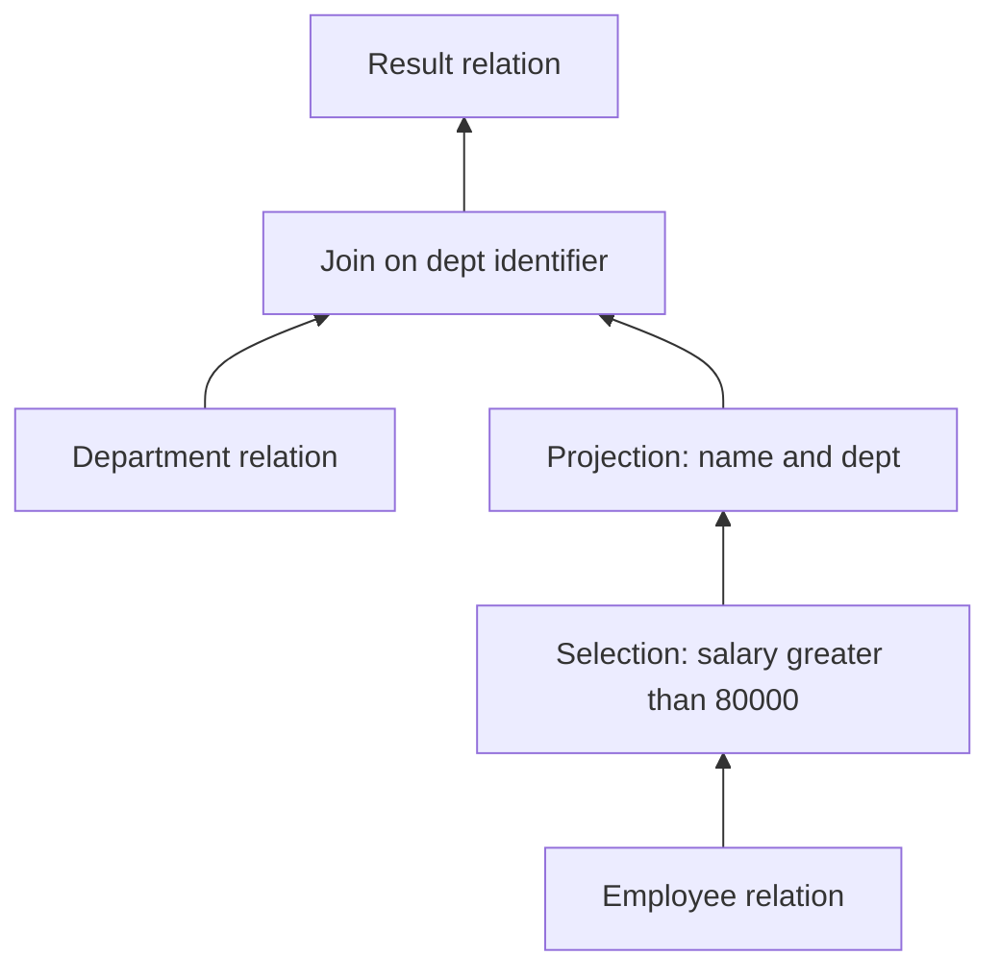
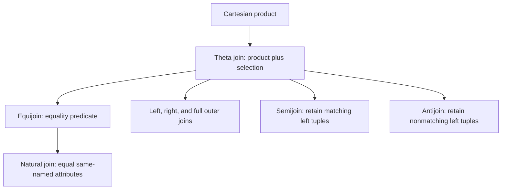
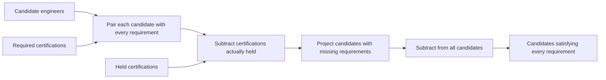
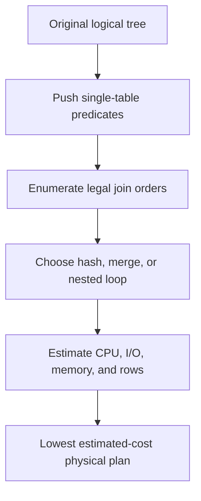

# Relational Algebra, Calculus & Advanced Joins

Relational algebra and relational calculus are the mathematical languages beneath relational query systems. Algebra describes how relations can be transformed, calculus describes which tuples satisfy a logical condition, and SQL combines ideas from both with practical extensions. Interviewers use these foundations to test whether a candidate can reason about joins, universal conditions, duplicate behaviour, and the optimizer rewrites behind an execution plan.

---

## 🟢 Beginner Level

### Relations and closure

A **relation** is a set of tuples sharing one schema. A schema names attributes and their domains; an instance is the set of tuples present at a particular time.

| Term | Meaning | Example for `Employee(id, name, dept, salary)` |
|---|---|---|
| Relation | Set of tuples with one schema | `Employee` |
| Tuple | One row-shaped value | `(101, 'Ada', 'D1', 90000)` |
| Attribute | Named role in a schema | `salary` |
| Domain | Permitted atomic values | Non-negative decimal amounts |
| Degree | Number of attributes | 4 |
| Cardinality | Number of current tuples | 12,500 |

Relational algebra has **closure**: every operator takes one or more relations and returns a relation. Because outputs have the same mathematical kind as inputs, operators compose into trees.



Pure relations are sets, so tuple order has no meaning and duplicate tuples do not exist. SQL tables and query results usually use **bag semantics**, where duplicates remain unless `DISTINCT` or a set operator removes them.

### The six fundamental operators

Six operators form a relationally complete algebra:

| Operator | Notation | Purpose | SQL analogue |
|---|---|---|---|
| Selection | $\sigma_p(R)$ | Keep tuples satisfying predicate $p$ | `WHERE` |
| Projection | $\pi_A(R)$ | Keep attributes $A$ | `SELECT DISTINCT` |
| Cartesian product | $R \times S$ | Pair every tuple from both inputs | `CROSS JOIN` |
| Union | $R \cup S$ | Tuples in either compatible input | `UNION` |
| Difference | $R-S$ | Tuples in left but not right | `EXCEPT` |
| Rename | $\rho_{S(...)}(R)$ | Rename relation or attributes | Aliases |

Selection is a horizontal restriction; projection is a vertical restriction. The expression

$$
\pi_{name}(\sigma_{salary>80000}(Employee))
$$

reads from the inside out: select high-salary tuples, then retain their names.

Cartesian product produces every pairing. If $|R|=10{,}000$ and $|S|=500$, then $|R\times S|=5{,}000{,}000$ before a filter. A join is usually preferable because it combines pairing and a meaningful condition.

Union and difference require **union compatibility**: the inputs have equal degree and corresponding attributes have compatible domains. Rename disambiguates self-joins and aligns schemas for set operations.

### Derived operators and the join family

Intersection, joins, semijoins, antijoins, and division can be expressed from the fundamental operators. Their names communicate intent and let optimizers choose specialised implementations.



| Join | Keeps | Typical SQL |
|---|---|---|
| Inner/theta | Matching pairs | `JOIN ... ON condition` |
| Equijoin | Pairs matching equality | `JOIN ... ON a.id = b.id` |
| Natural | Equal same-named attributes | `NATURAL JOIN` |
| Left outer | All left tuples, padding unmatched right | `LEFT JOIN` |
| Right outer | All right tuples, padding unmatched left | `RIGHT JOIN` |
| Full outer | All matched and unmatched tuples | `FULL OUTER JOIN` |
| Semijoin | Left tuples with at least one match | `WHERE EXISTS` |
| Antijoin | Left tuples with no match | `WHERE NOT EXISTS` |

Natural join is concise in theory but fragile in production. Adding an unrelated same-named column can silently change its matching predicate, so explicit `ON` or `USING` clauses document the intended relationship.

### Set operations, duplicates, and NULL

Pure algebra assumes two-valued predicates and no duplicate tuples. SQL adds duplicate rows and `NULL`, which represents missing or inapplicable information and introduces `UNKNOWN` alongside `TRUE` and `FALSE`.

SQL projection does not remove duplicates:

```sql
SELECT dept_id FROM employee;          -- bag projection
SELECT DISTINCT dept_id FROM employee; -- algebra-like projection
```

Likewise, `UNION` removes duplicates while `UNION ALL` retains them. Duplicate elimination needs a hash or sort and can dominate execution cost.

Equality with `NULL` is `UNKNOWN`, not true. An inner join on nullable keys therefore does not match two nulls. Use `IS NULL` or engine-supported null-safe equality only when that is the intended semantics.

### SQL as a declarative language

SQL states the desired result rather than a fixed algorithm. The engine parses it into a logical operator tree, applies equivalent rewrites, estimates costs, and selects physical operators.


Relational algebra is therefore not a literal execution script. It is a precise intermediate language that explains why two query forms may be equivalent and why an optimizer can legally transform one into another.

---

## 🟡 Intermediate Level

### Selection and projection laws

Equivalence laws allow a logical plan to be rearranged without changing its result under the stated semantics.

Selections commute and split:

$$
\sigma_a(\sigma_b(R))=\sigma_b(\sigma_a(R))=\sigma_{a\land b}(R)
$$

Projections collapse when the final attributes are a subset:

$$
\pi_A(\pi_B(R))=\pi_A(R)\quad\text{when }A\subseteq B
$$

A selection can move below a join when its predicate references only one input. Projection can move downward if it retains join keys and attributes needed by later predicates. These **predicate pushdown** and **projection pushdown** rewrites reduce rows and bytes early.

SQL details constrain rewrites. Volatile functions, error timing, outer joins, window functions, limits, and duplicate semantics can make an algebraically tempting transformation illegal.

### Joins on a concrete instance

Assume:

| `Employee` | `name` | `dept_id` |
|---|---|---|
| 1 | Ada | D1 |
| 2 | Ben | `NULL` |
| 3 | Cy | D9 |

| `Department` | `dept_id` | `dept_name` |
|---|---|---|
|  | D1 | Engineering |
|  | D2 | Sales |

An inner join returns only Ada with Engineering. A left join also returns Ben and Cy with null-padded department attributes. A full outer join adds the unmatched Sales department.

This query accidentally collapses a left join:

```sql
SELECT e.name, d.dept_name
FROM employee e
LEFT JOIN department d ON d.dept_id = e.dept_id
WHERE d.dept_name = 'Sales';
```

The `WHERE` predicate rejects null-padded rows. Moving the predicate into `ON` retains every employee and matches only Sales departments:

```sql
LEFT JOIN department d
  ON d.dept_id = e.dept_id
 AND d.dept_name = 'Sales'
```

Outer joins are not freely associative or commutative because padding introduces information about nonmatches. Optimizers need null-rejection proofs before reordering them.

### Semijoins, antijoins, and EXISTS

A left semijoin returns each qualifying left tuple once regardless of how many right matches exist. It is the logical form of `EXISTS`:

```sql
SELECT d.*
FROM department d
WHERE EXISTS (
    SELECT 1
    FROM employee e
    WHERE e.dept_id = d.dept_id
);
```

Using an ordinary join and `DISTINCT` can produce the same visible rows but creates duplicates first and removes them later. A semijoin communicates that only existence matters.

An antijoin uses `NOT EXISTS` to retain left tuples with no match. Prefer it over `NOT IN` when the subquery can return `NULL`; one null makes `x NOT IN (...)` evaluate to unknown for every nonmatching `x`.

### Division: the universal "for all" query

Division answers questions such as "Which engineers hold every required certification?" Let:



$$
Holds(engineer,cert)=\{(Ada,Java),(Ada,SQL),(Ben,Java),(Cy,Java),(Cy,SQL)\}
$$

$$
Required(cert)=\{Java,SQL\}
$$

For relations $R(X,Y)$ and $S(Y)$, division can be derived:

$$
R\div S=\pi_X(R)-\pi_X((\pi_X(R)\times S)-R)
$$

Worked evaluation:

1. Candidate engineers are $\{Ada,Ben,Cy\}$.
2. Candidate product Required creates $3\times2=6$ expected pairs.
3. Subtract actual `Holds`; the only missing pair is $(Ben,SQL)$.
4. Project engineers with a missing pair, giving $\{Ben\}$.
5. Subtract them from all candidates, giving $\{Ada,Cy\}$.

The SQL translation is double negation:

```sql
SELECT DISTINCT h.engineer
FROM holds h
WHERE NOT EXISTS (
    SELECT 1
    FROM required r
    WHERE NOT EXISTS (
        SELECT 1
        FROM holds h2
        WHERE h2.engineer = h.engineer
          AND h2.cert = r.cert
    )
);
```

Read it as: there does not exist a required certification for which there does not exist a matching held certification. If `Required` is empty, every candidate qualifies; confirm whether that mathematical vacuous truth matches the business rule.

### Tuple relational calculus

Tuple relational calculus (TRC) describes results with tuple variables and predicates:

$$
\{t\mid P(t)\}
$$

A filter is:

$$
\{e\mid e\in Employee\land e.salary>80000\}
$$

An existential join is:

$$
\{e.name\mid e\in Employee\land\exists d\in Department
(e.dept\_id=d.dept\_id\land d.name='Sales')\}
$$

TRC is **nonprocedural**: it defines which tuples qualify, not an evaluation order. Existential quantification maps naturally to `EXISTS`; universal quantification can be rewritten as $\forall xP(x)\equiv\neg\exists x\neg P(x)$.

### Domain relational calculus and safety

Domain relational calculus (DRC) binds variables to individual attribute values rather than whole tuples. A result has the form:

$$
\{\langle x_1,\ldots,x_n\rangle\mid P(x_1,\ldots,x_n)\}
$$

Both calculi need **safe** or domain-independent expressions. The unsafe expression $\{t\mid t\notin Employee\}$ ranges over every tuple not in the relation, an unbounded result dependent on an unspecified universe.

A safe result is bounded by values from input relations or finite constants. Safety makes logical queries implementable over a finite database and prevents the answer from changing merely because the ambient domain is imagined differently.

Codd's theorem connects the approaches: relational algebra and safe relational calculus have equivalent expressive power. A language that can express this class is called relationally complete.

### Translating logic and algebra to SQL

| Intent | Algebra or calculus | SQL pattern |
|---|---|---|
| Filter | $\sigma_p(R)$ | `WHERE p` |
| Project | $\pi_A(R)$ | `SELECT DISTINCT A` |
| Existential match | $R\ltimes S$ or $\exists$ | `WHERE EXISTS` |
| No match | Antijoin or $\neg\exists$ | `WHERE NOT EXISTS` |
| Set combination | $R\cup S$ | `UNION` |
| Difference | $R-S$ | `EXCEPT` |
| Universal condition | Division or $\forall$ | Double `NOT EXISTS` |
| Rename | $\rho$ | Table/column aliases |

SQL extends classic algebra with aggregation, ordering, windows, recursion, bags, and null semantics. Translation must account for those extensions instead of assuming textbook set equivalence blindly.

---

## 🔴 Expert Level

### Optimizer relevance and join enumeration

Join commutativity and associativity create many equivalent inner-join orders:

$$
R\bowtie S=S\bowtie R
$$

$$
(R\bowtie S)\bowtie T=R\bowtie(S\bowtie T)
$$



For $n$ relations, the number of possible bushy trees grows combinatorially. Optimizers use dynamic programming, heuristics, or genetic search to limit planning time. Cardinality estimates guide the search, so one underestimated intermediate result can select a disastrous join order.

Join constraints reduce freedom. Outer joins, lateral references, semijoin semantics, volatile expressions, and requested ordering may prevent an otherwise familiar rewrite.

### Worked physical-plan cost comparison

Suppose `Employee` occupies $B_E=10{,}000$ pages with 1,000,000 tuples, `Department` occupies $B_D=5$ pages with 100 tuples, and 102 buffer frames are available. A query requests employees in one department; predicate pushdown leaves 10,000 employees across about 100 clustered pages.

| Plan | Approximate page operations | Calculation |
|---|---:|---|
| Product then filter | Over 1,000,000 temp pages | Materialises up to 100 million pairs |
| Hash join full inputs | 10,005 reads | $B_E+B_D$ if build fits |
| Block nested loop full inputs | 10,500 reads | $B_E+\lceil B_E/(102-2)\rceil B_D$ |
| Push filter, then join | About 105 reads | 5 department pages + 100 employee pages |

The pushed plan reads about $10{,}005/105\approx95.3$ times fewer pages than the full hash join. The calculation is simplified—it omits cache hits and index traversal—but shows why reducing cardinality before joining matters.

If the estimate says one department owns 10,000 rows but skew means it owns 700,000, a nested-loop plan can fail badly. `EXPLAIN ANALYZE` compares estimated and actual row counts and exposes that algebra-to-physical-plan mismatch.

### Physical join algorithms

Logical join notation does not choose an algorithm:

| Algorithm | Useful when | Main cost/failure mode |
|---|---|---|
| Index nested loop | Outer input small, inner indexed | Random probes explode for large outer |
| Block nested loop | No useful equality/hash path | Repeated scans of inner pages |
| Hash join | Large unsorted equijoin | Build spills or recursively partitions |
| Sort-merge join | Inputs ordered or ordering reused | Sorting and multi-pass spill |

Hash join builds an in-memory table for one input and probes it with the other. Sort-merge sorts both sides then advances through equal key ranges. Nested loop evaluates the inner access path for every outer row; with a selective outer and fast index, that can be the best plan rather than a bug.

Theta joins with inequalities do not use ordinary equality hashing. Range indexes, merge variants, spatial indexes, or nested-loop strategies may be needed.

### Set identities that fail under SQL details

Algebraic reasoning must preserve SQL's observable semantics:

- `UNION ALL` is not idempotent, because duplicates remain.
- Pushing a predicate from `WHERE` into the nullable side of an outer join can change row preservation.
- `NOT IN` and `NOT EXISTS` differ when nulls appear.
- Projection can change duplicate counts before aggregation.
- Reordering volatile functions can change side effects or observed values.
- Applying `LIMIT` before versus after ordering changes which rows survive.

Optimizers encode transformation preconditions, not merely equations. Query reviewers should do the same.

### Relational limits and extensions

Classic relational algebra expresses first-order queries but not arbitrary transitive closure. "All descendants of an employee" or "every reachable network node" requires recursion beyond the basic operators.

SQL adds `WITH RECURSIVE`, aggregation, windows, and ordering. These extensions preserve relational inputs and outputs but exceed the classic core. Their placement introduces barriers: a window result depends on a defined partition and order, so predicates referencing it cannot simply move beneath the window.

Calculus equivalence describes expressiveness, not performance. Two equivalent formulations can expose different optimizer opportunities, especially around correlated subqueries, common table expressions, nulls, and engine-specific decorrelation.

### Common Misconceptions

1. **"Projection in algebra is exactly SQL SELECT."**
   Algebraic projection removes duplicates because relations are sets. SQL `SELECT` retains duplicates unless `DISTINCT` is requested, and deduplication adds real hash or sort cost.
2. **"A left join stays a left join regardless of the WHERE clause."**
   A null-rejecting `WHERE` predicate on right-side columns discards null-padded rows and can make the result equivalent to an inner join. Put right-side match restrictions in `ON` when unmatched left tuples must survive.
3. **"Cartesian product is always a database mistake."**
   A product is a legitimate fundamental operator and appears inside the definition of theta join. The mistake is materialising an unintended unconstrained product when no business pairing exists.
4. **"NOT IN and NOT EXISTS are interchangeable."**
   If the `NOT IN` subquery returns one null, comparisons become unknown and may return no rows. `NOT EXISTS` expresses an antijoin safely when correlated equality has normal null semantics.
5. **"Relational algebra tells the database which join algorithm to run."**
   Algebra describes a logical result and legal transformations. The cost-based optimizer separately selects hash, merge, nested-loop, scan, and spill strategies.

### Interview Questions

**Q1. What does closure mean in relational algebra?** `[easy]`

Every relational operator accepts relations and returns another relation. This lets selection, projection, joins, and set operations compose into arbitrarily deep expression trees. Closure is also why optimizers can replace a subtree with an equivalent relation-producing subtree.

**Q2. How do selection and projection differ?** `[easy]`

Selection keeps tuples that satisfy a predicate and therefore restricts rows horizontally. Projection keeps specified attributes and restricts columns vertically. Algebraic projection removes duplicates, whereas ordinary SQL projection uses bag semantics unless `DISTINCT` is present.

**Q3. What is union compatibility?** `[easy]`

Set union, intersection, and difference require inputs with the same degree and compatible corresponding domains. Attribute positions must represent comparable meanings even if SQL can coerce their physical types. Combining unrelated columns merely because types match is legal syntax but invalid data modelling.

**Q4. What is a semijoin?** `[easy]`

A semijoin returns left-side tuples that have at least one matching right-side tuple without returning right-side attributes. SQL commonly expresses it with `EXISTS`. Unlike a normal join, multiple right matches do not duplicate a qualifying left tuple.

**Q5. Why is NATURAL JOIN risky in production SQL?** `[medium]`

Natural join builds equality predicates from every identically named column. Adding a shared audit column can silently change results without changing the query text. Explicit `ON` or `USING` clauses make the relationship reviewable and resilient to unrelated schema evolution.

**Q6. How is relational division translated to SQL?** `[medium]`

Division expresses a universal condition such as an engineer holding every required certification. SQL rewrites "for all" as "there does not exist a requirement for which no matching fact exists," producing nested `NOT EXISTS`. A count-based alternative needs careful handling of duplicates, irrelevant facts, and an empty divisor.

**Q7. Why must relational calculus expressions be safe?** `[medium]`

An unsafe expression can range over an unbounded universe of values not present in the database. Safe, domain-independent calculus restricts results to values derived from finite input relations or constants. This makes the logical expression computable and independent of an imagined ambient domain.

**Q8. When may an optimizer push a selection below a join?** `[medium]`

It can push a predicate when the predicate references only attributes available from one input and doing so preserves join semantics. Inner joins commonly allow this reduction. Outer joins, volatile expressions, null-sensitive predicates, and error timing require additional proofs before the rewrite is legal.

**Q9. Why can EXISTS be better than JOIN plus DISTINCT?** `[medium]`

`EXISTS` states that only the presence of one match matters and maps to a semijoin. A regular join may generate many duplicate left rows and then pay to hash or sort them away with `DISTINCT`. Optimizers can sometimes recover the semijoin, but writing the intended semantics avoids ambiguity.

**Q10. Compare tuple and domain relational calculus.** `[medium]`

TRC binds variables to whole tuples and refers to their attributes. DRC binds variables directly to domain values that occupy attributes. Both are nonprocedural and, when restricted to safe expressions, have the same expressive power as relational algebra.

**Q11. Scenario: A LEFT JOIN unexpectedly omits customers with no orders. What do you inspect?** `[hard]`

Inspect `WHERE` predicates that reference order columns, because null-padded unmatched rows make those predicates unknown and are filtered out. Move predicates that define a match into the `ON` clause or explicitly allow null when that matches the requirement. Then test customers with zero, one, and multiple orders to verify preservation and duplicate behaviour.

**Q12. Scenario: A NOT IN query suddenly returns zero rows after one nullable value is loaded. Why?** `[hard]`

The subquery now contains `NULL`, so each nonmatching `x NOT IN (...)` comparison becomes unknown under SQL three-valued logic. A `WHERE` clause retains only true, causing every candidate to disappear. Rewrite the intent as correlated `NOT EXISTS` or prove and enforce that the compared subquery column is non-null.

**Q13. Scenario: EXPLAIN estimates 100 join rows but execution produces 10 million. Why does this matter?** `[hard]`

Join order, join algorithm, memory grant, and parallelism were selected using a severe cardinality underestimate. The chosen nested loop or in-memory hash can turn into millions of probes or spills. Inspect stale statistics, correlated predicates, skew, expressions, and parameter values, then improve statistics or query structure before forcing a plan.

**Q14. Scenario: Two algebraically equivalent queries have very different runtimes. Is relational theory wrong?** `[hard]`

Equivalence guarantees the same logical relation under its assumptions, not equal physical cost. Query shape can affect decorrelation, statistics visibility, optimization barriers, duplicate handling, and selected algorithms in a particular engine. Compare actual plans and semantics—especially nulls and bags—before deciding whether to rewrite or fix estimates.

### Further Reading

- [E. F. Codd's relational model paper](https://doi.org/10.1145/362384.362685) introduces the relational model and data independence.
- [PostgreSQL documentation: table expressions](https://www.postgresql.org/docs/current/queries-table-expressions.html) specifies joins, `ON`, `USING`, and `WHERE` processing.
- [PostgreSQL documentation: combining queries](https://www.postgresql.org/docs/current/queries-union.html) documents SQL union, intersection, and difference semantics.
- [PostgreSQL planner statistics](https://www.postgresql.org/docs/current/planner-stats.html) explains the estimates used to transform logical expressions into physical plans.
