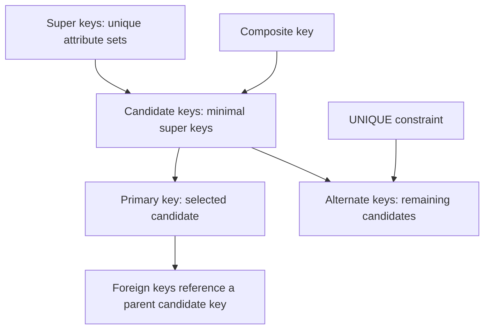
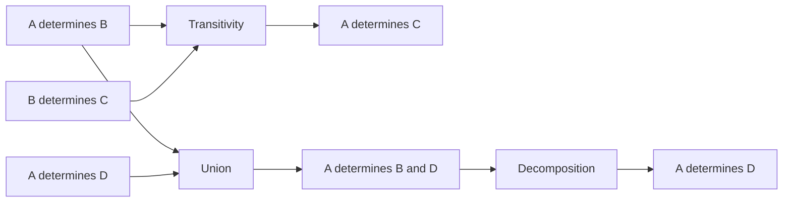
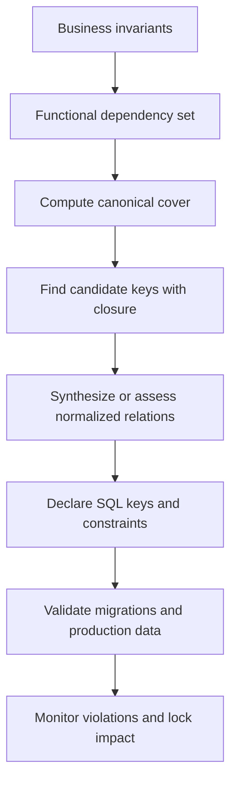

# Keys, Functional Dependencies, and Canonical Covers

Keys turn a bag of rows into identifiable facts, while functional dependencies express which attributes determine other attributes in every legal database state. Together they connect SQL integrity constraints to normalization theory, index design, and safe relationships between tables. Interviewers use this topic to test whether a candidate can move from business rules to a precise schema instead of treating `PRIMARY KEY` as decoration.

---

## 🟢 Beginner Level

### Keys and integrity constraints

A **super key** is any set of attributes whose values uniquely identify a row. A **candidate key** is a minimal super key: removing any attribute makes it lose uniqueness. The designer selects one candidate key as the **primary key**, while the remaining candidate keys are alternate keys commonly enforced by `UNIQUE` constraints.

A **composite key** contains two or more attributes because no component alone identifies a row. A **foreign key** stores values that must match a candidate key in another table, enforcing referential integrity between parent and child rows. SQL **constraints** such as `PRIMARY KEY`, `FOREIGN KEY`, `UNIQUE`, `NOT NULL`, and `CHECK` reject database states that violate declared business rules.

Consider an enrollment relation:

`ENROLLMENT(student_id, course_id, university_email, enrolled_at, grade)`

- `{student_id, course_id}` is a composite candidate key because one student has at most one enrollment in one course.
- `{student_id, course_id, grade}` is a super key but not a candidate key because `grade` is unnecessary.
- The composite candidate key can be selected as the primary key.
- `university_email` may be `UNIQUE` in a student table, making it another candidate key there.
- `student_id` and `course_id` are foreign keys to their respective parent tables.



The nesting matters. Every candidate key is a super key, but most super keys are not minimal. A primary key is not more unique than another candidate key; it is simply the candidate chosen as the main row identity.

### Integrity is more than uniqueness

Different constraints protect different parts of the model:

| Constraint | Rule enforced | Typical failure |
|---|---|---|
| `PRIMARY KEY` | Unique and non-null row identity | Duplicate order identifier |
| `UNIQUE` | Candidate-key uniqueness | Two accounts reuse one verified email |
| `FOREIGN KEY` | Child value references an existing parent | Order references a missing customer |
| `NOT NULL` | Required attribute has a value | Payment has no currency |
| `CHECK` | Row satisfies a predicate | Quantity is zero or negative |

A foreign key does not have to reference the parent's declared primary key in the relational model; it can reference another candidate key. SQL engines generally require the referenced columns to have a `PRIMARY KEY` or suitable `UNIQUE` constraint so the parent match is unambiguous.

Null handling needs care. A primary-key column cannot be null. A nullable unique column may permit one or several nulls depending on the database engine because null represents an unknown value rather than an ordinary equal value.

### Functional dependencies are business rules

A functional dependency, written $X \to Y$, means that whenever two legal rows agree on attribute set $X$, they must also agree on attribute set $Y$. The attributes in $X$ are the determinant. The dependency describes every valid future instance, not just a pattern observed in a current sample.

For `EMPLOYEE(employee_id, tax_id, department_id, department_name)`:

- `employee_id → tax_id` holds if each employee has one tax identifier.
- `tax_id → employee_id` holds if tax identifiers are globally unique.
- `department_id → department_name` holds if one identifier names one department.
- `department_name → department_id` may not hold because names can be reused.
- `employee_id → department_name` follows through `department_id` when both earlier rules hold.

A candidate key $K$ functionally determines every attribute in its relation: $K \to R$. A super key also determines every attribute, but it may contain redundant attributes. This connection lets closure calculations discover keys from a set of functional dependencies.

### Key categories on one schema

Assume the schema below:

```sql
CREATE TABLE customer (
    customer_id BIGINT PRIMARY KEY,
    government_id VARCHAR(40) NOT NULL UNIQUE,
    email VARCHAR(320) NOT NULL UNIQUE,
    country_code CHAR(2) NOT NULL,
    CHECK (country_code = UPPER(country_code))
);

CREATE TABLE customer_order (
    customer_id BIGINT NOT NULL,
    order_number BIGINT NOT NULL,
    created_at TIMESTAMP NOT NULL,
    PRIMARY KEY (customer_id, order_number),
    FOREIGN KEY (customer_id) REFERENCES customer(customer_id)
);
```

| Key category | Example | Why it qualifies |
|---|---|---|
| Primary key | `customer.customer_id` | Selected stable identity |
| Candidate key | `customer.government_id` | Minimal and unique |
| Candidate key | `customer.email` | Minimal and unique under the stated rule |
| Composite key | `(customer_id, order_number)` | Both values identify an order within a customer |
| Foreign key | `customer_order.customer_id` | References the customer parent |
| Super key | `(customer_id, email)` | Unique, but `email` is redundant once ID is present |

The schema expresses only rules that the database can enforce locally. If an email can change or be reassigned, it is still a valid unique alternate key at one instant, but it is a poor immutable identifier for foreign-key fan-out.

### Natural and surrogate keys

A natural key comes from the domain, such as an ISBN or ISO currency code. A surrogate key is generated for storage identity, such as a sequence-backed integer or UUID. A surrogate does not remove the need to declare a natural uniqueness rule; otherwise duplicate business entities can receive different generated identifiers.

| Choice | Advantage | Risk |
|---|---|---|
| Natural key | Meaningful and prevents domain duplicates directly | Can be wide, mutable, or governed externally |
| Integer surrogate | Compact indexes and usually locality-friendly inserts | Requires an additional unique business constraint |
| Random UUID | Decentralized generation and low coordination | Wider indexes and random insertion locality |
| Time-ordered UUID | Distributed generation with improved locality | Still wider than a 64-bit integer and leaks ordering |

Choose stability before convenience. A value that changes during the entity's lifetime should rarely be the primary key, because every referencing row and secondary index may then participate in the change.

---

## 🟡 Intermediate Level

### Formal dependency vocabulary

For relation schema $R$, $X \to Y$ holds when every legal instance $r(R)$ satisfies:

$$
\forall t_1,t_2 \in r:\ t_1[X]=t_2[X] \Rightarrow t_1[Y]=t_2[Y]
$$

Important classifications are:

- **Trivial dependency:** $X \to Y$ where $Y \subseteq X$, such as $AB \to A$.
- **Non-trivial dependency:** at least one attribute of $Y$ is outside $X$.
- **Full functional dependency:** $X \to Y$ holds, but no proper subset of $X$ determines $Y$.
- **Partial dependency:** a proper subset of a composite determinant already determines $Y$.
- **Transitive dependency:** $X \to Z$ follows through some intermediate $Y$.

Functional dependencies are assertions about semantics. A five-row sample with distinct names does not prove `name → employee_id`; a future pair of people can share a name. Domain owners and schema designers must state the legal rule first, then use data to find violations of it.

### Armstrong axioms and derived rules

Armstrong's axioms are sound, meaning they derive only valid consequences, and complete, meaning they can derive every functional dependency implied by a given set.

1. **Reflexivity:** if $Y \subseteq X$, then $X \to Y$.
2. **Augmentation:** if $X \to Y$, then $XZ \to YZ$.
3. **Transitivity:** if $X \to Y$ and $Y \to Z$, then $X \to Z$.

Useful derived rules follow from those three axioms:

- **Union:** $X \to Y$ and $X \to Z$ imply $X \to YZ$.
- **Decomposition:** $X \to YZ$ implies $X \to Y$ and $X \to Z$.
- **Pseudotransitivity:** $X \to Y$ and $WY \to Z$ imply $WX \to Z$.



For example, `employee_id → department_id` and `department_id → department_name` imply `employee_id → department_name` by transitivity. This derived dependency may reveal a transitive normalization problem even when it was absent from the original list.

### Attribute closure algorithm

The closure $X^+$ under dependency set $F$ is every attribute that $X$ functionally determines. It answers two core questions: whether $F$ implies $X \to Y$, and whether $X$ is a super key.

```text
CLOSURE(X, F):
    result = X
    repeat
        changed = false
        for each dependency LHS -> RHS in F:
            if LHS is a subset of result and RHS adds an attribute:
                result = result union RHS
                changed = true
    until changed is false
    return result
```

$F$ implies $X \to Y$ exactly when $Y \subseteq X^+$. Set $X$ is a super key when $X^+=R$. It is a candidate key only if that equality holds and every proper subset has a smaller closure.

### Worked numeric example: closure and candidate keys

Let:

$$
R(A,B,C,D,E,F),\quad
F=\{A\to C,\ B\to D,\ CD\to EF,\ F\to A\}
$$

Compute $(AB)^+$ step by step:

| Pass | Dependency fired | Closure | Attributes reached |
|---:|---|---|---:|
| 0 | Seed | `{A, B}` | 2 of 6 |
| 1 | $A\to C$ | `{A, B, C}` | 3 of 6 |
| 2 | $B\to D$ | `{A, B, C, D}` | 4 of 6 |
| 3 | $CD\to EF$ | `{A, B, C, D, E, F}` | 6 of 6 |
| 4 | $F\to A$ adds nothing | Fixed point | 6 of 6 |

Therefore $(AB)^+=R$, so $AB$ is a super key. Minimality requires two more probes:

- $A^+=\{A,C\}$, which reaches only 2 of 6 attributes.
- $B^+=\{B,D\}$, which also reaches only 2 of 6 attributes.

Neither proper subset is a super key, so $AB$ is a candidate key. By contrast, $(CD)^+=\{A,C,D,E,F\}$ because $CD\to EF$ and $F\to A$ fire, but attribute $B$ remains unreachable. Reaching 5 of 6 attributes is not “almost a key”; `CD` is not a super key.

For a straightforward implementation, repeated scans cost at most $O(|R|\cdot |F|)$ because each successful pass adds at least one of $|R|$ attributes. Indexing dependencies by their left-side attributes avoids needless tests in larger design tools.

### Finding candidate keys systematically

Brute force checks all $2^{|R|}$ subsets, but attribute classification prunes many candidates:

1. An attribute never appearing on any right-hand side cannot be derived, so every candidate key must contain it.
2. Attributes appearing only on right-hand sides generally need not be seeded because another determinant supplies them.
3. Attributes appearing on both sides are branch choices.
4. Once a set is a super key, discard all its supersets from candidate-key search because they are not minimal.

For $R(A,B,C,D)$ with $F=\{A\to B, B\to C, C\to A\}$, attribute $D$ never appears on a right-hand side and must be in every candidate key. Each of $A$, $B$, and $C$ determines the other two, giving candidate keys `AD`, `BD`, and `CD`. The full set `ABCD` is only a super key.

### Canonical cover procedure

A canonical cover, also called a minimal cover, is an equivalent dependency set with no redundant structure. Most algorithms normalize the representation as follows:

1. Split every multi-attribute right side: replace $A\to BC$ with $A\to B$ and $A\to C$.
2. Remove an extraneous left-side attribute when the remaining determinant still implies the right side.
3. Remove a redundant dependency when the other dependencies already imply it.
4. Optionally union dependencies that share the same left side for display.

Take $F=\{A\to BC, B\to C, AB\to C\}$.

- Decomposition produces $\{A\to B,A\to C,B\to C,AB\to C\}$.
- In $AB\to C$, attribute $A$ is extraneous because $B^+$ already contains $C$ through $B\to C$.
- Replacing it by $B\to C$ creates a duplicate.
- $A\to C$ is redundant because $A\to B$ and $B\to C$ imply it.
- The minimal cover is $\{A\to B,B\to C\}$.

Always test redundancy against the current set without the candidate dependency. Testing $A\to C$ while leaving it in the closure input trivially proves itself and incorrectly deletes every dependency.

---

## 🔴 Expert Level

### From dependency theory to schema design

Closure and canonical-cover calculations are design-time tools. A 3NF synthesis algorithm commonly starts from a minimal cover, creates a relation for each determinant group, and ensures that some relation contains a candidate key. Removing redundant dependencies first prevents unnecessary relations and oversized keys.



The theory assumes dependencies hold in every legal instance. The SQL schema makes selected rules executable through constraints, while deployment must first clean existing violations. A migration adding a unique constraint can fail or block for a long time when historical duplicates already exist.

### Dependency preservation and projection

A decomposition is dependency preserving when constraints can be checked within individual resulting relations rather than by joining them. To project $F$ onto fragment $R_i$, consider subsets $X$ of $R_i$, compute $X^+$ under the full $F$, and retain dependencies from $X$ to attributes in $X^+\cap R_i$.

Suppose $F=\{A\to B,B\to C\}$ and the decomposition is $R_1(A,B)$ plus $R_2(B,C)$. Relation $R_1$ enforces $A\to B$ and $R_2$ enforces $B\to C$, so their union implies the original set without a join. If instead the fragments were $R_1(A,B)$ and $R_2(A,C)$, enforcing $B\to C$ would require information spanning relations.

Lossless join and dependency preservation are separate goals. A decomposition can reconstruct original rows without spurious tuples yet still make one dependency expensive to enforce. BCNF may sacrifice dependency preservation, while 3NF synthesis guarantees it under the standard construction.

### Constraint enforcement under concurrency

A unique constraint is backed by an index or equivalent access structure so the engine can detect a conflicting key efficiently. Concurrent inserts of the same value cannot both commit; the engine coordinates index entries with locks, speculative insertion, or conflict checks. Application-side “check then insert” is racy because another transaction can insert between the query and write.

Foreign-key enforcement also coordinates parent and child changes. A child insert must confirm a matching parent, while a parent delete must prevent or process referencing children according to `RESTRICT`, `CASCADE`, `SET NULL`, or another declared action. Large cascades widen transaction scope, lock many rows, generate substantial logging, and can create deadlocks with other update paths.

Deferrable constraints postpone validation until transaction commit, which helps when a transaction temporarily violates a relationship while rearranging a graph. The trade-off is later failure and a larger rollback. Deferral does not weaken the final invariant if commit validation is reliable.

### Composite keys and index consequences

Physical indexes make key width operationally important. In a B+ tree, wider keys reduce entries per page, increase tree size, consume more cache, and enlarge foreign-key indexes in child tables. A composite primary key can still be the correct domain model when all components are stable and queries naturally use them.

Column order matters for query access. An index on `(tenant_id, external_id)` efficiently supports equality by `tenant_id` and by both columns, but usually not a search on `external_id` alone under the leftmost-prefix rule. Logical candidate-key status is independent of this access-path ordering: `{tenant_id, external_id}` and `{external_id, tenant_id}` represent the same attribute set in dependency theory.

In clustered engines, the primary key may be copied into every secondary-index leaf entry. Selecting a 48-byte natural composite key instead of an 8-byte surrogate can multiply storage across many secondary indexes. That physical cost must be weighed against an extra lookup and the need for a separate unique business key.

### Key changes, distributed IDs, and operations

Changing a referenced natural key may cascade through millions of rows or require an application migration. Stable surrogate identifiers isolate that mutation, but they do not solve cross-system identity by themselves. Services must agree on ownership, lifecycle, and whether an identifier can be reused.

Sequence-generated integers offer compact locality but can reveal volume and require an allocation authority. UUIDs permit decentralized generation but use more bytes; random UUIDs can fragment ordered indexes, while time-ordered variants improve locality. Neither format guarantees that two requests for the same business entity converge on one row, so a unique idempotency or natural key remains necessary.

Production rollout should measure duplicate counts, nulls, orphaned children, build time, lock duration, and replication lag before validating a new constraint. Some engines support creating an index concurrently or adding a constraint as not yet validated, then validating existing rows separately. The exact facility is engine-specific, so migration plans need vendor documentation and a rollback path.

### Auditing a canonical cover for equivalence

Minimality is insufficient unless the reduced set remains equivalent to the original dependencies. For original set $F$ and proposed cover $G$, prove both directions: every dependency in $F$ must follow from $G$, and every dependency in $G$ must follow from $F$. Testing only one direction can accept a set that either lost a rule or introduced an unsupported one.

Consider:

$$
F=\{A\to BC,\ B\to D,\ CD\to E\},\qquad
G=\{A\to B,\ A\to C,\ B\to D,\ CD\to E\}
$$

To show $F$ follows from $G$:

1. Under $G$, $A^+$ contains $A,B,C,D,E$.
2. In particular, it contains both $B$ and $C$, so $A\to BC$ follows by union.
3. Dependencies $B\to D$ and $CD\to E$ appear directly in $G$.

To show $G$ follows from $F$:

1. $A\to B$ and $A\to C$ follow by decomposing $A\to BC$.
2. $B\to D$ appears directly in $F$.
3. $CD\to E$ also appears directly in $F$.

The two sets therefore have the same closure even though their text differs. The singleton-right-side representation in $G$ is easier for extraneous-attribute and redundancy tests, while the combined dependency in $F$ may be shorter for documentation.

Use this review checklist before accepting a cover:

| Check | Procedure | Failure meaning |
|---|---|---|
| Singleton right sides | Decompose each right side | Algorithm representation is not normalized |
| No extraneous left attribute | Recompute closure after removing each determinant attribute | A determinant is wider than necessary |
| No redundant dependency | Remove one FD and test its implication | Another path already enforces the same rule |
| $F$ follows from $G$ | Test every original FD with closure under $G$ | The cover lost business information |
| $G$ follows from $F$ | Test every cover FD with closure under $F$ | The cover invented an unsupported rule |

Equivalent covers can still differ because more than one dependency may be removable depending on elimination order. Preserve the closure, not a preferred layout. In an interview, state the algorithm, show at least one closure test for each kind of removal, and finish with the two-direction equivalence argument.

### Common Misconceptions

1. **“A primary key is the only candidate key.”**
   *Correction*: A relation may have several minimal unique determinants. The primary key is simply the chosen candidate; alternate candidates should still receive unique constraints when their business rules matter.

2. **“A unique value in today's data proves a functional dependency.”**
   *Correction*: A functional dependency must hold in every legal future state. Sample uniqueness may be accidental, especially for names, timestamps, and small datasets.

3. **“A surrogate primary key guarantees there are no duplicate entities.”**
   *Correction*: Generated identifiers distinguish rows, including duplicate representations of the same entity. Declare a unique natural or idempotency key to prevent business duplicates.

4. **“Every super key is a good primary key.”**
   *Correction*: A super key can include redundant columns. Redundancy widens indexes and foreign keys without adding identification power, so choose a stable candidate key instead.

5. **“Canonical covers are always textually identical.”**
   *Correction*: Different elimination orders can produce different but equivalent minimal covers. Correctness requires equivalent closure and minimality, not one memorized textual answer.

### Interview Questions

**Q1. What distinguishes a super key, candidate key, and primary key?** `[easy]`

A super key is any attribute set that uniquely identifies a legal row, even if some attributes are redundant. A candidate key is a minimal super key for which no proper subset remains unique. A primary key is the candidate selected as the table's main identity, while other candidates remain alternate keys and should normally be enforced as unique.

**Q2. What is a functional dependency?** `[easy]`

$X\to Y$ means any two legal rows agreeing on $X$ must agree on $Y$. It captures a business rule over all valid database states rather than a correlation in one dataset. Dependencies drive candidate-key discovery and reveal partial or transitive structure used during normalization.

**Q3. How does a foreign key differ from a primary key?** `[easy]`

A primary key uniquely and non-nullably identifies a row in its own table. A foreign key constrains child values to match a candidate key in a parent table, and its values may repeat because many children can share one parent. Delete and update actions determine whether parent changes are restricted, cascaded, or translated to null values.

**Q4. Why is a composite key sometimes necessary?** `[easy]`

A composite key is necessary when the business identity is unique only as a combination, such as `(student_id, course_id)` for one enrollment. Neither component identifies the row alone, so the dependency is full on both attributes. The trade-off is a wider index and wider references in child tables.

**Q5. How do you test whether attribute set X is a super key?** `[medium]`

Compute $X^+$ by repeatedly applying every dependency whose left side is already in the closure. If the fixed point contains every attribute of the relation, $X$ is a super key. To prove it is a candidate key, also show that no proper subset has full closure.

**Q6. Why are Armstrong's axioms important?** `[medium]`

They provide sound and complete inference rules for functional dependencies. Soundness prevents derivation of rules not implied by the original semantics, while completeness means every implied dependency can be derived. Attribute closure turns those axioms into a practical decision procedure for implication and key finding.

**Q7. How do you identify an extraneous attribute on the left side of an FD?** `[medium]`

For a dependency $XA\to Y$, test whether $Y$ is already contained in $X^+$ under the appropriate current dependency set. If it is, attribute $A$ adds no determining power and can be removed. Recompute after every change because earlier eliminations can affect later tests.

**Q8. How do you identify a redundant dependency in a canonical cover?** `[medium]`

Temporarily remove dependency $X\to Y$ from the current set and compute $X^+$ using the remainder. If the closure still contains $Y$, the dependency is implied by others and is redundant. Leaving the candidate dependency in the test would make every dependency appear removable.

**Q9. Why pair a surrogate primary key with a unique natural key?** `[medium]`

The surrogate gives a stable, compact reference even when business attributes change. The unique natural key prevents two generated IDs from representing the same real entity. Without that second constraint, retries and races can insert logically duplicate rows that remain technically distinct.

**Q10. Can a nullable column be a candidate key?** `[medium]`

In the relational model, a key identifies every tuple and therefore cannot contain an unknown component. SQL `UNIQUE` semantics for null differ across engines and often permit null because it is not considered equal to another null. Use `NOT NULL` together with uniqueness when the column is intended to be a true candidate key.

**Q11. Why does dependency preservation matter after decomposition?** `[medium]`

Dependency preservation allows each original rule to be enforced within one fragment using local constraints. If a rule spans fragments, checking every write may require a join or an application-level coordination mechanism. That cost is one reason designers sometimes prefer dependency-preserving 3NF over a stricter BCNF decomposition.

**Q12. Scenario: two requests both query for an email, see no row, and then insert duplicate customers. What should change?** `[hard]`

Add a database `UNIQUE` constraint on the normalized email representation and treat the insert as the atomic arbitration point. The pre-insert query is a time-of-check/time-of-use race because concurrent transactions can observe the same absence. Handle the constraint violation or use a vendor-supported upsert, while ensuring retries return the already-created identity.

**Q13. Scenario: adding a foreign key to a large production table fails after a long scan. What do you investigate?** `[hard]`

Find orphan child values, null-policy mismatches, type or collation differences, and parent values lacking a suitable unique constraint. Estimate validation locks, I/O, replication lag, and transaction-log growth before retrying. Clean violations in bounded batches and use the engine's staged or online validation facilities where available.

**Q14. Scenario: a composite natural primary key makes every secondary index much larger. How do you evaluate a redesign?** `[hard]`

Measure key width, secondary-index count, cache hit rate, page splits, join patterns, and the cost of introducing a surrogate lookup. In clustered engines the primary key may be copied into each secondary leaf, so width multiplies across indexes. A compact surrogate plus a unique composite business constraint can reduce storage, but it adds another index and must preserve the domain uniqueness rule.

### Further Reading

- [PostgreSQL documentation: constraints](https://www.postgresql.org/docs/current/ddl-constraints.html) describes primary, unique, check, and foreign-key enforcement semantics.
- [MySQL documentation: InnoDB indexes](https://dev.mysql.com/doc/refman/8.4/en/innodb-index-types.html) explains clustered primary keys and secondary-index storage.
- [SQLite documentation: foreign keys](https://www.sqlite.org/foreignkeys.html) gives concrete referential-integrity behaviour and configuration details.
- [Codd's relational model paper](https://doi.org/10.1145/362384.362685) is the original foundation for relational dependencies and normalization.
