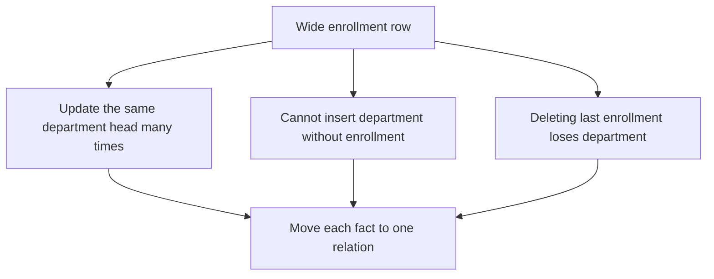
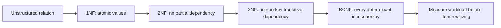
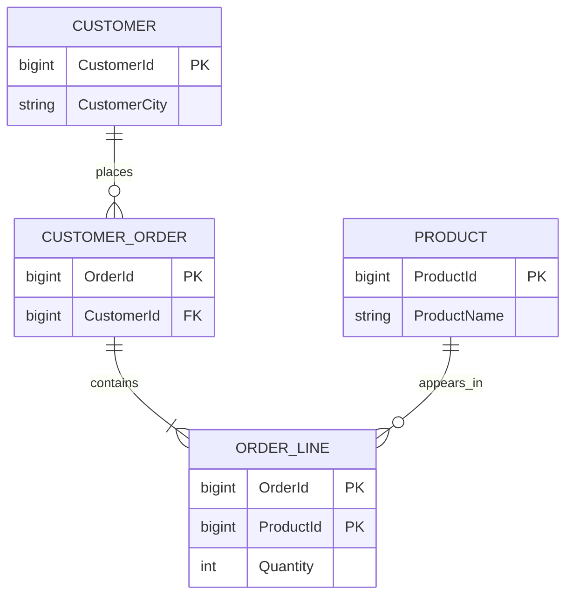
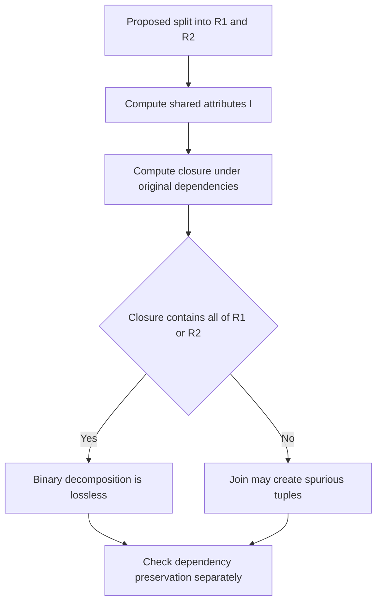

# Database Normalization: 1NF, 2NF, 3NF, and BCNF

Normalization organizes relational schemas so each fact has one authoritative home and constraints can be enforced without contradictory duplicates.
It connects functional-dependency theory to practical schema design, migration safety, and query performance.
Interviewers use it to test whether an engineer can identify anomalies, prove a decomposition correct, and explain when deliberate denormalization is justified.

---

## 🟢 Beginner Level

### Why duplicated facts become correctness bugs

Consider one `ENROLLMENT_REPORT` table containing students, departments, courses, and instructors.
A department head repeats on every enrollment row even though that fact depends on the department, not on an enrollment.
The duplication creates three modification anomalies.

- An **update anomaly** occurs when changing one copy leaves other copies stale.
- An **insertion anomaly** occurs when a department cannot be recorded until a student enrolls.
- A **deletion anomaly** occurs when deleting the last enrollment also erases the department fact.



Normalization does not merely reduce storage.
It makes the schema express which attributes determine other attributes, then places those facts where keys and constraints can protect them.
The result usually requires joins, but joins are often cheaper than repairing silent inconsistency.

### Functional dependencies describe business rules

A **functional dependency**, written $X \rightarrow Y$, means that any two valid rows agreeing on attributes $X$ must also agree on attributes $Y$.
The left side $X$ is the **determinant**, and the right side $Y$ is functionally determined.
Dependencies come from business rules rather than from coincidences in one sample dataset.

For `STUDENT(StudentId, Email, DepartmentId, DepartmentName)`, plausible dependencies include:

- `StudentId → Email, DepartmentId` because one student record has one email and department.
- `Email → StudentId` if email is declared globally unique.
- `DepartmentId → DepartmentName` because one department identifier names one department.

A sample in which two departments happen to share a name does not establish `DepartmentName → DepartmentId`.
The rule must hold for every legal future state.
Schema designers therefore confirm dependencies with domain owners and constraints, not only with profiling queries.

### Keys and prime attributes

A **superkey** is any attribute set whose closure determines every attribute in the relation.
A **candidate key** is a minimal superkey: removing any attribute makes it stop identifying a row.
An attribute belonging to at least one candidate key is **prime**; every other attribute is non-prime.

Suppose `ORDER_LINE(OrderId, ProductId, Quantity, ProductName)` has these dependencies:

- `(OrderId, ProductId) → Quantity`
- `ProductId → ProductName`

The pair `(OrderId, ProductId)` is a candidate key.
`OrderId` and `ProductId` are prime, while `Quantity` and `ProductName` are non-prime.
Because `ProductId` alone determines `ProductName`, the table contains a partial dependency that violates 2NF.

### Normal forms and denormalization trade-offs

The normal forms progressively restrict where functional dependencies may live.
**1NF** requires atomic, single-domain values; **2NF** removes partial dependencies on part of a candidate key; **3NF** removes non-key transitive dependencies while allowing a prime-attribute exception; and **BCNF** requires every determinant of a non-trivial dependency to be a superkey.
Each higher form includes the guarantees of the lower forms, but a stricter decomposition can make some dependencies harder to enforce.



| Form | Main rule | Typical anomaly removed | Important limitation |
|---|---|---|---|
| 1NF | one atomic value per attribute position | repeating groups | redundancy may remain |
| 2NF | non-prime attributes depend on the whole candidate key | partial dependency | transitive dependency may remain |
| 3NF | determinant is a superkey or dependent attribute is prime | non-key transitive dependency | some determinant anomalies remain |
| BCNF | every non-trivial determinant is a superkey | residual determinant anomaly | dependency preservation is not guaranteed |

**Denormalization** deliberately stores a derived or repeated fact to improve a measured access path.
It makes sense for read-heavy analytical models, materialized summaries, cached aggregates, or geographically replicated read models when the team owns refresh and reconciliation.
It does not mean skipping design analysis: the normalized source of truth and the consistency mechanism should remain explicit.

### First normal form makes rows relational

First normal form requires each row-column position to contain one value from the column's domain.
A comma-separated list of phone numbers or an array of course identifiers inside a text column hides multiple facts from relational constraints.
The fix is normally a child relation with one row per value.

```sql
CREATE TABLE student_phone (
    student_id BIGINT NOT NULL,
    phone_number VARCHAR(32) NOT NULL,
    phone_type VARCHAR(16) NOT NULL,
    PRIMARY KEY (student_id, phone_number),
    FOREIGN KEY (student_id) REFERENCES student(student_id)
);
```

Atomicity is relative to the operations the system needs.
A postal address may be one value when it is only displayed, but it needs separate attributes if the application filters reliably by city or postal code.
1NF is about a relational domain and predictable operators, not about splitting every string into individual characters.

---

## 🟡 Intermediate Level

### Worked decomposition from 1NF through BCNF

Use this relation:

`ORDER_FACT(OrderId, CustomerId, CustomerCity, ProductId, ProductName, Quantity)`

Its candidate key is `(OrderId, ProductId)`, and the business dependencies are:

1. `OrderId → CustomerId`
2. `CustomerId → CustomerCity`
3. `ProductId → ProductName`
4. `(OrderId, ProductId) → Quantity`

The relation is in 1NF because every cell is atomic.
It is not in 2NF because `OrderId` and `ProductId`, proper subsets of the composite key, determine non-prime attributes.
Split the partial dependencies into `ORDER`, `PRODUCT`, and `ORDER_LINE`.

`ORDER(OrderId, CustomerId, CustomerCity)` still has a transitive chain:

$$
OrderId \rightarrow CustomerId \rightarrow CustomerCity
$$

`CustomerId` is not a superkey of `ORDER`, so move customer location to `CUSTOMER(CustomerId, CustomerCity)`.
The final four relations are:

- `CUSTOMER(CustomerId, CustomerCity)`
- `ORDER(OrderId, CustomerId)`
- `PRODUCT(ProductId, ProductName)`
- `ORDER_LINE(OrderId, ProductId, Quantity)`



Every remaining non-trivial determinant is a key of its own relation, so this decomposition reaches BCNF.
The original dependencies are also dependency preserving because each can be checked inside one resulting relation.
That convenient outcome is not guaranteed for every BCNF decomposition.

### Concrete numeric cost and anomaly example

Assume 100,000 orders contain an average of 6 products, producing 600,000 order-line rows.
If a 24-byte customer city and a 40-byte product name are repeated in every line, those two attributes consume about:

$$
600{,}000 \times (24 + 40) = 38{,}400{,}000\text{ bytes}
$$

That is roughly 36.6 MiB before row headers, indexes, alignment, and duplicate page versions.
More importantly, renaming one product appearing in 25,000 lines requires 25,000 updates rather than one update to `PRODUCT`.

Suppose 24,990 rows are updated successfully and 10 are missed by a faulty batch.
The database now exposes two product names for one `ProductId`, even though every individual row remains syntactically valid.
The normalized schema stores one product row, so one constrained update changes the authoritative fact atomically.

Normalization does introduce join work.
If a query reads 10,000 order lines and joins indexed integer foreign keys, the database can use hash or index joins rather than scanning duplicated text.
Measure the real execution plan before deciding that the repeated 36.6 MiB is a worthwhile optimization.

### Second normal form and partial dependencies

2NF applies only after 1NF and matters most when a candidate key has multiple attributes.
A partial dependency exists when a non-prime attribute depends on a proper subset of a candidate key.
If every candidate key contains one attribute, the relation is automatically in 2NF.

In `ORDER_LINE`, `Quantity` needs the entire pair `(OrderId, ProductId)`.
By contrast, `ProductName` needs only `ProductId` and therefore belongs in `PRODUCT`.
Moving it removes both update redundancy and the inability to record a product before its first order.

Do not test only the declared primary key.
A relation can have several candidate keys, and 2NF must hold with respect to all of them.
Prime status likewise comes from membership in any candidate key, not merely the chosen primary key.

### Third normal form and transitive dependencies

For every non-trivial dependency $X \rightarrow A$, 3NF requires either:

1. $X$ is a superkey, or
2. $A$ is a prime attribute.

The formal rule is more accurate than the shorthand “no transitive dependencies.”
In `ORDER(OrderId, CustomerId, CustomerCity)`, the dependency `CustomerId → CustomerCity` fails both tests.
`CustomerId` is not a superkey of that relation, and `CustomerCity` is not prime.

The 3NF synthesis algorithm starts from a canonical cover.
It creates a relation for each determinant and its dependents, adds a relation containing a candidate key if none already does, and removes redundant contained relations.
The result is lossless and dependency preserving while satisfying 3NF.

### BCNF is stricter than 3NF

BCNF removes the prime-dependent exception.
For every non-trivial $X \rightarrow Y$, $X$ must be a superkey.
This catches anomalies that 3NF intentionally tolerates to preserve dependencies.

Consider `TEACHING(Student, Instructor, Course)` with:

- `Instructor → Course`
- `(Student, Course) → Instructor`

Candidate keys are `(Student, Course)` and `(Student, Instructor)`.
`Course` is prime, so `Instructor → Course` passes 3NF, but `Instructor` is not a superkey and therefore violates BCNF.
Decomposing into `INSTRUCTOR_COURSE(Instructor, Course)` and `STUDENT_INSTRUCTOR(Student, Instructor)` is lossless.

The dependency `(Student, Course) → Instructor` is no longer contained in either fragment.
Checking it requires a join, trigger, assertion mechanism, or application transaction.
This is why production designers sometimes prefer dependency-preserving 3NF over BCNF.

### Lossless join and dependency preservation are separate

A decomposition is **lossless** when joining its projections recreates exactly the legal original rows without inventing spurious tuples.
For a binary decomposition of $R$ into $R_1$ and $R_2$, it is lossless when the shared attributes functionally determine all attributes of at least one fragment.

Formally, one of these must hold in $F^+$:

$$
(R_1 \cap R_2) \rightarrow R_1
$$

or

$$
(R_1 \cap R_2) \rightarrow R_2
$$

A decomposition is **dependency preserving** when all original dependencies can be enforced by checking individual fragments without joining them.
Losslessness protects stored information; dependency preservation protects efficient constraint enforcement.
A good decomposition aims for both, but BCNF guarantees lossless decomposition rather than dependency preservation.

---

## 🔴 Expert Level

### Proving a decomposition instead of trusting intuition

For a binary split, calculate the attribute intersection and then its closure under the full original dependency set.
If the closure includes every attribute of either fragment, the split is lossless.
Otherwise, construct a small counterexample to see whether a join can create spurious combinations.



For the split `ORDER(OrderId, CustomerId)` and `CUSTOMER(CustomerId, CustomerCity)`, the intersection is `{CustomerId}`.
Its closure contains `{CustomerId, CustomerCity}`, which is the whole `CUSTOMER` relation.
The split is therefore lossless.

For decompositions into more than two fragments, use the chase rather than repeatedly assuming pairwise checks are sufficient.
The chase builds a tableau, applies functional dependencies until no symbols change, and succeeds when one row becomes fully distinguished.
It is a proof procedure, not a query-performance estimate.

### Canonical cover and 3NF synthesis

A canonical cover removes redundant dependencies, extraneous determinant attributes, and duplicated left sides while preserving the closure $F^+$.
Normalization algorithms use it so they do not create unnecessary relations from logically redundant statements.
Different canonical covers can look different while implying the same dependencies.

For $R(A,B,C)$ and $F = \{A \rightarrow B, B \rightarrow C\}$, synthesis creates `R1(A,B)` and `R2(B,C)`.
`A` is a candidate key and is already contained in `R1`, so no extra key relation is needed.
The shared attribute `B` determines all of `R2`, proving the join is lossless.

Dependency checks also remain local:

- `A → B` is enforced in `R1`.
- `B → C` is enforced in `R2`.
- `A → C` follows transitively without being stored as an extra rule.

3NF synthesis is a dependable default when enforceable business constraints matter more than eliminating every theoretical redundancy.
BCNF decomposition is appropriate when determinant anomalies dominate and any lost dependencies can be enforced safely elsewhere.
The choice should be documented alongside constraint ownership.

### Denormalization as a controlled consistency protocol

Denormalization is justified by evidence, not by a general fear of joins.
Common cases include a star schema optimized for columnar scans, a materialized view serving a dashboard, a cached counter on a high-read endpoint, and an event-sourced projection built for one query shape.
Each copy creates a new synchronization obligation.

| Technique | Read benefit | Write or correctness cost | Essential control |
|---|---|---|---|
| materialized view | precomputed joins and aggregates | refresh lag | refresh schedule and staleness SLO |
| cached aggregate | constant-time hot read | invalidation race | versioning, TTL, and reconciliation |
| duplicated display field | avoids lookup on historical read | update amplification | immutable snapshot semantics or repair job |
| star-schema dimension | efficient analytical scans | ETL complexity | lineage and repeatable load process |

When denormalization makes sense, name the source of truth, maximum acceptable staleness, update path, retry semantics, and repair mechanism.
For a financial balance, asynchronous duplication may be unacceptable because stale reads change business decisions.
For a product name copied into an immutable invoice snapshot, historical duplication may be the correct domain model rather than an anomaly.

Observe both sides of the trade-off.
Measure query latency and CPU saved, but also update fan-out, queue lag, drift count, cache hit rate, rebuild duration, and reconciliation failures.
If nobody owns those metrics, the optimization has transferred latency cost into hidden correctness risk.

### Migration and production failure modes

Normalizing a live table requires more than creating new relations.
Deploy new schema, backfill in bounded batches, dual-write or capture changes, compare counts and checksums, move readers, then remove the old path only after an observation window.
Foreign keys and unique constraints should be validated without causing an unplanned lock outage.

A backfill can race with concurrent updates and copy an older value after a newer write.
Use a consistent snapshot plus change-data capture, or version comparisons that reject stale writes.
Make each batch idempotent so retries do not duplicate child rows.

Query regressions are also possible.
After decomposition, missing foreign-key indexes can turn joins into repeated scans, and an ORM can create an N+1 query pattern.
Inspect actual execution plans, batch related reads, and keep transaction boundaries aligned with the invariant being updated.

Denormalized read models fail differently.
A message can be delivered twice, out of order, or not at all until retry.
Use event identifiers, monotonic versions, dead-letter handling, and periodic reconciliation against the normalized source.

### Common Misconceptions

1. **“Normalization means every table should contain only two columns.”** Normal forms constrain dependencies, not arbitrary width. A wide table can be in BCNF when every non-trivial determinant is a superkey.
2. **“1NF means every value must be indivisible in the physical world.”** Atomicity depends on the relational operations required by the application. A value can be treated as one domain member while still having internal representation.
3. **“3NF and BCNF are equivalent.”** 3NF permits a non-superkey determinant when the dependent attribute is prime. BCNF removes that exception and can therefore sacrifice dependency preservation.
4. **“A lossless decomposition automatically preserves dependencies.”** Losslessness concerns reconstructing rows without spurious tuples. Dependency preservation concerns enforcing rules locally, and the properties must be checked separately.
5. **“Denormalization is always faster.”** It may remove joins but increases writes, invalidation work, storage, and drift risk. Only workload measurements and an explicit consistency protocol justify it.

### Interview Questions

**Q1. What problem does normalization solve?** `[easy]`

Normalization gives each independent fact an authoritative relation based on functional dependencies. This reduces update, insertion, and deletion anomalies caused by duplicated facts. It can add joins, so the goal is integrity and maintainability rather than blindly minimizing table width.

**Q2. What is a functional dependency?** `[easy]`

$X \rightarrow Y$ means any valid rows agreeing on $X$ must also agree on $Y$. It describes a domain rule over all legal database states, not a pattern noticed in one sample. Incorrectly inferred dependencies produce decompositions that reject valid data or fail to protect real invariants.

**Q3. What is the difference between a candidate key and a superkey?** `[easy]`

A superkey functionally determines every attribute in the relation. A candidate key is a minimal superkey, so removing any attribute destroys that property. Candidate keys define prime attributes and must all be considered during normal-form analysis, not just the selected primary key.

**Q4. What does first normal form require?** `[easy]`

1NF requires each attribute position to contain one value from its declared domain and avoids repeating groups hidden inside a row. A child relation is usually preferable to comma-separated identifiers because constraints and joins can address each fact. Atomicity is judged by the operations the domain needs, not by splitting every value physically.

**Q5. How does 2NF differ from 3NF?** `[medium]`

2NF removes dependencies where a non-prime attribute depends on only part of a candidate key. 3NF additionally restricts non-trivial dependencies whose determinant is not a superkey, unless the dependent attribute is prime. A single-column-key relation is automatically in 2NF but can still violate 3NF through a non-key transitive dependency.

**Q6. Why is BCNF stricter than 3NF?** `[medium]`

BCNF requires every determinant of a non-trivial functional dependency to be a superkey. 3NF allows the dependency when its right-side attribute is prime even if the determinant is not a superkey. The stricter rule removes more anomalies but can make an original dependency impossible to enforce without a join.

**Q7. What makes a binary decomposition lossless?** `[medium]`

The shared attributes must functionally determine every attribute of at least one resulting fragment under the original dependency closure. This ensures the join uses a key-like intersection and cannot invent unrelated combinations. For more fragments, the chase provides a general proof procedure rather than relying on intuition.

**Q8. What is dependency preservation?** `[medium]`

A decomposition is dependency preserving when the projected dependencies on individual fragments imply every original dependency. The database can then enforce the rules locally without joining relations during every write. A decomposition may be lossless but not dependency preserving, especially after a BCNF split.

**Q9. Why does the 3NF synthesis algorithm add a candidate-key relation sometimes?** `[medium]`

Relations created from the canonical cover might not contain any complete candidate key of the original schema. Adding a key relation anchors the tuples so their projections join losslessly. Skipping this step can preserve individual dependencies while losing the ability to reconstruct all valid original facts.

**Q10. When does denormalization make sense?** `[medium]`

It makes sense when measurements show a stable, read-dominated access path benefits from precomputed or duplicated data. The design must identify a normalized source of truth, acceptable staleness, update protocol, and repair process. Without these controls, reduced query latency is purchased with unbounded consistency risk.

**Q11. Scenario: product names disagree across thousands of order rows. How would you redesign and migrate?** `[hard]`

Move the current product name into a `PRODUCT` relation keyed by `ProductId`, while deciding whether old invoices intentionally preserve a historical snapshot. Backfill in idempotent batches, capture concurrent changes, validate inconsistent identifiers, and switch reads only after count and checksum comparison. If historical names are required, label that field as immutable invoice data rather than pretending every duplicate is the current product fact.

**Q12. Scenario: a BCNF decomposition causes expensive joins in a uniqueness trigger. What do you evaluate?** `[hard]`

First verify that the lost dependency is real and that the trigger correctly enforces it under concurrency. Compare a dependency-preserving 3NF design against the BCNF design, measuring anomaly risk, write latency, and locking behaviour. Choosing 3NF can be the safer production decision when its limited redundancy is guarded and the original rule stays locally enforceable.

**Q13. How would you prove that a proposed decomposition is safe during an interview?** `[hard]`

State the original dependencies, candidate keys, and projected dependencies rather than relying on example rows. For a binary split, compute the intersection's closure and show that it contains one complete fragment to prove losslessness, then separately show whether projected dependencies imply the original set. For a multiway split, describe or execute the chase and identify any constraint that would require a join.

**Q14. A dashboard materialized view is fast but occasionally stale after retries. What controls are needed?** `[hard]`

Treat the view as a derived read model with a documented staleness objective and an authoritative normalized source. Make refresh or event consumption idempotent with event identifiers and versions, monitor lag, and reconcile aggregates periodically against source counts. If stale data can trigger irreversible business actions, route those decisions to transactional source data instead of the projection.

### Further Reading

- [PostgreSQL documentation on table constraints](https://www.postgresql.org/docs/current/ddl-constraints.html) explains primary, unique, foreign-key, and check constraints used to enforce normalized designs.
- [PostgreSQL documentation on materialized views](https://www.postgresql.org/docs/current/rules-materializedviews.html) shows the mechanics and performance trade-offs of stored derived relations.
- [SQLite query planner documentation](https://www.sqlite.org/queryplanner.html) provides a concrete primary-source explanation of indexes and join planning relevant after decomposition.
- [Codd's relational model paper](https://doi.org/10.1145/362384.362685) is the foundational source for relational structure and normalization theory.
