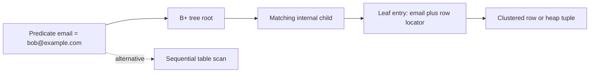
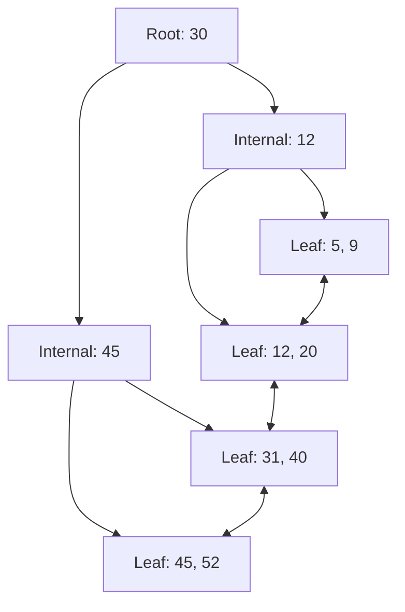
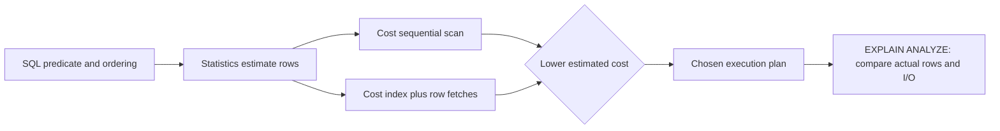
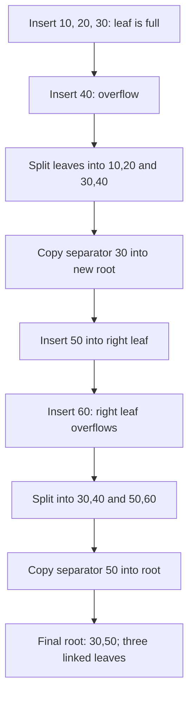

# Database Indexing & B/B+ Tree Data Structures

An index is an auxiliary access path that trades storage and write work for fewer pages read by selective queries. It sits beside the table and gives the optimizer alternatives to scanning every row, but it helps only when its ordering, coverage, and selectivity match the workload. Interviewers expect engineers to connect tree mechanics to execution plans, write amplification, and production index design rather than merely saying that indexes make queries faster.

---

## 🟢 Beginner Level

### The Textbook Index Analogy
Finding the chapter on "sorting" in a 1,200-page textbook by reading every page is a **full table scan**. Instead, you open the index at the back, see "sorting … page 214", and jump straight there. A database index is exactly that back-of-book index: a small, sorted auxiliary structure whose entries point to where the real rows live. The database pays for it twice — extra disk space, and extra work on every write — so that reads stop being linear searches.

### What Is an Index?
An **Index** is a disk-resident data structure (almost always a B+ Tree) that maps search-key values to row locations.

- **Read path**: turns an O(N) table scan into an O(log N) tree descent — a few page reads instead of thousands.
- **Storage cost**: typically 10% to 40% of the table size, depending on key width and fill factor.
- **Write cost**: every INSERT/UPDATE/DELETE on indexed columns must update the tree (plus the write-ahead log), so ingest throughput drops.
- **Transparency**: the SQL text never changes; the optimizer decides whether to use the index.



The tree path reads only a root-to-leaf route and then the qualifying rows. A scan reads all table pages but does so sequentially, so it can still win when most rows qualify. Cost-based optimization compares these alternatives using statistics rather than applying an “index always wins” rule.

### Why Not Just Scan the Table?
Concrete numbers make the trade obvious. Assume an `orders` table with 100 million rows at ~150 bytes each:

```
Table size            100,000,000 x 150 B  =  15 GB  =  ~915,000 pages of 16 KB
Full sequential scan  (HDD at 180 MB/s)    =  ~85 seconds
Full sequential scan  (NVMe SSD at 3 GB/s) =  ~5 seconds
B+ tree point lookup  (3 page reads)       =  ~0.3 ms on SSD (cold cache)
Point-lookup speedup                       =  ~15,000x faster than scanning
```

The wider the table and the more selective your predicate, the bigger the win. Conversely, a query that matches half the table gains nothing — reading 15 GB sequentially beats 50 million random lookups.

### The Classic Index Types

| Type | Built On | Leaf Entry Contains | Limit Per Table |
| --- | --- | --- | --- |
| Primary index | Ordered key field of the data file | Key + anchor to first record of each block | One (defines physical order) |
| Clustered index | The key the table is physically sorted by | The entire row (InnoDB) or the row itself nearby | Exactly one |
| Secondary (non-clustered) | Any other column(s) | Key + row locator: PK value (InnoDB) or RID (SQL Server heap) | Many |
| Dense | Any key | One entry per search-key value | Either density possible |
| Sparse | Sorted data file only | One entry per block (first key of the block) | Only on the physical sort key |

- **Dense vs Sparse**: a dense index answers "does key K exist?" directly from the index. A sparse index locates the **block** containing K, then searches inside the block. Sparse indexing is only possible when the data file is physically ordered by the search key — which is why it appears on the clustering key and nowhere else.
- **Clustered vs Secondary**: there can be only one physical row order, hence one clustered index per table. Everything else is secondary and must "hop" to the row.

### Unique, composite, and covering indexes

A **unique index** rejects duplicate key values and can enforce a candidate-key constraint while also accelerating lookup. Its exact treatment of multiple `NULL` values depends on the database, so application invariants should follow the selected engine's semantics rather than assumptions from another vendor.

A **composite index** orders entries lexicographically by two or more key columns. For `(tenant_id, status, created_at)`, all entries for one tenant are adjacent, then ordered by status and time. This is useful when the workload filters by that leading sequence, but it is not three independent single-column indexes.

A **covering index** contains every column needed by a query, either as key columns or payload columns such as SQL Server's `INCLUDE` columns. The engine can answer from index leaves without fetching base-table rows, eliminating random bookmark lookups. Coverage speeds a targeted query at the cost of wider leaves, fewer entries per page, more storage, and more DML maintenance.

| Design | Primary benefit | Main trade-off |
|---|---|---|
| Unique | Enforces uniqueness and supports point lookup | Checks and locking on every write |
| Composite | Supports multi-column filters and ordering | Column order limits usable prefixes |
| Covering | Avoids base-table fetches | Wider leaves and higher write/storage cost |
| Partial or filtered | Indexes only relevant rows | Predicate must match the query and vendor syntax |

### What Does an Index Cost You?
1. **Space**: a secondary index on a 100M-row table with 8-byte keys costs roughly 3 to 4 GB (key + PK pointer + page overhead).
2. **Write amplification**: inserting into a table with 5 secondary indexes performs 6 tree modifications (1 clustered + 5 secondary), each generating redo log records.
3. **Locking hotspots**: monotonic keys concentrate all inserts on the rightmost leaf page, serializing concurrent writers.
4. **Optimizer risk**: more indexes means more plan choices — outdated statistics can steer the optimizer into the wrong one.

Rule of thumb: index columns that appear in WHERE joins and ORDER BY clauses **with high selectivity**, and audit for unused indexes quarterly.

## 🟡 Intermediate Level

### B+ tree and hash index trade-offs



| Property | B-Tree | B+ Tree |
| --- | --- | --- |
| Payload location | Internal nodes AND leaves | Leaves only |
| Internal node contents | Keys + data pointers (fat entries) | Routing keys + child pointers only |
| Fanout | Lower (payload crowds out entries) | Higher (slim entries) |
| Leaf linkage | Isolated nodes | Doubly-linked list |
| Range scan | Tree-walk per key, revisits upper levels | One descent, then ride the leaf chain |
| Point lookup | Sometimes finds data early (no leaf visit) | Always descends to leaf |

Every mainstream engine (InnoDB, PostgreSQL nbtree, Oracle, SQL Server, SQLite) chose the B+ Tree because the linked leaf layer makes range scans and full index scans nearly sequential I/O, and the slim internal entries maximize fanout — and fanout is what keeps the tree shallow.

A hash index computes a bucket from the complete search key and can make equality lookup approximately constant-time when distribution is healthy. It cannot preserve ordering, answer range predicates, support prefix matching, or satisfy `ORDER BY`. Bucket collisions and growth also require overflow handling or rehashing, so the constant-time description is an average rather than a worst-case guarantee.

| Requirement | B+ tree | Hash index |
|---|---|---|
| Exact equality | $O(\log_F N)$ page descent | Approximately $O(1)$ average bucket probe |
| Range and prefix search | Efficient through ordered linked leaves | Unsupported by hash order |
| `ORDER BY` or min/max | Can provide ordered access | Requires a separate sort or scan |
| Skew sensitivity | Maintains balanced height | Poor hashes or skew create long buckets |
| Relational default | Yes, versatile access path | Specialised equality workloads |

### Fanout Math: Why a 3-Level Tree Indexes 100 Million Rows
Assume MySQL InnoDB defaults: 16 KB pages, BIGINT keys.

- Internal entry = 8-byte key + 6-byte child page number = 14 bytes → ⌊16384 ÷ 14⌋ ≈ 1170 entries per page. After page headers and the slot directory, use a conservative fanout F ≈ 1000.
- A leaf page storing 150-byte rows holds ≈ ⌊16384 ÷ 150⌋ ≈ 100 rows.
- A tree with root + internals + leaves ("height 3") therefore holds:

```
Capacity(H levels)  =  F raised to (H-1)  x  rows per leaf

Height 2 :   10^3  x 10^2   =   100,000      rows
Height 3 :   10^6  x 10^2   =   100,000,000  rows   (one hundred million)
Height 4 :   10^9  x 10^2   =   100 billion  rows
```

This is the punchline interviewers want: **fanout grows exponentially with height**, so a 3-level B+ Tree reaches any of 100M+ rows in 3 page reads — and the general bound is H = ⌈log_F(N)⌉.

| Access Path | Latency | Relative Cost |
| --- | --- | --- |
| RAM (buffer pool hit) | ~25-100 ns | 1x |
| NVMe SSD random read | ~20-100 µs | ~1000x RAM |
| SATA SSD random read | ~100 µs | ~1000x RAM |
| 7200 RPM HDD random read | ~4 ms rotation + 4-9 ms seek ≈ 8 ms | ~80x SSD |
| Cold 3-level descent on HDD | 3 × 8 ms = 24 ms | why caching the upper levels matters |

### Trace 1: Secondary Index Point Lookup (InnoDB Bookmark Lookup)

```
SELECT * FROM users WHERE email = 'bob@example.com';

idx_users_email : secondary B+ tree, leaf payload = primary key value
PRIMARY KEY id  : clustered B+ tree, leaf payload = entire row

Step 1  Descend idx_users_email root          1 page read
Step 2  Descend its internal level            1 page read (usually cached)
Step 3  Leaf: locate 'bob@example.com'        1 page read, payload = id = 48213
Step 4  Descend clustered tree with id 48213  1 to 3 page reads (root pinned)
Step 5  Clustered leaf returns the full row

Total: 4 to 6 logical page reads, typically 1 to 2 physical reads
```

That Step 4 hop is the famous **bookmark lookup** (SQL Server term) or **backlink lookup**. Because InnoDB secondary leaves store the **primary key value** rather than a physical address, page splits never invalidate secondary indexes — the price is a second tree descent whenever the query selects columns not in the secondary index. SQL Server heaps instead store an 8-byte RID (FileID:PageID:Slot) and patch up moves with forwarding pointers.

### Trace 2: Covering Index — Zero Table Touches

```sql
CREATE INDEX idx_orders_customer_status ON orders (customer_id, status);

EXPLAIN SELECT customer_id, status
FROM orders
WHERE customer_id = 42;
-- Plan shows Extra: "Using index"
-- Meaning: the secondary leaf ALREADY contains customer_id, status and the
-- hidden primary key, so the clustered tree is never consulted.
```

Fetching N matching rows without a covering index costs 1 index descent plus N random clustered-tree hops (each potentially a cold SSD read). With the covering index it is 1 descent plus a short sequential walk along linked leaves. This is exactly why `SELECT *` defeats covering strategies — every extra selected column widens the required index.

### Composite Indexes and the Leftmost Prefix Rule
A composite B+ Tree sorts by column A, then B, then C — like a phone book sorted by surname then firstname. You cannot efficiently look someone up by firstname alone.

```
INDEX (tenant_id, status, created_at)

WHERE tenant_id = ?                            seek using column 1
WHERE tenant_id = ? AND status = ?             seek using columns 1-2
WHERE tenant_id = ? AND created_at > ?         seek column 1, filter column 3
WHERE tenant_id = ? AND status = ? AND created_at > ?
                                               full 3-column seek (range LAST)
WHERE status = ?                               cannot seek, prefix is broken
```

- **Design order**: equality predicates first, the range predicate last — an early range column prevents the following columns from contributing to the seek (they degrade to filters inside the scanned range).
- **ORDER BY bonus**: an index on (a, b) satisfies ORDER BY a, b without a sort step.
- **Skip-scan exception**: MySQL 8.0.13+ and Oracle can skip a missing low-cardinality prefix, but this is a fallback, not a design principle; PostgreSQL has no skip scan.

### When an Index Hurts
1. **Low selectivity**: WHERE status = 'ACTIVE' matching 30M of 100M rows means 30M random leaf-to-table hops — far worse than one 15 GB sequential scan. The optimizer correctly ignores the index.
2. **Write-heavy tables**: every index adds tree maintenance to each DML; high-ingest logging tables often drop all but the essential index.
3. **Tiny tables**: a few thousand rows fit in a handful of pages; scanning them is faster than a descent and cheaper on cache.
4. **Redundant indexes**: index (A) is wasted if (A, B) exists — the longer one serves all of (A)'s queries.

### Selectivity and reasons an index is not used

Selectivity is the fraction of table rows identified by a predicate. A unique email lookup returning one row from ten million is highly selective; a boolean `enabled = true` matching 95% of rows is not. Optimizers estimate selectivity from histograms, distinct-value counts, null fractions, and correlations, then compare the estimated page cost of each access path.

An available index may be rejected when a scan is cheaper, the table is tiny, statistics are stale, or the predicate does not match its leading columns. Applying a function such as `LOWER(email)` prevents use of a plain email index unless the engine can transform it or a matching expression index exists. Implicit type conversions, leading-wildcard patterns such as `LIKE '%term'`, and collation differences can also make a predicate non-sargable.

Parameter-sensitive plans are another trap. A cached plan suitable for a rare tenant may be disastrous for a tenant owning half the table. Engines address this through generic-versus-custom plans, recompilation, adaptive behavior, or statistics, but application engineers must confirm the actual runtime plan and cardinality rather than assuming the index definition proves use.

### DML maintenance and write amplification

An `INSERT` adds an entry to every applicable index, potentially splitting pages and logging each change. An `UPDATE` of an indexed key usually deletes the old entry and inserts the new one; an update to only unindexed columns can avoid secondary maintenance, although MVCC and engine-specific tuple rules still apply. A `DELETE` removes or marks index entries, and later vacuum, purge, merge, or compaction work reclaims space.

With one clustered index and five secondary indexes, one inserted row can require six logical tree modifications plus write-ahead-log records. Wider keys reduce fanout and make splits more frequent. Unique indexes may also perform conflict checks and acquire locks, so unnecessary indexes consume latency even when no read query uses them.

Index builds are operational writes too. An offline build may block table changes, while an online or concurrent build uses extra scans, temporary storage, logs, and validation phases to reduce blocking. Monitor build progress and free space, and design rollback before adding a multi-hundred-gigabyte index to production.

### Reading EXPLAIN and execution plans

`EXPLAIN` displays the optimizer's chosen operators, estimated cardinalities, access paths, join order, and costs without necessarily running the statement. `EXPLAIN ANALYZE` executes the query and adds actual rows and timing, so use it carefully for mutating or expensive statements. PostgreSQL's `BUFFERS` option separates shared-buffer hits from physical reads, while other engines expose comparable logical-read metrics.

```sql
EXPLAIN (ANALYZE, BUFFERS)
SELECT order_id, created_at
FROM orders
WHERE tenant_id = 42
  AND status = 'PENDING'
ORDER BY created_at DESC
LIMIT 20;
```

A useful `(tenant_id, status, created_at DESC)` index should show an index scan bounded by both equality predicates and already ordered for the limit. Compare estimated rows with actual rows: a large mismatch indicates statistics, correlation, or parameter-distribution trouble. Also inspect rows removed by filters, heap fetches, sort spills, loop counts, and total buffers; an operator named “Index Scan” can still read millions of entries and be the wrong plan.



## 🔴 Expert Level

### Inside the Page: Physical Node Layout
A B+ Tree node is exactly one disk page. InnoDB's 16 KB index page anatomy:

```
Offset 0        FIL Header (38B): page number, page type, prev/next
                page links, newest modification LSN
Offset 38       Index Header: number of records, level (0 = leaf),
                index id, garbage list, last-insert direction/position
Offset ~58      FSEG entries and free-space bookkeeping
Offset ~112     User record heap: records allocated downward from here;
                two sentinel records (infimum and supremum) bracket them
Page end        Page Directory: slot array pointing to every 4th-8th
                record, enabling in-page binary search; FIL Trailer (8B)
```

- **In-page search**: the slot directory gives binary search inside the page; the tree search is thus binary search at every scale.
- **PostgreSQL nbtree** differs: 8 KB pages, block 0 is a metapage, and it implements Lehman-Yao concurrency with a high-key (upper-bound sentinel) per page plus a right-sibling link, so readers never latch parent pages while a split is in flight. Since PostgreSQL 13, leaf pages can deduplicate duplicate keys into posting-list tuples.

### Node Split Walkthrough (Order m = 4, Max 3 Keys per Node)
Convention (matches this platform's simulator): order m ⇒ maximum m − 1 = 3 keys per node, minimum ⌈m/2⌉ − 1 = 1 key. Insert keys 10, 20, 30, 40, 50, then 60 into an empty tree:



- **Leaf split = COPY-UP**: the separator is COPIED to the parent and also stays in the right leaf, because range scans traverse leaves and must still find 30 there.
- **Internal split = PUSH-UP**: when the root itself eventually overflows, its median key MOVES up into a new root — it exists only at the parent level. Each root overflow raises the height by exactly 1; the tree grows from the top, never sideways, which is why balance is guaranteed without rotations.
- **Real engines deviate deliberately**: PostgreSQL picks the split point by physical tuple size and MOVES the boundary tuple (avoiding duplicate separators for monotonically increasing keys); InnoDB splits at the page middle but detects strictly ascending inserts and leaves the old page empty instead (its insertion-point heuristic), reclaiming space later via MERGE_THRESHOLD-triggered merges at 50% occupancy. Fill factor knobs: PostgreSQL fillfactor 90 (leaves), SQL Server fillfactor applied at rebuild time only.

### Caching Reality: Steady-State I/O
- The root page is essentially permanently resident in the buffer pool; internal levels exceed 99% hit rate after warm-up.
- A warmed 3-level lookup therefore costs about **1 physical read** (~100 µs on SSD, ~8 ms on HDD) — not 3.
- After a cold restart (cache flushed), the first burst of queries eats 3 physical reads each; this is why post-deploy latency spikes happen.
- Sizing guidance: InnoDB buffer pool ≈ 60-75% of machine RAM; verify with EXPLAIN (ANALYZE, BUFFERS) in PostgreSQL — shared hit vs read counters expose logical vs physical I/O.

### B+ Tree vs LSM-Tree: The Write-Optimized Challenger
B+ Trees mutate pages in place (with WAL protection). LSM-trees (RocksDB, Cassandra, HBase, MyRocks) never modify data in place: writes land in an in-memory memtable, flush as immutable SSTable files, and background **compaction** continuously merges overlapping runs (size-tiered or leveled) so old versions are discarded.

| Property | B+ Tree (in-place) | LSM, Leveled (RocksDB-style) |
| --- | --- | --- |
| Point read | 1-3 page descents | Probe each level; bloom filters cut misses |
| Range read | Excellent (linked leaves) | Merge across all levels |
| Write amplification | ~2-4x (record + WAL + split rewrite) | ~10-30x (compaction rewrites data repeatedly) |
| Space amplification | ~1.15-1.33x (fill factor 66-90%) | ~1.1-2x bounded by level ratios |
| Sweet spot | Read-heavy OLTP (PostgreSQL, InnoDB) | Write-heavy ingestion (telemetry, message metadata) |

Interview framing: B+ trees buy read performance with in-place write cost; LSMs buy write throughput with read amplification and compaction CPU. Neither dominates — engines pick per workload.

### Concurrent splits and online index construction

Tree balance does not imply one global lock. Engines use short-lived page latches to protect physical node changes while transaction locks or MVCC govern logical row visibility, keeping structural safety separate from isolation semantics.

During a leaf split, a writer allocates a sibling, redistributes entries, links the sibling, and installs a parent separator. Right-sibling links and high keys let concurrent readers recover when they encounter a page that split after their search began, without holding every ancestor latch for the full traversal.

Crash safety requires write-ahead-log records for split steps and page initialization. Recovery must never expose a parent pointer to an uninitialized child or lose the link connecting a newly allocated leaf.

An online index build normally scans a stable table view, captures concurrent row changes, then validates and publishes the new index. This reduces application blocking but consumes extra I/O, temporary space, WAL capacity, and time compared with a simple offline build.

Publication is a metadata transition, not proof that every workload should use the index. After deployment, refresh or verify statistics, inspect plans, and watch write latency before removing an older access path.

### Failure Modes
1. **Index bloat from random keys**: UUIDv4 inserts hit arbitrary leaves, forcing 50/50 splits everywhere; average fill drops toward 66%, inflating the tree ~1.5x and diluting the buffer pool. Fixes: time-ordered IDs (UUIDv7, ULID, Snowflake), periodic REINDEX / pg_repack, OPTIMIZE TABLE in MySQL.
2. **Duplicate-heavy secondary indexes**: an index on `status` with 3 distinct values across 100M rows builds a massive tree of equal-key runs (InnoDB appends the hidden PK to make entries unique, so it is not literally duplicated — but the scan still returns millions of rows). Prefer a composite index led by a selective column, or a partial index (CREATE INDEX … WHERE status = 'PENDING' in PostgreSQL).
3. **Rightmost hotspot**: monotonic keys serialize all writers onto one leaf page; partitioned indexes or randomized prefixes trade locality for spread.
4. **Stale statistics steering the planner away** from a good index — covered in depth in the Query Optimization topic.
5. **Unused-index tax**: write amplification and backup bloat with zero read benefit; hunt with pg_stat_user_indexes.idx_scan or MySQL sys.schema_unused_indexes.

### Common Misconceptions

1. **“Every index makes every query faster.”**
   *Correction*: An index helps only when its access path costs less than scanning. Low selectivity, tiny tables, stale statistics, or many random row fetches can make a scan cheaper.

2. **“A composite index is equivalent to separate indexes on all its columns.”**
   *Correction*: Its entries are ordered lexicographically, so the leftmost-prefix rule governs efficient seeks. An index on `(a, b)` does not normally replace an index required for predicates on `b` alone.

3. **“A unique constraint has no performance cost because it is only a rule.”**
   *Correction*: Engines commonly enforce uniqueness with an index that must be searched, locked, logged, and maintained on writes. It provides a useful lookup path but still consumes storage and write capacity.

4. **“An Index Scan operator proves the query is efficient.”**
   *Correction*: An index scan can read millions of entries and perform millions of table lookups. Actual rows, buffers, loop counts, filtering, and elapsed time determine whether the chosen plan is good.

5. **“Dropping an unused index is always risk-free.”**
   *Correction*: Monitoring windows can miss monthly jobs, incident queries, foreign-key checks, or plan alternatives. Confirm dependencies and representative workload history, then use a reversible rollout and observe regressions.

### Interview Questions

**Q1. Why does an index improve a selective read?** `[easy]`

It narrows the search to a small root-to-leaf path instead of reading every table page. The leaf supplies either the requested data or row locators for the qualifying records. The benefit shrinks when many rows match because random base-table fetches can cost more than a sequential scan.

**Q2. What is the difference between clustered and non-clustered indexes?** `[easy]`

A clustered index determines or represents the table row order, so its leaf level contains the rows or data pages. A non-clustered index has a separate order and stores a locator such as a primary key or row identifier. Only one physical clustering order exists, while many secondary indexes can exist at additional write and storage cost.

**Q3. What does a unique index guarantee?** `[easy]`

It prevents two permitted rows from storing the same indexed key according to the database's null and collation semantics. The engine checks the index during insert and key-changing update operations. That enforcement also creates a lookup path, but contention and storage make it non-free.

**Q4. What is index selectivity?** `[easy]`

Selectivity describes how narrowly a predicate identifies rows, often expressed as the matching fraction of a table. An email equality predicate is usually more selective than a boolean status predicate. Optimizers use statistical estimates of this property to decide whether index traversal and row fetches beat a scan.

**Q5. Why do relational engines commonly prefer B+ trees to hash indexes?** `[medium]`

B+ trees support equality, ranges, ordered scans, prefixes, and ordering through one balanced structure. Hash indexes specialise in full-key equality and lose the key order required for range or sort operations. Hashing can win for controlled equality workloads, but B+ tree versatility makes it the general relational default.

**Q6. What does the leftmost-prefix rule mean for `(tenant_id, status, created_at)`?** `[medium]`

The tree can efficiently seek using `tenant_id`, then optionally `status`, then `created_at` while the leading order remains constrained. A query on `status` alone cannot normally jump to one contiguous tree range because every tenant's status values are separate. Vendor skip-scan features may offer a fallback, but the execution plan must prove that it is affordable.

**Q7. What does a covering index eliminate?** `[medium]`

It eliminates the base-table or clustered-index lookup when all selected, filtered, and ordered columns are available in the index. Matching entries can be read sequentially from leaves, reducing random I/O for multi-row results. Wider leaves reduce fanout and increase DML cost, so coverage should target important query shapes rather than every column.

**Q8. How do INSERT, UPDATE, and DELETE affect indexes?** `[medium]`

An insert adds entries to each applicable index, while a key-changing update commonly removes an old entry and adds a new one. A delete creates removal or dead-entry work that may be reclaimed later by purge or vacuum processes. Every operation also generates logging and may cause page splits, locks, or background maintenance.

**Q9. Why might an optimizer ignore an available index?** `[medium]`

It may estimate that too many rows qualify, the table is small, or the predicate cannot use the index's leading order. Functions, implicit conversions, leading wildcards, stale statistics, and parameter skew can all weaken the access path. Compare estimated and actual cardinalities in an execution plan before forcing the index.

**Q10. What should you inspect in EXPLAIN ANALYZE?** `[medium]`

Inspect the chosen access path, join order, actual versus estimated rows, loop counts, filters, sorts, and buffer or logical-read metrics. A large cardinality mismatch points to statistics or correlation problems, while high heap fetches expose a non-covering path. Because the statement executes, use it carefully for writes and production-scale queries.

**Q11. Why can random UUID primary keys hurt an InnoDB table?** `[hard]`

Random keys scatter inserts across many clustered leaves instead of preserving a compact right-edge working set. The resulting cache misses and page splits reduce occupancy and amplify storage writes. A wide primary key is also copied into secondary leaves, multiplying its space cost, although time-ordered identifiers introduce their own predictability trade-offs.

**Q12. How can a three-level B+ tree address roughly 100 million rows?** `[hard]`

With fanout near 1,000, two internal routing levels can address about one million leaf pages. If each leaf holds roughly 100 rows, those leaves represent about 100 million rows. Real header overhead and variable tuples change the exact count, but exponential fanout keeps the height small and upper levels cacheable.

**Q13. Scenario: a new status index made a report slower even though the plan uses it. What do you investigate?** `[hard]`

Measure how many rows each status matches and how many random table fetches the index scan performs. Compare actual rows, buffers, filtering, and sort work against a forced or observed sequential scan, and refresh statistics if estimates are wrong. A composite or partial index may fit the report, but retaining the low-selectivity index adds write cost if no other workload benefits.

**Q14. Scenario: write latency rose after five indexes were added to a hot orders table. How do you respond?** `[hard]`

Correlate each index with read usage, uniqueness or constraint dependencies, page-split activity, lock waits, and WAL volume. Remove only proven redundant or unused structures through a reversible rollout, and consider narrower keys or partial indexes for essential queries. Recheck representative execution plans afterward because dropping one index can change join orders and plans far beyond the original query.

### Further Reading

- [PostgreSQL index types](https://www.postgresql.org/docs/current/indexes-types.html) documents B-tree, hash, GiST, SP-GiST, GIN, and BRIN access paths.
- [PostgreSQL execution plans](https://www.postgresql.org/docs/current/using-explain.html) explains estimates, actual execution, and plan interpretation.
- [MySQL InnoDB clustered and secondary indexes](https://dev.mysql.com/doc/refman/8.4/en/innodb-index-types.html) describes its primary-key-oriented storage layout.
- [SQLite query planner](https://www.sqlite.org/queryplanner.html) gives a concrete explanation of multi-column and covering index decisions.
