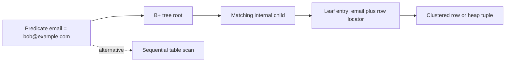
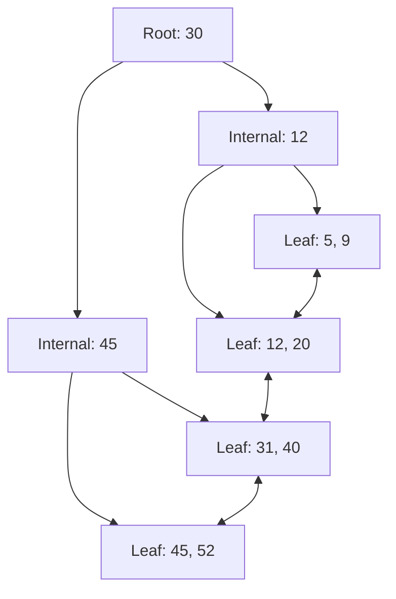
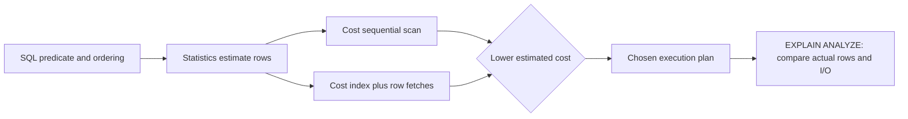
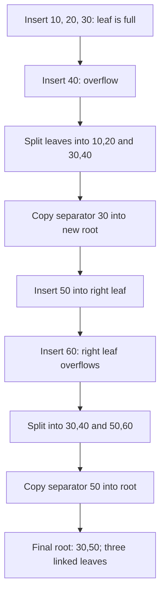

# Database Indexing & B/B+ Tree Data Structures

An index is an auxiliary access path that trades storage and write work for fewer pages read by selective queries. It sits beside the table and gives the optimizer alternatives to scanning every row, but it helps only when its ordering, coverage, and selectivity match the workload. Interviewers expect engineers to connect tree mechanics to execution plans, write amplification, and production index design rather than merely saying that indexes make queries faster.

---

## 🟢 Beginner Level

### The Textbook Index Analogy
Finding the chapter on "sorting" in a 1,200-page textbook by reading every page is a **full table scan**. Instead, you open the index at the back, see "sorting … page 214", and jump straight there. A database index is exactly that back-of-book index: a small, sorted auxiliary structure whose entries point to where the real rows live. The database pays for it twice — extra disk space, and extra work on every write — so that reads stop being linear searches.

### What Is an Index?
An **index** is an extra access structure. Ordinary relational B-trees use persistent pages plus memory caching, while hash, GIN, GiST, BRIN and in-memory indexes offer different representations. This lesson focuses on page-oriented B+ tree ideas, with PostgreSQL 16 and MySQL 8.4 examples explicitly identified.

- **Read path**: a selective B-tree probe uses a shallow descent plus qualifying-entry and row work; returning K rows is not merely O(log N).
- **Storage cost**: key width, row locators, duplicates, fill, compression and coverage determine size; measure each index rather than promise one percentage.
- **Write cost**: inserts and many updates create index/log work; deletes can leave dead entries for later cleanup. MVCC, HOT updates, partial predicates and engine rules change the immediate maintenance.
- **Transparency**: the optimizer can choose an index without an SQL rewrite, but expressions, collations and query shape must match the access path.


```mermaid
flowchart LR
    Q["Predicate email = bob@example.com"] --> R["B+ tree root"]
    R --> I["Matching internal child"]
    I --> L["Leaf entry: email plus row locator"]
    L --> T["Clustered row or heap tuple"]
    Q -.->|"alternative"| S["Sequential table scan"]
```

The tree path reads only a root-to-leaf route and then the qualifying rows. A scan reads all table pages but does so sequentially, so it can still win when most rows qualify. Cost-based optimization compares these alternatives using statistics rather than applying an “index always wins” rule.

### Why Not Just Scan the Table?
Concrete numbers make the trade obvious. Assume an `orders` table with 100 million rows at ~150 bytes each:

```
Table size            100,000,000 x 150 B  =  15 GB  =  ~915,000 pages of 16 KB
Full sequential scan  (HDD at 180 MB/s)    =  ~85 seconds
Full sequential scan  (NVMe SSD at 3 GB/s) =  ~5 seconds
B+ tree point lookup  (3 page reads)       =  ~0.3 ms on SSD (cold cache)
Point-lookup speedup                       =  ~15,000x faster than scanning
```

This compares two different result sizes and hypothetical device rates; it is not a benchmark or a universal speedup. A large matching fraction can favor a scan, while a narrow covering index can still help. Storage, visibility checks, caching and parallel execution affect the result.

### The Classic Index Types

| Type | Built On | Leaf Entry Contains | Limit Per Table |
| --- | --- | --- | --- |
| Primary index | Ordered key field of the data file | Key + anchor to first record of each block | One (defines physical order) |
| Clustered organization | logical key order of table storage | row contents in InnoDB leaves | at most one maintained organization; heaps need not have one |
| Secondary (non-clustered) | Any other column(s) | Key + row locator: PK value (InnoDB) or RID (SQL Server heap) | Many |
| Dense, textbook definition | any key | every record/search value represented, possibly with locator lists | duplicates have engine-specific representation |
| Sparse | Sorted data file only | One entry per block (first key of the block) | Only on the physical sort key |

- **Dense vs Sparse**: a dense index answers "does key K exist?" directly from the index. A sparse index locates the **block** containing K, then searches inside the block. Sparse indexing is only possible when the data file is physically ordered by the search key — which is why it appears on the clustering key and nowhere else.
- **Clustered vs Secondary**: InnoDB stores rows in its clustered tree and secondary keys plus the clustered key in separate trees. Logical tree order does not require physically adjacent disk pages. PostgreSQL keeps a heap and separate indexes; CLUSTER can reorder the heap once, but later writes do not maintain that order.

### Unique, composite, and covering indexes

A **unique index** rejects duplicate key values and can enforce a candidate-key constraint while also accelerating lookup. Its exact treatment of multiple `NULL` values depends on the database, so application invariants should follow the selected engine's semantics rather than assumptions from another vendor.

A **composite index** orders entries lexicographically by two or more key columns. For `(tenant_id, status, created_at)`, all entries for one tenant are adjacent, then ordered by status and time. This is useful when the workload filters by that leading sequence, but it is not three independent single-column indexes.

A **covering index** contains every column needed by a query, either as key columns or payload columns such as SQL Server's `INCLUDE` columns. Coverage makes index-only access possible, but MVCC may still require row visibility checks. PostgreSQL skips the heap only when its visibility map permits it; coverage alone does not prove zero heap fetches. Coverage speeds a targeted query at the cost of wider leaves, fewer entries per page, more storage, and more DML maintenance.

| Design | Primary benefit | Main trade-off |
|---|---|---|
| Unique | Enforces uniqueness and supports point lookup | Checks and locking on every write |
| Composite | Supports multi-column filters and ordering | Column order limits usable prefixes |
| Covering | Avoids base-table fetches | Wider leaves and higher write/storage cost |
| Partial or filtered | Indexes only relevant rows | Predicate must match the query and vendor syntax |

### What Does an Index Cost You?
1. **Space**: 100M entries at a hypothetical 32 bytes each already consume 3.2 GB before occupancy and page overhead. Actual entry layout must be measured.
2. **Write amplification**: inserting into a table with 5 secondary indexes performs 6 tree modifications (1 clustered + 5 secondary), each generating redo log records.
3. **Page-latch hotspots**: increasing keys concentrate new inserts near the right edge; short physical latches differ from transaction locks, and measured contention is workload-dependent.
4. **Optimizer risk**: more indexes means more plan choices — outdated statistics can steer the optimizer into the wrong one.

Rule of thumb: index columns that appear in WHERE joins and ORDER BY clauses **with high selectivity**, and audit for unused indexes quarterly.

## 🟡 Intermediate Level

### B+ tree and hash index trade-offs


```mermaid
flowchart TD
    R["Root: 30"] --> I1["Internal: 12"]
    R --> I2["Internal: 45"]
    I1 --> L1["Leaf: 5, 9"]
    I1 --> L2["Leaf: 12, 20"]
    I2 --> L3["Leaf: 31, 40"]
    I2 --> L4["Leaf: 45, 52"]
    L1 <--> L2
    L2 <--> L3
    L3 <--> L4
```

| Property | B-Tree | B+ Tree |
| --- | --- | --- |
| Payload location | Internal nodes AND leaves | Leaves only |
| Internal node contents | Keys + data pointers (fat entries) | Routing keys + child pointers only |
| Fanout | Lower (payload crowds out entries) | Higher (slim entries) |
| Leaf linkage | Isolated nodes | Doubly-linked list |
| Range scan | Tree-walk per key, revisits upper levels | One descent, then ride the leaf chain |
| Point lookup | Sometimes finds data early (no leaf visit) | Always descends to leaf |

InnoDB and PostgreSQL ordered indexes use high-fanout page trees with linked levels/leaves. Implementations differ: SQLite index b-trees also contain payload in interior cells, so not every vendor exactly matches the textbook B+ tree. Linked logical order does not guarantee adjacent physical pages.

A hash index computes a bucket from the complete search key and can make equality lookup approximately constant-time when distribution is healthy. It cannot preserve ordering, answer range predicates, support prefix matching, or satisfy `ORDER BY`. Bucket collisions and growth also require overflow handling or rehashing, so the constant-time description is an average rather than a worst-case guarantee.

| Requirement | B+ tree | Hash index |
|---|---|---|
| Exact equality | $O(\log_F N)$ page descent | Approximately $O(1)$ average bucket probe |
| Range and prefix search | Efficient through ordered linked leaves | Unsupported by hash order |
| `ORDER BY` or min/max | Can provide ordered access | Requires a separate sort or scan |
| Skew sensitivity | Maintains balanced height | Poor hashes or skew create long buckets |
| Relational default | Yes, versatile access path | Specialised equality workloads |

### Fanout Math: Why a 3-Level Tree Indexes 100 Million Rows
Assume MySQL InnoDB defaults: 16 KB pages, BIGINT keys.

- Assume effective routing fanout F = 1,000 and effective leaf capacity L = 100 after overhead and occupancy. These are teaching inputs, not a byte-layout derivation or guaranteed InnoDB capacity.
- With one root and H total levels, the idealized capacity is L × F^(H−1). Real fill, key width, row versions and splits alter both inputs.
- A tree with root + internals + leaves ("height 3") therefore holds:

```
Capacity(H levels)  =  F raised to (H-1)  x  rows per leaf

Height 2 :   10^3  x 10^2   =   100,000      rows
Height 3 :   10^6  x 10^2   =   100,000,000  rows   (one hundred million)
Height 4 :   10^9  x 10^2   =   100 billion  rows
```

For N rows in this packed model, H = 1 + max(0, ceil(log_F(N/L))). At N = 100,000,000, F = 1,000 and L = 100, H = 3. A descent visits three logical pages; caching can avoid device reads, while a secondary lookup may also descend another tree.

| Page source | What the measurement means |
|---|---|
| database buffer hit | no storage fetch for that page; locks/search still cost time |
| OS page-cache read | database miss, but not necessarily a device request |
| device access | storage latency varies with queueing, media and workload |
| cold multi-level descent | several dependent page visits, plus any row/visibility access |

### Trace 1: Secondary Index Point Lookup (InnoDB Bookmark Lookup)

```
SELECT * FROM users WHERE email = 'bob@example.com';

idx_users_email : secondary B+ tree, leaf payload = primary key value
PRIMARY KEY id  : clustered B+ tree, leaf payload = entire row

Step 1  Descend idx_users_email root          1 page read
Step 2  Descend its internal level            1 page read (usually cached)
Step 3  Leaf: locate 'bob@example.com'        1 page read, payload = id = 48213
Step 4  Descend clustered tree with id 48213  3 logical visits in this model
Step 5  Clustered leaf returns the full row

Total: 6 logical visits for the assumed two three-level trees;
cached pages need no device fetch. Visibility/overflow can add work.
```

That Step 4 hop is the famous **bookmark lookup** (SQL Server term) or **backlink lookup**. Because InnoDB secondary leaves store the **primary key value** rather than a physical address, page splits never invalidate secondary indexes — the price is a second tree descent whenever the query selects columns not in the secondary index. SQL Server heaps instead store an 8-byte RID (FileID:PageID:Slot) and patch up moves with forwarding pointers.

### Trace 2: Covering Index — Visibility Still Matters

```sql
CREATE INDEX idx_orders_customer_status ON orders (customer_id, status);

EXPLAIN SELECT customer_id, status
FROM orders
WHERE customer_id = 42;
-- Plan shows Extra: "Using index"
-- Meaning: the secondary leaf ALREADY contains customer_id, status and the
-- primary key. Coverage can avoid row lookup, but MVCC visibility may still
-- require clustered-row access; inspect the actual workload.
```

Without coverage, matching rows can require additional table lookups, often with caching or batched access. Coverage can avoid those payload fetches when visibility permits. SELECT * often prevents secondary coverage; it is not universally non-covering, since a clustered leaf contains the row and some narrow tables fit the full projection.

### Runnable PostgreSQL 16 check: coverage versus visibility

Save this as `index_visibility.sql` and run `psql -X -v ON_ERROR_STOP=1 -d your_lab_database -f index_visibility.sql`. It creates only a session-local temporary table. Use a scratch database where you can create temporary objects; no persistent application table is changed.

```sql
CREATE TEMP TABLE index_visibility (
  id integer PRIMARY KEY,
  tenant_id integer NOT NULL,
  status text NOT NULL,
  payload text NOT NULL
);
INSERT INTO index_visibility
SELECT i, i % 100, CASE WHEN i % 2 = 0 THEN 'PENDING' ELSE 'DONE' END,
       repeat('x', 64)
FROM generate_series(1, 10000) AS source(i);
CREATE INDEX visibility_cover ON index_visibility (tenant_id, status, id);
-- VACUUM must run outside an explicit transaction block.
VACUUM (ANALYZE) index_visibility;
EXPLAIN (ANALYZE, BUFFERS)
SELECT id FROM index_visibility
WHERE tenant_id = 42 AND status = 'PENDING'
ORDER BY id LIMIT 5;
UPDATE index_visibility SET payload = 'changed' WHERE id = 42;
EXPLAIN (ANALYZE, BUFFERS)
SELECT id FROM index_visibility
WHERE tenant_id = 42 AND status = 'PENDING'
ORDER BY id LIMIT 5;
SELECT id FROM index_visibility
WHERE tenant_id = 42 AND status = 'PENDING'
ORDER BY id LIMIT 5;
```

The result IDs stay `42, 142, 242, 342, 442`. On the verified PostgreSQL 16 fixture, both plans use an index-only scan; after vacuum it has zero heap fetches, and after the update it needs heap visibility work even though the required columns are still covered. Timings and fetch counts are measurements, not fixed expected values.

**Predict/change/debug:** rerun VACUUM outside a transaction, then inspect the last plan again; it can regain zero heap fetches. Selecting payload makes the projection non-covering because this index omits it. If another version chooses a different plan, inspect the plan and statistics rather than force a portable index-only guarantee. An index-only operator with heap fetches is not contradictory.

### Composite Indexes and the Leftmost Prefix Rule
A composite B+ tree orders by A, then B, then C. Missing A usually loses one tight range seek; a full index scan or a supported skip scan can still use later predicates.

```
INDEX (tenant_id, status, created_at)

WHERE tenant_id = ?                            seek using column 1
WHERE tenant_id = ? AND status = ?             seek using columns 1-2
WHERE tenant_id = ? AND created_at > ?         seek column 1, filter column 3
WHERE tenant_id = ? AND status = ? AND created_at > ?
                                               full 3-column seek (range LAST)
WHERE status = ?                               no single tight leading range; scan or versioned skip scan may help
```

- **Design order**: equality predicates first, the range predicate last — an early range column prevents the following columns from contributing to the seek (they degrade to filters inside the scanned range).
- **ORDER BY bonus**: an index on (a, b) satisfies ORDER BY a, b without a sort step.
- **Versioned exception**: MySQL 8.4 has a restricted skip-scan optimization; PostgreSQL 18 added B-tree skip scan. The PostgreSQL 16 lab below does not demonstrate it. Low leading-column cardinality can help, but inspect the plan rather than assume every missing prefix is cheap.

### When an Index Hurts
1. **Low selectivity**: matching 30M of 100M rows may make row fetches expensive, but bitmap access, clustering, caching or coverage can change the comparison. The planner estimates alternatives; no fixed matching percentage decides the winner.
2. **Write-heavy tables**: every index adds tree maintenance to each DML; high-ingest logging tables often drop all but the essential index.
3. **Tiny tables**: a scan often wins for a small table; row width, ordering, limits and coverage still matter.
4. **Potential redundancy**: (A,B) can support many A-only searches, but (A) may be smaller, unique, differently filtered or differently ordered. Check constraints and workload before removal.

### Selectivity and reasons an index is not used

Selectivity is the fraction of table rows identified by a predicate. A unique email lookup returning one row from ten million is highly selective; a boolean `enabled = true` matching 95% of rows is not. Optimizers estimate selectivity from histograms, distinct-value counts, null fractions, and correlations, then compare the estimated page cost of each access path.

An available index may be rejected when a scan is cheaper, the table is tiny, statistics are stale, or the predicate does not match its leading columns. Applying a function such as `LOWER(email)` prevents use of a plain email index unless the engine can transform it or a matching expression index exists. Implicit type conversions, leading-wildcard patterns such as `LIKE '%term'`, and collation differences can also make a predicate non-sargable.

Parameter-sensitive plans are another trap. A cached plan suitable for a rare tenant may be disastrous for a tenant owning half the table. Engines address this through generic-versus-custom plans, recompilation, adaptive behavior, or statistics, but application engineers must confirm the actual runtime plan and cardinality rather than assuming the index definition proves use.

### DML maintenance and write amplification

An `INSERT` adds an entry to every applicable index, potentially splitting pages and logging each change. An `UPDATE` of an indexed key usually deletes the old entry and inserts the new one; an update to only unindexed columns can avoid secondary maintenance, although MVCC and engine-specific tuple rules still apply. A `DELETE` removes or marks index entries, and later vacuum, purge, merge, or compaction work reclaims space.

With one clustered index and five secondary indexes, one inserted row can require six logical tree modifications plus write-ahead-log records. Wider keys reduce fanout and make splits more frequent. Unique indexes may also perform conflict checks and acquire locks, so unnecessary indexes consume latency even when no read query uses them.

Index builds are operational writes too. An offline build may block table changes, while an online or concurrent build uses extra scans, temporary storage, logs, and validation phases to reduce blocking. Monitor build progress and free space, and design rollback before adding a multi-hundred-gigabyte index to production.

### Reading EXPLAIN and execution plans

`EXPLAIN` displays the optimizer's chosen operators, estimated cardinalities, access paths, join order, and costs without necessarily running the statement. `EXPLAIN ANALYZE` executes the query and adds actual rows and timing, so use it carefully for mutating or expensive statements. PostgreSQL BUFFERS distinguishes shared hits from blocks read into shared buffers; a read can be served by the OS page cache and is not proof of device I/O. Temporary-table plans report local buffers.

```sql
EXPLAIN (ANALYZE, BUFFERS)
SELECT order_id, created_at
FROM orders
WHERE tenant_id = 42
  AND status = 'PENDING'
ORDER BY created_at DESC
LIMIT 20;
```

A matching `(tenant_id, status, created_at DESC)` index can supply bounded ordered access, but its creation does not guarantee planner selection. This SQL is a PostgreSQL excerpt requiring an orders schema. Compare estimated rows with actual rows: a large mismatch indicates statistics, correlation, or parameter-distribution trouble. Also inspect rows removed by filters, heap fetches, sort spills, loop counts, and total buffers; an operator named “Index Scan” can still read millions of entries and be the wrong plan.


```mermaid
flowchart LR
    SQL["SQL predicate and ordering"] --> ST["Statistics estimate rows"]
    ST --> C1["Cost sequential scan"]
    ST --> C2["Cost index plus row fetches"]
    C1 --> CH{"Lower estimated cost"}
    C2 --> CH
    CH --> PLAN["Chosen execution plan"]
    PLAN --> ACT["EXPLAIN ANALYZE: compare actual rows and I/O"]
```

## 🔴 Expert Level

### Inside the Page: Physical Node Layout
A page-oriented tree normally places a node on one database page, not necessarily one OS base page; overflow values and compressed formats complicate the picture. InnoDB's default page is 16 KiB, while PostgreSQL normally uses 8 KiB. Exact byte offsets depend on format/version; use the engine source when inspecting a page.

| Page region | Purpose |
|---|---|
| metadata/header | identity, type, version/recovery metadata |
| record/cell area | routing entries or leaf records |
| slot directory | locate records for in-page search |
| free/garbage space | room for changes and reclaimable records |

- **In-page search**: the slot directory gives binary search inside the page; the tree search is thus binary search at every scale.
- **PostgreSQL nbtree** normally uses 8 KiB database pages, a metapage and linked page levels. High keys/right links support recovery from concurrent splits without keeping every ancestor locked throughout a lookup; this is not a claim that readers never lock an internal page. Eligible duplicate keys can use posting-list deduplication; unique/INCLUDE indexes and operator classes have restrictions.

### Node Split Walkthrough (Order m = 4, Max 3 Keys per Node)
Convention (matches this platform's simulator): order m ⇒ maximum m − 1 = 3 keys per node, minimum ⌈m/2⌉ − 1 = 1 key. Insert keys 10, 20, 30, 40, 50, then 60 into an empty tree:


```mermaid
flowchart TD
    A["Insert 10, 20, 30: leaf is full"] --> B["Insert 40: overflow"]
    B --> C["Split leaves into 10,20 and 30,40"]
    C --> D["Copy separator 30 into new root"]
    D --> E["Insert 50 into right leaf"]
    E --> F["Insert 60: right leaf overflows"]
    F --> G["Split into 30,40 and 50,60"]
    G --> H["Copy separator 50 into root"]
    H --> R["Final root: 30,50; three linked leaves"]
```

- **Leaf split = COPY-UP**: the separator is COPIED to the parent and also stays in the right leaf, because range scans traverse leaves and must still find 30 there.
- **Internal split = PUSH-UP**: in this toy model, a separator moves to the parent while child entries split. A root split raises height by one; non-root splits add sibling nodes and can cascade upward. Equal leaf depth is maintained without binary-tree rotations, while real separator representations can differ.
- **Real engines deviate deliberately**: physical tuple sizes and insertion patterns guide split positions and separator representations. InnoDB aims for about 15/16 fullness with ordered inserts, while random inserts can yield 1/2 to 15/16 fullness; it does not deliberately empty every old ascending-insert page. Fillfactor and merge policies are vendor-specific, not this simulator's key-count rule.

### Caching Reality: Logical Visits Versus Device Reads

A hot root and upper levels often remain cached, but no root pinning or 99% hit rate is universal. A fully warm point lookup can need zero device reads; a leaf miss can need one, and visibility/secondary-row access can need more. Cold behavior depends on both database and OS caches, not merely whether the application restarted.

Size the buffer pool/shared buffers alongside connection, OS-cache and other process memory budgets. Explain counters distinguish database hits/read requests; pair them with storage telemetry before claiming a physical-I/O rate. Do not apply one RAM percentage to every engine or deployment.

### B+ Tree vs LSM-Tree: The Write-Optimized Challenger
Page B-trees typically update buffered pages and log changes. LSM engines first update a memtable with recovery logging, flush sorted files and compact runs later. The SSTable data is immutable; memtables and metadata can change, and old versions/tombstones can be removed only when snapshot and consistency rules permit.

| Property | B+ Tree (in-place) | LSM, Leveled (RocksDB-style) |
| --- | --- | --- |
| Point read | 1-3 page descents | Probe each level; bloom filters cut misses |
| Range read | Excellent (linked leaves) | Merge across all levels |
| Write amplification | page/log/split work varies with occupancy | WAL/flush/compaction work varies with policy and workload |
| Space amplification | free space, dead versions and rebuild policies | obsolete versions, level overlap and compaction headroom |
| Sweet spot | Read-heavy OLTP (PostgreSQL, InnoDB) | Write-heavy ingestion (telemetry, message metadata) |

Interview framing: B+ trees buy read performance with in-place write cost; LSMs buy write throughput with read amplification and compaction CPU. Neither dominates — engines pick per workload.

### Concurrent splits and online index construction

Tree balance does not imply one global lock. Engines use short-lived page latches to protect physical node changes while transaction locks or MVCC govern logical row visibility, keeping structural safety separate from isolation semantics.

During a leaf split, a writer allocates a sibling, redistributes entries, links the sibling, and installs a parent separator. Right-sibling links and high keys let concurrent readers recover when they encounter a page that split after their search began, without holding every ancestor latch for the full traversal.

Crash safety requires write-ahead-log records for split steps and page initialization. Recovery must never expose a parent pointer to an uninitialized child or lose the link connecting a newly allocated leaf.

An online index build normally scans a stable table view, captures concurrent row changes, then validates and publishes the new index. This reduces application blocking but consumes extra I/O, temporary space, WAL capacity, and time compared with a simple offline build.

Publication is a metadata transition, not proof that every workload should use the index. After deployment, refresh or verify statistics, inspect plans, and watch write latency before removing an older access path.

### Failure Modes
1. **Random-key locality**: UUIDv4 can spread the write working set and cause more splits/cache misses. A fixed 50/50 split rate, 66% occupancy or 1.5× bloat is not guaranteed. Time-ordered identifiers trade locality against right-edge contention; measure before disruptive rebuilds.
2. **Duplicate-heavy secondary indexes**: an index on `status` with 3 distinct values across 100M rows builds a massive tree of equal-key runs (InnoDB appends the hidden PK to make entries unique, so it is not literally duplicated — but the scan still returns millions of rows). Prefer a composite index led by a selective column, or a partial index (CREATE INDEX … WHERE status = 'PENDING' in PostgreSQL).
3. **Rightmost hotspot**: ordered insertion can contend on hot leaf latches; partitioning or randomized prefixes spread work at locality/order cost. A hotspot must be measured rather than inferred from monotonicity alone.
4. **Stale statistics steering the planner away** from a good index — covered in depth in the Query Optimization topic.
5. **Unused-index tax**: write amplification and backup bloat with zero read benefit; hunt with pg_stat_user_indexes.idx_scan or MySQL sys.schema_unused_indexes.

### Common Misconceptions

1. **“Every index makes every query faster.”**
   *Correction*: An index helps only when its access path costs less than scanning. Low selectivity, tiny tables, stale statistics, or many random row fetches can make a scan cheaper.

2. **“A composite index is equivalent to separate indexes on all its columns.”**
   *Correction*: Its entries are ordered lexicographically, so the leftmost-prefix rule governs efficient seeks. An index on `(a, b)` does not normally replace an index required for predicates on `b` alone.

3. **“A unique constraint has no performance cost because it is only a rule.”**
   *Correction*: Engines commonly enforce uniqueness with an index that must be searched, locked, logged, and maintained on writes. It provides a useful lookup path but still consumes storage and write capacity.

4. **“An Index Scan operator proves the query is efficient.”**
   *Correction*: An index scan can read millions of entries and perform millions of table lookups. Actual rows, buffers, loop counts, filtering, and elapsed time determine whether the chosen plan is good.

5. **“Dropping an unused index is always risk-free.”**
   *Correction*: Monitoring windows can miss monthly jobs, incident queries, foreign-key checks, or plan alternatives. Confirm dependencies and representative workload history, then use a reversible rollout and observe regressions.

### Interview Questions

**Q1. Why does an index improve a selective read?** `[easy]`

It narrows the search to a small root-to-leaf path instead of reading every table page. The leaf supplies either the requested data or row locators for the qualifying records. The benefit shrinks when many rows match because random base-table fetches can cost more than a sequential scan.

**Q2. What is the difference between clustered and non-clustered indexes?** `[easy]`

A clustered index determines or represents the table row order, so its leaf level contains the rows or data pages. A non-clustered index has a separate order and stores a locator such as a primary key or row identifier. Only one physical clustering order exists, while many secondary indexes can exist at additional write and storage cost.

**Q3. What does a unique index guarantee?** `[easy]`

It prevents two permitted rows from storing the same indexed key according to the database's null and collation semantics. The engine checks the index during insert and key-changing update operations. That enforcement also creates a lookup path, but contention and storage make it non-free.

**Q4. What is index selectivity?** `[easy]`

Selectivity describes how narrowly a predicate identifies rows, often expressed as the matching fraction of a table. An email equality predicate is usually more selective than a boolean status predicate. Optimizers use statistical estimates of this property to decide whether index traversal and row fetches beat a scan.

**Q5. Why do relational engines commonly prefer B+ trees to hash indexes?** `[medium]`

B+ trees support equality, ranges, ordered scans, prefixes, and ordering through one balanced structure. Hash indexes specialise in full-key equality and lose the key order required for range or sort operations. Hashing can win for controlled equality workloads, but B+ tree versatility makes it the general relational default.

**Q6. What does the leftmost-prefix rule mean for `(tenant_id, status, created_at)`?** `[medium]`

The tree can efficiently seek using `tenant_id`, then optionally `status`, then `created_at` while the leading order remains constrained. A query on `status` alone cannot normally jump to one contiguous tree range because every tenant's status values are separate. Vendor skip-scan features may offer a fallback, but the execution plan must prove that it is affordable.

**Q7. What does a covering index eliminate?** `[medium]`

It makes payload retrieval from an index possible when the query's required values are available there. Snapshot visibility can still require table access; PostgreSQL index-only scans consult the visibility map and can report nonzero heap fetches. Wider leaves add storage/write cost, so target important query shapes rather than every column.

**Q8. How do INSERT, UPDATE, and DELETE affect indexes?** `[medium]`

An insert adds entries to each applicable index, while a key-changing update commonly removes an old entry and adds a new one. A delete creates removal or dead-entry work that may be reclaimed later by purge or vacuum processes. Every operation also generates logging and may cause page splits, locks, or background maintenance.

**Q9. Why might an optimizer ignore an available index?** `[medium]`

It may estimate that too many rows qualify, the table is small, or the predicate cannot use the index's leading order. Functions, implicit conversions, leading wildcards, stale statistics, and parameter skew can all weaken the access path. Compare estimated and actual cardinalities in an execution plan before forcing the index.

**Q10. What should you inspect in EXPLAIN ANALYZE?** `[medium]`

Inspect the chosen access path, join order, actual versus estimated rows, loop counts, filters, sorts, and buffer or logical-read metrics. A large cardinality mismatch points to statistics or correlation problems, while nonzero heap fetches in an index-only scan can reflect visibility checks even when coverage is complete. Because the statement executes, use it carefully for writes and production-scale queries.

**Answer rubric**
- **Say it:** A covering index does not guarantee zero heap fetches.
- **Mechanism:** PostgreSQL checks the visibility map and consults heap tuples when required.
- **Example:** The covered ID query needs heap work after a payload update without changing its result IDs.
- **Limit:** Buffer reads can be served by the OS cache; they are not a device-I/O counter.
- **Watch for:** Compare estimates, actual rows, loops and visibility work before blaming index coverage.
- **Follow-up:** What changes after vacuum, or when the query also selects the unindexed payload?

**Q11. Why can random UUID primary keys hurt an InnoDB table?** `[hard]`

Random keys scatter inserts across many clustered leaves instead of preserving a compact right-edge working set. The resulting cache misses and page splits reduce occupancy and amplify storage writes. A wide primary key is also copied into secondary leaves, multiplying its space cost, although time-ordered identifiers introduce their own predictability trade-offs.

**Q12. How can a three-level B+ tree address roughly 100 million rows?** `[hard]`

With fanout near 1,000, two internal routing levels can address about one million leaf pages. If each leaf holds roughly 100 rows, those leaves represent about 100 million rows. Real header overhead and variable tuples change the exact count, but exponential fanout keeps the height small and upper levels cacheable.

**Q13. Scenario: a new status index made a report slower even though the plan uses it. What do you investigate?** `[hard]`

Measure how many rows each status matches and how many random table fetches the index scan performs. Compare actual rows, buffers, filtering, and sort work against a forced or observed sequential scan, and refresh statistics if estimates are wrong. A composite or partial index may fit the report, but retaining the low-selectivity index adds write cost if no other workload benefits.

**Q14. Scenario: write latency rose after five indexes were added to a hot orders table. How do you respond?** `[hard]`

Correlate each index with read usage, uniqueness or constraint dependencies, page-split activity, lock waits, and WAL volume. Remove only proven redundant or unused structures through a reversible rollout, and consider narrower keys or partial indexes for essential queries. Recheck representative execution plans afterward because dropping one index can change join orders and plans far beyond the original query.

### Further Reading

- [PostgreSQL index types](https://www.postgresql.org/docs/16/indexes-types.html) documents B-tree, hash, GiST, SP-GiST, GIN, and BRIN access paths.
- [PostgreSQL execution plans](https://www.postgresql.org/docs/16/using-explain.html) explains estimates, actual execution, and plan interpretation.
- [MySQL InnoDB clustered and secondary indexes](https://dev.mysql.com/doc/refman/8.4/en/innodb-index-types.html) describes its primary-key-oriented storage layout.
- [SQLite query planner](https://www.sqlite.org/queryplanner.html) gives a concrete explanation of multi-column and covering index decisions.
- [PostgreSQL 16 index-only scans](https://www.postgresql.org/docs/16/indexes-index-only-scans.html) explains the visibility-map requirement.
- [PostgreSQL 18 multicolumn indexes](https://www.postgresql.org/docs/18/indexes-multicolumn.html) documents versioned skip scan.
- [InnoDB 8.4 physical index structure](https://dev.mysql.com/doc/refman/8.4/en/innodb-physical-structure.html) describes page occupancy and insert patterns.
- [SQLite b-tree file format](https://www.sqlite.org/fileformat.html#b_tree_pages) documents table/index tree differences and overflow cells.
- [RocksDB compaction](https://github.com/facebook/rocksdb/wiki/Compaction) describes policy trade-offs rather than universal amplification ratios.
