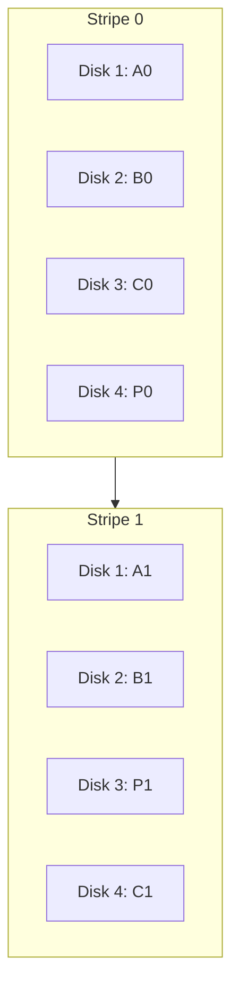
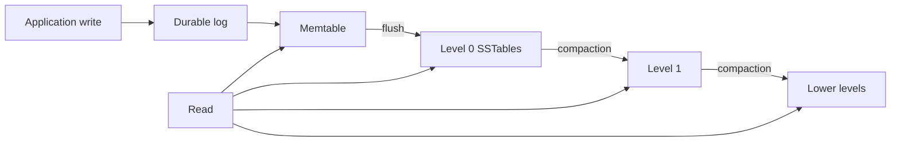
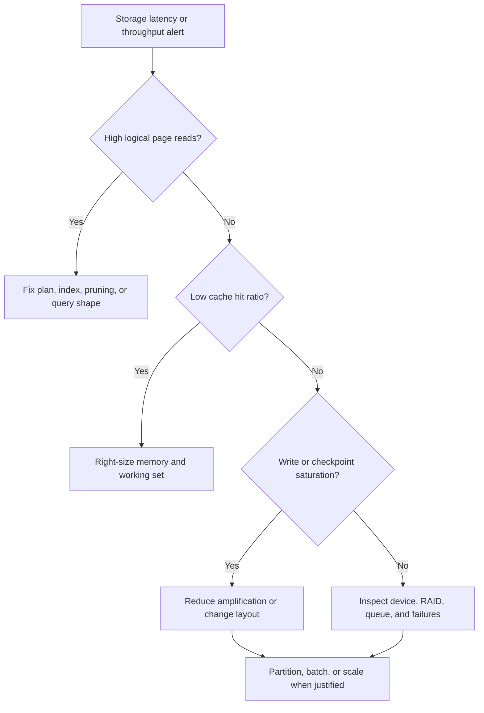

# Storage Engines, RAID, and Advanced Indexing

A database storage engine turns logical rows and queries into page reads, durable writes, and index maintenance on real devices. Its choices about file organization, RAID, partitioning, and specialized indexes determine whether a workload remains fast and recoverable as data grows. Interviewers use this topic to test whether a candidate can connect an execution plan to the storage behavior underneath it.

---

## 🟢 Beginner Level

### From a SQL row to durable bytes

SQL exposes tables and rows, but disks and SSDs transfer fixed-size blocks.

The storage engine bridges those models by managing:

- table files and index files;
- pages, commonly 8 KiB or 16 KiB;
- records and record identifiers within pages;
- a buffer pool that caches hot pages in memory;
- logs and flush rules that make committed writes recoverable.


A query normally asks the buffer pool for a page first.

If the page is cached, the engine avoids a device read.

If it is absent, the engine reads the containing page, not just one row.

This is why page locality and access patterns matter more than a row's apparent size.

### Pages, records, and blocking factor

A page contains a header, slot directory, records, and free space.

A slot directory lets records move during compaction without changing their logical record identifiers.

Assume an 8,192-byte page has a 192-byte header and each fixed record uses 160 bytes.

The usable payload is:

$$
8{,}192 - 192 = 8{,}000\text{ bytes}
$$

The blocking factor is:

$$
\left\lfloor \frac{8{,}000}{160} \right\rfloor = 50\text{ records per page}
$$

A table with 1,000,000 records therefore needs approximately:

$$
\left\lceil \frac{1{,}000{,}000}{50} \right\rceil = 20{,}000\text{ data pages}
$$

A heap scan may inspect all 20,000 pages.

A selective index lookup may inspect three index pages and one data page instead.

The useful comparison is therefore page I/O, not only asymptotic row operations.

### File organizations

A **file organization** defines how table records are placed and found.

| Organization | Placement | Equality lookup | Range scan | Write behavior |
|---|---|---:|---:|---|
| Heap | Any page with space | $O(N)$ without index | Full scan | Fast append or free-space insert |
| Sorted or clustered | Key order | $O(\log N)$ search | Excellent | Page splits or reorganization |
| Hash-organized | Hash bucket | Expected $O(1)$ | Poor | Bucket splits or overflow chains |
| Log-structured | New versions appended | Index-dependent | Merge-dependent | High sequential write throughput |

Heap organization works well when writes are frequent and secondary indexes provide access paths.

Sorted organization improves locality for ranges but makes arbitrary inserts more expensive.

Hash organization is attractive for equality access but deliberately discards ordering.

Log-structured engines batch random writes into sequential runs and later compact them.

No organization is universally best; workload shape selects the trade-off.

### Storage engines and their responsibilities

A storage engine owns more than a file format.

It coordinates:

- page allocation and free-space tracking;
- the buffer cache and eviction policy;
- row and page locking or MVCC versions;
- index implementations;
- write-ahead logging and crash recovery;
- background tasks such as checkpoints, vacuum, and compaction.

PostgreSQL uses heap-organized tables and separate indexes.

InnoDB stores table rows in the primary-key B+ tree, making the primary index clustered.

RocksDB stores immutable sorted runs in an LSM-tree and compacts them across levels.

These engines can execute similar logical queries while producing very different physical I/O.

### What RAID does and does not do

RAID combines multiple drives into one logical block device.

It uses **striping** to spread I/O, **mirroring** to duplicate data, or **parity** to reconstruct missing data.

RAID can improve throughput and tolerate particular device failures.

RAID is not a backup.

Deletion, corruption, ransomware, and an incorrect application update are faithfully copied across the array.

Recoverability still requires tested backups, independent copies, and point-in-time recovery logs.

---

## 🟡 Intermediate Level

### Scaling storage and advanced indexes

Storage scaling joins four decisions: how records are organized, how devices are protected, how data is partitioned, and which indexes match query predicates.

Changing one decision affects the others.

For example, partitioning a time-series table can shrink each B+ tree, but every local index must still be maintained and cross-partition queries must merge results.

Adding RAID capacity can improve aggregate bandwidth, but a parity level may make the database's small synchronous writes slower.

Specialized indexes can avoid scans, but they consume storage and amplify inserts, updates, deletes, replication, backups, and recovery.

### RAID 0, 1, 5, 6, and 10

Assume $N$ equal-size drives, each with capacity $S$ and random-I/O capability $X$.

| Level | Layout | Minimum drives | Usable capacity | Failure tolerance | Small random-write cost |
|---|---|---:|---:|---|---:|
| RAID 0 | Striping only | 2 | $N \times S$ | None | 1 physical write |
| RAID 1 | Mirroring | 2 | Typically $S$ per mirror | One drive per mirror | 2 physical writes |
| RAID 5 | Distributed single parity | 3 | $(N-1) \times S$ | 1 drive | About 4 I/Os |
| RAID 6 | Distributed dual parity | 4 | $(N-2) \times S$ | 2 drives | About 6 I/Os |
| RAID 10 | Stripe across mirrors | 4 | $(N/2) \times S$ | At least 1; potentially one per pair | 2 physical writes |

RAID 0 maximizes capacity and striping performance but loses the array when any member fails.

RAID 1 favors simple recovery and strong read availability at a 50% capacity cost.

RAID 5 provides capacity efficiency with one parity block per stripe.

RAID 6 adds independent parity information so two missing members can be reconstructed.

RAID 10 is commonly chosen for write-heavy databases because mirrored writes avoid parity read-modify-write.

### Distributed parity and reconstruction

In RAID 5, parity rotates so no single drive becomes a permanent parity bottleneck.



For three data blocks, parity is:

$$
P = D_1 \oplus D_2 \oplus D_3
$$

Because XOR is self-inverse, losing $D_2$ allows reconstruction:

$$
D_2 = D_1 \oplus D_3 \oplus P
$$

The same calculation is repeated for every stripe during rebuild.

RAID 6 uses two independent parity equations, usually XOR parity plus Reed-Solomon arithmetic, to solve for two missing values.

### Worked array sizing and write throughput

Consider four 2 TB drives, each capable of 200 random IOPS.

| Metric | RAID 0 | RAID 5 | RAID 6 | RAID 10 |
|---|---:|---:|---:|---:|
| Usable capacity | 8 TB | 6 TB | 4 TB | 4 TB |
| Approximate read IOPS | 800 | 800 | 800 | Up to 800 |
| Approximate random write IOPS | 800 | $800/4=200$ | $800/6\approx133$ | $800/2=400$ |
| Survives one failed member | No | Yes | Yes | Yes |

A small RAID 5 update reads old data and old parity, then writes new data and new parity.

That is two reads plus two writes for one logical write.

RAID 6 must update two parity values, increasing the typical penalty to six I/Os.

RAID 10 sends each logical write to two mirrors, so its approximate penalty is two.

These are planning approximations; controller cache, queue depth, full-stripe writes, SSD behavior, and workload concurrency change observed throughput.

### Rebuild time and degraded operation

Replacing one failed 2 TB member requires reading or reconstructing roughly 2 TB of data.

At a sustained rebuild rate of 200 MB/s:

$$
\frac{2{,}000{,}000\text{ MB}}{200\text{ MB/s}}=10{,}000\text{ s}\approx2.8\text{ hours}
$$

Production rebuilds often take longer because foreground queries compete for bandwidth.

RAID 5 degraded reads touching the missing member must read the surviving stripe and calculate the absent block.

RAID 1 and RAID 10 can copy sequentially from a surviving mirror, which is operationally simpler.

Rebuild duration is a reliability concern because redundancy is reduced throughout the window.

Capacity plans should include hot spares, replacement procedures, monitoring, and regular scrubs.

### Bitmap indexes for analytical predicates

A bitmap index creates a bit vector for each value or encoded value range.

For eight rows:

```text
Row             1 2 3 4 5 6 7 8
status=ACTIVE   1 0 1 1 0 1 0 1
region=WEST     0 1 1 1 0 1 0 0
AND             0 0 1 1 0 1 0 0
```

The combined predicate selects rows 3, 4, and 6 through one bitwise `AND`.

For 1,000,000 rows, one uncompressed vector occupies 1,000,000 bits, or 125,000 bytes.

Four status values therefore need about 500 KB before metadata and compression.

Bitmaps excel for read-heavy, low-to-moderate-cardinality analytics where many predicates combine.

Frequent row updates can cause contention and index-maintenance overhead, so classic bitmaps are a poor default for OLTP.

Compressed forms such as Roaring bitmaps make sparse and dense regions efficient.

### Inverted, hash, and B+ tree indexes

An **inverted index** maps a term to a postings list of documents, row IDs, and optionally positions.

It supports full-text search because `database AND indexing` becomes an intersection of two postings lists.

A **hash index** maps a key hash to a bucket and is optimized for equality predicates.

A **B+ tree** keeps ordered keys and supports equality, ranges, prefix scans, and ordered output.

| Index | Best predicate | Ordered scans | Main cost | Typical use |
|---|---|---|---|---|
| B+ tree | Equality and range | Yes | Page splits and write amplification | General relational indexes |
| Hash | Equality | No | Bucket growth and collision handling | Exact key lookup |
| Bitmap | Combined categorical filters | Not by key order | Update contention | Warehouses and column stores |
| Inverted | Terms, tokens, text | By scoring or term structures | Tokenization and postings maintenance | Search and full text |
| BRIN or zone map | Correlated ranges | Coarse pruning | False-positive page reads | Append-ordered large tables |

Index choice begins with operators and selectivity, not with a belief that one structure is fastest.

### Partitioning and scaling implications

Horizontal partitioning divides rows, commonly by range, list, or hash.

Vertical partitioning moves groups of columns into separate physical structures or tables.

Partition pruning reduces I/O only when a predicate constrains the partition key.

Local indexes are smaller and easier to rebuild, but a global lookup may probe many partitions.

Global indexes accelerate cross-partition access but complicate partition detach, movement, and recovery.

Hash partitioning balances keys but destroys range locality.

Range partitioning preserves time locality but can create a hot newest partition.

Sharding moves partitions across database servers and introduces routing, distributed transactions, and rebalancing.

Replication improves read capacity and availability, but it does not make one write execute faster and may expose replica lag.

---

## 🔴 Expert Level

### Storage-engine write paths and amplification

A page-oriented B+ tree engine performs in-place logical updates to cached pages and records redo in a write-ahead log.

Random dirty pages are later flushed during checkpoints.

An LSM engine appends to a log, updates an in-memory sorted structure, flushes immutable runs, and compacts overlapping runs.



LSM compaction improves sequential write throughput but rewrites data repeatedly.

This **write amplification** consumes device bandwidth and SSD endurance.

B+ trees also amplify writes through WAL, page updates, secondary indexes, and occasional page splits.

Measure application bytes, WAL bytes, flushed bytes, and device bytes separately before blaming storage hardware.

### Stripe geometry, full-stripe writes, and the write hole

A stripe consists of one chunk from each RAID member.

Small writes on parity RAID trigger read-modify-write because the controller needs old values to compute new parity.

A full-stripe write supplies every new data chunk and lets the controller calculate parity without reading old data.

Controller cache can coalesce small writes, but unprotected volatile cache weakens durability.

The **RAID write hole** occurs if power fails after data reaches disk but before matching parity, or vice versa.

The stripe becomes internally inconsistent and a later rebuild can reconstruct incorrect bytes.

Battery-backed or supercapacitor-backed cache, a write journal, copy-on-write layouts, and regular scrubbing reduce this risk.

RAID 6 protects against two missing members but does not by itself make a partial stripe update atomic.

### URE probability during rebuild

An unrecoverable read error may occur while surviving drives are read to rebuild a failed member.

Suppose a three-drive survivor set must read 6 TB in total.

Using decimal units:

$$
b=6\times10^{12}\times8=4.8\times10^{13}\text{ bits}
$$

For a stated unrecoverable bit error rate of $10^{-14}$, the expected count is $\lambda=0.48$.

Using a Poisson approximation:

$$
P(\text{at least one URE})=1-e^{-0.48}\approx38.1\%
$$

This simplified calculation assumes independent errors and that the full amount is read.

Real outcomes depend on drive specifications, data placement, controller recovery, scrubbing history, and whether a second parity equation is available.

The lesson is not that every rebuild fails; it is that larger drives lengthen the vulnerable window and increase the amount that must be read.

### Advanced index internals

Bitmap containers may use dense arrays, sorted integer lists, or run-length encoding depending on density.

Roaring bitmaps partition integers by their high 16 bits and select a compact container for the low 16 bits.

Inverted indexes compress sorted document IDs as gaps because adjacent gaps are smaller than absolute IDs.

Positions permit phrase queries, while term frequency and document statistics support ranking.

Skip data lets intersections jump over ranges that cannot match.

Hash indexes must manage collisions with chaining, open addressing, or bucket pages.

Static hash tables accumulate overflow chains as data grows; extendible and linear hashing split buckets incrementally.

BRIN indexes or zone maps summarize page ranges and work only when physical order correlates with the indexed value.

Bloom filters answer “definitely absent” or “possibly present,” reducing unnecessary LSM-table reads while permitting false positives.

### Production scaling decision flow

The correct response to a storage bottleneck begins with evidence from the query plan and I/O metrics.



An index cannot fix a query that must read most rows.

Faster RAID cannot compensate for accidental full scans caused by stale statistics.

Partitioning cannot improve a query whose predicate does not enable pruning.

Sharding should follow a demonstrated single-node limit because it adds operational and transactional complexity.

When scaling out, define shard keys, hot-key controls, rebalancing, backup consistency, and disaster-recovery behavior before migration.

### Common Misconceptions

1. **“RAID is a backup.”**
   RAID preserves service through specific device failures, but it reproduces deletion and corruption. Independent, versioned, restore-tested backups remain necessary.

2. **“RAID 5 always gives the capacity and speed benefits of striping without meaningful cost.”**
   Small writes pay parity read-modify-write, and degraded reads become reconstruction work. Rebuild risk and latency grow with drive size and foreground load.

3. **“A hash index is faster than a B+ tree for every query.”**
   Hashing can offer expected constant-time equality access, but it cannot naturally provide ranges or key order. Collision handling, bucket overflow, and low selectivity can erase the apparent advantage.

4. **“Bitmap indexes are only useful when a column has two values.”**
   Compression and encoded bitmaps support more cardinalities and combine predicates efficiently. Their real constraints are workload shape, update rate, and representation size rather than a fixed two-value rule.

5. **“Partitioning automatically makes a large table fast.”**
   Partitioning helps when pruning excludes partitions or maintenance operates on partitions independently. Queries that miss the partition key may fan out and become slower.

### Interview Questions

**Q1. What does a database storage engine manage?** `[easy]`

A storage engine maps logical records and transactions to pages, files, indexes, logs, and device I/O. It manages caching, allocation, concurrency, durability, and recovery policies. Different engines expose similar SQL behavior while making different read, write, and maintenance trade-offs.

**Q2. What is the difference between RAID 0 and RAID 1?** `[easy]`

RAID 0 stripes blocks across drives and provides no redundancy, so any member failure loses the logical array. RAID 1 writes complete mirrored copies, allowing reads from either member and continued operation after one mirror member fails. RAID 0 favors capacity and throughput, whereas RAID 1 spends capacity on recoverability.

**Q3. How does RAID 5 reconstruct a lost block?** `[easy]`

RAID 5 stores distributed parity computed as the XOR of data blocks in a stripe. Because XOR is self-inverse, the missing block equals the XOR of the surviving data blocks and parity. It tolerates exactly one unavailable member; another missing block removes enough information to reconstruct the stripe.

**Q4. What is an inverted index and where is it used?** `[easy]`

An inverted index maps each normalized term to a postings list of documents or rows containing it. Optional positions, frequencies, and skip data support phrases, ranking, and efficient intersections. Search engines and relational full-text features use it because a B+ tree over whole documents cannot directly answer token queries.

**Q5. Why is RAID 10 often preferred to RAID 5 for write-heavy OLTP?** `[medium]`

RAID 10 mirrors each logical write and avoids distributed-parity read-modify-write. RAID 5 commonly performs two reads and two writes for a small update, reducing random-write IOPS and increasing latency. RAID 10 uses more capacity but usually gives simpler degraded operation and faster mirror-based rebuilds.

**Q6. When should you choose a bitmap index instead of a B+ tree?** `[medium]`

Choose a bitmap representation for read-heavy analytical data when categorical predicates are combined across many rows. Bitwise operations can intersect millions of row memberships with few CPU instructions, and compression can keep sparse or run-heavy sets compact. Prefer a B+ tree for write-heavy OLTP, ordered ranges, or workloads where bitmap maintenance and contention dominate.

**Q7. Why can a hash index not efficiently satisfy `ORDER BY` or a range predicate?** `[medium]`

A hash function intentionally distributes nearby key values into unrelated buckets. The structure therefore has no traversal order corresponding to the original key order. It can locate equality buckets efficiently, but ranges and ordered output require scanning buckets and sorting or using another ordered access path.

**Q8. How does partitioning affect indexes?** `[medium]`

Local indexes cover one partition, so they are smaller and can be rebuilt or detached with that partition. A lookup without the partition key may have to probe every local index and merge results. Global indexes avoid that fan-out but make partition movement, failure recovery, and metadata coordination more complex.

**Q9. What is the RAID write hole?** `[medium]`

The write hole is parity inconsistency caused when only part of a data-and-parity update reaches stable storage. The array may continue reading normally until a scrub or rebuild relies on stale parity and reconstructs bad data. Protected write-back cache, write journaling, copy-on-write layouts, and full-stripe writes are common mitigations.

**Q10. Why can an LSM storage engine have high write amplification?** `[medium]`

An LSM engine first appends a write and later flushes it into an immutable sorted table. Compaction repeatedly merges that entry into lower levels as newer runs overlap older ones. Sequential writes are efficient, but total device bytes and SSD wear can greatly exceed application bytes.

**Q11. Scenario: A dashboard query filters 100 million sales rows by region and status and takes 38 seconds. What would you evaluate?** `[medium]`

First inspect the plan, selectivity, page reads, partition pruning, and whether existing statistics describe the combined predicates. For read-mostly categorical data, a compressed bitmap or column-store encoding may evaluate the filters more efficiently than separate B+ tree probes; a materialized aggregate may be better if the dashboard repeats the same grouping. Validate the change with realistic concurrency because index construction, refresh, storage, and write amplification remain costs.

**Q12. Scenario: Latency spikes after one RAID 5 member fails even though the database remains available. Why?** `[hard]`

Reads targeting the failed member must be reconstructed from the surviving stripe, so each logical read creates multiple physical reads and parity computation. The background rebuild competes with database traffic for the same queue and bandwidth, increasing tail latency. Throttle or prioritize rebuild work carefully, reduce foreground load if possible, and replace the failed member promptly because the array has lost its normal redundancy margin.

**Q13. How do unrecoverable read errors change the choice between RAID 5 and RAID 6?** `[hard]`

A RAID 5 rebuild must read surviving members while no second parity equation remains available. An unrecoverable sector in another member can therefore make part or all of the array unreconstructable. RAID 6 spends another drive's capacity and additional write work to tolerate a second missing or unreadable contribution, which becomes more valuable as drives and rebuild windows grow.

**Q14. Scenario: A partitioned event table keeps growing, but queries still scan every partition. What should you check?** `[hard]`

Confirm that predicates constrain the actual partition key in a form the optimizer can prune, rather than wrapping it in an unsupported function or using an incompatible type. Check prepared-plan behavior, constraint metadata, statistics, and whether joins hide the pruning value until too late. If access patterns rarely include the key, redesign the partition key or provide a different summary or index instead of adding more partitions.

**Q15. How would you distinguish an indexing problem from a storage-device problem?** `[hard]`

Start with the execution plan and logical I/O: excessive rows or pages read indicates a plan, selectivity, pruning, or index issue. If logical work is appropriate but physical latency, queue depth, device errors, flush stalls, or RAID degradation is abnormal, investigate the storage layer. Correlating query-level waits with operating-system and controller metrics prevents expensive hardware changes that merely conceal inefficient queries.

### Further Reading

- [PostgreSQL documentation: Database Page Layout](https://www.postgresql.org/docs/current/storage-page-layout.html) explains heap page headers, item identifiers, and tuple placement.
- [PostgreSQL documentation: Index Types](https://www.postgresql.org/docs/current/indexes-types.html) compares B-tree, hash, GiST, SP-GiST, GIN, and BRIN access methods.
- [Linux kernel documentation: RAID arrays](https://docs.kernel.org/admin-guide/md.html) describes Linux MD behavior and operational controls.
- [Apache Lucene documentation](https://lucene.apache.org/core/) provides the primary implementation reference for inverted indexes and postings-based search.
