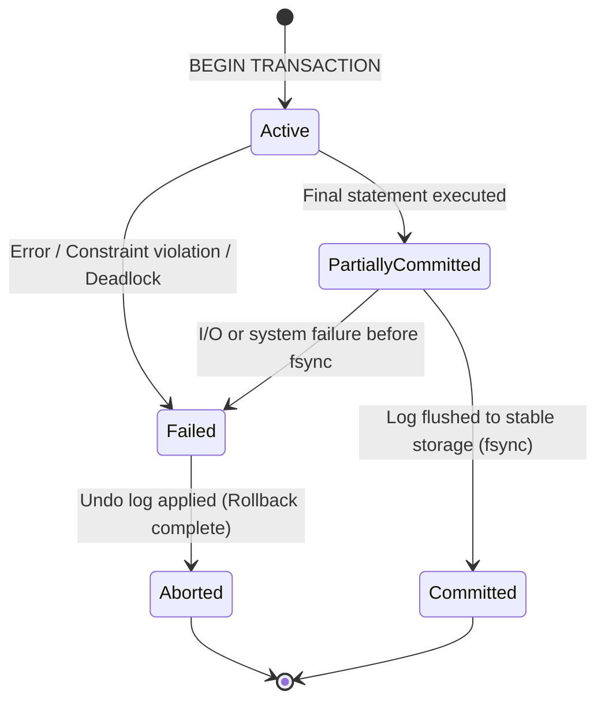
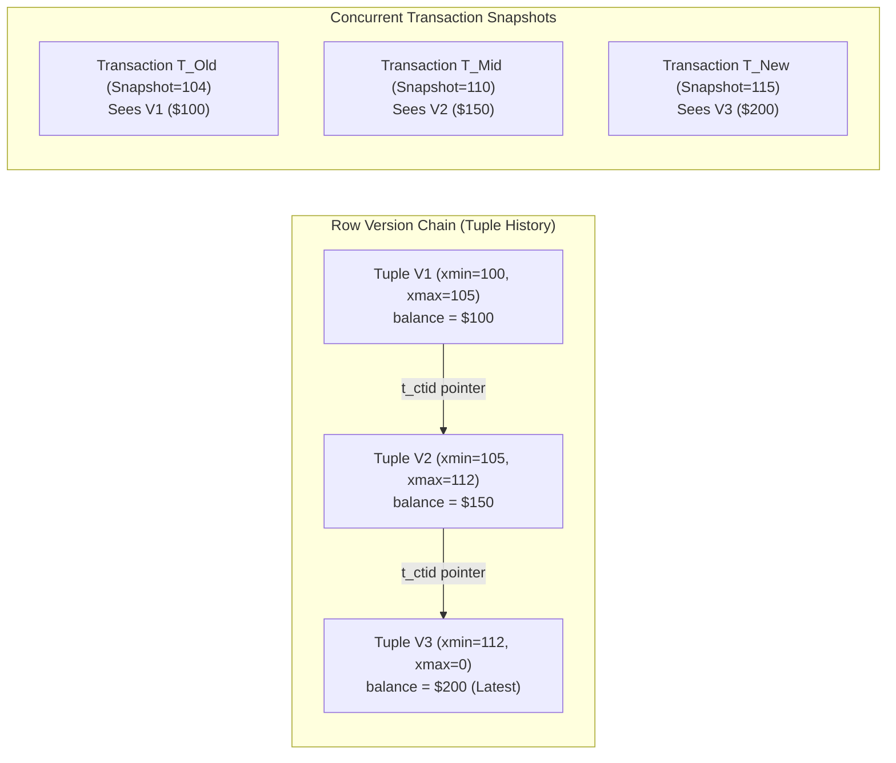
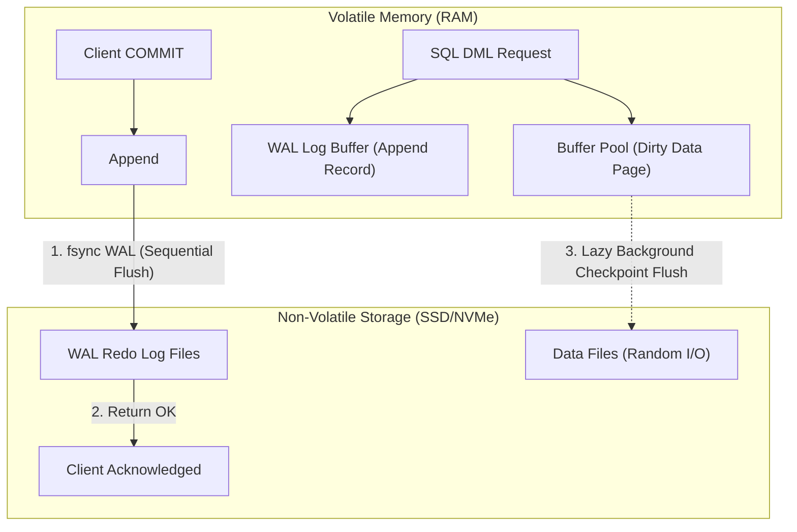
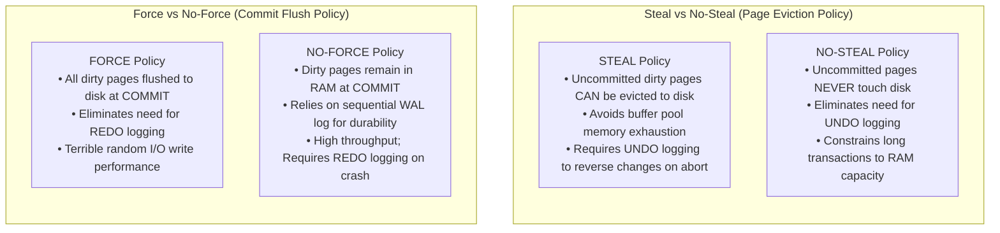
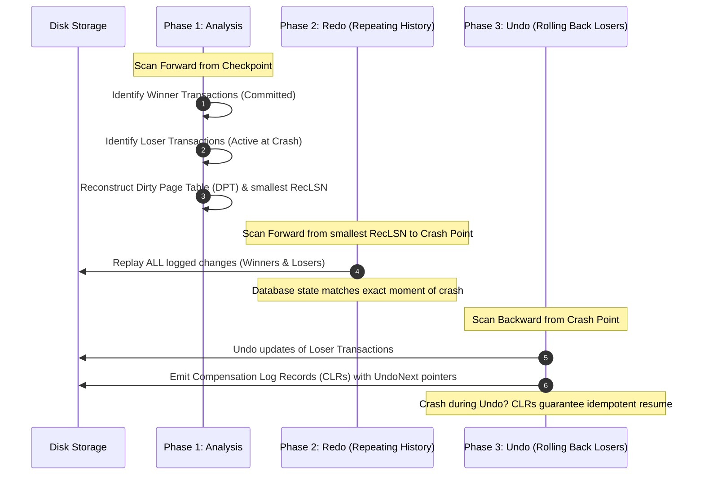

# Database Transactions, ACID States & Crash Recovery

A database transaction is a logical boundary that bundles multiple read and write operations into an indivisible, atomic execution unit. Sitting directly at the intersection of the relational query execution engine, the buffer pool manager, and the storage subsystem, transaction management guarantees predictable data consistency even in the presence of abrupt hardware crashes, power loss, and aggressive concurrent traffic. Because transaction isolation and crash recovery underwrite all mission-critical financial ledgers and distributed systems, interviewers frequently probe candidate knowledge on ACID trade-offs, Write-Ahead Logging (WAL) invariants, and ARIES recovery mechanics.

---

## 🟢 Beginner Level

### The Core Problem: Why Systems Need Transactions
Consider an everyday banking funds transfer: transferring \$500 from Account A to Account B requires two distinct SQL updates: subtracting \$500 from Account A's balance and adding \$500 to Account B's balance. If the database server loses power, suffers an out-of-memory crash, or loses disk connectivity immediately after executing the first update but before executing the second, \$500 vanishes from Account A without ever appearing in Account B. 

Without transaction management, the database is left in a corrupted, half-finished state. A transaction provides an all-or-nothing guarantee: either every single statement inside the transaction succeeds and permanently commits to storage, or the entire batch is rolled back as if none of the operations ever executed.

### What is a Database Transaction?
A **Transaction** is a sequence of one or more SQL operations treated as a single logical unit of work. Application developers delimit transactions using explicit control statements:

```sql
BEGIN TRANSACTION;
  UPDATE accounts SET balance = balance - 500 WHERE account_id = 101;
  UPDATE accounts SET balance = balance + 500 WHERE account_id = 202;
COMMIT;
```

If an error or constraint violation occurs before `COMMIT` is reached, issuing `ROLLBACK` instructs the database engine to consult its undo log and reverse every temporary modification made during that session, returning the affected database rows to their exact initial state.

### The Four ACID Properties Demystified
The foundational contract of any relational database management system is encapsulated by the **ACID** properties:

1. **Atomicity ("All or Nothing")**: A transaction cannot be partially executed. If a transaction consists of five modifications and the fourth fails, all preceding three modifications are undone. Atomicity is enforced internally by recording the pre-modification state in the **undo log** (or rollback segment).
2. **Consistency ("Preserving Invariants")**: The transaction moves the database from one valid state to another valid state, preserving all schema invariants, such as `FOREIGN KEY` references, `CHECK` constraints, column `NOT NULL` rules, and application-defined uniqueness constraints. Note that this is distinct from consistency in the CAP theorem (which refers to distributed single-copy read linearizability).
3. **Isolation ("Concurrency Without Interference")**: Intermediate states of an uncommitted transaction remain invisible to other concurrent transactions running on the database. Concurrent transactions execute with the illusion of running sequentially in isolation. Isolation is implemented via row locks, table locks, or Multi-Version Concurrency Control (MVCC) snapshots.
4. **Durability ("Surviving Crashes")**: Once a transaction receives a successful commit confirmation, its modifications will never be lost, even if an operating system panic, hardware fault, or immediate power failure ensues. Durability is enforced by persisting commit records to stable storage through **Write-Ahead Logging (WAL)** before returning control to the client.

### Transaction States and the Lifecycle State Machine
During its execution, a transaction transitions through discrete states managed by the database transaction manager:



1. **Active**: The initial state where the transaction begins executing SQL statements, reading pages into the buffer pool and generating undo/redo log records in memory.
2. **Partially Committed**: The final SQL statement has executed in memory, but the dirty data pages and commit log record still reside only in volatile RAM buffers. A system crash at this exact moment results in the transaction being classified as uncommitted.
3. **Committed**: The `<COMMIT>` log record has been synchronously flushed and acknowledged by non-volatile storage. The transaction is now permanently durable.
4. **Failed**: An internal execution error, dead-lock victim selection, query timeout, or hardware fault interrupted processing while in the Active or Partially Committed state.
5. **Aborted**: The database engine has finished executing the rollback routine, reversing all intermediate changes and releasing held resource locks.

### Autocommit, Explicit Transactions, and Savepoints
Every SQL query executes within a transactional context:
- **Autocommit Mode**: By default, relational databases like MySQL and PostgreSQL run with autocommit enabled, wrapping each individual query in an implicit transaction that commits immediately. Multi-statement business workflows left in autocommit mode sacrifice cross-query atomicity.
- **Explicit Transactions**: Explicitly declaring `BEGIN` (or `START TRANSACTION`) and `COMMIT` groups arbitrary numbers of statements into an atomic envelope.
- **Savepoints**: Savepoints establish intermediate checkpoints inside a long-running transaction, allowing partial rollback without abandoning the entire transaction's earlier progress:

```sql
BEGIN;
  INSERT INTO orders (id, customer_id, total) VALUES (401, 88, 120.00);
  SAVEPOINT payment_attempt;
  UPDATE customer_wallet SET balance = balance - 120.00 WHERE customer_id = 88;
  -- If wallet update fails due to insufficient funds:
  ROLLBACK TO SAVEPOINT payment_attempt;
  -- Order insert is preserved; proceed with alternate payment
  INSERT INTO pending_invoices (order_id, amount) VALUES (401, 120.00);
COMMIT;
```

### Concurrency Anomalies: The Vocabulary of Isolation
When multiple transactions access shared records simultaneously without total serial ordering, several well-defined concurrency anomalies can emerge:

| Anomaly | Short Definition | Concrete Scenario |
|---|---|---|
| **Dirty Read** | Reading uncommitted modifications written by another concurrent transaction. | Transaction $T_1$ updates balance to \$800; $T_2$ reads \$800; $T_1$ subsequently rolls back to \$500. $T_2$ operated on invalid phantom data. |
| **Non-Repeatable Read (Fuzzy Read)** | Re-reading the exact same row within a transaction returns different values because a concurrent transaction modified and committed that row. | $T_1$ reads row $X = 100$; $T_2$ updates $X = 200$ and commits; $T_1$ reads row $X$ again and receives $200$. |
| **Phantom Read** | Re-executing a range query within a transaction returns a different set of matching rows because a concurrent transaction inserted or deleted qualifying rows. | $T_1$ executes `SELECT COUNT(*) WHERE age > 30` and gets 12; $T_2$ inserts a new 35-year-old user and commits; $T_1$ re-runs the count and gets 13. |
| **Lost Update** | Two transactions simultaneously read the same initial value and compute updates; the later commit overwrites the earlier commit without incorporating its changes. | Both $T_1$ and $T_2$ read balance \$100; $T_1$ writes $\$100 - \$30 = \$70$; $T_2$ writes $\$100 - \$40 = \$60$; final balance is \$60 instead of \$30. |
| **Write Skew** | Two concurrent transactions evaluate disjoint rows based on overlapping integrity rules, each making changes that individually look valid but jointly violate the global invariant. | Two on-call doctors simultaneously request leave when the hospital requires $\ge 1$ doctor active; both see 2 active doctors and both take leave, leaving 0 doctors on duty. |

---

## 🟡 Intermediate Level

### SQL Isolation Levels vs Anomaly Matrix
The ANSI SQL-92 standard formalized four classic isolation levels to balance concurrency performance against data consistency. Modern storage engines expand this with Snapshot Isolation:

| Isolation Level | Dirty Read | Non-Repeatable Read | Phantom Read | Lost Update | Write Skew |
|---|---|---|---|---|---|
| **READ UNCOMMITTED** | Allowed | Allowed | Allowed | Allowed | Allowed |
| **READ COMMITTED** | Prevented | Allowed | Allowed | Allowed | Allowed |
| **REPEATABLE READ** | Prevented | Prevented | Engine-Specific | Prevented* | Allowed |
| **SNAPSHOT ISOLATION** | Prevented | Prevented | Prevented | Prevented | Allowed |
| **SERIALIZABLE** | Prevented | Prevented | Prevented | Prevented | Prevented |

*Note: In PostgreSQL REPEATABLE READ (implemented via Snapshot Isolation), in-place lost update attempts trigger a serialization abort (`ERROR: could not serialize access due to concurrent update`). In MySQL InnoDB REPEATABLE READ, plain `SELECT` is protected by MVCC snapshots, but raw `UPDATE` performs a locking "current read", which can still overwrite concurrent changes unless explicit `SELECT ... FOR UPDATE` row locks or atomic expressions are used.*

### Concrete Anomaly Traces with Worked Math

#### 1. Lost Update Under READ COMMITTED
Assume Account 1 starts with a verified balance of \$100. Two concurrent client requests $T_1$ (deducting \$40) and $T_2$ (deducting \$70) arrive concurrently at the application layer:

```sql
-- SESSION T1                                   -- SESSION T2
BEGIN;                                          BEGIN;
SELECT balance FROM accounts WHERE id = 1;      SELECT balance FROM accounts WHERE id = 1;
-- T1 reads balance = 100                        -- T2 reads balance = 100

-- T1 computes 100 - 40 = 60 in memory
UPDATE accounts SET balance = 60 WHERE id = 1;
COMMIT; -- Disk balance is now 60

                                                -- T2 computes 100 - 70 = 30 from stale balance
                                                UPDATE accounts SET balance = 30 WHERE id = 1;
                                                COMMIT; -- Overwrites balance with 30!
```
*Result*: The final balance in the database is \$30. The \$40 deduction made by $T_1$ has been completely destroyed. The correct final balance should have been $\$100 - \$40 - \$70 = -\$10$.

*Remediation Strategies*:
1. **Atomic In-Database Arithmetic**: `UPDATE accounts SET balance = balance - 40 WHERE id = 1;` forces the engine to apply the mutation to the latest committed value under a brief row-exclusive lock.
2. **Pessimistic Locking**: Executing `SELECT balance FROM accounts WHERE id = 1 FOR UPDATE;` acquires an exclusive row lock immediately, forcing Session $T_2$ to block until $T_1$ commits.
3. **Optimistic Locking with Versioning**: Adding a `version` column and checking `WHERE id = 1 AND version = :v` aborts $T_2$ when it detects that $T_1$ incremented the version counter.

#### 2. Write Skew: The Classic Doctor On-Call Problem
Assume a hospital table `doctors` has two records: Dr. Alice (`is_on_call = TRUE`) and Dr. Bob (`is_on_call = TRUE`). The hospital rule states: "At least one doctor must remain on call at all times."

```sql
-- SESSION T1 (Dr. Alice requests off)           -- SESSION T2 (Dr. Bob requests off)
BEGIN;                                          BEGIN;
SELECT COUNT(*) FROM doctors                    SELECT COUNT(*) FROM doctors
WHERE is_on_call = TRUE;                        WHERE is_on_call = TRUE;
-- Alice sees 2 doctors on call                  -- Bob sees 2 doctors on call

-- Invariant check passes (2 >= 2)               -- Invariant check passes (2 >= 2)
UPDATE doctors SET is_on_call = FALSE           UPDATE doctors SET is_on_call = FALSE
WHERE name = 'Alice';                           WHERE name = 'Bob';
COMMIT;                                         COMMIT;
```
*Result*: Neither session modified the row the other session touched, so row-level locks and Snapshot Isolation first-committer-wins rules find no conflict. However, the final database state has 0 doctors on call, violating the global invariant. True `SERIALIZABLE` isolation (using predicate locks or SSI) detects this overlapping read-write dependency cycle and forces one transaction to abort.

### Multi-Version Concurrency Control (MVCC) Mechanisms
To eliminate contention between read queries and write queries, modern relational engines implement **Multi-Version Concurrency Control (MVCC)**. Under MVCC:
> **Core MVCC Rule**: "Readers never block writers, and writers never block readers."

Instead of locking data rows during read queries, the database creates a new physical version of a row whenever an `UPDATE` occurs, keeping older versions in an undo segment (InnoDB) or in-place table pages (Postgres). 



- In **PostgreSQL**, each tuple header contains `xmin` (creating transaction ID) and `xmax` (deleting/updating transaction ID). A query's snapshot determines which tuple version is visible based on whether `xmin` committed before the snapshot started.
- In **MySQL InnoDB**, modified row versions are recorded in an **Undo Log Segment**. Secondary reads traverse the `roll_ptr` back-pointers until finding a version where `DB_TRX_ID` falls within the transaction's read view.

### Write-Ahead Logging (WAL): The Mechanics of Durability
Relational databases decouple in-memory modifications from physical data file writes to maximize throughput. When a transaction updates a row, writing the modified 8 KB or 16 KB data page directly to random disk sectors is prohibitively slow. 

Instead, engines employ the **Write-Ahead Logging (WAL)** protocol:
> **The WAL Invariant**: Log records describing a database change MUST be flushed to non-volatile storage BEFORE the corresponding dirty data page in the buffer pool is permitted to overwrite disk storage. Furthermore, the transaction's `<COMMIT>` log record must be flushed before the commit call returns success to the client application.



Because log files are append-only sequential streams, log appends achieve orders of magnitude lower write latency compared to random data file modifications.

### Anatomy of a Log Record and Log Sequence Numbers (LSN)
Every event written to the log is assigned a monotonically increasing 64-bit integer called a **Log Sequence Number (LSN)**. The LSN represents the byte offset in the continuous logical log stream.

A standard update log record contains:
- `LSN`: Unique identifier of this log entry.
- `PrevLSN`: Back-pointer to the previous LSN generated by the same transaction (forms an undo chain).
- `TxnID`: Identifier of the transaction executing the change.
- `Type`: Record type (`BEGIN`, `UPDATE`, `INSERT`, `DELETE`, `ABORT`, `COMMIT`, `CLR`).
- `PageID`: Physical identifier of the affected data page on disk.
- `Offset`: Byte offset within the page where modification occurred.
- `Undo Data (Before Image)`: The original row data before change (used during rollback).
- `Redo Data (After Image)`: The new row data after change (used during crash recovery replay).

Every database data page maintains a `pageLSN` header field recording the LSN of the most recent log record that updated it. During recovery, comparing the log record's `LSN` against the page's `pageLSN` allows the engine to instantly determine whether a change is already present on disk: if $\text{pageLSN} \ge \text{recordLSN}$, the change has already been applied and redo is skipped.

### Shadow Paging vs Write-Ahead Logging
Early database systems (such as System R) experimented with **Shadow Paging** as an alternative to WAL:
- In Shadow Paging, the database maintains two page tables: a *current page table* and a *shadow page table*. When a transaction modifies pages, new copies are allocated elsewhere on disk. At commit time, the pointer to the root page table is atomically swapped.
- *Why WAL replaced Shadow Paging*: Shadow paging destroys physical page clustering on disk, causes severe data fragmentation, and cannot easily support concurrent multi-transaction writes or fine-grained row-level locking. WAL preserves physical page layouts and allows high-concurrency group commits.

### Group Commit and Storage Flush Controls
Issuing a physical storage flush (`fsync`) for every individual transaction commit severely limits single-thread throughput: with an SSD `fsync` taking $\sim 1\text{ ms}$, maximum sequential throughput is capped at $\approx 1{,}000\text{ commits/second}$.

**Group Commit** solves this bottleneck by batching commit requests from multiple concurrent threads:
1. The first committing thread becomes the *group leader*.
2. While the group leader issues a single synchronous `fsync` on the WAL file descriptor, incoming commits register as *group followers* and append their records to the shared in-memory WAL buffer.
3. When the single `fsync` completes, all $N$ transactions in the batch are committed simultaneously, lifting throughput beyond $50{,}000+$ commits/second under high concurrency.

Database engines expose configuration parameters controlling the strictness of this flush boundary:

| Engine Setting | Value | Durability Guarantee | Maximum Loss Window on Crash |
|---|---|---|---|
| MySQL `innodb_flush_log_at_trx_commit` | `1` (Default) | Full ACID. Log buffer flushed and `fsync`ed to disk on every commit. | 0 ms (Zero data loss). |
| MySQL `innodb_flush_log_at_trx_commit` | `2` | Log buffer written to OS cache on commit; `fsync`ed to disk once per second. | Up to 1 second of data on OS/hardware crash; 0 loss on MySQL restart. |
| MySQL `innodb_flush_log_at_trx_commit` | `0` | Log buffer written and `fsync`ed by background thread once per second. | Up to 1 second of data on any server/process crash. |
| PostgreSQL `synchronous_commit` | `on` (Default) | Full ACID. Commit waits for WAL records to reach stable disk storage. | 0 ms (Zero data loss). |
| PostgreSQL `synchronous_commit` | `off` | Acknowledges commit as soon as written to WAL buffer; background flush runs. | Up to $3 \times \text{wal\_writer\_delay}$ ($\sim 600\text{ ms}$). |

### Checkpoint Mechanisms: Naive vs Fuzzy Checkpoints
If a database runs for months, its WAL log files would grow infinitely, requiring hours to replay during recovery after a crash. **Checkpoints** bound recovery time by periodically synchronizing dirty in-memory pages with disk storage.

- **Naive (Strict) Checkpoints**: The engine halts all active incoming transactions, flushes every single dirty page from the buffer pool to disk, writes a `<CHECKPOINT>` record to the log, and resumes traffic. This causes unacceptable I/O latency spikes and query freezes.
- **Fuzzy Checkpoints**: Modern engines record a snapshot of active transactions and dirty buffer pages without stalling live queries:
  1. Write a `<BEGIN CHECKPOINT>` log record.
  2. Snapshot the current **Dirty Page Table (DPT)** and **Active Transaction Table (ATT)** in memory.
  3. Write an `<END CHECKPOINT>` record containing these tables and flush it to storage.
  4. Dirty buffer pages continue flushing lazily in the background without stalling queries. Recovery only needs to scan log records backwards to the earliest unwritten page identified in the checkpoint's DPT (`RecLSN`).

---

## 🔴 Expert Level

### Buffer Pool Management Policies: Steal/No-Steal and Force/No-Force
The architectural design of a database recovery engine is defined by how the buffer pool coordinates with physical storage at transaction commit time:



| Dimension | Policy Choice | Operational Trade-Off | Industry Adoption |
|---|---|---|---|
| **Page Eviction** | **STEAL** | Buffer manager may evict dirty pages belonging to active, uncommitted transactions to free RAM. Requires UNDO logging to revert changes if the transaction aborts. | Adopted by 100% of commercial RDBMS (Postgres, MySQL, Oracle, SQL Server). |
| **Page Eviction** | **NO-STEAL** | Uncommitted pages are forbidden from reaching disk. Eliminates UNDO logging, but huge transactions that exceed buffer pool memory will crash the engine. | Academic systems only. |
| **Commit Flush** | **FORCE** | All pages modified by a transaction must be flushed to disk before `COMMIT` completes. Eliminates REDO logging, but inflicts devastating random disk I/O penalties. | Legacy / specialized embedded databases. |
| **Commit Flush** | **NO-FORCE** | Committed modifications can remain buffered in volatile RAM; durability is guaranteed purely by the sequential WAL log flush. Requires REDO recovery on restart. | Adopted by 100% of commercial RDBMS. |

**Universal Standard**: Modern databases utilize a **STEAL + NO-FORCE** architecture, maximizing runtime read/write caching efficiency while delegating crash recovery entirely to the WAL log.

### ARIES Crash Recovery: 3-Phase Execution Model
The **ARIES** (Algorithms for Recovery and Isolation Exploiting Semantics) algorithm, created by C. Mohan at IBM, is the industry standard for database crash recovery. When a database restarts after a crash, ARIES executes three sequential phases:



### Complete Worked ARIES Recovery Trace
To understand ARIES deterministically, trace the following concrete log sequence. Assume a fuzzy checkpoint completed just before LSN 100 with an empty Dirty Page Table. Transaction $T_1$ commits; Transaction $T_2$ is still active when power abruptly fails:

| LSN | PrevLSN | TxnID | Type | PageID | Undo (Old Image) | Redo (New Image) | Description |
|---|---|---|---|---|---|---|---|
| **100** | 0 | - | `CHECKPOINT` | - | - | - | Fuzzy checkpoint with empty DPT |
| **101** | 0 | $T_1$ | `BEGIN` | - | - | - | $T_1$ starts |
| **102** | 101 | $T_1$ | `UPDATE` | $P_1$ | $A = 100$ | $A = 150$ | $T_1$ updates $P_1$ |
| **103** | 0 | $T_2$ | `BEGIN` | - | - | - | $T_2$ starts |
| **104** | 103 | $T_2$ | `UPDATE` | $P_2$ | $B = 500$ | $B = 520$ | $T_2$ updates $P_2$ |
| **105** | 102 | $T_1$ | `UPDATE` | $P_3$ | $C = 70$ | $C = 75$ | $T_1$ updates $P_3$ |
| **106** | 105 | $T_1$ | `COMMIT` | - | - | - | $T_1$ commits (fsync complete) |
| **107** | 104 | $T_2$ | `UPDATE` | $P_4$ | $D = 900$ | $D = 850$ | $T_2$ updates $P_4$ |
| **108** | 107 | $T_2$ | `UPDATE` | $P_2$ | $B = 520$ | $B = 545$ | $T_2$ updates $P_2$ |
| **CRASH**| - | - | - | - | - | - | Power cut! Server restarts |

#### Step 1: Phase 1 — Analysis Pass
- The recovery manager starts reading the log forward from LSN 100.
- When LSN 106 (`T1 COMMIT`) is scanned, $T_1$ is added to the **Winner Set**: $\{T_1\}$.
- When the log ends at LSN 108 without a commit record for $T_2$, $T_2$ is placed in the **Loser Set**: $\{T_2\}$.
- The **Dirty Page Table (DPT)** is reconstructed:
  - $P_1 \to \text{RecLSN } 102$
  - $P_2 \to \text{RecLSN } 104$
  - $P_3 \to \text{RecLSN } 105$
  - $P_4 \to \text{RecLSN } 107$
- Smallest $\text{RecLSN} = 102$.

#### Step 2: Phase 2 — Redo Pass ("Repeating History")
- Scanning forward from the minimum RecLSN ($102$), the engine reapplies **all** changes for both winner and loser transactions in exact chronological order:
  - LSN 102: Reapply $P_1.A = 150$.
  - LSN 104: Reapply $P_2.B = 520$.
  - LSN 105: Reapply $P_3.C = 75$.
  - LSN 107: Reapply $P_4.D = 850$.
  - LSN 108: Reapply $P_2.B = 545$.
- *Why repeat history for uncommitted loser $T_2$?* Because on-disk data pages could have suffered partial page flushes prior to the crash. Replaying all changes forward deterministically brings the in-memory database to the exact physical state it held at the millisecond of failure.

#### Step 3: Phase 3 — Undo Pass (Rolling Back Losers with CLRs)
- The engine scans backward from LSN 108, undoing changes belonging exclusively to loser transaction $T_2$:
  1. At LSN 108 ($P_2.B = 545 \to 520$), the engine writes a **Compensation Log Record (CLR)**:
     - `LSN 109: CLR for LSN 108, UndoNext = 107, Page P2, Restores B = 520`.
  2. At LSN 107 ($P_4.D = 850 \to 900$), the engine writes:
     - `LSN 110: CLR for LSN 107, UndoNext = 104, Page P4, Restores D = 900`.
  3. At LSN 104 ($P_2.B = 520 \to 500$), the engine writes:
     - `LSN 111: CLR for LSN 104, UndoNext = 0, Page P2, Restores B = 500`.
  4. Following `UndoNext = 0`, $T_2$ rollback is complete. The engine appends `LSN 112: T2 ABORT`.
- **Idempotency Guarantee**: If the system crashes *again* while executing Undo (e.g., at LSN 110), the restarted recovery engine reads CLRs 109 and 110 during Redo and follows their `UndoNext` pointers, never repeating already undone operations.

### Engine-Specific Internals: PostgreSQL vs MySQL InnoDB
- **PostgreSQL**: 
  - WAL segments are 16 MB files written to `pg_wal/`.
  - Transaction state is tracked in 2-bit commit status flags inside `pg_xact/` (`IN_PROGRESS`, `COMMITTED`, `ABORTED`, `SUB_COMMITTED`).
  - To prevent torn pages (where a 4 KB OS sector write fails mid-way through an 8 KB Postgres page write), PostgreSQL logs an entire 8 KB page image in WAL on the first modification after a checkpoint (`full_page_writes = on`).
- **MySQL InnoDB**:
  - Maintains circular redo log files configured via `innodb_redo_log_capacity`.
  - Employs a dedicated **Doublewrite Buffer** on storage: before writing dirty pages to actual data files, InnoDB writes them sequentially to contiguous doublewrite blocks. If an OS crash tears a page, InnoDB restores the pristine page from the doublewrite buffer and resumes recovery.

### Production Failure Modes & Operational Gotchas
1. **Torn Pages on Power Cut**: Standard hard drives and SSDs guarantee atomic writes only at the 512-byte or 4 KB sector level. When an engine writes 8 KB or 16 KB pages during a power failure, half-written pages become permanently corrupted unless protected by doublewrite buffers or full-page WAL logging. Never disable these protections in production for raw benchmark speed.
2. **Asynchronous Commit Data Loss**: Setting PostgreSQL `synchronous_commit = off` or MySQL `innodb_flush_log_at_trx_commit = 2` yields massive write latency gains for logging and ingestion workloads, but risks losing the last $\sim 600\text{ ms}$ to $1{,}000\text{ ms}$ of committed data if the host OS panics.
3. **Long-Running Transactions Pinning WAL**: A single uncommitted developer transaction left open overnight prevents the database from reclaiming WAL log segments and blocks VACUUM / purge threads, eventually filling the disk volume and causing a database outage.
4. **Cascading Aborts in Non-Strict Schedules**: If transaction $T_1$ updates a row without holding exclusive locks until commit, and transaction $T_2$ reads that dirty value, an eventual abort of $T_1$ forces the engine to forcibly abort $T_2$ and all subsequent dependents, creating a cascading rollback storm.

---

### Common Misconceptions

1. **"Executing COMMIT writes data pages directly to the database tables on disk."**
   *Correction*: `COMMIT` only guarantees that log records are flushed to the sequential WAL file. Dirty data pages remain buffered in RAM and are written to disk lazily minutes later during background checkpoints.
2. **"REPEATABLE READ completely prevents Phantom Reads in all databases."**
   *Correction*: Under the strict ANSI SQL-92 standard, Repeatable Read allows phantom reads. PostgreSQL avoids phantoms at this level by implementing Snapshot Isolation, while MySQL InnoDB uses Next-Key (index range) locking for locking reads.
3. **"ACID Consistency is the same as CAP Theorem Consistency."**
   *Correction*: ACID Consistency means transactions preserve internal schema rules and declarative integrity constraints ($A + B = C$). CAP Consistency refers to linearizability in a distributed network (all nodes observe identical read values simultaneously).
4. **"If the database crashes during a transaction, incomplete changes are discarded immediately upon reboot."**
   *Correction*: ARIES Redo phase first replays *all* uncommitted modifications into memory ("repeating history") to reconstruct the exact crash-time state before the Undo phase scans backward to roll them back.

---

### Interview Questions

**Q1. Why must the Write-Ahead Log (WAL) record be flushed to disk before the dirty data page is written?** `[easy]`
The log represents the sole source of truth for crash recovery. If a dirty data page were flushed to disk before its corresponding log record and the server suffered a power loss, the disk would contain uncommitted changes with no undo log to reverse them and no redo log to replay them. This violates both Atomicity and Durability, rendering clean crash recovery impossible.

**Q2. In which transaction state have all SQL statements finished executing but changes are not yet durable?** `[easy]`
The transaction is in the **Partially Committed** state. All queries have executed in volatile memory buffers, but the `<COMMIT>` log record has not yet been physically flushed and acknowledged by non-volatile storage via `fsync`. If the database crashes while in this state, recovery handles the transaction as a loser and rolls it back.

**Q3. What is the fundamental difference between a Dirty Read and a Phantom Read?** `[easy]`
A Dirty Read occurs when a transaction reads uncommitted row modifications from another transaction that might subsequently abort. A Phantom Read occurs when a transaction executes a range query (e.g., `WHERE status = 'ACTIVE'`) and re-executes the exact same query later, finding newly inserted rows that were committed by another transaction in the interim.

**Q4. What is the difference between the STEAL and NO-STEAL buffer pool policies?** `[easy]`
Under a STEAL policy, the buffer manager is permitted to evict dirty pages modified by uncommitted active transactions to disk to free up RAM for other queries, which requires UNDO logging during crash recovery. Under a NO-STEAL policy, uncommitted pages can never be written to disk, which eliminates the need for undo logs but limits transaction size to physical buffer memory capacity.

**Q5. Why does the ARIES REDO phase repeat history by replaying uncommitted loser transactions?** `[medium]`
At the moment of a crash, data pages on disk may contain an arbitrary mixture of older and newer changes due to background buffer page eviction. Attempting to selectively undo loser changes on a page that lacks prior redo steps produces corrupted, undefined state. Replaying all log records forward from the checkpoint deterministically reconstructs the exact in-memory state at the instant of failure, after which backward undo using CLRs is mathematically sound and idempotent.

**Q6. What are Compensation Log Records (CLRs) and why are they critical for recovery idempotency?** `[medium]`
Compensation Log Records are redo-only log entries written during the ARIES Undo phase as the engine reverses the changes of aborted loser transactions. Each CLR records the inverse operation and contains an `UndoNext` pointer directing recovery to the next un-reversed log record. If the database crashes repeatedly during recovery, the restarted engine reads the CLRs, skips already undone actions, and resumes rollback without getting stuck in an infinite undo loop.

**Q7. How does Group Commit overcome physical disk I/O limits during high-concurrency workloads?** `[medium]`
An individual `fsync` system call forces a physical storage sync, which takes $\sim 0.5\text{ ms}$ to $1.0\text{ ms}$ on solid-state hardware, capping single-threaded throughput at roughly $1{,}000\text{ to }2{,}000\text{ commits/sec}$. Group Commit allows one thread (the group leader) to initiate an `fsync` while dozens of concurrent committing threads append their commit records to the same log buffer batch. A single disk flush simultaneously makes all batched transactions durable, multiplying throughput beyond $50{,}000+\text{ commits/sec}$.

**Q8. Why is Write Skew possible under Snapshot Isolation but prevented under Serializable isolation?** `[medium]`
Snapshot Isolation ensures that every transaction reads from a private, consistent snapshot and only checks for conflicts when two transactions attempt to update the *exact same row* (first-committer-wins). Write Skew occurs when two concurrent transactions read overlapping data sets but modify disjoint rows to violate a global constraint (like two on-call doctors simultaneously taking leave). Because different rows were mutated, Snapshot Isolation permits both commits, whereas Serializable isolation tracks read-write predicate dependencies and aborts one transaction.

**Q9. What specific data loss does `innodb_flush_log_at_trx_commit = 2` risk in MySQL?** `[medium]`
With setting `2`, MySQL writes transaction log records to the operating system file cache on every commit but only flushes them to physical disk storage roughly once per second. If the MySQL server process crashes, zero data is lost because the OS page cache survives and flushes normally. However, if the entire host operating system crashes or hardware power fails, up to one second of recently committed transactions can be permanently lost.

**Q10. How does a database implement Savepoints and partial rollbacks under the hood?** `[medium]`
When an application executes `SAVEPOINT <name>`, the transaction manager records the current Log Sequence Number (LSN). When `ROLLBACK TO SAVEPOINT <name>` is requested, the engine reads its log records backward from the current position to that saved LSN, undoes each intermediate operation, and emits CLRs for every reversed action. The outer transaction remains active, allowing subsequent SQL statements to execute and commit normally.

**Q11. Why do modern database engines use Fuzzy Checkpoints instead of Naive Checkpoints?** `[medium]`
Naive Checkpoints require freezing all incoming transaction execution while every dirty page in the buffer pool is written to disk, creating severe query latency spikes. Fuzzy Checkpoints write a `<BEGIN CHECKPOINT>` record, snapshot the in-memory Dirty Page Table and active transaction list, write an `<END CHECKPOINT>` record, and allow dirty buffer pages to flush lazily in the background. Normal query processing is never blocked, and recovery uses the snapshot's minimum `RecLSN` to determine the exact redo start position.

**Q12. What causes a "Torn Page" and how do PostgreSQL and MySQL InnoDB defend against it?** `[hard]`
A Torn Page occurs when a power loss or crash interrupts the writing of an 8 KB (Postgres) or 16 KB (InnoDB) database page across smaller 4 KB or 512-byte hardware disk sectors, leaving the page in a corrupted half-written state. PostgreSQL defends against this via `full_page_writes`, which writes the entire 8 KB page image to WAL on its first modification after a checkpoint so recovery can overwrite torn pages. MySQL InnoDB utilizes a physical **Doublewrite Buffer**, writing dirty pages sequentially to contiguous disk slots before writing to table files, allowing recovery to restore clean pages if a write fails.

**Q13. Scenario: A payments microservice reports that after an abrupt OOM kill and reboot, several hundred completed orders vanished from the database despite returning HTTP 200 OK to users. What configuration issue caused this?** `[hard]`
The database was configured with relaxed durability settings, such as PostgreSQL `synchronous_commit = off` or MySQL `innodb_flush_log_at_trx_commit = 2` (or `0`). In these modes, the database acknowledges transaction commits immediately after writing them to volatile RAM buffers rather than waiting for physical disk `fsync`. When the Linux kernel killed the process due to out-of-memory pressure, buffered commit records in RAM were destroyed before reaching persistent storage, causing ARIES recovery to treat those transactions as uncommitted losers on reboot.

**Q14. Scenario: A high-throughput PostgreSQL cluster experiences sudden severe transaction stall spikes and disk space exhaustion. You notice WAL generation has skyrocketed to hundreds of gigabytes. What is the root cause and remediation?** `[hard]`
A long-running uncommitted transaction (such as an orphaned analytics query or uncommitted migration) is holding open the transaction horizon. Because PostgreSQL cannot truncate WAL segments or purge dead row versions past the oldest active transaction's `xmin` LSN, WAL files accumulate on disk until storage is exhausted, and bloated tables degrade buffer pool hit rates. The immediate remediation is to identify and terminate the blocking PID using `SELECT pg_terminate_backend(pid) FROM pg_stat_activity WHERE state != 'idle' ORDER BY xact_start ASC LIMIT 1;` and configure `idle_in_transaction_session_timeout` to automatically kill abandoned connections in the future.
