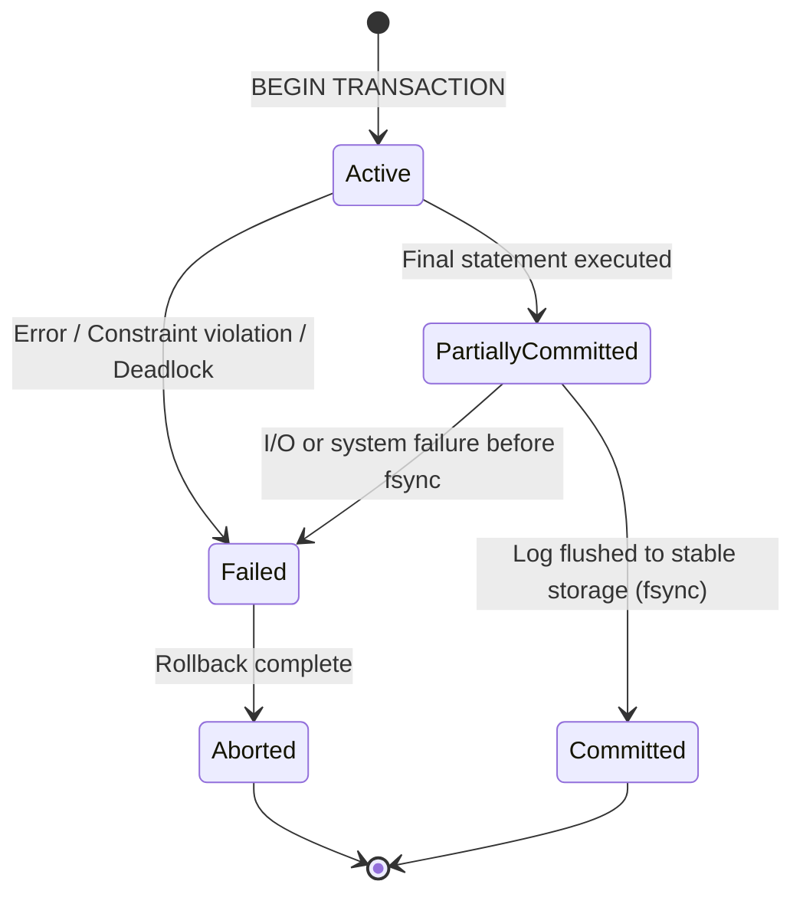
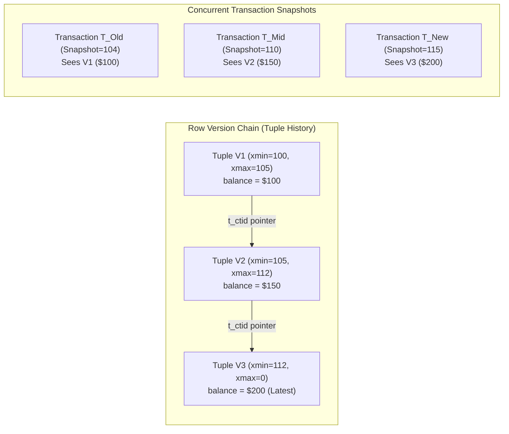
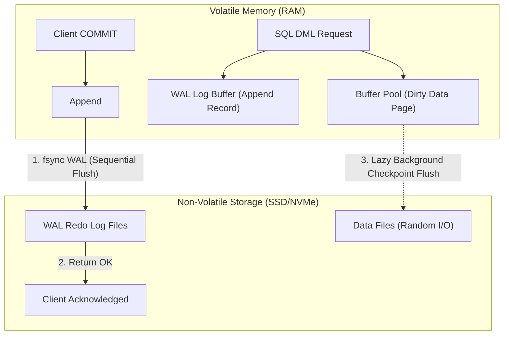
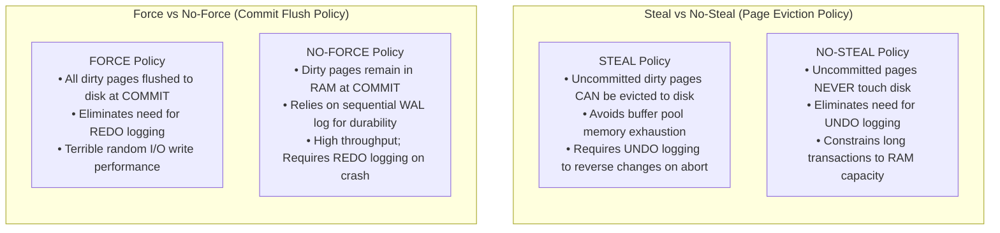
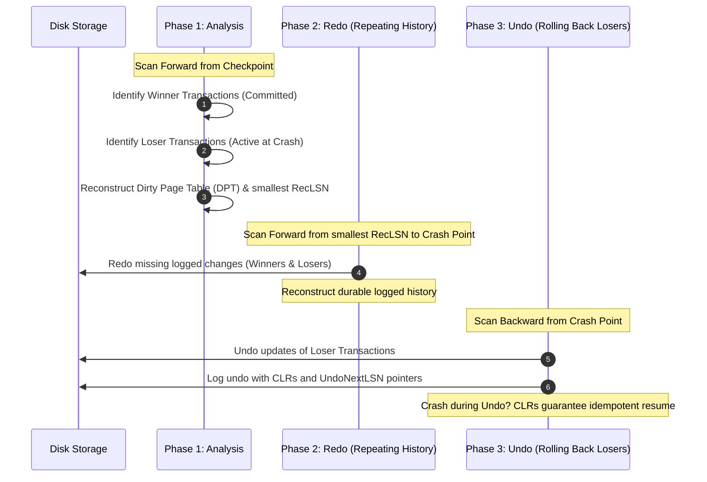

# Database Transactions, ACID States & Crash Recovery

A transaction groups database changes into one business operation, such as transferring money between two accounts. This lesson separates the guarantees your application needs from the storage mechanisms that implement them. In interviews, explain the guarantee first, then name the database and configuration before discussing WAL, MVCC, or recovery internals.

---

## 🟢 Beginner Level

### Before and After This Lesson

**Before:** You can read a basic `SELECT` and `UPDATE`; no recovery-algorithm knowledge is needed.
**After:** You can explain a half-finished transfer, distinguish atomicity from isolation, and identify what must be durable before a commit is acknowledged.
**Backend scenario:** A payment endpoint updates a balance and inserts a ledger entry. Ask what happens if either statement fails, another request races it, or the database restarts.

### The Core Problem: Why Systems Need Transactions
Consider an everyday banking funds transfer: transferring \$500 from Account A to Account B requires two distinct SQL updates: subtracting \$500 from Account A's balance and adding \$500 to Account B's balance. If the database server loses power, suffers an out-of-memory crash, or loses disk connectivity immediately after executing the first update but before executing the second, \$500 vanishes from Account A without ever appearing in Account B. 

Without transaction management, the database is left in a corrupted, half-finished state. A transaction lets the application commit the complete transfer or roll it back. Error handling matters: PostgreSQL normally leaves an explicit transaction failed after a statement error, while InnoDB can roll back only that statement for some errors. The application must handle the error and choose the correct rollback boundary instead of assuming every error automatically undoes the entire batch.

### What is a Database Transaction?
A **Transaction** is a sequence of one or more SQL operations treated as a single logical unit of work. Application developers delimit transactions using explicit control statements:

```sql
BEGIN TRANSACTION;
  UPDATE accounts SET balance = balance - 500 WHERE id = 101;
  UPDATE accounts SET balance = balance + 500 WHERE id = 202;
COMMIT;
```

Issuing `ROLLBACK` discards the transaction's database changes. InnoDB uses undo records to restore earlier row values; PostgreSQL makes aborted row versions invisible and later reclaims them. Neither approach unsends an email or reverses a remote payment, so external effects need an outbox or another explicit coordination strategy.

### The Four ACID Properties Demystified
The foundational contract of any relational database management system is encapsulated by the **ACID** properties:

1. **Atomicity ("All or Nothing")**: Committing publishes the transaction's changes as one unit; rolling back discards them. Undo records or row-version visibility can implement this guarantee, depending on the engine. Sequence counters and external side effects are not necessarily rolled back.
2. **Consistency ("Preserving Invariants")**: A correct transaction preserves business rules, such as keeping a transfer's total balance unchanged. The database enforces declared constraints; application code must encode rules the schema cannot express. ACID consistency differs from CAP consistency, which concerns linearizable behavior across a distributed system.
3. **Isolation ("Controlling Concurrent Access")**: The isolation level defines which effects of concurrent transactions are visible. Serializable execution behaves like some sequential order; weaker levels intentionally permit certain anomalies. Locks, MVCC snapshots, and conflict detection provide different implementations.
4. **Durability ("Surviving Supported Failures")**: With durable commit settings, success means the required log records reached stable storage. This relies on storage honoring flush requests; asynchronous commit weakens the guarantee. Local durability alone does not protect against losing the disk or an asynchronous-replication failover.

### Transaction States and the Lifecycle State Machine
The following textbook state machine assumes synchronous durable commit. Actual engine states and error transitions differ; asynchronously acknowledged commits can return success before their WAL is durable.


```mermaid
stateDiagram-v2
    [*] --> Active: BEGIN TRANSACTION
    Active --> PartiallyCommitted: Final statement executed
    Active --> Failed: Error / Constraint violation / Deadlock
    PartiallyCommitted --> Committed: Log flushed to stable storage (fsync)
    PartiallyCommitted --> Failed: I/O or system failure before fsync
    Failed --> Aborted: Rollback complete
    Aborted --> [*]
    Committed --> [*]
```

1. **Active**: The initial state where the transaction begins executing SQL statements, reading pages into the buffer pool and generating the engine's required recovery records.
2. **Partially Committed**: The final statement has finished, but the durable commit boundary has not been reached. Some dirty pages or earlier log records may already be on disk; that does not make the transaction committed. After a crash, the engine uses durable transaction status to decide visibility or rollback.
3. **Committed**: In this synchronous-commit model, the commit record and preceding required log records have reached stable storage. Recovery can preserve the transaction even if its data pages are still buffered.
4. **Failed**: An internal execution error, dead-lock victim selection, query timeout, or hardware fault interrupted processing while in the Active or Partially Committed state.
5. **Aborted**: The database engine has finished executing the rollback routine, reversing all intermediate changes and releasing held resource locks.

### Autocommit, Explicit Transactions, and Savepoints
Every SQL query executes within a transactional context:
- **Autocommit Mode**: By default, relational databases like MySQL and PostgreSQL run with autocommit enabled, wrapping each individual query in an implicit transaction that commits immediately. Multi-statement business workflows left in autocommit mode sacrifice cross-query atomicity.
- **Explicit Transactions**: Explicitly declaring `BEGIN` (or `START TRANSACTION`) and `COMMIT` groups arbitrary numbers of statements into an atomic envelope.
- **Savepoints**: Savepoints establish intermediate checkpoints inside a long-running transaction, allowing partial rollback without abandoning the entire transaction's earlier progress:

```sql
BEGIN;
  INSERT INTO orders (id, customer_id, total) VALUES (401, 88, 120.00);
  SAVEPOINT payment_attempt;
  UPDATE customer_wallet SET balance = balance - 120.00 WHERE customer_id = 88;
  -- Application detects failure; UPDATE alone need not reject a negative balance:
  ROLLBACK TO SAVEPOINT payment_attempt;
  -- Order insert is preserved; proceed with alternate payment
  INSERT INTO pending_invoices (order_id, amount) VALUES (401, 120.00);
COMMIT;
```

### Concurrency Anomalies: The Vocabulary of Isolation
When multiple transactions access shared records simultaneously without total serial ordering, several well-defined concurrency anomalies can emerge:

| Anomaly | Short Definition | Concrete Scenario |
|---|---|---|
| **Dirty Read** | Reading uncommitted modifications written by another concurrent transaction. | Transaction $T_1$ updates balance to \$800; $T_2$ reads \$800; $T_1$ subsequently rolls back to \$500. $T_2$ operated on invalid phantom data. |
| **Non-Repeatable Read (Fuzzy Read)** | Re-reading the exact same row within a transaction returns different values because a concurrent transaction modified and committed that row. | $T_1$ reads row $X = 100$; $T_2$ updates $X = 200$ and commits; $T_1$ reads row $X$ again and receives $200$. |
| **Phantom Read** | Re-executing a range query within a transaction returns a different set of matching rows because a concurrent transaction inserted or deleted qualifying rows. | $T_1$ executes `SELECT COUNT(*) WHERE age > 30` and gets 12; $T_2$ inserts a new 35-year-old user and commits; $T_1$ re-runs the count and gets 13. |
| **Lost Update** | Two transactions simultaneously read the same initial value and compute updates; the later commit overwrites the earlier commit without incorporating its changes. | Both $T_1$ and $T_2$ read balance \$100; $T_1$ writes $\$100 - \$30 = \$70$; $T_2$ writes $\$100 - \$40 = \$60$; final balance is \$60 instead of \$30. |
| **Write Skew** | Two concurrent transactions evaluate disjoint rows based on overlapping integrity rules, each making changes that individually look valid but jointly violate the global invariant. | Two on-call doctors simultaneously request leave when the hospital requires $\ge 1$ doctor active; both see 2 active doctors and both take leave, leaving 0 doctors on duty. |

---

## 🟡 Intermediate Level

### SQL Isolation Levels vs Anomaly Matrix
The ANSI SQL-92 standard formalized four classic isolation levels to balance concurrency performance against data consistency. Modern storage engines expand this with Snapshot Isolation:

| Isolation Level | Dirty Read | Non-Repeatable Read | Phantom Read | Lost Update | Write Skew |
|---|---|---|---|---|---|
| **READ UNCOMMITTED** | Allowed | Allowed | Allowed | Allowed | Allowed |
| **READ COMMITTED** | Prevented | Allowed | Allowed | Allowed | Allowed |
| **REPEATABLE READ** | Prevented | Prevented | Engine-Specific | Engine-Specific* | May occur |
| **SNAPSHOT ISOLATION** | Prevented | Prevented | Prevented | Prevented | Allowed |
| **SERIALIZABLE** | Prevented | Prevented | Prevented | Prevented | Prevented |

This is a teaching comparison, not a portable contract for every engine. PostgreSQL treats READ UNCOMMITTED as READ COMMITTED. Snapshot Isolation here assumes write-conflict detection; stronger guarantees require an engine-specific check.

*Note: In PostgreSQL REPEATABLE READ (implemented via Snapshot Isolation), in-place lost update attempts trigger a serialization abort (`ERROR: could not serialize access due to concurrent update`). In MySQL InnoDB REPEATABLE READ, plain `SELECT` is protected by MVCC snapshots, but raw `UPDATE` performs a locking "current read", which can still overwrite concurrent changes unless explicit `SELECT ... FOR UPDATE` row locks or atomic expressions are used.*

### Concrete Anomaly Traces with Worked Math

#### 1. Lost Update Under READ COMMITTED
Assume Account 1 starts with a verified balance of \$100. Two concurrent client requests $T_1$ (deducting \$40) and $T_2$ (deducting \$70) arrive concurrently at the application layer:

```sql
-- SESSION T1                                   -- SESSION T2
BEGIN;                                          BEGIN;
SELECT balance FROM accounts WHERE id = 1;      SELECT balance FROM accounts WHERE id = 1;
-- T1 reads balance = 100                        -- T2 reads balance = 100

-- T1 computes 100 - 40 = 60 in memory
UPDATE accounts SET balance = 60 WHERE id = 1;
COMMIT; -- Disk balance is now 60

                                                -- T2 computes 100 - 70 = 30 from stale balance
                                                UPDATE accounts SET balance = 30 WHERE id = 1;
                                                COMMIT; -- Overwrites balance with 30!
```
*Result*: The final balance in the database is \$30. The \$40 deduction made by $T_1$ has been completely destroyed. The correct final balance should have been $\$100 - \$40 - \$70 = -\$10$.

*Remediation Strategies*:
1. **Atomic In-Database Arithmetic**: `UPDATE accounts SET balance = balance - 40 WHERE id = 1;` forces the engine to apply the mutation to the latest committed value under a brief row-exclusive lock.
2. **Pessimistic Locking**: Executing `SELECT balance FROM accounts WHERE id = 1 FOR UPDATE;` acquires an exclusive row lock immediately, forcing Session $T_2$ to block until $T_1$ commits.
3. **Optimistic Locking with Versioning**: Adding a `version` column and checking `WHERE id = 1 AND version = :v` aborts $T_2$ when it detects that $T_1$ incremented the version counter.

#### 2. Write Skew: The Classic Doctor On-Call Problem
Assume a hospital table `doctors` has two records: Dr. Alice (`is_on_call = TRUE`) and Dr. Bob (`is_on_call = TRUE`). The hospital rule states: "At least one doctor must remain on call at all times."

```sql
-- SESSION T1 (Dr. Alice requests off)           -- SESSION T2 (Dr. Bob requests off)
BEGIN;                                          BEGIN;
SELECT COUNT(*) FROM doctors                    SELECT COUNT(*) FROM doctors
WHERE is_on_call = TRUE;                        WHERE is_on_call = TRUE;
-- Alice sees 2 doctors on call                  -- Bob sees 2 doctors on call

-- Invariant check passes (2 >= 2)               -- Invariant check passes (2 >= 2)
UPDATE doctors SET is_on_call = FALSE           UPDATE doctors SET is_on_call = FALSE
WHERE name = 'Alice';                           WHERE name = 'Bob';
COMMIT;                                         COMMIT;
```
*Result*: Neither session modified the row the other session touched, so row-level locks and Snapshot Isolation first-committer-wins rules find no conflict. However, the final database state has 0 doctors on call, violating the global invariant. Serializable isolation must prevent both incompatible commits. PostgreSQL SSI can detect dangerous read-write dependencies and abort a transaction; a locking implementation may instead block a conflicting operation before it runs.

### Multi-Version Concurrency Control (MVCC) Mechanisms
To reduce contention between ordinary snapshot reads and writes, modern relational engines implement **Multi-Version Concurrency Control (MVCC)**. Under MVCC:
> **Useful MVCC model:** Ordinary snapshot reads usually avoid waiting for row updates. Locking reads, schema changes, and writer-writer conflicts can still block.

Instead of locking data rows during read queries, the database creates a new physical version of a row whenever an `UPDATE` occurs, keeping older versions in an undo segment (InnoDB) or in-place table pages (Postgres). 


```mermaid
flowchart LR
    subgraph RowEvolution["Row Version Chain (Tuple History)"]
        V1["Tuple V1 (xmin=100, xmax=105)<br/>balance = $100"] 
        V2["Tuple V2 (xmin=105, xmax=112)<br/>balance = $150"]
        V3["Tuple V3 (xmin=112, xmax=0)<br/>balance = $200 (Latest)"]
        V1 -->|"t_ctid pointer"| V2
        V2 -->|"t_ctid pointer"| V3
    end

    subgraph Readers["Concurrent Transaction Snapshots"]
        T_Read["Transaction T_Old (Snapshot=104)<br/>Sees V1 ($100)"]
        T_Mid["Transaction T_Mid (Snapshot=110)<br/>Sees V2 ($150)"]
        T_New["Transaction T_New (Snapshot=115)<br/>Sees V3 ($200)"]
    end
```

- In **PostgreSQL**, tuple headers and transaction status determine visibility. A snapshot includes transaction-ID boundaries and transactions still in progress; it is not just a number to compare with `xmin`. In this simplified diagram, assume transactions 100, 105, and 112 commit in that order before the respective later snapshots, with no other concurrent transactions.
- Aborting a PostgreSQL update leaves the old version visible and the aborted new version invisible; cleanup can reclaim the latter later. This differs from restoring a before-image through an InnoDB undo record.
- In **MySQL InnoDB**, modified row versions are recorded in an **Undo Log Segment**. Consistent reads use the clustered record and its `DB_ROLL_PTR` undo chain to reconstruct a version visible to the read view; a secondary-index lookup may need to consult that clustered record.

### Write-Ahead Logging (WAL): The Mechanics of Durability
Relational databases decouple in-memory modifications from physical data file writes to maximize throughput. When a transaction updates a row, writing the modified 8 KB or 16 KB data page directly to random disk sectors is prohibitively slow. 

Instead, engines employ the **Write-Ahead Logging (WAL)** protocol:
> **The WAL Invariant**: Log records describing a database change MUST be flushed to non-volatile storage BEFORE the corresponding dirty data page in the buffer pool is permitted to overwrite disk storage. With synchronous durable commit, the commit record and preceding required records must also be flushed before success is returned. Asynchronous commit changes acknowledgement timing, not the log-before-data ordering rule.


```mermaid
flowchart TD
    subgraph RAM["Volatile Memory (RAM)"]
        ClientReq["SQL DML Request"] --> BP["Buffer Pool (Dirty Data Page)"]
        ClientReq --> WALB["WAL Log Buffer (Append Record)"]
        CommitReq["Client COMMIT"] --> CommitRec["Append <COMMIT LSN=105>"]
    end
    
    subgraph Storage["Non-Volatile Storage (SSD/NVMe)"]
        CommitRec -->|"1. fsync WAL (Sequential Flush)"| DiskWAL["WAL Redo Log Files"]
        DiskWAL -->|"2. Return OK"| ClientAck["Client Acknowledged"]
        BP -.->|"3. Lazy Background Checkpoint Flush"| DiskData["Data Files (Random I/O)"]
    end
```

Sequential WAL writes avoid synchronously flushing every modified data page at commit. The benefit depends on workload, storage, and batching; no fixed latency multiplier applies to every system.

### Anatomy of a Log Record and Log Sequence Numbers (LSN)
A **Log Sequence Number (LSN)** orders log records. PostgreSQL uses a position in its logical WAL byte stream; this example uses small integers for readability. Record formats and LSN representations differ between engines.

An illustrative ARIES-style update record can contain:
- `LSN`: Unique identifier of this log entry.
- `PrevLSN`: Back-pointer to the previous LSN generated by the same transaction (forms an undo chain).
- `TxnID`: Identifier of the transaction executing the change.
- `Type`: Record type (`BEGIN`, `UPDATE`, `INSERT`, `DELETE`, `ABORT`, `COMMIT`, `CLR`).
- `PageID`: Physical identifier of the affected data page on disk.
- `Offset`: Byte offset within the page where modification occurred.
- `Undo Data (Before Image)`: The original row data before change (used during rollback).
- `Redo Data (After Image)`: The new row data after change (used during crash recovery replay).

In this ARIES page-recovery model, a data page maintains a `pageLSN` indicating its most recent logged update. During recovery, comparing the log record's `LSN` against the page's `pageLSN` allows the engine to instantly determine whether a change is already present on disk: if $\text{pageLSN} \ge \text{recordLSN}$, the change has already been applied and redo is skipped.

### Shadow Paging vs Write-Ahead Logging
Shadow paging keeps an older page mapping and writes changed pages to new locations. Commit publishes a new root mapping after the required pages are durable. This avoids undoing overwritten data, but introduces allocation, fragmentation, and concurrency trade-offs.
WAL supports buffered in-place page updates and can batch durable log flushes. Copy-on-write designs remain useful; neither technique is universally obsolete or universally faster.

### Group Commit and Storage Flush Controls
**Group Commit** lets several transactions share a durable log flush. Each transaction may return durable success only when the flushed log position covers its own required commit record. A commit that arrives after the flush's covered position needs a later flush.

For a simplified calculation, assume a flush costs 1 ms and ignore all other work. One serial transaction per flush gives approximately 1,000 commits/second; covering 20 commits per flush gives a theoretical 20,000. These are arithmetic examples, not measured SSD performance or promised throughput.

| Engine Setting | Value | Commit behavior | Crash-loss interpretation |
|---|---|---|---|
| MySQL `innodb_flush_log_at_trx_commit` | `1` (Default) | Write and flush redo for each commit, potentially sharing work through batching. | Supports durable commits when storage honors flushes; binary logging also needs appropriate `sync_binlog`. |
| MySQL `innodb_flush_log_at_trx_commit` | `2` | Write redo at commit; flush periodically. | Unflushed recent commits can be lost. The default one-second interval is not a strict maximum or a process-crash guarantee. |
| MySQL `innodb_flush_log_at_trx_commit` | `0` | Write and flush redo periodically. | Recent commits can be lost after a process, OS, or power failure; interval and scheduling matter. |
| PostgreSQL `synchronous_commit` | `on` (Default) | Wait for local durable WAL; configured synchronous standbys can add waits. | Supports local crash durability with `fsync` enabled and reliable storage; failover guarantees require separate replication analysis. |
| PostgreSQL `synchronous_commit` | `off` | Return success before the commit WAL flush. | Recent commits may be lost after a database or OS crash. The documented window depends on `wal_writer_delay`, not a universal fixed millisecond value. |

See the [MySQL durability settings](https://dev.mysql.com/doc/refman/8.4/en/innodb-parameters.html#sysvar_innodb_flush_log_at_trx_commit) and [PostgreSQL asynchronous commit](https://www.postgresql.org/docs/18/wal-async-commit.html) for the precise configuration contracts. Asynchronous commit is also different from disabling `fsync`, which can risk corruption.

### Checkpoint Mechanisms: Naive vs Fuzzy Checkpoints
Checkpoints record a recovery boundary so startup need not replay from the database's creation. They do not by themselves guarantee old WAL can be recycled: archiving and replication may still require it.

- **Naive (Quiescent) Checkpoint:** Stop updates, flush the relevant dirty pages, record the boundary, and resume work. This makes recovery reasoning simple but interrupts traffic.
- **ARIES Fuzzy Checkpoint:** Record active transactions and a Dirty Page Table (DPT) while transactions continue. Analysis scans forward from the checkpoint information; redo begins at the minimum reconstructed `RecLSN`, which can precede the checkpoint.
- **Engine distinction:** PostgreSQL checkpoints flush relevant dirty buffers and establish a redo start point; do not assume it uses the ARIES ATT/DPT record format. Background work avoids a global transaction freeze but still competes for I/O and internal synchronization.

---

## 🔴 Expert Level

### Buffer Pool Management Policies: Steal/No-Steal and Force/No-Force
The next diagram describes the classic recovery model for **in-place overwrites**. In that model, STEAL needs undo information and NO-FORCE needs redo information. MVCC engines can combine page flushing with different rollback mechanisms, so these labels do not prove that every engine implements ARIES undo.


```mermaid
flowchart TD
    subgraph StealPolicy["Steal vs No-Steal (Page Eviction Policy)"]
        direction TB
        Steal["STEAL Policy<br/>• Uncommitted dirty pages CAN be evicted to disk<br/>• Avoids buffer pool memory exhaustion<br/>• Requires UNDO logging to reverse changes on abort"]
        NoSteal["NO-STEAL Policy<br/>• Uncommitted pages NEVER touch disk<br/>• Eliminates need for UNDO logging<br/>• Constrains long transactions to RAM capacity"]
    end

    subgraph ForcePolicy["Force vs No-Force (Commit Flush Policy)"]
        direction TB
        Force["FORCE Policy<br/>• All dirty pages flushed to disk at COMMIT<br/>• Eliminates need for REDO logging<br/>• Terrible random I/O write performance"]
        NoForce["NO-FORCE Policy<br/>• Dirty pages remain in RAM at COMMIT<br/>• Relies on sequential WAL log for durability<br/>• High throughput; Requires REDO logging on crash"]
    end
```

| Policy | What it permits | Consequence in the classic in-place model |
|---|---|---|
| **STEAL** | Flush a page containing an uncommitted overwrite. | Undo information is needed if the transaction aborts. |
| **NO-STEAL** | Keep uncommitted overwrites away from the durable data pages. | Avoid crash undo for those pages; memory or private staging needs can increase. |
| **FORCE** | Flush every page changed by a transaction before commit completes. | Avoid missing committed data-page updates on crash, but pay data-write latency. |
| **NO-FORCE** | Let committed page changes remain buffered. | Durable recovery information must reconstruct missing page updates. |

STEAL + NO-FORCE is an important textbook combination, not a census of all database designs. PostgreSQL can flush pages containing uncommitted tuple versions and use transaction visibility to reject aborted versions; it does not restore every aborted row through a classic ARIES undo pass.

### ARIES Crash Recovery: 3-Phase Execution Model
**ARIES** is an influential WAL recovery algorithm by C. Mohan and colleagues. Its analysis, redo, and undo phases are useful interview concepts, but this trace is not PostgreSQL's recovery implementation. Read the [original ARIES paper](https://people.eecs.berkeley.edu/~brewer/cs262/Aries.pdf) for the algorithm's assumptions.


```mermaid
sequenceDiagram
    autonumber
    participant D as Disk Storage
    participant A as Phase 1: Analysis
    participant R as Phase 2: Redo (Repeating History)
    participant U as Phase 3: Undo (Rolling Back Losers)

    Note over A: Scan Forward from Checkpoint
    A->>A: Identify Winner Transactions (Committed)
    A->>A: Identify Loser Transactions (Active at Crash)
    A->>A: Reconstruct Dirty Page Table (DPT) & smallest RecLSN

    Note over R: Scan Forward from smallest RecLSN to Crash Point
    R->>D: Redo missing logged changes (Winners & Losers)
    Note over R: Reconstruct durable logged history

    Note over U: Scan Backward from Crash Point
    U->>D: Undo updates of Loser Transactions
    U->>D: Log undo with CLRs and UndoNextLSN pointers
    Note over U: Crash during Undo? CLRs guarantee idempotent resume
```

### Complete Worked ARIES Recovery Trace
To understand ARIES deterministically, trace the following concrete log sequence. Assume an illustrative checkpoint at LSN 100 with empty active-transaction and dirty-page tables. All records through LSN 108 survive on disk, but none of the example data-page changes do; real checkpoints can span multiple records. Transaction $T_1$ commits; Transaction $T_2$ is still active when power abruptly fails:

| LSN | PrevLSN | TxnID | Type | PageID | Undo (Old Image) | Redo (New Image) | Description |
|---|---|---|---|---|---|---|---|
| **100** | 0 | - | `CHECKPOINT` | - | - | - | Fuzzy checkpoint with empty DPT |
| **101** | 0 | $T_1$ | `BEGIN` | - | - | - | $T_1$ starts |
| **102** | 101 | $T_1$ | `UPDATE` | $P_1$ | $A = 100$ | $A = 150$ | $T_1$ updates $P_1$ |
| **103** | 0 | $T_2$ | `BEGIN` | - | - | - | $T_2$ starts |
| **104** | 103 | $T_2$ | `UPDATE` | $P_2$ | $B = 500$ | $B = 520$ | $T_2$ updates $P_2$ |
| **105** | 102 | $T_1$ | `UPDATE` | $P_3$ | $C = 70$ | $C = 75$ | $T_1$ updates $P_3$ |
| **106** | 105 | $T_1$ | `COMMIT` | - | - | - | $T_1$ commits (fsync complete) |
| **107** | 104 | $T_2$ | `UPDATE` | $P_4$ | $D = 900$ | $D = 850$ | $T_2$ updates $P_4$ |
| **108** | 107 | $T_2$ | `UPDATE` | $P_2$ | $B = 520$ | $B = 545$ | $T_2$ updates $P_2$ |
| **CRASH**| - | - | - | - | - | - | Power cut! Server restarts |

#### Step 1: Phase 1 — Analysis Pass
- The recovery manager starts reading the log forward from LSN 100.
- When LSN 106 (`T1 COMMIT`) is scanned, $T_1$ is added to the **Winner Set**: $\{T_1\}$.
- When the log ends at LSN 108 without a commit record for $T_2$, $T_2$ is placed in the **Loser Set**: $\{T_2\}$.
- The **Dirty Page Table (DPT)** is reconstructed:
  - $P_1 \to \text{RecLSN } 102$
  - $P_2 \to \text{RecLSN } 104$
  - $P_3 \to \text{RecLSN } 105$
  - $P_4 \to \text{RecLSN } 107$
- Smallest $\text{RecLSN} = 102$.

#### Step 2: Phase 2 — Redo Pass ("Repeating History")
- Scanning forward from the minimum RecLSN ($102$), the engine checks relevant records for both winner and loser transactions in log order. The DPT and `pageLSN` tests skip changes already present; under our stated assumptions, each listed change needs redo:
  - LSN 102: Reapply $P_1.A = 150$.
  - LSN 104: Reapply $P_2.B = 520$.
  - LSN 105: Reapply $P_3.C = 75$.
  - LSN 107: Reapply $P_4.D = 850$.
  - LSN 108: Reapply $P_2.B = 545$.
- *Why repeat history for uncommitted loser $T_2$?* Because STEAL can put some uncommitted changes on disk. Redo reconstructs the surviving logged history before undo removes loser effects; it does not recreate lost RAM buffers or every unflushed operation.

#### Step 3: Phase 3 — Undo Pass (Rolling Back Losers with CLRs)
- The engine scans backward from LSN 108, undoing changes belonging exclusively to loser transaction $T_2$:
  1. At LSN 108 ($P_2.B = 545 \to 520$), the engine writes a **Compensation Log Record (CLR)**:
     - `LSN 109: CLR for LSN 108, UndoNextLSN = 107, Page P2, Restores B = 520`.
  2. At LSN 107 ($P_4.D = 850 \to 900$), the engine writes:
     - `LSN 110: CLR for LSN 107, UndoNextLSN = 104, Page P4, Restores D = 900`.
  3. At LSN 104 ($P_2.B = 520 \to 500$), the engine writes:
     - `LSN 111: CLR for LSN 104, UndoNextLSN = 103, Page P2, Restores B = 500`.
  4. Follow the remaining chain to the non-update `BEGIN` at LSN 103, then its `PrevLSN = 0`. Rollback is complete; append an illustrative `END` record for $T_2$, rather than treating an abort-start record as transaction completion.
- **Idempotency Guarantee**: If the system crashes *again* while executing Undo (e.g., at LSN 110), the restarted recovery engine reads CLRs 109 and 110 during Redo and uses their `UndoNextLSN` pointers to resume undo. Replaying a CLR if its page change is missing restores the already-recorded compensation; the CLR itself is never undone.

### Engine-Specific Internals: PostgreSQL vs MySQL InnoDB
- **PostgreSQL**: 
  - WAL segments default to 16 MB in `pg_wal/`; `initdb --wal-segsize` can select another supported size.
  - Transaction state is tracked in 2-bit commit status flags inside `pg_xact/` (`IN_PROGRESS`, `COMMITTED`, `ABORTED`, `SUB_COMMITTED`).
  - To prevent torn pages (where only part of a database page reaches storage), PostgreSQL logs an entire 8 KB page image in WAL on the first modification after a checkpoint (`full_page_writes = on`).
- **MySQL InnoDB**:
  - Manages redo log files within the capacity configured by `innodb_redo_log_capacity`; file organization is version-specific.
  - Employs a dedicated **Doublewrite Buffer** on storage: before writing dirty pages to actual data files, InnoDB writes them sequentially to contiguous doublewrite blocks. If an OS crash tears a page, InnoDB restores the pristine page from the doublewrite buffer and resumes recovery.

### Production Failure Modes & Operational Gotchas
1. **Torn Pages:** A page write may be only partly persisted when the machine fails. PostgreSQL full-page WAL images and InnoDB doublewrite protection address this; page size and device atomic-write guarantees are separate facts.
2. **Acknowledged but Unflushed Commits:** Asynchronous settings can lose recent successful commits. Measure the configured policy and storage behavior instead of assuming one exact loss window for every engine.
3. **Old Row Versions vs Retained WAL:** Long PostgreSQL snapshots can prevent vacuum cleanup and create table bloat. Replication slots, failed archiving, and retention configuration can keep WAL; investigate these separately. InnoDB long read views can likewise delay undo purge.
4. **Error Boundaries:** InnoDB deadlock victims lose the whole transaction, but a lock-wait timeout normally rolls back only the waiting statement unless configured otherwise. Before retrying a business operation, explicitly end the failed attempt and protect external effects against duplication.

### A Commit Response Can Be Ambiguous
+
+Suppose the database commits a payment, but the connection breaks before the application receives the response. A timeout means the application does not know the outcome; it does not prove rollback.
+Use a business idempotency key with a uniqueness constraint and reconcile the recorded outcome before retrying. Retrying blindly can create a second payment even when every individual transaction is ACID.
+An outbox can coordinate a durable database change with later message publication, but the consumer still needs duplicate-safe processing. Explain the transaction boundary and the external-effect boundary separately in an interview.
+
+---
+
+### Common Misconceptions

1. **"Executing COMMIT writes data pages directly to the database tables on disk."**
   *Correction*: A synchronous durable commit normally waits for the required log records, not every modified data page. Pages can be flushed before or after commit by checkpoints or buffer replacement; neither a fixed delay nor a log flush is guaranteed by asynchronous acknowledgement.
2. **"REPEATABLE READ completely prevents Phantom Reads in all databases."**
   *Correction*: Under the strict ANSI SQL-92 standard, Repeatable Read allows phantom reads. PostgreSQL avoids phantoms at this level by implementing Snapshot Isolation, while MySQL InnoDB uses Next-Key (index range) locking for locking reads.
3. **"ACID Consistency is the same as CAP Theorem Consistency."**
   *Correction*: ACID Consistency means transactions preserve internal schema rules and declarative integrity constraints ($A + B = C$). CAP consistency refers to linearizability: completed operations behave as one copy in an order consistent with real-time ordering. It does not mean replicas physically change at the same instant.
4. **"If the database crashes during a transaction, incomplete changes are discarded immediately upon reboot."**
   *Correction*: In ARIES, redo applies missing changes from surviving log history, including loser changes, before undo reverses losers. PostgreSQL instead replays WAL and uses transaction visibility; the ARIES sequence is not a universal reboot recipe.

---

### Interview Questions

**Q1. Why must the Write-Ahead Log (WAL) record be flushed to disk before the dirty data page is written?** `[easy]`
Write-ahead logging requires a change's log record to be durable before the dirty page containing that change is flushed. After a crash, recovery can then reconstruct or reverse changes even if data pages reached storage in a different order. If the page preceded its log record, disk could contain a change recovery has no durable record for; acknowledged commit durability also depends on the configured commit-record flush policy.

**Answer rubric**
- **Say it:** Flush the WAL record before a dirty data page that depends on it reaches disk.
- **Mechanism:** Recovery needs a durable record of a page change before it can safely redo or undo that change after a crash.
- **Example:** A committed update is logged durably but its data page is missing; redo restores the page change after a crash.
- **Limit:** The rule orders log and page writes; commit durability also requires the commit record to meet the configured flush policy.
- **Watch for:** Do not say every modified data page must be flushed before `COMMIT` returns.
- **Follow-up:** What happens if the WAL record is durable but the changed data page is not?

**Q2. In which transaction state have all SQL statements finished executing but changes are not yet durable?** `[easy]`
In the textbook synchronous-commit model, it is **Partially Committed**. The final statement has finished, but durable commit processing has not completed; some earlier pages or log records may already be on disk. Recovery relies on durable transaction status, and asynchronous acknowledgement must be distinguished from this model.

**Q3. What is the fundamental difference between a Dirty Read and a Phantom Read?** `[easy]`
A Dirty Read occurs when a transaction reads uncommitted row modifications from another transaction that might subsequently abort. A Phantom Read occurs when a transaction executes a range query (e.g., `WHERE status = 'ACTIVE'`) and re-executes the exact same query later, finding newly inserted rows that were committed by another transaction in the interim. The practical distinction is what must stay invisible or stable: isolation rules prevent uncommitted writes from being read, while repeated predicate queries need a stable result set. Engines may use locking, MVCC snapshots, or serializable conflict detection; for example, PostgreSQL's Repeatable Read prevents phantoms without taking blocking range locks for every read.

**Answer rubric**
- **Say it:** A dirty read sees uncommitted data; a phantom is a changed result set on a repeated predicate query.
- **Mechanism:** Explain the visibility rule for uncommitted versions and the stability of a range or predicate result across reads.
- **Example:** One transaction inserts a matching row and commits between another transaction's two `WHERE status = 'ACTIVE'` queries.
- **Limit:** Prevention is engine- and isolation-level-specific: MVCC snapshots, locks, or serializable conflict checks may be involved.
- **Watch for:** Do not claim every engine must take a blocking range lock to prevent a phantom.
- **Follow-up:** Why can PostgreSQL Repeatable Read prevent phantoms yet still allow a serialization anomaly?

**Q4. What is the difference between the STEAL and NO-STEAL buffer pool policies?** `[easy]`
STEAL permits flushing pages containing uncommitted changes, while NO-STEAL keeps those changes away from durable data pages until commit. For classic in-place overwrites, STEAL requires undo information and NO-STEAL avoids that crash-undo requirement. Do not infer a universal undo-log implementation: PostgreSQL can flush uncommitted tuple versions and rely on transaction visibility rather than ARIES row undo.

**Q5. Why does the ARIES REDO phase repeat history by replaying uncommitted loser transactions?** `[medium]`
STEAL means disk may contain changes from transactions that never committed. ARIES redo applies missing updates from the surviving log, including loser updates and compensation records, using dirty-page and pageLSN checks to skip work already present. Undo can then reverse the losers on that reconstructed history; this does not recreate unlogged RAM state or describe every engine's recovery algorithm.

**Q6. What are Compensation Log Records (CLRs) and why are they critical for recovery idempotency?** `[medium]`
Compensation Log Records are redo-only log entries written during the ARIES Undo phase as the engine reverses the changes of aborted loser transactions. Each CLR records the inverse operation and contains an `UndoNext` pointer directing recovery to the next un-reversed log record. If the database crashes repeatedly during recovery, the restarted engine reads the CLRs, skips already undone actions, and resumes rollback without getting stuck in an infinite undo loop.

**Q7. How does Group Commit overcome physical disk I/O limits during high-concurrency workloads?** `[medium]`
Group commit lets one durable log flush cover the required records of multiple transactions. Each caller waits until the flushed position covers its own commit record; a transaction appended beyond that position needs another flush. This amortizes storage synchronization cost, but actual throughput depends on concurrency, storage latency, and transaction work rather than a promised commits-per-second number.

**Q8. Why is Write Skew possible under Snapshot Isolation but prevented under Serializable isolation?** `[medium]`
Snapshot Isolation detects overlapping writes but can allow transactions to read a shared condition and update different rows. For example, two doctors each see another doctor on call and independently take themselves off duty, violating the cross-row rule when both commit. Serializable isolation must prevent a result inconsistent with every serial order; PostgreSQL SSI may abort one participant, whereas a locking implementation may prevent the conflicting schedule through blocking.

**Answer rubric**
- **Say it:** Snapshot Isolation can allow write skew when concurrent transactions read shared conditions but update different rows.
- **Mechanism:** Show the read dependencies, non-overlapping writes, both successful commits, and the missing serial order.
- **Example:** Two doctors each see the other on call and independently mark themselves off duty.
- **Limit:** Serializable isolation may abort one transaction, so the application needs a safe retry path.
- **Watch for:** Do not equate the absence of dirty reads or phantoms with full serializability.
- **Follow-up:** Which read-write dependency would a serializable engine need to detect?

**Q9. What specific data loss does `innodb_flush_log_at_trx_commit = 2` risk in MySQL?** `[medium]`
With setting `2`, MySQL writes redo log records at commit but normally flushes them to durable storage on a periodic schedule rather than for every transaction. An operating-system crash or power loss can therefore lose acknowledged recent commits; MySQL also cautions that an unexpected server-process exit can lose transactions in the flush interval. The interval is not an exact one-second guarantee, so use setting `1` when acknowledged commits must survive a crash.

**Q10. How does a database implement Savepoints and partial rollbacks under the hood?** `[medium]`
A savepoint marks a rollback boundary inside a transaction without making earlier changes independently durable. An ARIES-style implementation can retain a log-chain position and log compensations, while PostgreSQL implements savepoints through subtransactions and InnoDB uses undo records. The outer transaction remains active after rollback to the savepoint; lock release and non-transactional effects differ by engine, so a savepoint is not a portable promise to rewind every resource.

**Q11. Why do modern database engines use Fuzzy Checkpoints instead of Naive Checkpoints?** `[medium]`
A quiescent checkpoint simplifies recovery by stopping updates while recording a stable boundary. ARIES fuzzy checkpoints capture recovery metadata while transactions continue; analysis reconstructs the dirty-page table and redo starts from its earliest relevant RecLSN. Concurrent checkpointing reduces global pauses but can still add I/O pressure or synchronization waits, and PostgreSQL's checkpoint format should not be described as the ARIES format.

**Q12. What causes a "Torn Page" and how do PostgreSQL and MySQL InnoDB defend against it?** `[hard]`
A Torn Page occurs when a power loss or crash interrupts the writing of an 8 KB (Postgres) or 16 KB (InnoDB) database page across smaller 4 KB or 512-byte hardware disk sectors, leaving the page in a corrupted half-written state. PostgreSQL defends against this via `full_page_writes`, which writes the entire 8 KB page image to WAL on its first modification after a checkpoint so recovery can overwrite torn pages. MySQL InnoDB utilizes a physical **Doublewrite Buffer**, writing dirty pages sequentially to contiguous disk slots before writing to table files, allowing recovery to restore clean pages if a write fails.

**Q13. Scenario: A payments service returned HTTP 200, then an OOM kill or host reboot was followed by missing orders. How do you investigate before naming a cause?** `[hard]`
First establish whether only the database process died or the host rebooted, and inspect the database's durability settings and WAL or redo logs. PostgreSQL `synchronous_commit = off` can lose recently acknowledged commits after a database or operating-system crash; MySQL `innodb_flush_log_at_trx_commit = 2` may lose recent commits because redo is not flushed at each commit. A process OOM kill alone does not prove that the operating system lost its page cache, and the scenario also needs investigation of application acknowledgment order, replica reads, and storage health before one setting is named as the cause.

**Q14. Scenario: A PostgreSQL cluster has transaction stalls and a full `pg_wal` directory. How do you distinguish high WAL generation from WAL retention and remediate the cause?** `[hard]`
Do not infer a single cause from a WAL spike. Measure WAL generation and retained WAL separately: heavy writes create WAL, while a lagging replication slot, failed archiving, or configured retention can keep old segments in `pg_wal`. Inspect `pg_replication_slots.restart_lsn`, replication lag, archive status, checkpoints, and the write workload before changing any setting. A long-lived transaction can prevent vacuum from removing dead tuples and cause table bloat, but that is a separate diagnosis; terminate a session only after identifying its owner and impact. Restore the failing consumer or archive path and set a suitable `max_slot_wal_keep_size` where losing a lagging slot is an acceptable trade-off.

**Answer rubric**
- **Say it:** Separate high WAL generation from retention before naming a cause.
- **Mechanism:** Compare write rate and checkpoints with replication-slot `restart_lsn`, archive status, standby lag, and retention settings.
- **Example:** A disconnected standby's slot keeps old WAL segments even when the primary's writes are otherwise normal.
- **Limit:** Limiting slot retention can save primary disk but may force a lagging standby to be rebuilt; investigate before dropping a slot.
- **Watch for:** Do not blame a long transaction's `xmin` for WAL retention without evidence; that is more directly a vacuum-bloat clue.
- **Follow-up:** Which metric shows whether the problem is new WAL production or old WAL that cannot be recycled?

### Further Reading

- [PostgreSQL transaction isolation](https://www.postgresql.org/docs/current/transaction-iso.html) explains dirty reads, phantoms and serializable conflict detection.
- [PostgreSQL WAL settings](https://www.postgresql.org/docs/current/runtime-config-wal.html) explains durability and full-page writes.
- [PostgreSQL replication retention](https://www.postgresql.org/docs/current/runtime-config-replication.html) explains slot and WAL retention limits.
- [MySQL InnoDB durability settings](https://dev.mysql.com/doc/refman/8.4/en/innodb-parameters.html) explains redo flush policy and crash risk.
