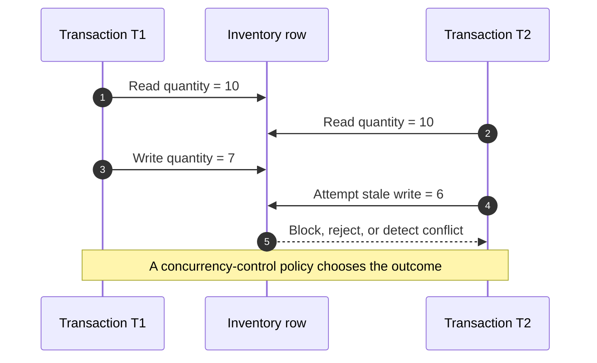
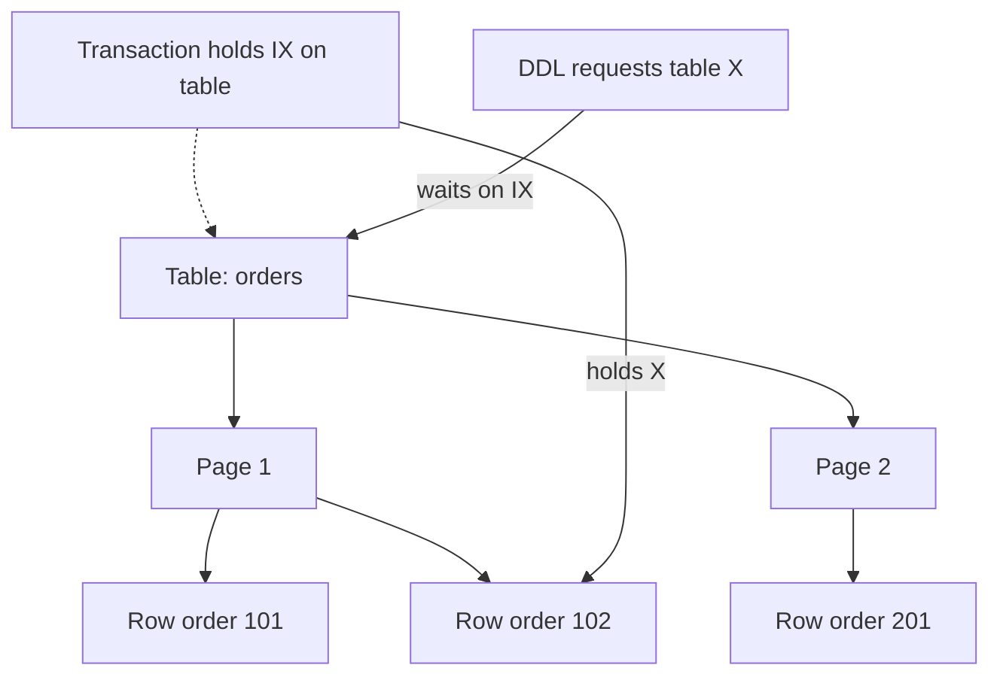
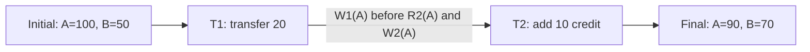
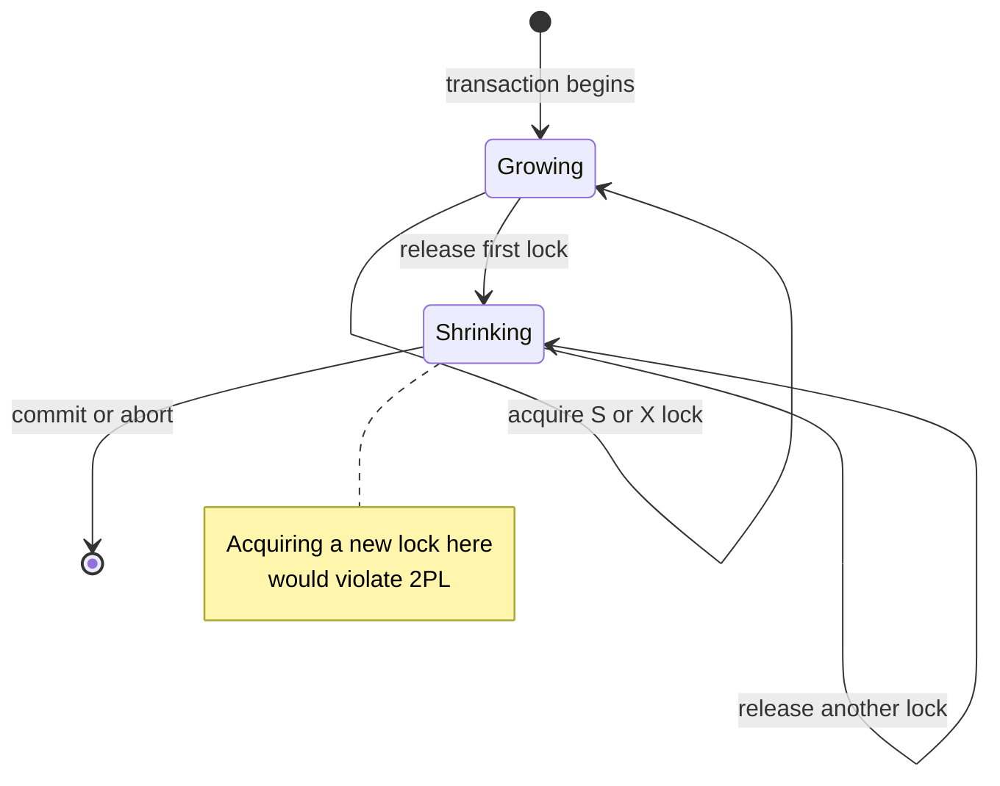
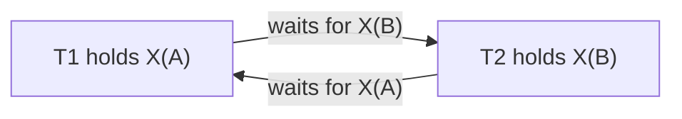
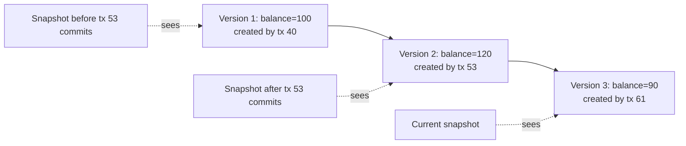
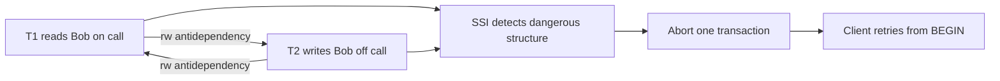

# Database Concurrency Control, Serializability, Locks, and MVCC

Concurrency control lets a database overlap thousands of transactions without turning timing accidents into corrupt business state.
It sits between query execution and storage, deciding when an operation may proceed, wait, read an older version, or abort.
Interviewers use this topic to test whether you can connect isolation guarantees to locks, schedules, deadlocks, and production retry behaviour.

---

## 🟢 Beginner Level

### Why Concurrent Transactions Need Coordination

A serial database runs one transaction to completion before starting the next.
That is easy to reason about, but it wastes CPU while one transaction waits for a page, network response, or storage flush.
Real engines therefore interleave operations from many transactions.

Interleaving is safe only when the result still matches an allowed sequential execution.
Without coordination, two requests can both read the same old value and overwrite one another.
This is the **lost update** anomaly.

Assume an inventory row starts with `quantity = 10`:

1. Transaction $T_1$ reads 10 and plans to sell 3 units.
2. Transaction $T_2$ reads 10 and plans to sell 4 units.
3. $T_1$ writes 7.
4. $T_2$ writes 6 from its stale calculation.
5. The correct quantity is $10 - 3 - 4 = 3$, but the stored value is 6.

Concurrency control prevents this outcome by blocking, validating, versioning, or aborting conflicting work.



### Transactions, Operations, and Schedules

A **transaction** is a logical unit of reads and writes that commits or aborts as one unit.
A **schedule**, also called a history, is the chronological order in which operations from concurrent transactions actually execute.

The notation below is common in interviews:

- $R_1(A)$ means transaction $T_1$ reads data item $A$.
- $W_2(B)$ means transaction $T_2$ writes data item $B$.
- $C_1$ means $T_1$ commits.
- $A_2$ means $T_2$ aborts.

A **serial schedule** contains no interleaving: all operations of $T_1$ finish before $T_2$, or vice versa.
A **serializable schedule** may interleave operations but is equivalent to some serial schedule under the selected equivalence rule.
Serializability is the correctness goal; locking and MVCC are implementation mechanisms.

### Conflicts and Anomalies

Two operations conflict when they belong to different transactions, touch the same item, and at least one writes.
Changing the order of conflicting operations can change a read value or the final database state.

| Earlier operation | Later operation | Conflict? | Reason |
|---|---|---:|---|
| $R_1(A)$ | $R_2(A)$ | No | Neither operation changes $A$ |
| $R_1(A)$ | $W_2(A)$ | Yes | The write can change what $T_1$ should observe |
| $W_1(A)$ | $R_2(A)$ | Yes | The read may observe the written value |
| $W_1(A)$ | $W_2(A)$ | Yes | Their order determines the final value |
| $W_1(A)$ | $R_2(B)$ | No | They access different items |

Common anomalies include dirty reads, non-repeatable reads, phantom reads, lost updates, and write skew.
Each isolation mechanism prevents a particular set of anomalies; no mechanism is simply “fast and safe” for every workload.

### Shared and Exclusive Locks

A **lock** reserves a logical database resource while a transaction uses it.
The two fundamental modes are:

- A **shared lock** (`S`) permits reading and can coexist with other shared locks.
- An **exclusive lock** (`X`) permits writing and conflicts with every other `S` or `X` holder.

| Requested lock | Held `S` | Held `X` |
|---|---:|---:|
| `S` | Grant | Wait |
| `X` | Wait | Wait |

If $T_1$ holds `X(A)`, another transaction cannot read or overwrite $A$ through a locking access path until $T_1$ releases it.
This protects uncommitted state, but waiting introduces latency and can create deadlocks.

### Row Locks, Table Locks, and Intention Modes

**Lock granularity** describes the size of the protected resource.
A row lock gives high concurrency but creates more lock-manager entries.
A table lock is cheap to track but blocks unrelated rows.

Hierarchical engines use **intention locks** to coordinate those levels:

- `IS` means a transaction intends to acquire shared locks below the table.
- `IX` means a transaction intends to acquire exclusive locks below the table.
- A table-wide `X` request can inspect intention modes instead of checking millions of row locks.
- `IX` is compatible with another `IX`, so unrelated row writers can proceed together.



Some engines escalate many fine-grained locks to a coarser table lock to bound memory usage.
InnoDB normally represents record locks compactly and does not perform SQL Server-style automatic row-to-table escalation.
Engine-specific behaviour matters when diagnosing unexpectedly broad blocking.

### Pessimistic and Optimistic Locking

**Pessimistic locking** assumes collisions are likely and reserves the resource before changing it.
`SELECT ... FOR UPDATE` is the familiar SQL example.
It avoids wasted work under high contention but makes transactions wait.

**Optimistic locking** assumes collisions are uncommon and validates at write time.
An application usually stores a version column:

```sql
UPDATE seats
SET owner_id = 42,
    version = version + 1
WHERE seat_id = 10
  AND version = 7;
```

If the update count is zero, another transaction changed the row after it was read.
The application must reload, recompute, and retry or report a conflict.

| Dimension | Pessimistic locking | Optimistic locking |
|---|---|---|
| Conflict point | Before or during work | At validation/write time |
| High contention | Waits but avoids repeated computation | Can collapse into retry storms |
| Low contention | Lock round trips may be unnecessary | Usually excellent throughput |
| Failure handling | Lock timeout or deadlock retry | Version-conflict retry |
| Typical use | Inventory, ledgers, hot rows | Profiles, drafts, disconnected edits |

---

## 🟡 Intermediate Level

### Conflict Serializability and Precedence Graphs

Two schedules are **conflict-equivalent** when they contain the same operations and preserve the order of every conflicting pair.
A schedule is **conflict-serializable** when it is conflict-equivalent to a serial schedule.

Use a precedence graph to test it:

1. Create one node for each transaction.
2. For every conflicting pair where $T_i$ operates before $T_j$, add edge $T_i \rightarrow T_j$.
3. If the graph is acyclic, a topological ordering gives an equivalent serial order.
4. If the graph contains a cycle, the schedule is not conflict-serializable.

Conflict serializability is conservative and efficiently testable.
The broader **view serializability** also accepts some blind-write histories, but testing it is NP-complete.
Practical protocols therefore target conflict serializability or a rigorously defined snapshot model.

### Worked Numeric Schedule: Build the Graph and Verify the Balance

Account $A$ starts at 100 and account $B$ starts at 50.
$T_1$ transfers 20 from $A$ to $B$; $T_2$ adds a 10 fee credit to $A$.
Consider this interleaved schedule:

| Step | Operation | Concrete effect |
|---:|---|---|
| 1 | $R_1(A)$ | $T_1$ reads 100 |
| 2 | $W_1(A)$ | $T_1$ writes $100 - 20 = 80$ |
| 3 | $R_2(A)$ | $T_2$ reads 80 |
| 4 | $W_2(A)$ | $T_2$ writes $80 + 10 = 90$ |
| 5 | $R_1(B)$ | $T_1$ reads 50 |
| 6 | $W_1(B)$ | $T_1$ writes $50 + 20 = 70$ |
| 7 | $C_1$ | $T_1$ commits |
| 8 | $C_2$ | $T_2$ commits |

For item $A$, $W_1(A)$ precedes both $R_2(A)$ and $W_2(A)$, producing $T_1 \rightarrow T_2$.
There is no operation by $T_2$ on $B$, so no reverse edge exists.
The graph is acyclic and its serial order is $T_1$ then $T_2$.



The numeric invariant checks out: total funds start at $100 + 50 = 150$.
The transfer preserves the total, then the credit adds 10, so the final total must be 160.
The result $90 + 70 = 160$ matches that expectation.

Now swap steps 3–4 ahead of steps 1–2.
That produces $T_2 \rightarrow T_1$ and the serial result $A = (100 + 10) - 20 = 90$; it is different history but still valid.
If a schedule creates both directions, $T_1 \rightarrow T_2 \rightarrow T_1$, it is cyclic and not conflict-serializable.

### Two-Phase Locking and Its Variants

**Two-Phase Locking (2PL)** divides each transaction into two phases:

1. During the **growing phase**, it may acquire locks but release none.
2. During the **shrinking phase**, it may release locks but acquire no new lock.

The moment a transaction has acquired its final lock is its **lock point**.
Ordering transactions by their lock points produces the equivalent serial order, which is the proof intuition for 2PL.



The variants provide different recovery properties:

| Protocol | Locks held until completion | Serializability | Deadlock possible | Cascading aborts |
|---|---|---:|---:|---:|
| Basic 2PL | None required | Yes | Yes | Possible |
| Strict 2PL | All `X` locks | Yes | Yes | Prevented |
| Rigorous 2PL | All `S` and `X` locks | Yes | Yes | Prevented |
| Conservative 2PL | Acquires full set before execution | Yes | No | Prevented when locks are retained |

Strict 2PL holds every exclusive lock until `COMMIT` or `ROLLBACK`.
Therefore another transaction cannot read or overwrite an uncommitted write, preventing dirty reads and cascading aborts.
Rigorous 2PL also retains shared locks, making serialization order match commit order at the cost of longer read blocking.

### SQL Locking Patterns

Use explicit pessimistic locking when a business decision and its update must share one protected view:

```sql
BEGIN;

SELECT quantity
FROM inventory
WHERE sku = 'BOOK-42'
FOR UPDATE;

UPDATE inventory
SET quantity = quantity - 1
WHERE sku = 'BOOK-42'
  AND quantity > 0;

COMMIT;
```

Queue consumers can avoid waiting behind work another consumer already claimed:

```sql
SELECT id, payload
FROM jobs
WHERE status = 'pending'
ORDER BY created_at
FOR UPDATE SKIP LOCKED
LIMIT 1;
```

`NOWAIT` fails immediately instead of waiting, while `SKIP LOCKED` omits locked rows.
Both change application semantics, so callers need explicit empty-result or retry handling.
An atomic `UPDATE ... SET quantity = quantity - 1` often beats a separate read-modify-write pair.

### Timestamp Ordering and the Thomas Write Rule

Timestamp ordering assigns each transaction a stable timestamp and forces conflicts to respect timestamp order.
Each item records the largest read timestamp and write timestamp it has accepted.

- A read by $T$ is rejected if a younger transaction has already written the item.
- A write by $T$ is rejected if a younger transaction has already read or written the item.
- Rejected transactions abort and restart, normally retaining priority to prevent starvation.

The **Thomas Write Rule** relaxes obsolete writes.
If an older transaction tries to write an item already written by a younger transaction, the old write may be ignored rather than aborting because no valid reader should observe it.

Timestamp ordering is deadlock-free because transactions abort rather than wait.
Its cost is repeated work when conflicts are frequent, and long transactions are especially vulnerable to restarts.

### Deadlocks, Wait-For Graphs, and Recovery

A **database deadlock** occurs when transactions form a circular wait for locks.
For example, $T_1$ holds `X(A)` and requests `X(B)`, while $T_2$ holds `X(B)` and requests `X(A)`.



A **wait-for graph** has one node per active transaction and an edge from waiter to blocker.
A directed cycle proves a deadlock for single-instance resources.
The database resolves it by selecting a victim, aborting and rolling back that transaction, releasing its locks, and returning a retriable error.

Victim selection may consider age, number of modified rows, undo-log size, and priority.
The application must retry the **whole transaction**, not merely the failed statement, because rollback discards earlier work in that transaction.

Prevention schemes avoid cycles by age:

- **Wait-Die**: an older requester waits for a younger holder; a younger requester aborts when blocked by an older holder.
- **Wound-Wait**: an older requester aborts a younger holder; a younger requester waits for an older holder.
- **Global lock ordering**: every code path acquires resources in the same order, such as account ID ascending.

Timeouts bound waits but do not prove a deadlock exists.
A timeout may abort an innocent transaction behind a slow query, whereas cycle detection targets an actual circular dependency.

### MVCC: Readers Never Block Writers

**Multi-Version Concurrency Control (MVCC)** creates a new logical row version for an update rather than making every reader wait on an in-place overwrite.
A reader uses its snapshot to choose the newest version visible at the relevant isolation boundary.
Writers still coordinate with other writers, so MVCC does not eliminate all locks.



In PostgreSQL, tuple headers include creating and deleting transaction IDs (`xmin` and `xmax`).
In InnoDB, current rows point through undo records that reconstruct older versions.
A cleanup process eventually reclaims versions that no active or future snapshot can see.

Long transactions delay that cleanup.
The resulting dead tuples or undo growth consume storage, increase scan cost, and can turn an apparently lock-free design into an operational incident.

---

## 🔴 Expert Level

### MVCC Visibility and Engine Differences

PostgreSQL stores row versions as separate heap tuples.
`READ COMMITTED` takes a fresh snapshot for each statement, while `REPEATABLE READ` normally keeps one transaction-level snapshot.
`VACUUM` reclaims dead tuples only after they are invisible to every relevant snapshot.

InnoDB keeps the newest record in its clustered index and reconstructs older states through undo-log chains.
Consistent reads use a read view, while locking reads such as `FOR UPDATE` inspect current data and acquire locks.
Under its default `REPEATABLE READ`, next-key locks combine record and gap locking for relevant range scans.

These differences explain why the same isolation-level name can produce different blocking patterns.
Applications must test anomalies and locking behaviour against the actual engine and query plan, not only against the SQL label.

### Serializable Snapshot Isolation and Write Skew

Snapshot isolation prevents many anomalies and uses first-committer-wins for direct write-write conflicts.
It can still allow **write skew**, where two transactions read overlapping facts but update different rows.

Suppose two doctors, Alice and Bob, are on call, and at least one must remain available:

1. $T_1$ sees both doctors and marks Alice off call.
2. Concurrent $T_2$ sees the same snapshot and marks Bob off call.
3. The writes touch different rows, so basic write-write conflict detection accepts both.
4. The final state has zero doctors on call and violates the cross-row invariant.

PostgreSQL `SERIALIZABLE` uses Serializable Snapshot Isolation (SSI).
It tracks read-write antidependencies with predicate-style `SIREAD` locks and aborts a transaction when dependencies form a dangerous structure.
Because serialization failure is expected control flow, clients must retry idempotently on SQLSTATE `40001`.



### Lock Manager Internals and Granularity Costs

A lock manager maps resource identifiers to granted locks and waiter queues.
It must synchronize its own hash tables with short-lived internal latches; these latches are not the logical transaction locks visible in SQL diagnostics.

InnoDB distinguishes record, gap, next-key, insert-intention, and auto-increment locks.
A unique-index equality lookup can lock one record, while a range predicate may lock multiple records and gaps.
If the predicate lacks a useful index, the engine scans and may lock far more rows than the application intended.

Lock escalation is an explicit trade-off in engines that support it.
For example, replacing thousands of row-lock entries with one table lock saves memory but sacrifices concurrency.
Even without escalation, a broad scan can behave like a table lock from the application's perspective.

### Optimistic Validation Under Contention

Optimistic Concurrency Control generally has read, validation, and write phases.
It performs well when collisions are rare because readers do not maintain long lock queues.

If the probability of conflict per attempt is $p$, a simple geometric model gives expected attempts:

$$
E[\text{attempts}] = \frac{1}{1-p}
$$

At $p=0.10$, expected attempts are about $1.11$.
At $p=0.50$, they are 2.
At $p=0.90$, they are 10, before considering synchronized retry bursts.

A flash-sale seat cannot be sold to 20,000 simultaneous users by blindly retrying version conflicts.
The service needs bounded retries with jitter, admission control, partitioned inventory, or a queue.
Optimism removes waiting only when conflict probability justifies discarding losers.

### Production Diagnostics and Recovery Discipline

On PostgreSQL, inspect `pg_stat_activity`, `pg_locks`, and `pg_blocking_pids(pid)` to connect waiters to blockers.
On MySQL, inspect `performance_schema.data_locks`, `performance_schema.data_lock_waits`, and `SHOW ENGINE INNODB STATUS`.

Useful incident questions are:

1. Is the session waiting on a logical lock, storage I/O, or connection-pool starvation?
2. Which blocker owns the lock, and how long has its transaction been open?
3. Did a missing index expand a point operation into a broad scan?
4. Do different code paths acquire the same rows in different orders?
5. Is a long snapshot preventing MVCC garbage collection?

Deadlock and serialization errors should be classified as retriable.
Retry the complete transaction with a small bounded attempt count and exponential backoff plus jitter.
External side effects such as sending email must be made idempotent or moved behind an outbox so a retry does not duplicate them.

### Choosing a Concurrency Strategy

| Workload | Preferred starting point | Main risk |
|---|---|---|
| Mostly reads with short writes | MVCC at `READ COMMITTED` | Stale statement snapshots and write races |
| Hot inventory decrement | Atomic conditional `UPDATE` | One row remains a serialization bottleneck |
| Rare edit collision | Optimistic version column | User-visible conflict and retry logic |
| Job queue with many workers | `FOR UPDATE SKIP LOCKED` | Fairness and abandoned jobs |
| Cross-row business invariant | Serializable or explicit predicate/range lock | Serialization retries or broad blocking |
| High-contention ledger transfer | Strict ordering plus pessimistic row locks | Deadlocks if ordering is inconsistent |

No choice eliminates trade-offs.
The goal is to encode the invariant at the narrowest safe boundary, observe contention, and make failure paths retryable.

### Common Misconceptions

1. **“MVCC means the database does not use locks.”**
   MVCC removes most reader-writer blocking, but writers still serialize with writers and schema changes still require locks.
   Some engines also use range or predicate locks to enforce stronger isolation.

2. **“Row locking guarantees only one row is ever blocked.”**
   A range scan can acquire many record and gap locks, especially when no selective index exists.
   The query plan, not just the SQL predicate, determines the practical lock footprint.

3. **“A deadlock timeout and deadlock detection are the same.”**
   Detection finds a cycle in the wait-for graph and can abort a victim promptly.
   A timeout merely concludes that a wait lasted too long and can fire without any cycle.

4. **“Repeatable Read is identical across PostgreSQL and MySQL.”**
   Both provide stable snapshot reads, but their current-read, lost-update, and range-lock behaviour differs.
   Isolation guarantees must be evaluated for the concrete engine and access path.

5. **“Retrying the statement that received the deadlock error is enough.”**
   The database normally aborts the entire victim transaction and releases all of its locks.
   The application must replay the complete transaction from a known boundary and protect external effects from duplication.

### Interview Questions

**Q1. What makes two database operations conflict?** `[easy]`

They conflict when different transactions access the same logical item and at least one operation is a write.
Two reads do not conflict because swapping them changes neither a value nor the final state.
This definition is the basis for precedence-graph edges and conflict serializability.

**Q2. What is the difference between a shared lock and an exclusive lock?** `[easy]`

A shared lock protects a read and can coexist with other shared locks on the same resource.
An exclusive lock protects a write and conflicts with both shared and exclusive locks.
The compatibility rule preserves isolation but can turn long readers or writers into latency for queued transactions.

**Q3. Which protocol holds all exclusive locks until transaction completion, and why?** `[easy]`

Strict Two-Phase Locking holds every exclusive lock until `COMMIT` or `ROLLBACK`.
Therefore no other transaction can read or overwrite an uncommitted value, preventing dirty reads and cascading aborts.
Deadlocks remain possible because transactions can still wait while acquiring locks in the growing phase.

**Q4. What does a directed cycle in a wait-for graph mean?** `[easy]`

It means each transaction in the cycle is waiting for a lock held by the next transaction, so none can progress by itself.
The database selects a victim, aborts and rolls it back, then releases its locks to break the cycle.
The client should treat the resulting error as a reason to retry the whole transaction.

**Q5. What is the difference between Strict 2PL and Rigorous 2PL?** `[medium]`

Strict 2PL retains all exclusive locks until termination but may release shared locks earlier during its shrinking phase.
Rigorous 2PL retains both shared and exclusive locks until termination, so its serialization order matches commit order.
Rigorous locking simplifies reasoning but increases read blocking and can reduce concurrency.

**Q6. How do you determine whether a schedule is conflict-serializable?** `[medium]`

Create a node for each transaction and add an edge $T_i \rightarrow T_j$ for every conflicting operation where $T_i$ acts first.
Run a cycle test or topological sort on the resulting precedence graph.
An acyclic graph is conflict-serializable and its topological order is an equivalent serial order; a cycle proves it is not.

**Q7. How does MVCC eliminate most reader-writer blocking?** `[medium]`

Writers create a new row version while readers select an older or newer version according to a transaction snapshot.
Because a reader does not need the writer's uncommitted version, it usually avoids taking a conflicting read lock.
MVCC still requires writer-writer coordination and pays storage, visibility-check, and garbage-collection costs.

**Q8. Compare row-level and table-level locking.** `[medium]`

Row locks allow unrelated rows to proceed concurrently but consume more lock-manager metadata and can create large waiter graphs.
Table locks are cheaper to track but block every row-level user whose intention mode conflicts with them.
Some engines escalate many fine-grained locks, while others avoid formal escalation but can still over-lock through broad scans.

**Q9. How do Wait-Die and Wound-Wait prevent deadlocks?** `[medium]`

Both assign stable transaction ages and allow waits only in one age direction, making a circular wait impossible.
Wait-Die lets an older requester wait but aborts a younger requester; Wound-Wait lets a younger requester wait but allows an older requester to abort the younger holder.
Retaining the original age across retries is necessary to prevent repeated victims from starving.

**Q10. Why can snapshot isolation permit write skew?** `[medium]`

Snapshot isolation detects direct write-write collisions, but two transactions may read a shared invariant and update different rows.
Because the writes do not overlap, both can commit even though their combined result violates the invariant.
Serializable isolation, an explicit predicate lock, or a redesigned single-row constraint is needed to close that gap.

**Q11. Scenario: a payment endpoint shows rising deadlocks after a new transfer path was deployed. What do you inspect and change?** `[hard]`

Inspect the engine's wait graph or lock-wait views and compare the order in which old and new code paths lock account rows.
If one path locks source then destination while another does the reverse, change both to acquire account IDs in a deterministic order and keep transactions short.
Retain full-transaction retries because ordering reduces deadlocks but cannot guarantee that every future dependency is cycle-free.

**Q12. Scenario: PostgreSQL table size grows rapidly even though rows are constantly deleted. How can concurrency control cause it?** `[hard]`

A long-running or idle transaction can pin an old MVCC snapshot, so `VACUUM` cannot reclaim tuple versions that snapshot might still see.
Use `pg_stat_activity` to find old transaction start times, terminate abandoned sessions carefully, and set an idle-in-transaction timeout.
Killing the session treats the symptom; shorter application transactions and monitoring the cleanup horizon prevent recurrence.

**Q13. Scenario: 20,000 clients reserve one seat with optimistic version checks and p99 latency explodes. Why?** `[hard]`

Only one update can win each version, so nearly every request fails validation and retries against another rapidly changing version.
The retry storm multiplies database load and synchronizes clients, making an ostensibly non-blocking design slower than an ordered queue.
Use bounded jittered retries, admission control, or serialize claims through a queue instead of allowing unbounded optimistic competition.

**Q14. Why can a missing index create lock contention or deadlocks?** `[hard]`

The engine may scan many rows to find a small result, acquiring record, range, or gap locks across the scanned access path.
That enlarged footprint overlaps unrelated transactions and adds edges to the wait-for graph, increasing both blocking and cycle probability.
Confirm with the execution plan and lock diagnostics, then add or correct the index rather than merely increasing the timeout.

### Further Reading

- [PostgreSQL: Introduction to Multi-Version Concurrency Control](https://www.postgresql.org/docs/current/mvcc-intro.html) explains snapshots, isolation, and serialization anomalies in PostgreSQL.
- [PostgreSQL: Explicit Locking](https://www.postgresql.org/docs/current/explicit-locking.html) documents table, row, page, advisory locks, and deadlock handling.
- [MySQL 8.4 Reference Manual: InnoDB Locking](https://dev.mysql.com/doc/refman/8.4/en/innodb-locking.html) defines intention, record, gap, next-key, and insert-intention locks.
- [Serializable Isolation for Snapshot Databases](https://doi.org/10.1145/1376616.1376690) is the original paper behind Serializable Snapshot Isolation.
