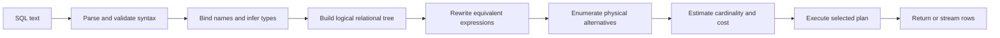
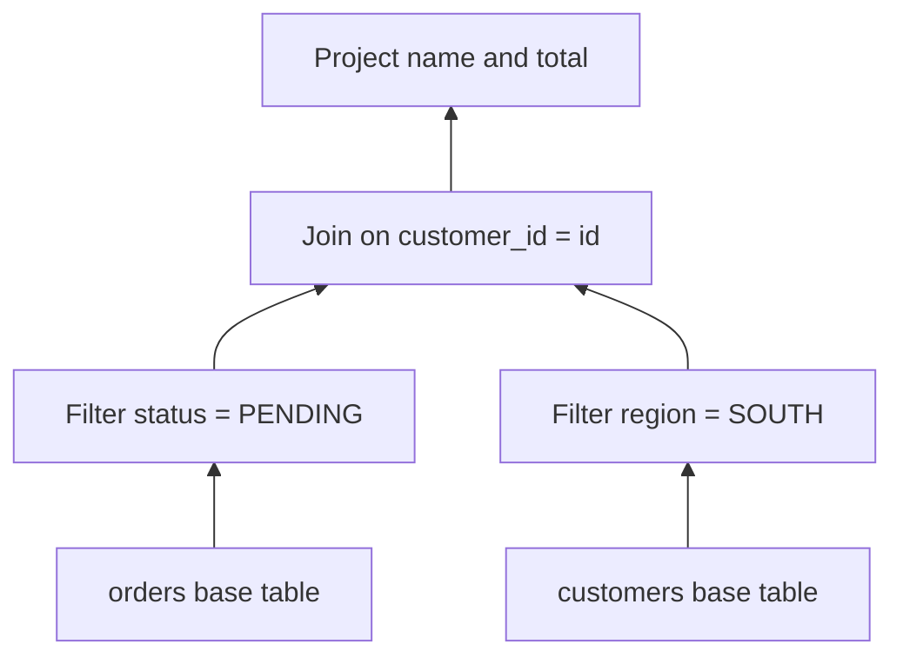
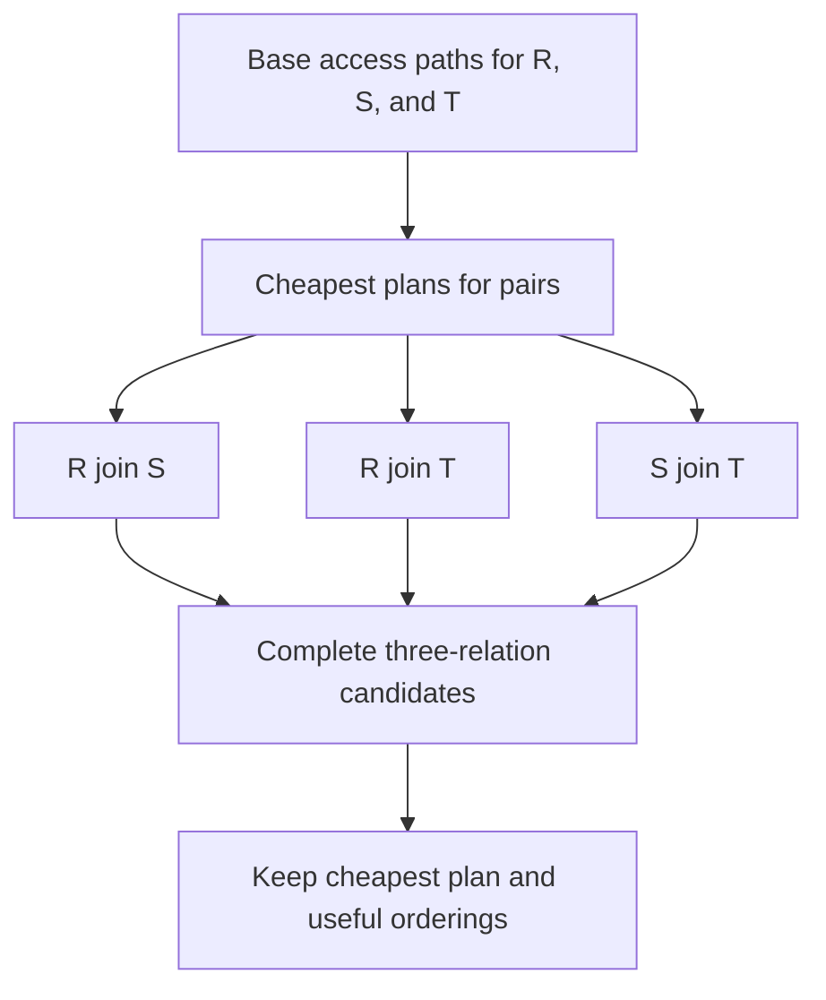
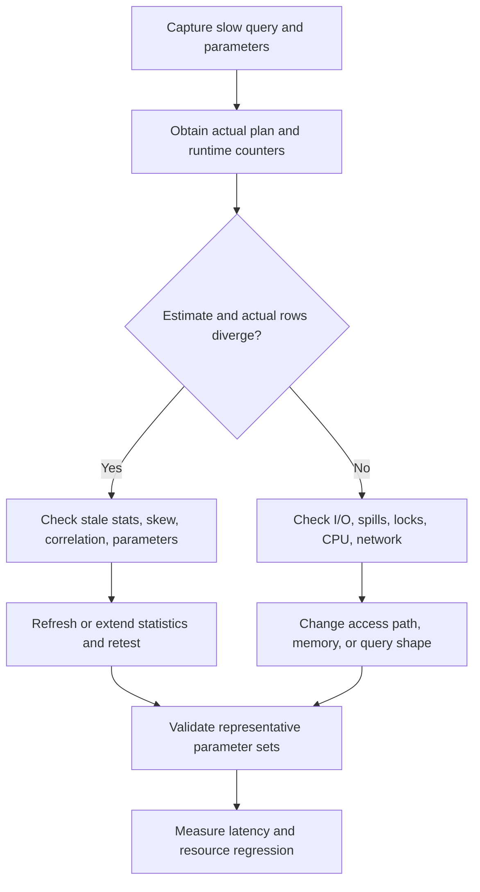

# Query Processing, Relational Trees, and Cost-Based Optimization

Query processing turns declarative SQL into an executable program over pages, indexes, memory, and CPUs. It sits between the SQL interface and the storage engine, deciding which equivalent relational plan is likely to finish with the least work. Interviewers ask about it because plan choice connects SQL correctness, data distribution, index design, and production performance diagnosis.

---

## 🟢 Beginner Level

### Declarative SQL and the Optimizer's Job

SQL describes **what** result is required, not the algorithm that must produce it. The query below does not require an index scan, a particular join order, or a particular join algorithm:

```sql
SELECT c.name, o.total
FROM customers AS c
JOIN orders AS o ON o.customer_id = c.id
WHERE c.region = 'SOUTH'
  AND o.status = 'PENDING';
```

Many programs can return the same rows:

- scan `customers`, scan `orders`, and hash the smaller input;
- use an index on `customers(region)` and probe an index on `orders(customer_id)`;
- scan filtered `orders` first and then look up each customer;
- sort both inputs and merge them on `customer_id`.

The **query optimizer** explores a bounded set of those alternatives. It estimates their resource costs from table and column statistics, then chooses a physical plan before execution begins.

Optimization is therefore a prediction problem. The chosen plan is only as good as the estimates and alternatives available at planning time.

### Query Processing Pipeline

A query passes through distinct stages. Product names differ, but the responsibilities are broadly shared by relational engines.



1. **Parser** converts tokens into a syntax tree and rejects malformed SQL.
2. **Binder or analyzer** resolves tables, columns, functions, aliases, and data types against the catalog.
3. **Logical rewriter** expresses the request as relational operators and applies equivalence rules.
4. **Cost-based optimizer (CBO)** chooses access paths, join order, join algorithms, and operator properties.
5. **Execution engine** runs the chosen operators and exchanges tuples or batches between them.

Parsing proves that the statement is syntactically meaningful. Planning decides how to perform it; execution is where predicted work becomes real work.

### Logical Plans and Physical Plans

A **logical plan** states relational operations without committing to implementation. Its common operators include:

- selection $\sigma$ for filtering rows;
- projection $\pi$ for retaining columns;
- join $\bowtie$ for combining related tuples;
- aggregation $\gamma$ for grouping and computing aggregates;
- sort, duplicate elimination, union, and set difference.

A **physical plan** selects executable operators such as `Seq Scan`, `Index Scan`, `Hash Join`, `Nested Loop`, `Sort`, and `HashAggregate`.

For `SELECT name FROM users WHERE age >= 65`, the logical plan is a selection followed by a projection. A physical plan may scan all user pages and filter, or traverse a B+ tree on `age` and fetch only qualifying rows.

Logical equivalence preserves the answer. Physical alternatives preserve the answer while changing latency, memory use, I/O pattern, and sensitivity to data distribution.

### Relational Trees and Early Reduction

Relational operators form a tree whose leaves are base relations and whose root produces the final result. Rows flow upward, so work saved near a leaf is usually amplified by every operator above it.



**Predicate pushdown** moves a selection as close as legally possible to its table scan. Filtering 10 million orders down to 40,000 before a join is much cheaper than joining all 10 million and discarding rows afterward.

**Projection pushdown** removes unused columns early. If an order tuple is 400 bytes but the remaining plan needs only a 16-byte customer ID and total, reducing width can make a hash table 25 times smaller.

Pushdown must preserve semantics. A predicate on the nullable side of an outer join cannot always cross the join because moving it may change whether null-extended rows survive.

### Access Paths: Scan or Index

An access path is the physical way an engine obtains rows from a relation.

| Access path | Work pattern | Good fit | Common failure case |
|---|---|---|---|
| Sequential scan | Read table pages in physical order | Large fraction of rows, compact table | Wasteful for a highly selective lookup |
| Index scan | Traverse index, then fetch table rows | Selective predicate with useful ordering | Many random heap fetches for a broad predicate |
| Index-only scan | Read values from index without heap data | Covering index and visible tuples/pages | Falls back to heap checks or misses needed columns |
| Bitmap scan | Combine row locations, then visit heap pages in order | Medium selectivity or multiple indexes | Bitmap memory grows; not ideal for one-row probes |

An index is not automatically faster. If 70% of a table qualifies, a sequential scan can read each page once while an index plan performs thousands of scattered lookups.

The optimizer chooses from access paths that existing indexes and engine capabilities make possible. A missing index removes an alternative; it does not make the optimizer irrational.

### Join Order and Join Method Are Different Decisions

For three relations, the optimizer decides both **order** and **method**. It may compute `(customers join orders) join payments` or `customers join (orders join payments)`, then independently choose a nested loop, hash join, or merge join at each node.

Join order controls intermediate cardinalities. Joining a selective 100-row input before a 50-million-row event table may be dramatically cheaper than creating a huge intermediate relation first.

Join method controls how two selected inputs are combined. The best method depends on input size, available indexes, ordering, join predicate, memory, and expected output size.

---

## 🟡 Intermediate Level

### Equivalence Rules and Safe Rewrites

The rewriter reduces work using algebraic identities:

1. Consecutive selections combine: $\sigma_p(\sigma_q(R)) = \sigma_{p \land q}(R)$.
2. A predicate referencing only $R$ can move below an inner join: $\sigma_p(R \bowtie S) = \sigma_p(R) \bowtie S$.
3. Inner joins are commutative: $R \bowtie S = S \bowtie R$.
4. Inner joins are associative: $(R \bowtie S) \bowtie T = R \bowtie (S \bowtie T)$.
5. Projections can move downward if they retain columns needed by later predicates and join keys.
6. `EXISTS` and `IN` subqueries may become semi-joins; `NOT EXISTS` may become an anti-join.

The qualifier **inner** matters. Outer joins, volatile functions, duplicate-sensitive operations, window functions, and null semantics restrict legal reordering.

`NOT IN` is especially dangerous when its subquery can return `NULL`. SQL's three-valued logic can make the predicate unknown for every candidate, so an apparently equivalent anti-join rewrite needs a proven non-null key or explicit `NOT EXISTS` semantics.

### Cardinality, Selectivity, and Statistics

**Cardinality** is an operator's estimated or actual row count. **Selectivity** is the fraction of input rows expected to survive a predicate.

For a relation with $N$ rows and $V(A)$ distinct values in column $A$, a simple equality estimate is:

$$
\operatorname{sel}(A = c) \approx \frac{1}{V(A)}
$$

The estimated output cardinality is:

$$
\widehat{N}_{out} = N \times \operatorname{sel}(predicate)
$$

Engines improve on uniform assumptions with:

- most-common-value frequencies for skewed values;
- histograms for value ranges;
- null fractions and distinct-value counts;
- index cardinality and physical correlation;
- multicolumn or extended statistics for correlated predicates.

Cardinality is the optimizer's most consequential input. A tenfold error near a leaf can become a thousandfold error after several joins.

### Worked Selectivity Example

Assume `orders` contains 20,000,000 rows across 200,000 pages. Catalog statistics say:

- `status` has four distinct values;
- `region` has 20 distinct values;
- dates span 1,000 days;
- a query requests a 10-day range.

Under uniformity and independence assumptions:

$$
\operatorname{sel}(status = PENDING) = \frac{1}{4} = 0.25
$$

$$
\operatorname{sel}(region = SOUTH) = \frac{1}{20} = 0.05
$$

$$
\operatorname{sel}(10\ day\ range) = \frac{10}{1000} = 0.01
$$

The combined estimate is:

$$
20{,}000{,}000 \times 0.25 \times 0.05 \times 0.01 = 2{,}500\ rows
$$

Suppose production data actually contains 1,000,000 matching rows because `PENDING`, `SOUTH`, and recent dates are strongly correlated. The estimate is low by $1{,}000{,}000 / 2{,}500 = 400$ times.

A plan sized for 2,500 rows may choose index probes and a small nested loop. At one million rows, repeated probes and random heap fetches dominate; a scan plus hash join could be much faster.

This is why refreshing single-column statistics may not solve correlated data. The engine needs multicolumn statistics, a more informative index, a rewritten data model, or an engine-specific planning aid.

### Cost Models and Plan Selection

Optimizer cost is a dimensionless comparison score, not promised milliseconds. A simplified model is:

$$
C = P_s c_s + P_r c_r + T c_t + O c_o
$$

where $P_s$ is sequential pages, $P_r$ is random pages, $T$ is tuples processed, $O$ is operator evaluations, and each $c$ term is an engine-calibrated weight.

Cost models may also represent startup cost, total cost, network transfer, parallel coordination, memory, sort passes, and spill I/O. The optimizer primarily compares candidate plans within the same model.

Bad cost constants can matter, such as treating modern cached SSD access like slow random disk access. In practice, wrong row estimates usually cause larger errors because cardinality multiplies page, CPU, and loop estimates together.

### Join Algorithms Compared

| Algorithm | Core mechanism | Typical complexity | Strong case | Weak case |
|---|---|---|---|---|
| Tuple nested loop | Scan inner input for every outer tuple | $O(NM)$ | Tiny inputs | Two large unindexed inputs |
| Indexed nested loop | Probe inner index for each outer tuple | About $O(N\log M)$ | Small outer input, selective indexed probe | Large outer input or many matches per probe |
| Block nested loop | Reuse buffered outer pages while scanning inner | Depends on buffers and pages | No index, buffered small outer relation | Repeated inner scans when memory is small |
| Hash join | Build hash table, then probe by equality key | Expected $O(N+M)$ | Large unsorted equi-join | Non-equality join or build-side spill |
| Sort-merge join | Sort inputs, then advance ordered streams | $O(N\log N + M\log M)$ if sorting | Pre-sorted inputs, range joins, useful output order | Sorting both small unordered inputs |

Hash join requires an equality-compatible key. Sort-merge can exploit inputs already ordered by indexes and is useful when the requested output order avoids another sort.

Nested loop is not inherently naive. With ten outer rows and a cached inner B+ tree, ten index probes can beat the startup cost of scanning and hashing a large table.

### Worked Numeric Join-Cost Example

Let relation $R$ occupy 100 pages with 10,000 tuples. Let $S$ occupy 10,000 pages with 1,000,000 tuples, and let the executor have 52 buffer pages available.

For a tuple nested loop with $R$ outermost:

$$
B(R) + T(R)B(S) = 100 + 10{,}000 \times 10{,}000 = 100{,}000{,}100\ page\ reads
$$

For a block nested loop, 50 pages are usable for an outer block after reserving input/output buffers:

$$
B(R) + \left\lceil\frac{B(R)}{M-2}\right\rceil B(S)
= 100 + \left\lceil\frac{100}{50}\right\rceil 10{,}000
= 20{,}100\ page\ reads
$$

If $R$ fits in the hash-join memory budget, a one-pass hash join reads each input approximately once:

$$
B(R) + B(S) = 100 + 10{,}000 = 10{,}100\ page\ reads
$$

If the hash table does not fit and Grace partitioning is required, a common first approximation is:

$$
3(B(R)+B(S)) = 3 \times 10{,}100 = 30{,}300\ page\ transfers
$$

An indexed nested loop with a cached index and about two page fetches per outer tuple costs roughly $100 + 10{,}000 \times 2 = 20{,}100$ logical page visits. It becomes attractive if a prior filter reduces $R$ to 100 tuples, dropping those probes to about 200.

The calculation demonstrates the decision boundary: join choice depends on **estimated input after filtering**, not only base-table size.

### Search Space and Cost-Based Enumeration

Join count makes exhaustive search expensive. A Selinger-style dynamic program finds good plans for subsets of relations and reuses those results rather than recomputing every tree.



The optimizer may retain a more expensive subplan if it provides an **interesting order** useful for `ORDER BY`, grouping, merge join, or window processing. Lowest local cost is not always lowest end-to-end cost.

For many joins, engines restrict the search to left-deep trees, prune expensive alternatives, use greedy heuristics, or switch to genetic search. Planning time stays bounded, but the mathematically best plan may not be explored.

### Indexes, Scans, and Sargability

A predicate is **sargable** when it can be converted into a searchable index range. Compare:

```sql
-- Often non-sargable: transforms every stored value.
WHERE EXTRACT(YEAR FROM created_at) = 2026

-- Sargable half-open range.
WHERE created_at >= DATE '2026-01-01'
  AND created_at <  DATE '2027-01-01'
```

The second form maps directly to an ordered range on `created_at`. A matching expression index can support the first form, but only when the indexed expression matches the query semantics.

Composite index order matters. An index on `(customer_id, created_at)` efficiently narrows equality on `customer_id` and then a date range, while a query filtering only `created_at` may not use its leading structure effectively.

Even a usable index can lose to a scan when selectivity is poor, row fetches are scattered, the table is tiny, or the required columns are not covered. Read the chosen plan in context rather than treating `Seq Scan` as an error message.

### Reading EXPLAIN ANALYZE

Plain `EXPLAIN` displays the optimizer's estimated plan without running the statement. `EXPLAIN ANALYZE` executes it and reports actual observations alongside estimates.

```sql
EXPLAIN (ANALYZE, BUFFERS, VERBOSE)
SELECT id, total
FROM orders
WHERE customer_id = 42
  AND status = 'PENDING';
```

A simplified PostgreSQL-style node might look like:

```text
Index Scan using orders_customer_status_idx on orders
  (cost=0.43..92.10 rows=40 width=16)
  (actual time=0.030..5.800 rows=12000 loops=1)
  Index Cond: (customer_id = 42 AND status = 'PENDING')
  Buffers: shared hit=96 read=410
```

Read a plan in this order:

1. Compare **estimated rows** with `actual rows × loops` at every node.
2. Start near the first large divergence; errors propagate upward.
3. Check loop counts, especially on the inner side of nested loops.
4. Inspect filter removals to find work performed and then discarded.
5. Use buffer hits and reads to separate CPU/cache work from physical I/O.
6. Look for sorts or hashes that spill to temporary storage.
7. Distinguish startup time from total time and blocking from streaming operators.

Here, the index is usable, but the optimizer predicted 40 rows and received 12,000: a 300-fold error. The first question is not merely "how do I force a different index?" but "why do statistics misunderstand this parameter combination?"

`EXPLAIN ANALYZE` has side effects because it really runs the statement. Wrap write statements in a transaction and roll them back when safe, or diagnose against a representative non-production environment.

---

## 🔴 Expert Level

### Estimation Failure: Skew, Correlation, and Unknown Values

Uniformity assumes each distinct value occurs equally often. Independence assumes predicates do not affect one another. Both are often false:

- one tenant may own 60% of a multitenant table;
- postal code and city describe the same population;
- `status = 'PENDING'` may correlate strongly with recent dates;
- monotonically increasing IDs place new values beyond an old histogram boundary;
- user-defined functions hide selectivity from the planner.

Most-common-value lists capture frequent outliers, while histograms approximate remaining ranges. Extended statistics can describe multicolumn dependencies or joint frequencies.

Sampling introduces uncertainty, and stale statistics describe an earlier table. Bulk loads, partitions, rapidly ascending keys, and highly skewed tenants therefore deserve deliberate `ANALYZE` strategy and plan monitoring.

### Plan Caching and Parameter Sensitivity

Prepared statements avoid repeating parsing and planning, but one plan may not suit every parameter. A point lookup for a customer with five orders wants an index-driven nested loop; a customer with five million orders may prefer a scan and hash join.

This family of problems is often called **parameter sniffing** or **parameter sensitivity**. Engine-specific mitigations include custom versus generic plans, recompilation, parameter-sensitive plan variants, filtered statistics, query splitting, and carefully scoped hints.

Recompiling every execution improves parameter awareness but consumes planning CPU and loses plan-cache benefits. Forcing one plan stabilizes behavior but can lock in the wrong choice as data evolves.

### Executor Reality: Memory, Spills, and Pipelines

Some operators pipeline rows immediately; others must accumulate input. Nested-loop probes and many filters stream, while sorts, hash-table builds, and some aggregates are blocking.

When a hash build exceeds its memory grant, it partitions data to temporary files and rereads them. When a sort exceeds memory, it produces sorted runs and performs external merge passes.

Physical execution styles also differ:

| Model | Unit of work | Advantage | Cost or trade-off |
|---|---|---|---|
| Volcano iterator | One tuple per `next()` call | Simple, composable, low startup | Per-row call and interpretation overhead |
| Vectorized | Batch of hundreds or thousands of values | Cache locality and SIMD-friendly loops | Batch setup; less helpful for tiny OLTP requests |
| JIT compiled | Native code specialized for expressions | Reduces interpretation on CPU-heavy scans | Compilation startup may exceed short query runtime |

The optimizer estimates whether memory-intensive operators will fit, but concurrency changes available memory. A plan that is fast alone can spill when 100 copies run simultaneously.

### Plan Diagnosis Under Production Load

Use plans as evidence within a repeatable investigation, not as decorative output.



Always capture representative parameter values. A fast test tenant and a pathological production tenant can legitimately require different physical plans.

Compare cold-cache and warm-cache behavior, but do not flush shared production caches for an experiment. Include concurrency, locks, and memory grants because elapsed time is not solely operator CPU plus I/O.

### Failure Modes and Practical Remedies

1. **Stale statistics after bulk ingestion:** estimates still describe the old table size and distribution. Run or schedule statistics collection, then verify actual-versus-estimated rows rather than assuming the refresh fixed everything.
2. **Correlated predicates multiplied as independent:** a city and postal-code filter can be underestimated by orders of magnitude. Add supported multicolumn statistics, redesign the index, or expose a better correlation key.
3. **Non-sargable filter:** a function or implicit cast on an indexed column forces row-by-row evaluation. Rewrite it as a range or equality on the stored type, or create a matching expression index.
4. **Hash or sort spill:** the chosen build side exceeds the memory grant and generates temporary I/O. Reduce input earlier, correct estimates, tune bounded memory carefully, or choose a suitable access path.
5. **Parameter-sensitive cached plan:** a plan compiled for a rare value is reused for a common value. Evaluate custom plans or supported parameter-sensitive mechanisms before adding a blanket hint.
6. **Search-space pruning:** a very wide join graph falls back to bounded heuristics and misses a strong order. Simplify the query, improve constraints/statistics, materialize a justified stage, or use a narrow engine-specific hint as a last resort.
7. **Twenty-million-row dashboard regression:** an unindexed post-join date filter can scan and discard nearly the entire orders table. A sargable early date restriction plus a composite index can turn a 24-second full scan into a millisecond-scale plan, but the improvement must be measured on production-shaped data.

### Common Misconceptions

1. **"An index scan is always better than a sequential scan."**
   A broad index predicate may perform more random heap work than reading each table page once. Selectivity, coverage, clustering, caching, and table size determine the better access path.
2. **"`EXPLAIN ANALYZE` is a harmless way to inspect any statement."**
   It executes the statement, including writes and function side effects. Use transaction safeguards and an appropriate environment before analyzing mutating SQL.
3. **"The optimizer's cost is expected runtime in milliseconds."**
   Cost units are internal weighted estimates for comparing plans. Actual time also depends on cache state, concurrency, storage latency, locks, and hardware.
4. **"A nested loop means the optimizer made a mistake."**
   A nested loop is excellent when its outer input is small and its inner access is selective and indexed. It becomes disastrous when the outer cardinality was underestimated or the inner operation is repeatedly expensive.
5. **"Refreshing statistics guarantees the best plan."**
   Fresh single-column statistics still miss cross-column correlation and may be based on samples. Search-space limits, parameter sensitivity, cost calibration, and missing indexes can still constrain the chosen plan.

### Interview Questions

**Q1. What is predicate pushdown, and why is it effective?** `[easy]`

Predicate pushdown moves a filter toward the base scan that supplies its referenced columns. It reduces tuples before joins, sorts, transfers, and aggregates, so every later operator performs less work. The rewrite is only legal when it preserves semantics, which is why outer joins, null behavior, and volatile expressions require care.

**Q2. What is the difference between a logical plan and a physical plan?** `[easy]`

A logical plan expresses relational operations such as selection, projection, join, and aggregation without selecting algorithms. A physical plan chooses executable implementations such as an index scan, hash join, or external sort. Multiple physical plans can implement one logical plan with identical results but very different I/O, memory, and latency.

**Q3. Why might a database choose a sequential scan even when a usable index exists?** `[easy]`

A broad predicate can qualify enough rows that index traversal plus scattered table fetches costs more than reading each page once. A small table, poor physical clustering, missing covered columns, or a warm sequential path can further favor the scan. The choice is reasonable unless actual selectivity or cost assumptions differ substantially from estimates.

**Q4. What does `EXPLAIN ANALYZE` provide that plain `EXPLAIN` does not?** `[easy]`

Plain `EXPLAIN` reports the estimated plan and costs without executing the query. `EXPLAIN ANALYZE` runs it and reports actual rows, timings, loops, and engine-specific runtime counters, enabling estimate-versus-reality comparison. Because it executes the statement, it can modify data or trigger side effects and must be used safely.

**Q5. How does a cost-based optimizer use cardinality estimates?** `[medium]`

It estimates how many rows each operator produces, then derives I/O, CPU, memory, and repeated-loop work for candidate plans. Those estimates influence access paths, join order, join methods, parallelism, and memory grants. An early underestimate compounds upward and can make a locally cheap nested loop catastrophically expensive at runtime.

**Q6. When is sort-merge join preferred over hash join?** `[medium]`

Sort-merge is attractive when both inputs already arrive ordered on the join key, when the required output order is useful later, or when the predicate supports ordered/range matching. Hash join is normally simpler for large unsorted equality joins whose build side fits memory. If sorting is required for both inputs, its $O(N\log N)$ preparation can make hash join cheaper, while either method can spill under insufficient memory.

**Q7. How do predicate pushdown and projection pushdown reduce different dimensions of work?** `[medium]`

Predicate pushdown reduces row count, while projection pushdown reduces row width. Both lower bytes processed by joins, hashes, sorts, and network exchanges, and their benefits multiply when applied together. Projection must retain all later join keys, filter columns, and output expressions or it changes or invalidates the plan.

**Q8. Why do correlated columns break simple selectivity estimation?** `[medium]`

Simple estimators multiply independent single-column selectivities. If `city = 'Mumbai'` and `postal_code = '400001'` describe much of the same population, multiplying them severely underestimates matching rows. Multicolumn statistics, joint most-common-value data, or a more explicit data model can give the optimizer evidence about that dependency.

**Q9. Scenario: An actual plan shows 800,000 inner index-scan loops instead of the estimated 200. What do you inspect first?** `[medium]`

Start at the earliest plan node where estimated rows diverge from `actual rows × loops`, because that error likely drove the nested-loop choice. Check stale statistics, skewed parameter values, correlated predicates, and whether a generic cached plan was reused. Then refresh or extend statistics and retest representative values before forcing a join method.

**Q10. Why can a function around an indexed column prevent index use?** `[medium]`

A normal B+ tree orders the stored column values, not arbitrary function results. A predicate such as `EXTRACT(YEAR FROM created_at) = 2026` may therefore require evaluating every row instead of seeking a contiguous key range. Rewrite it to a half-open date range or create a matching expression index, while confirming type and timezone semantics remain correct.

**Q11. How does Selinger-style dynamic programming control join-order optimization?** `[hard]`

It builds cheapest known plans for small relation subsets and combines those results to form plans for larger subsets. Reusing subset solutions avoids enumerating every execution tree from scratch, and retaining interesting output orders prevents premature loss of useful plans. The search still grows rapidly, so real engines cap it, restrict tree shapes, prune candidates, or switch to heuristic search for many joins.

**Q12. Scenario: A prepared query is fast for most tenants but 1,000 times slower for the largest tenant. Explain the likely mechanism and fixes.** `[hard]`

The engine likely cached a plan optimized for a low-cardinality parameter and reused it for a tenant returning millions of rows. Its nested loops or index probes remain logically correct but scale badly in the high-cardinality regime. Validate this with actual plans for both values, then consider supported custom or parameter-sensitive plans, better statistics, query splitting, or carefully bounded recompilation before resorting to a fixed hint.

**Q13. Scenario: A hash join estimate is accurate, but production still spills while an isolated test does not. Why?** `[hard]`

Accurate row count does not guarantee the runtime memory grant remains available under concurrency, nor that estimated row width matches reality. Many simultaneous queries can divide memory, and variable-width values or skewed hash buckets can make the build structure larger than predicted. Inspect spill counters, granted versus used memory, concurrent workload, and tuple widths before globally increasing per-query memory, which could worsen system-wide pressure.

**Q14. Scenario: A dashboard query over 20 million orders takes 24 seconds and filters most rows after joining. How do you approach the regression?** `[hard]`

Capture the exact parameters and an actual plan, then locate where estimated and actual rows first diverge and where rows are discarded. Make the date and status predicates sargable, verify they can be pushed to the orders scan, and evaluate a composite or covering index whose leading columns match the access pattern. Re-run with production-shaped cardinalities and concurrency, because an apparent 8 ms test result may depend on warm cache, one selective tenant, or an unrepresentative dataset.

### Further Reading

- [PostgreSQL documentation: Using EXPLAIN](https://www.postgresql.org/docs/current/using-explain.html) explains plan nodes, estimates, `EXPLAIN ANALYZE`, and measurement caveats.
- [PostgreSQL documentation: Statistics Used by the Planner](https://www.postgresql.org/docs/current/planner-stats.html) describes histograms, most-common values, distinct counts, and extended statistics.
- [MySQL Reference Manual: EXPLAIN Statement](https://dev.mysql.com/doc/refman/8.4/en/explain.html) documents MySQL plan inspection and `EXPLAIN ANALYZE` behavior.
- [IBM Research: Access Path Selection in a Relational Database Management System](https://research.ibm.com/publications/access-path-selection-in-a-relational-database-management-system) is the original System R cost-based access-path and join-order paper.
