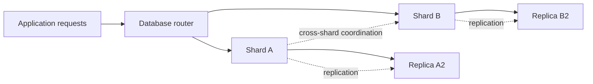
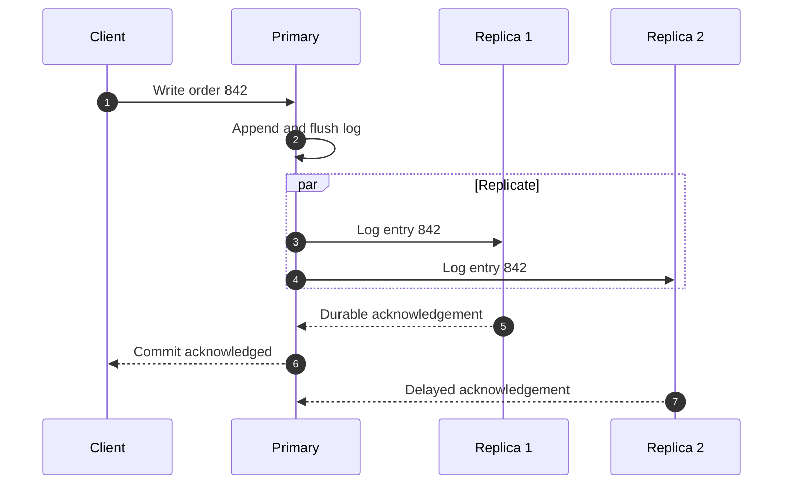
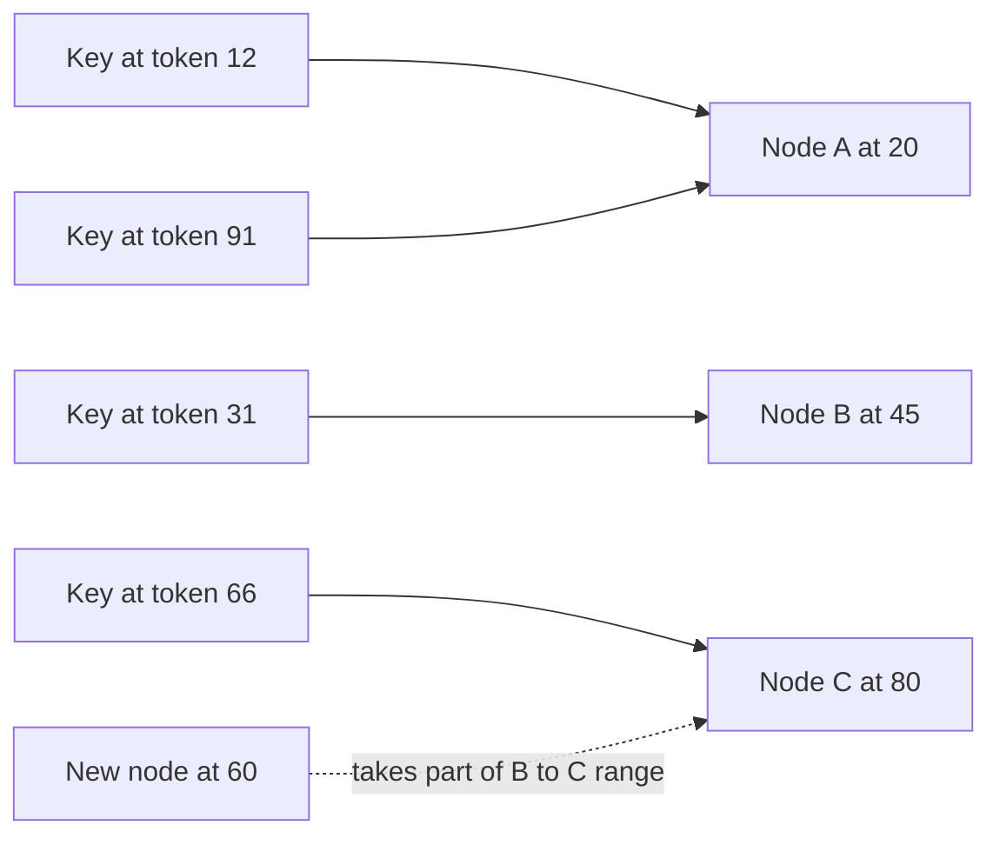
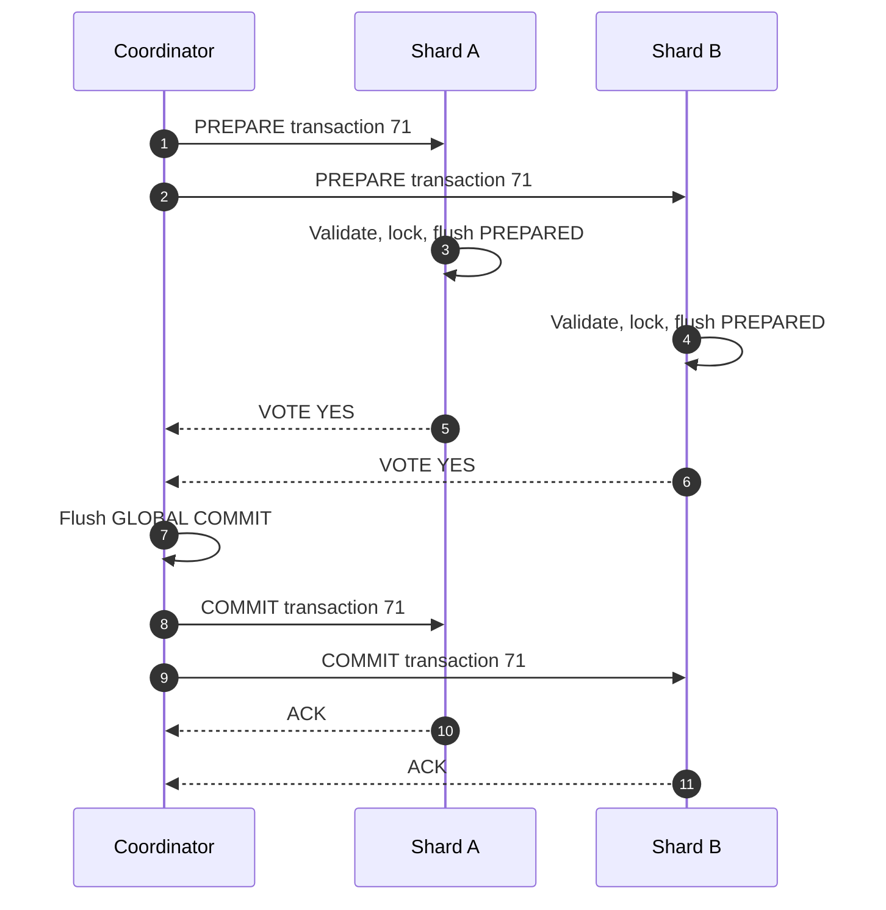
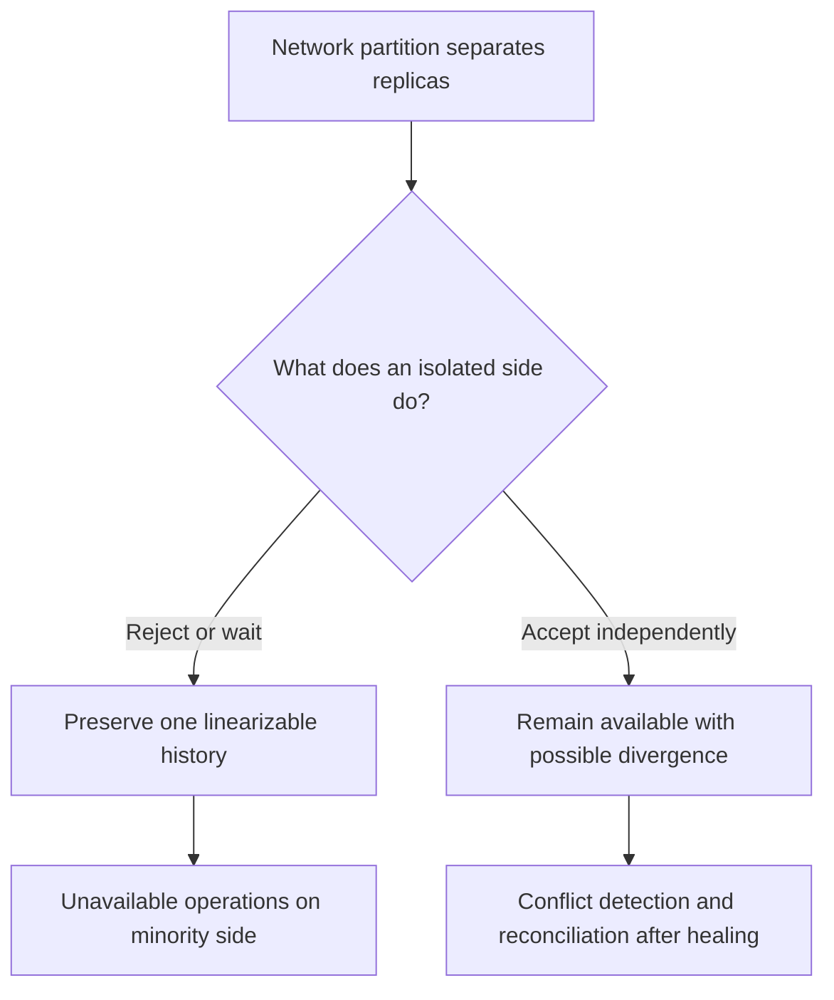
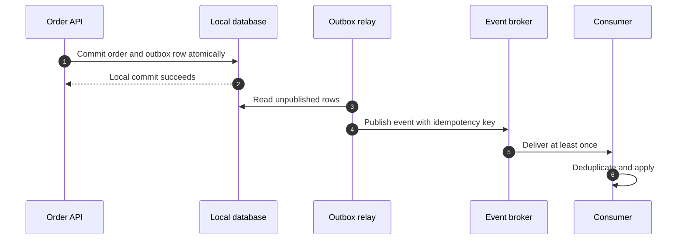

# Distributed Databases, Atomic Commit, and CAP

A distributed database stores or replicates one logical data set across independent machines, so
capacity and availability can grow beyond one server's limits. The difficult part is preserving
useful guarantees when messages are delayed, nodes disagree, or a coordinator fails mid-transaction.
Interviewers use this topic to test whether you can connect replication, sharding, quorum math,
atomic commit, and failure handling to concrete product requirements.

---

## 🟢 Beginner Level

### Why a Database Becomes Distributed

A single database server keeps local transactions, joins, backups, and indexes straightforward,
but one machine has finite CPU, memory, storage, I/O bandwidth, and one failure domain.

A distributed design uses multiple machines for two different goals:

- **Replication** copies the same data so reads can be spread out and another copy survives failure.
- **Partitioning**, also called **sharding**, divides rows or columns among machines so total
  storage and write capacity can grow.
- **Geographic placement** puts data nearer users or inside a required legal region.
- **Fault isolation** prevents one hardware failure from making the whole service unavailable.

Distribution also creates costs that a single node does not have:

- Networks delay, duplicate, reorder, and sometimes lose messages.
- Machines fail independently and can restart with older durable state.
- Clocks disagree, so wall-clock timestamps alone cannot safely order concurrent writes.
- Cross-node joins and transactions require extra round trips and coordination.

The application sees one logical database while routing, replication, and transaction layers hide
several physical failure domains.

### Scaling Out: Vertical vs Horizontal

**Vertical scaling** replaces one server with a larger server: more CPU, RAM, disk, or network
capacity. It preserves local semantics, but hardware has a ceiling and remains one failure domain.

**Horizontal scaling** adds servers, increasing aggregate storage, writes, and reads while
requiring explicit placement, rebalancing, failure detection, and consistency rules.

| Dimension | Vertical scaling | Horizontal scaling |
|---|---|---|
| Capacity change | Upgrade one machine | Add or remove machines |
| Application complexity | Usually low | Higher: routing and coordination |
| Practical ceiling | Largest available machine | Many commodity nodes |
| Failure domain | One large server | Multiple independent nodes |
| Transaction cost | Local memory and disk | May include network consensus |
| Best first step | Most systems | When one node or one region is insufficient |

Scale up first when economical. Premature sharding creates complexity that a larger instance and
read replicas may have avoided.

### Replication, Primaries, and Read Replicas

In **primary-replica replication**, writes go to one primary, which sends its ordered change log
to replicas for replay.

A **read replica** serves workloads that tolerate lag; it does not scale writes because write
order still passes through the primary.

Replication may acknowledge at different durability points:

1. **Asynchronous replication** acknowledges after the primary commits locally.
   It is fast, but immediate failover can lose writes that had not reached a replica.
2. **Semi-synchronous replication** waits for at least one replica to receive or durably store the
   log record.
   It reduces the recovery-point objective but adds a network round trip.
3. **Synchronous replication** waits for every required replica or a quorum.
   It protects acknowledged data but turns slow or partitioned replicas into write latency.

Safe failover selects the newest replica, fences the old primary, starts a new replication epoch,
and redirects clients without letting two primaries accept writes.

### Sharding and Partitioning

**Horizontal partitioning** assigns rows by a rule such as `hash(customer_id)` or date range.

**Vertical partitioning** splits columns or table groups, keeping hot profile fields apart from
large documents or audit details.

Common horizontal strategies are:

| Strategy | Placement rule | Strength | Failure mode |
|---|---|---|---|
| Range | Ordered key intervals | Efficient range scans | Sequential keys create a hot shard |
| Hash | Hash of shard key | Even distribution | Range scans become scatter-gather |
| Directory | Lookup service maps key to shard | Flexible movement | Extra hop and directory dependency |
| Geography | User or tenant region | Data locality | Cross-region operations are expensive |

A good shard key distributes traffic and co-locates rows that transact or join; a bad one causes
hot partitions and cross-shard work.

### Local and Distributed Transactions

A local transaction changes one node's data, so local ACID machinery and WAL are sufficient.

A distributed transaction spans participants. A transfer across shards requires debit and credit
to reach the same final decision despite shard or network failure.

Atomic commitment asks a binary question:

> Can every participant commit, or must every participant abort?

Two-phase commit answers that question through a coordinator. Consensus systems solve a related
but different problem: several replicas agree on one ordered decision even when a minority fails.

---

## 🟡 Intermediate Level

### Replication Flow, Lag, and Failover

The primary assigns every write an ordered log position. Depending on configuration, a replica
acknowledges receipt, durable storage, or application, and each point implies different guarantees.

If the client reads immediately from replica 2, it may not yet see order 842.
Mitigations include:

- route read-after-write traffic to the primary;
- carry a log-position token and wait until the chosen replica reaches it;
- use sticky sessions for a bounded workflow;
- request a quorum or linearizable read where the database supports it.

Measure replica lag in bytes and time: 5 MB may be minutes stale in quiet traffic, while 500 MB may
represent only seconds during a burst.

Failover has two distinct objectives:

- **RTO**, the recovery-time objective, measures how long service is unavailable.
- **RPO**, the recovery-point objective, measures how much acknowledged data can be lost.

Async replication gives short RTO with nonzero RPO; synchronous quorum can prevent acknowledged
write loss but may reject writes during a partition.

### Shard Routing and Consistent Hashing

Naive `hash(key) mod N` routing remaps most keys when the node count changes, causing migration
storms and cache misses.

Consistent hashing places nodes and keys on a ring. A key belongs to the next clockwise node, so a
new node takes neighboring ranges rather than remapping the entire keyspace.

Many **virtual nodes** per server reduce variance, allow weighted ownership, and make rebalancing
incremental.

Consistent hashing does not solve every placement problem:

- A popular key remains hot even if overall data is evenly distributed.
- Replicas must be placed across racks or zones, not merely on adjacent ring positions.
- Rebalancing consumes network and disk bandwidth and should be rate-limited.
- Membership needs epochs or consensus so partitioned sides do not calculate different owners.

### Connection Pooling and Caching in a Distributed Database

If 40 application instances each open 100 connections, the cluster has 4,000 sessions before any
request executes.

A pool limits concurrent sessions and reuses authenticated connections:

- size the pool from database concurrency capacity, not from HTTP request count;
- set acquisition and statement timeouts so overload fails quickly;
- maintain separate limits for transactions and long analytical queries;
- make the pool topology-aware so it does not keep sending traffic to a demoted primary.

Pooling reduces setup overhead but does not add database CPU or lock capacity; oversized pools
increase context switching, memory pressure, and tail latency.

Caches reduce repeated reads but introduce another copy of data:

- **Cache-aside** loads on a miss and invalidates after writes.
- **Read-through** delegates loading to the cache layer.
- **Write-through** updates cache and storage together.
- **TTL-based caching** bounds how long stale values may survive but does not guarantee immediate
  invalidation.

During failover, stale cache entries can outlive the old primary. Versioned values, short TTLs,
and commit-linked invalidations reduce risk; balances must not trust an unverified cache copy.

### Two-Phase Commit: Prepare and Decide

Two-phase commit, or **2PC**, has one coordinator and multiple participants, each with a local
transaction and durable log.

**Phase 1: prepare or vote**

1. The coordinator records that the distributed transaction began.
2. It sends `PREPARE` to every participant.
3. Each participant validates constraints, acquires required locks, and flushes enough redo and
   undo state to commit after a restart.
4. It records `PREPARED` before voting yes.
5. Any participant that cannot prepare votes no.

**Phase 2: decision**

1. One no vote or timeout makes the coordinator durably record global abort.
2. Only unanimous yes votes allow it to durably record global commit.
3. The coordinator sends the recorded decision until every participant acknowledges it.
4. Participants commit or roll back locally, release locks, and remember the outcome for retries.

Log ordering provides correctness: participants vote yes only after durable prepare, and the
coordinator announces commit only after durably recording the global decision.

### Why 2PC Blocks

After voting yes, a participant cannot choose on its own:

- aborting could contradict a global commit already recorded elsewhere;
- committing could contradict a no vote that forced global abort.

If the coordinator is unreachable, the participant is **in doubt** and keeps locks. PostgreSQL
shows it in `pg_prepared_xacts`; resolve it only after establishing the global outcome.

With two 1 ms round trips and three 0.5 ms durable flushes, a simplified lower bound is:

$$
2(1\text{ ms}) + 3(0.5\text{ ms}) = 3.5\text{ ms}
$$

At an 80 ms inter-region RTT, the network portion becomes 160 ms while locks remain held.
Co-location, sagas, and transactional outboxes avoid that cross-boundary cost.

### Three-Phase Commit and Consensus-Based Decisions

Three-phase commit, or **3PC**, adds `PRECOMMIT`; a participant there can infer more from a
timeout than a merely prepared 2PC participant.

| Property | 2PC | 3PC | Consensus-replicated decision |
|---|---|---|---|
| Main phases | Prepare, decide | CanCommit, precommit, doCommit | Propose and replicate log entry |
| Coordinator crash | Can block | Nonblocking under narrow assumptions | New leader recovers decision |
| Network partition | Blocks safely | Can split into conflicting decisions | Majority side progresses |
| Agreement requirement | All participants prepare | All participants across three phases | Majority of decision replicas |
| Typical use | XA and prepared transactions | Mostly academic | Raft/Paxos database control planes |

3PC assumes bounded delays and fail-stop failures. Async networks cannot distinguish a crash from
a partition, so independent timeout decisions can split history.

Consensus replicates the decision for leader recovery, but does not remove cross-shard atomic
commit; Spanner and CockroachDB still coordinate transactions spanning consensus ranges.

### Worked Quorum and Partition Example

Let a record have $N = 5$ replicas: A, B, C, D, and E. A write is acknowledged after $W = 3$
replicas store version 42, and a read consults $R = 3$ replicas.

Two intersection rules matter:

$$
R + W > N
$$

ensures every read set intersects the most recent acknowledged write set, while

$$
W > \frac{N}{2}
$$

ensures two successful write sets cannot be disjoint.

Suppose version 42 reaches A, B, and C before the network partitions:

| Replica | A | B | C | D | E |
|---|---:|---:|---:|---:|---:|
| Stored version | 42 | 42 | 42 | 41 | 41 |

Now follow concrete reads:

1. A read from C, D, and E observes versions 42, 41, and 41.
   It returns version 42 because the read set intersects the write set at C.
2. A read with $R = 1$ that reaches D returns stale version 41.
   The configured quorum guarantee did not apply because the client requested only one replica.
3. A new write needs any three replicas.
   A partition containing only D and E has two nodes, so it cannot acknowledge a conflicting
   quorum write.
4. The A-B-C side has three nodes and can continue reading and writing.
   The D-E side must reject quorum operations or explicitly fall back to weaker consistency.

The minimum $R + W$ for $N = 5$ is 6, not 5. Common choices include:

| Configuration | Read behavior | Write behavior | One-node failure |
|---|---|---|---|
| $R=1, W=5$ | Lowest read latency | Waits for every replica | Writes unavailable |
| $R=3, W=3$ | Majority read | Majority write | Both remain available |
| $R=5, W=1$ | Waits for every replica | Lowest write latency | Reads unavailable |

Quorum intersection alone is not a complete consistency proof. The system also needs version
ordering, conflict resolution, stable membership, and rules preventing a stale leader from
accepting writes.

---

## 🔴 Expert Level

### CAP Under a Real Network Partition

The CAP theorem concerns an asynchronous distributed system during a network partition:

- **Consistency** means linearizability: each operation appears to take effect atomically in one
  real-time order.
- **Availability** means every request received by a nonfailed node eventually returns a
  non-error response.
- **Partition tolerance** means the system continues operating despite lost or indefinitely
  delayed messages between groups of nodes.

Partition tolerance is not a feature switch in a multi-node system; partitions happen.
The choice during the partition is whether an isolated side rejects operations to preserve one
history or accepts operations that may require later reconciliation.

CAP does not say a database chooses exactly two letters forever. Real systems choose guarantees
per operation: a ledger debit may require a majority, while a product-view counter accepts local
writes and converges later.

**PACELC** adds normal operation: if there is a Partition, trade Availability against Consistency;
Else, trade Latency against Consistency. Even without failures, a cross-region linearizable write
waits for communication that an eventually consistent local write avoids.

### Consistency Spectrum

Consistency is not only “strong” or “eventual”:

| Guarantee | Observable promise | Typical mechanism |
|---|---|---|
| Linearizable | Operations respect real-time order globally | Leader or quorum plus fencing |
| Sequential | One global order preserves each client's order | Ordered replicated log |
| Causal | Causes are visible before their effects | Causal metadata or dependency tracking |
| Read-your-writes | A session sees its own committed changes | Session token or leader pinning |
| Monotonic reads | A session never moves backward in versions | Minimum-version token |
| Bounded staleness | Reads lag by at most time or versions | Lag-aware routing |
| Eventual | Replicas converge after writes stop | Anti-entropy and conflict resolution |

**Strong consistency** usually refers to linearizable reads and writes, but product documentation
must name the exact guarantee. **Eventual consistency** promises convergence, not a maximum delay
and not correct conflict resolution.

**BASE** contrasts a common availability-oriented model with strict transactional expectations:

- **Basically Available** means the service aims to respond despite partial failures.
- **Soft state** means replicas and caches may change as background propagation continues.
- **Eventual consistency** means copies converge when no new updates arrive.

BASE does not remove business invariants. It moves reconciliation, idempotency, and conflict rules
into the data model and application workflow.

### Quorum Consensus and Failure Trade-offs

A quorum protocol typically routes writes through a leader or coordinates replica responses using
versions. Majority intersection prevents two disjoint groups from both committing the next value
under one membership epoch.

Production failure cases include:

1. **Stale leader**: an old leader resumes after a long pause and sends writes.
   Storage nodes must reject its lower fencing epoch.
2. **Sloppy quorum**: temporary non-home replicas accept hinted writes for availability.
   The usual $R + W > N$ home-set intersection may not hold until hinted handoff completes.
3. **Divergent membership**: each partition calculates quorum from a different cluster size.
   Joint-consensus membership changes prevent both views from claiming a majority.
4. **Clock-based last-write-wins**: a fast clock can overwrite a causally newer value.
   Logical versions, hybrid clocks, or application merges are safer.
5. **Tail amplification**: a request that waits for three replicas inherits the slowest required
   response, increasing p99 latency even when the median is low.

Anti-entropy compares replica state in the background, often using Merkle trees to locate differing
ranges. Read repair updates stale copies discovered during a read. Neither mechanism makes a weak
read linearizable at the moment it returns.

### Distributed Transactions Without Long-Lived 2PC

Cross-service 2PC is often unavailable because message brokers, payment providers, and external
APIs do not share one transaction manager. Two common alternatives are:

- A **saga** commits a sequence of local transactions and invokes compensating actions when a later
  step fails. Compensation restores a business outcome but may not recreate the exact previous
  state.
- A **transactional outbox** writes domain state and an outbound event in one local transaction.
  A relay publishes the event at least once, and consumers deduplicate by event ID.

“Exactly once” across arbitrary side effects is not a network guarantee.
Effectively-once behavior combines durable state, at-least-once retries, idempotency keys, and
consumer-side deduplication.

### Production Design and Operational Signals

Distributed-database incidents usually reveal missing operational guarantees rather than missing
definitions. Track:

- replication lag by bytes, seconds, and log position;
- current leader term and rejected stale-epoch writes;
- prepared-transaction count and oldest prepared age;
- quorum success, timeout, and fallback rates;
- per-shard size, request rate, and hot-key concentration;
- connection-pool utilization and acquisition wait;
- cache hit rate, invalidation lag, and stale-read reports;
- rebalance traffic and remaining token ranges.

For a financial ledger, keep authoritative balance writes on a CP path with quorum durability and
fencing. Use asynchronous replicas and caches for statements or analytics only when their
staleness is visible and acceptable.

For globally distributed collaboration or feeds, availability may be more valuable. Use
operation-specific conflict semantics such as commutative counters, sets, or CRDTs instead of
blind last-write-wins.

### Common Misconceptions

1. **“A read replica always returns the latest committed write.”**
   An asynchronous replica can lag even when it is healthy.
   Read-after-write requires leader routing, a version token, or a consistency level that waits for
   the required log position.

2. **“CAP means every database permanently chooses two of three features.”**
   CAP constrains behavior during a partition, and partition tolerance is unavoidable once nodes
   communicate over a fallible network.
   Systems make different consistency and availability choices per operation.

3. **“If $R + W > N$, reads are automatically linearizable.”**
   Intersection finds at least one overlapping copy only when replica sets, membership, version
   order, and failure handling satisfy the model.
   Sloppy quorums, stale leaders, or last-write-wins clock errors can still violate expectations.

4. **“Three-phase commit solves 2PC blocking in production networks.”**
   3PC avoids blocking only with bounded-delay and fail-stop assumptions.
   Under a network partition, timeout-driven participants can make conflicting decisions.

5. **“Connection pooling and caching make an overloaded database horizontally scalable.”**
   A pool reduces connection setup and caps concurrency, while a cache avoids selected reads.
   Neither adds write capacity or removes hot shards, locks, and replication bottlenecks.

### Interview Questions

**Q1. What is the difference between replication and sharding?** `[easy]`

Replication copies the same data for availability and read scaling. Sharding divides data to scale storage and writes. Production systems often replicate every shard.

**Q2. Why is two-phase commit considered a blocking protocol?** `[easy]`

After durably voting yes, a participant cannot commit or abort without the coordinator's decision. If the coordinator is unreachable, it remains prepared and holds resources. This preserves atomicity but can turn one failure into lock pile-ups and timeouts.

**Q3. What happens when one participant votes abort during 2PC prepare?** `[easy]`

The coordinator chooses global abort because commit requires unanimous yes votes. It durably records and broadcasts abort, including to prepared participants. They roll back and release locks; dropping the failed node and committing would violate atomicity.

**Q4. What is the minimum value of $R + W$ for $N = 5$ replicas?** `[easy]`

The minimum sum is 6 because $R + W > N$, not greater than or equal to $N$. Examples are $R=3, W=3$ and $R=2, W=4$. Correct versioning, membership, and conflict handling are still required.

**Q5. Compare vertical scaling with horizontal scaling for a database.** `[medium]`

Vertical scaling grows one machine and preserves simple local behavior. Horizontal scaling exceeds one server's capacity but adds routing, replication, rebalancing, and failure modes. Scale up until capacity or availability justifies scale-out complexity.

**Q6. Why can an acknowledged asynchronous write disappear after failover?** `[medium]`

The primary may acknowledge locally before any replica receives the change. If it fails permanently, the promoted replica's log can end before that entry. Semi-sync or quorum acknowledgement lowers this RPO by waiting for replicas.

**Q7. What is PACELC, and how does it extend CAP?** `[medium]`

PACELC says Partition means Availability versus Consistency; Else means Latency versus Consistency. CAP covers only the partition case, while PACELC exposes healthy-day coordination cost. Cross-region quorum writes therefore pay network RTT without any failure.

**Q8. Why does consistent hashing use virtual nodes?** `[medium]`

Few ring positions create uneven ranges and traffic. Virtual nodes smooth distribution, support capacity weighting, and make rebalancing incremental. They do not solve a hot individual key.

**Q9. Compare 2PC, 3PC, and a consensus-replicated commit decision.** `[medium]`

2PC is common but can block after prepare. 3PC avoids blocking only under assumptions that real partitions violate. Raft or Paxos lets a majority recover a replicated decision, though cross-shard atomicity still needs coordination.

**Q10. How do connection pooling and caching affect distributed-database performance?** `[medium]`

A pool amortizes setup and bounds sessions. A cache removes selected reads but creates staleness and invalidation duties. Oversized pools or authoritative mutable cache entries can worsen latency and correctness.

**Q11. Why is quorum intersection insufficient by itself to prove linearizability?** `[hard]`

$R + W > N$ proves set overlap under stable membership. It does not order concurrent values, fence stale leaders, or constrain sloppy quorums. Linearizability also needs a protocol respecting real-time completion through failures.

**Q12. Scenario: a user updates a profile and immediately reads the old value from another region. What do you investigate?** `[hard]`

Compare the write's log position with the remote replay position and confirm the requested consistency. Inspect cache invalidation, pool routing, and the session's read-your-writes token. Leader-pinned reads, minimum-version tokens, or replica waiting fix it with latency or availability costs.

**Q13. Scenario: 400 PostgreSQL prepared transactions hold locks after a deployment. How do you recover safely?** `[hard]`

The transaction manager likely disappeared after `PREPARE TRANSACTION` but before the global decision. Correlate `pg_prepared_xacts` IDs with the coordinator outcome, then commit or roll back prepared work; guessing can make shards disagree. Alert on age and count, and disable prepares without a real 2PC coordinator.

**Q14. Scenario: both sides of a network partition accepted conflicting wallet debits. Which invariants failed?** `[hard]`

One side lacked a shared majority, or divergent membership let both claim quorum. A stale leader may also have lacked fencing, so storage accepted an obsolete epoch. Reconcile one authoritative history, then enforce joint membership changes, majority writes, fencing, and idempotent debit keys despite future rejection risk.

### Further Reading

- [Formal proof of Brewer's CAP conjecture](https://groups.csail.mit.edu/tds/papers/Gilbert/Brewer6.pdf)
- [Amazon Dynamo design paper](https://www.allthingsdistributed.com/files/amazon-dynamo-sosp2007.pdf)
- [Google Spanner design paper](https://research.google/pubs/spanner-googles-globally-distributed-database-2/)
- [PostgreSQL two-phase transaction documentation](https://www.postgresql.org/docs/current/two-phase.html)
