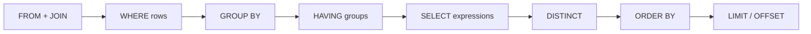
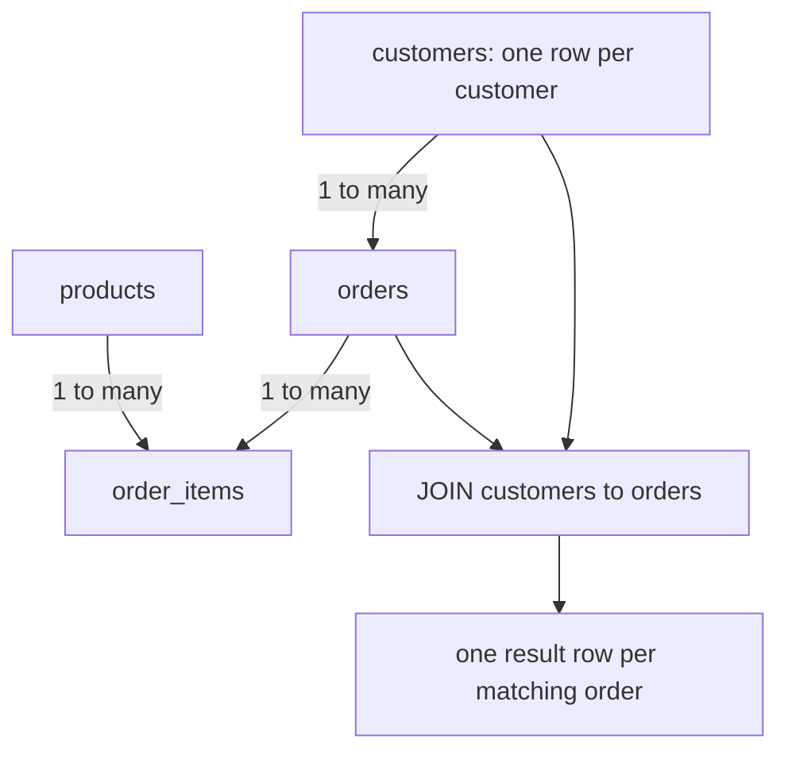
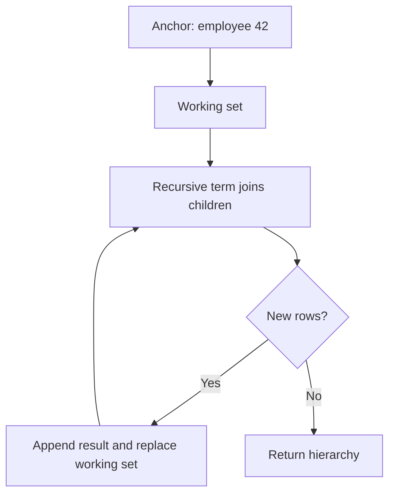
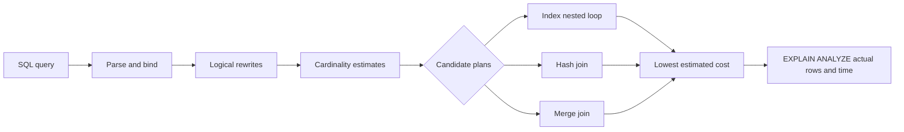

# SQL Querying, Joins, CTEs & Window Functions

SQL is a declarative language: a query states the result to produce, while the database optimizer chooses the physical operations that produce it. Backend interviews therefore test more than syntax—they test whether predicates, joins, grouping, nulls, pagination, and window calculations preserve meaning at production scale. This lesson builds a reliable mental model from basic filtering through recursive traversal and execution-plan diagnosis.

---

## 🟢 Beginner Level

### Practical SQL, joins, CTEs, and window functions

A relational query transforms one or more input relations into another relation. SELECT chooses output expressions, FROM identifies inputs, JOIN combines related rows, WHERE filters individual rows, GROUP BY forms groups, HAVING filters groups, and ORDER BY establishes presentation order.

SQL is written in an order convenient for humans, but its **logical evaluation order** is different:

1. `FROM` and `JOIN` build the input row set.
2. `WHERE` removes rows before grouping.
3. `GROUP BY` partitions remaining rows into groups.
4. `HAVING` removes groups.
5. SELECT computes output expressions.
6. DISTINCT removes duplicate output rows.
7. `ORDER BY` sorts the result.
8. LIMIT and OFFSET select a result slice.



This order explains why a SELECT alias often cannot be referenced in WHERE: the alias does not logically exist when row filtering occurs. A subquery or CTE can establish the derived name at an earlier query level when reuse is needed.

The optimizer may physically reorder safe operations, choose indexes, or change join algorithms. Those transformations must preserve the logical result.

### Selecting, filtering, and deriving values

SELECT should name only columns the caller needs. `SELECT *` increases network and serialization work, prevents some covering-index plans, and silently changes the API shape when a table gains a column.

```sql
SELECT
    o.id,
    o.customer_id,
    o.total,
    CASE
        WHEN o.total >= 1000 THEN 'HIGH_VALUE'
        WHEN o.total >= 100 THEN 'STANDARD'
        ELSE 'SMALL'
    END AS value_band
FROM orders AS o
WHERE o.status = 'PAID'
  AND o.created_at >= DATE '2026-08-01';
```

WHERE keeps rows for which its predicate evaluates to true. SQL uses three-valued logic—true, false, and unknown—so `column = NULL` is never the correct null check; use `IS NULL` or `IS NOT NULL`.

Useful predicate forms include:

- Equality and range comparison: `price >= 10`.
- Set membership: `status IN ('PAID', 'SHIPPED')`.
- Half-open time interval: `created_at >= :start AND created_at < :end`.
- Pattern matching: `name LIKE 'Ada%'`.
- Existence test: `EXISTS (subquery)`.

Half-open time ranges avoid double-counting boundary timestamps when adjacent windows are queried. They also avoid assumptions about the final precision of a day.

CASE is an expression, not control flow outside the query. It can classify rows, implement conditional aggregates, and define custom sort priorities.

### DISTINCT, duplicates, and relational identity

DISTINCT removes duplicate combinations across every selected expression:

```sql
SELECT DISTINCT customer_id, status
FROM orders;
```

This returns unique `(customer_id, status)` pairs, not one arbitrary order per customer. DISTINCT often hides a faulty join that multiplied rows; inspect join cardinality before adding it as a patch.

SQL tables can contain duplicate value combinations unless a key or unique constraint prevents them. Result sets also have no guaranteed order without an explicit ORDER BY, even when a plan appears to return primary-key order during development.

To select one meaningful row per group, use a window function or a database-specific feature with an explicit ordering rule. "Any row" is not deterministic enough for a stable API.

### Aggregates, grouping, and HAVING

Aggregate functions reduce multiple input rows to a value:

- COUNT counts rows or non-null expressions.
- SUM adds non-null numeric values.
- AVG computes the arithmetic mean of non-null values.
- MIN and MAX select extreme non-null values.

```sql
SELECT
    customer_id,
    COUNT(*) AS order_count,
    SUM(total) AS lifetime_value,
    AVG(total) AS average_order
FROM orders
WHERE status = 'PAID'
GROUP BY customer_id
HAVING SUM(total) >= 500
ORDER BY lifetime_value DESC;
```

WHERE removes unpaid rows *before* grouping. HAVING removes customer groups whose paid lifetime value is below 500 *after* aggregation.

Every selected expression in a grouped query must normally be either grouped or aggregated. Selecting an unrelated column would ask the database to choose one value from the group without a defined rule.

COUNT has important variants:

| Expression | Meaning |
|---|---|
| `COUNT(*)` | Count all rows, regardless of null columns |
| `COUNT(email)` | Count rows whose email is not null |
| `COUNT(DISTINCT customer_id)` | Count unique non-null customer identifiers |
| `SUM(CASE WHEN paid THEN 1 ELSE 0 END)` | Conditional count expressed portably |

### Ordering, limiting, and paging

ORDER BY is the only SQL clause that guarantees result order. Specify direction and a deterministic unique tie-breaker:

```sql
SELECT id, created_at, total
FROM orders
WHERE customer_id = :customerId
ORDER BY created_at DESC, id DESC
LIMIT 25 OFFSET 50;
```

LIMIT bounds returned rows, while OFFSET discards preceding rows. Page number 2 with size 25 maps to offset $2 \times 25 = 50$ when pages are zero-based.

Offset pagination is simple and permits page jumps, but deep offsets require scanning or walking past many entries. Concurrent inserts ahead of the offset can cause duplicates or gaps between requests.

Keyset pagination continues after the last ordered values instead:

```sql
SELECT id, created_at, total
FROM orders
WHERE customer_id = :customerId
  AND (created_at, id) < (:lastCreatedAt, :lastId)
ORDER BY created_at DESC, id DESC
LIMIT 25;
```

The order requires an index such as `(customer_id, created_at DESC, id DESC)` for an efficient seek.

---

## 🟡 Intermediate Level

### Join semantics and cardinality

A JOIN pairs rows according to a predicate. Before writing one, state expected cardinality: one-to-one, one-to-many, or many-to-many. Unexpected multiplication is usually a missing predicate or a misunderstood relationship.



The main join types are:

| Join | Rows retained | Typical use |
|---|---|---|
| INNER JOIN | Only matching rows from both sides | Orders with existing customers |
| LEFT JOIN | Every left row plus matching right rows | All customers, including those without orders |
| RIGHT JOIN | Every right row plus matching left rows | Symmetric to LEFT; often rewritten for readability |
| FULL OUTER JOIN | Every row from both sides | Reconcile two sources and expose unmatched rows |
| CROSS JOIN | Cartesian product | Generate all deliberate combinations |
| SELF JOIN | A table joined to itself | Employee-manager or interval comparisons |

```sql
SELECT c.id, c.name, COUNT(o.id) AS order_count
FROM customers AS c
LEFT JOIN orders AS o
  ON o.customer_id = c.id
GROUP BY c.id, c.name;
```

COUNT uses `o.id`, not `*`, because a left join emits one null-extended row for a customer without orders. `COUNT(*)` would incorrectly report one order for that customer.

A filter on the nullable right side belongs in ON when unmatched left rows must remain:

```sql
LEFT JOIN orders AS o
  ON o.customer_id = c.id
 AND o.status = 'PAID'
```

Putting `o.status = 'PAID'` in WHERE rejects null-extended rows and effectively turns the outer join into an inner join.

### Self, cross, and full outer joins

A self join gives two aliases to the same relation:

```sql
SELECT
    employee.name AS employee_name,
    manager.name AS manager_name
FROM employees AS employee
LEFT JOIN employees AS manager
  ON manager.id = employee.manager_id;
```

A cross join returns $|A| \times |B|$ rows. Joining 12 months to 8 regions deliberately generates $12 \times 8 = 96$ reporting buckets, but crossing two million-row tables would attempt $10^{12}$ pairs before filtering.

A full outer join is useful for reconciliation:

```sql
SELECT
    COALESCE(ledger.order_id, processor.order_id) AS order_id,
    ledger.amount AS ledger_amount,
    processor.amount AS processor_amount
FROM ledger
FULL OUTER JOIN processor
  ON processor.order_id = ledger.order_id
WHERE ledger.order_id IS NULL
   OR processor.order_id IS NULL
   OR ledger.amount <> processor.amount;
```

MySQL lacks native FULL OUTER JOIN, so applications often combine left and right anti-join branches with UNION ALL. Verify duplicate semantics carefully when emulating it.

### Subqueries and correlated subqueries

A scalar subquery returns at most one row and one column. A multi-row scalar result is an error because the surrounding expression expects one value.

```sql
SELECT id, total
FROM orders
WHERE total > (SELECT AVG(total) FROM orders);
```

An uncorrelated subquery can be evaluated independently. A **correlated subquery** refers to the outer row and is conceptually evaluated for each outer candidate:

```sql
SELECT c.id, c.name
FROM customers AS c
WHERE EXISTS (
    SELECT 1
    FROM orders AS o
    WHERE o.customer_id = c.id
      AND o.status = 'OVERDUE'
);
```

Optimizers frequently transform EXISTS into a semi-join rather than literally executing it row by row. Still, correlation can be expensive when predicates are not indexed or cannot be decorrelated.

EXISTS expresses "at least one match" and can stop at the first match. `IN (subquery)` is concise for membership but interacts with nulls, especially under NOT IN.

If a NOT IN subquery returns even one null, comparisons can become unknown and the query may return no rows. Prefer NOT EXISTS with a correlated equality for null-safe anti-join intent.

### Common table expressions and recursion

A **Common Table Expression (CTE)** gives a query block a name for the following statement:

```sql
WITH paid_totals AS (
    SELECT customer_id, SUM(total) AS total_paid
    FROM orders
    WHERE status = 'PAID'
    GROUP BY customer_id
)
SELECT c.id, c.name, p.total_paid
FROM customers AS c
JOIN paid_totals AS p ON p.customer_id = c.id
WHERE p.total_paid >= 1000;
```

A CTE improves decomposition and can be referenced more than once. Whether it is materialized or inlined is engine- and version-dependent, so inspect the execution plan rather than assuming it is free or an optimization barrier.

A **recursive CTE** has an anchor query, a recursive query that refers to the CTE, and a termination condition implied by producing no new rows.



```sql
WITH RECURSIVE org AS (
    SELECT id, manager_id, name, 0 AS depth, ARRAY[id] AS path
    FROM employees
    WHERE id = 42

    UNION ALL

    SELECT e.id, e.manager_id, e.name, org.depth + 1, org.path || e.id
    FROM employees AS e
    JOIN org ON e.manager_id = org.id
    WHERE NOT e.id = ANY(org.path)
)
SELECT id, name, depth
FROM org
ORDER BY depth, id;
```

The path detects cycles in malformed hierarchy data. Production recursion should also enforce a reasonable maximum depth or statement timeout.

### Window functions preserve row detail

An aggregate query collapses a group to one row. A **window function** computes across related rows while preserving every input row.

The OVER clause defines the window. PARTITION BY restarts the calculation for each group, and the window ORDER BY defines sequence within a partition.

```sql
SELECT
    customer_id,
    id AS order_id,
    total,
    ROW_NUMBER() OVER (
        PARTITION BY customer_id
        ORDER BY total DESC, id
    ) AS row_number,
    RANK() OVER (
        PARTITION BY customer_id
        ORDER BY total DESC
    ) AS rank_with_gaps,
    DENSE_RANK() OVER (
        PARTITION BY customer_id
        ORDER BY total DESC
    ) AS dense_rank,
    LAG(total) OVER (
        PARTITION BY customer_id
        ORDER BY created_at, id
    ) AS previous_total,
    LEAD(total) OVER (
        PARTITION BY customer_id
        ORDER BY created_at, id
    ) AS next_total
FROM orders;
```

For values `100, 100, 80`, ROW_NUMBER yields `1, 2, 3`, RANK yields `1, 1, 3`, and DENSE_RANK yields `1, 1, 2`. ROW_NUMBER arbitrarily breaks ties unless its ordering includes a unique tie-breaker.

LAG reads a prior row and LEAD reads a following row in window order. They are useful for change detection, time gaps, and comparing an observation with its neighbour without a self join.

### Top-N per group and window filtering

Window results are logically computed after WHERE, so they cannot usually be filtered in the same query level. Put the window in a CTE or subquery:

```sql
WITH ranked_orders AS (
    SELECT
        o.*,
        ROW_NUMBER() OVER (
            PARTITION BY customer_id
            ORDER BY created_at DESC, id DESC
        ) AS rn
    FROM orders AS o
)
SELECT customer_id, id, created_at, total
FROM ranked_orders
WHERE rn <= 3
ORDER BY customer_id, rn;
```

This returns the three latest orders per customer. A global `ORDER BY ... LIMIT 3` would return only three orders across all customers, which is a different question.

Some engines support QUALIFY for filtering window results directly. It is convenient but not part of every mainstream dialect, so portability may favour a CTE.

### Worked example: join cardinality and aggregate correctness

Assume:

- 100 customers.
- Each customer has exactly 5 orders, for 500 order rows.
- Each order has exactly 4 items, for 2,000 item rows.
- An average order total is stored once on `orders` as $80.

Joining all three tables produces:

$$
100 \times 5 \times 4 = 2{,}000\text{ result rows}
$$

This query is wrong:

```sql
SELECT c.id, SUM(o.total) AS revenue
FROM customers AS c
JOIN orders AS o ON o.customer_id = c.id
JOIN order_items AS i ON i.order_id = o.id
GROUP BY c.id;
```

Each order total repeats four times, so reported global revenue is:

$$
500 \times 4 \times \$80 = \$160{,}000
$$

Correct revenue is:

$$
500 \times \$80 = \$40{,}000
$$

Fix the query by removing the unnecessary item join, or pre-aggregate items to one row per order before joining. `SUM(DISTINCT o.total)` is not a correct general fix because two legitimate orders can have the same $80 total and would then be collapsed.

Cardinality reasoning catches both correctness defects and performance explosions before examining the plan.

---

## 🔴 Expert Level

### Correctness traps involving nulls and outer joins

SQL null means missing or unknown, not zero or an empty string. Most comparisons involving null produce unknown, and WHERE retains only true.

Use `IS DISTINCT FROM` in supporting engines for null-safe comparison. `a <> b` does not report a difference when either side is null because the result is unknown.

Predicates on the right side of a LEFT JOIN can change its meaning:

```sql
-- Preserves customers without a paid order
LEFT JOIN orders AS o
  ON o.customer_id = c.id
 AND o.status = 'PAID'

-- Rejects null-extended rows and behaves like an inner join
LEFT JOIN orders AS o ON o.customer_id = c.id
WHERE o.status = 'PAID'
```

Aggregates also treat null differently. SUM over no qualifying rows commonly returns null, while COUNT returns zero; use COALESCE only when the domain truly defines missing sum as zero.

Operator precedence can alter filters. Parenthesize mixed AND and OR expressions so business rules remain visible during maintenance.

### Query plans, sargability, and physical work

The optimizer estimates row counts and costs, then chooses scans, join order, join algorithms, aggregation strategy, and sort operations.



A predicate is **sargable** when the engine can use it as an index search argument. Wrapping an indexed column in a function often prevents a direct range scan:

```sql
-- Harder to use a plain created_at index
WHERE DATE(created_at) = DATE '2026-08-30'

-- Sargable half-open range
WHERE created_at >= TIMESTAMP '2026-08-30 00:00:00'
  AND created_at <  TIMESTAMP '2026-08-31 00:00:00'
```

EXPLAIN shows the planned operations, while EXPLAIN ANALYZE executes the query and reports actual timing and row counts. Use ANALYZE carefully on writes and expensive production queries because the statement really runs.

Large differences between estimated and actual rows point to stale statistics, correlated columns, skew, parameter sensitivity, or expressions the estimator cannot model. Bad estimates commonly produce a poor join order or algorithm.

### Query performance and pagination traps

Common performance failures include:

1. Selecting unused wide columns, increasing page reads and network cost.
2. N+1 application queries instead of one controlled join or batch.
3. Missing or non-selective indexes on join and filter columns.
4. Leading-wildcard patterns such as `LIKE '%term'` on a B-tree.
5. Functions or implicit casts on indexed columns.
6. Deep OFFSET pagination.
7. Sorting a large intermediate result that could be reduced earlier.
8. Correlated subqueries that cannot be decorrelated.
9. Joining multiple one-to-many relations before aggregation.
10. Treating a CTE as automatically materialized or automatically inlined.

Push selective row predicates before expensive joins when semantics permit, but do not move predicates across outer joins blindly. The optimizer handles many rewrites; clear SQL and accurate statistics give it better options.

Index window partition and ordering keys when the access pattern is important, but an index does not guarantee that a window avoids sorting. Filters, partition interleaving, and selected columns influence the chosen plan.

### Production query review workflow

Review queries in this order:

1. **Result grain** — state what one output row represents.
2. **Cardinality** — estimate rows after every join and filter.
3. **Null semantics** — identify nullable inputs and outer-join behaviour.
4. **Determinism** — define complete ordering for limits and row numbering.
5. **Correct aggregation** — aggregate at the intended grain before multiplying joins.
6. **Plan evidence** — compare estimates with actual rows and buffers.
7. **Index fit** — align selective predicates and ordered access with useful indexes.
8. **Boundedness** — cap rows, recursion depth, execution time, and application memory.
9. **Concurrency** — consider locks, snapshot age, and plan changes under parameters.
10. **Regression test** — include duplicates, nulls, empty groups, ties, and boundary timestamps.

Parameterized queries separate values from SQL structure and prevent injection. Dynamic ORDER BY identifiers cannot normally be bound as values, so map a public allow-list to trusted SQL expressions rather than concatenating raw client input.

### Common Misconceptions

1. **"WHERE and HAVING are interchangeable filters."**
   *Correction*: WHERE filters rows before aggregation, while HAVING filters groups after aggregation. Using HAVING for a row predicate can process far more data and can express different semantics.
2. **"DISTINCT is a safe fix for duplicate rows after a join."**
   *Correction*: It may hide an incorrect join cardinality and adds duplicate-removal work. Determine the intended result grain and fix the join or pre-aggregate at the correct level.
3. **"Results naturally arrive in primary-key order."**
   *Correction*: SQL relations are unordered, and plan changes, parallelism, or storage layout can alter observed order. Only ORDER BY establishes a contractual sequence.
4. **"A CTE always stores an intermediate table."**
   *Correction*: Modern optimizers may inline, materialize, or partially transform a CTE depending on engine, version, references, and hints. Read the execution plan instead of assuming its physical behaviour.
5. **"LIMIT makes every query cheap."**
   *Correction*: The engine may still scan, join, aggregate, or sort a large data set before knowing which limited rows qualify. An aligned index and selective predicates determine whether it can stop early.

### Interview Questions

**Q1. What is the difference between WHERE and HAVING?** `[easy]`

WHERE removes individual rows before grouping and aggregate calculation. HAVING removes groups after GROUP BY has computed aggregate values. Put ordinary row predicates in WHERE so fewer rows reach the aggregation stage and reserve HAVING for group conditions.

**Q2. How do counting every row and COUNT(column) differ?** `[easy]`

COUNT(*) counts every output row regardless of null values. COUNT(column) counts only rows where that expression is not null. This distinction matters especially after an outer join, where a null-extended right row should often contribute zero to the related-row count.

**Q3. What is the difference between ROW_NUMBER, RANK, and DENSE_RANK?** `[easy]`

ROW_NUMBER assigns a unique sequence even when ordering values tie. RANK gives tied rows the same rank and leaves gaps afterward, while DENSE_RANK gives the same rank without gaps. Add a unique tie-breaker to ROW_NUMBER ordering when the selected row must be deterministic.

**Q4. What does PARTITION BY do in a window function?** `[easy]`

PARTITION BY divides input rows into independent windows without collapsing them. Ranking, LAG, LEAD, or running calculations restart for each partition. Omitting it creates one window across the complete filtered result.

**Q5. Why can a WHERE predicate turn a LEFT JOIN into an effective INNER JOIN?** `[medium]`

A left join creates null-extended right-side columns for unmatched left rows. A WHERE predicate such as `right.status = 'PAID'` evaluates to unknown for those nulls, so the rows are rejected. Moving the condition into ON restricts matching right rows while preserving unmatched left rows.

**Q6. When would you use EXISTS instead of IN?** `[medium]`

EXISTS directly expresses that at least one correlated match is required and can stop after finding one. Optimizers often implement it as a semi-join, and NOT EXISTS has intuitive null-safe anti-join semantics. IN is concise for membership, but NOT IN can surprise when its subquery contains null.

**Q7. What are the parts of a recursive CTE?** `[medium]`

A recursive CTE contains an anchor query that seeds rows and a recursive query that consumes the current working set. UNION or UNION ALL connects them, and evaluation ends when the recursive term produces no new rows. Production queries should defend against cycles and excessive depth because malformed graphs can otherwise run until resource limits intervene.

**Q8. Why must ORDER BY include a unique tie-breaker for pagination?** `[medium]`

Rows with equal sort values have no defined relative order, so the database may arrange them differently between executions. LIMIT, OFFSET, and cursor boundaries can then duplicate or skip tied rows. Appending a stable unique key creates a total order that clients can continue reliably.

**Q9. How do LAG and LEAD replace some self joins?** `[medium]`

LAG returns a preceding row's expression and LEAD returns a following row's expression within the declared window order. They let a query compare neighbouring events, calculate time gaps, or detect changes without joining the table to itself by sequence. Correct results still require an ordering that uniquely defines each neighbour.

**Q10. Why is `SUM(DISTINCT order_total)` not a valid fix for duplicated totals after joining order items?** `[medium]`

DISTINCT deduplicates equal numeric values, not logical order identities. Two different orders can legitimately have the same total, so one would disappear from the sum. Aggregate at one row per order before joining further, or remove the multiplying join when it contributes nothing to the result.

**Q11. Scenario: a customer report shows one order for customers who have never ordered. What do you inspect?** `[hard]`

Inspect whether the query uses COUNT(*) after a LEFT JOIN from customers to orders. The outer join produces one null-extended result row for an unmatched customer, which COUNT(*) counts. Count a non-null order key such as `COUNT(order.id)` so unmatched customers correctly produce zero.

**Q12. Scenario: a previously fast query becomes slow for one tenant but remains fast for others. What do you check?** `[hard]`

Compare EXPLAIN ANALYZE estimates and actual rows for both tenant parameters, focusing on skew and join cardinality. Statistics may model the average tenant while one tenant owns most rows, causing a plan optimized for a small result to use nested loops on a huge result. Refresh or extend statistics, consider plan sensitivity and index design, and avoid forcing a universal plan without workload evidence.

**Q13. Why can deep OFFSET pagination be both slow and inconsistent?** `[hard]`

The engine may walk and discard every preceding index entry, so work grows with the offset even though few rows are returned. Inserts and deletes before the boundary shift row positions between requests, causing duplicates or omissions. Keyset pagination seeks from stable ordered values and usually gives bounded index work, at the cost of no arbitrary page jump.

**Q14. How would you diagnose a join that returns one hundred times more rows than expected?** `[hard]`

State the expected grain and calculate cardinality after each join using key uniqueness and relationship direction. Look for a missing join predicate, a many-to-many bridge, two independent one-to-many joins, implicit casts, or dirty duplicate keys. Validate each intermediate count and then inspect the plan; adding DISTINCT before fixing the relationship only hides the defect and spends more resources.

### Further Reading

- [PostgreSQL documentation: SELECT](https://www.postgresql.org/docs/current/sql-select.html) defines query clauses, logical processing, grouping, ordering, and limits.
- [PostgreSQL documentation: table expressions](https://www.postgresql.org/docs/current/queries-table-expressions.html) covers joins, WHERE, GROUP BY, and HAVING semantics.
- [PostgreSQL documentation: window functions](https://www.postgresql.org/docs/current/tutorial-window.html) explains partitions, ordering, frames, ranking, LAG, and LEAD.
- [PostgreSQL documentation: WITH queries](https://www.postgresql.org/docs/current/queries-with.html) documents CTE evaluation, recursion, cycle handling, and materialization.
