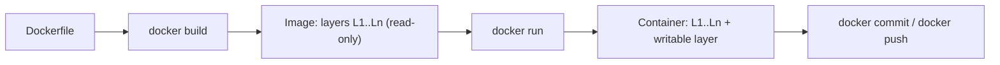
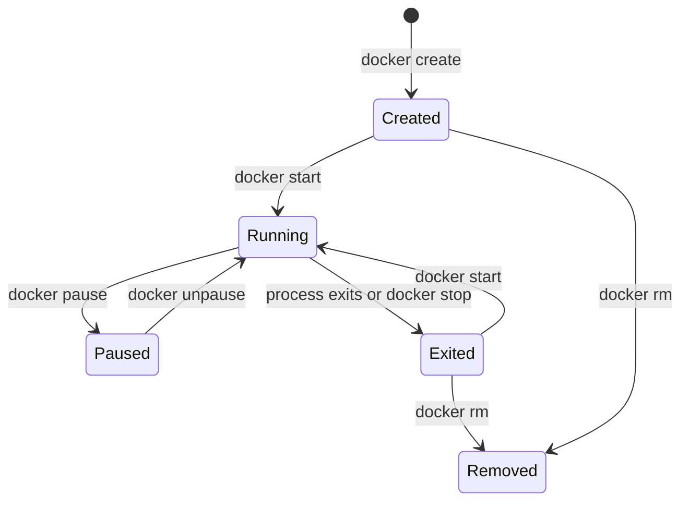
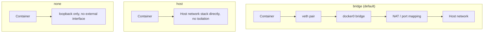
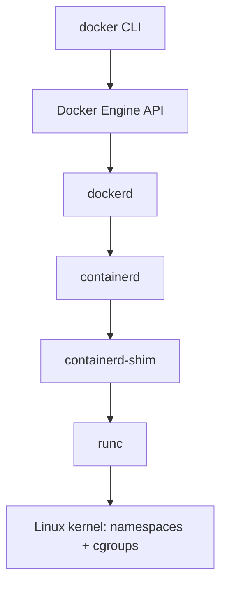

# Docker & Container Fundamentals

Docker packages an application with everything it needs to run — code, runtime, libraries,
configuration — into a single portable unit that behaves identically on a laptop, a CI
runner, and a production host. Interviewers probe this topic because "just use Docker" is
easy to say and genuinely tricky to reason about correctly: what a container actually
isolates, why image layers matter for build speed and security, and what happens when a
container is killed or runs out of memory all come up constantly in both trivia-style and
system-design interviews.

---

## 🟢 Beginner Level

### The Core Problem: "Works on My Machine"

Before containers, shipping software meant shipping a list of instructions: install this
runtime version, these system libraries, these environment variables, then run the app.
Every environment — a developer's laptop, a QA server, production — drifted slightly from
that list over time. A library upgraded on one host and not another, a missing environment
variable, a different OS patch level: any of these could make an application that worked in
one place fail in another, and the failure was often silent until it hit production.

Virtual machines solved isolation but not the drift problem cheaply. A VM bundles a full
guest operating system — its own kernel, its own init system, its own copy of every system
library — so it is heavyweight to build, slow to boot (tens of seconds), and large to
distribute (gigabytes, even for a trivial app). Containers solve the same packaging problem
without a second kernel: a container is a process that thinks it has its own filesystem,
network stack, and process tree, but it is still just a process running on the host's
existing kernel.

### What Is a Container? (An Isolated Process, Not a Lightweight VM)

A container is a normal operating-system process with restricted visibility. The Linux
kernel provides two independent mechanisms that make this possible, both of which predate
Docker itself:

- **Namespaces** control what a process can *see* — its own process IDs, its own network
  interfaces, its own mounted filesystem, its own hostname — so a process inside a container
  cannot observe or address anything outside its namespace by default.
- **Control groups (cgroups)** control what a process can *consume* — CPU shares, memory,
  I/O bandwidth, number of processes — and enforce hard or soft limits, so one container
  cannot starve every other process on the host.

Docker did not invent either mechanism. Its contribution was a consistent CLI, an image
format, and a distribution model (registries) built on top of primitives the kernel already
exposed. This is why a container starts in milliseconds and a VM takes seconds to tens of
seconds: there is no second kernel to boot, no hypervisor layer to cross for every system
call — only new namespaces and cgroup limits applied to an existing kernel.

| | Container | Virtual Machine |
|---|---|---|
| Isolation boundary | Kernel namespaces + cgroups | Hardware-level, via a hypervisor |
| Kernel | Shared with the host | Each VM runs its own kernel |
| Typical startup time | Tens to hundreds of milliseconds | Seconds to tens of seconds |
| Typical image size | Megabytes to low hundreds of MB | Gigabytes |
| Density per host | Hundreds of containers | Tens of VMs |
| Attack surface if compromised | Host kernel is a shared resource | Guest kernel is isolated from host |

### Images, Layers, and the Union Filesystem

A Docker **image** is a read-only template built from a stack of **layers**, where each
layer is the filesystem delta produced by one instruction in a Dockerfile. Layers are
content-addressed (identified by a hash of their contents) and shared across images: if two
images both start `FROM node:20`, they share every layer up to that point on disk, and a
registry only needs to transfer a layer once even if many images depend on it.

A **union filesystem** (Docker's default is `overlay2` on Linux) presents this stack of
read-only layers as one merged view, and adds one thin **writable layer** on top when a
container starts from the image. Writes inside a running container — a temp file, a log
line, an edited config — land only in that writable layer using copy-on-write: if the
container modifies a file that exists in a lower read-only layer, the filesystem copies that
file up into the writable layer first, then applies the change there. The underlying image
is never mutated. Delete the container and its writable layer is gone; the image, and every
other container built from it, is untouched.



### Writing a Dockerfile

A Dockerfile is a linear script of build instructions, each producing exactly one layer:

```dockerfile
FROM node:20-alpine
WORKDIR /app
COPY package*.json ./
RUN npm ci --omit=dev
COPY . .
EXPOSE 3000
CMD ["node", "server.js"]
```

`FROM` selects the base image. `WORKDIR` sets the working directory for every instruction
that follows. `COPY` brings files from the build context (the directory passed to
`docker build`) into the image. `RUN` executes a command at build time and commits its
filesystem changes as a new layer. `CMD` sets the default command a container runs when it
starts — it does not run at build time. `EXPOSE` is documentation: it does not open a port
by itself, it only declares intent; the port is actually published with `docker run -p`.

Instruction **order matters for caching**, covered in the Intermediate tier: Docker reuses a
cached layer whenever an instruction and its inputs are unchanged from the previous build, so
placing instructions that change rarely (installing dependencies) before instructions that
change often (copying application source) avoids re-running expensive steps on every build.

### Running and Managing Containers

```bash
docker build -t myapp:1.0 .
docker run -d --name myapp -p 8080:3000 -e NODE_ENV=production myapp:1.0
docker ps
docker logs -f myapp
docker exec -it myapp sh
docker stop myapp
docker rm myapp
```

`-d` runs detached (in the background). `-p 8080:3000` publishes container port 3000 on host
port 8080. `-e` sets an environment variable inside the container. `docker exec` runs an
additional process inside an already-running container — useful for debugging, but the
correct way to run a container's actual workload is still `CMD`/`ENTRYPOINT`, not `exec`
after the fact.

### The Container Lifecycle State Machine



`docker run` is shorthand for `docker create` followed by `docker start`. A **Paused**
container has every process inside it frozen (via the freezer cgroup) without being
terminated — useful for point-in-time filesystem snapshots without losing process state. An
**Exited** container still exists on disk (its writable layer and logs are retained) until
explicitly removed, which is why `docker ps -a` still lists stopped containers and why disk
usage grows over time without `docker system prune`.

---

## 🟡 Intermediate Level

### Namespaces and Cgroups: What Actually Isolates a Container

Six namespace types make up the isolation Docker relies on by default:

| Namespace | Isolates |
|---|---|
| `pid` | Process IDs — the container sees its own process 1, not the host's |
| `net` | Network interfaces, routing tables, ports |
| `mnt` | Mount points — the container's root filesystem view |
| `uts` | Hostname and domain name |
| `ipc` | System V IPC objects, POSIX message queues |
| `user` | UID/GID mapping — root inside the container can map to a non-root host UID |

A process inside a container with PID namespace isolation sees itself as PID 1 even though
the host sees it as, say, PID 48213. This matters operationally: PID 1 has special
signal-handling semantics in Linux — it does not receive default signal dispositions unless
it explicitly installs a handler — so an application that does not handle `SIGTERM` inside a
container can ignore `docker stop` entirely until the grace period expires and Docker sends
`SIGKILL`. This is a very common source of containers that "don't shut down cleanly."

Cgroups are configured per container from `docker run` flags: `--memory=512m` sets a hard
memory ceiling enforced by the kernel, `--cpus=1.5` sets a CPU quota, `--pids-limit=100`
caps the number of processes the container can fork. Exceeding the memory limit does not
throttle the process gracefully — the kernel's OOM killer terminates it, covered in the
Expert tier.

### Layer Caching and Multi-Stage Builds

Docker caches each layer keyed by the instruction and its inputs. For `COPY`, the cache key
includes a checksum of the copied files; for `RUN`, it is the exact command string plus the
state of the layer below it. The first instruction whose cache key misses invalidates every
layer after it, even if those later instructions would have produced identical output — this
is why instruction order is a real performance lever, not a style preference:

```dockerfile
# Cache-hostile: any source change invalidates npm ci
COPY . .
RUN npm ci --omit=dev

# Cache-friendly: dependency layer only rebuilds when package*.json changes
COPY package*.json ./
RUN npm ci --omit=dev
COPY . .
```

**Multi-stage builds** solve a different, larger problem: a build often needs tools the
runtime does not — a compiler, a full SDK, dev dependencies — but shipping those in the
production image bloats it and expands the attack surface. A multi-stage Dockerfile uses
several `FROM` blocks and copies only the finished artifact between them:

```dockerfile
FROM golang:1.22 AS build
WORKDIR /src
COPY . .
RUN CGO_ENABLED=0 go build -o /out/server .

FROM alpine:3.19
COPY --from=build /out/server /server
ENTRYPOINT ["/server"]
```

Worked comparison, real numbers from building the same Go service both ways: a naive
single-stage build `FROM golang:1.22` that ships the full Go toolchain, module cache, and
source tree alongside the compiled binary produces an image around **900 MB**. The
multi-stage version above, which discards everything except the statically-linked binary and
starts the final image from `alpine:3.19` (roughly 7 MB base), produces an image around
**15-20 MB** — a reduction of more than 40x, with zero change to the running application's
behavior, because the `golang:1.22` build stage never becomes part of the shipped image at
all.

### Container Networking Modes



| Mode | Isolation | Typical use |
|---|---|---|
| `bridge` | Own network namespace, NAT'd through a virtual bridge to the host | Default — most single-host containers |
| `host` | None — shares the host's network namespace directly | Maximum network performance, no port remapping needed |
| `none` | Full — no external network interface at all | Batch jobs that only need local processing |
| `overlay` | Own namespace, routed across multiple hosts via VXLAN | Multi-host container networking (Swarm, and conceptually what Kubernetes's CNI layer provides) |

In default `bridge` mode, each container gets a private IP on a virtual subnet created by
the `docker0` bridge; `docker run -p 8080:3000` adds an `iptables` NAT rule that forwards
traffic arriving on the host's port 8080 to the container's private IP on port 3000. This is
why two containers on the same bridge network can reach each other directly on their
container ports without any `-p` mapping at all — the mapping is only needed to reach a
container *from outside the host*.

### Volumes, Bind Mounts, and tmpfs

A container's writable layer is deleted with the container, so anything that must outlive a
single container's lifetime — a database's data directory, uploaded files — needs to live
outside it:

- **Volumes** are storage areas fully managed by Docker (`docker volume create`), stored
  under Docker's own data directory, portable across hosts that share the same driver, and
  the recommended default for persistent application data.
- **Bind mounts** map an exact path on the host filesystem into the container
  (`-v /host/path:/container/path`). They are the natural choice for local development (live
  source-code editing) but tie the container to that host's exact directory layout, which
  makes them a poor fit for production portability.
- **tmpfs mounts** live in host memory only, never touch disk, and are wiped when the
  container stops — appropriate for secrets or scratch data that must never be persisted.

### Docker Compose for Multi-Container Applications

Most real applications are more than one container: an API, a database, a cache. Compose
describes them declaratively in one YAML file and manages them as a unit:

```yaml
services:
  api:
    build: .
    ports: ["8080:3000"]
    depends_on: [db]
    environment:
      DATABASE_URL: postgres://db:5432/app
  db:
    image: postgres:16
    volumes: ["dbdata:/var/lib/postgresql/data"]
volumes:
  dbdata:
```

Compose creates a private bridge network per project automatically, so `api` can reach `db`
by its service name as a DNS hostname — the string `db` resolves to that container's private
IP without any manual network configuration. `depends_on` only orders container *start*, not
readiness: Postgres accepting connections can take longer than the container starting, which
is a common source of "connection refused" on first boot and is normally solved with an
application-level retry loop or a Compose `healthcheck`, not by assuming start order implies
ready order.

### Image Distribution: Registries, Tags, and Digests

`docker push`/`docker pull` move images to and from a **registry** (Docker Hub, a private
registry, a cloud provider's container registry). A **tag** (`myapp:1.0`, `myapp:latest`) is
a mutable, human-friendly pointer that can be reassigned to a different image at any time —
`latest` is not "the newest version," it is just whatever tag was pushed last, which is
exactly why pinning a specific version tag (or better, a digest) matters for reproducible
deployments. A **digest** (`myapp@sha256:abc123...`) is the immutable, content-addressed
identity of an exact image — the same digest always resolves to bit-for-bit identical
content, which is what production deployment manifests should reference when reproducibility
matters more than convenience.

---

## 🔴 Expert Level

### The Container Runtime Stack: From CLI to Kernel

`docker run` is the top of a layered stack, not a single monolithic program:



`dockerd` handles image builds, networking, and the high-level API. It delegates actual
container execution to **containerd**, a separate daemon that manages the container
lifecycle (start, stop, pause) and is itself a Cloud Native Computing Foundation project used
outside Docker entirely — Kubernetes talks to containerd directly via the Container Runtime
Interface (CRI), with no `dockerd` involved at all in a modern cluster. containerd spawns a
**shim** process per container so that container processes stay alive and reparented
correctly even if `containerd` itself restarts. The shim invokes **runc**, a low-level tool
that does the actual `clone()`/`unshare()`/cgroup setup calls that create the namespaces and
limits — runc is the reference implementation of the **OCI Runtime Specification**, an
industry-standard contract that any compliant runtime (runc, `crun`, `gVisor`'s `runsc`) can
satisfy, which is why the ecosystem is not locked to one vendor's implementation.

### Storage Drivers: `overlay2` Internals

`overlay2` implements the union filesystem using four directories per container: `lowerdir`
(the stacked read-only image layers), `upperdir` (the writable layer), `workdir` (internal
scratch space required by the kernel overlay driver), and `merged` (the single view the
container actually sees, combining all of the above). Reading a file that exists in a lower
layer is effectively free — it is served directly from that layer. The first *write* to a
file that only exists in a lower layer triggers **copy-up**: the whole file is copied into
`upperdir` before the write is applied, which means a single-byte write to a large file
incurs a full-file copy the first time it happens. This is a known performance trap for
workloads that modify large files repeatedly inside a container instead of routing that I/O
to a mounted volume.

### Security: Capabilities, Seccomp, and Rootless Containers

Root inside a container is not root on the host, but it is closer to it than most engineers
assume. Docker drops a subset of Linux **capabilities** by default (a container does not get
`CAP_SYS_ADMIN`, for instance, which would allow mounting arbitrary filesystems), but it does
not drop all of them, and a container run with `--privileged` disables this entirely,
granting every capability and access to every host device — effectively erasing the
isolation boundary. **Seccomp** (secure computing mode) filters which syscalls a container's
processes are allowed to make at all; Docker's default seccomp profile blocks around 44
syscalls, including ones with a history of container-escape vulnerabilities, like
`clone` with certain flag combinations. **Rootless mode** runs the Docker daemon itself as a
non-root user, using user namespaces to map a container's root user to an unprivileged host
UID, so that even a full container escape does not hand an attacker host root — this trades
some functionality (binding to ports below 1024 needs extra configuration) for a materially
smaller blast radius if a container is compromised.

### Production Failure Modes and Operational Gotchas

**OOM kills.** When a container's cgroup memory usage exceeds its `--memory` limit, the
kernel's OOM killer terminates a process inside that cgroup — not gracefully, no signal
handler runs, the process is killed outright. `docker inspect` reports `OOMKilled: true` and
the container typically exits with code **137** (128 + signal 9, `SIGKILL`). This is
distinct from an application-level out-of-memory error and cannot be caught or logged from
inside the process; the only evidence is the exit code and the daemon's own event log.

**Zombie processes.** If a container's `CMD` spawns child processes but the main process
never calls `wait()` on them, exited children become zombies that PID 1 must reap. Outside a
container the init system reaps orphans automatically; inside a minimal container image with
no real init system, this reaping never happens, and zombies accumulate until the
`--pids-limit` is hit. The standard fix is running a minimal init (`tini`, or Docker's
built-in `--init` flag) as PID 1 instead of the application directly.

**Signal handling on shutdown.** `docker stop` sends `SIGTERM`, waits a grace period
(10 seconds by default), then sends `SIGKILL` if the container has not exited. An application
that does not install a `SIGTERM` handler is killed ungracefully every time, dropping
in-flight requests and skipping cleanup — this is one of the most common causes of "container
restarts are causing errors" reports in production.

### Common Misconceptions

- **"Containers are lightweight virtual machines."** They are isolated processes sharing the
  host kernel, not machines with their own kernel. This is why a container cannot run a
  different kernel than its host (a Linux container cannot run on a Windows kernel without a
  compatibility layer) and why a kernel vulnerability is a container-escape risk in a way it
  is not for a VM.
- **"`docker stop` immediately kills the container."** It sends `SIGTERM` first and only
  escalates to `SIGKILL` after the grace period elapses — an application that handles
  `SIGTERM` gets a real chance to shut down cleanly.
- **"Volumes and bind mounts are interchangeable."** Both persist data outside the writable
  layer, but volumes are Docker-managed and portable, bind mounts are tied to an exact host
  path — using a bind mount in production for stateful data creates a hidden dependency on
  that specific host's filesystem layout.
- **"A smaller base image is always more secure."** It reduces attack surface (fewer
  installed packages to have vulnerabilities), but it does not replace actually scanning
  images for known CVEs or keeping the base image patched — a small but stale base image can
  still ship a known-vulnerable library.
- **"`EXPOSE` in a Dockerfile publishes a port."** It only documents intent for humans and
  tooling; the port is actually published at `docker run` time with `-p`, and omitting `-p`
  means the port is not reachable from outside the container regardless of what `EXPOSE`
  says.

### Interview Questions

**Q1. What is the actual difference between a container and a virtual machine?** `[easy]`

A container is an isolated process sharing the host's existing kernel, using namespaces to
restrict what it can see and cgroups to limit what it can consume — no second kernel, no
hypervisor. A virtual machine runs its own complete guest kernel on top of a hypervisor that
emulates hardware, which is why VMs take seconds to boot and containers take milliseconds.
The practical consequence is density: a host can run hundreds of containers in the memory
footprint of a few dozen VMs, because there is no per-instance kernel overhead.

**Q2. What does the `-p 8080:3000` flag actually do when you run a container?** `[easy]`

It publishes container port 3000 on host port 8080 by adding a NAT rule (via `iptables` in
the default bridge network) that forwards traffic arriving on the host's port 8080 to the
container's private bridge IP on port 3000. Without `-p`, the container is still reachable on
port 3000 from other containers on the same bridge network, since they can address it
directly by its private IP or Compose service name — the mapping is only required to reach it
from outside the host.

**Q3. Why does image layer order in a Dockerfile affect build speed?** `[easy]`

Docker caches each layer keyed by its instruction and inputs, and reuses a cached layer only
if every layer before it also hit the cache — one cache miss invalidates everything after it.
Placing instructions that change rarely, like installing dependencies from a lockfile, before
instructions that change on every commit, like copying application source, means the
expensive dependency-install step only reruns when the lockfile actually changes. Getting the
order backwards forces a full dependency reinstall on every single code change.

**Q4. What's the difference between `CMD` and `ENTRYPOINT`?** `[easy]`

`CMD` sets a default command that a user can fully override by passing arguments to
`docker run`; `ENTRYPOINT` sets a fixed command that always runs, with any `docker run`
arguments (or `CMD`, if both are present) appended to it rather than replacing it. A common
pattern combines both: `ENTRYPOINT ["python", "app.py"]` with `CMD ["--port", "8080"]` lets a
user override just the port with `docker run myapp --port 9090` without being able to
accidentally replace the interpreter being invoked.

**Q5. Your container exits immediately with code 137 right after startup. What do you check first?** `[medium]`

Exit code 137 is 128 plus signal 9, meaning the process received `SIGKILL` — in a container
this is almost always the kernel's OOM killer terminating a process that exceeded its
cgroup's `--memory` limit. I would run `docker inspect` on the container and check the
`OOMKilled` field, then check what memory limit was actually set versus what the application
needs at startup; a common cause is a JVM or Node process whose default heap sizing assumes
the full host's memory rather than the container's cgroup limit, so it allocates well past a
tight `--memory` ceiling. If `OOMKilled` is false, I would look at the application's own logs
for an unhandled startup exception instead.

**Q6. Explain what happens, step by step, from `docker run` to a process executing inside a new container.** `[medium]`

The Docker CLI sends the request to `dockerd` over the Engine API. `dockerd` resolves and
pulls the image if needed, then hands off actual container execution to `containerd`, which
creates a `containerd-shim` process for this specific container so the container survives
even if `containerd` restarts. The shim invokes `runc`, which performs the low-level kernel
work — creating new namespaces with `clone()`/`unshare()`, setting up the cgroup limits,
pivoting the root filesystem into the merged overlay view — and then executes the image's
`ENTRYPOINT`/`CMD` inside that fully isolated environment. `runc` exits once the container
process starts; the shim keeps running as the long-lived parent that tracks the container's
exit status.

**Q7. Why can a single-byte write to a large file inside a container be surprisingly slow?** `[medium]`

With the `overlay2` storage driver, a file that only exists in a lower, read-only image layer
must be fully copied into the writable `upperdir` layer before any write to it can be
applied — this is copy-up, and it happens on the *first* write, regardless of how small that
write is. A workload that repeatedly modifies a large file that started in the image layer
pays this full-file-copy cost on its first write, which can look like an unexplained latency
spike. The standard fix is mounting a volume for any path that receives significant write
traffic, since volumes bypass the union filesystem's copy-up behavior entirely.

**Q8. What's the difference between a Docker volume and a bind mount, and when would you use each?** `[medium]`

A volume is storage fully managed by Docker — created and tracked under Docker's own data
directory, portable across hosts using the same driver, and the recommended default for
persistent application data like a database's files. A bind mount maps an exact host
filesystem path into the container, which is ideal for local development (editing source on
the host and seeing it live inside the container) but creates a hard dependency on that
specific host's directory layout, making it a poor choice for anything meant to be deployed
consistently across different machines. In production, I would use volumes for persistent
data and avoid bind mounts except for well-understood cases like mounting a host's Docker
socket or a known-fixed configuration path.

**Q9. A service depends on Postgres in Docker Compose and fails with connection-refused on the first deploy but works on every restart after. Why?** `[medium]`

`depends_on` in Compose controls start order, not readiness — it guarantees the Postgres
*container* starts before the application container, but not that Postgres has finished
initializing and is actually accepting connections yet, and Postgres's own startup (creating
the data directory, running recovery) can take longer than the application's own boot time.
On the first deploy the application starts and tries to connect before Postgres is ready; on
subsequent restarts Postgres's data directory already exists and it starts faster, so the
race is less likely to be hit. The correct fix is either a Compose `healthcheck` combined
with `depends_on: condition: service_healthy`, or an application-level retry loop with
backoff around the initial database connection.

**Q10. Why does building the same application with a multi-stage Dockerfile produce a dramatically smaller image than a single-stage build?** `[medium]`

A single-stage build ships every layer created during the build, including the full compiler
toolchain, build-time dependencies, and intermediate artifacts, alongside the final
application — for a compiled language like Go, this can mean shipping an entire ~900 MB Go
toolchain image just to run a ~15 MB static binary. A multi-stage build uses one `FROM` stage
to compile the artifact and a separate, minimal final `FROM` stage that only `COPY --from=`
the finished binary, so none of the build-time tooling becomes part of the shipped image at
all. Beyond image size, this also meaningfully shrinks the attack surface, since a compiler
and build toolchain in a production image is pure unnecessary risk.

**Q11. Why is running a container with `--privileged` dangerous, specifically?** `[hard]`

`--privileged` disables the default capability restrictions and device access controls
entirely, granting the container every Linux capability (including ones like `CAP_SYS_ADMIN`
that allow mounting arbitrary filesystems) and direct access to all host devices. This
effectively collapses the isolation boundary namespaces and cgroups are supposed to provide —
a process inside a privileged container can, for example, mount the host's root filesystem
from inside the container and modify it directly, which is equivalent to root access on the
host itself. It should only ever be used for containers that genuinely need low-level
hardware or kernel access (certain monitoring agents, `docker-in-docker` setups), never as a
default fix for a permissions error.

**Q12. How does rootless Docker reduce the blast radius of a container escape, given that container root is not host root either way by default?** `[hard]`

Even in normal (non-rootless) Docker, the *daemon* itself runs as root on the host, so a
vulnerability that lets an attacker escape a container and reach the daemon can still lead to
host root. Rootless mode runs `dockerd` itself as an unprivileged host user, and uses Linux
user namespaces to map the container's root user to that same unprivileged host UID rather
than to actual host root. If a container escape occurs under rootless mode, the attacker
lands as an unprivileged user on the host, not as root, which contains the damage to whatever
that unprivileged account can reach. The trade-off is real: some operations that assume host
root, like binding to ports below 1024 or certain storage driver features, need extra
configuration or are unavailable under rootless mode.

**Q13. Your team keeps seeing zombie processes accumulate inside long-running containers until the container eventually hits its process limit and stops accepting new work. What's the root cause and the fix?** `[hard]`

Outside a container, the OS init process (PID 1) automatically reaps orphaned child processes
when they exit, preventing zombies from accumulating. Inside a minimal container image, the
application itself is usually PID 1, and most application code — unlike a real init system —
never calls `wait()` on child processes it did not directly spawn or lose track of, so exited
children become permanent zombie entries in the process table until the container itself is
killed. The fix is running a minimal init process as PID 1 instead of the application
directly — either Docker's built-in `--init` flag (which wraps the entrypoint with `tini`) or
an explicit `tini`/similar binary as the actual entrypoint — so a real reaper is in place and
the application process runs as its child instead of as PID 1 itself.

**Q14. Two images, `myapp:latest` pulled today and `myapp:latest` pulled yesterday, produce different behavior in production. How is this possible, and how do you prevent it?** `[hard]`

A tag like `latest` is a mutable pointer, not a fixed identity — anyone can push a new image
and reassign the `latest` tag to it at any time, so `myapp:latest` pulled on two different
days can resolve to two genuinely different images with different content and different
behavior, even though the tag string never changed. This is why pinning deployments to a tag
alone is not reproducible. The fix is referencing an image by its immutable digest
(`myapp@sha256:...`) in deployment manifests instead of a mutable tag, or at minimum pinning
to a specific version tag that a team's process guarantees is never reassigned once pushed —
digests are the only reference that is guaranteed to resolve to bit-for-bit identical content
every time.

Further reading: the [OCI Runtime Specification](https://github.com/opencontainers/runtime-spec)
defines the contract `runc` and its alternatives implement; the
[Docker `overlay2` storage driver documentation](https://docs.docker.com/engine/storage/drivers/overlayfs-driver/)
covers copy-up behavior in more depth; [containerd's architecture docs](https://containerd.io/docs/)
describe the shim/runtime split referenced in Q6.
