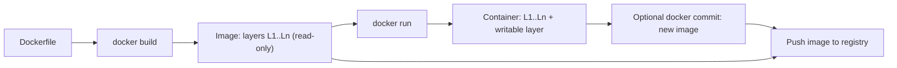
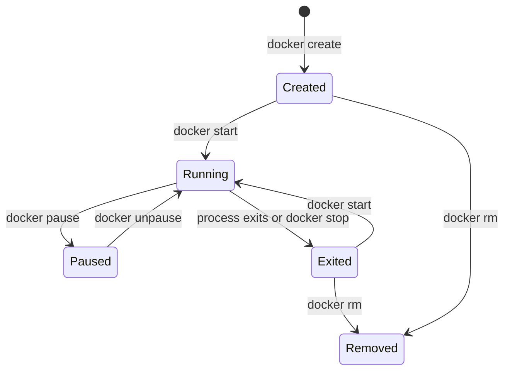
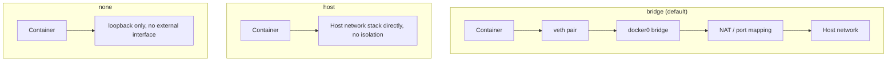
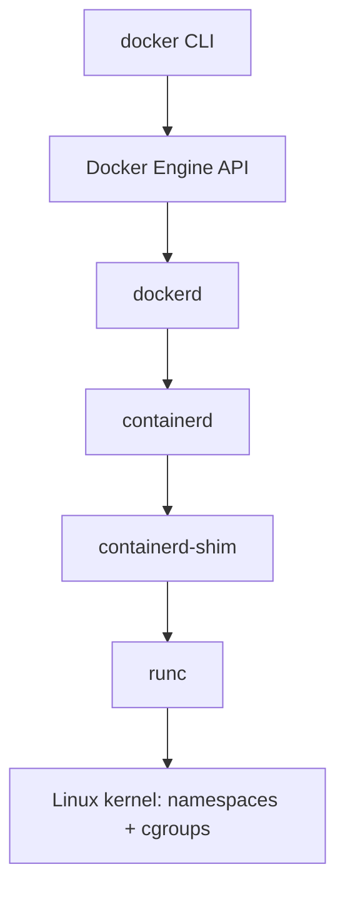

# Docker & Container Fundamentals

Docker packages an application with everything it needs to run — code, runtime, libraries,
configuration — into a portable image that makes application dependencies repeatable
across a laptop, a CI runner, and a production host. Host kernels, CPU architecture,
external services, and runtime configuration can still differ. Interviewers probe this topic because "just use Docker" is
easy to say and genuinely tricky to reason about correctly: what a container actually
isolates, why image layers matter for build speed and security, and what happens when a
container is killed or runs out of memory all come up constantly in both trivia-style and
system-design interviews.

### Start here: what you should be able to do

**Before:** Know how to start a backend application locally. No container experience is needed.
**After:** Explain image versus container, build and run a small service, and debug a failed start using logs, ports, and environment variables.

Think of an **image** as the packaged recipe and a **container** as one running instance of that recipe. A container restart does not fix a wrong image or missing secret; check the application logs and runtime settings first.

---

## 🟢 Beginner Level

### The Core Problem: "Works on My Machine"

Before containers, shipping software meant shipping a list of instructions: install this
runtime version, these system libraries, these environment variables, then run the app.
Every environment — a developer's laptop, a QA server, production — drifted slightly from
that list over time. A library upgraded on one host and not another, a missing environment
variable, a different OS patch level: any of these could make an application that worked in
one place fail in another, and the failure was often silent until it hit production.

Virtual machines solved isolation but not the drift problem cheaply. A VM bundles a full
guest operating system — its own kernel, its own init system, its own copy of every system
library — so it is heavyweight to build, often more expensive to boot and distribute because it includes a guest kernel. Containers solve the same packaging problem
without a second kernel: a container is a process that thinks it has its own filesystem,
network stack, and process tree, but it is still just a process running on the host's
existing kernel.

### What Is a Container? (An Isolated Process, Not a Lightweight VM)

A container is a normal operating-system process with restricted visibility. The Linux
kernel provides two independent mechanisms that make this possible, both of which predate
Docker itself:

- **Namespaces** control what a process can *see* — its own process IDs, its own network
  interfaces, its own mounted filesystem, its own hostname — so a process inside a container
  gets a scoped view. Mounted host paths and configured network access still expose selected resources.
- **Control groups (cgroups)** control what a process can *consume* — CPU shares, memory,
  I/O bandwidth, number of processes — and enforce configured limits. Docker containers have no CPU or memory limit by default; namespaces alone do not prevent resource exhaustion.

Docker did not invent either mechanism. Its contribution was a consistent CLI, an image
format, and a distribution model (registries) built on top of primitives the kernel already
exposed. A container need not boot another kernel, which can reduce startup overhead.
Application initialization, image downloads and storage still determine observed startup;
a VM does not cross a hypervisor boundary for every ordinary guest system call.

| | Container | Virtual Machine |
|---|---|---|
| Isolation boundary | Kernel namespaces + cgroups | Hardware-level, via a hypervisor |
| Kernel | Shared with the host | Each VM runs its own kernel |
| Startup work | Start isolated processes, plus application initialization | Boot/resume guest, then initialize application |
| Distribution size | Application and user-space dependencies | Guest OS and application; compare actual artifacts |
| Density per host | Lower per-instance kernel overhead; workload-dependent | Guest overhead; workload-dependent |
| Attack surface if compromised | Host kernel is a shared resource | Guest kernel is isolated from host |

### Images, Layers, and the Union Filesystem

A Docker **image** is a read-only template built from a stack of **layers**, where each
filesystem layer records a build step's changes. Metadata instructions such as `CMD` need not create a filesystem layer. Layers are
content-addressed (identified by a hash of their contents) and shared across images: if two
images both start `FROM node:24`, they share every layer up to that point on disk, and a
registry only needs to transfer a layer once even if many images depend on it.

A **union filesystem** (commonly Linux OverlayFS) presents this stack of
read-only layers as one merged view, and adds one thin **writable layer** on top when a
container starts from the image. Writes inside a running container — a temp file, a log
line, an edited config — land only in that writable layer using copy-on-write: if the
container modifies a file that exists in a lower read-only layer, the filesystem copies that
file up into the writable layer first, then applies the change there. The underlying image
is never mutated. Delete the container and its writable layer is gone; the image, and every
other container built from it, is untouched. Fresh Docker Engine 29+ installations default
to the containerd image store with an OverlayFS snapshotter; upgraded installations may
retain the legacy `overlay2` storage driver. Inspect the actual engine rather than assuming either.


```mermaid
flowchart LR
    A["Dockerfile"] --> B["docker build"]
    B --> C["Image: layers L1..Ln (read-only)"]
    C --> D["docker run"]
    D --> E["Container: L1..Ln + writable layer"]
    E --> F["Optional docker commit: new image"]
    F --> G["Push image to registry"]
    C --> G
```

### Writing a Dockerfile

This excerpt assumes `package.json`, a lockfile and `server.js` listening on `0.0.0.0:3000`.
A Dockerfile is a sequence of build instructions; filesystem-changing steps contribute to image layers:

```dockerfile
FROM node:24-alpine
WORKDIR /app
COPY package*.json ./
RUN npm ci --omit=dev
COPY . .
EXPOSE 3000
CMD ["node", "server.js"]
```

`FROM` selects the base image. `WORKDIR` sets the working directory for every instruction
that follows. `COPY` brings files from the build context (the directory passed to
`docker build`) into the image. `RUN` executes a command at build time and commits its
filesystem changes as a new layer. `CMD` sets the default command a container runs when it
starts — it does not run at build time. `EXPOSE` is documentation: it does not open a port
by itself, it only declares intent; the port is actually published with `docker run -p`.

Instruction **order matters for caching**, covered in the Intermediate tier: Docker reuses a
cached layer whenever an instruction and its inputs are unchanged from the previous build, so
placing instructions that change rarely (installing dependencies) before instructions that
change often (copying application source) avoids re-running expensive steps on every build.

### Running and Managing Containers

```bash
docker build -t myapp:1.0 .
docker run -d --name myapp -p 127.0.0.1:8080:3000 -e NODE_ENV=production myapp:1.0
docker ps
docker logs -f myapp
docker exec -it myapp sh
docker stop myapp
docker rm myapp
```

`-d` runs detached (in the background). `-p 127.0.0.1:8080:3000` publishes container port 3000
on the host loopback interface, suitable for this local example. Omitting the host IP, as in
`-p 8080:3000`, normally publishes on all host interfaces; firewall and network configuration still matter. `-e` sets an environment variable inside the container. `docker exec` runs an
additional process inside an already-running container — useful for debugging, but the
correct way to run a container's actual workload is still `CMD`/`ENTRYPOINT`, not `exec`
after the fact.

### The Container Lifecycle State Machine


```mermaid
stateDiagram-v2
    [*] --> Created: docker create
    Created --> Running: docker start
    Running --> Paused: docker pause
    Paused --> Running: docker unpause
    Running --> Exited: process exits or docker stop
    Exited --> Running: docker start
    Exited --> Removed: docker rm
    Created --> Removed: docker rm
```

`docker run` is shorthand for `docker create` followed by `docker start`. A **Paused**
container has every process inside it frozen (via the freezer cgroup) without being
terminated. Pausing does not flush application buffers or guarantee an application-consistent
snapshot; use the database's backup protocol for its data. An
**Exited** container still exists on disk (its writable layer and logs are retained) until
explicitly removed, which is why `docker ps -a` still lists stopped containers and why disk
usage grows over time without `docker system prune`.

---

## 🟡 Intermediate Level

### Namespaces and Cgroups: What Actually Isolates a Container

These are common Linux namespace types; which are isolated depends on runtime flags.
User namespace remapping is optional in rootful Docker, not enabled merely by using a container:

| Namespace | Isolates |
|---|---|
| `pid` | Process IDs — the container sees its own process 1, not the host's |
| `net` | Network interfaces, routing tables, ports |
| `mnt` | Mount points — the container's root filesystem view |
| `uts` | Hostname and domain name |
| `ipc` | System V IPC objects, POSIX message queues |
| `user` | UID/GID mapping — root inside the container can map to a non-root host UID |

The initial process inside a container with PID namespace isolation sees itself as PID 1 even though
the host sees it as, say, PID 48213. This matters operationally: PID 1 has special
signal-handling semantics in Linux — many signals with default terminating actions are ignored unless
it installs a handler; `SIGKILL` and `SIGSTOP` remain special exceptions — so an application that does not handle `SIGTERM` inside a
container can ignore `docker stop` entirely until the grace period expires and Docker sends
`SIGKILL`. This is a very common source of containers that "don't shut down cleanly."

Cgroups are configured per container from `docker run` flags: `--memory=512m` sets a hard
memory ceiling enforced by the kernel, `--cpus=1.5` sets a CPU quota, `--pids-limit=100`
caps the number of processes the container can fork. The kernel first tries reclaiming memory. If it cannot satisfy an allocation within the
configured limit, a cgroup out-of-memory event can kill a process; inspect evidence rather
than assuming every memory spike kills the container.

### Layer Caching and Multi-Stage Builds

Docker caches each layer keyed by the instruction and its inputs. For `COPY`, the cache key
includes a checksum of the copied files; for `RUN`, it is the exact command string plus the
state of the layer below it. The first instruction whose cache key misses invalidates every
layer after it, even if those later instructions would have produced identical output — this
is why instruction order is a real performance lever, not a style preference:

```dockerfile
# Cache-hostile: any source change invalidates npm ci
COPY . .
RUN npm ci --omit=dev

# Cache-friendly: dependency layer only rebuilds when package*.json changes
COPY package*.json ./
RUN npm ci --omit=dev
COPY . .
```

**Multi-stage builds** solve a different, larger problem: a build often needs tools the
runtime does not — a compiler, a full SDK, dev dependencies — but shipping those in the
production image bloats it and expands the attack surface. A multi-stage Dockerfile uses
several `FROM` blocks and copies only the finished artifact between them:

```dockerfile
FROM golang:1.27 AS build
WORKDIR /src
COPY . .
RUN CGO_ENABLED=0 go build -o /out/server .

FROM alpine:3.24
COPY --from=build /out/server /server
ENTRYPOINT ["/server"]
```

A multi-stage build leaves the compiler and source tree in the build stage. For an
illustrative comparison, 900 MB versus 20 MB would be a 45× size reduction; these are
not measurements of a repository fixture. Measure the actual image and test the runtime:
CA certificates, time-zone data and dynamically linked libraries may still be required.
The example uses Go 1.27 and Alpine 3.24 supported release lines checked on October 3, 2026;
choose maintained patches and pin digests for a reproducible deployment.

### Container Networking Modes


```mermaid
flowchart TD
    subgraph Bridge["bridge (default)"]
        C1["Container"] --> V1["veth pair"] --> BR["docker0 bridge"] --> NAT["NAT / port mapping"] --> Host1["Host network"]
    end
    subgraph Host["host"]
        C2["Container"] --> Host2["Host network stack directly, no isolation"]
    end
    subgraph None["none"]
        C3["Container"] --> Loop["loopback only, no external interface"]
    end
```

| Mode | Isolation | Typical use |
|---|---|---|
| `bridge` | Own network namespace, NAT'd through a virtual bridge to the host | Default — most single-host containers |
| `host` | None — shares the host's network namespace directly | Maximum network performance, no port remapping needed |
| `none` | Full — no external network interface at all | Batch jobs that only need local processing |
| `overlay` | Own namespace, routed across multiple hosts via VXLAN | Multi-host container networking (Swarm, and conceptually what Kubernetes's CNI layer provides) |

In default `bridge` mode, each container gets a private IP on a virtual subnet created by
the `docker0` bridge; `docker run -p 8080:3000` configures port forwarding through the engine's networking implementation that forwards
traffic arriving on the host's port 8080 to the container's private IP on port 3000. This is
why two containers on the same bridge network can reach each other directly on their
container ports without any `-p` mapping at all — publication provides a host-port entry point. Peers, and on native Linux often the host,
can reach the bridge address directly; Docker Desktop networking differs.

### Volumes, Bind Mounts, and tmpfs

A container's writable layer is deleted with the container, so anything that must outlive a
single container's lifetime — a database's data directory, uploaded files — needs to live
outside it:

- **Volumes** are storage areas fully managed by Docker (`docker volume create`), stored
  under Docker's own data directory, whose portability depends on the storage backend or an explicit backup/restore, and
  the recommended default for persistent application data.
- **Bind mounts** map an exact path on the host filesystem into the container
  (`-v /host/path:/container/path`). They are the natural choice for local development (live
  source-code editing) but tie the container to that host's exact directory layout, which
  makes them a poor fit for production portability.
- **tmpfs mounts** use memory-backed storage and are removed when the container stops.
  Their pages can be written to swap; they are not a guarantee that secrets never reach disk.

### Docker Compose for Multi-Container Applications

Most real applications are more than one container: an API, a database, a cache. Compose
describes them declaratively in one YAML file and manages them as a unit:

```yaml
services:
  api:
    build: .
    ports: ["127.0.0.1:8080:3000"]
    depends_on:
      db:
        condition: service_healthy
    environment:
      DATABASE_URL: postgres://app:local-demo-only@db:5432/app
  db:
    image: postgres:16
    environment:
      POSTGRES_USER: app
      POSTGRES_DB: app
      POSTGRES_PASSWORD: local-demo-only
    healthcheck:
      test: ["CMD-SHELL", "pg_isready -U app -d app"]
      interval: 5s
      timeout: 3s
      retries: 10
    volumes: ["dbdata:/var/lib/postgresql/data"]
volumes:
  dbdata:
```

Compose creates a private bridge network per project automatically, so `api` can reach `db`
by its service name as a DNS hostname — the string `db` resolves to that container's private
IP without any manual network configuration. The short form `depends_on: [db]` only orders container start;
the shown `service_healthy` condition waits for the database healthcheck. Demo credentials
are for local learning, not production secrets. Even a passed healthcheck does not prove a
schema migration is complete or that the database will remain available. With the short form, Postgres accepting connections can take longer than the container starting, which
is a common source of "connection refused" on first boot and is normally solved with an
application-level retry loop or a Compose `healthcheck`, not by assuming start order implies
ready order.

### Image Distribution: Registries, Tags, and Digests

`docker push`/`docker pull` move images to and from a **registry** (Docker Hub, a private
registry, a cloud provider's container registry). A **tag** (`myapp:1.0`, `myapp:latest`) is
a mutable, human-friendly pointer that can be reassigned to a different image at any time —
`latest` is not "the newest version," it is whatever image was explicitly assigned to the `latest` tag, which is
exactly why pinning a specific version tag (or better, a digest) matters for reproducible
deployments. A **digest** (`myapp@sha256:abc123...`) is the immutable, content-addressed
identity of an exact image — the same digest always resolves to bit-for-bit identical
content, which is what production deployment manifests should reference when reproducibility
matters more than convenience.

---

## 🔴 Expert Level

### The Container Runtime Stack: From CLI to Kernel

`docker run` is the top of a layered stack, not a single monolithic program:


```mermaid
flowchart TD
    CLI["docker CLI"] --> API["Docker Engine API"]
    API --> D["dockerd"]
    D --> C["containerd"]
    C --> S["containerd-shim"]
    S --> R["runc"]
    R --> K["Linux kernel: namespaces + cgroups"]
```

`dockerd` handles image builds, networking, and the high-level API. It delegates actual
container execution to **containerd**, a separate daemon that manages the container
lifecycle (start, stop, pause) and is itself a Cloud Native Computing Foundation project used
outside Docker entirely — Kubernetes talks to containerd directly via the Container Runtime
Interface (CRI), with no `dockerd` involved at all in a modern cluster. containerd spawns a
**shim** process per container so that container processes stay alive and reparented
correctly even if `containerd` itself restarts. The shim invokes **runc**, a low-level tool
that does the actual `clone()`/`unshare()`/cgroup setup calls that create the namespaces and
limits — runc is the reference implementation of the **OCI Runtime Specification**, an
industry-standard contract that any compliant runtime (runc, `crun`, `gVisor`'s `runsc`) can
satisfy, which is why the ecosystem is not locked to one vendor's implementation.

### Legacy `overlay2` and OverlayFS Copy-Up

`overlay2` implements the union filesystem using four directories per container: `lowerdir`
(the stacked read-only image layers), `upperdir` (the writable layer), `workdir` (internal
scratch space required by the kernel overlay driver), and `merged` (the single view the
container actually sees, combining all of the above). Reading a lower-layer file still costs ordinary filesystem I/O and lookup work; it
does not require copying that file into the writable layer. The first *write* to a
file that only exists in a lower layer triggers **copy-up**: the whole file is copied into
`upperdir` before the write is applied, which means a single-byte write to a large file
incurs a full-file copy the first time it happens. This is a known performance trap for
workloads that modify large files repeatedly inside a container instead of routing that I/O
to a mounted volume.

### Security: Capabilities, Seccomp, and Rootless Containers

Without user namespace remapping, container UID 0 is host UID 0, constrained by
namespaces, capabilities and other controls. Docker drops capabilities such as
`CAP_SYS_ADMIN`; `--privileged` restores broad capabilities and device access, greatly
weakening those protections. Access to a rootful Docker daemon socket is also powerful
and should not be treated as an ordinary application mount.

**Seccomp** filters system calls; the default profile varies with version and architecture,
so a fixed count of blocked calls is not a reliable contract. **Rootless mode** runs the
daemon and containers under an unprivileged host account using user namespaces. This
reduces exposure to host-root privileges; it cannot guarantee that a kernel vulnerability
or another privilege-escalation flaw is harmless. Check networking and resource-control
support before choosing it for a workload.

### Production Failure Modes and Operational Gotchas

**OOM kills.** If reclaim cannot satisfy memory demand within a cgroup limit, the kernel
can send `SIGKILL` to a process in that group. A killed main process commonly exits 137
(128 + signal 9); this code alone does not prove OOM. Check `docker inspect`
`OOMKilled`, daemon events, kernel logs and cgroup `memory.events`. Killing a child does
not necessarily terminate the container. A Java `OutOfMemoryError` is a separate event.

**Zombie processes.** A parent must call `wait()` for exited children. A minimal init
(`--init`) reaps orphaned children adopted by it and helps forward signals; it cannot reap
a zombie still owned by a living parent. Fix that parent's subprocess handling as well.

**Signal handling on shutdown.** `docker stop` sends the configured stop signal, normally
`SIGTERM`, then `SIGKILL` after the timeout. The default timeout is 10 seconds for Linux
containers and 30 for Windows, and is configurable. Use an exec-form entrypoint and test
that the actual application receives the signal and drains within the configured grace period.

### Common Misconceptions

- **"Containers are lightweight virtual machines."** They are isolated processes sharing the
  host kernel, not machines with their own kernel. This is why a container cannot run a
  different kernel than its host (a Linux container cannot run on a Windows kernel without a
  compatibility layer) and why a kernel vulnerability is a container-escape risk in a way it
  is not for a VM.
- **"`docker stop` immediately kills the container."** It sends the configured stop signal (normally `SIGTERM`) first and only
  escalates to `SIGKILL` after the grace period elapses — an application that handles
  `SIGTERM` gets a real chance to shut down cleanly.
- **"Volumes and bind mounts are interchangeable."** Both persist data outside the writable
  layer. Volumes are Docker-managed, but local volumes still belong to a host; bind mounts
  use an exact host path — using a bind mount in production for stateful data creates a hidden dependency on
  that specific host's filesystem layout.
- **"A smaller base image is always more secure."** It reduces attack surface (fewer
  installed packages to have vulnerabilities), but it does not replace actually scanning
  images for known CVEs or keeping the base image patched — a small but stale base image can
  still ship a known-vulnerable library.
- **"`EXPOSE` in a Dockerfile publishes a port."** It only documents intent for humans and
  tooling; the port is actually published at `docker run` time with `-p`, and omitting `-p`
  means no host port is published. Reachability from peers or the native Linux host
  is a separate networking question.

### Interview Questions

**Q1. What is the actual difference between a container and a virtual machine?** `[easy]`

A container shares the kernel of its Linux host, using namespaces for scoped views and
cgroups for configured resource controls. A VM has a guest kernel and virtual hardware;
it need not cross a hypervisor for every guest system call. Containers avoid per-instance
kernel boot overhead, but application startup and density depend on the workload. On
Docker Desktop, Linux containers normally share the kernel of a Linux VM.

**Q2. What does the `-p 8080:3000` flag actually do when you run a container?** `[easy]`

It publishes container port 3000 on host port 8080 by adding a NAT rule (through the configured engine networking implementation) that forwards traffic arriving on the host's port 8080 to the
container's private bridge IP on port 3000. Without `-p`, the container is still reachable on
port 3000 from other containers on the same bridge network, since they can address it
directly by its private IP or Compose service name — the mapping is only required to reach it
through a host-port entry point. Omitting the host IP normally publishes on all interfaces;
use `127.0.0.1:8080:3000` for this local exercise. The common failure this causes is binding the server inside the
container to `127.0.0.1` instead of `0.0.0.0`: the NAT rule delivers the packet to the
container's bridge IP, nothing is listening on that address, and the connection is refused
even though the mapping is correct.

**Q3. Why does image layer order in a Dockerfile affect build speed?** `[easy]`

Docker caches each layer keyed by its instruction and inputs, and reuses a cached layer only
if every layer before it also hit the cache — one cache miss invalidates everything after it.
Placing instructions that change rarely, like installing dependencies from a lockfile, before
instructions that change on every commit, like copying application source, means the
expensive dependency-install step only reruns when the lockfile actually changes. Getting the
order backwards forces a full dependency reinstall on every single code change.

**Q4. What's the difference between `CMD` and `ENTRYPOINT`?** `[easy]`

`CMD` sets a default command that a user can fully override by passing arguments to
`docker run`; an exec-form `ENTRYPOINT` sets the executable, with ordinary `docker run`
arguments (or `CMD`, if both are present) appended to it rather than replacing it. A common
pattern combines both: `ENTRYPOINT ["python", "app.py"]` with `CMD ["--port", "8080"]` lets a
user override just the port with `docker run myapp --port 9090` without being able to
accidentally replace the interpreter being invoked. The user can still override it with
`--entrypoint`; it is not a security boundary.

**Q5. Your container exits immediately with code 137 right after startup. What do you check first?** `[medium]`

Exit code 137 suggests termination by `SIGKILL`; it does not identify the cause by itself.
Check `docker inspect` for `OOMKilled`, the configured limit, cgroup memory events and
kernel/daemon logs. For a JVM, budget heap plus native memory, thread stacks and buffers,
not just `-Xmx`. If OOM evidence is absent, investigate an explicit kill, an orchestrator
shutdown timeout or another supervisor; an ordinary uncaught exception is not proof of SIGKILL.

**Q6. Explain what happens, step by step, from `docker run` to a process executing inside a new container.** `[medium]`

The Docker CLI sends the request to `dockerd` over the Engine API. `dockerd` resolves and
pulls the image if needed, then hands off actual container execution to `containerd`, which
creates a `containerd-shim` process for this specific container so the container survives
even if `containerd` restarts. The shim invokes `runc`, which performs the low-level kernel
work — creating new namespaces with `clone()`/`unshare()`, setting up the cgroup limits,
pivoting the root filesystem into the merged overlay view — and then executes the image's
`ENTRYPOINT`/`CMD` inside that fully isolated environment. `runc` exits once the container
process starts; the shim keeps running as the long-lived parent that tracks the container's
exit status.

**Q7. Why can a single-byte write to a large file inside a container be surprisingly slow?** `[medium]`

With the `overlay2` storage driver, a file that only exists in a lower, read-only image layer
must be fully copied into the writable `upperdir` layer before any write to it can be
applied — this is copy-up, and it happens on the *first* write, regardless of how small that
write is. A workload that repeatedly modifies a large file that started in the image layer
pays this full-file-copy cost on its first write, which can look like an unexplained latency
spike. The standard fix is mounting a volume for any path that receives significant write
traffic, since volumes bypass the union filesystem's copy-up behavior entirely.

**Q8. What's the difference between a Docker volume and a bind mount, and when would you use each?** `[medium]`

A volume is storage fully managed by Docker — created and tracked under Docker's own data
directory for the local driver, with cross-host portability requiring a suitable backend
or backup/restore, and commonly used for
persistent application data like a database's files. A bind mount maps an exact host
filesystem path into the container, which is ideal for local development (editing source on
the host and seeing it live inside the container) but creates a hard dependency on that
specific host's directory layout, making it a poor choice for anything meant to be deployed
consistently across different machines. In production, I would use volumes for persistent
data and avoid bind mounts except for well-understood cases like a known-fixed, read-only configuration path. Mounting the Docker socket grants
powerful daemon access and is not an ordinary application-storage example.

**Q9. A service depends on Postgres in Docker Compose and fails with connection-refused on the first deploy but works on every restart after. Why?** `[medium]`

The short form of `depends_on` in Compose controls start order, not readiness — it guarantees the Postgres
*container* starts before the application container, but not that Postgres has finished
initializing and is actually accepting connections yet, and Postgres's own startup (creating
the data directory, running recovery) can take longer than the application's own boot time.
On the first deploy the application starts and tries to connect before Postgres is ready; on
subsequent restarts Postgres's data directory already exists and it starts faster, so the
race is less likely to be hit. The correct fix is either a Compose `healthcheck` combined
with `depends_on: condition: service_healthy`, or an application-level retry loop with
backoff around the initial database connection.

**Q10. Why does building the same application with a multi-stage Dockerfile produce a dramatically smaller image than a single-stage build?** `[medium]`

A single-stage build ships every layer created during the build, including the full compiler
toolchain, build-time dependencies, and intermediate artifacts, alongside the final
application — for a compiled language like Go, this can mean shipping an entire ~900 MB Go
toolchain image just to run a ~15 MB static binary. A multi-stage build uses one `FROM` stage
to compile the artifact and a separate, minimal final `FROM` stage that only `COPY --from=`
the finished binary, so none of the build-time tooling becomes part of the shipped image at
all. Beyond image size, this also meaningfully shrinks the attack surface, since a compiler
and build toolchain in a production image is pure unnecessary risk.

**Q11. Why is running a container with `--privileged` dangerous, specifically?** `[hard]`

`--privileged` disables the default capability restrictions and device access controls
entirely, granting the container every Linux capability (including ones like `CAP_SYS_ADMIN`
that allow mounting arbitrary filesystems) and direct access to all host devices. This
effectively collapses the isolation boundary namespaces and cgroups are supposed to provide —
a process inside a privileged container can, for example, mount the host's root filesystem
from inside the container and modify it directly, which is equivalent to root access on the
host itself. It should only ever be used for containers that genuinely need low-level
hardware or kernel access (certain monitoring agents, `docker-in-docker` setups), never as a
default fix for a permissions error.

**Q12. How does rootless Docker reduce the blast radius of a container escape, given that container root is not host root either way by default?** `[hard]`

The question's premise needs correction: without user namespace remapping, container
UID 0 is host UID 0, albeit constrained by namespaces and reduced capabilities. Rootless
Docker also runs the daemon under an unprivileged account and remaps container identities.
This reduces exposure if a compromised process reaches host resources; it does not prove
that every escape remains unprivileged, because kernel privilege escalation is still possible.
Check workload compatibility, including resource limits and networking, before adopting it.

**Q13. Your team keeps seeing zombie processes accumulate inside long-running containers until the container eventually hits its process limit and stops accepting new work. What's the root cause and the fix?** `[hard]`

Exited children remain zombies until their parent collects the exit status with `wait()`.
An init process reaps orphaned children that it adopts; minimal application PID 1 often
does not implement that role. Docker's `--init` or a minimal init can supply orphan reaping
and signal forwarding. Also fix any living parent that fails to wait for its own children: an
init process cannot reap children that still belong to another living process.

**Q14. Two images, `myapp:latest` pulled today and `myapp:latest` pulled yesterday, produce different behavior in production. How is this possible, and how do you prevent it?** `[hard]`

A tag like `latest` is a mutable pointer, not a fixed identity — anyone can push a new image
and reassign the `latest` tag to it at any time, so `myapp:latest` pulled on two different
days can resolve to two genuinely different images with different content and different
behavior, even though the tag string never changed. This is why pinning deployments to a tag
alone is not reproducible. The fix is referencing an image by its immutable digest
(`myapp@sha256:...`) in deployment manifests instead of a mutable tag, or at minimum pinning
to a specific version tag that a team's process guarantees is never reassigned once pushed —
digests are the only reference that is guaranteed to resolve to bit-for-bit identical content
every time. A multi-platform digest may identify an image index, so also record the
platform-specific image and runtime configuration when comparing observed behavior.

### Further Reading

 the [OCI Runtime Specification](https://github.com/opencontainers/runtime-spec)
defines the contract `runc` and its alternatives implement; the
[Docker `overlay2` storage driver documentation](https://docs.docker.com/engine/storage/drivers/overlayfs-driver/)
covers copy-up behavior in more depth; [containerd's architecture docs](https://containerd.io/docs/)
describe the shim/runtime split referenced in Q6.

The [containerd image store guide](https://docs.docker.com/engine/storage/containerd/) explains the Engine 29+ default; [resource constraints](https://docs.docker.com/engine/containers/resource_constraints/) describes explicit limits; [tmpfs documentation](https://docs.docker.com/engine/storage/tmpfs/) covers swap. The [Compose startup-order guide](https://docs.docker.com/compose/how-tos/startup-order/) explains health-gated dependencies; [stop semantics](https://docs.docker.com/reference/cli/docker/container/stop/) and [port publishing](https://docs.docker.com/engine/network/port-publishing/) define the shutdown and local networking examples.
