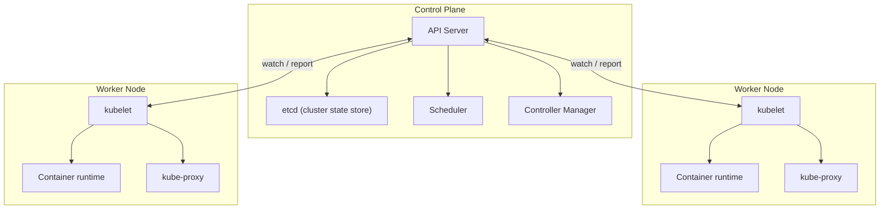
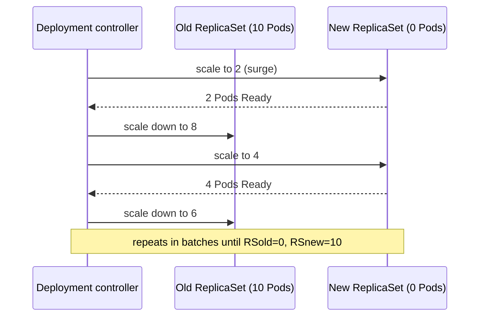
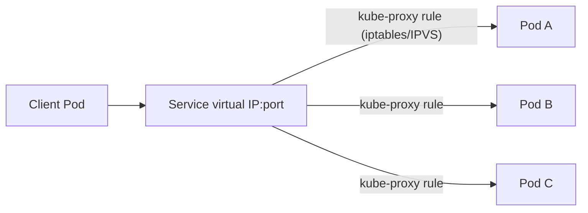
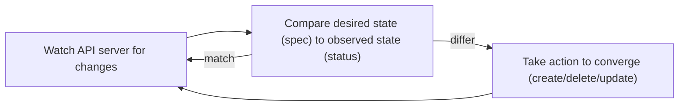

# Kubernetes Core Architecture, Networking & Deployments/Scaling

Kubernetes takes the single-container problem Docker solves and answers the next one: how
do you run hundreds of containers across many machines, keep them running when a machine
dies, route traffic to whichever instances are healthy right now, and roll out a new
version without downtime? Interviewers probe this because "we run it on Kubernetes" is easy
to say and hides a genuinely deep system — a declarative control loop, a networking model
built entirely on virtual IPs and iptables/IPVS rules, and failure modes that only show up
under real load.

---

## 🟢 Beginner Level

### The Core Problem: One Container Is Not a System

A single `docker run` gives you one container on one host. Production needs more than
that: if the host dies, something must notice and reschedule the container elsewhere; if
one instance is overloaded, something must add more; if a new version is bad, something
must roll back before it takes down every instance at once. Doing this by hand — SSH into
a host, restart a container, update a load balancer's target list — does not scale past a
handful of services, and it fails exactly when you need it most: during an incident, at
3 a.m., under time pressure.

Kubernetes is a **declarative control system**: you describe the state you want ("run 5
copies of this image, keep them healthy, expose them on this port"), and a set of
background controllers continuously compare that desired state to the cluster's actual
state, taking action whenever they differ. You never tell Kubernetes *how* to get from
here to there step by step — you only state the destination, repeatedly, forever.

### Kubernetes Architecture: Control Plane and Nodes

A cluster splits into two kinds of machines with entirely different jobs:



The **control plane** makes decisions but runs no application workloads itself:

- **API server** is the single front door. Every read and write — `kubectl`, a controller,
  a kubelet — goes through it as a REST/gRPC call. Nothing else talks to `etcd` directly.
- **etcd** is a distributed, strongly consistent key-value store holding the entire
  cluster's desired and observed state. It is the only source of truth; lose it without a
  backup and the cluster's history and configuration are gone even if every workload
  container is still running somewhere.
- **Scheduler** watches for newly created Pods with no node assigned and picks a node for
  each one, based on requested resources, constraints, and current node load.
- **Controller manager** runs the reconciliation loops (Deployment controller, ReplicaSet
  controller, Node controller, and others) that continuously push actual state toward
  desired state.

Each **worker node** runs the actual containers:

- **kubelet** is the node agent. It watches the API server for Pods assigned to its node,
  tells the container runtime to start/stop containers to match, and reports the node's
  and Pods' status back.
- **Container runtime** (containerd, CRI-O) does the same job Docker's containerd does
  underneath it — pulling images, creating containers via the OCI runtime — talked to
  through the **Container Runtime Interface (CRI)**, a standard contract that decouples
  Kubernetes from any specific runtime implementation.
- **kube-proxy** programs the node's networking rules so that traffic to a Service's
  virtual IP reaches one of the right backend Pods, covered in depth below.

### The Pod: Kubernetes' Atomic Scheduling Unit

Kubernetes never schedules a bare container — it schedules a **Pod**, a group of one or
more containers that always land on the same node, share the same network namespace (one
IP address, one `localhost` for every container in the Pod to talk to each other), and can
share storage volumes. Most Pods run exactly one container; multi-container Pods exist for
tightly coupled helper processes — a **sidecar** that ships logs, a service-mesh proxy that
intercepts all traffic — that must live and die with the main container and never need to
scale independently of it.

A Pod is meant to be disposable. It has no stable identity: if it dies, Kubernetes does not
resurrect that exact Pod, it creates a brand new one with a new name and usually a new IP.
This is the single most important mental model shift from managing individual servers —
nothing in a healthy Kubernetes design should depend on a specific Pod's identity
surviving.

### Deployments and ReplicaSets

You almost never create a Pod directly. A **Deployment** describes the desired state — this
container image, this many replicas, these resource limits — and delegates the mechanics to
a **ReplicaSet**, which is the controller that actually watches "are there exactly N Pods
matching this template running right now?" and creates or deletes Pods to make that true.

```yaml
apiVersion: apps/v1
kind: Deployment
metadata:
  name: checkout-api
spec:
  replicas: 4
  selector:
    matchLabels: { app: checkout-api }
  template:
    metadata:
      labels: { app: checkout-api }
    spec:
      containers:
        - name: checkout-api
          image: checkout-api:1.4.0
          resources:
            requests: { cpu: "250m", memory: "256Mi" }
            limits: { cpu: "500m", memory: "512Mi" }
```

The Deployment itself does not manage Pods directly — it manages ReplicaSets, and a new
ReplicaSet is created every time the Pod template changes (a new image tag, a new
environment variable). This is exactly what makes rollouts and rollbacks possible: the old
ReplicaSet is scaled down, not deleted, so rolling back means scaling the previous
ReplicaSet back up rather than rebuilding it from scratch.

| Object | Answers | Typical use |
|---|---|---|
| Pod | What runs, together, on one node | Rarely created directly |
| ReplicaSet | How many identical copies exist right now | Managed by a Deployment, not hand-written |
| Deployment | What is the desired versioned state, and how do we roll it out | Stateless applications — the default choice |
| StatefulSet | Same, but each replica needs a stable identity and its own storage | Databases, queues, anything with per-instance state |

---

## 🟡 Intermediate Level

### Rolling Updates: How a Deployment Replaces Pods Without Downtime

When a Deployment's Pod template changes, the Deployment controller does not stop every old
Pod and start every new one at once — that would mean a window with zero capacity. Instead
it performs a **rolling update**, governed by two fields:

- `maxSurge` — how many Pods *above* the desired replica count are allowed temporarily
- `maxUnavailable` — how many Pods *below* the desired replica count are allowed temporarily

Worked example, real numbers: a Deployment with `replicas: 10`, `maxSurge: 25%`,
`maxUnavailable: 25%` (Kubernetes' own defaults). 25% of 10 rounds to `2` (surge, rounded
up) and `2` (unavailable, rounded down) by default. The rollout proceeds:

1. Start: 10 old Pods running, 0 new.
2. Controller creates up to `maxSurge` = 2 new Pods (12 total) *before* removing any old
   ones — this is why surge exists: to avoid dropping below capacity while new Pods are
   still starting.
3. As each new Pod passes its **readiness probe** (see below), the controller removes one
   old Pod, keeping total count near 10-12 and never below `10 - maxUnavailable` = 8.
4. This repeats in small batches — new Pods created, waited on for readiness, old Pods
   removed — until all 10 Pods are the new version and 0 are old.



If a new Pod never becomes Ready — a bad image, a crash loop — the rollout **stalls**
rather than proceeding, since the controller is waiting on readiness before removing more
old Pods. This is the built-in safety net: a broken rollout leaves you at partial old/new
capacity, not at 100% broken new capacity, and `kubectl rollout undo` scales the previous
ReplicaSet back to full size to revert.

### Services: Stable Networking for Ephemeral Pods

Pods get a new IP every time they are recreated, so nothing should ever hard-code a Pod IP.
A **Service** is a stable virtual IP and DNS name that load-balances across whichever Pods
currently match its label selector — as Pods come and go, the Service's own address never
changes.

| Service type | Reachable from | Typical use |
|---|---|---|
| `ClusterIP` (default) | Only inside the cluster | Internal service-to-service traffic |
| `NodePort` | Any node's IP, on a fixed high port (30000-32767) | Quick external access, dev/test |
| `LoadBalancer` | The public internet, via a cloud provider's LB | Production external entry point |
| `ExternalName` | Returns a CNAME, no proxying at all | Pointing at an external service by DNS |

A Service does not sit in the data path itself doing the load balancing — it is a policy
object. The actual traffic redirection happens on every node via **kube-proxy**.

### kube-proxy and Service Routing: iptables vs IPVS

kube-proxy watches the API server for Services and their matching **Endpoints** (the
current set of healthy Pod IP:port pairs behind a Service) and programs the node's kernel
networking rules accordingly, in one of two modes:

- **iptables mode** (the long-time default): kube-proxy writes a chain of `iptables` NAT
  rules per Service. A packet destined for the Service's virtual IP is matched against a
  list of rules, each with an equal probability weight, and randomly rewritten (DNAT'd) to
  one backend Pod IP. Rule evaluation is roughly linear in the number of rules, so with
  thousands of Services this lookup can become a measurable bottleneck.
- **IPVS mode**: uses the kernel's IP Virtual Server module, a purpose-built layer-4 load
  balancer with real hash-table lookups instead of a linear rule chain, and supports actual
  load-balancing algorithms (round-robin, least-connection) instead of pure random
  selection. It scales far better at high Service counts and is the recommended mode for
  large clusters.



Either way, the Service IP itself is virtual — it exists only as kernel rules on every
node, never as an address any real network interface answers to directly, which is why a
Service works identically no matter which node a client Pod happens to run on.

### DNS-Based Service Discovery

Every Service also gets a DNS name automatically, served by the cluster's internal DNS
(**CoreDNS**, running as its own Deployment): a Service named `checkout-api` in namespace
`prod` resolves at `checkout-api.prod.svc.cluster.local` (or just `checkout-api` from
within the same namespace). Application code never needs to know a Service's actual virtual
IP, and never needs a service registry client library — it just makes a normal DNS lookup,
which is why "connect to the hostname, not an IP" is close to a hard rule in Kubernetes
application code.

### ConfigMaps and Secrets

Application configuration should not be baked into a container image — the same image must
run identically in staging and production with different config. **ConfigMaps** hold
non-sensitive configuration (feature flags, URLs) as key-value data, injected into a Pod as
environment variables or mounted files. **Secrets** hold the same shape of data for
sensitive values (credentials, tokens) — base64-encoded by default (not encrypted at rest
unless the cluster explicitly enables encryption-at-rest for etcd, a common
misunderstanding covered below). Both are referenced by name from a Pod spec and can be
updated independently of the container image.

### Probes: Liveness, Readiness, and Startup

The kubelet actively checks container health with three distinct probe types, each driving
a different action:

- **Liveness probe** — "is this container still working?" A failure triggers a container
  **restart**. Use this for genuine deadlocks/hangs, not for temporary slowness — an overly
  aggressive liveness probe restarting a container that is merely under heavy load makes an
  overload situation worse by adding restart churn on top of it.
- **Readiness probe** — "is this container ready to receive traffic right now?" A failure
  **removes the Pod from Service endpoints** without restarting it — used for startup
  warm-up and for temporarily shedding load (a Pod that is busy with a long GC pause can
  fail readiness briefly and quietly stop receiving new requests without being killed).
- **Startup probe** — gates the other two probes until an initial condition is met, for
  containers with a slow, variable startup time; without it, a liveness probe with a short
  timeout can kill a container that was still starting normally, not actually stuck.

---

## 🔴 Expert Level

### The Reconciliation Loop: How Kubernetes Actually Self-Heals

Every controller in Kubernetes — the ReplicaSet controller, the Deployment controller, the
Node controller — runs the same fundamental pattern, a **control loop**:



This loop runs continuously and idempotently — if a Pod is deleted (a node crashes, someone
runs `kubectl delete pod` by hand), the ReplicaSet controller notices on its very next
reconciliation pass that observed count (`4`) no longer matches desired count (`5`) and
creates a replacement, with no special-case code for "pod was deleted" versus any other
reason the counts might diverge. This uniformity is why Kubernetes self-heals from almost
any kind of partial failure: every controller is always asking the same question — "does
reality match the spec?" — rather than reacting to specific named failure events.

### Horizontal Pod Autoscaling: Mechanics and a Worked Example

The **Horizontal Pod Autoscaler (HPA)** adjusts a Deployment's replica count automatically
based on observed metrics (CPU utilization by default, or custom/external metrics). Every
sync period (15 seconds by default) it computes:

$$\text{desiredReplicas} = \left\lceil \text{currentReplicas} \times \frac{\text{currentMetricValue}}{\text{desiredMetricValue}} \right\rceil$$

Worked example: a Deployment target of 50% average CPU utilization, currently running 4
replicas, observed average utilization of 90%. `desiredReplicas = ceil(4 × 90/50) =
ceil(7.2) = 8`. The HPA scales the Deployment to 8 replicas; assuming the added replicas
spread the same total load, average utilization per Pod should fall back toward 45-50%. If
utilization then drops to 30% at 8 replicas, the next computation is `ceil(8 × 30/50) =
ceil(4.8) = 5`, scaling back down — but scale-down is deliberately conservative by default
(a stabilization window, commonly 5 minutes, before acting on a scale-down signal) to avoid
flapping replica counts up and down on every noisy metric sample.

HPA only ever changes **replica count** — it never changes a Pod's CPU/memory
request/limit. Scaling the *size* of individual Pods (increasing per-Pod resource limits)
is a separate mechanism, the Vertical Pod Autoscaler, and the two are not interchangeable:
HPA assumes the workload parallelizes across more identical instances, VPA assumes a single
instance needs more room.

### Scheduling: How the Scheduler Picks a Node

For every unscheduled Pod, the scheduler runs two phases: **filtering** (which nodes could
possibly run this Pod at all — do they have enough allocatable CPU/memory left given the
Pod's `resources.requests`, do they satisfy any node selector or taint/toleration rules),
then **scoring** (among the nodes that passed filtering, which is the *best* placement — by
default favoring nodes with more free resources remaining after this Pod, to spread load
rather than pack it onto already-busy nodes). A Pod's `requests` are what the scheduler
reserves against — not the same as `limits`, which the kernel enforces at runtime but the
scheduler does not use for placement decisions, a distinction that matters because a node
can be scheduled at its full requested capacity while individual Pods still burst above
their requests up to their limits, right up until the node's actual resources run out.

### Production Failure Modes

**`CrashLoopBackOff`.** A container keeps exiting shortly after starting. The kubelet
restarts it with an exponential backoff delay (10s, 20s, 40s... capped at 5 minutes) rather
than restarting immediately forever — immediate infinite restart would mask the real signal
(check exit code and logs) and hammer any downstream dependency the container fails against
on every attempt. The fix is always in the application or its config, never in the backoff
itself.

**Readiness probe misconfigured as liveness.** Using the same aggressive check for both
means a Pod under temporary load that fails what should be a "stop sending traffic" signal
instead gets killed and restarted — turning a brief slowdown into a full container restart,
compounding the original problem instead of shedding load gracefully.

**Thundering herd on a bulk restart.** Rolling out a config change with a very small
`maxUnavailable` and a slow container startup (say, a JVM app with a 45-second warm-up)
means the rollout blocks for a long time waiting on readiness one small batch at a time —
which is the *safe* failure, versus a `maxUnavailable: 100%` setting during an incident
that drops all capacity for the entire duration of that same warm-up, a genuinely dangerous
combination interviewers ask about directly.

**Secrets are not encrypted by default.** A Kubernetes Secret is base64-encoded, which is
an encoding, not encryption — anyone with API access to read the Secret object (or direct
`etcd` access without encryption-at-rest enabled) can trivially decode it. Real
confidentiality requires enabling etcd encryption-at-rest and/or an external secrets
manager; treating "it's a Secret object" as equivalent to "it's encrypted" is a common and
serious misunderstanding.

### Common Misconceptions

- **"Kubernetes load-balances traffic itself, like a proxy in the data path."** It does
  not — a Service is a policy object; kube-proxy programs kernel-level `iptables`/IPVS
  rules on every node, and the actual packet rewriting happens in the kernel, not in any
  running Kubernetes process sitting in the request path.
- **"Restarting a crashed Pod brings back the same Pod."** A new Pod is created with a new
  name and (usually) a new IP — nothing should depend on Pod identity surviving a restart;
  that stability belongs to Services, not Pods.
- **"`kubectl delete pod` is how you scale down."** Deleting a Pod managed by a ReplicaSet
  just triggers the ReplicaSet controller to create a replacement immediately, since desired
  count did not change — scaling down means changing the Deployment's `replicas` field.
- **"More replicas always means more capacity."** Only if the workload actually
  horizontally scales (stateless, no shared bottleneck) — replicas competing for the same
  downstream database connection pool or the same external rate limit can add Pods with
  zero throughput gain.
- **"A Secret is encrypted."** It is base64-encoded by default; without etcd
  encryption-at-rest explicitly enabled, anyone with `etcd` or sufficient API access can
  read it in plaintext.

### Interview Questions

**Q1. What is the difference between a Pod and a container in Kubernetes?** `[easy]`

A Pod is Kubernetes' atomic scheduling unit — one or more containers that always run on the
same node, share one network namespace (one IP, `localhost` between them), and can share
storage volumes. A container is the actual isolated process, exactly as in Docker; most
Pods wrap a single container, and multi-container Pods exist for tightly coupled helpers,
like a sidecar, that must live and die with the main container rather than scale
independently.

**Q2. Why do you almost never create a Pod directly in production?** `[easy]`

A bare Pod has no controller watching it — if the node it runs on fails, nothing recreates
it, since nothing is comparing desired state to actual state for that specific Pod. A
Deployment (via a ReplicaSet) continuously reconciles "are there exactly N Pods matching
this template" and recreates a Pod automatically on failure, which is the self-healing
behavior people actually mean when they say "Kubernetes restarts things for you."
The recreation is not a resurrection, though — the replacement is a brand-new Pod on
another node with a new IP and empty local disk, so anything the old Pod held only in
memory or in an `emptyDir` is gone.

**Q3. What's the difference between `ClusterIP`, `NodePort`, and `LoadBalancer` Service types?** `[easy]`

`ClusterIP`, the default, is reachable only from inside the cluster and is the right choice
for internal service-to-service calls. `NodePort` additionally exposes the Service on a
fixed high port (30000-32767) on every node's own IP, useful for quick external access in
development. `LoadBalancer` provisions an actual external load balancer from the cloud
provider pointing at the Service, which is the standard way to expose a production Service
to the public internet.

**Q4. Why does a Service keep working even though the Pods behind it are constantly being replaced?** `[easy]`

A Service is a stable virtual IP and DNS name decoupled from any specific Pod; it
load-balances across whatever Pods currently match its label selector via the Endpoints
object, which the API server updates automatically as Pods come and go. Clients only ever
talk to the Service's stable address, never to an individual Pod's IP directly, so Pod
churn underneath is invisible to them.

**Q5. What does a readiness probe actually do when it fails, and how is that different from a liveness probe failing?** `[medium]`

A failing readiness probe removes the Pod from the Service's Endpoints list — it stops
receiving new traffic — without restarting the container, which is the correct behavior for
temporary unavailability like a slow startup warm-up or a long GC pause. A failing liveness
probe instead causes the kubelet to restart the container entirely, which should be
reserved for genuine hangs or deadlocks; using an aggressive liveness check for what is
really a "temporarily busy" condition turns brief overload into unnecessary restart churn.

**Q6. Walk through what happens when you change the image tag in a Deployment with default rolling-update settings.** `[medium]`

The Deployment controller creates a new ReplicaSet for the new Pod template and begins
scaling it up while scaling the old ReplicaSet down, bounded by `maxSurge` (how far above
the desired count total Pods may temporarily go) and `maxUnavailable` (how far below).
New Pods must pass their readiness probe before the controller removes an equivalent number
of old Pods, so the rollout proceeds in small batches rather than all at once, and a broken
new image simply stalls the rollout at partial old/new capacity instead of taking down the
whole service. The cost of that safety is spare capacity: with `maxUnavailable: 0` the
rollout needs room for `maxSurge` extra Pods before it can start, and on a full cluster it
will sit pending indefinitely. A stalled rollout also does not roll itself back —
`progressDeadlineSeconds` only marks the Deployment as failed; reverting is still a manual
`kubectl rollout undo`.

**Q7. Your rollout is stuck with some old and some new Pods, and it's been ten minutes. What do you check first?** `[medium]`

I'd check whether the new ReplicaSet's Pods are passing their readiness probes at all —
`kubectl get pods` for their status and `kubectl describe pod`/`kubectl logs` on one of the
new ones for the actual failure. A stalled rollout almost always means the new Pods never
became Ready, which is the deliberate safety mechanism preventing the controller from
scaling down more of the known-good old Pods; the fix is either fixing the new version or
running `kubectl rollout undo` to revert to the last working ReplicaSet.

**Q8. Explain the difference between iptables mode and IPVS mode in kube-proxy.** `[medium]`

Both program the node's kernel to redirect Service virtual-IP traffic to backend Pod IPs,
but iptables mode does it as a linear chain of NAT rules with roughly O(n) lookup cost in
the number of Services, evaluated with equal-probability random selection among backends.
IPVS mode uses the kernel's IP Virtual Server module, a purpose-built layer-4 load balancer
with hash-table lookups and real load-balancing algorithms like least-connection, which
scales meaningfully better on clusters with thousands of Services and is the recommended
mode at that scale. IPVS is not a clean replacement, though: it still relies on iptables
for packet marking and masquerading, and it needs the `ip_vs` kernel modules present on
every node — when they are missing, kube-proxy silently falls back to iptables mode, so a
cluster can believe it is running IPVS while one node is not.

**Q9. A Deployment's HPA target is 50% CPU. It's running 4 replicas at 90% average CPU utilization. What does the HPA compute as the new replica count, and why isn't it a round number?** `[medium]`

The HPA computes `ceil(currentReplicas × currentMetric / desiredMetric)` = `ceil(4 × 90 /
50)` = `ceil(7.2)` = 8 replicas. It always rounds up rather than truncating, because
rounding down could leave the cluster under-provisioned relative to the target even after
scaling — better to slightly over-provision than to under-shoot and stay above the target
utilization. The HPA also will not act on every small deviation: a default tolerance of
10% means a metric within that band of the target is treated as on-target, and a
stabilization window delays scale-down, both of which exist to stop the controller
oscillating on noisy CPU readings.

**Q10. Why is a Kubernetes Secret not the same thing as an encrypted credential?** `[medium]`

A Secret object stores its data base64-encoded, which is a reversible encoding scheme for
safely representing arbitrary bytes in YAML/JSON, not an encryption scheme — anyone who can
read the Secret via the API, or who has direct access to an `etcd` store without
encryption-at-rest enabled, can trivially decode it back to plaintext. Real confidentiality
requires explicitly enabling etcd encryption-at-rest, restricting RBAC access to Secrets, or
using an external secrets manager integration, none of which is on by default just because
the object is called a Secret. Even with all of that in place, the Secret is plaintext by
the time it reaches the workload — mounted as a file or injected as an environment
variable — so anyone who can exec into the Pod or read its `/proc` entries can read it
regardless of how well etcd is protected.

**Q11. Why does Kubernetes separate `requests` and `limits` for a container's resources instead of using one number?** `[hard]`

`requests` is what the scheduler reserves against when deciding whether a node has room for
a Pod, guaranteeing that amount is available; `limits` is what the kernel enforces at
runtime as a hard ceiling, which can be set higher than `requests` to let a container burst
above its guaranteed share when spare capacity happens to exist on the node. This lets a
cluster be scheduled at its collectively requested capacity while still allowing genuine
bursts, at the cost of a node that can become resource-starved if too many Pods burst to
their limits simultaneously — a tension every capacity-planning decision in Kubernetes has
to account for.

**Q12. How does Kubernetes' reconciliation-loop model make it self-healing from a node crash, without any special-case "node died" logic?** `[hard]`

Every controller continuously compares desired state (the spec, stored in etcd) against
observed state (status reported by kubelets) and takes convergent action whenever they
differ, with no distinction in that logic for *why* they differ. When a node crashes, its
kubelet stops reporting, the Node controller eventually marks it unhealthy and evicts its
Pods from consideration, and the ReplicaSet controller for those Pods' Deployments simply
observes fewer matching Pods than desired — the same code path that handles any other cause
of a Pod disappearing recreates them elsewhere, with the node failure never needing its own
special branch of logic. The trade-off is latency, not correctness: the controller cannot
distinguish a dead node from an unreachable one, so it waits out the node-monitor grace
period and then the eviction timeout — several minutes by default — before declaring the
Pods gone, and for a StatefulSet it will not recreate them at all until the old Pod is
positively confirmed deleted, because two Pods with the same identity writing the same
volume is worse than downtime.

**Q13. Your team sets `maxUnavailable: 100%` on a Deployment to speed up an emergency rollout, and it makes an outage worse. What went wrong?** `[hard]`

`maxUnavailable: 100%` allows the rolling update to take down every old Pod immediately
before any new Pod has to prove it is ready, trading the rollout's normal safety margin for
speed. If the new Pods then have any meaningful startup time — a JVM warm-up, a cache
rebuild — the Deployment has zero serving capacity for that entire window, converting what
should have been a partial-capacity rollout into a full outage. The safer lever for a faster
rollout is raising `maxSurge` instead, which adds capacity before removing any, rather than
removing capacity before new instances are proven ready.

**Q14. Why can two Pods with identical `requests` still receive very different amounts of actual CPU time under load?** `[hard]`

`requests` only affects scheduling — how the scheduler decides a node has room for the Pod —
and does not itself guarantee a proportional share of CPU time once multiple Pods are
actually competing on a busy node; `limits`, cgroup CPU shares, and the kernel's CPU
scheduler determine the actual runtime split, and a Pod with no `limits` set can burst to
consume far more than its `requests` whenever the node has spare capacity, starving a
neighboring Pod that happens to need its share at that exact moment even though both were
scheduled identically.

Further reading: the [Kubernetes documentation on Pods](https://kubernetes.io/docs/concepts/workloads/pods/)
and [Services](https://kubernetes.io/docs/concepts/services-networking/service/) cover the
object model referenced throughout; the
[Horizontal Pod Autoscaler walkthrough](https://kubernetes.io/docs/tasks/run-application/horizontal-pod-autoscale-walkthrough/)
works through the scaling formula in more depth; the
[kube-proxy IPVS design proposal](https://github.com/kubernetes/community/blob/master/contributors/design-proposals/network/ipvs-proxy.md)
explains the iptables-vs-IPVS trade-off from the implementers' own reasoning.
