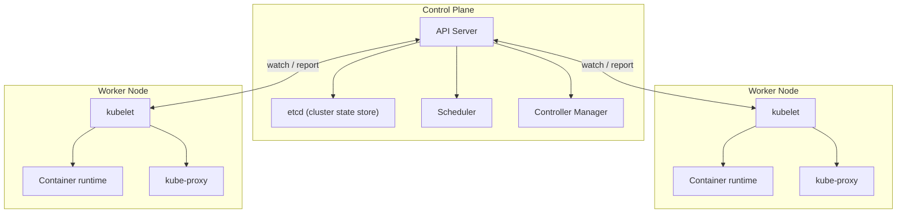
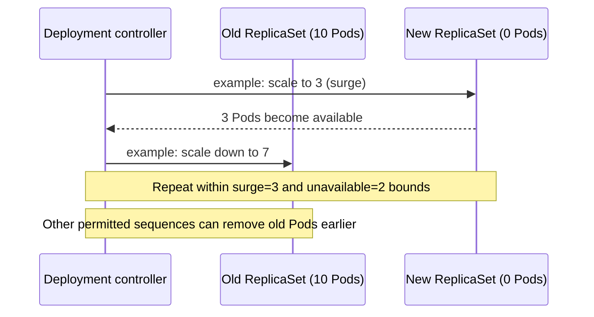
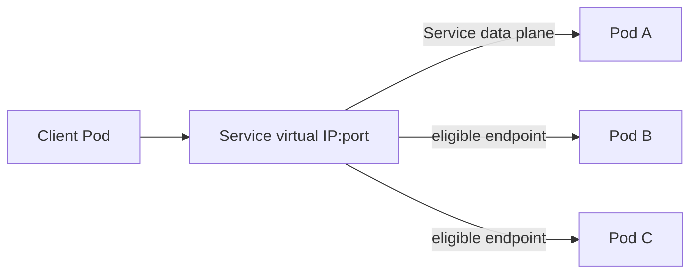
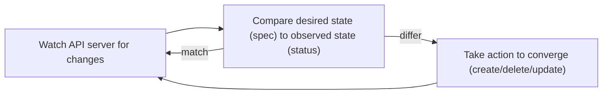

# Kubernetes Core Architecture, Networking & Deployments/Scaling

Kubernetes takes the single-container problem Docker solves and answers the next one: how
do you run hundreds of containers across many machines, keep them running when a machine
dies, route traffic to whichever instances are healthy right now, and roll out a new
version without downtime? Interviewers probe this because "we run it on Kubernetes" is easy
to say and hides a genuinely deep system — a declarative control loop, a networking model
built around virtual Services and replaceable Pods, and failure modes that only show up
under real load.

**Before you start:** Read [Docker fundamentals](01-docker-fundamentals.md) at
Beginner level. A Pod runs containers, so learn that single-container model first.

**After this lesson, you should be able to:** distinguish Pod, Deployment and Service;
explain desired versus observed state; identify why a Pod is pending or restarting;
and trace a request from a Service name to a ready application instance.

---

## 🟢 Beginner Level

### The Core Problem: One Container Is Not a System

A single `docker run` gives you one container on one host. Production needs more than
that: if the host dies, something must notice and reschedule the container elsewhere; if
one instance is overloaded, something must add more; if a new version is bad, something
must roll back before it takes down every instance at once. Doing this by hand — SSH into
a host, restart a container, update a load balancer's target list — does not scale past a
handful of services, and it fails exactly when you need it most: during an incident, at
3 a.m., under time pressure.

Kubernetes is a **declarative control system**: you describe the state you want ("run 5
copies of this image, keep them healthy, expose them on this port"), and a set of
background controllers continuously compare that desired state to the cluster's actual
state, taking action whenever they differ. You never tell Kubernetes *how* to get from
here to there step by step — you only state the destination, repeatedly, forever.

### Kubernetes Architecture: Control Plane and Nodes

A cluster splits into two kinds of machines with entirely different jobs:


```mermaid
flowchart TB
    subgraph CP["Control Plane"]
        API["API Server"] --> ETCD["etcd (cluster state store)"]
        API --> SCHED["Scheduler"]
        API --> CM["Controller Manager"]
    end
    subgraph N1["Worker Node"]
        KUBELET1["kubelet"] --> CRI1["Container runtime"]
        KUBELET1 --> PROXY1["kube-proxy"]
    end
    subgraph N2["Worker Node"]
        KUBELET2["kubelet"] --> CRI2["Container runtime"]
        KUBELET2 --> PROXY2["kube-proxy"]
    end
    API <-->|"watch / report"| KUBELET1
    API <-->|"watch / report"| KUBELET2
```

The **control plane** makes cluster decisions. Production clusters commonly reserve its
nodes using taints; this is a deployment policy, not a rule that application Pods can never
run there. Single-node learning clusters may use the same machine for both roles:

- **API server** is the single front door. Clients such as `kubectl`, controllers and
  kubelets use the Kubernetes HTTP API; the API server persists cluster data in
  `etcd`. Application traffic does not flow through the API server.
- **etcd** is a distributed, strongly consistent key-value store holding the entire
  cluster's desired and observed state. It is the only source of truth; lose it without a
  backup and the cluster's history and configuration are gone even if every workload
  container is still running somewhere.
- **Scheduler** watches for newly created Pods with no node assigned and picks a node for
  each one, based on requested resources, constraints, and configured scoring policies; ordinary resource placement uses requests,
  not simply a live CPU-utilization reading.
- **Controller manager** runs the reconciliation loops (Deployment controller, ReplicaSet
  controller, Node controller, and others) that continuously push actual state toward
  desired state.

Each **worker node** runs the actual containers:

- **kubelet** is the node agent. It watches the API server for Pods assigned to its node,
  tells the container runtime to start/stop containers to match, and reports the node's
  and Pods' status back.
- **Container runtime** (containerd, CRI-O) does the same job Docker's containerd does
  underneath it — pulling images, creating containers via the OCI runtime — talked to
  through the **Container Runtime Interface (CRI)**, a standard contract that decouples
  Kubernetes from any specific runtime implementation.
- **kube-proxy**, when used, programs node networking rules so traffic to a Service's
  virtual IP reaches an eligible backend Pod. Some clusters replace it with another
  Service data plane; check the actual cluster before debugging its implementation.

### The Pod: Kubernetes' Atomic Scheduling Unit

Kubernetes never schedules a bare container — it schedules a **Pod**, a group of one or
more containers that always land on the same node, share the same network namespace (one
IP address, one `localhost` for every container in the Pod to talk to each other), and can
share storage volumes. Most Pods run exactly one container; multi-container Pods exist for
tightly coupled helper processes — a **sidecar** that ships logs, a service-mesh proxy that
intercepts all traffic — that must live and die with the main container and never need to
scale independently of it.

A Pod is meant to be disposable. Its object has a UID, but a replacement has a new UID: if it dies, Kubernetes does not
resurrect that exact Pod, it creates a brand new one with a new name and usually a new IP.
This is the single most important mental model shift from managing individual servers —
stateless clients should use Services. StatefulSets deliberately supply stable ordinal
identities and storage associations across replacement Pod objects.

### Deployments and ReplicaSets

You almost never create a Pod directly. A **Deployment** describes the desired state — this
container image, this many replicas, these resource limits — and delegates the mechanics to
a **ReplicaSet**, which is the controller that actually watches "are there exactly N Pods
matching this template running right now?" and creates or deletes Pods to make that true.

```yaml
apiVersion: apps/v1
kind: Deployment
metadata:
  name: checkout-api
spec:
  replicas: 4
  selector:
    matchLabels: { app: checkout-api }
  template:
    metadata:
      labels: { app: checkout-api }
    spec:
      containers:
        - name: checkout-api
          image: checkout-api:1.4.0
          resources:
            requests: { cpu: "250m", memory: "256Mi" }
            limits: { cpu: "500m", memory: "512Mi" }
```

The Deployment itself does not manage Pods directly — it manages ReplicaSets, and a new
ReplicaSet is created every time the Pod template changes (a new image tag, a new
environment variable). This is exactly what makes rollouts and rollbacks possible: the old
ReplicaSet is scaled down, not deleted, so rolling back means scaling the previous
ReplicaSet back up rather than rebuilding it from scratch.

| Object | Answers | Typical use |
|---|---|---|
| Pod | What runs, together, on one node | Rarely created directly |
| ReplicaSet | How many identical copies exist right now | Managed by a Deployment, not hand-written |
| Deployment | What is the desired versioned state, and how do we roll it out | Stateless applications — the default choice |
| StatefulSet | Same, but each replica needs a stable identity and its own storage | Databases, queues, anything with per-instance state |

---

## 🟡 Intermediate Level

### Rolling Updates: Preserving Capacity During Replacement

When a Deployment's Pod template changes, its controller adjusts old and new ReplicaSets.
A rolling update aims to preserve serving capacity; it is not an unconditional guarantee
of zero downtime. Two fields control the rollout:

- `maxSurge` — extra Pods above the desired count, with percentages rounded **up**.
- `maxUnavailable` — allowed unavailable capacity, with percentages rounded **down**.

For `replicas: 10` and the defaults of 25% each, surge is `ceil(2.5) = 3`, and
unavailable is `floor(2.5) = 2`. The intended bounds allow 13 non-terminating Pods and
require at least 8 available Pods. Terminating Pods may temporarily add resource usage.

One permitted sequence is to create 3 new Pods, wait for availability, then remove old Pods
and repeat. This is **one sequence**, not a rule that every new Pod must become ready
before any old Pod can be removed: `maxUnavailable: 2` allows losing two available old
Pods even before the replacements are ready. Availability also accounts for
`minReadySeconds`; merely seeing `Running` is not enough.


```mermaid
sequenceDiagram
    participant D as Deployment controller
    participant RSold as Old ReplicaSet (10 Pods)
    participant RSnew as New ReplicaSet (0 Pods)
    D->>RSnew: example: scale to 3 (surge)
    RSnew-->>D: 3 Pods become available
    D->>RSold: example: scale down to 7
    Note over D,RSnew: Repeat within surge=3 and unavailable=2 bounds
    Note over D,RSold: Other permitted sequences can remove old Pods earlier
```

**Predict before deploying:** with four replicas and 25% defaults, both bounds are 1.
One unavailable replica is permitted, so readiness alone cannot promise uninterrupted
traffic. Setting `maxUnavailable: 0` protects available capacity during the rollout but
requires scheduling headroom and correct probes, routing and graceful termination.

If replacements cannot become available, the rollout can stall. Diagnose image pulls,
scheduling, application crashes and readiness. A progress deadline reports failure; it
does not automatically roll back. `kubectl rollout undo` restores an earlier template,
not database data or external effects of the failed version.

### Services: Stable Networking for Ephemeral Pods

Pods get a new IP every time they are recreated, so nothing should ever hard-code a Pod IP.
A **Service** is a stable virtual IP and DNS name that load-balances across whichever Pods
currently match its label selector — as Pods come and go, the Service's own address never
changes.

| Service type | Reachable from | Typical use |
|---|---|---|
| `ClusterIP` (default) | Normally reachable on cluster networks | Internal service-to-service traffic |
| `NodePort` | Selected node addresses, default port range 30000–32767 | Quick external access, dev/test |
| `LoadBalancer` | Implementation-provisioned LB, which may be internal or public | Production external entry point |
| `ExternalName` | Returns a CNAME, no proxying at all | Pointing at an external service by DNS |

A Service does not sit in the data path itself doing the load balancing — it is a policy
object. A node's Service data plane redirects packets to eligible Pods; many clusters
use **kube-proxy**, while some networking add-ons replace it.

### kube-proxy and Service Routing: iptables, nftables, and legacy IPVS

kube-proxy watches Services and **EndpointSlices**, which describe the current
eligible Pod IP:port pairs, and updates node networking rules. On Linux it can use
these implementations:

- **iptables** writes netfilter forwarding/NAT rules. It remains the default mode
  in Kubernetes 1.37; large clusters may notice slower rule updates as Service and
  endpoint counts grow.
- **nftables** uses the newer netfilter API and can update large rule sets more
  efficiently. It is the recommended replacement for legacy IPVS where supported;
  check kernel and NodePort behaviour before migrating.
- **IPVS** uses kernel IPVS plus some iptables rules. It was introduced for scale,
  but cannot implement every Service edge case cleanly. Kubernetes marks this mode
  deprecated; it is no longer a recommendation for a new large cluster.

These facts are version-sensitive. The [Kubernetes 1.37 Service proxy reference](https://kubernetes.io/docs/reference/networking/virtual-ips/)
documents the current default and migration limits. An eBPF-based networking add-on
may replace kube-proxy entirely, so the first debugging question is which data plane
your cluster actually runs.


```mermaid
flowchart LR
    C["Client Pod"] --> VIP["Service virtual IP:port"]
    VIP -->|"Service data plane"| P1["Pod A"]
    VIP -->|"eligible endpoint"| P2["Pod B"]
    VIP -->|"eligible endpoint"| P3["Pod C"]
```

The Service IP is a virtual destination, not the address of one durable Pod. The
cluster's data plane implements forwarding to an eligible endpoint; its exact
kernel rules and edge behaviour depend on the configured implementation.

### DNS-Based Service Discovery

Services get DNS records when the cluster DNS integration is configured, served by the cluster's internal DNS
(**CoreDNS**, running as its own Deployment): a Service named `checkout-api` in namespace
`prod` normally resolves at `checkout-api.prod.svc.cluster.local` (the cluster domain is
configurable; a headless Service resolves to endpoint addresses), or just `checkout-api` from
within the same namespace. Application code never needs to know a Service's actual virtual
IP, and usually needs no separate service registry client library — it just makes a normal DNS lookup,
which is why "connect to the hostname, not an IP" is close to a hard rule in Kubernetes
application code.

### ConfigMaps and Secrets

Application configuration should not be baked into a container image — the same image must
be promoted between staging and production with environment-specific config. **ConfigMaps** hold
non-sensitive configuration (feature flags, URLs) as key-value data, injected into a Pod as
environment variables or mounted files. **Secrets** hold the same shape of data for
sensitive values (credentials, tokens) — base64-encoded by default (not encrypted at rest
unless the cluster explicitly enables encryption-at-rest for etcd, a common
misunderstanding covered below). Both are referenced by name from a Pod spec and can be
updated independently of the container image.

### Probes: Liveness, Readiness, and Startup

The kubelet actively checks container health with three distinct probe types, each driving
a different action:

- **Liveness probe** — "is this container still working?" A failure triggers a container
  **restart**. Use this for genuine deadlocks/hangs, not for temporary slowness — an overly
  aggressive liveness probe restarting a container that is merely under heavy load makes an
  overload situation worse by adding restart churn on top of it.
- **Readiness probe** — "is this container ready to receive traffic right now?" A failure
  **marks the Pod unready** without restarting it; normal Service routing stops selecting
  it after endpoint and data-plane updates. Existing connections do not necessarily close — used for startup
  warm-up and for temporarily shedding load (a Pod that is busy with a long GC pause can
  fail readiness briefly and quietly stop receiving new requests without being killed).
- **Startup probe** — gates the other two probes until an initial condition is met, for
  containers with a slow, variable startup time; without it, a liveness probe with a short
  timeout can kill a container that was still starting normally, not actually stuck.

---

## 🔴 Expert Level

### The Reconciliation Loop: How Kubernetes Actually Self-Heals

Every controller in Kubernetes — the ReplicaSet controller, the Deployment controller, the
Node controller — runs the same fundamental pattern, a **control loop**:


```mermaid
flowchart LR
    W["Watch API server for changes"] --> C["Compare desired state (spec) to observed state (status)"]
    C -->|"match"| W
    C -->|"differ"| A["Take action to converge (create/delete/update)"]
    A --> W
```

Controllers repeat convergent actions, retrying partial failures. If a managed Pod is
deleted, the ReplicaSet can create a replacement to satisfy its count. A node crash takes
additional mechanisms: heartbeats/Leases, node-health detection, taints and eviction.
Those are failure-specific logic; the reconciliation pattern does not eliminate them.

A partitioned node may still be running containers. Replacing a stateful writer without
fencing the old writer can create duplicate ownership, so recovery is a correctness and
availability trade-off, not just a delay. Controllers cannot repair every application bug,
lost storage or unavailable external dependency.

### Horizontal Pod Autoscaling: Mechanics and a Worked Example

The **Horizontal Pod Autoscaler (HPA)** adjusts a Deployment's replica count automatically
based on observed metrics (CPU utilization by default, or custom/external metrics). Every
sync period (15 seconds by default) it computes:

$$\text{desiredReplicas} = \left\lceil \text{currentReplicas} \times \frac{\text{currentMetricValue}}{\text{desiredMetricValue}} \right\rceil$$

Worked example: a Deployment target of 50% average CPU utilization, currently running 4
replicas, observed average utilization of 90%. `desiredReplicas = ceil(4 × 90/50) =
ceil(7.2) = 8`. The simplified calculation recommends 8 replicas; assuming the added replicas
spread the same total load, average utilization per Pod should fall back toward 45-50%. If
utilization then drops to 30% at 8 replicas, the next computation is `ceil(8 × 30/50) =
ceil(4.8) = 5`, recommending a scale-down — but scale-down is deliberately conservative by default
(a stabilization window, commonly 5 minutes, before acting on a scale-down signal) to avoid
flapping replica counts up and down on every noisy metric sample.

**Check the denominator:** with a CPU request of `250m`, measured usage of `225m` is
90% utilization for this HPA calculation. It is 45% of a `500m` CPU limit; that limit is
not the denominator. CPU utilization targets require suitable requests and a working
metrics pipeline. Missing metrics, unready Pods, tolerance, stabilization policies and
`minReplicas`/`maxReplicas` can alter or block the actual change. More replicas also need
node capacity and a workload that benefits from parallelism.

HPA changes **replica count** — it never changes a Pod's CPU/memory
request/limit. Scaling the *size* of individual Pods (increasing per-Pod resource limits)
is a separate mechanism, the Vertical Pod Autoscaler, and the two are not interchangeable:
HPA assumes the workload parallelizes across more identical instances, VPA assumes a single
instance needs more room.

### Scheduling: How the Scheduler Picks a Node

For every unscheduled Pod, the scheduler runs two phases: **filtering** (which nodes could
possibly run this Pod at all — do they have enough allocatable CPU/memory left given the
Pod's `resources.requests`, do they satisfy any node selector or taint/toleration rules),
then **scoring** (rank feasible nodes using configured plugins for resources, affinity,
spread and other policies). There is no universal rule that the least busy node wins.
Requests count against node allocatable capacity for placement; CPU requests also set
relative scheduling weight at runtime. A CPU limit can throttle execution, while a memory
limit is enforced through memory controls and potentially OOM killing. A memory request
is not proof that a process can never be OOM-killed. Bursting and node/system overhead
still need capacity planning.

### Production Failure Modes

**`CrashLoopBackOff`.** A container keeps exiting shortly after starting. By default in
Kubernetes 1.37, the kubelet backs off from 10 seconds up to 300 seconds; feature gates
and kubelet configuration can change those values. The delay avoids restarting
immediately forever — an infinite rapid loop would mask the real signal
(check exit code and logs) and hammer any downstream dependency the container fails against
on every attempt. Investigate the exit reason, application configuration, dependencies, and resource
limits before changing restart-delay settings; the backoff is a symptom, not a diagnosis.

**A five-minute diagnostic path.** When a deployment is unavailable, start with
`kubectl get pods,svc -n <namespace>` to see whether Pods exist and the Service
exists. Use `kubectl describe pod <name> -n <namespace>` for scheduling, pull and
probe events. For a restarting container, read
`kubectl logs <name> -n <namespace> --previous` to capture the last crashed
instance. For a running but unready Pod, check readiness failures and whether the
Service has EndpointSlices for it. Then test the application port inside the
cluster before blaming the external load balancer. These are read-only observations;
avoid deleting Pods until you know what failed. The official
[Pod debugging guide](https://kubernetes.io/docs/tasks/debug/debug-application/debug-running-pod/)
shows the command sequence and what each result means.

**Readiness probe misconfigured as liveness.** Using the same aggressive check for both
means a Pod under temporary load that fails what should be a "stop sending traffic" signal
instead gets killed and restarted — turning a brief slowdown into a full container restart,
compounding the original problem instead of shedding load gracefully.

**Thundering herd on a bulk restart.** Rolling out a config change with a very small
`maxUnavailable` and a slow container startup (say, a JVM app with a 45-second warm-up)
means the rollout blocks for a long time waiting on readiness one small batch at a time —
which is the *safe* failure, versus a `maxUnavailable: 100%` setting during an incident
that drops all capacity for the entire duration of that same warm-up, a genuinely dangerous
combination interviewers ask about directly.

**Secrets are not encrypted by default.** A Kubernetes Secret is base64-encoded, which is
an encoding, not encryption — anyone with API access to read the Secret object (or direct
`etcd` access without encryption-at-rest enabled) can trivially decode it. Real
confidentiality requires enabling etcd encryption-at-rest and/or an external secrets
manager; treating "it's a Secret object" as equivalent to "it's encrypted" is a common and
serious misunderstanding.

### Common Misconceptions

- **"A Service means the API server proxies every application request."** The API
  server manages Service objects and EndpointSlices; a node data plane, often
  kube-proxy's kernel rules, forwards application traffic. Some clusters use a
  different Service implementation, so inspect the actual cluster before debugging.
- **"Every restart creates a new Pod."** A container that crashes may restart inside the
  **same Pod**, retaining its Pod name and IP while the Pod exists. A Deployment replacing a
  failed or deleted Pod creates a **new Pod** with a new identity and usually a new IP.
  Clients should depend on the Service rather than either Pod identity.
- **"`kubectl delete pod` is how you scale down."** Deleting a Pod managed by a ReplicaSet
  just triggers the ReplicaSet controller to create a replacement immediately, since desired
  count did not change — scaling down means changing the Deployment's `replicas` field.
- **"More replicas always means more capacity."** Only if the workload actually
  horizontally scales (stateless, no shared bottleneck) — replicas competing for the same
  downstream database connection pool or the same external rate limit can add Pods with
  zero throughput gain.
- **"A Secret is encrypted."** It is base64-encoded by default; without etcd
  encryption-at-rest explicitly enabled, anyone with `etcd` or sufficient API access can
  read it in plaintext.

### Interview Questions

**Q1. What is the difference between a Pod and a container in Kubernetes?** `[easy]`

A Pod is Kubernetes' atomic scheduling unit — one or more containers that always run on the
same node, share one network namespace (one IP, `localhost` between them), and can share
storage volumes. A container is the actual isolated process, exactly as in Docker; most
Pods wrap a single container, and multi-container Pods exist for tightly coupled helpers,
like a sidecar, that must live and die with the main container rather than scale
independently.

**Q2. Why do you almost never create a Pod directly in production?** `[easy]`

A bare Pod has no controller watching it — if the node it runs on fails, nothing recreates
it, since nothing is comparing desired state to actual state for that specific Pod. A
Deployment (via a ReplicaSet) continuously reconciles "are there exactly N Pods matching
this template" and recreates a Pod automatically on failure, which is the self-healing
behavior people actually mean when they say "Kubernetes restarts things for you."
The recreation is not a resurrection, though — the replacement is a brand-new Pod on
another node with a new IP and empty local disk, so anything the old Pod held only in
memory or in an `emptyDir` is gone.

**Q3. What's the difference between `ClusterIP`, `NodePort`, and `LoadBalancer` Service types?** `[easy]`

`ClusterIP`, the default, is normally reached through cluster networks and is the right choice
for internal service-to-service calls. `NodePort` additionally exposes the Service on a
port in a configurable range (default 30000–32767) on configured node addresses, useful for quick external access in
development. `LoadBalancer` provisions an actual external load balancer from the cloud
provider pointing at the Service, which is the standard way to expose a production Service
externally. It may provision an internal or public LB depending on the implementation and configuration.

**Q4. Why does a Service keep working even though the Pods behind it are constantly being replaced?** `[easy]`

A usual ClusterIP Service is a stable virtual IP and DNS name decoupled from any specific Pod; its
EndpointSlices track eligible, ready backends as Pods come and go. Clients only ever
talk to the Service's stable address, never to an individual Pod's IP directly, so Pod
replacement avoids changing the Service address. Existing connections can still reset;
readiness propagation, draining and client retry behavior matter.

**Q5. What does a readiness probe actually do when it fails, and how is that different from a liveness probe failing?** `[medium]`

A failing readiness probe marks the Pod unready in EndpointSlices — it stops
being selected for normal new Service connections after routing updates — without
restarting the container. Existing connections may continue; `publishNotReadyAddresses`
and custom data planes require checking their own behavior, which is the correct behavior for
temporary unavailability like a slow startup warm-up or a long GC pause. A failing liveness
probe instead causes the kubelet to restart the container entirely, which should be
reserved for genuine hangs or deadlocks; using an aggressive liveness check for what is
really a "temporarily busy" condition turns brief overload into unnecessary restart churn.

**Q6. Walk through what happens when you change the image tag in a Deployment with default rolling-update settings.** `[medium]`

The Deployment controller creates a new ReplicaSet for the new Pod template and begins
scaling it up while scaling the old ReplicaSet down, bounded by `maxSurge` (how far above
the desired count total Pods may temporarily go) and `maxUnavailable` (how far below).
With ten replicas, default 25% values permit three extra Pods and two unavailable Pods;
old Pods can therefore be removed before an equivalent number of new ones is ready.
`minReadySeconds` also affects availability. A broken new image may stall progress while
some old capacity remains, but incorrect probes or inadequate available capacity can still
cause an outage. With `maxUnavailable: 0`, replacement needs scheduling headroom.
`progressDeadlineSeconds` reports failure rather than rolling back automatically; undoing
a template change does not undo a database migration or a completed external write.

**Q7. Your rollout is stuck with some old and some new Pods, and it's been ten minutes. What do you check first?** `[medium]`

I'd check whether the new ReplicaSet's Pods are passing their readiness probes at all —
`kubectl get pods` for their status and `kubectl describe pod`/`kubectl logs` on one of the
new ones for the actual failure. Check pending scheduling events, image pulls, quota and crash logs as well as readiness.
A stalled rollout can mean the new Pods never became available, which is the deliberate safety mechanism preventing the controller from
scaling down more of the known-good old Pods; the fix is either fixing the new version or
running `kubectl rollout undo` to revert to the last working ReplicaSet.

**Q8. How do iptables, nftables and IPVS modes differ in kube-proxy today?** `[medium]`

All three forward Service traffic to eligible endpoints, but use different Linux
kernel rule APIs. In Kubernetes 1.37, iptables remains the default; nftables has
better large-rule-set update behaviour and is recommended when moving away from
legacy IPVS, subject to kernel and NodePort compatibility checks. IPVS combines
IPVS and iptables rules and is deprecated because its API cannot implement all
Kubernetes Service semantics cleanly. A cluster may replace kube-proxy with another
data plane entirely, so identify the running implementation before proposing a fix.

**Q9. A Deployment's HPA target is 50% CPU. It's running 4 replicas at 90% average CPU utilization. What does the HPA compute as the new replica count, and why isn't it a round number?** `[medium]`

The HPA computes `ceil(currentReplicas × currentMetric / desiredMetric)` = `ceil(4 × 90 /
50)` = `ceil(7.2)` = 8 replicas in the simplified formula. Actual scaling also applies bounds,
missing/unready metric handling and behavior policies. CPU utilization is relative to requests,
not limits or node CPU percentage. The formula rounds up rather than truncating, because
rounding down could leave the cluster under-provisioned relative to the target even after
scaling — better to slightly over-provision than to under-shoot and stay above the target
utilization. The HPA also will not act on every small deviation: a default tolerance of
10% means a metric within that band of the target is treated as on-target, and a
stabilization window delays scale-down, both of which exist to stop the controller
oscillating on noisy CPU readings.

**Q10. Why is a Kubernetes Secret not the same thing as an encrypted credential?** `[medium]`

A Secret object stores its data base64-encoded, which is a reversible encoding scheme for
safely representing arbitrary bytes in YAML/JSON, not an encryption scheme — anyone who can
read the Secret via the API, or who has direct access to an `etcd` store without
encryption-at-rest enabled, can trivially decode it back to plaintext. Real confidentiality
requires explicitly enabling etcd encryption-at-rest, restricting RBAC access to Secrets, or
using an external secrets manager integration, none of which is on by default just because
the object is called a Secret. Even with all of that in place, the Secret is plaintext by
the time it reaches the workload — mounted as a file or injected as an environment
variable — so anyone who can exec into the Pod or read its `/proc` entries can read it
regardless of how well etcd is protected.

**Q11. Why does Kubernetes separate `requests` and `limits` for a container's resources instead of using one number?** `[hard]`

Requests count against node allocatable capacity when placing a Pod; CPU requests also
influence relative runtime CPU weight. Limits constrain runtime consumption: CPU can be
throttled, while memory pressure can result in an OOM kill after reclaim fails. Requests
are not a dedicated physical core or an unconditional no-OOM guarantee. A workload can
use spare capacity above its request, so scheduling budgets, limits and measured demand
must be considered together.

**Q12. How does Kubernetes' reconciliation-loop model make it self-healing from a node crash, without any special-case "node died" logic?** `[hard]`

The question's "without special-case logic" premise needs qualification. ReplicaSets use
a general desired-count loop, but node recovery depends on failure-specific heartbeats,
health detection, taints and eviction. Once a Pod is removed from the count, a controller
can create its replacement if capacity and policy permit. A network partition is not proof
that the old workload stopped; stateful writers need fencing before assuming replacement
is safe. Forced deletion removes an API object and does not itself stop a process on an
unreachable node, so it can create duplicate writers rather than establish correctness.

**Q13. Your team sets `maxUnavailable: 100%` on a Deployment to speed up an emergency rollout, and it makes an outage worse. What went wrong?** `[hard]`

`maxUnavailable: 100%` allows the rolling update to take down every old Pod immediately
before any new Pod has to prove it is ready, trading the rollout's normal safety margin for
speed. If the new Pods then have any meaningful startup time — a JVM warm-up, a cache
rebuild — the Deployment has zero serving capacity for that entire window, converting what
should have been a partial-capacity rollout into a full outage. The safer lever for a faster
rollout is raising `maxSurge` instead, which adds capacity before removing any, rather than
removing capacity before new instances are proven ready.

**Q14. Why can two Pods with identical `requests` still receive very different amounts of actual CPU time under load?** `[hard]`

CPU requests affect both placement accounting and relative runtime CPU weight; the
question does not imply they are irrelevant after scheduling. Identical requests still do
not promise identical measured CPU time: Pods may be on differently loaded nodes, have
different limits, blocked I/O, affinity constraints or different runnable work. A Pod
without a limit can borrow idle capacity, but that does not erase the neighbor's CPU weight
under contention. Inspect placement, actual demand and throttling before changing limits.

### Further Reading

 the [Kubernetes documentation on Pods](https://kubernetes.io/docs/concepts/workloads/pods/)
and [Services](https://kubernetes.io/docs/concepts/services-networking/service/) cover the
object model referenced throughout; the
[Horizontal Pod Autoscaler walkthrough](https://kubernetes.io/docs/tasks/run-application/horizontal-pod-autoscale-walkthrough/)
works through the scaling formula in more depth; the
[Kubernetes Service proxy reference](https://kubernetes.io/docs/reference/networking/virtual-ips/)
documents the current iptables, nftables and deprecated IPVS behaviour.

The [Deployment controller reference](https://kubernetes.io/docs/concepts/workloads/controllers/deployment/) defines percentage rounding and availability; [resource management](https://kubernetes.io/docs/concepts/configuration/manage-resources-containers/) explains CPU requests and limits. The [HPA algorithm](https://kubernetes.io/docs/concepts/workloads/autoscaling/horizontal-pod-autoscale/) covers requests, missing metrics and stabilization. The [Pod lifecycle](https://kubernetes.io/docs/concepts/workloads/pods/pod-lifecycle/) documents restart backoff and replacement boundaries.
