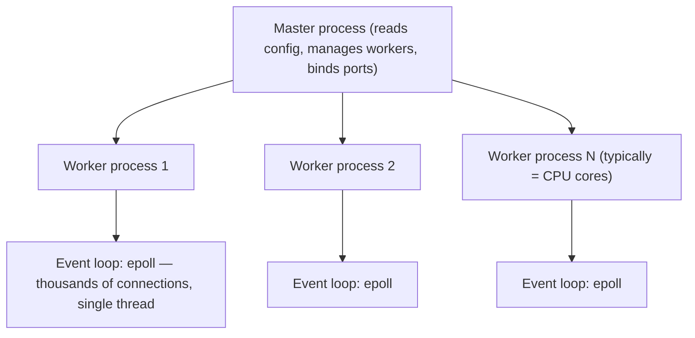
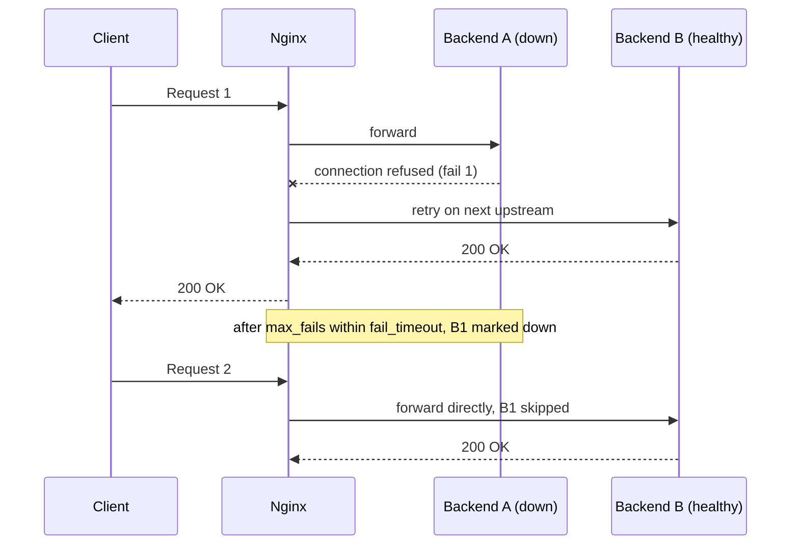
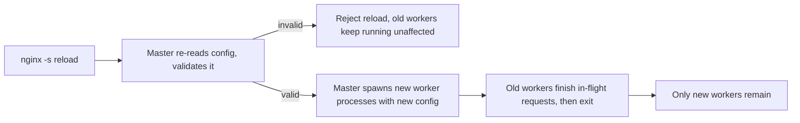

# Nginx as Reverse Proxy & Load Balancer

Almost no production service takes traffic directly on its application port. Something
sits in front of it: terminating TLS, spreading requests across many backend instances,
serving cached static assets without ever waking the application, and absorbing the kind of
abusive or misbehaving traffic that would otherwise reach application code directly. Nginx
is the most common answer to "what is that something," and interviewers probe it because
its architecture — a small number of event-driven worker processes instead of one
thread/process per connection — is a genuinely different concurrency model from most
application servers, with its own failure modes.

---

## 🟢 Beginner Level

### The Core Problem: One Application Server Is Not Enough

A single application server process has a ceiling: it can only accept as many concurrent
connections as its own concurrency model allows, it exposes exactly one port on exactly one
host, and if it crashes, every client talking to it is disconnected with nothing to fail
over to. Running many copies of the application solves the *capacity* problem but creates a
new one — clients need one stable address to connect to, not a list of five backend IPs
they manage themselves and re-check on every failure. A **reverse proxy** is the component
that owns that stable address, decides which backend actually serves each request, and
hides the backend topology (how many instances, which are healthy, which are being
restarted) from every client entirely.

### Reverse Proxy vs. Forward Proxy

The two are easy to confuse because they are structurally similar — a proxy sits between a
client and a server — but they exist to protect opposite sides of that connection:

| | Forward proxy | Reverse proxy |
|---|---|---|
| Acts on behalf of | The client | The server |
| Client is aware it's using a proxy | Usually yes (configured explicitly) | No — looks like talking to the server directly |
| Typical purpose | Anonymize/filter outbound traffic, corporate content control | Load balance, terminate TLS, cache, hide backend topology |
| Example | A corporate proxy filtering employee web access | Nginx in front of an application's backend fleet |

A **forward proxy** sits in front of clients and mediates their outbound requests to
arbitrary servers; a **reverse proxy** sits in front of servers and mediates inbound
requests from arbitrary clients, presenting one address to the outside world regardless of
how many real backends exist behind it.

### Nginx's Event-Driven Architecture

Nginx does not spawn a new OS thread or process per connection, which is what makes it
handle tens of thousands of concurrent connections on modest hardware where a
thread-per-connection server would exhaust memory and context-switching overhead long
before that:



A small, fixed number of **worker processes** (commonly one per CPU core) each run a single
event loop handling potentially thousands of connections simultaneously — a worker never
blocks waiting on one slow client or one slow backend, it registers interest in a socket
becoming readable/writable and moves on to whatever other connection is ready right now.
This is covered in full in the Expert tier; the beginner-level takeaway is that Nginx's
concurrency scales with the number of connections, not the number of OS threads.

### Basic Reverse Proxy Configuration

```nginx
http {
    upstream backend {
        server 10.0.1.10:8080;
        server 10.0.1.11:8080;
        server 10.0.1.12:8080;
    }

    server {
        listen 80;
        server_name api.example.com;

        location / {
            proxy_pass http://backend;
            proxy_set_header Host $host;
            proxy_set_header X-Real-IP $remote_addr;
            proxy_set_header X-Forwarded-For $proxy_add_x_forwarded_for;
        }
    }
}
```

An `upstream` block names a pool of backend servers. `proxy_pass` forwards matching
requests to that pool. The `proxy_set_header` lines matter more than they look: without
them, the backend sees every request as coming from Nginx's own IP on the `Host` header
Nginx chooses, losing the real client's address and the original hostname entirely —
`X-Forwarded-For` and `X-Real-IP` are how the backend recovers the actual client IP for
logging, rate limiting, or geo-based logic.

---

## 🟡 Intermediate Level

### Load Balancing Algorithms

An `upstream` block picks which backend gets each request using one of several algorithms:

| Algorithm | Directive | Behavior |
|---|---|---|
| Round robin (default) | *(none needed)* | Requests distributed sequentially, one at a time, across all servers |
| Weighted round robin | `server ... weight=3` | Servers with a higher weight receive proportionally more requests |
| Least connections | `least_conn` | Routes to whichever backend currently has the fewest open connections |
| IP hash | `ip_hash` | A client's IP is hashed to consistently pick the same backend |

Worked example: three backends, weights `5`, `3`, `2` (summing to 10). Over any 10 requests,
round-robin-with-weights sends approximately 5 to the first server, 3 to the second, 2 to
the third — useful when backends have genuinely different capacity (a newer, larger
instance getting proportionally more traffic than an older, smaller one). `least_conn` is
the better choice when requests have wildly uneven durations — plain round robin can pile
several slow, long-running requests onto one backend by coincidence of arrival order, while
`least_conn` actively routes new requests away from an already-busy backend. `ip_hash`
trades load-balancing precision for **session affinity**: the same client IP is
deterministically routed to the same backend every time, useful for backends holding
in-memory session state with no shared session store — at the cost that a single
backend going down disrupts every client hashed to it, and any client behind a NAT sharing
one public IP with many other clients all land on the same backend regardless of load.

### Health Checks and Upstream Failure Handling

Nginx's open-source version performs **passive health checks** by default: it does not
proactively probe backends, it notices failures on real traffic. `max_fails=3
fail_timeout=30s` on an upstream server means after 3 failed attempts within 30 seconds,
Nginx marks that backend unavailable and stops routing new requests to it for the next 30
seconds, after which it tries again. This means the *first* few real client requests during
an outage are the ones that discover the backend is down — there is no proactive probing
loop catching it in advance, unlike an active-health-check system (available in Nginx Plus,
or bolted on via a sidecar/service-mesh health check in Kubernetes-based deployments).



### TLS Termination

Nginx commonly **terminates TLS**: the client's encrypted connection ends at Nginx, and
Nginx talks to backends over plain HTTP inside a trusted internal network. This
concentrates certificate management in one place instead of every backend instance needing
its own certificate and TLS stack, and offloads the CPU cost of the TLS handshake and
encryption to a component built for it. The trade-off is that traffic between Nginx and the
backend is unencrypted unless a second, internal TLS layer is deliberately added (common in
zero-trust network designs where "inside the data center" is not assumed to be safe by
default).

### Caching Static Content and Proxy Responses

```nginx
proxy_cache_path /var/cache/nginx levels=1:2 keys_zone=api_cache:10m max_size=1g;

location /api/ {
    proxy_pass http://backend;
    proxy_cache api_cache;
    proxy_cache_valid 200 5m;
    proxy_cache_key "$request_uri";
    add_header X-Cache-Status $upstream_cache_status;
}
```

`proxy_cache_valid 200 5m` caches successful responses for 5 minutes, keyed by the request
URI — a repeated identical request within that window is served entirely from Nginx's disk
cache without ever reaching the backend, which matters enormously for read-heavy,
infrequently-changing endpoints. `$upstream_cache_status` (exposed as a response header
above) reports `HIT`, `MISS`, `EXPIRED`, or `BYPASS`, which is the first thing to check when
debugging "why is this endpoint serving stale data" — a cache set to 5 minutes will
legitimately serve 5-minute-old data by design, not by bug.

### Request Buffering and Timeouts

By default Nginx buffers a client's full request body before forwarding it to the backend,
and buffers the backend's full response before sending it to the client — this protects a
backend from a slow client trickling in a request body byte by byte (a slow client ties up
Nginx's fast event loop briefly, not a backend worker/thread for the whole duration).
`proxy_read_timeout` bounds how long Nginx waits for the backend to send data before giving
up; a value set too low aborts genuinely slow-but-working requests (a large report
generation, a slow database query) with a `504 Gateway Timeout`, and a value set too high
lets one hung backend hold a connection open indefinitely, which is why this number is
almost always a deliberate, workload-specific trade-off rather than a default left
untouched.

---

## 🔴 Expert Level

### The Master-Worker Model and Zero-Downtime Config Reloads

The master process's most operationally important job is handling `nginx -s reload`
without dropping a single connection:



The master never stops accepting connections during this process: new workers are started
alongside the old ones, and old workers are told to finish whatever requests they are
currently handling and then exit gracefully rather than being killed outright — no new
connections are routed to an old worker once new workers exist, but no in-flight request is
ever abruptly cut off either. A syntactically invalid config is rejected *before* any new
worker is spawned, so a bad reload leaves the previous, known-good workers running
untouched rather than taking the service down — this is why `nginx -t` (test configuration)
before every reload is close to a non-negotiable operational habit.

### Connection Handling: epoll and the C10K Problem

The **C10K problem** — serving 10,000+ concurrent connections on one machine — is
historically hard because a thread- or process-per-connection model exhausts memory (each
thread's stack alone is typically megabytes) and spends increasing CPU time just context
switching between them long before reaching that count. Nginx's worker processes instead
use **epoll** (on Linux; equivalent mechanisms exist on other platforms) — a kernel facility
letting one thread register interest in thousands of file descriptors and be woken only for
the ones that actually became readable or writable, rather than the process having to poll
or block on each one individually. A single worker's event loop can therefore hold open,
genuinely idle-but-connected clients (a long-polling connection, a websocket, a slow
upload) essentially for free — the cost is proportional to active I/O events, not to the
raw count of open connections, which is exactly the property that lets one worker process
per CPU core serve far more concurrent connections than that many OS threads ever could on
the same hardware.

### Rate Limiting: `limit_req` and a Worked Example

```nginx
limit_req_zone $binary_remote_addr zone=api_limit:10m rate=10r/s;

location /api/ {
    limit_req zone=api_limit burst=20 nodelay;
    proxy_pass http://backend;
}
```

`rate=10r/s` allows a steady 10 requests per second per client IP, implemented as a
**leaky bucket**: requests arriving faster than that rate are queued, not immediately
rejected, up to `burst=20` additional requests. Worked example: a client sends 25 requests
in a single instant. The first 10 are accepted at the steady rate immediately (this second's
allowance); the next `burst=20` are queued and released at the steady 10/s rate over the
following roughly 2 seconds (`nodelay` changes this specific behavior — it releases
burst-allowed requests immediately instead of smoothing their delivery, trading a smoother
downstream rate for lower client-perceived latency); the remaining requests beyond `rate +
burst` = 30 total are rejected outright with `503 Service Unavailable`. This shape — a
steady sustainable rate plus a bounded burst allowance — is deliberately more forgiving than
a hard per-second cutoff, since real client traffic is naturally bursty even from a single
well-behaved client.

### Production Failure Modes

**Thundering herd on mass reload/restart.** Restarting every Nginx instance in a fleet
simultaneously (a bad deploy script, an unthinking rolling restart with no stagger) means
every one of them re-establishes every upstream connection at the same moment, which can
spike backend connection counts far above steady state and trip backend-side connection
limits that were sized for gradual reconnection, not a synchronized flood.

**Sticky sessions via `ip_hash` breaking under NAT.** Many clients behind one corporate or
mobile-carrier NAT share a single public IP; `ip_hash` routes all of them to the same
backend regardless of that backend's actual load, silently creating a hot spot that looks
like unexplained uneven load from the outside — the fix is a real session store (Redis,
a database-backed session) shared across backends instead of relying on IP-based affinity.

**Buffer size misconfiguration on large headers.** Nginx allocates fixed-size buffers for
request headers (`large_client_header_buffers`); a client or an authentication proxy
sending unusually large headers (a bloated JWT in an `Authorization` header, an oversized
cookie) can exceed the default and receive a `400 Bad Request` or `414 Request-URI Too
Large` that has nothing to do with the actual backend logic — a frequent source of "it
works for most users but fails for some" bug reports traced back to session/token size, not
application code.

**Slowloris-style attacks.** A client that opens many connections and sends request data
extremely slowly, one byte at a time, can exhaust available worker connections if timeouts
are not tuned defensively; `client_body_timeout` and `client_header_timeout` bound how long
Nginx waits for a slow client to finish sending data at all, closing connections that stall
past that window rather than holding them open indefinitely on the hope the client
eventually finishes.

### Common Misconceptions

- **"Nginx uses one thread per connection like a traditional web server."** It uses a small,
  fixed number of worker processes, each running a single-threaded event loop over
  `epoll`, handling potentially thousands of connections each — this is precisely why it
  scales past connection counts that would exhaust a thread-per-connection model.
- **"Reloading Nginx's config causes a brief outage."** A valid reload starts new workers
  alongside old ones and lets old workers drain in-flight requests before exiting — no
  connection is dropped and no new connection is ever refused during a normal reload.
- **"Round robin distributes load evenly."** It distributes *request count* evenly, not
  actual load — a mix of fast and slow requests routed round-robin can still leave one
  backend disproportionately busy purely by the coincidence of which requests it happened
  to receive; `least_conn` targets actual concurrent load instead.
- **"`ip_hash` guarantees perfectly even load."** It guarantees session affinity, which is a
  different goal — clients sharing one IP (common behind NAT) all land on the same backend
  regardless of that backend's real load, which can create hot spots invisible to per-request
  load metrics.
- **"TLS termination at Nginx means the whole path is encrypted."** It means the client-to-Nginx
  hop is encrypted; Nginx-to-backend traffic is plain HTTP unless a second internal TLS
  layer is deliberately configured — assuming otherwise is a common false sense of
  end-to-end security.

### Interview Questions

**Q1. What is the difference between a forward proxy and a reverse proxy?** `[easy]`

A forward proxy acts on behalf of the client, sitting between clients and arbitrary servers
they want to reach, typically for anonymizing or filtering outbound traffic — the client is
usually explicitly configured to use it. A reverse proxy acts on behalf of the server,
sitting between arbitrary clients and a pool of backend servers, presenting one stable
address to the outside world; clients have no idea a reverse proxy or multiple backends
exist at all.

**Q2. Why does Nginx handle many more concurrent connections than a typical thread-per-connection application server on the same hardware?** `[easy]`

Nginx uses a small, fixed number of worker processes, each running a single event loop over
a kernel facility like `epoll` that lets one thread monitor thousands of file descriptors
and only wakes up for the ones actually ready for I/O. A thread-per-connection model instead
pays a real memory cost per thread (each thread's stack alone is typically megabytes) and
increasing CPU overhead from context-switching between them, which is why it hits a much
lower practical connection ceiling on identical hardware.

**Q3. What do `proxy_set_header X-Real-IP` and `X-Forwarded-For` actually solve?** `[easy]`

Without them, every request the backend receives appears to originate from Nginx's own IP
address, since Nginx is the one making the actual TCP connection to the backend — the real
client's IP is otherwise lost entirely. These headers carry the original client IP through
explicitly so backend logging, rate limiting, or geo-based logic can use the real client
address instead of Nginx's.

**Q4. Explain the difference between round robin, least connections, and IP hash load balancing.** `[easy]`

Round robin distributes requests sequentially across backends regardless of how busy each
one currently is. Least connections routes each new request to whichever backend currently
has the fewest open connections, actively balancing based on real-time load rather than
just request count. IP hash deterministically routes a given client IP to the same backend
every time, trading load-balancing precision for session affinity, useful when a backend
holds in-memory session state with no shared store.

**Q5. What happens, step by step, when you run `nginx -s reload` with a valid config change?** `[medium]`

The master process reads and validates the new configuration first; if it's valid, the
master spawns new worker processes running the new configuration while the existing workers
keep running unaffected. New connections are routed only to the new workers, while old
workers are told to finish any requests they are currently handling and then exit — no
in-flight request is cut off and no new connection is ever refused during this transition,
which is why reloading is considered safe to do during live traffic.

**Q6. Why might round-robin load balancing still leave one backend meaningfully more loaded than the others, even though each receives an equal request count?** `[medium]`

Round robin balances request *count*, not request *cost* — if some requests are far more
expensive than others (a heavy report query versus a simple lookup), a backend can
accumulate several long-running expensive requests purely by the coincidence of arrival
order, while another backend's requests all happen to be cheap and finish quickly. Least
connections targets this directly by routing new requests toward whichever backend
currently has the fewest requests actually in flight, rather than by a fixed rotation.

**Q7. A client reports intermittent `504 Gateway Timeout` errors only for one specific, slow report-generation endpoint. What's the likely cause and fix?** `[medium]`

`proxy_read_timeout` bounds how long Nginx waits for the backend to respond before giving up
and returning a 504 to the client; a value tuned for typical fast endpoints is very likely
too short for a genuinely slow report-generation request that legitimately takes longer to
complete. The fix is either a longer, endpoint-specific `proxy_read_timeout` for that
location block, or making the endpoint asynchronous (return immediately, let the client poll
for completion) so no single request needs to stay open that long in the first place.

**Q8. What does `proxy_cache_valid 200 5m` actually guarantee, and what's the first thing to check if a cached endpoint is serving data that should have already changed?** `[medium]`

It guarantees that a successful (200) response is served from Nginx's own cache for 5
minutes after being cached, without contacting the backend again for an identical cache key
during that window — this is by design, not a bug, so up to 5-minute-stale data is the
expected behavior. The first thing to check is the `$upstream_cache_status` response header
(`HIT`, `MISS`, `EXPIRED`, `BYPASS`) to confirm whether the response actually came from cache
at all before assuming the backend itself returned stale data.

**Q9. Why does `ip_hash` load balancing sometimes create a hot backend that receives far more traffic than the others, even under otherwise uniform traffic?** `[medium]`

Many real clients share a single public IP address behind a NAT — a corporate network, a
mobile carrier's gateway — and `ip_hash` deterministically routes every client hashing to
the same value to the same backend regardless of how many distinct real users that
represents or how loaded that backend already is. A large enough group of NAT'd clients can
therefore concentrate disproportionate real traffic onto one backend purely because they
share one apparent IP, which per-backend request-count metrics alone won't explain without
knowing the client IP distribution.

**Q10. Walk through what `limit_req_zone ... rate=10r/s` combined with `limit_req ... burst=20` actually does when a client sends 25 requests at once.** `[hard]`

This is a leaky-bucket rate limiter: the steady rate allows 10 requests per second per
client, and `burst=20` allows up to 20 additional requests to queue beyond that steady rate
rather than being rejected immediately. Of 25 simultaneous requests, roughly 10 are accepted
under the current second's allowance, up to 20 more are queued and released at the 10/s
steady rate over the following couple of seconds (or released immediately if `nodelay` is
set, trading smoothed delivery for lower perceived latency), and anything beyond `rate +
burst` total is rejected outright with a 503 — the design intentionally tolerates natural
burstiness rather than enforcing a hard per-second wall.

**Q11. Why is `nginx -t` before every reload considered close to mandatory operational practice?** `[hard]`

A reload with an invalid configuration is rejected by the master process before any new
worker is spawned, so the existing, known-good workers keep running completely unaffected —
but only if the master gets the chance to validate first rather than being interrupted or
scripted around. `nginx -t` performs that exact syntax and basic semantic validation ahead
of time, letting an operator catch a bad config change in a controlled way instead of
discovering it only when a scripted reload silently no-ops (or, in edge cases depending on
how the reload is invoked, potentially leaves the fleet in an inconsistent state across
instances) during an actual deploy.

**Q12. How does Nginx's event-driven model let one worker handle thousands of slow, idle-but-open connections (like long-polling or websockets) without proportionally more resource usage?** `[hard]`

Each connection registered with `epoll` costs the kernel a lightweight file-descriptor entry,
not a dedicated thread or process — the worker's single event loop is only woken up when a
specific connection actually has readable or writable data, so a connection that is open but
idle consumes essentially no CPU time while it waits. This is fundamentally different from a
thread-per-connection model, where every open connection ties up a full OS thread's memory
and scheduling overhead regardless of whether that connection is currently doing anything at
all, which is exactly why event-driven servers scale to far higher counts of mostly-idle,
long-lived connections on the same hardware.

**Q13. A fleet-wide restart of every Nginx instance at the same moment causes a spike in backend errors immediately afterward. What's the mechanism, and how would you prevent it?** `[hard]`

Every restarted instance re-establishes its upstream connections and begins routing live
traffic to backends at essentially the same moment, which can produce a synchronized surge
in new backend connections far above the gradual, staggered pattern the backend's own
connection limits and connection-pool sizing assumed. The fix is restarting instances in
a staggered rolling fashion — a fraction of the fleet at a time, with a pause between
batches — so backend connection counts ramp up gradually instead of all at once, the same
principle behind a Kubernetes Deployment's rolling update `maxSurge`/`maxUnavailable`
bounds.

**Q14. Why can a client's authentication token size alone cause `400 Bad Request` errors at the proxy layer that have nothing to do with the backend application?** `[hard]`

Nginx allocates fixed-size buffers for request headers via directives like
`large_client_header_buffers`, and a request whose combined headers (including a large
bearer token or an oversized cookie in the `Authorization`/`Cookie` header) exceed that
configured buffer size is rejected by Nginx itself before the request ever reaches the
backend application — the application code is never at fault and never even sees the
request. The fix is either increasing the relevant buffer-size directive to accommodate the
actual token size in use, or reducing what is carried in the header (a shorter session
reference instead of an inline token) if the token size itself is avoidable.

Further reading: [Nginx's own documentation on load balancing](https://nginx.org/en/docs/http/load_balancing.html)
covers every algorithm and its exact directives; the
[Nginx architecture whitepaper on connection processing](https://nginx.org/en/docs/events.html)
explains the event-loop model referenced throughout; the
[C10K problem essay](http://www.kegel.com/c10k.html) is the original write-up of the
scaling problem event-driven servers like Nginx were built to solve.
