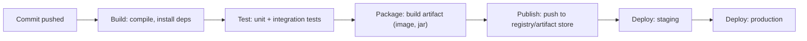
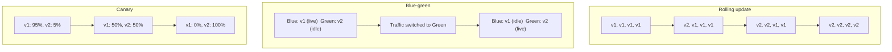
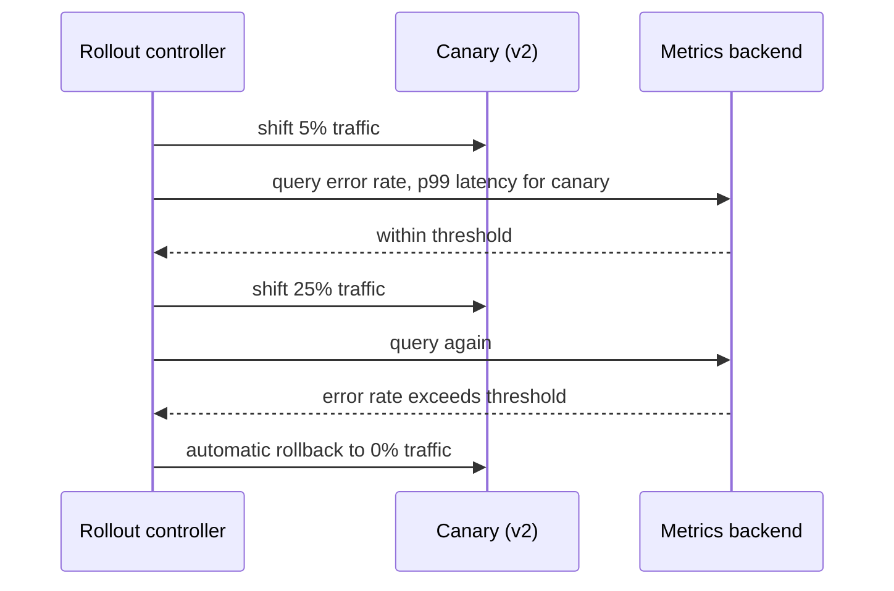
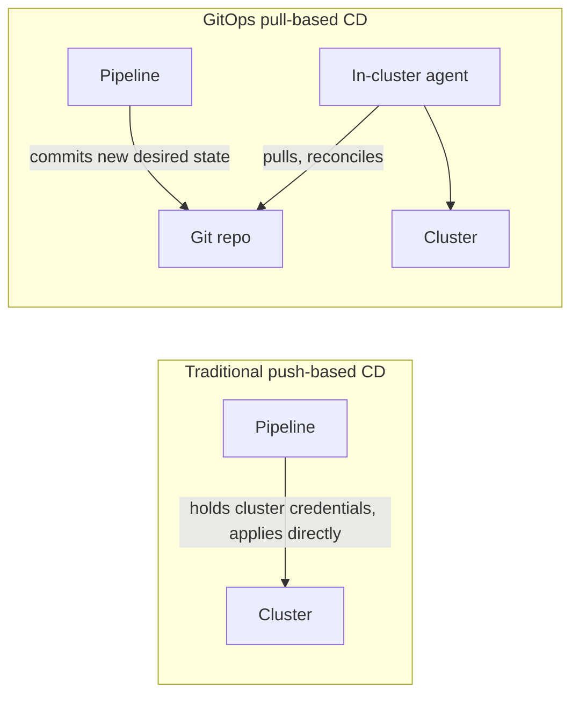

# CI/CD Pipelines & Deployment Strategies

Every other topic in this category — containers, orchestration, load balancing — describes
how a running system behaves. CI/CD describes how code gets from a developer's commit into
that running system safely and repeatably. Interviewers ask about this because "we have a
pipeline" hides real engineering decisions: how much is automated versus gated by a human,
how a bad release is caught before it reaches every user, and how a rollback actually
happens when something does slip through.

---

## 🟢 Beginner Level

### The Core Problem: Manual Deploys Don't Scale and Don't Repeat

A manual deploy — SSH to a server, pull the latest code, restart the process, repeat for
every server — has three problems that compound as a team and its traffic grow: it is
**slow** (a human doing the same steps by hand for every server and every release), it is
**inconsistent** (a step skipped under time pressure, a different order on server 3 than
server 1), and it is **risky** (nothing stops a broken build from reaching production except
the person doing the deploy noticing before they hit enter). CI/CD replaces this with an
automated, repeatable pipeline: the same sequence of steps, in the same order, with the
same validation, every single time — which is precisely what makes deploys boring instead
of an event people schedule around and dread.

### Continuous Integration, Delivery, and Deployment

These three terms describe increasing levels of automation, and are frequently used
interchangeably in casual conversation despite meaning genuinely different things:

| Term | What's automated | What still requires a human |
|---|---|---|
| **Continuous Integration (CI)** | Every commit is automatically built and tested | Deciding when/whether to deploy at all |
| **Continuous Delivery (CD)** | Every commit that passes CI produces a release candidate ready to deploy | Pressing the button to actually deploy to production |
| **Continuous Deployment (CD)** | Every commit that passes all checks deploys to production automatically | Nothing — a human never gates the deploy step |

**Continuous Integration** is the foundation: every commit triggers an automatic build and
test run, catching integration problems (two developers' changes conflicting in ways that
compile individually but break together) within minutes instead of being discovered days
later when someone finally tries to combine everyone's work. **Continuous Delivery** builds
on top of that: every commit that passes CI is automatically packaged into a
deployable artifact, verified as genuinely deployable, but a human still decides *when* to
actually release it. **Continuous Deployment** removes that last human gate entirely — a
passing commit ships to production with no manual approval step, which is a genuine
organizational trust decision, not merely a technical toggle.

### Anatomy of a Pipeline



Each stage exists to catch a specific class of problem before it reaches the next one, and
each stage is meant to fail fast and loud: a broken build fails at **Build**, a broken test
fails at **Test**, and neither should ever be discovered later in **Deploy**, where fixing
it is far more expensive and far more visible to users. A pipeline is only as trustworthy
as its earliest possible failure point — a team that lets the test stage pass with known
flaky failures has effectively moved that failure point all the way to production.

### A Basic Pipeline Definition

```yaml
name: ci
on: [push]
jobs:
  build-and-test:
    runs-on: ubuntu-latest
    steps:
      - uses: actions/checkout@v4
      - run: npm ci
      - run: npm test
      - run: npm run build
      - name: Build and push image
        run: |
          docker build -t registry.example.com/app:${{ github.sha }} .
          docker push registry.example.com/app:${{ github.sha }}
```

Tagging the built image with the commit SHA (`${{ github.sha }}`), not a mutable name like
`latest`, is the single habit that makes everything downstream traceable: any running
instance's exact source code is one `docker inspect` away, and rolling back means
redeploying a specific prior SHA rather than hoping a mutable tag still points at what it
used to.

---

## 🟡 Intermediate Level

### Build Once, Promote the Same Artifact

A common mistake is rebuilding the application separately for staging and production — even
with identical source code, a separate build can pull a slightly different dependency
version (an unpinned transitive dependency resolved differently on a different day),
producing an artifact that is not actually bit-for-bit what was tested. The correct pattern
is **build once, promote everywhere**: one artifact is built and tested exactly once, then
that exact same artifact — the same container image digest, the same jar file — is
promoted through staging, then production, unchanged. What passed testing is, by
construction, bit-for-bit identical to what runs in production; there is no gap in which
"the tested thing" and "the deployed thing" could silently diverge.

### Deployment Strategies: Rolling, Blue-Green, and Canary



| Strategy | How it works | Rollback speed | Cost |
|---|---|---|---|
| Rolling update | Old instances replaced by new ones gradually, in place | Slow — must roll forward or reverse the same gradual process | Low — no duplicate infrastructure |
| Blue-green | Two complete environments; traffic switches all at once | Instant — switch traffic back to the untouched old environment | High — double the infrastructure runs simultaneously (briefly) |
| Canary | New version receives a small traffic percentage, increased gradually if healthy | Fast — cut canary traffic back to 0% | Low-moderate — only a small extra fraction of capacity |

A **rolling update** (the Kubernetes Deployment default) replaces instances gradually with
no second full environment, but a rollback means running the same gradual process in
reverse, which takes real time either direction. A **blue-green** deploy keeps two complete,
independent environments — the currently-live one ("blue") and the new version fully
deployed but receiving no traffic ("green") — then switches all traffic at once (a load
balancer or DNS change), making rollback as fast as switching back, at the cost of running
double infrastructure for the overlap period. A **canary** deploy sends a small, real
percentage of production traffic to the new version first — real users, real requests — and
only increases that percentage if the new version's error rate and latency stay healthy,
which is the only one of the three that validates the new version against real production
traffic patterns *before* it serves everyone, at the cost of running a real (if small)
production risk on that initial slice of traffic.

### Feature Flags: Decoupling Deploy from Release

A **feature flag** wraps new code in a runtime-toggleable condition, separating two
decisions that deploy strategies alone conflate: *is the code running in production* versus
*is the feature visible to users*. Code can be deployed dark (flag off, running but
invisible) well ahead of the actual release, tested against real production infrastructure
with zero user-facing risk, then enabled for 1% of users, then 100% — entirely independent
of any deploy event. This also makes **rollback** nearly instant for a feature-level
problem: flipping a flag off is a config change, not a redeploy, so it can happen in
seconds instead of waiting for a new pipeline run.

### Pipeline Caching and Parallelization

Worked example, real numbers: a pipeline with three independent test suites (unit: 4
minutes, integration: 6 minutes, end-to-end: 8 minutes) run **sequentially** takes 18
minutes total. Run in **parallel** across three runners, the pipeline's wall-clock time is
bounded by the slowest suite alone — 8 minutes — plus fixed overhead (checkout, dependency
install) each runner pays independently. **Dependency caching** (keying a cache on a
lockfile's hash, restoring it on a cache hit instead of reinstalling from scratch) commonly
cuts a multi-minute `npm ci`/`mvn dependency:go-offline` step down to a few seconds when
the lockfile hasn't changed since the last run — the combined effect of parallelization and
caching is routinely the difference between an 18-20 minute pipeline and one under 10
minutes, which matters enormously for how many times per day a team can realistically
iterate.

### Secrets Management in Pipelines

A pipeline frequently needs real credentials — a registry push token, a cloud deploy
credential, a database migration password — and these must never be hard-coded in the
pipeline definition file itself, since that file is version-controlled and often
world-readable within an organization. The standard pattern is a **secrets store** built
into the CI platform (encrypted at rest, injected as environment variables only at run
time, never written to the pipeline definition or, ideally, ever printed to build logs) or
an external secrets manager the pipeline authenticates to at runtime. A secret that leaks
into build logs is effectively public within the organization the moment it's printed,
regardless of how carefully it was stored — this is why disabling shell command echoing
around any step handling a secret is a standard, non-optional precaution.

---

## 🔴 Expert Level

### Progressive Delivery: Automated Canary Analysis and Rollback

A manually-watched canary still depends on a human noticing a problem and reacting in time.
**Progressive delivery** automates that judgment: a controller (Argo Rollouts, Flagger, or
similar) shifts traffic to a canary in small steps, but at each step it queries real metrics
— error rate, p99 latency, a business metric — against the canary's traffic specifically,
comparing it against the stable version's baseline, and only proceeds to the next traffic
step if the canary stays within an acceptable threshold.



The critical property is that rollback is triggered by the same automated analysis, with no
human in the loop required to catch it — a regression that only manifests under real
traffic (a specific query pattern, a cache-cold-start effect that only shows up past a
certain load) is caught and reverted within the analysis window, typically minutes, rather
than however long it takes a human to notice a dashboard and decide to act.

### GitOps: Git as the Single Source of Deployment Truth

Traditional CD **pushes** changes to a target environment — the pipeline itself holds
credentials to the production cluster and directly applies changes. **GitOps** inverts
this: the desired state of the cluster (which image versions, which config) lives entirely
in a Git repository, and an in-cluster agent (Argo CD, Flux) **pulls** from that repository
and reconciles the live cluster to match it — the same reconciliation-loop model Kubernetes
itself uses internally, applied one level up to deployments themselves.



This has two concrete operational benefits beyond philosophy: **no CI system ever needs
direct production credentials** (only the in-cluster agent does, and it only ever pulls, it
is never reachable from outside to be pushed to), and **Git history becomes a complete,
auditable deployment history** — every change to what's running in production is a
reviewable, revertable commit, so "what changed, when, and who approved it" is answered by
`git log` rather than by reconstructing it from a CI system's separate, often
shorter-retention deploy logs.

### Production Failure Modes

**Flaky tests eroding pipeline trust.** A test that intermittently fails for reasons
unrelated to real regressions (timing-dependent assertions, shared test state, network
flakiness in a CI runner) trains a team to reflexively re-run the pipeline on failure rather
than investigate — the failure mode is not the flaky test itself, it's the team's learned
behavior of ignoring red pipelines, which eventually lets a genuine regression through
because "it's probably just flaky" became a default assumption.

**Non-reproducible builds.** A pipeline that resolves dependency versions freshly on every
run (no lockfile, or a lockfile not actually respected) can produce a subtly different
artifact today than it did yesterday from the identical source commit — this breaks the
entire premise of "build once, promote everywhere" and makes a production incident
essentially impossible to reproduce locally, since rebuilding from the same commit does not
guarantee the same result.

**Deploying application code and database migrations out of order.** A rolling deploy where
new application code expects a schema column that the migration step hasn't run yet (or,
symmetrically, an old application instance still running against a schema that a migration
already changed underneath it mid-rollout) produces errors that only exist during the
transition window and can be maddening to reproduce after the fact — the standard fix is
designing migrations to be backward-compatible with the previous application version for at
least one full deploy cycle (add a column without dropping the old one yet; drop it only in
a later, separate deploy).

**Secrets leaking through build logs.** A debug flag left on, or a script that echoes every
command before running it, can print a secret's actual value into build logs that are far
more widely readable than the secrets store itself — once printed, the secret must be
treated as compromised and rotated, since a log line cannot be un-printed from every place
that log might have already been copied, cached, or forwarded to.

### Common Misconceptions

- **"CI/CD means fully automated deploys with no human involved."** Continuous Delivery
  deliberately keeps a human gate on the actual production release — only Continuous
  Deployment removes it entirely, and that is an organizational trust decision, not just a
  pipeline configuration flag.
- **"Blue-green and canary are the same idea with different names."** Blue-green switches
  all traffic at once between two complete environments; canary gradually shifts a
  *percentage* of traffic and validates it against real metrics before proceeding — a
  canary catches a bad release affecting only its small traffic slice, while blue-green's
  instant full-traffic switch means a bad release is instantly full-traffic too, just
  instantly revertible.
- **"A feature flag is the same thing as a deployment strategy."** A flag controls whether
  code that is already running is *visible*; a deployment strategy controls how new code
  actually *gets deployed and receives traffic* in the first place — they solve different
  problems and are commonly combined, not substitutes for each other.
- **"GitOps just means using Git for CI/CD."** Nearly every modern pipeline already uses Git
  for source control; GitOps specifically means the cluster's desired state lives in Git and
  an in-cluster agent pulls and reconciles toward it, rather than a pipeline pushing changes
  with direct cluster credentials.
- **"Passing CI means the code is production-ready."** CI validates what the test suite
  actually covers — a passing pipeline says nothing about untested edge cases, real
  production load patterns, or a canary/progressive-delivery stage that hasn't run yet;
  "tests pass" and "safe to deploy to 100% of users immediately" are different claims.

### Interview Questions

**Q1. What's the actual difference between Continuous Delivery and Continuous Deployment?** `[easy]`

Continuous Delivery means every commit that passes the pipeline produces a genuinely
deployable release artifact, but a human still decides when to actually deploy it to
production. Continuous Deployment removes that human gate entirely — any commit that passes
all automated checks deploys to production automatically, with no manual approval step at
all. The two terms are often used interchangeably in casual speech, but the presence or
absence of a human gate is a real, meaningful difference in practice.

**Q2. Why should a build artifact be tagged with a commit SHA instead of a mutable name like `latest`?** `[easy]`

A commit SHA uniquely and permanently identifies the exact source code that produced that
artifact, so any running instance can be traced back to its precise code with certainty. A
mutable tag like `latest` can be reassigned to a completely different build at any time,
which means the same tag string can refer to different actual content depending on when it
was pulled, making rollback and incident investigation far harder — you can't be certain
what code is actually running.

**Q3. Why is "build once, promote the same artifact" considered better practice than rebuilding separately for each environment?** `[easy]`

Rebuilding separately for staging and production, even from identical source code, risks
pulling a slightly different dependency version if anything is unpinned, meaning what was
actually tested in staging is not guaranteed to be bit-for-bit identical to what runs in
production. Building exactly once and promoting that same artifact through every
environment guarantees there is no gap between "what was tested" and "what is deployed" —
they are, by construction, the same bytes.

**Q4. What problem does a canary deployment solve that a rolling update does not?** `[easy]`

A rolling update replaces instances gradually but every replaced instance still receives its
full share of production traffic once it's up — there is no deliberate, controlled exposure
of the new version to only a small slice of real traffic first. A canary deployment
specifically routes a small percentage of real production traffic to the new version and
validates its behavior against real usage patterns before increasing that percentage,
catching problems that would otherwise only show up under genuine production load.

**Q5. Why does a feature flag make rollback of a bad feature faster than redeploying?** `[medium]`

A feature flag is a runtime configuration toggle, so disabling a problematic feature means
flipping that flag off — a config change that typically takes effect in seconds. Redeploying
a previous version instead requires running an entire pipeline (or at minimum a deploy
stage) again, which takes meaningfully longer and depends on the previous artifact still
being readily available to redeploy at all.

**Q6. A pipeline's total run time drops from 18 minutes to under 10 after two changes: running test suites in parallel and adding dependency caching. Explain what each change actually did.** `[medium]`

Running previously-sequential test suites in parallel across multiple runners means the
pipeline's wall-clock time is bounded by the single slowest suite rather than the sum of all
of them — three suites taking 4, 6, and 8 minutes sequentially total 18 minutes, but in
parallel the pipeline only waits on the 8-minute suite plus per-runner overhead. Dependency
caching, keyed on a lockfile hash, skips a full dependency reinstall whenever the lockfile
hasn't changed since the last cached run, cutting a step that can otherwise take several
minutes down to a few seconds on a cache hit.

**Q7. Why is a rolling deployment's rollback not necessarily fast, even though it sounds like "reverse the process"?** `[medium]`

A rollback of a rolling deployment is itself a rolling process in the opposite direction —
old instances (the version being rolled back to) must be brought back up and new instances
drained, gradually, the same way the original rollout proceeded gradually. This takes real
time proportional to the same batching and readiness-checking the forward rollout used,
unlike a blue-green deploy's rollback, which is just switching traffic back to an
environment that was never actually torn down and is instantly available.

**Q8. Why can deploying new application code and a database migration slightly out of order during a rolling update cause errors that are hard to reproduce afterward?** `[medium]`

During a rolling update there is a window where old and new application instances run
simultaneously against the same database — if the migration and the code expecting its
result don't land in a strictly compatible order, some requests hit an instance whose
expectations don't match the schema's actual current state at that exact moment. Once the
rollout completes, every instance and the schema are consistent again, so the error is
specific to that transition window and disappears on its own, making it look like it "just
happened once" rather than a systemic ordering problem waiting to recur on the next deploy.

**Q9. Your team's pipeline has a test that fails intermittently about 1 in 20 runs for reasons unrelated to real code changes. What's the actual risk of leaving it as-is?** `[medium]`

The immediate symptom is wasted time re-running the pipeline, but the real risk is
behavioral: engineers learn to treat a red pipeline as "probably just the flaky test" and
re-run without investigating, which means a genuine regression that happens to fail
alongside — or instead of — the flaky test can get the same reflexive "just re-run it"
treatment and slip through. The fix is treating any flaky test as a priority bug to
quarantine or fix immediately, not something to tolerate, specifically because its cost
compounds through eroded trust in the whole pipeline's signal.

**Q10. Explain how a progressive-delivery controller automatically decides to roll back a canary, without a human watching a dashboard.** `[hard]`

The controller shifts a small percentage of real traffic to the canary version and, at each
traffic-increase step, queries a metrics backend for the canary's specific error rate and
latency, comparing them against the stable version's baseline over the same window. If the
canary's metrics breach a configured threshold at any step, the controller automatically
shifts traffic back to the stable version — the rollback decision and its execution are both
automated, so a regression that only manifests under real traffic is caught and reverted
within the analysis window rather than depending on a human noticing a dashboard in time.

**Q11. What does GitOps change about where production deployment credentials live, and why does that matter for security?** `[hard]`

In a traditional push-based pipeline, the CI system itself must hold direct credentials to
the production cluster in order to apply changes to it, meaning a compromised CI pipeline is
a direct path to production access. In a GitOps model, only an in-cluster agent holds those
credentials, and it operates purely by pulling from a Git repository and reconciling toward
it — the CI pipeline only needs permission to commit to that Git repository, never direct
cluster access, which meaningfully shrinks the blast radius if the CI system itself is ever
compromised.

**Q12. Why does GitOps's pull-based reconciliation model make Git history function as a complete deployment audit log, in a way push-based CD typically doesn't?** `[hard]`

Because the cluster's desired state is defined entirely as files in a Git repository and the
in-cluster agent's only job is reconciling toward whatever is currently committed there,
every change to what runs in production necessarily exists as a reviewable, timestamped Git
commit with an author — there is no other path to changing production state. Push-based CD
typically logs deploys in the CI system itself, which is a separate system with its own
retention policy and is not inherently tied to a reviewable commit-and-approval workflow the
way a Git-based pull request naturally is.

**Q13. A canary deployment at 25% traffic shows a slightly elevated error rate, but it's within the automated rollback threshold, so the rollout proceeds to 50%. At 50% traffic the error rate spikes sharply and triggers automatic rollback. What does this progression suggest about the actual bug, and why didn't 25% catch it?** `[hard]`

A sharp jump in error rate specifically between 25% and 50% traffic, rather than a steady
error rate at any traffic level, suggests a load- or concurrency-dependent bug — something
that only manifests once a certain absolute request volume or concurrent connection count
is reached, such as a connection pool being sized for the smaller traffic slice, a resource
contention issue, or a cache that only starts thrashing past a certain hit rate. At 25%
traffic the absolute load on the canary simply hadn't crossed whatever threshold triggers
the underlying problem yet, which is exactly the class of bug a canary strategy is
specifically designed to surface progressively rather than all at once.

**Q14. Why is "our test suite passed" not the same claim as "this is safe to release to 100% of production traffic," even in a mature CI/CD setup?** `[hard]`

A test suite validates exactly what it was written to check — known edge cases, known
integration points, known load patterns as of when the tests were written — and says
nothing about production traffic patterns, data shapes, or scale the test suite never
modeled. A mature pipeline treats a passing test suite as necessary but not sufficient,
adding further real-traffic validation stages like canary analysis or progressive delivery
specifically because production is the only environment that reliably exercises the actual
distribution of real usage, which no test suite fully replicates no matter how
comprehensive it is.

Further reading: [Google's SRE book chapter on release engineering](https://sre.google/sre-book/release-engineering/)
covers the build-once/promote-everywhere principle in depth; the
[Argo Rollouts documentation on canary analysis](https://argo-rollouts.readthedocs.io/en/stable/features/canary/)
describes automated progressive-delivery mechanics referenced above; the
[GitOps principles from the OpenGitOps project](https://opengitops.dev/) define the
pull-based reconciliation model as a formal specification.
