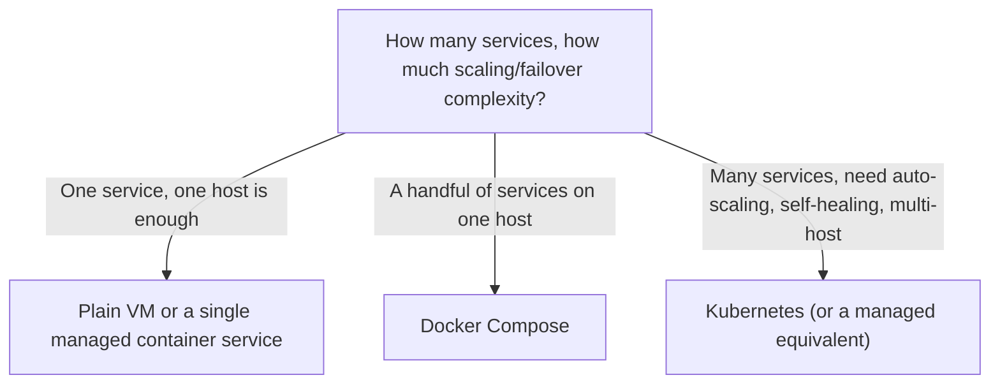
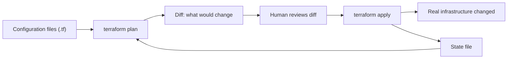
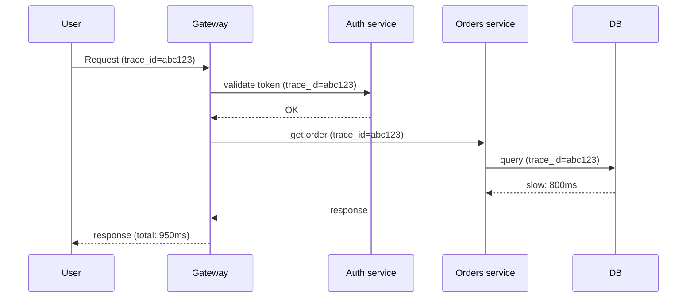

# Orchestration Trade-offs, Infrastructure as Code, Observability & Cloud Fundamentals

The earlier DevOps topics cover specific tools in depth — Docker, Kubernetes, Nginx, CI/CD
pipelines. This one covers the decisions and disciplines that sit *around* those tools:
when orchestration is actually worth its complexity cost, how infrastructure itself becomes
version-controlled and reviewable instead of a set of undocumented manual changes, how a
team actually knows what's wrong in production before a customer tells them, and the basic
vocabulary of the cloud platforms all of this typically runs on. Interviewers ask about
these because picking the right tool for the job — and knowing when *not* to reach for the
heaviest one — is a more senior signal than knowing any single tool's flags.

---

## 🟢 Beginner Level

### Orchestration Trade-offs: When You Don't Need Kubernetes

Kubernetes solves real problems — self-healing, scheduling across many machines,
declarative rollouts — but it is not free: it requires standing up (or paying for) a
control plane, learning a genuinely large API surface, and operating a system with its own
failure modes on top of whatever the application itself might fail at. A team running one
or two services with predictable, low-to-moderate traffic often gets more value from a
smaller solution:



A single VM running the application directly, or a managed single-container platform (a
cloud provider's "run this container" service), is often genuinely sufficient and
dramatically simpler to operate than a Kubernetes cluster for a small number of services
with modest scale. Docker Compose is the natural next step once an application becomes
several cooperating containers on one host but does not yet need multi-host scheduling or
automatic failover. Kubernetes earns its complexity once a system genuinely needs
multi-host scheduling, automated healing across machine failures, and workload elasticity —
reaching for it before that point is choosing operational overhead the team does not yet
need.

### Infrastructure as Code: The Core Idea

Before Infrastructure as Code (IaC), provisioning a server, a database, a network meant
clicking through a cloud console or running one-off CLI commands — repeatable in theory,
but in practice undocumented, easy to do slightly differently the second time, and
impossible to review before it happens. **IaC** describes infrastructure the same way code
describes application logic: in version-controlled, declarative configuration files that a
tool reconciles the real infrastructure toward, the same reconciliation-loop idea covered
for Kubernetes applied one layer down, to the infrastructure the cluster itself runs on.

```hcl
resource "aws_instance" "web" {
  ami           = "ami-0abcdef1234567890"
  instance_type = "t3.medium"
  tags = { Name = "web-server" }
}
```

This single block, applied by a tool like Terraform, creates (and from then on, continues
to manage) exactly one EC2 instance matching this description — re-running the same
configuration again does nothing further, because the described state already matches
reality, which is the **idempotency** property IaC depends on entirely.

### Cloud Fundamentals: IaaS, PaaS, and SaaS

Cloud offerings sit on a spectrum of how much of the stack the provider manages versus how
much the customer manages:

| Model | Provider manages | Customer manages | Example |
|---|---|---|---|
| IaaS (Infrastructure as a Service) | Physical hardware, virtualization, networking | OS, runtime, application, data | A raw virtual machine (EC2, a Compute Engine instance) |
| PaaS (Platform as a Service) | Hardware through OS and runtime | Application code and data only | A managed app-hosting platform (App Engine, Elastic Beanstalk) |
| SaaS (Software as a Service) | Everything, including the application itself | Just usage/configuration | A finished product (a hosted email service, a SaaS CRM) |

Moving down this list trades control for operational simplicity: IaaS gives the most
flexibility (any OS, any runtime) at the cost of managing all of it yourself; SaaS gives
zero infrastructure to manage at the cost of using someone else's application exactly as
built. Most systems in this curriculum's other topics — a Kubernetes cluster, a Docker
host — sit at the IaaS layer or just above it, since the team is still responsible for the
OS, the container runtime, and everything the application itself needs.

---

## 🟡 Intermediate Level

### Terraform: State, Plan, and Apply

A tool like Terraform tracks infrastructure it manages in a **state file** — a record of
what it believes actually exists and the exact configuration that produced it. The core
workflow has two distinct steps for a reason:



`terraform plan` computes and displays the diff between desired configuration and the last
known state — *without changing anything* — specifically so a human can review exactly what
is about to happen (a resource being destroyed and recreated instead of updated in place is
a common, sometimes destructive surprise this step exists to catch) before `terraform
apply` actually executes it. This separation of "compute the diff" from "execute the diff"
is the single biggest safety mechanism IaC tooling provides over manually clicking through a
console, where there is no equivalent preview step before an action takes effect.

**State drift** occurs when real infrastructure changes outside the tool's knowledge — a
manual console edit, a change from a different pipeline — so the state file no longer
matches reality; the next `plan` then proposes changes to reconcile that drift, sometimes
surprising a team that forgot about the manual change entirely. This is why "never make a
manual change to IaC-managed infrastructure" is close to an absolute rule in disciplined
teams: every drift instance is a future surprise in a diff nobody expects.

### Observability: The Three Pillars

**Monitoring** answers a question you already knew to ask ("is CPU usage high?").
**Observability** is the broader property of being able to ask a question you *didn't*
anticipate in advance and still get an answer from the system's existing telemetry, built
from three complementary data types:

| Pillar | What it captures | Best for |
|---|---|---|
| **Metrics** | Numeric time series (request rate, error count, latency percentiles) | Trends, alerting thresholds, dashboards |
| **Logs** | Discrete, timestamped, often unstructured or semi-structured event records | Detailed context for one specific event or error |
| **Traces** | The path of one request as it flows through multiple services | Understanding cross-service latency and failure attribution |

None of the three alone answers every question: metrics tell you *that* p99 latency spiked
at 14:32 but not *why*; logs from the right service at the right time might explain a
specific error but require already knowing which service to look at; a **trace** connects
a single request's journey across every service it touched, which is exactly what's needed
once a problem clearly involves more than one service and it isn't obvious which one is
actually slow.

### Cloud Fundamentals: The Shared Responsibility Model and Elasticity

Cloud security and reliability are explicitly **shared**, not owned entirely by the
provider: the provider is responsible for the security *of* the cloud (physical data
center security, the hypervisor, the underlying network), while the customer remains
responsible for security *in* the cloud (their own access controls, their own data
encryption choices, their own application vulnerabilities) — a cloud outage from a
misconfigured storage bucket permission is squarely the customer's failure, not the
provider's, regardless of how the incident gets described colloquially. **Elasticity** — a
cloud auto-scaling group adding instances as load rises and removing them as it falls — is
the direct cloud-level analog of Kubernetes' Horizontal Pod Autoscaler, one layer further
out: it scales the number of *machines* available to a fleet, not the number of *Pods*
scheduled onto a fixed set of machines, and both mechanisms are frequently used together in
a real deployment.

---

## 🔴 Expert Level

### The Real Cost/Complexity Crossover Point

Kubernetes' operational cost is not primarily the cluster's compute bill — it's the
ongoing cost of expertise: someone on the team must understand scheduling, networking,
storage classes, and how to debug a stuck rollout, and that expertise has to exist *before*
an incident, not be learned during one. Worked reasoning, not a universal number: a team
running two low-traffic internal services can plausibly operate them on a single VM with a
simple process manager for less total engineering time per month than the ongoing cost of
even a small, correctly-maintained Kubernetes cluster — patching node images, rotating
cluster credentials, keeping up with API deprecations across version upgrades. The
crossover point where Kubernetes' self-healing and scheduling genuinely save more
engineering time than they cost is real, but it is a function of service count, traffic
variability, and required uptime — not a badge of technical seriousness to adopt regardless
of whether the workload has actually reached that point yet.

### Distributed Tracing and the Correlation Problem



A single request entering at the Gateway is tagged with one **trace ID** that every
downstream service propagates forward through its own calls and includes in its own logs
and spans — this is what makes it possible to answer "why was this one specific request
slow" by pulling every span sharing that trace ID and finding exactly which hop (in the
diagram above, the database query) actually accounted for the latency, rather than
guessing from each service's aggregate metrics independently. Without a propagated trace ID,
correlating one slow user-facing request back to one specific slow downstream call across
several independently-deployed services is close to impossible at any real scale — you have
metrics saying each service is "usually fine on average" and no way to connect them to the
one request that mattered.

### Production Failure Modes

**Infrastructure drift silently accumulating.** A one-off manual fix during an incident
("just bump this instance's memory in the console, we'll fix the Terraform later") is easy
to forget about entirely; the next unrelated `terraform apply` then proposes reverting that
manual fix back to the old configuration, sometimes re-introducing the exact problem the
manual fix solved, weeks later and disconnected from its original context.

**Metric cardinality explosions.** Adding a label with unbounded values to a metric — a raw
user ID, a full URL path with embedded IDs — multiplies the number of distinct time series
the monitoring system must store by every unique value ever seen, which can silently turn a
metric costing a few kilobytes into one costing gigabytes and measurably slowing down or
outright crashing a metrics backend; the fix is bucketing or dropping high-cardinality
labels (a route template like `/orders/:id` instead of the literal path with the real ID
embedded).

**Alert fatigue from poorly tuned thresholds.** An alert that fires on every minor,
self-recovering blip trains on-call engineers to acknowledge and dismiss without fully
investigating, which is the exact same trust-erosion failure mode as a flaky CI test — the
danger isn't any single false alarm, it's that the *next* alert, which happens to be real,
gets the same reflexive dismissal.

**Unbounded cloud auto-scaling cost surprises.** An auto-scaling group with no maximum
instance count, reacting to a traffic spike from a bug (an infinite retry loop, a bot
crawling aggressively) rather than genuine legitimate load, can scale to a very large,
very expensive instance count before anyone notices — the fix is always setting a sane
maximum alongside the minimum, and alerting on scaling events themselves, not just on the
downstream symptom.

### Common Misconceptions

- **"You need Kubernetes to be a serious engineering organization."** Plenty of
  well-engineered systems run on a single VM or a managed platform far simpler than
  Kubernetes; the right infrastructure choice is the one matching actual service count,
  scaling needs, and team expertise, not the one that signals sophistication.
- **"Infrastructure as Code means you never touch a cloud console again."** It means changes
  *should* go through version-controlled configuration — a manual console change is still
  technically possible and is exactly the source of the state-drift problem, not something
  IaC tooling physically prevents on its own.
- **"Monitoring and observability are the same thing."** Monitoring answers pre-defined
  questions with pre-built dashboards and alerts; observability is the broader property of
  being able to investigate a question nobody thought to build a dashboard for in advance,
  using the same underlying telemetry.
- **"Logs alone are enough to debug a distributed system."** Logs from one service explain
  what happened inside that service, but without a shared trace ID connecting them across
  services, correlating one slow user request to one specific downstream cause across
  several services is guesswork, not a lookup.
- **"The cloud provider is responsible for my application's security."** The Shared
  Responsibility Model draws a clear line — the provider secures the underlying
  infrastructure, but access controls, data encryption choices, and application-level
  vulnerabilities remain the customer's responsibility regardless of which cloud it runs on.

### Interview Questions

**Q1. A team runs two low-traffic internal services on one host. What questions would you ask before recommending they migrate to Kubernetes?** `[easy]`

I'd ask whether they actually need multi-host scheduling, automated failover across
machine failures, or elastic scaling for variable load — the specific problems Kubernetes
solves — or whether their current setup already meets their uptime and scale requirements.
I'd also ask whether the team has, or is willing to build, the operational expertise
Kubernetes requires, since its complexity cost is ongoing, not a one-time setup cost, and
adopting it without a genuine need just adds operational overhead without solving a real
problem. The honest framing is that the decision is reversible in one direction only — two
services on a host can move to Kubernetes later at modest cost, while a team that adopts it
early and then discovers it cannot operate it has already reshaped its deploy tooling,
networking and on-call around it.

**Q2. What does "idempotent" mean in the context of Infrastructure as Code, and why does it matter?** `[easy]`

An idempotent operation produces the same end state no matter how many times it's applied —
running `terraform apply` twice against an unchanged configuration should change nothing on
the second run, since the described state already matches reality. This matters because it
makes IaC safe to re-run without fear of duplicating resources or causing unintended side
effects, which is what makes automated, repeated reconciliation of infrastructure state
practical in the first place. It holds only as far as the provider's API does: a resource
changed outside Terraform, or one whose provider reports state inaccurately, breaks the
assumption — which is why drift detection exists rather than being unnecessary.

**Q3. What's the difference between IaaS, PaaS, and SaaS?** `[easy]`

IaaS provides raw infrastructure — virtual machines, networking — leaving the customer to
manage everything from the OS upward. PaaS additionally manages the OS and runtime,
leaving the customer responsible only for their application code and data. SaaS is a
complete, ready-to-use application where the customer manages only their own usage and
configuration, with no infrastructure or code to maintain at all.

**Q4. Why does `terraform plan` exist as a separate step from `terraform apply` instead of just applying changes directly?** `[easy]`

`plan` computes and displays exactly what would change — resources created, modified, or
destroyed — without actually making any changes, giving a human the chance to review that
diff before anything happens. This catches surprising or destructive actions, like a
resource being destroyed and recreated instead of updated in place, before they actually
occur, which is a safety step a direct console change or an unreviewed script has no
equivalent of. The plan is a prediction, not a contract, though — it is computed against
state as of that moment, so anything that changes between plan and apply can make the
applied result differ, which is why pipelines save the plan file and apply exactly that
artifact rather than re-planning at apply time.

**Q5. Explain the difference between metrics, logs, and traces, and why an observability strategy typically needs all three.** `[medium]`

Metrics are numeric time series good for spotting trends and triggering alerts but lack
per-event detail. Logs carry rich detail about individual events but require already
knowing which service and time window to look at. Traces connect one request's full path
across multiple services, which is what's needed once a problem clearly spans services and
it isn't obvious which one is responsible. Each pillar answers a different class of
question, and relying on only one leaves real gaps — metrics without traces can show
*that* something is slow without ever showing *where* across a multi-service request.

**Q6. What is infrastructure drift, and why is it dangerous even if the manual change that caused it fixed a real problem at the time?** `[medium]`

Drift occurs when real infrastructure changes outside the IaC tool's tracked state — most
commonly a manual console fix made during an incident — so the state file and reality
diverge silently. The danger is that the *next* unrelated `apply`, run by someone with no
memory of that manual fix, will propose reverting it back to the old configuration as part
of reconciling the drift, potentially reintroducing the original problem weeks later with
no obvious connection to its cause. The fix is always committing the change back into the
IaC configuration itself as soon as possible after any manual intervention.

**Q7. A metrics dashboard shows overall API latency looks fine on average, but users are reporting specific slow requests. What tool from this topic addresses that gap, and why?** `[medium]`

Distributed tracing addresses this specifically: it tags one request with a single trace ID
propagated through every service it touches, so pulling all spans for that trace ID reveals
exactly which hop accounted for the latency for that specific request. Aggregate metrics
average across many requests and can look healthy even when a meaningful subset of
individual requests are slow for a reason specific to their own path through the system,
which only a per-request trace can actually surface. Tracing has its own cost: full
capture is prohibitively expensive at volume, so systems sample — and a sampling policy that
drops the slow outliers defeats the purpose, which is why tail-based sampling that decides
after seeing the whole trace is preferred for exactly this problem.

**Q8. Why can adding a seemingly harmless label to a metric cause a monitoring system to slow down or crash?** `[medium]`

If that label's value is effectively unbounded — a raw user ID, a URL path with an embedded
record ID rather than a route template — the monitoring system must track a separate time
series for every distinct value ever observed, and cardinality (the number of distinct
series) is often the dominant cost driver in a metrics backend, not the number of metric
names. A label that should have been a bounded category (a route template, a status code)
instead becomes effectively unbounded, multiplying stored series far beyond what the system
was sized for. The cost lands on ingestion and query, not just storage: every active series
holds memory in the scrape path, so a single high-cardinality label can push a metrics
server into OOM long before its disk fills.

**Q9. Your team has an alert that fires several times a week for a condition that always self-resolves within a minute. What's the actual risk of leaving it as-is, beyond wasted attention?** `[medium]`

The real risk is behavioral: on-call engineers learn to reflexively dismiss this specific
alert without fully investigating each time, and that same learned dismissiveness doesn't
perfectly discriminate between this alert and a different, genuinely serious one that
happens to look similar or fires around the same time — the alert's noise erodes trust in
the alerting system as a whole, not just in that one signal. The fix is tuning the threshold
or duration so the alert only fires when the condition is actually a real problem, not
tolerating a known-noisy alert as background noise indefinitely. Tuning has a failure mode
of its own — a threshold raised far enough to silence the noise can also silence the real
condition — so the better move is usually alerting on sustained symptoms users feel rather
than on a transient cause.

**Q10. Explain the Shared Responsibility Model and give a concrete example of a security incident that would be the customer's fault, not the cloud provider's.** `[hard]`

The Shared Responsibility Model splits security into what the provider secures — physical
data centers, the hypervisor, the underlying network fabric — versus what the customer must
secure themselves — access controls, data encryption choices, and their own application
code. A publicly-readable cloud storage bucket containing sensitive data due to a
misconfigured access policy is a textbook example: the storage service itself functioned
exactly as designed and the provider's infrastructure was never compromised, the customer
simply configured its access controls incorrectly, which is squarely within their side of
the shared responsibility line. The line moves with the service model, which is where teams
get caught: the same organisation is responsible for guest OS patching on a raw VM and not
responsible for it on a managed function, so "the provider handles it" is only ever true
relative to a specific service.

**Q11. How does cloud-level elasticity (an auto-scaling group) relate to and differ from Kubernetes' Horizontal Pod Autoscaler operating inside that same infrastructure?** `[hard]`

An auto-scaling group operates one layer below Kubernetes, adding or removing actual
machines from the cluster's available capacity as aggregate load changes; the Horizontal
Pod Autoscaler operates one layer above that, adding or removing Pod replicas scheduled onto
whatever machines currently exist. The two are complementary, not redundant: HPA can only
add Pods up to the capacity of the machines already available, so a workload that needs to
scale beyond current node capacity needs the auto-scaling group to add nodes first (or
concurrently, in a well-tuned setup) for HPA's added Pods to actually have anywhere to
schedule.

**Q12. A team's Kubernetes cluster costs less in raw compute than an unbounded cloud auto-scaling incident that happened last month. Does this mean their orchestration choice was wrong?** `[hard]`

Not necessarily — the auto-scaling incident is a symptom of a missing safety control (no
maximum instance count, no alert on scaling events themselves) rather than evidence that
the underlying orchestration choice was inappropriate for the workload's actual service
count and scaling needs. The right diagnostic question is separate: does this workload's
service count, traffic variability, and required uptime actually justify Kubernetes'
ongoing operational cost, independent of this one incident — conflating "we had a
cost-control gap" with "we chose the wrong platform" risks fixing the wrong problem. It is
worth noting the incident is still evidence of something — an unbounded autoscaler reaching
a runaway state usually means nobody owned the cost guardrails, and that same gap will
reappear on whatever platform the team runs next.

**Q13. Why is `terraform plan` reviewed by a human considered a stronger safety mechanism than a code review of the Terraform configuration file alone?** `[hard]`

A configuration file's diff shows what changed in the *desired* state description, but not
necessarily what that translates to in terms of *actual infrastructure actions* — some
seemingly small configuration changes (renaming a resource, changing certain immutable
attributes) force a destroy-and-recreate rather than an in-place update, which is only
visible in the computed plan against the tool's actual provider logic, not from reading the
configuration text alone. Reviewing the plan catches the specific class of surprise where
the intended change and the tool's literal interpretation of how to achieve it diverge.
Neither review replaces the other: the plan cannot tell you the change was a bad idea, only
what it will do, so the configuration diff stays the place where intent is reviewed and the
plan is where consequences are.

**Q14. Explain, end to end, how a trace ID lets you find the true root cause of one slow user request across five services, when each service's own metrics look normal on average.** `[hard]`

A single trace ID is generated when the request first enters the system and propagated as
context through every downstream call the original request triggers; each service emits
spans tagged with that same trace ID, recording its own entry and exit time for that
specific request. Pulling every span sharing that trace ID reconstructs the request's exact
path and per-hop duration, and the hop with disproportionate duration relative to its
typical performance is the actual root cause — this works precisely because it isolates one
specific request's journey rather than relying on each service's aggregate metrics, which
average away exactly the kind of outlier this investigation needs to find.

Further reading: [Terraform's own documentation on state](https://developer.hashicorp.com/terraform/language/state)
covers drift and the plan/apply workflow in more depth; [Google's SRE book chapter on
monitoring distributed systems](https://sre.google/sre-book/monitoring-distributed-systems/)
is the standard reference on the metrics/logs/traces distinction; the
[AWS Shared Responsibility Model documentation](https://aws.amazon.com/compliance/shared-responsibility-model/)
defines the split referenced above from a major cloud provider's own framing.
