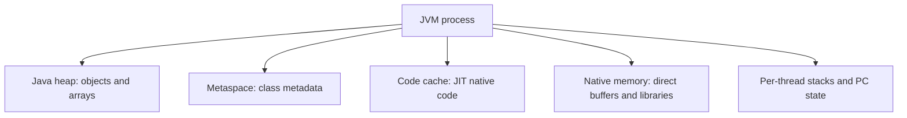
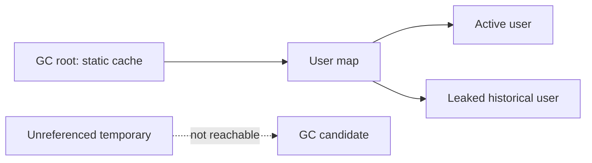
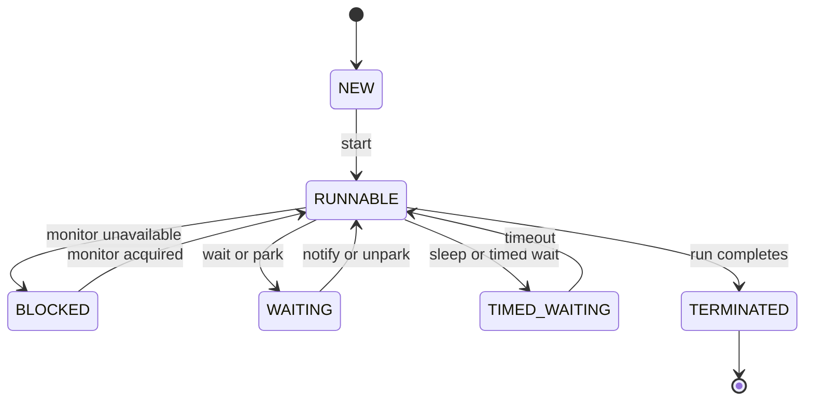
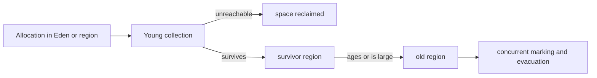
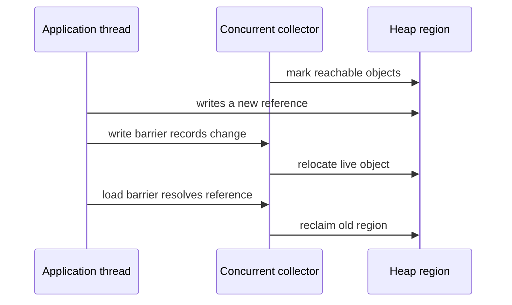
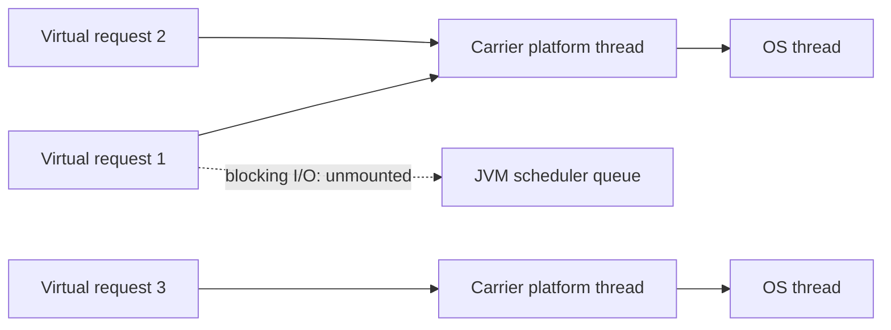

# JVM Memory Architecture, Garbage Collection, and Virtual Threads

The Java Virtual Machine executes bytecode while managing object memory, class metadata, native resources, and the execution state of many threads. Its garbage collectors decide when unreachable heap objects can be reclaimed, while its scheduler coordinates platform and virtual threads with the operating system. Interviewers ask about this layer because memory retention, pause latency, and blocked threads turn otherwise correct Java code into production incidents.

---

## 🟢 Beginner Level

### The JVM memory map

The JVM is a process with several memory areas, not one anonymous heap.

Every Java thread owns an execution stack.

Stack frames hold method-local values, operand stacks, and return information.

Objects created with `new` normally live on the heap.

Class metadata is held in metaspace, which is native memory rather than ordinary Java heap memory.

The code cache contains JIT-compiled native instructions.

Native libraries, direct buffers, and JVM bookkeeping also consume process memory.



The heap is shared by application threads.

That is why two threads can reach the same `Order` object through references.

A stack frame belongs to one executing thread and disappears when its method returns.

Local primitive values are typically stored in that frame.

A local reference also lives in the frame, but it points to an object elsewhere.

The reference is not the object itself.

```java
void applyBonus(User user, int points) {
    user.setPoints(user.getPoints() + points);
    user = new User("replacement");
}
```

Java passes `user` by value.

The copied value is a reference to the same heap object, so the field mutation is visible to the caller.

Reassigning the local `user` changes only that copied reference.

The caller's variable still refers to the original object.

### Reachability, not scope, controls reclamation

Garbage collection reclaims objects that are no longer reachable from GC roots.

GC roots include live thread stacks, static fields, JNI references, and internal JVM structures.

An object can remain allocated long after the method that created it returns if another reachable object points to it.

Conversely, an object may become collectible before a source-level block ends when the JIT proves its reference will never be used again.



Setting a variable to `null` removes one reference.

It does not force collection and rarely fixes a retention problem by itself.

Calling `System.gc()` is only a request to the JVM.

Production code should not depend on it for correctness or resource release.

Use try-with-resources for files, sockets, database connections, and other external resources.

Their lifetime is separate from the reachability of the Java wrapper object.

### Thread states explain waiting

`Thread.State` exposes six coarse Java states.

They are diagnostic labels, not a full operating-system scheduler trace.

| Java state | Typical cause | Important distinction |
|---|---|---|
| `NEW` | Constructed but `start()` not called | No thread execution yet |
| `RUNNABLE` | Eligible to run or currently executing | May still be waiting for CPU time |
| `BLOCKED` | Waiting to enter a `synchronized` monitor | Different from `wait()` |
| `WAITING` | `wait`, `join`, or `park` without timeout | Needs notification, unpark, or completion |
| `TIMED_WAITING` | `sleep`, timed join, timed park | Time limit can resume it |
| `TERMINATED` | `run` returned or threw uncaught exception | Cannot be restarted |



`BLOCKED` specifically means contention for an intrinsic monitor.

An HTTP request waiting on a database socket may appear as `WAITING`, `RUNNABLE`, or inside native code depending on the library and platform.

Thread dumps need surrounding stack traces, not just state counts.

---

## 🟡 Intermediate Level

### Generational collection and allocation

Most Java applications allocate many short-lived objects.

Generational collectors exploit that observation by collecting young objects more frequently than old objects.

An allocation usually begins in a thread-local allocation buffer inside the young generation.

The fast path advances a pointer without a shared lock.

When young space fills, a young collection copies surviving objects to survivor regions or promotes them when they survive enough cycles.

Long-lived objects eventually occupy old regions.

Modern collectors such as G1 use regions rather than a fixed contiguous young/old layout, but the lifetime model remains useful.



The JVM may also allocate large objects directly into older regions.

The exact threshold and path are collector-specific.

Do not build application correctness around an object reaching a particular generation.

The important rule is that a reachable object remains live, regardless of how old it is.

### Worked example: separate heap pressure from a leak

Consider a service running with `-Xmx512m`.

At 10:00, its live heap after a full collection is 180 MiB.

At 10:10, traffic rises and used heap peaks at 460 MiB, then returns to 195 MiB after collection.

At 10:20, traffic is still high and the same pattern repeats.

This is allocation pressure, not evidence of a leak.

The collector is reclaiming temporary request objects and the post-collection baseline is stable.

Now change the observation.

At 10:00, live heap after collection is 180 MiB.

At 10:10, it is 240 MiB.

At 10:20, it is 310 MiB.

At 10:30, it is 390 MiB while request volume is unchanged.

The increasing post-collection baseline is strong evidence of retention.

Suppose a static `Map<UUID, UserProfile>` receives 50,000 profiles per hour.

If each retained profile graph averages 4 KiB, it retains roughly `50,000 × 4 KiB = 195 MiB` per hour.

After about two hours, this alone approaches the 512 MiB heap limit when existing live data and overhead are included.

```java
final class ProfileCache {
    private static final Map<UUID, UserProfile> profiles = new ConcurrentHashMap<>();

    static void remember(UserProfile profile) {
        profiles.put(profile.id(), profile);
    }
}
```

The map is reachable from a static GC root.

Therefore every profile reachable from it remains live.

Increasing `-Xmx` can delay the failure but does not correct the ownership bug.

The fix may be bounded caching, expiry, weak references when semantics allow them, or removing the cache entirely.

Take a heap dump near the high baseline and inspect dominator paths before changing collector flags.

### Collector selection and pause goals

The default collector depends on the JDK, hardware, and runtime ergonomics.

G1 is a general-purpose collector designed to balance throughput and predictable pauses through region-based collection.

ZGC and Shenandoah perform more relocation work concurrently to target low pause times at the cost of barriers and CPU overhead.

Serial GC is simple but uses stop-the-world collection and suits small heaps or constrained environments.

Parallel GC aims at throughput and can accept larger stop-the-world pauses.

| Collector family | Main priority | Typical trade-off | Reason to consider |
|---|---|---|---|
| Serial | Small footprint and simplicity | One collector thread, long pauses | Tiny tools or containers |
| Parallel | Aggregate throughput | Pause time can grow with heap work | Batch-oriented jobs |
| G1 | Balanced server behaviour | More tuning surface and remembered-set cost | General services |
| ZGC | Very low pause latency | Concurrent CPU and load-barrier overhead | Latency-sensitive services |
| Shenandoah | Concurrent compaction | CPU overhead and distribution support | Low-pause deployments |

Pause targets are goals, not service-level guarantees.

A 50 ms pause target does not prevent a 500 ms request caused by database I/O, CPU saturation, safepoint delay, or lock contention.

Measure allocation rate, post-GC live set, pause distribution, CPU, and request latency together.

### Safepoints and stop-the-world work

Some VM operations need threads to reach a safe state where their references can be inspected consistently.

This coordination point is called a safepoint.

Garbage collectors use safepoints for phases such as initial marking or root processing.

Class redefinition, biased-locking-era transitions, and some diagnostic operations can also involve safepoints.

Concurrent collection does not mean zero stop-the-world work.

It means substantial marking or relocation proceeds while application threads continue.

Long-running native calls or loops that delay safepoint polling can increase time-to-safepoint.

When pause complaints occur, separate the time to reach a safepoint from the time spent doing GC at that safepoint.

GC logs provide this distinction more reliably than intuition.

---

## 🔴 Expert Level

### Marking, barriers, and compaction

Tracing collectors first identify live objects by starting at GC roots and following references.

Unmarked objects are unreachable and their space can be reclaimed.

Compaction moves live objects together to eliminate fragmentation and make future allocation cheap.

Moving objects requires the JVM to update references safely.

Write barriers record relevant reference changes so concurrent marking does not miss a newly reachable object.

Load barriers can repair or remap a reference as an application thread reads it during concurrent relocation.



These barriers make concurrent collectors possible but add work to ordinary object access.

The right collector depends on latency, CPU headroom, heap size, allocation rate, and operational observability.

There is no collector setting that makes a retained object collectible.

Metaspace failures are also distinct from heap failures.

Repeated dynamic class generation, class-loader leaks, and aggressive proxy generation can cause `OutOfMemoryError: Metaspace` while the Java heap looks healthy.

### Platform threads and virtual threads

A platform thread is backed by an operating-system thread for its lifetime.

It has an OS-scheduled stack and is appropriate for CPU-bound parallelism and native integration.

Virtual threads are JVM-managed threads intended for large numbers of mostly blocking tasks.

They run on a smaller set of carrier platform threads using an M:N scheduling model.

When a virtual thread performs a supported blocking operation, the JVM can unmount it from its carrier.

The carrier then runs another virtual thread while the first waits.



Virtual threads improve scalability for blocking I/O workloads.

They do not make CPU-bound work use more cores than the machine has.

Use a bounded executor, rate limit, or queue when external dependencies must be protected from too much concurrency.

Creating one virtual thread per request does not remove database connection-pool limits or downstream quotas.

### Pinning, thread locals, and structured lifecycle

In early virtual-thread implementations, blocking while holding a `synchronized` monitor or executing native code could pin a virtual thread to its carrier.

Pinned carriers reduce the scalability benefit because blocked work occupies an OS thread.

Recent JDK work reduces monitor-related pinning, but native calls and critical sections still need measurement in the target runtime.

Use JFR and virtual-thread diagnostics to find pinning rather than replacing every monitor blindly.

Thread locals work with virtual threads, but millions of per-thread values can consume substantial memory.

Prefer explicit request context, scoped values where available, or carefully bounded context propagation.

Virtual threads are cheap to create, but they still have lifecycle, cancellation, timeout, and error-propagation requirements.

Treat them as units of work, not as a substitute for backpressure.

### Production diagnostics and failure boundaries

`OutOfMemoryError: Java heap space` usually means allocation cannot be satisfied after collection.

The cause can be a genuine leak, a too-small heap, a traffic spike, or a workload that needs a different data shape.

`StackOverflowError` normally means unbounded recursion or deeply recursive input on a limited thread stack.

Increasing `-Xss` may hide an algorithmic problem and increases memory reserved per platform thread.

`OutOfMemoryError: unable to create native thread` points to OS thread limits, native memory, or process resource limits rather than necessarily Java heap exhaustion.

Always collect a heap dump, GC logs, process memory metrics, and thread dumps before assuming the collector is the root cause.

Enable heap dumps on memory failure in a controlled location and ensure the host has capacity for them.

### Common Misconceptions

1. **"Every object becomes old generation after exactly fifteen collections."**
   *Correction*: Promotion heuristics, region occupancy, object size, and collector policy vary. Object age is an implementation detail, not a lifecycle contract for application code.

2. **"A full heap means there must be a memory leak."**
   *Correction*: A small configured heap or burst allocation can also cause heap exhaustion. The post-GC live-set trend and dominator tree distinguish retention from ordinary allocation pressure.

3. **"Virtual threads make a CPU-heavy job run in parallel without limit."**
   *Correction*: CPU work is still bounded by available cores and carrier scheduling. Virtual threads primarily avoid tying up platform threads during supported blocking waits.

4. **"`System.gc()` frees memory immediately."**
   *Correction*: It is a request that the JVM may ignore or defer, and collection only reclaims unreachable objects. Correct resource handling uses ownership and deterministic `close`, not forced GC.

5. **"`RUNNABLE` in a thread dump means the thread is actively using a CPU."**
   *Correction*: It means the Java thread is eligible to run and can include threads waiting in some I/O or native paths. Read the stack trace and OS metrics before drawing a scheduling conclusion.

### Interview Questions

**Q1. What is the difference between stack memory and heap memory in Java?** `[easy]`

Each thread has stack frames for method execution, local values, and return bookkeeping, while the heap stores shared objects and arrays. A local reference can live in a frame while referring to an object on the heap. Stack frames are removed on return, whereas heap objects remain until no GC root can reach them.

**Q2. Is Java pass-by-reference for objects?** `[easy]`

Java is pass-by-value, including when the value being copied is an object reference. Mutating the object through the copied reference affects the same object, but assigning a new object to the parameter does not change the caller's variable. Confusing those two effects causes many incorrect explanations of method behaviour.

**Q3. What makes an object eligible for garbage collection?** `[easy]`

An object is eligible when it is unreachable from the collector's root set through any chain of strong references. Scope exit and assigning a variable to null can remove references but do not guarantee collection at a particular moment. External resources must still be closed explicitly because GC timing is nondeterministic.

**Q4. What is the difference between `BLOCKED` and `WAITING`?** `[easy]`

`BLOCKED` normally means a thread is trying to enter an intrinsic monitor held by another thread. `WAITING` means it has deliberately parked, joined, or called `wait` without a timeout and needs an event to resume. The distinction directs diagnosis toward monitor contention versus a missing notification or completion.

**Q5. Why do generational collectors collect young objects frequently?** `[medium]`

Most application allocations die quickly, so collecting young space reclaims substantial memory without scanning the entire old live set. Surviving objects are copied or promoted according to collector policy. This improves common-case throughput, but long-lived accidental references still accumulate in older regions.

**Q6. How do you distinguish allocation pressure from a memory leak?** `[medium]`

Compare the live heap immediately after comparable collections rather than looking only at peak heap usage. A stable post-GC baseline under burst traffic indicates temporary allocations are being reclaimed, while a rising baseline indicates retained object graphs. Confirm the cause with a heap dump dominator tree and reference paths, not by heap size alone.

**Q7. What is a safepoint and why can it affect latency?** `[medium]`

A safepoint is a JVM coordination point at which thread state can be inspected consistently for operations such as parts of garbage collection. Even concurrent collectors require some stop-the-world phases and may wait for threads to reach safe polling points. Analyse time-to-safepoint separately from GC work when investigating latency spikes.

**Q8. When would you use G1 instead of a low-pause collector such as ZGC?** `[medium]`

G1 is a solid general-purpose choice when a service needs balanced throughput and predictable-enough pauses with familiar operational behaviour. A low-pause collector becomes attractive when measured tail-latency requirements and heap size make pause time the dominant problem. The trade-off is concurrent CPU and barrier overhead, so collector choice must follow workload measurement.

**Q9. What are virtual threads designed to improve?** `[medium]`

Virtual threads improve the scalability of applications with many concurrent tasks that spend time in supported blocking operations. The JVM can unmount a blocked virtual thread and reuse its carrier platform thread for another task. They do not remove downstream capacity limits or increase CPU parallelism beyond available cores.

**Q10. Why is a static cache a common source of heap retention?** `[medium]`

A static field is reachable from a GC root for the lifetime of its class loader. If it holds an unbounded map, every object graph reachable from that map stays live even when no request needs it. Bound the cache by size or time and inspect keys, values, and eviction semantics in a heap dump.

**Q11. How do concurrent collectors relocate objects while application threads run?** `[hard]`

They combine concurrent tracing with barriers that record reference changes and, in some designs, repair references when application code loads them. This allows much of marking and relocation to overlap normal execution while preserving object graph correctness. The cost is additional per-access work and still some coordinated pause phases.

**Q12. Scenario: after a deployment, heap usage grows from 180 MiB to 390 MiB after full collections while traffic is flat. What do you do?** `[hard]`

Treat the growing post-collection baseline as a retention investigation rather than immediately increasing the heap or changing the collector. Capture a heap dump near the high baseline, inspect dominators and paths from GC roots, and compare it with a healthy deployment. Check new static maps, listener registrations, thread locals, caches, and class loaders before applying a bounded ownership fix.

**Q13. Scenario: a virtual-thread service still has poor throughput and carrier threads are blocked in database calls. What do you check?** `[hard]`

First inspect database connection-pool saturation, query latency, pinning diagnostics, and whether the JDBC driver cooperates with the runtime's blocking integration. Virtual threads can make request concurrency high while a small connection pool remains the real bottleneck. Add timeouts and backpressure, size the pool against database capacity, and use JFR evidence before altering synchronization or carrier settings.

**Q14. Why can increasing `-Xmx` make a memory incident appear to disappear without fixing it?** `[hard]`

A larger heap gives a retained graph more room and changes collection frequency, so an outage may occur later rather than immediately. If the post-GC live set still rises, the root cause remains a leak or unbounded cache. Larger heaps can also increase recovery and pause consequences, so verify object ownership instead of treating capacity as proof of a fix.

### Further Reading

- [Java Virtual Machine Specification, runtime data areas](https://docs.oracle.com/javase/specs/jvms/se21/html/jvms-2.html) defines JVM stacks, heap, and method areas.
- [Java garbage collection tuning guide](https://docs.oracle.com/en/java/javase/21/gctuning/) explains collector goals, logging, and ergonomics.
- [JEP 444: Virtual Threads](https://openjdk.org/jeps/444) describes the virtual-thread model and its intended workloads.
- [JFR virtual-thread events](https://docs.oracle.com/en/java/javase/21/docs/specs/man/jfr.html) provides runtime observability for virtual-thread scheduling and pinning.
