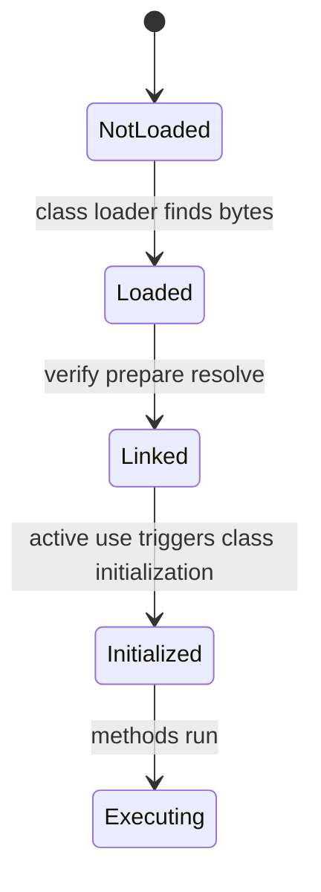
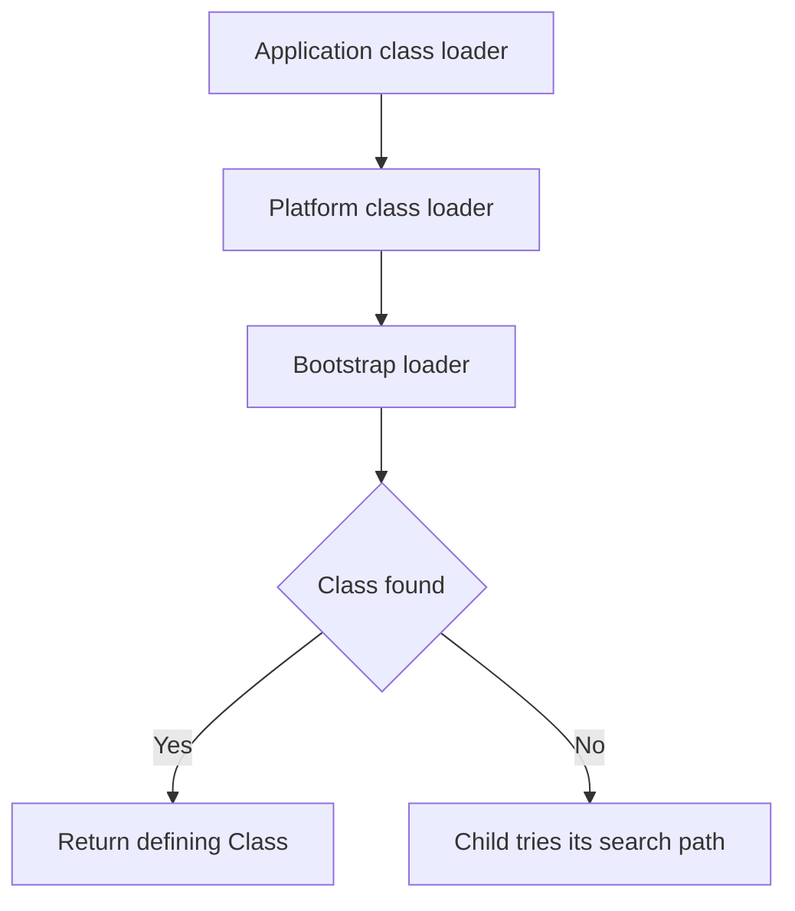
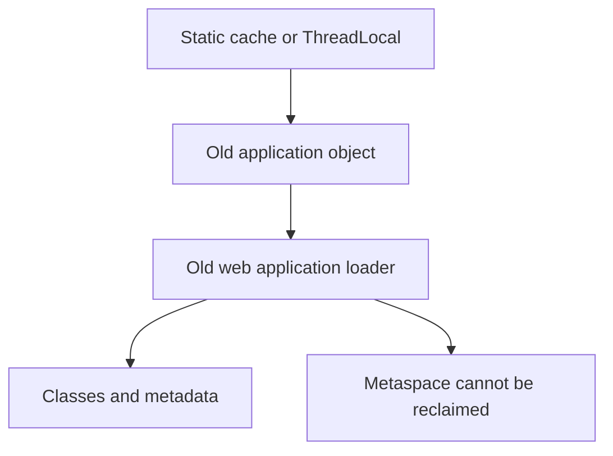

# Java Execution Pipeline & JVM Architecture

Java turns source code into portable class files, then lets a platform-specific JVM load, verify, interpret, and optimize those classes at runtime.
The separation is why the same application bytecode can run on different operating systems and CPUs, while still reaching native-code performance after warmup.
Interviewers ask about this pipeline because class loading, initialization, bytecode safety, and JIT behaviour explain many startup and production-only failures.

---

## 🟢 Beginner Level

### JDK, JRE, JVM, and bytecode

The **JVM** is the virtual machine specification and runtime that executes Java bytecode.
It manages class loading, execution, memory, threads, and garbage collection.
An implementation such as HotSpot supplies native code for a particular operating system and processor.

The **JRE** is the runtime environment: the JVM plus standard Java libraries needed to run applications.
The **JDK** adds development tools such as `javac`, `jar`, `javadoc`, `jdb`, and `javap`.
Modern distributions often ship a JDK as the main install, but the conceptual distinction remains useful.

| Component | Contains | Main use |
|---|---|---|
| JVM | bytecode execution runtime | execute a Java process |
| JRE | JVM plus runtime modules | run Java applications |
| JDK | JRE plus compiler and tools | build, inspect, test, and run applications |

Installing a JDK does not make a source file run directly.
The compiler and runtime still follow distinct phases.
Using a JDK at build time and a compatible runtime at deployment time is a deliberate dependency decision.

### Source becomes platform-neutral bytecode

`javac` reads `.java` files, checks Java syntax and types, and writes `.class` files containing bytecode.
Bytecode is an instruction set for the JVM, not x86, ARM, Windows, or Linux machine code.
Each target platform provides a JVM implementation that understands the same class-file format.


This is the practical meaning of “write once, run anywhere.”
It means the bytecode can run where a compatible JVM and library set exist.
It does not mean native libraries, file paths, time zones, network policy, or Java-version APIs behave identically everywhere.

```java
public class Main {
    public static void main(String[] args) {
        System.out.println("Hello, JVM");
    }
}
```

```bash
javac Main.java
java Main
javap -c Main
```

`javap -c` reveals instructions such as `getstatic`, `ldc`, and `invokevirtual`.
Those instructions use symbolic references that the JVM resolves as classes are linked.
The class file carries metadata, constants, fields, methods, and bytecode rather than only a flat instruction list.

### One public top-level class has one matching file name

A compilation unit may contain several top-level classes.
At most one of them can be `public`.
When a top-level class is public, its source file name must match that class name exactly.

```java
// File name: Invoice.java
public class Invoice { }

class InvoiceFormatter { }
```

The rule lets tools and humans find a public type predictably.
It is a source-level Java language rule, not a JVM restriction that only one class can exist in a `.class` file set.
Nested classes and records can produce additional class files such as `Invoice$Line.class`.

Compile one public top-level type per source file for normal production code.
Package-private helper types may share a file when it improves locality, but large files with many unrelated types harm navigation and incremental compilation.

### The JVM loads classes on demand

Starting `java Main` does not necessarily load every class in the application.
The JVM loads a class when execution or another runtime action first needs it.
Loading creates a runtime `Class` representation from class-file bytes.



This lazy behaviour reduces startup work and lets frameworks load optional integrations only when present.
It also means a missing optional dependency can appear as a runtime failure rather than a compile failure.
Reading a class literal and actively invoking a static method have different initialization effects, so lifecycle questions need precise terminology.

---

## 🟡 Intermediate Level

### Parent delegation protects core classes

Class loaders normally follow parent-first delegation.
An application loader first asks its parent to load a requested class.
Only if the parent cannot provide it does the child attempt its own class path or module path.



The bootstrap loader provides core platform classes such as `java.lang.String` from runtime modules.
The platform loader provides platform modules.
The application loader commonly loads application classes and ordinary dependencies.

Parent delegation prevents a class path JAR from replacing trusted `java.lang` classes with an impostor.
It also ensures most code sees one canonical definition of core types.
Custom loaders can intentionally use child-first rules for isolated plugins, but class identity then requires extra care.

### Class loading, linking, and initialization

**Loading** obtains bytes and creates the runtime class representation.
**Linking** includes verification, preparation, and often symbolic reference resolution.
**Initialization** executes class initialization code, including static field initializers and static blocks, once per class loader.

These phases connect the class loader to every JVM runtime area. Method execution creates frames on
each thread's stack, objects normally occupy the shared heap, and class metadata occupies metaspace.
Loading defines the type metadata needed by those areas; it does not eagerly allocate every future
object or invoke every method.

```java
class Configuration {
    static final String REGION = loadRegion();

    static {
        System.out.println("Configuration initializes once");
    }
}
```

Initialization is triggered by active use, such as creating an instance, invoking a static method, or writing a non-constant static field.
The JVM synchronizes initialization so concurrent threads do not run the same class initializer twice.
If initialization throws an exception, later active uses commonly fail with `NoClassDefFoundError` because the class is erroneous for that loader.

| Phase | Main work | Typical failure |
|---|---|---|
| loading | locate and define class bytes | `ClassNotFoundException` or `ClassNotFoundError` |
| verification | enforce bytecode structural and type rules | `VerifyError` |
| preparation | allocate static storage and defaults | linkage-related error |
| resolution | bind symbolic references | `NoSuchMethodError` or `NoClassDefFoundError` |
| initialization | run static initialization | `ExceptionInInitializerError` |

`ClassNotFoundException` is checked and often comes from an explicit dynamic lookup such as `Class.forName`.
`NoClassDefFoundError` is an error when a class needed by already compiled code cannot be defined at runtime.
The distinction points to different owners: lookup handling versus deployment dependency consistency.

### Worked example: compile, load, and initialize two classes

Assume `Main` calls `Pricing.total(4, 25)`.
`Main.class` and `Pricing.class` are each compiled once by `javac`.
At startup the JVM loads and initializes `Main` before invoking `main`.
When execution first invokes `Pricing.total`, it loads, links, and initializes `Pricing`.

```java
public class Main {
    public static void main(String[] args) {
        System.out.println(Pricing.total(4, 25));
    }
}

final class Pricing {
    static final int TAX_PERCENT = 8;

    static int total(int units, int cents) {
        return units * cents * (100 + TAX_PERCENT) / 100;
    }
}
```

The raw price is $4 \times 25 = 100$ cents.
The result with 8% tax is $100 \times 108 / 100 = 108$ cents.
The constant `TAX_PERCENT` may be inlined by the compiler because it is a compile-time constant, while calling `total` actively uses the `Pricing` class.

This matters during deployment.
Changing a public compile-time constant in a library does not update clients compiled against the old value until those clients are recompiled.
Bytecode portability does not remove binary-compatibility and release-management responsibilities.

### The interpreter starts quickly; JIT optimizes hot code

The interpreter can execute bytecode immediately, collecting type and branch profile information as the program runs.
HotSpot uses tiered compilation: lower-tier compilation produces native code quickly, while higher-tier compilation spends more analysis effort on repeatedly hot methods and loops.


There is no portable promise that a method compiles after exactly 10,000 calls.
Thresholds, CPU availability, method size, profile quality, and JVM flags affect decisions.
The key trade-off is startup responsiveness versus time spent generating and optimizing native code.

---

## 🔴 Expert Level

### Verification and linking make bytecode safer than arbitrary native input

The bytecode verifier checks class-file structure, operand-stack use, local variable types, control-flow targets, and access rules before normal execution.
Verification does not prove an application has no business bug or security vulnerability.
It ensures bytecode obeys JVM type-safety and structural constraints expected by the runtime.

Symbolic references in a constant pool are resolved to actual classes, fields, and methods as required.
This permits separate compilation but exposes binary incompatibilities at runtime.
For example, removing a method from a library after a client compiled against it can cause `NoSuchMethodError`.

The module system adds strong encapsulation rules to package access.
Reflection that worked on a class path deployment may fail under modules unless the relevant package is opened intentionally.
Treat reflective access as a deployment contract rather than a harmless implementation detail.

### JIT speculation, deoptimization, and escape analysis

The JIT observes runtime facts such as receiver types, branch frequency, and allocation patterns.
It can inline a frequently called small method, eliminate an allocation, remove an uncontended lock, or unroll a suitable loop when its assumptions hold.
These optimizations are speculative: if a new subclass is later loaded or a profile assumption changes, the JVM can deoptimize back to a safer compiled tier or the interpreter.

Escape analysis asks whether an allocated object becomes reachable outside the current method or thread.
If an object does not escape, the JIT may scalar-replace its fields and eliminate the allocation entirely.
This is an optimization opportunity, not a guarantee that every local `new` uses no heap memory.

```java
static int distance(int x, int y) {
    Point point = new Point(x, y);
    return point.x() + point.y();
}
```

If `point` never escapes and its use is simple, optimized code may operate on `x` and `y` directly.
Adding logging, storing the point in a collection, returning it, or passing it to an unknown call can make it escape and remove that opportunity.
Use profilers and allocation measurements before changing code for a presumed optimization.

### Class loaders define type identity and can leak metaspace

In the JVM, a class is identified by its binary name **and** defining class loader.
Two loaders can define separate `com.example.Plugin` classes that are not assignable to each other even when their bytes match.
This isolation enables application servers and plugin systems but complicates casts, service discovery, and shared APIs.

Class-loader leaks happen when an old loader remains reachable after a redeploy.
Static registries, thread locals, running threads, JDBC drivers, caches, and framework callbacks can retain application objects and therefore their defining loader.
The loader's classes and metadata cannot be reclaimed, eventually causing `OutOfMemoryError: Metaspace` after repeated redeploys.



Use redeploy tests, thread cleanup, explicit deregistration, and heap or class-loader diagnostics to find the retaining path.
Increasing metaspace only delays the symptom if a deployment lifecycle leak remains.

### Startup, warmup, and native-image trade-offs

An ordinary JVM starts quickly enough for many services, then improves throughput as profiles accumulate and JIT compilation completes.
Short-lived functions and aggressive autoscaling can expose warmup latency, compilation CPU, and cold caches to users.
Pre-warming representative endpoints can help, but it must use safe non-production side effects and cannot replace capacity planning.

Ahead-of-time native images trade some runtime dynamism and peak adaptive optimization for faster startup and lower memory in suitable workloads.
Reflection, dynamic class loading, proxies, and resource discovery need explicit configuration in many AOT environments.
Choose based on measured startup, steady-state, memory, operational tooling, and framework compatibility rather than a slogan about either JVM or native speed.

### Diagnose execution-pipeline failures from the first broken phase

Build failures belong to source compilation and dependency resolution.
Use the compiler message, target release configuration, and resolved build graph before changing JVM flags or production class paths.
Compilation proving one source tree is valid does not prove the assembled runtime artifact contains compatible dependencies.

Runtime startup failures often identify a lifecycle phase in their exception chain.
`UnsupportedClassVersionError` means a class was compiled for a newer class-file version than the current runtime supports.
`VerifyError` indicates class-file or linkage assumptions violate verifier rules.
`ExceptionInInitializerError` means a static initializer failed, and the cause contains the real initialization failure.

Inspect the exact defining loader when a cast inexplicably fails between classes with the same printed name.
Printing the class's loader and code source often reveals a duplicate JAR or plugin loader boundary.
Do not solve such a conflict by adding more copies of the dependency to every class path; select one shared API loader or isolate the types deliberately.

Java Flight Recorder and Java Mission Control can show class loading, compilation, allocation, lock, and execution events with lower overhead than ad hoc logging.
`jcmd`, `jstack`, `jmap`, and `jcmd VM.classloaders` style diagnostics vary by JDK but provide a starting point for live investigation.
Capture only the evidence needed and follow production-access policy, because thread dumps and heap information can contain sensitive application data.

For startup regressions, measure time from process launch to readiness separately from time to first successful request and steady-state percentile latency.
A container can be alive while the JVM is still loading classes, creating pools, compiling hot paths, or waiting for an external dependency.
Readiness checks should represent the point at which the service can safely accept the promised traffic, not simply the point at which `main` started.

Use Java version compatibility as a release gate.
Compile with an intended `--release` target when supporting an older runtime, test the packaged artifact on the deployment JDK, and record the exact vendor and patch level.
This prevents a developer machine from accidentally producing classes that fail only after deployment.

Class-data sharing can reduce repeated class metadata work for compatible JVM processes.
It is an operational optimization with archive-generation and compatibility requirements, not a substitute for fixing large startup scans or dependency bloat.
Measure class-load count and startup profile before adopting it.

The execution pipeline is therefore observable.
Treat it as a sequence of explicit contracts—source, bytecode, loader, runtime libraries, initialization, optimization, and operating environment—rather than one opaque “Java startup” event.
Each boundary should have a reproducible command, artifact, or diagnostic that the owning team can inspect.
That approach shortens incidents because it converts a vague startup failure into the first phase that violated its contract.

Keep production JVM flags under version control with the service deployment configuration.
Ad hoc flags can alter compilation, memory, logging, and class-loading behaviour in ways that make a later incident impossible to reproduce.
Benchmark one change at a time against a realistic traffic profile.
Remove experimental flags that provide no measured benefit so the runtime configuration remains understandable.
Stable observability is more valuable than a collection of unexplained tuning folklore.

### Common Misconceptions

1. **“Java source runs directly on every CPU.”** `javac` first produces JVM bytecode, and a platform-specific JVM executes or compiles that bytecode. Native libraries and operating-system behaviour can still reduce portability.
2. **“The JRE is always a separate download.”** Modern vendors commonly distribute JDKs as the primary package. JRE remains a useful conceptual name for the runtime subset.
3. **“Every class is loaded at application startup.”** Classes load lazily as needed, although frameworks and startup scans may trigger many loads early. A missing optional dependency can therefore fail only on a specific path.
4. **“JIT always makes Java fast after one fixed number of calls.”** Compilation is adaptive and depends on profiles, thresholds, code shape, and runtime resources. Warmup must be measured for the actual workload.
5. **“A local object allocation always exists on the heap.”** Escape analysis may eliminate or scalar-replace a non-escaping allocation in optimized code. Such optimization is not guaranteed and can disappear after a small code change.

### Interview Questions

**Q1. What is the difference between JDK, JRE, and JVM?** `[easy]`

The JVM executes class files and manages runtime services such as memory and threads. The JRE conceptually adds the standard runtime libraries, while the JDK adds development tools such as `javac` and `javap`. Production deployment needs a compatible runtime, whereas compilation needs the development tools and target configuration.

**Q2. Why is Java described as platform independent?** `[easy]`

The compiler produces JVM bytecode rather than CPU-specific machine code. A compatible JVM on Windows, Linux, macOS, or another platform executes that same class file and generates native instructions when needed. Platform independence does not cover native dependencies, file-system assumptions, or an incompatible Java library version.

**Q3. Why must a public top-level class match its file name?** `[easy]`

Java requires the source-file name to match its one public top-level type so compilers and developers can locate that type predictably. A source file can contain package-private helper classes, and nested classes can create additional class files. The restriction is a language and tooling convention, not proof that one compiled program has only one class.

**Q4. What does parent delegation achieve?** `[easy]`

A normal class loader asks its parent to load a class before searching its own locations. This gives core platform types one trusted definition and prevents an application JAR from replacing classes such as `java.lang.String`. Custom loaders can vary the rule for plugins, but then type identity and security need careful design.

**Q5. Distinguish loading, linking, and initialization.** `[medium]`

Loading obtains class bytes and creates a runtime class representation. Linking verifies, prepares, and resolves class information, while initialization runs static initialization code on first active use. Keeping these terms separate explains why a class may be found yet fail later during verification, reference resolution, or a static initializer.

**Q6. What is the difference between `ClassNotFoundException` and `NoClassDefFoundError`?** `[medium]`

`ClassNotFoundException` commonly arises when code explicitly asks to load a class and the loader cannot find it. `NoClassDefFoundError` occurs when already compiled code needs a class that cannot be defined at runtime, often because deployment dependencies differ from build dependencies. The first is usually handled at a dynamic lookup boundary; the second is usually a packaging or linkage fault.

**Q7. What does the bytecode verifier check?** `[medium]`

It checks structural and type-safety properties such as valid instruction format, operand-stack discipline, legal control flow, and compatible types. This lets the JVM execute class files with stronger guarantees than arbitrary native machine input. It does not validate business rules, authorization, or the correctness of data from external systems.

**Q8. Why do JVM applications warm up?** `[medium]`

They begin interpreting or quickly compiling code while collecting profiles about hot methods, branches, and receiver types. Higher-tier JIT compilation then spends more time producing optimized native code for frequently executed paths. Warmup can improve steady-state throughput but creates startup latency and CPU cost that short-lived workloads may expose.

**Q9. What is deoptimization?** `[medium]`

The JIT may compile code based on assumptions inferred from current profiles, such as one receiver type at a call site. If a later event invalidates an assumption, the JVM can discard or patch that optimized code and continue in a safer tier. This preserves Java semantics while allowing aggressive optimization, but can create short performance transitions that profiling should explain.

**Q10. What is escape analysis used for?** `[medium]`

It determines whether an object reference can become visible outside a method or thread. When it does not escape, the JIT may eliminate the allocation, scalar-replace fields, or remove an unnecessary lock. The optimizer may decline the transformation, so developers should not rely on it for correctness or use it without measurement.

**Q11. A service fails only when an optional integration endpoint is used, with `NoClassDefFoundError`. What do you investigate?** `[hard]`

Inspect the runtime class path or module path, dependency packaging, shading, and version alignment for the class named by the error. The application may have compiled because the dependency existed in the build environment, while lazy loading delayed failure until the integration path became active. Fix the deployment artifact or make the optional dependency boundary explicit rather than catching the error and continuing in an unknown state.

**Q12. A freshly deployed JVM service has poor first-request latency but healthy steady-state throughput. What options do you assess?** `[hard]`

Measure class loading, dependency initialization, JIT compilation, cache warmup, connection setup, and actual request profiles before changing flags. Safely pre-warm representative code paths, increase startup readiness delay, or keep a warm instance pool when the business needs predictable first requests. Consider AOT only after evaluating reflection, proxy, observability, and peak-throughput trade-offs for the specific service.

**Q13. An application server eventually throws Metaspace OOM after repeated redeploys. What is the likely mechanism?** `[hard]`

Look for references from parent-loader statics, thread locals, running threads, driver registries, caches, or callbacks into objects defined by old web-application loaders. Those references keep the loader reachable, so its classes and metadata cannot be reclaimed. Use class-loader-aware heap analysis and cleanup on undeploy; increasing metaspace alone merely postpones the next failure.

**Q14. A library changes a `public static final int` constant, but a deployed client still uses the old value. Why?** `[hard]`

Compile-time constants can be inlined into client bytecode during compilation, so updating only the library does not rewrite the already compiled client. Recompile and redeploy the client or avoid exposing mutable configuration as an inlinable constant. This is a binary-compatibility issue even though the JVM can load the updated library successfully.

### Further Reading

- [Java Language Specification: compilation units and binary compatibility](https://docs.oracle.com/javase/specs/jls/se17/html/index.html) defines source rules and compatibility concepts.
- [Java Virtual Machine Specification: loading, linking, and initialization](https://docs.oracle.com/javase/specs/jvms/se17/html/jvms-5.html) defines the JVM lifecycle for classes.
- [OpenJDK HotSpot runtime overview](https://openjdk.org/groups/hotspot/docs/RuntimeOverview.html) describes HotSpot runtime subsystems and execution.
- [Java `ClassLoader` API](https://docs.oracle.com/en/java/javase/17/docs/api/java.base/java/lang/ClassLoader.html) documents class-loader behaviour and extension points.
