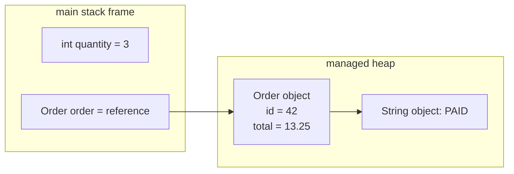
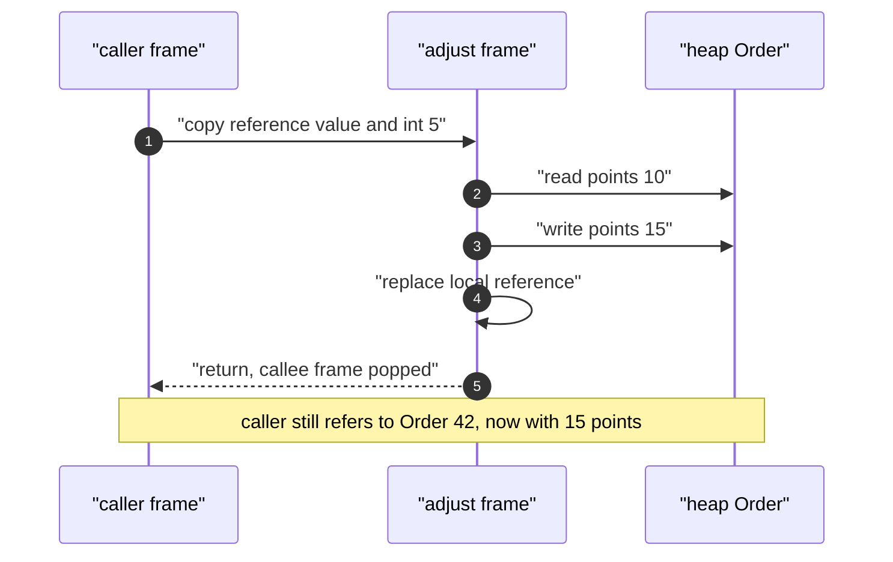
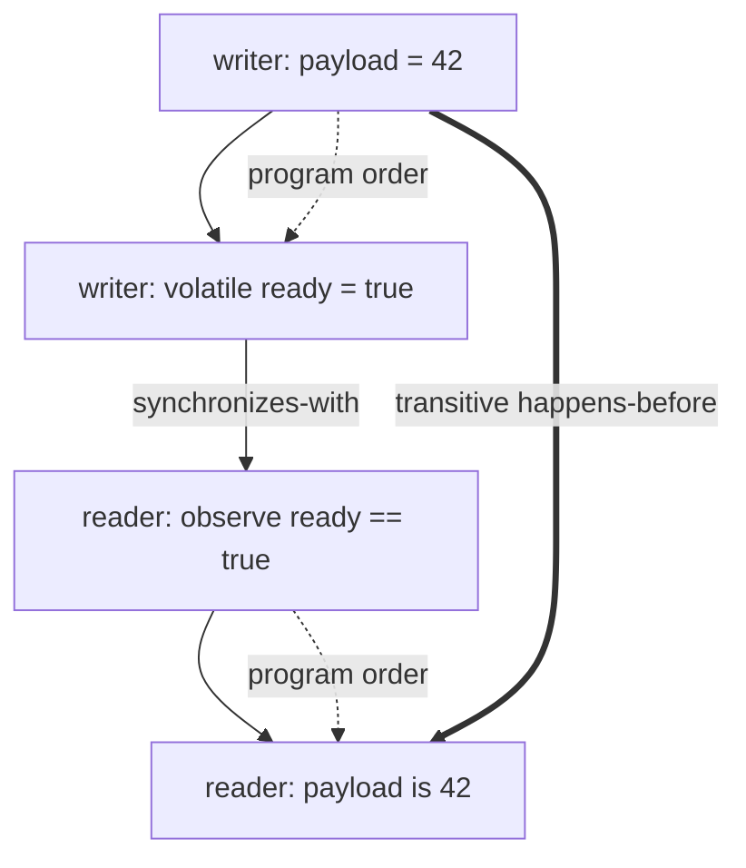
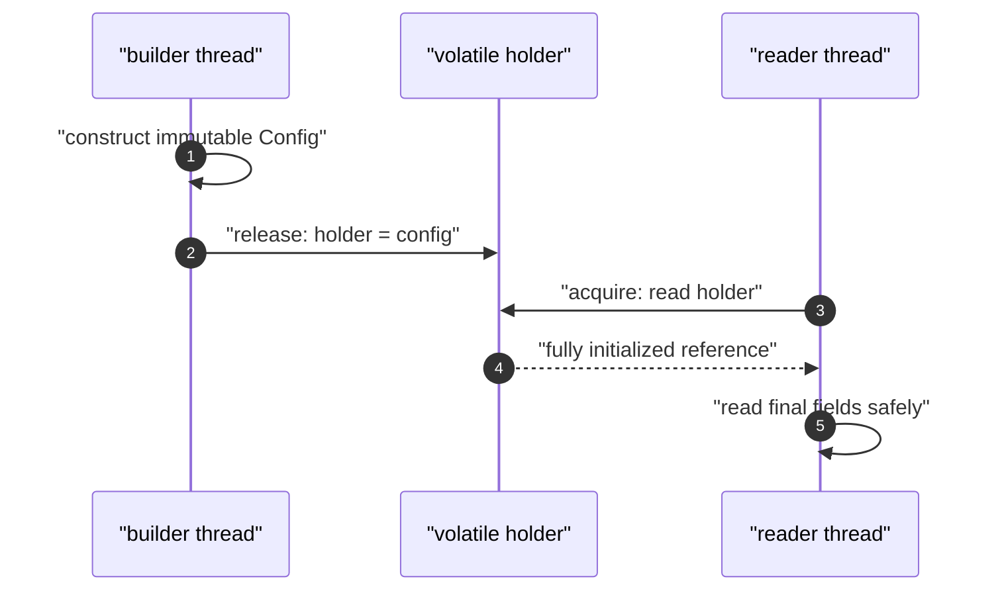

# Java Memory Model: Values, Objects, Strings, and Concurrency

Java developers use “memory model” in two related ways: the runtime layout of stack frames,
heap objects, and variables, and the formal rules that make communication between threads
predictable. Interviewers test both because confusing a reference with an object—or visibility
with atomicity—causes subtle correctness failures in ordinary backend services.

---

## 🟢 Beginner Level

### Primitives, references, and variables

A **variable** is a named storage location whose declared type controls which values Java permits.
Java has eight primitive types: `byte`, `short`, `int`, `long`, `float`, `double`, `char`, and
`boolean`. A primitive variable contains its value directly; an `int` variable contains a signed
32-bit integer, not an object and not a pointer to one.

A variable of a class, interface, array, or enum type contains a **reference value**. The reference
may identify an object, or it may be `null`; the Java Language Specification deliberately does not
expose its physical address. A useful diagram may draw an arrow, but code must never depend on an
address such as `0x4A1` being stable or observable.



Primitive width and representation matter at boundaries:

| Type | Width | Representative values | Important detail |
|---|---:|---|---|
| `byte` | 8 bits | -128 to 127 | Signed two's complement |
| `char` | 16 bits | UTF-16 code unit | Not necessarily a complete Unicode character |
| `int` | 32 bits | $-2^{31}$ to $2^{31}-1$ | Integer overflow wraps in two's complement |
| `long` | 64 bits | $-2^{63}$ to $2^{63}-1$ | Add `L` to large literals |
| `float` | 32 bits | IEEE-754 binary32 | About 7 decimal significant digits |
| `double` | 64 bits | IEEE-754 binary64 | About 15–16 decimal significant digits |
| `boolean` | JVM-dependent storage | `true`, `false` | Language defines values, not storage width |
| reference | implementation-dependent | object reference or `null` | Not a C-style pointer |

Java floating-point values use **IEEE-754** binary representation. A `float` has one sign bit,
eight exponent bits, and 23 stored fraction bits; a `double` has one, eleven, and 52 respectively.
Many decimal fractions, including `0.1`, repeat in binary, so currency should generally use
integer minor units or `BigDecimal` rather than `double` equality.

Operators transform values: arithmetic operators such as `+`, relational operators such as `<`,
logical operators such as `&&`, and assignment operators such as `+=`. Numeric promotion means
`byte + byte` produces an `int`, and integer division truncates before assignment: `5 / 2` is `2`.
Short-circuit `&&` and `||` evaluate the right operand only when required, which can safely guard a
dereference: `user != null && user.isActive()`.

Control flow chooses which operations execute. `if`, `switch`, loops, `break`, `continue`, and
`return` do not create a new Java memory area, but each block creates a lexical scope for local
variables. Definite-assignment analysis rejects reading a local variable before every reachable
control-flow path assigns it.

### Stack frames, heap objects, and lifetime

Every platform thread has a private JVM stack. Invoking a method pushes a **stack frame** containing
its local-variable slots, operand stack, and bookkeeping needed to return to the caller. Returning
normally or exceptionally pops that frame, so its local variables disappear without garbage
collection.

Objects and arrays are conceptually allocated on the shared **heap**. Instance primitive fields live
inside their object, so “primitives are always on the stack” is false. Static fields belong to class
state associated with the loaded class, while a local reference normally occupies a frame slot and
identifies a heap object.

Object lifetime is based on reachability, not block scope. After a local reference disappears, an
object remains alive if another root-reachable field, array, thread, class, or native handle still
reaches it. Garbage collection reclaims an unreachable object later; assigning `null` does not
immediately free memory.

Stack allocation is fast because frames follow last-in, first-out discipline, but each stack has a
finite limit such as `-Xss1m`. Infinite recursion consumes frames until `StackOverflowError`.
Retaining too many reachable objects can exhaust the heap and cause `OutOfMemoryError: Java heap
space`; these failures have different causes and diagnostics.

### Java is pass-by-value

Java always passes arguments **by value**. For a primitive, the copied value is the number or
boolean. For an object expression, the copied value is a reference, so caller and callee initially
refer to the same object while holding independent reference variables.

```java
static void adjust(Order order, int points) {
    order.points += points;       // mutates the shared object
    order = new Order(999, 0);    // changes only the local reference copy
    points = 0;                   // changes only the local primitive copy
}

Order original = new Order(42, 10);
int bonus = 5;
adjust(original, bonus);
// original.id == 42, original.points == 15, bonus == 5
```

The callee can mutate the shared object through its copied reference. Reassigning that parameter
cannot redirect the caller's variable because the two variables are different storage locations.
This is why Java is neither pass-by-reference nor “pass-by-reference for objects.”

### Strings, the pool, and immutable values

`String` is an immutable object: after construction, its character sequence cannot change. Methods
such as `toUpperCase()` return another value, and reassignment changes a reference rather than the
original object. Immutability enables safe sharing, cached hash codes, and use as map keys.

Class loading interns string literals into a per-JVM **string pool**. Identical literal expressions
normally share one pooled object, while `new String("java")` explicitly creates a distinct object.
The `==` operator tests reference **identity**; `equals()` tests logical string **equality**.

```java
String a = "java";
String b = "java";
String c = new String("java");

System.out.println(a == b);       // true: same pooled reference
System.out.println(a == c);       // false: distinct identity
System.out.println(a.equals(c));  // true: equal characters
System.out.println(a == c.intern()); // true: canonical pooled reference
```

`intern()` returns the pool's canonical representative, but mass-interning unbounded user data can
retain more strings than intended. Use `equals()` for domain comparison and reserve identity checks
for cases where identity itself is the contract.

Repeated concatenation in a loop creates avoidable intermediate values. `StringBuilder` provides a
mutable character buffer for single-threaded assembly. `StringBuffer` synchronizes its methods and
is thread-safe for individual operations, but external coordination is still needed for a compound
sequence; it is rarely the best way to share text construction across threads.

---

## 🟡 Intermediate Level

### Method execution and object layout

Bytecode instructions operate on frame slots and the operand stack. For example, an `iload` copies
an integer local onto the operand stack, `iadd` consumes two integers and pushes their sum, and
`istore` writes it into a local slot. References have analogous load and store operations.



An object's conceptual layout includes an object header, instance fields, and alignment padding.
HotSpot may store class metadata pointers and lock state in the header, but exact layout depends on
collector, compressed ordinary object pointers, architecture, and JVM version. The language contract
does not promise field order or a particular byte count.

Arrays are objects whose length is fixed at construction. An `int[]` stores primitive elements,
whereas an `Order[]` stores reference values; constructing either array initializes elements to
zero-like defaults. Local variables, unlike fields and array elements, have no automatic default and
must be definitely assigned before use.

### Worked example: encoding 13.25 as IEEE-754 binary32

Convert `13.25f` rather than memorising a hexadecimal pattern:

1. The sign is positive, so the sign bit is `0`.
2. The integer part $13$ is binary `1101`; the fraction $.25$ is binary `.01`.
3. Therefore $13.25_{10}=1101.01_2$.
4. Normalise it to $1.10101_2 \times 2^3$.
5. Binary32 uses bias 127, so stored exponent is $3+127=130=10000010_2$.
6. Remove the implicit leading `1`; the fraction begins `10101000000000000000000`.

| Field | Bits | Meaning |
|---|---|---|
| Sign | `0` | positive |
| Exponent | `10000010` | $130-127=3$ |
| Fraction | `10101000000000000000000` | significand $1.10101_2$ |
| Full word | `01000001010101000000000000000000` | hexadecimal `0x41540000` |

Reconstruction gives $1.65625 \times 2^3=13.25$, so this value is exact. By contrast, `0.1` has an
infinite binary expansion and is rounded to the nearest representable value. Consequently,
`0.1 + 0.2 == 0.3` is false in binary64 even though formatted output often hides the error.

IEEE-754 also defines positive and negative zero, infinities, and NaN. Every comparison with NaN is
false except `!=`, so test with `Double.isNaN(value)`. `BigDecimal.valueOf(double)` uses the decimal
string representation, while `new BigDecimal(double)` exposes the exact binary approximation.

### Worked example: reference copies and allocation counts

Suppose `Order original` refers to object A with `points = 10`. Calling `adjust(original, 5)` creates
a new frame with two copied values: reference A and integer 5. Mutating `order.points` writes 15 into
object A; reassigning `order` may allocate object B, but it cannot change the caller's slot.

At the return boundary:

| Location | Before call | During call | After return |
|---|---|---|---|
| caller `original` | reference A | reference A | reference A |
| callee `order` | absent | A, then B | frame removed |
| object A points | 10 | 15 | 15 |
| object B | absent | reachable only through callee | eligible after return |
| caller `bonus` | 5 | 5 | 5 |

This trace also explains the migrated interview question about `u = new User("Bob")`: the caller's
variable does not change. Object B becomes collectible after return if nothing else retained it.
The original object remains reachable through the caller.

### String construction and allocation trade-offs

The compiler can fold constant expressions such as `"a" + "b"` into one pooled literal. Runtime
concatenation is implemented using compiler-selected machinery, but repeated concatenation still
copies growing character content. Building 10,000 one-character fragments with immutable
concatenation can approach quadratic character-copy work, while a suitably growing builder is
approximately linear.

```java
StringBuilder csv = new StringBuilder(64);
for (int id : ids) {
    if (!csv.isEmpty()) {
        csv.append(',');
    }
    csv.append(id);
}
String result = csv.toString();
```

Pre-sizing is useful when output length is predictable, but exact micro-optimisation should follow
profiling. `StringBuilder` is appropriate when one thread owns the builder. A shared `StringBuffer`
serialises method calls yet cannot make `if (buffer.length() > 0) buffer.append(',')` atomic as one
logical action.

### Visibility, ordering, and happens-before

The formal **Java Memory Model (JMM)** defines which writes one thread is allowed to observe. It must
permit compilers and processors to reorder independent operations while giving correctly
synchronised programs portable behaviour. Its core concerns are **visibility**, **atomicity**, and
**ordering**.

A **data race** exists when two threads access the same variable concurrently, at least one access
is a write, and the accesses are not ordered by a **happens-before** relationship. Without that
ordering, a reader may observe a stale value or a combination that cannot be reasoned about using
source-code order alone.

Important happens-before rules include:

- Program order: earlier actions in one thread happen-before its later actions.
- Monitor rule: unlocking a `synchronized` monitor happens-before a later lock of that monitor.
- Volatile rule: a write to a `volatile` field happens-before a later read that observes it.
- Start rule: actions before `Thread.start()` happen-before actions in the started thread.
- Join rule: actions in a thread happen-before another thread successfully returns from `join()`.
- Transitivity: if A happens-before B and B happens-before C, then A happens-before C.

These rules concern observable ordering, not elapsed wall-clock time. Correct publication connects
construction writes to later reads through one of these edges. An immutable object with all fields
set before publication is only reliably immutable to other threads when the reference itself is
published safely.

### Volatile and synchronized semantics

A `volatile` write has release-like semantics and a subsequent read has acquire-like semantics.
Writes performed before publishing a volatile flag become visible to a thread that reads the new
flag value. `volatile` also prevents particular reorderings across that boundary.

```java
final class Configuration {
    private int timeoutMillis;
    private volatile boolean ready;

    void initialise() {
        timeoutMillis = 2_000;
        ready = true;              // publishes preceding write
    }

    int timeout() {
        if (!ready) throw new IllegalStateException("not ready");
        return timeoutMillis;      // guaranteed to observe 2_000
    }
}
```

`volatile` does not make compound operations atomic. `count++` is a read, computation, and write, so
two threads can lose updates even if `count` is volatile. Use `AtomicInteger.incrementAndGet()`, a
lock, or confinement when the invariant spans a read-modify-write sequence.

Entering a `synchronized` block acquires an object's monitor; leaving releases it even through an
exception. Mutual exclusion protects compound invariants, and release/acquire establishes memory
semantics. Static synchronised methods use the `Class` object's monitor, which differs from every
instance monitor.

---

## 🔴 Expert Level

### From source code to JMM execution

The JMM does not require each read to consult main RAM or each write to flush a hardware cache.
Instead, it specifies legal executions through actions and ordering relations. The JIT may keep a
non-volatile value in a register, eliminate redundant loads, or reorder independent operations when
the transformation preserves single-thread semantics and all required synchronisation edges.



Happens-before consistency does not impose one global order on all ordinary accesses. A racy program
can exhibit different allowed results across architectures, JVM versions, or optimisation tiers.
Testing it repeatedly on x86 does not establish portability because the JMM contract, not one
processor's stronger ordering, defines correctness.

Reads and writes of references and most primitives are individually atomic. Reads and writes of
`volatile long` and `volatile double` are guaranteed atomic; modern JVMs commonly make ordinary
64-bit accesses atomic too, but portable reasoning should use synchronization when sharing state.
Individual atomic access still does not make a multi-field business invariant atomic.

### Safe publication, final fields, and immutability

Safe publication makes both a reference and the object's completed construction visible. Common
publication mechanisms are a volatile field, a properly locked field, static class initialization,
placing the value into a concurrent collection, or passing it through a synchronised queue.

Final fields receive special initialization-safety guarantees when the constructor does not leak
`this`. A thread that obtains the object through a data race is still guaranteed to see correctly
constructed final fields under the JMM's final-field rule, including reachable state frozen through
those fields. Non-final mutable fields still require safe publication and synchronization for later
updates.



Leaking `this` from a constructor—by registering a listener, starting a thread, or storing the object
in a global collection—allows another thread to observe default or partially initialized state.
Factories can construct privately and publish only after the constructor completes. Records help
express shallowly immutable carriers but do not freeze mutable objects referenced by components.

### Escape analysis and runtime allocation

The simple teaching model says “objects are on the heap,” but an optimizing JVM preserves observable
behaviour rather than literal allocation locations. Escape analysis can prove that an allocation
does not escape a compilation scope. Scalar replacement may then split the object into values held
in registers or frame state, eliminating the heap allocation entirely.

Lock elimination can remove a monitor operation when the locked object cannot escape the current
thread. Stack allocation is therefore a possible optimisation effect, not a Java language promise.
Profilers and benchmark code must allow for warm-up, inlining, dead-code elimination, and
deoptimization before attributing performance to stack versus heap.

Compressed ordinary object pointers reduce reference footprint when heap geometry permits it.
Object headers and alignment can make a wrapper like `Integer` consume far more than four bytes,
which is why primitive arrays can be dramatically denser than boxed collections. Use tools such as
Java Object Layout when byte-level size matters instead of calculating from source declarations.

### Failure modes and diagnostic reasoning

A `StackOverflowError` commonly points to unbounded recursion or an unexpectedly deep object graph
traversal. Increasing `-Xss` may postpone failure but reduces how many platform threads fit in the
process. Fixing the recursion or using an explicit heap-backed worklist is usually the robust answer.

Heap exhaustion means the collector cannot satisfy an allocation within the configured heap; it does
not necessarily mean that garbage collection is broken. A static map, listener registry, unbounded
cache, or `ThreadLocal` can retain reachable objects indefinitely. Heap dumps, dominator trees, and
retained-size paths reveal which GC root prevents reclamation.

Concurrency failures often disappear under logging or a debugger because timing and compilation
change. Use stress tests and concurrency-specific tools, but establish correctness from happens-before
edges. A `volatile` stop flag is suitable for one-way visibility; a compound account transfer needs a
lock or a higher-level atomic abstraction.

Floating-point failures occur when domain requirements are decimal but representation is binary.
Comparisons should use an error tolerance for scientific calculations, while money commonly uses
scaled integers or `BigDecimal` with an explicit rounding mode. NaN and signed zero require deliberate
handling in ordering, hashing, and serialization contracts.

### Common Misconceptions

1. **“All primitive values are on the stack and all references are on the heap.”**
   Primitive instance fields are part of heap objects, and reference locals commonly occupy frame
   slots. Escape analysis may remove either physical allocation, so stack-versus-heap is a useful
   conceptual model rather than a source-level placement rule.

2. **“Java passes objects by reference.”**
   Java passes a copy of the reference value. The copy can mutate the same object, but assigning the
   parameter to another object cannot change the caller's variable.

3. **“`volatile` makes a variable thread-safe.”**
   Volatile provides visibility and ordering for accesses to that field, plus atomic access to its
   value. It does not make `count++` or a multi-field invariant indivisible.

4. **“`==` is a faster acceptable replacement for `String.equals()`.”**
   `==` asks whether references have the same identity, which may appear to work for pooled literals.
   Runtime strings can be equal objects with distinct identities, so domain comparison requires
   `equals()`.

5. **“If a concurrency test passes repeatedly, the code has no data race.”**
   One machine and JVM configuration explore only a small subset of legal schedules and reorderings.
   Correctness requires a provable happens-before path or confinement, not statistical confidence.

### Interview Questions

**Q1. Is Java pass-by-value or pass-by-reference?** `[easy]`

Java is always pass-by-value. Passing an object expression copies its reference value into the
callee's parameter, so both variables initially identify the same object. Mutating that object is
visible through both references, but reassigning the parameter cannot redirect the caller's variable.

**Q2. What happens to local primitive variables when a method returns?** `[easy]`

Their containing stack frame is popped, so those local-variable slots cease to exist immediately.
They do not need garbage collection because frame lifetime follows method invocation lifetime. An
object formerly referenced by a local is collected only later and only if no reachable reference remains.

**Q3. What is the difference between `==` and `equals()` for strings?** `[easy]`

`==` compares reference identity, whereas `String.equals()` compares the character sequence. Pooled
literals can make identity comparison accidentally return true. Use `equals()` for content and use
`==` only when the identity distinction is intentional or when comparing against `null`.

**Q4. Why can `0.1 + 0.2 == 0.3` be false?** `[easy]`

Those decimal fractions do not have finite IEEE-754 binary representations, so each is rounded.
The rounded sum and rounded representation of `0.3` are not necessarily the same binary64 value.
Use a tolerance for approximate numerical work or exact decimal/scaled representations for money.

**Q5. Where do primitive values and references live in Java?** `[medium]`

Local values are represented in method frames conceptually, while object fields are stored as part
of heap objects regardless of whether they are primitives or references. Static fields belong to
class state, and optimizing JVMs can scalar-replace allocations. Therefore “primitive equals stack”
and “reference equals heap” are teaching shortcuts, not language guarantees.

**Q6. Why is `String` immutable, and when should you use `StringBuilder`?** `[medium]`

Immutability makes strings safely shareable, stable as hash keys, and suitable for pooling. Repeated
runtime concatenation may allocate and copy many intermediate strings, so one thread should use a
`StringBuilder` for incremental construction. `StringBuffer` synchronizes individual operations but
usually adds unnecessary contention and cannot alone protect a compound construction protocol.

**Q7. What does a happens-before relationship guarantee?** `[medium]`

It guarantees that the effects of the earlier action are visible to, and ordered before, the later
action according to the Java Memory Model. Monitor unlock/lock, volatile write/read, thread start,
and thread join can create such edges. It does not imply the two actions are adjacent in wall-clock
time or globally order every unrelated access.

**Q8. Why does `volatile int count` not make `count++` safe?** `[medium]`

Volatile makes each read and write visible and ordered, but increment consists of a read, addition,
and write. Two threads can read the same old value and overwrite each other's result. Use an atomic
increment, lock the compound action, or confine the counter to one thread.

**Q9. How does `synchronized` provide both exclusion and visibility?** `[medium]`

Only one thread may own a given monitor at a time, so the protected critical section has mutual
exclusion. Releasing the monitor happens-before a later acquisition of that same monitor, making
earlier writes visible to the acquiring thread. Locking different objects creates no such shared
ordering and is a common implementation error.

**Q10. What is safe publication?** `[medium]`

Safe publication exposes a reference through a mechanism that also makes completed construction
writes visible to readers. A volatile field, monitor-protected field, static initialization,
concurrent collection, or blocking queue can provide the required edge. Merely assigning to an
ordinary shared field can expose stale or partially initialized state.

**Q11. Explain escape analysis and scalar replacement.** `[hard]`

The JIT analyses whether an object can become observable outside the compilation scope or thread.
When it proves non-escape, scalar replacement can represent fields separately in registers or frame
state and remove the heap allocation. This is an optimization rather than a language guarantee, so
code must remain correct when the object really is allocated.

**Q12. How do final-field semantics differ from ordinary field visibility?** `[hard]`

If construction completes without leaking `this`, the JMM gives final fields initialization-safety
semantics so a reader sees their constructed values. The rule supports trustworthy immutable values
but does not make later mutations to referenced mutable objects safe. Ordinary mutable fields and
reference publication still need synchronization for cross-thread communication.

**Q13. Scenario: a worker loops on `while (!stopped)`, but sometimes never exits after another thread sets `stopped = true`. What do you change?** `[hard]`

This is a visibility data race because an ordinary read may reuse a cached or optimized value with
no happens-before edge. Make a simple one-way flag `volatile`, use interruption, or guard both reads
and writes with the same lock. Volatile is sufficient only if stopping does not require an atomic
transition involving additional mutable state.

**Q14. Scenario: a payment service throws `OutOfMemoryError` and a heap dump shows millions of `User` objects retained by a static `HashMap`. What is happening?** `[hard]`

The map is a GC-root-reachable retention path, so its entries remain live even when requests finish.
Garbage collection cannot reclaim reachable objects, and increasing the heap only delays exhaustion.
Bound or expire the cache, remove entries, verify key cardinality, and confirm the fix with retained
size and dominator analysis under a representative load.

### Further Reading

- [Java Language Specification, Chapter 4: Types, Values, and Variables](https://docs.oracle.com/javase/specs/jls/se21/html/jls-4.html) defines primitive, reference, and variable semantics.
- [Java Language Specification, Chapter 15: Expressions](https://docs.oracle.com/javase/specs/jls/se21/html/jls-15.html) specifies operators, evaluation, and floating-point expressions.
- [Java Language Specification, Chapter 17: Threads and Locks](https://docs.oracle.com/javase/specs/jls/se21/html/jls-17.html) is the normative Java Memory Model and happens-before reference.
- [Java `String` API documentation](https://docs.oracle.com/en/java/javase/21/docs/api/java.base/java/lang/String.html) documents immutability, equality, and interning behavior.
