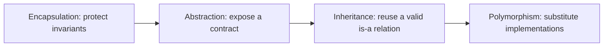
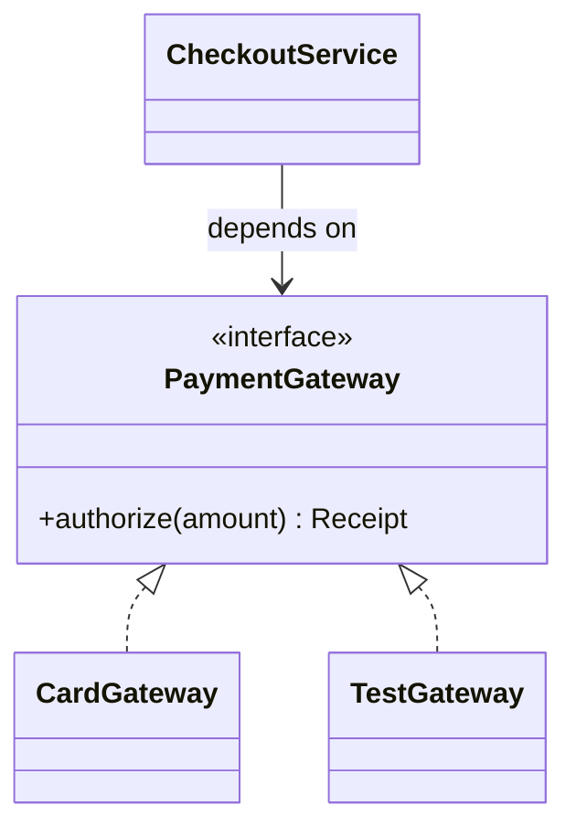
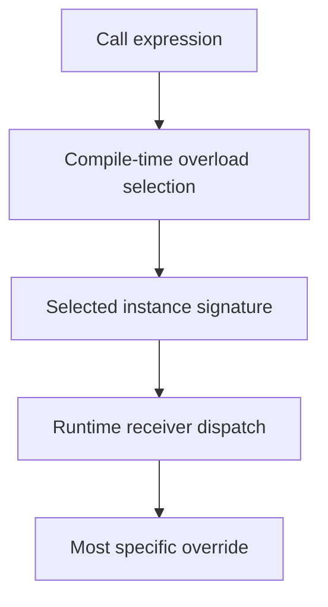
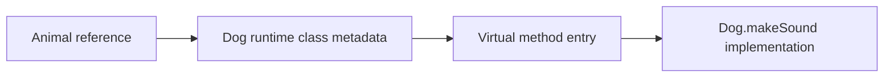

# OOP Pillars & Dynamic Method Dispatch (vtable)

Object-oriented programming organises state and behaviour around collaborating objects. In Java it is more than class syntax: access control, type contracts, inheritance rules, overload resolution, and runtime dispatch all affect correctness and performance. Interviewers use OOP questions to test whether you can distinguish source-level design from JVM behaviour.

## 🟢 Beginner Level

### The four OOP pillars



1. **Encapsulation**: Bundling data (fields) and methods operating on that data within a single class while restricting direct access from outside via `private` access modifiers and validated getters/setters.
2. **Abstraction**: Exposing essential contract features while hiding background operational complexity using `abstract class` and `interface`.
3. **Inheritance**: Deriving new classes (subclasses) from existing parent classes (`extends`), reusing common attributes and behaviors.
4. **Polymorphism**: The ability of an object reference of a supertype to exhibit different runtime behaviors depending on the concrete subclass instance bound to it.

Encapsulation is not merely writing getters and setters. A class owns an invariant and exposes operations that preserve it. For an account, `withdraw(amount)` can reject a negative amount or insufficient funds; a public mutable `balance` field cannot.

Abstraction separates the caller's required behaviour from the implementation's details. A caller can depend on a `PaymentGateway` interface that promises `authorize`, while one implementation uses a remote card provider and another provides a deterministic test double.

Inheritance is appropriate only when a subtype can honour every promise of its parent. `SavingsAccount is an Account` may be valid if it preserves account operations; `Square extends Rectangle` is a warning because independent width and height setters break substitutability.

Polymorphism lets code select behaviour by runtime object type without a growing `if (type == ...)` chain. The abstraction is useful only when callers can work through the common contract, rather than downcasting back to every implementation.

These relationships supply a more precise design vocabulary. **Association** means that objects
collaborate without implying ownership; a `Doctor` treats a `Patient`. **Aggregation** is a weak
whole-part association in which the part can outlive the whole; a `Team` groups independently
existing `Player` objects. **Composition** is strong ownership; an `Order` owns its `OrderLine`
values and controls their lifecycle. Inheritance models an **IS-A** relationship, while composition
and aggregation usually model **HAS-A** relationships.

Java supports compile-time polymorphism through method **overload** selection and runtime
polymorphism through method **override** dispatch. The compiler selects an overloaded signature
from declared types; the JVM then dispatches an overridable instance method from the receiver's
runtime class. A sound class hierarchy therefore needs both a valid design relationship and a
subtype that preserves the parent contract.

### A concrete object collaboration

Consider an order checkout service. It owns an order's state transition, depends on a payment abstraction, and accepts any implementation of that abstraction.

```java
interface PaymentGateway {
    Receipt authorize(Money amount);
}

final class CheckoutService {
    private final PaymentGateway gateway;

    CheckoutService(PaymentGateway gateway) {
        this.gateway = gateway;
    }

    Receipt checkout(Order order) {
        order.requirePayable();
        return gateway.authorize(order.total());
    }
}
```

`CheckoutService` does not know whether the gateway uses HTTP, a queue, or an in-memory fake. That is abstraction and dependency inversion in a small form. The service still owns the business invariant: a cancelled order cannot be authorised.

### Inheritance, interfaces, and composition

Composition means a class delegates a capability to another object instead of becoming a subtype. It avoids inheriting irrelevant API surface and lets behaviour vary per object rather than per class hierarchy.

Inheritance couples a subclass to the state and extension rules of its parent. An interface exposes
a narrower behavioural contract and permits unrelated implementations, while composition lets an
object acquire that behaviour by holding an interface-typed collaborator. These tools are
complementary: the following service composes a gateway interface whose implementations participate
in interface inheritance.



Prefer composition when the relationship is “has a” or “uses a.” Use inheritance when the subtype genuinely is a more specific parent type and can be substituted everywhere the parent is expected.

---

## 🟡 Intermediate Level

### Compile-Time Polymorphism (Overloading) vs. Runtime Polymorphism (Overriding)

| Feature | Method Overloading (Compile-Time) | Method Overriding (Runtime) |
| :--- | :--- | :--- |
| **Binding Mechanism** | **Static Binding** by `javac` at compile time | **Dynamic Dispatch** by JVM at runtime |
| **Method Signature** | Same method name, **different parameter types/counts** | **Identical** method name, parameter types, and return type |
| **Class Scope** | Defined within the same class | Defined in subclass overriding superclass method |
| **Bytecode Opcode** | `invokestatic` / `invokespecial` | `invokevirtual` / `invokeinterface` |

### How overload resolution works

Overloading chooses a method from the compile-time types of arguments. The compiler prefers an
exact match, then primitive widening, then boxing, then varargs. It does not inspect the runtime
class of a reference to choose an overload.

```java
void print(Object value) { System.out.println("object"); }
void print(String value) { System.out.println("string"); }

Object value = "hello";
print(value); // object: compile-time type is Object
```

This differs from overriding. Once `javac` has selected an instance-method signature, the JVM can
select an override based on the runtime receiver. Confusing these two stages causes many interview
mistakes around `null`, autoboxing, and overloaded constructors.

Ambiguity is a compiler error, not a runtime decision. Calling two unrelated overloads with `null`,
such as `save(String)` and `save(StringBuilder)`, gives no most-specific target. An explicit cast
communicates the intended target, but it should not be used to conceal an unclear API.

### Overriding, hiding, and access rules

An override has the same name and parameter types as an inherited instance method. It may return a
covariant subtype and may widen visibility, but it cannot narrow visibility or add broader checked
exceptions. Always use `@Override`; it turns an accidental overload into a compiler error.

`static` methods are hidden, not overridden. A call such as `Parent p = new Child(); p.kind()`
selects `Parent.kind()` when `kind` is static because the reference type is known at compile time.
Fields behave the same way: field access is statically resolved, unlike ordinary instance methods.

`private` methods are not inherited and therefore cannot be overridden. `final` methods are
inherited but deliberately prohibit overriding. Constructors use `invokespecial` and are never
virtual, because an object must be initialised according to its selected concrete class.

### Interfaces, abstract classes, and default methods

Use an interface to describe a capability that unrelated classes can implement. Use an abstract
class when related classes share protected state or a partial implementation. A public interface
should be small: callers should not have to implement methods they do not need.

Default methods evolve an interface without forcing every existing implementation to add a method.
If two unrelated interfaces provide the same default method, the implementing class must resolve
the conflict explicitly. Class methods win over interface defaults, then the most-specific
subinterface wins.



### Worked example: billing discounts

Assume `Discount` is an interface with `Money apply(Money subtotal)`. A `PercentageDiscount`
applies 15%, while a `FixedDiscount` subtracts \$10 but never returns a negative total. The
checkout loop calls `discount.apply(subtotal)` through the interface, so it does not contain a
branch per discount class.

For a subtotal of \$80, percentage discount yields $80 \times 0.15 = \$12$, then the payable
amount is \$68. A fixed discount yields \$70. If the subtotal is \$6, a fixed \$10 discount must
clamp to \$0 or reject the rule according to the domain invariant; polymorphism does not remove
the need for a correct contract.

Tests should exercise each implementation through the interface and assert shared rules. This
reveals a subtype that violates the contract before a caller discovers it in production.

### Object identity, equality, and dispatch

An object reference identifies one object on the heap.

Two references can point at the same mutable object, so a change through one reference is visible through the other.

This is distinct from Java pass-by-value: a method receives a copy of the reference value, not a new object.

Immutable value objects avoid many aliasing bugs.

For example, `Money`, `EmailAddress`, and a validated `OrderId` can expose no mutation and return a new value for every conceptual change.

Records are useful for transparent data carriers when their component values and equality rules match the domain.

Do not use a record merely as a convenient mutable DTO substitute.

Entity objects normally have identity independent of their current fields.

Two database-backed `Customer` objects representing the same persisted ID may be equal by identity even if a display name changes.

Value objects normally compare all meaningful state.

Mixing these equality models in a collection causes difficult cache and ORM bugs.

`equals` and `hashCode` form a contract.

If two objects are equal, they must produce the same hash code during their lifetime in a hash-based collection.

Mutating a key after placing it in a `HashSet` can make it impossible to find or remove.

Prefer immutable keys and avoid equality across a hierarchy unless the full contract is carefully designed.

Every class ultimately inherits methods from `Object`. The default `equals()` compares identity,
while a value class can override it to compare meaningful state; whenever it does, `hashCode()` must
be overridden consistently so equal objects select compatible hash buckets. `toString()` should
produce a concise diagnostic representation without exposing secrets, triggering lazy database
loads, or becoming a machine-readable API contract.

In plain API terminology, the equals and hashCode methods define logical equality and hash
compatibility, while toString supplies diagnostics. The getClass method exposes exact runtime type
identity. The clone method initiates the legacy copying protocol described below.

`getClass()` returns the exact runtime `Class` object and therefore participates in reflection and
runtime dispatch diagnostics. Equality implemented with `getClass()` rejects equality across a
subclass boundary, whereas a careless `instanceof` policy can break symmetry when subclasses add
state. Prefer final value types or a deliberately documented hierarchy equality policy.

`clone()` performs field-by-field shallow copying only for classes that opt into `Cloneable`, and its
checked exception plus constructor-bypassing protocol make it awkward for domain code. A copy
constructor or named factory can validate state and deliberately copy mutable members. Treat
`Object.clone()` as a compatibility mechanism to recognise, not the default design for copying.

### Visibility and API boundaries

Java provides `public`, `protected`, package-private, and `private` access.

Start with the narrowest visibility that supports a real collaborator.

Package-private types and members are valuable for keeping implementation details available to nearby code without exporting them as a public framework promise.

`protected` exposes members to subclasses, including subclasses in other packages.

It is therefore a stronger extension commitment than many designs intend.

Public APIs should validate input at their boundary and preserve internal invariants after every call.

Returning a mutable internal `List` lets callers change object state without validation.

Return an immutable snapshot or an unmodifiable view when callers should observe but not own a collection.

Defensive copying is needed when a constructor receives a mutable object that must not later change the new object's state.

For example, copy a caller-provided `List` before storing it in an immutable aggregate.

An API should expose operations rather than representation when possible.

`order.addLine(product, quantity)` communicates validation and state transition.

`getLines().add(...)` makes every caller responsible for the order invariant.

### Class initialisation and construction order

Before a constructor body runs, Java initialises superclass state first.

Field initialisers and instance initialiser blocks execute as part of construction in declared order for each class.

Then the subclass constructor body completes its own initialisation.

This order matters when constructor arguments call methods or when a parent exposes hooks.

Static initialisation is separate from object construction.

A class is initialised when active use requires it, such as invoking a static method or constructing an instance.

Static initialisers should be short and deterministic because failures leave the class unusable for that class loader.

Avoid network calls, environment-dependent work, and registration side effects in static initialisers.

Factories make complex construction clearer.

They can validate all required data, choose an implementation, and return an interface rather than exposing a telescoping constructor.

Builders are helpful when a value has many optional fields, but a builder should still validate the final object at `build()` time.

### Sealed hierarchies and pattern matching

Sealed classes explicitly list permitted direct subtypes.

They are useful when a domain has a closed set of variants, such as a payment result being `Approved`, `Declined`, or `Retryable`.

The compiler can check exhaustive `switch` expressions over that closed hierarchy.

This gives some benefits of algebraic data types while keeping Java's object model.

Use a sealed hierarchy when new variants require coordinated changes.

Use an interface when independent modules should be able to add implementations.

Pattern matching can make a bounded type decision readable.

It is not a reason to replace polymorphic behaviour everywhere.

Ask whether the code is adding operations to stable types or adding new types to stable operations.

The first case can favour a visitor or pattern match.

The second often favours a virtual method on the shared abstraction.

---

## 🔴 Expert Level

### JVM Virtual Method Table (vtable) & Dynamic Method Dispatch

When the JVM encounters an `invokevirtual` bytecode instruction:



- **Monomorphic vs. Megamorphic Call Sites**:
  - If a call site always invokes the exact same concrete class method (**Monomorphic**), the HotSpot JIT performs **Devirtualization / Inline Caching**, replacing indirect vtable pointer lookups with a direct jump or inlined instructions.
  - If > 2 concrete classes pass through the call site (**Megamorphic**), the JIT falls back to a full vtable pointer dereference.

### Key Interview Questions

#### Q1: Can private, static, or final methods be overridden in Java?
**Answer**: No.
- `private`: Not visible to subclasses; thus cannot be overridden.
- `static`: Belongs to the class, not instances. Defining a static method with the same signature in a subclass results in **Method Hiding**, resolved statically by compile-time reference type.
- `final`: Explicitly prohibits overriding; compiler throws an error.

#### Q2: How does the `default` method in Java 8 interfaces resolve the Diamond Problem?
**Answer**: Java resolves interface default method conflicts with two rules:
1. **Classes beat Interfaces**: Superclass method implementations always take precedence over interface default methods.
2. **Most Specific Interface**: If interface B extends interface A, B's default method wins.
3. If two unrelated interfaces provide conflicting default methods, the compiling class **must** explicitly override the method and specify `InterfaceName.super.methodName()`.

### JIT optimisation and call-site shape

The JVM specification defines observable dispatch semantics, not a mandatory physical vtable layout.
HotSpot can use tables, inline caches, guards, direct calls, or inlining as long as program behaviour
matches Java rules. Therefore, describe a vtable as an implementation model, not a Java language
guarantee.

A monomorphic call site sees one receiver class in profiling data. The JIT can guard that class and
inline its target, eliminating the indirect call in the common path. A bimorphic site may use two
guards. A megamorphic site sees many receiver types and usually retains a more general dispatch.

Devirtualisation is speculative. If a new subclass later reaches an optimised call site, the JVM can
deoptimise compiled code, return to the interpreter or a less specialised version, and recompile
using the new profile. This is why Java can combine late binding with high performance.

`final`, sealed hierarchies, private methods, and local concrete types give the JIT stronger facts.
They should express valid domain constraints first; performance benefits are secondary. Marking a
type final solely for presumed speed can make a useful extension point impossible.

### Design trade-offs and failure modes

Deep inheritance hierarchies spread behaviour across distant classes and make constructor order,
overrides, and invariants difficult to reason about. Prefer a shallow hierarchy plus composition.
An override that calls an overridable method during construction is especially dangerous because a
subclass can observe fields before its constructor has initialised them.

Avoid `instanceof` chains that select behaviour by concrete subtype. One small type check at a
boundary can be pragmatic, but a growing chain usually indicates a missing operation on a common
abstraction. Visitor-style dispatch is useful when operations grow while types remain stable; a
polymorphic method is useful when types grow while operations remain stable.

Equality requires care across inheritance. If `Money.equals` accepts a subclass that adds currency
state, symmetry or transitivity can break. Immutable value objects are often final or records for
this reason. Entities identified by database IDs have a different equality contract from values.

### Common Misconceptions

1. **“Every method call uses a vtable lookup.”** Private, static, final, constructor, and many JIT-optimised calls do not need the same dynamic path. The language semantics matter more than a single implementation detail.
2. **“Inheritance is code reuse.”** Reuse alone is not a valid reason to extend a class. The subtype must preserve the parent contract for every caller.
3. **“Getters and setters automatically provide encapsulation.”** They can expose mutable state or permit invalid transitions. Encapsulation protects invariants through a purposeful API.
4. **“Overloading is runtime polymorphism.”** Overload selection uses compile-time types. Runtime polymorphism is overriding selected from the receiver's runtime class.

### Interview Questions

**Q1. What is the difference between encapsulation and abstraction?** `[easy]`

Encapsulation protects object state and invariants by controlling access to representation. Abstraction defines the useful contract a caller may rely on without knowing implementation details. A good class usually uses both: a small public abstraction backed by encapsulated mutable state.

**Q2. Why is composition often preferred over inheritance?** `[easy]`

Composition reuses a capability without inheriting unrelated methods and implicit contracts. It lets behaviour vary per object and keeps dependencies explicit. Inheritance is better only for a genuine substitutable is-a relationship.

**Q3. What is the difference between overloading and overriding?** `[easy]`

Overloading chooses among methods with different parameter lists at compile time. Overriding replaces an inherited instance-method implementation and is selected from the receiver's runtime class. The distinction explains why an `Object` reference can choose an `Object` overload while still dispatching an override later.

**Q4. Can a static method be overridden?** `[easy]`

No, static methods are hidden because they belong to a class rather than an instance. Their target is selected from the compile-time reference or class name. Reusing a static method name in a subclass can confuse readers, so prefer an unambiguous name when behaviour differs.

**Q5. Why should `@Override` be used?** `[medium]`

It asks the compiler to prove that a method actually overrides an inherited declaration. That catches misspelled parameters and accidental overloads before runtime. It has no runtime dispatch cost and should be standard for intended overrides.

**Q6. What are covariant return types?** `[medium]`

An overriding method may return a subtype of its parent's return type. This makes a specialised implementation easier to consume without casts while preserving the original contract. Parameter types cannot vary this way because callers must still be able to pass every parent-accepted argument.

**Q7. Explain the default-method diamond conflict.** `[medium]`

When two unrelated interfaces provide the same default method, Java refuses to guess which behaviour is intended. The implementing class must override and choose or combine a parent default explicitly. Class implementations win before interface defaults, and a more-specific interface wins over its ancestor.

**Q8. What is Liskov substitution in practical Java code?** `[medium]`

Any subtype should work wherever its parent is expected without surprising callers. It must not strengthen input requirements, weaken promised results, or break invariants. A subtype that rejects ordinary parent operations is often a composition candidate rather than a true subtype.

**Q9. Why are calls to overridable methods in constructors risky?** `[medium]`

Java dispatches the override even while the parent constructor is running. Subclass fields and dependencies may not yet be initialised, so the override can observe invalid state or throw. Constructors should initialise state directly and delay extension hooks until construction completes.

**Q10. How does `invokevirtual` relate to dynamic dispatch?** `[medium]`

The JVM uses `invokevirtual` for ordinary virtual instance-method invocation and resolves behaviour using the runtime receiver type. The bytecode contains a symbolic method reference, not an object-memory offset chosen by the compiler. JVM implementations may optimise the dispatch while preserving the same result.

**Q11. What makes a call site monomorphic or megamorphic?** `[medium]`

A monomorphic site receives one concrete class repeatedly; a megamorphic site receives many. Profile-guided JIT compilation can inline or guard a monomorphic target more easily. A megamorphic site may retain a general dispatch, so unnecessary interface churn in a hot loop can matter after measurement.

**Q12. Scenario: a `List<Shape>` loop becomes slow after plugins add many shape types. What do you investigate?** `[hard]`

First measure with a profiler and inspect whether the hot draw call became megamorphic or allocation-heavy. Compare profiles before and after plugins, including JIT compilation and deoptimisation events. Fix the actual bottleneck, which may be rendering I/O rather than dispatch; do not replace polymorphism with unsafe type switches without evidence.

**Q13. Scenario: a subclass throws `UnsupportedOperationException` from a parent method used by callers. What is wrong?** `[hard]`

The subtype likely violates the parent contract because callers reasonably expect the inherited operation to work. Split the interface, use composition, or model a narrower capability so clients do not depend on unsupported behaviour. Documenting the exception does not repair a broken substitution relation.

**Q14. Scenario: an overridden hook reads null configuration during object creation. How do you fix it?** `[hard]`

The parent constructor called an overridable method before subclass construction completed. Remove the virtual call from construction and use a factory, explicit post-construction method, or constructor-supplied strategy. This makes initialisation order explicit and avoids relying on partially built objects.

### Further Reading

- [Java Language Specification: overriding, hiding, and overloading](https://docs.oracle.com/javase/specs/jls/se26/html/jls-8.html) defines the source-language rules.
- [Java Virtual Machine Specification: `invokevirtual`](https://docs.oracle.com/en/java/javase/26/docs/specs/jvms/jvms-6.html) describes virtual instance-method invocation.
