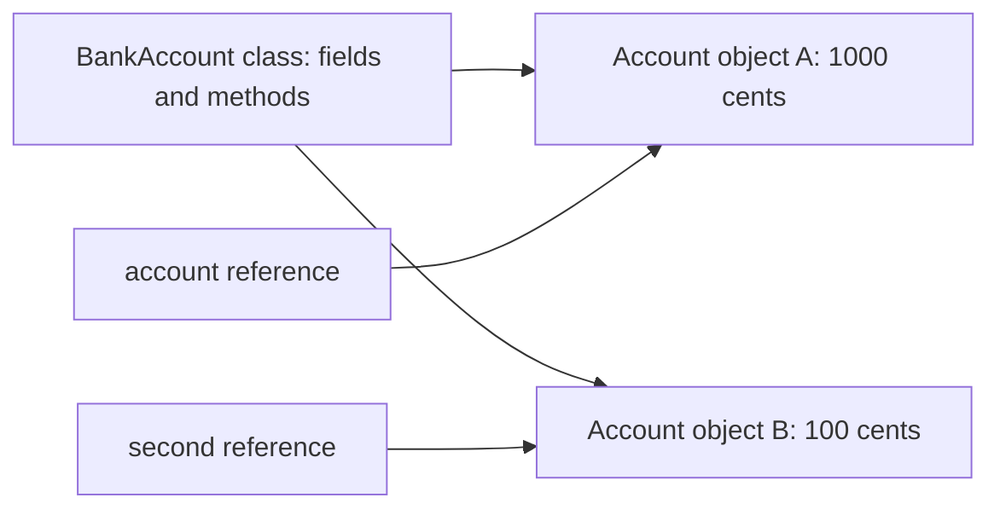
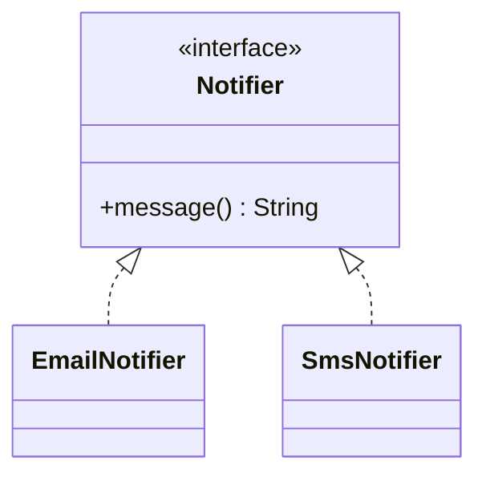
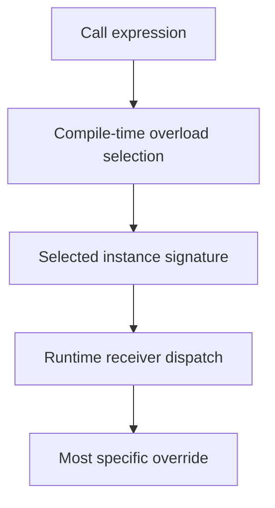
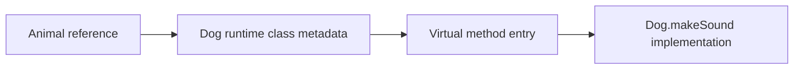

# OOP Pillars & Dynamic Method Dispatch

A program often needs to keep related information and operations together. An account, for example, has a balance and operations that change that balance. Object-oriented programming, or **OOP**, gives us a way to organise those responsibilities and control how other code uses them.

**Before you start:** know variables, conditions and simple functions. You do not need previous OOP knowledge. To run the examples, install a JDK and read the Beginner section of [Java execution](/topic/java-execution-pipeline); use Java 17 or later.

**After this lesson you can:**

- Create an object and explain fields, methods, constructors and `this`.
- Protect an object's rules instead of exposing writable data.
- Use a common interface for different implementations.
- Distinguish compile-time overload selection from runtime method dispatch.

Start with the Beginner tier and its exercises. The Expert tier explains JVM optimisations and can wait until the object model is comfortable.

## 🟢 Beginner Level

### 1. From separate variables to an object

Suppose an application keeps two account balances. Separate variables work at first, but every function that changes them must remember the same rules: a deposit is positive, and a balance must remain valid.

A **class** describes a kind of thing: which data it holds and which operations it offers.
An **object** is one particular instance of that class, created while the program runs.
A **field** is a variable belonging to the object. A **method** is a function declared in a class.
Two account objects use the same class definition but have separate balance fields.

A recipe and two cakes are a useful analogy: one description can produce separate instances.
The analogy stops there: objects also execute methods and can keep references to other objects.



A **reference** is a value that lets code reach an object. The variable `account` holds a reference, rather than containing all the object's fields inside the variable.
Writing `new BankAccount(1000)` creates an object and runs its constructor with `1000` as the starting balance.
A **constructor** initialises a new object. Its name matches the class and it has no return type, not even `void`.

### 2. Run your first account class

**Runnable example — Java 17+, no imports or external libraries.** Save this entire block as `AccountDemo.java`.
The file contains two classes; the public class matches the filename. `main` is the entry point Java runs.
For now, use its `public static void main(String[] args)` declaration as the launch template; it receives command-line arguments and returns no value.

```java runnable=AccountDemo
class BankAccount {
    private int balanceInCents;

    BankAccount(int startingBalance) {
        if (startingBalance < 0) {
            throw new IllegalArgumentException("Starting balance cannot be negative");
        }
        this.balanceInCents = startingBalance;
    }

    void deposit(int amount) {
        if (amount <= 0) {
            throw new IllegalArgumentException("Deposit must be positive");
        }
        if (amount > Integer.MAX_VALUE - balanceInCents) {
            throw new IllegalArgumentException("Balance would be too large");
        }
        balanceInCents = balanceInCents + amount;
    }

    int balance() {
        return balanceInCents;
    }
}

public class AccountDemo {
    public static void main(String[] args) {
        BankAccount account = new BankAccount(1000);
        account.deposit(250);
        System.out.println(account.balance());

        BankAccount alias = account;
        alias.deposit(50);
        System.out.println(account.balance());

        BankAccount second = new BankAccount(100);
        System.out.println(second.balance());
    }
}
```

Compile and run from the directory containing the file:

```bash
javac --release 17 AccountDemo.java
java AccountDemo
```

Expected output:

```text output=AccountDemo
1250
1300
100
```

`int` stores a whole number; cents keep this example free of fractional rounding.
`Integer.MAX_VALUE` is the largest `int`, so the second check prevents addition from overflowing.
This is a teaching model, not a complete banking implementation: it has no persistence, withdrawals or concurrent access protection.

### 3. Trace the state and protect its rules

The dot in `account.deposit(250)` means “call this method on the object reached through `account`.”
`this` means the current object inside an instance method or constructor.
In `this.balanceInCents = startingBalance`, the left side is that object's field and the right side is the constructor's input.
`void deposit(...)` changes state without returning a result; `int balance()` returns an integer.

| Step | Object A | Object B | Why |
|---|---|---|---|
| Create `account` | 1000 | Not created | Constructor sets A's starting balance |
| Deposit 250 | 1250 | Not created | A's field changes |
| Assign `alias = account` | 1250 | Not created | Copies the reference; creates no object |
| Deposit 50 through `alias` | 1300 | Not created | Both references reach A |
| Create `second` | 1300 | 100 | `new` creates a separate object B |

The `private` keyword restricts access to the field: unrelated caller code cannot directly assign its value.
`deposit` checks its input before changing the field. `throw new IllegalArgumentException(...)` stops the method with an error describing the invalid argument; later lessons explain catching exceptions.
A caller trying `account.deposit(-50)` gets that error, and the previous balance remains unchanged.

This is **encapsulation**: keep data and its valid operations together, and control outside access.
An **invariant** is a rule that must remain true, such as this example's non-negative balance.
Adding a public `setBalance(int value)` that accepts every integer would break that protection even if the field stayed private.

**Predict:** replace `BankAccount alias = account` with `BankAccount alias = new BankAccount(1000)`. What does the second print show?

**Answer:** `1250`. The deposit through `alias` now changes a different object; the original `account` still holds 1250 cents. Assignment copies a reference, while `new` creates an object.

**Debug:** add `account.balanceInCents = -1` inside `AccountDemo.main`. Why will compilation fail?

**Answer:** the field is private to `BankAccount`. Call a supported operation rather than making the field public; the class should keep responsibility for validating changes.

### The four OOP pillars

**Abstraction** means giving callers the operations they need without requiring them to know the internal steps.
The account's `deposit` method is already a small abstraction: callers use an amount instead of changing its field themselves.
An **interface** makes a shared set of operations explicit. A class uses `implements` to provide those operations.

**Excerpt — declarations for a larger program, not a standalone application:**

```java
interface Notifier {
    String message();
}

class EmailNotifier implements Notifier {
    @Override
    public String message() {
        return "Email notification";
    }
}

class SmsNotifier implements Notifier {
    @Override
    public String message() {
        return "SMS notification";
    }
}
```

`String` represents text. Each class provides the interface's `message()` method with a different result.
`public` makes these methods accessible to callers; interface implementations must not reduce that access.
`@Override` asks the compiler to check that the method really implements or overrides an inherited method.

Inside a method, `Notifier notifier = new EmailNotifier()` declares a reference using the shared interface.
Calling `notifier.message()` uses the actual object's implementation and returns `Email notification`.
Replacing the object with `new SmsNotifier()` makes the same call return `SMS notification`.
This is **polymorphism**: caller code uses one contract with different implementations.



**Change:** add a `ConsoleNotifier` that returns `Console notification`. Does caller code using only `Notifier.message()` need a new `if` branch?

**Answer:** no. Supply a `ConsoleNotifier` object through the same interface. The implementation provides the different behavior; callers need a new branch only if they depend on extra implementation-specific details.

### Inheritance, interfaces, and composition

**Inheritance** lets a class extend another class with `extends`, acquiring accessible behavior and optionally overriding instance methods.
It should describe a valid **IS-A** relationship: a subtype must keep the promises made by its parent.
An account subtype that suddenly rejects an operation the parent promises to allow is a poor substitute.

**Composition** means holding another object and delegating work to it: a checkout service **HAS-A** notifier.
It can use an email notifier today and an SMS notifier tomorrow without becoming either kind of notifier itself.
Prefer this arrangement when objects collaborate rather than representing the same kind of thing.

Related design terms are **association** (objects collaborate, such as a doctor and patient) and **aggregation** (a group contains independently existing members, such as a team and players).
In a stricter ownership model, composition means that a whole controls its parts' lifecycle, such as an order owning its line items. Ordinary Java references do not enforce that ownership automatically.

The four pillars now name ideas you have seen: encapsulation protects valid state, abstraction exposes useful operations, inheritance expresses a valid subtype, and polymorphism allows interchangeable implementations.
You can write useful Java without a large inheritance tree. The next tier separates two often-confused mechanisms: overloading and overriding.

---

## 🟡 Intermediate Level

### Compile-Time Polymorphism (Overloading) vs. Runtime Polymorphism (Overriding)

| Feature | Method Overloading (Compile-Time) | Method Overriding (Runtime) |
| :--- | :--- | :--- |
| **Binding Mechanism** | **Static Binding** by `javac` at compile time | **Dynamic Dispatch** by JVM at runtime |
| **Method Signature** | Same name, different parameter types/counts | Same name and parameter types; a reference return type may be more specific |
| **Class Scope** | Methods can be declared or inherited | Instance method implements or overrides an inherited contract |
| **Invocation** | An overloaded instance method can still use runtime dispatch | Ordinary virtual calls use `invokevirtual` or `invokeinterface`; explicit `super` calls differ |

### How overload resolution works

Overloading chooses a method from the compile-time types of arguments. The compiler prefers an
exact match, then primitive widening, then boxing, then varargs. It does not inspect the runtime
class of a reference to choose an overload.

**Excerpt — method declarations and call-site lines shown together; put the declarations in a class and the call inside a method.**

```java
void print(Object value) { System.out.println("object"); }
void print(String value) { System.out.println("string"); }

Object value = "hello";
print(value); // object: compile-time type is Object
```

This differs from overriding. Once `javac` has selected an instance-method signature, the JVM can
select an override based on the runtime receiver. Confusing these two stages causes many interview
mistakes around `null`, autoboxing, and overloaded constructors.

Ambiguity is a compiler error, not a runtime decision. Calling two unrelated overloads with `null`,
such as `save(String)` and `save(StringBuilder)`, gives no most-specific target. An explicit cast
communicates the intended target, but it should not be used to conceal an unclear API.

### Overriding, hiding, and access rules

An override has the same name and parameter types as an inherited instance method. It may return a
covariant subtype and may widen visibility, but it cannot narrow visibility or add broader checked
exceptions. Always use `@Override`; it turns an accidental overload into a compiler error.

`static` methods are hidden, not overridden. A call such as `Parent p = new Child(); p.kind()`
selects `Parent.kind()` when `kind` is static because the reference type is known at compile time.
Fields behave the same way: field access is statically resolved, unlike ordinary instance methods.

`private` methods are not inherited and therefore cannot be overridden. `final` methods are
inherited but deliberately prohibit overriding. Constructors use `invokespecial` and are never
virtual, because an object must be initialised according to its selected concrete class.

### Interfaces, abstract classes, and default methods

Use an interface to describe a capability that unrelated classes can implement. Use an abstract
class when related classes share protected state or a partial implementation. A public interface
should be small: callers should not have to implement methods they do not need.

Default methods evolve an interface without forcing every existing implementation to add a method.
If two unrelated interfaces provide the same default method, the implementing class must resolve
the conflict explicitly. Class methods win over interface defaults, then the most-specific
subinterface wins.



### Worked example: billing discounts

Assume `Discount` is an interface with `Money apply(Money subtotal)`. A `PercentageDiscount`
applies 15%, while a `FixedDiscount` subtracts \$10 but never returns a negative total. The
checkout loop calls `discount.apply(subtotal)` through the interface, so it does not contain a
branch per discount class.

For a subtotal of \$80, the percentage reduction is $80 \times 0.15 = 12$, so the payable
amount is \$68. A fixed discount yields \$70. If the subtotal is \$6, a fixed \$10 discount must
clamp to \$0 or reject the rule according to the domain invariant; polymorphism does not remove
the need for a correct contract.

Tests should exercise each implementation through the interface and assert shared rules. This
reveals a subtype that violates the contract before a caller discovers it in production.

### Object identity, equality, and dispatch

An object reference identifies one object on the heap.

Two references can point at the same mutable object, so a change through one reference is visible through the other.

This is distinct from Java pass-by-value: a method receives a copy of the reference value, not a new object.

Immutable value objects avoid many aliasing bugs.

For example, `Money`, `EmailAddress`, and a validated `OrderId` can expose no mutation and return a new value for every conceptual change.

Records are useful for transparent data carriers when their component values and equality rules match the domain.

Do not use a record merely as a convenient mutable DTO substitute.

Entity objects normally have identity independent of their current fields.

Two database-backed `Customer` objects representing the same persisted ID may be equal by identity even if a display name changes.

Value objects normally compare all meaningful state.

Mixing these equality models in a collection causes difficult cache and ORM bugs.

`equals` and `hashCode` form a contract.

If two objects are equal, they must produce the same hash code during their lifetime in a hash-based collection.

Mutating a key after placing it in a `HashSet` can make it impossible to find or remove.

Prefer immutable keys and avoid equality across a hierarchy unless the full contract is carefully designed.

Every class ultimately inherits methods from `Object`. The default `equals()` compares identity,
while a value class can override it to compare meaningful state; whenever it does, `hashCode()` must
be overridden consistently so equal objects select compatible hash buckets. `toString()` should
produce a concise diagnostic representation without exposing secrets, triggering lazy database
loads, or becoming a machine-readable API contract.

In plain API terminology, the equals and hashCode methods define logical equality and hash
compatibility, while toString supplies diagnostics. The getClass method exposes exact runtime type
identity. The clone method initiates the legacy copying protocol described below.

`getClass()` returns the exact runtime `Class` object and therefore participates in reflection and
runtime dispatch diagnostics. Equality implemented with `getClass()` rejects equality across a
subclass boundary, whereas a careless `instanceof` policy can break symmetry when subclasses add
state. Prefer final value types or a deliberately documented hierarchy equality policy.

`clone()` performs field-by-field shallow copying only for classes that opt into `Cloneable`, and its
checked exception plus constructor-bypassing protocol make it awkward for domain code. A copy
constructor or named factory can validate state and deliberately copy mutable members. Treat
`Object.clone()` as a compatibility mechanism to recognise, not the default design for copying.

### Visibility and API boundaries

Java provides `public`, `protected`, package-private, and `private` access.

Start with the narrowest visibility that supports a real collaborator.

Package-private types and members are valuable for keeping implementation details available to nearby code without exporting them as a public framework promise.

`protected` exposes members to subclasses, including subclasses in other packages.

It is therefore a stronger extension commitment than many designs intend.

Public APIs should validate input at their boundary and preserve internal invariants after every call.

Returning a mutable internal `List` lets callers change object state without validation.

Return an immutable snapshot or an unmodifiable view when callers should observe but not own a collection.

Defensive copying is needed when a constructor receives a mutable object that must not later change the new object's state.

For example, copy a caller-provided `List` before storing it in an immutable aggregate.

An API should expose operations rather than representation when possible.

`order.addLine(product, quantity)` communicates validation and state transition.

`getLines().add(...)` makes every caller responsible for the order invariant.

### Class initialisation and construction order

On the Java 17 baseline, superclass construction precedes the subclass field initialisers and the remaining subclass constructor statements. Java 25 permits restricted statements before constructor delegation; do not apply the older first-statement rule universally.

Field initialisers and instance initialiser blocks execute as part of construction in declared order for each class.

Then the subclass constructor body completes its own initialisation.

This order matters when constructor arguments call methods or when a parent exposes hooks.

Static initialisation is separate from object construction.

A class is initialised when active use requires it, such as invoking a static method or constructing an instance.

Static initialisers should be short and deterministic because failures leave the class unusable for that class loader.

Avoid network calls, environment-dependent work, and registration side effects in static initialisers.

Factories make complex construction clearer.

They can validate all required data, choose an implementation, and return an interface rather than exposing a telescoping constructor.

Builders are helpful when a value has many optional fields, but a builder should still validate the final object at `build()` time.

### Sealed hierarchies and pattern matching

Sealed classes, finalised in Java 17, explicitly list permitted direct subtypes.

They are useful when a domain has a closed set of variants, such as a payment result being `Approved`, `Declined`, or `Retryable`.

Pattern matching for `switch`, finalised in Java 21, lets the compiler check exhaustive type cases over that closed hierarchy. This feature is newer than the Java 17 baseline used by the runnable example.

This gives some benefits of algebraic data types while keeping Java's object model.

Use a sealed hierarchy when new variants require coordinated changes.

Use an interface when independent modules should be able to add implementations.

Pattern matching can make a bounded type decision readable.

It is not a reason to replace polymorphic behaviour everywhere.

Ask whether the code is adding operations to stable types or adding new types to stable operations.

The first case can favour a visitor or pattern match.

The second often favours a virtual method on the shared abstraction.

---

## 🔴 Expert Level

### JVM Virtual Method Table (vtable) & Dynamic Method Dispatch

When the JVM encounters an `invokevirtual` bytecode instruction:



- **Monomorphic vs. Megamorphic Call Sites**:
  - If a call site always invokes the exact same concrete class method (**Monomorphic**), the HotSpot JIT can use **Devirtualization / Inline Caching**, replacing indirect vtable pointer lookups with a direct jump or inlined instructions.
  - A call site with many receiver types (**Megamorphic**) may use a more general dispatch path. The threshold and generated code depend on the JVM and its profile; there is no Java guarantee that a third receiver type forces one particular vtable lookup.

### JIT optimisation and call-site shape

The JVM specification defines observable dispatch semantics, not a mandatory physical vtable layout.
HotSpot can use tables, inline caches, guards, direct calls, or inlining as long as program behaviour
matches Java rules. Therefore, describe a vtable as an implementation model, not a Java language
guarantee.

A monomorphic call site sees one receiver class in profiling data. The JIT can guard that class and
inline its target, eliminating the indirect call in the common path. A bimorphic site may use two
guards. A megamorphic site sees many receiver types and usually retains a more general dispatch.

Devirtualisation is speculative. If a new subclass later reaches an optimised call site, the JVM can
deoptimise compiled code, return to the interpreter or a less specialised version, and recompile
using the new profile. This is why Java can combine late binding with high performance.

`final`, sealed hierarchies, private methods, and local concrete types give the JIT stronger facts.
They should express valid domain constraints first; performance benefits are secondary. Marking a
type final solely for presumed speed can make a useful extension point impossible.

### Design trade-offs and failure modes

Deep inheritance hierarchies spread behaviour across distant classes and make constructor order,
overrides, and invariants difficult to reason about. Prefer a shallow hierarchy plus composition.
An override that calls an overridable method during construction is especially dangerous because a
subclass can observe fields before its constructor has initialised them.

Avoid `instanceof` chains that select behaviour by concrete subtype. One small type check at a
boundary can be pragmatic, but a growing chain usually indicates a missing operation on a common
abstraction. Visitor-style dispatch is useful when operations grow while types remain stable; a
polymorphic method is useful when types grow while operations remain stable.

Equality requires care across inheritance. If `Money.equals` accepts a subclass that adds currency
state, symmetry or transitivity can break. Immutable value objects are often final or records for
this reason. Entities identified by database IDs have a different equality contract from values.

### Common Misconceptions

1. **“Every method call uses a vtable lookup.”** Private, static, final, constructor, and many JIT-optimised calls do not need the same dynamic path. The language semantics matter more than a single implementation detail.
2. **“Inheritance is code reuse.”** Reuse alone is not a valid reason to extend a class. The subtype must preserve the parent contract for every caller.
3. **“Getters and setters automatically provide encapsulation.”** They can expose mutable state or permit invalid transitions. Encapsulation protects invariants through a purposeful API.
4. **“Overloading is runtime polymorphism.”** Overload selection uses compile-time types. Runtime polymorphism is overriding selected from the receiver's runtime class.

### Interview Questions

**Q1. What is the difference between encapsulation and abstraction?** `[easy]`

Encapsulation protects object state and invariants by controlling access to representation. Abstraction defines the useful contract a caller may rely on without knowing implementation details. A good class usually uses both: a small public abstraction backed by encapsulated mutable state.

**Q2. Why is composition often preferred over inheritance?** `[easy]`

Composition reuses a capability without inheriting unrelated methods and implicit contracts. It lets behaviour vary per object and keeps dependencies explicit. Inheritance is better only for a genuine substitutable is-a relationship.

**Q3. What is the difference between overloading and overriding?** `[easy]`

Overloading chooses among methods with different parameter lists at compile time. Overriding replaces an inherited instance-method implementation and is selected from the receiver's runtime class. The distinction explains why an `Object` reference can choose an `Object` overload while still dispatching an override later.

**Q4. Can a static method be overridden?** `[easy]`

No, static methods are hidden because they belong to a class rather than an instance. Their target is selected from the compile-time reference or class name. Reusing a static method name in a subclass can confuse readers, so prefer an unambiguous name when behaviour differs.

**Q5. Why should `@Override` be used?** `[medium]`

It asks the compiler to prove that a method actually overrides an inherited declaration. That catches misspelled parameters and accidental overloads before runtime. It has no runtime dispatch cost and should be standard for intended overrides.

**Q6. What are covariant return types?** `[medium]`

An overriding method may return a subtype of its parent's return type. This makes a specialised implementation easier to consume without casts while preserving the original contract. Parameter types cannot vary this way because callers must still be able to pass every parent-accepted argument.

**Q7. Explain the default-method diamond conflict.** `[medium]`

When two unrelated interfaces provide the same default method, Java refuses to guess which behaviour is intended. The implementing class must override and choose or combine a parent default explicitly. Class implementations win before interface defaults, and a more-specific interface wins over its ancestor.

**Q8. What is Liskov substitution in practical Java code?** `[medium]`

Any subtype should work wherever its parent is expected without surprising callers. It must not strengthen input requirements, weaken promised results, or break invariants. A subtype that rejects ordinary parent operations is often a composition candidate rather than a true subtype.

**Q9. Why are calls to overridable methods in constructors risky?** `[medium]`

Java dispatches the override even while the parent constructor is running. Subclass fields and dependencies may not yet be initialised, so the override can observe invalid state or throw. Constructors should initialise state directly and delay extension hooks until construction completes.

**Q10. How does `invokevirtual` relate to dynamic dispatch?** `[medium]`

The JVM uses `invokevirtual` for ordinary virtual instance-method invocation and resolves behaviour using the runtime receiver type. The bytecode contains a symbolic method reference, not an object-memory offset chosen by the compiler. JVM implementations may optimise the dispatch while preserving the same result.

**Q11. What makes a call site monomorphic or megamorphic?** `[medium]`

A monomorphic site receives one concrete class repeatedly; a megamorphic site receives many. Profile-guided JIT compilation can inline or guard a monomorphic target more easily. A megamorphic site may retain a general dispatch, so unnecessary interface churn in a hot loop can matter after measurement.

**Q12. Scenario: a `List<Shape>` loop becomes slow after plugins add many shape types. What do you investigate?** `[hard]`

First measure with a profiler and inspect whether the hot draw call became megamorphic or allocation-heavy. Compare profiles before and after plugins, including JIT compilation and deoptimisation events. Fix the actual bottleneck, which may be rendering I/O rather than dispatch; do not replace polymorphism with unsafe type switches without evidence.

**Q13. Scenario: a subclass throws `UnsupportedOperationException` from a parent method used by callers. What is wrong?** `[hard]`

The subtype likely violates the parent contract because callers reasonably expect the inherited operation to work. Split the interface, use composition, or model a narrower capability so clients do not depend on unsupported behaviour. Documenting the exception does not repair a broken substitution relation.

**Q14. Scenario: an overridden hook reads null configuration during object creation. How do you fix it?** `[hard]`

The parent constructor called an overridable method before subclass construction completed. Remove the virtual call from construction and use a factory, explicit post-construction method, or constructor-supplied strategy. This makes initialisation order explicit and avoids relying on partially built objects.

### Further Reading

- [Java classes and objects tutorial](https://dev.java/learn/classes-objects/) — constructors, fields, methods and object references.
- [Java 17 method inheritance, overriding and overloading](https://docs.oracle.com/javase/specs/jls/se17/html/jls-8.html#jls-8.4.8) — return types, access and method-selection rules.
- [JVM method invocation instructions](https://docs.oracle.com/javase/specs/jvms/se17/html/jvms-6.html#jvms-6.5.invokevirtual) — the bytecode behind ordinary virtual method calls.
- [Java language changes through Java 21](https://docs.oracle.com/en/java/javase/21/language/java-language-changes-summary.html) — when sealed classes and pattern matching became permanent.
