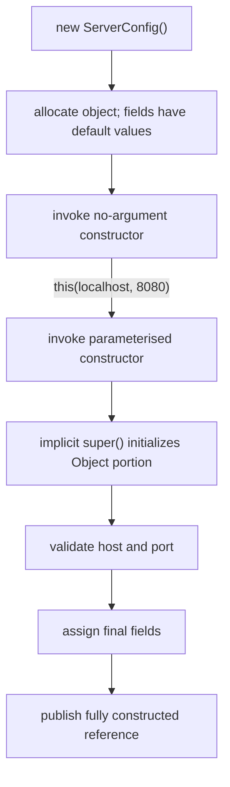
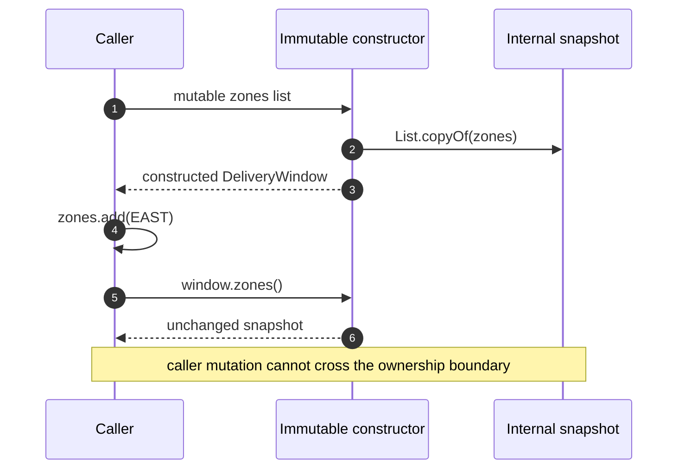
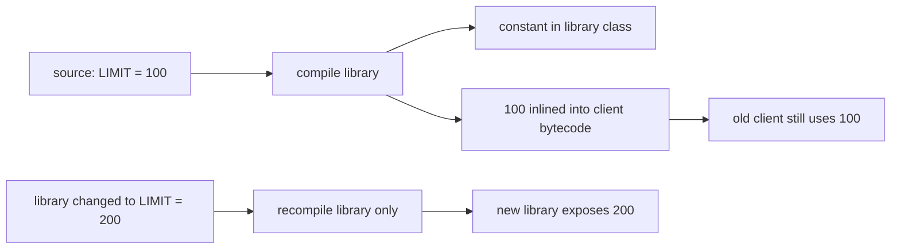

# Java Classes, Immutability, Records & Modern Language Features

Java class design connects object construction, inheritance boundaries, shared state, and value semantics. This lesson follows an object from constructor invocation through immutable representation, then shows how records, sealed classes, pattern matching, and Java 21 collection interfaces make those intentions explicit. Interviewers use these topics to test whether a candidate can protect invariants rather than merely recite keywords.

---

## 🟢 Beginner Level

### Static, final, and constructors

A **class** describes state and behaviour; an **object** is a runtime instance of that description.
Fields hold state, methods define behaviour, and constructors establish the initial invariant.
A constructor has the class name, has no return type, and runs after memory for the object is allocated.

Java supplies a no-argument constructor only when the source declares no constructor at all.
Declaring any constructor removes that implicit default.
Frameworks that instantiate classes reflectively may therefore require an explicit no-argument constructor.

Common constructor forms are:

- a no-argument constructor that establishes safe defaults;
- a parameterised constructor that accepts required state;
- a copy constructor written by the developer to copy another instance;
- a private constructor that restricts creation to factories or singleton logic.

```java
public final class ServerConfig {
    private final String host;
    private final int port;

    public ServerConfig() {
        this("localhost", 8080);
    }

    public ServerConfig(String host, int port) {
        if (host == null || host.isBlank()) {
            throw new IllegalArgumentException("host is required");
        }
        if (port < 1 || port > 65_535) {
            throw new IllegalArgumentException("invalid port");
        }
        this.host = host;
        this.port = port;
    }
}
```

Constructor chaining centralises validation.
`this(...)` delegates to another constructor in the same class.
`super(...)` delegates to a superclass constructor.
Either call must be the first constructor statement, so both cannot appear directly in the same constructor.



`this` denotes the current object and disambiguates fields from parameters.
`super` denotes the superclass portion and can invoke an accessible superclass method or constructor.
Calling an overridable method from a constructor is dangerous because subclass fields may not yet be initialised.

### `static`: State Belonging to the Class

An instance field belongs to each object; a `static` field belongs to the class as loaded by a particular class loader.
All instances see the same static variable.
A static method has no receiver, so it cannot directly use `this`, `super`, or instance fields.

```java
public final class InvoiceIds {
    private static final AtomicLong NEXT = new AtomicLong(1);

    private InvoiceIds() {
        throw new AssertionError("utility class");
    }

    public static long next() {
        return NEXT.getAndIncrement();
    }
}
```

Static initialisation happens when the JVM actively initialises the class, not necessarily when it merely loads the class file.
Static field initialisers and `static {}` blocks execute in source order inside the compiler-generated `<clinit>` method.
If initialisation fails, the JVM throws `ExceptionInInitializerError`; later uses commonly fail with `NoClassDefFoundError`.

Static mutable collections can retain an entire object graph for the lifetime of the class loader.
This is a common memory-leak pattern in servers and application containers.
Prefer bounded caches with deliberate eviction and lifecycle ownership.

### `final`: One Assignment and Closed Extension Points

The meaning of `final` depends on where it appears:

| Form | Guarantee | Does not guarantee |
|---|---|---|
| `final` primitive variable | value is assigned once | global constant semantics unless also `static` |
| `final` reference | reference cannot point elsewhere | referenced object cannot mutate |
| `final` method | subclasses cannot override it | method is automatically pure or thread-safe |
| `final` class | class cannot be extended | instances are immutable |

```java
final List<String> roles = new ArrayList<>();
roles.add("ADMIN");
// roles = new ArrayList<>(); // illegal: reference reassignment
```

A **blank final** field is assigned in every constructor rather than at declaration.
The compiler performs definite-assignment analysis to ensure each successful constructor path assigns it exactly once.
`static final` is commonly used for constants, but only compile-time constants are inlined into client bytecode.

### Class Forms and Relationships

A **concrete class** can be instantiated.
An **abstract class** cannot be instantiated and may combine implemented methods, abstract methods, state, and protected construction.
A **final class** cannot be subclassed.
Every class ultimately extends `Object`, explicitly or implicitly.

A **static nested class** is namespaced inside another class but has no implicit outer-object reference.
A non-static **inner class** carries an implicit reference to its enclosing instance.
A local class is declared inside a block; an anonymous class defines and instantiates an unnamed subtype in one expression.

```java
public final class Report {
    public static final class Format {
        private final String mediaType;
        public Format(String mediaType) { this.mediaType = mediaType; }
    }

    public final class Section {
        public String reportTitle() { return Report.this.title; }
    }

    private final String title;
    public Report(String title) { this.title = title; }
}
```

Use a static nested class unless access to a particular enclosing instance is intentional.
An accidentally retained inner-class reference can keep the much larger outer object alive.

### Enums, POJOs, and Value Intent

An `enum` defines a closed set of named instances.
Each constant is a real object, and an enum can have fields, methods, constructors, and per-constant behaviour.
Enum constructors are implicitly private because callers cannot create additional constants.

```java
public enum RetryPolicy {
    NONE(0), FAST(2), RESILIENT(5);

    private final int attempts;

    RetryPolicy(int attempts) { this.attempts = attempts; }
    public int attempts() { return attempts; }
}
```

A **POJO** is an ordinary Java object without a required framework superclass or special runtime contract.
The term says little about mutability, equality, or persistence.
A mutable JavaBean is one kind of POJO, while an immutable class or record can also be a POJO.

---

## 🟡 Intermediate Level

### Immutability, builders, and defensive copies

Immutability means externally observable state cannot change after construction.
It requires more than marking a reference `final`.
A robust immutable class:

1. validates and normalises all input during construction;
2. stores fields as `private final`;
3. exposes no mutators;
4. does not leak mutable internal references;
5. prevents hostile subclassing, usually with `final` or sealed control;
6. preserves invariants in every factory and deserialisation path.

```java
public final class DeliveryWindow {
    private final Instant start;
    private final Instant end;
    private final List<String> zones;

    public DeliveryWindow(Instant start, Instant end, List<String> zones) {
        if (!start.isBefore(end)) {
            throw new IllegalArgumentException("start must precede end");
        }
        this.start = Objects.requireNonNull(start);
        this.end = Objects.requireNonNull(end);
        this.zones = List.copyOf(zones);
    }

    public Instant start() { return start; }
    public Instant end() { return end; }
    public List<String> zones() { return zones; }
}
```

`Instant` is immutable, so returning it is safe.
`List.copyOf` creates an unmodifiable snapshot when necessary and rejects null elements.
`Collections.unmodifiableList(input)` only wraps the caller's original list; later caller mutation still appears through the wrapper.



### Worked Example: Copy Cost Versus Safety

Suppose a request supplies a mutable list of 10,000 zone identifiers.
An `ArrayList` stores references, so copying performs approximately 10,000 reference assignments.
On a 64-bit JVM with compressed ordinary object pointers, those references occupy roughly $10{,}000 \times 4 = 40{,}000$ bytes, excluding array headers.

If construction occurs 100 times per second, the reference-array copy traffic is about $4$ MB/s.
That cost is usually modest compared with parsing, database I/O, or network calls.
The copy buys a stable snapshot that cannot change halfway through validation or concurrent use.

If profiling proves the copy expensive, redesign ownership rather than removing safety blindly.
Accept an already immutable domain collection, build incrementally behind a private builder, or use persistent data structures.
Document whether the API snapshots, shares, or transfers ownership.

### Records: Concise Shallowly Immutable Data Carriers

A record declares its state in a **record header**.
For each component, the compiler creates a private final field, a public accessor with the component name, and participates in generated `equals`, `hashCode`, and `toString` methods.
The record is implicitly final and directly extends `java.lang.Record`.

```java
public record Account(UUID id, BigDecimal balance, List<String> tags) {
    public Account {
        Objects.requireNonNull(id);
        Objects.requireNonNull(balance);
        if (balance.signum() < 0) {
            throw new IllegalArgumentException("negative balance");
        }
        tags = List.copyOf(tags);
    }
}
```

The **canonical constructor** has exactly the component parameter list.
A normal canonical constructor explicitly assigns fields.
A **compact constructor** omits the parameter list; its body validates or reassigns parameters, then the compiler assigns component fields after the body.

Records are shallowly immutable.
Their component references cannot be reassigned, but a mutable component can still change.
Defensive copying remains necessary for lists, arrays, legacy dates, and mutable domain objects.

Records can implement interfaces, declare static members, add instance methods, and define auxiliary constructors that delegate to the canonical constructor.
They cannot extend another class, declare extra instance fields, or bypass canonical construction.
They are excellent DTOs and messages but often awkward JPA entities because entities need identity, lifecycle mutation, and proxy-friendly construction.

### `Object`, Equality, and String Value Semantics

All objects inherit `equals`, `hashCode`, `toString`, and `getClass` from `Object`.
Default `equals` is identity comparison, while value objects normally override it.
Equal objects must return equal hash codes throughout the time they are used as hash keys.

Mutable fields participating in `equals` or `hashCode` make hash-based lookup unsafe.
After insertion, mutation may move the logical hash without moving the entry's physical bucket.
Immutable value objects and records avoid that failure mode.

`clone()` performs field-wise shallow copying and uses the awkward `Cloneable` marker protocol.
Copy constructors and named factories express intent more clearly and can copy mutable children deliberately.

`String` is final and immutable.
That permits string-pool sharing, cached hash codes, safe cross-thread sharing, and stable security-sensitive values such as class names and paths.
`==` compares references; `equals` compares character sequences.

`StringBuilder` is mutable and unsynchronised, so it is the normal local concatenation buffer.
`StringBuffer` synchronises its methods and is rarely justified when the builder is thread-confined.
`intern()` returns the canonical pool representation but indiscriminate interning can retain excessive data.

### Singleton: One Instance Per Scope, Not One for the Universe

A classic singleton combines a private constructor with a static access path.
An enum singleton is concise and naturally resists duplicate instances through ordinary serialisation and reflection.

```java
public enum MetricsRegistry {
    INSTANCE;

    private final ConcurrentMap<String, LongAdder> counters = new ConcurrentHashMap<>();

    public void increment(String name) {
        counters.computeIfAbsent(name, ignored -> new LongAdder()).increment();
    }
}
```

The guarantee is one enum constant per class loader.
Multiple application class loaders can create isolated copies, and multiple JVM processes certainly do.
A singleton also creates hidden global coupling, so dependency injection and explicit lifecycle scopes are preferable for most services.

### Sealed Hierarchies and Exhaustive Modelling

A sealed class or interface restricts which types may directly extend or implement it.
Permitted subclasses must be `final`, `sealed`, or `non-sealed`, making further extension policy explicit.

```java
public sealed interface PaymentResult permits Approved, Declined, Review {}

public record Approved(String authorization) implements PaymentResult {}
public record Declined(String reason) implements PaymentResult {}
public final class Review implements PaymentResult {
    private final UUID caseId;
    public Review(UUID caseId) { this.caseId = caseId; }
}
```

Sealed hierarchies model a closed set of variants while allowing each variant different data.
Enums model a closed set of instances with one enum type.
Records model transparent product values; combining sealed interfaces and records approximates algebraic data types.

---

## 🔴 Expert Level

### Initialization Order, Safe Publication, and Constant Inlining

For a newly initialised class, the JVM initialises its superclass first and then executes the subclass `<clinit>`.
For an object, memory receives default values, the superclass constructor runs, then instance field initialisers and constructor bodies run down the hierarchy.
Leaking `this` during construction exposes a partially initialised object.

The Java Memory Model gives final fields special visibility guarantees when construction completes normally and the reference does not escape during construction.
Other threads that obtain the object through a safe publication path see the correctly assigned final fields.
This guarantee does not make mutable objects referenced by those fields recursively immutable.

Primitive and `String` compile-time constants declared `static final` may be copied into client class files.
Changing a library constant without recompiling consumers can therefore leave clients using the old value.
Use an accessor when a value must remain dynamically replaceable across independently deployed binaries.



### Records, sealed types, and modern language features

Pattern matching reduces casts while retaining runtime type checks.
An `instanceof` pattern variable exists only where the compiler proves the match succeeded.
Pattern matching for `switch` combines especially well with sealed hierarchies because the compiler can check exhaustiveness.

```java
static String describe(PaymentResult result) {
    return switch (result) {
        case Approved(var authorization) -> "approved " + authorization;
        case Declined(var reason) -> "declined " + reason;
        case Review review -> "review " + review;
    };
}
```

Switch expressions produce values and use `yield` when a block contains multiple statements.
They avoid accidental fall-through associated with traditional colon-labelled switch statements.
An exhaustive enum or sealed-type switch can omit a broad `default`, allowing a compiler error when a new case requires handling.

`var` requests local-variable type inference; Java remains statically typed.
Use it when the initializer makes the type obvious, and spell out the type when it communicates domain meaning.
It cannot define fields, method parameters, or return types.

Text blocks represent multiline strings with predictable incidental-indentation handling.
They improve embedded JSON, SQL, and test fixtures but do not interpolate variables or automatically protect against SQL injection.

```java
String payload = """
        {
          "status": "approved",
          "attempts": 2
        }
        """;
```

### Java 21 Sequenced Collections

Java 21 introduced `SequencedCollection`, `SequencedSet`, and `SequencedMap` to describe collections with a defined encounter order and uniform access to both ends.
They add operations such as `getFirst`, `getLast`, `addFirst`, `addLast`, and `reversed`, subject to the implementation's supported operations.

```java
SequencedMap<String, Integer> scores = new LinkedHashMap<>();
scores.put("Alice", 91);
scores.put("Bob", 88);

Map.Entry<String, Integer> first = scores.firstEntry();
SequencedMap<String, Integer> reverseView = scores.reversed();
```

`reversed()` generally provides a reverse-ordered **view**, not a detached copy.
Mutations may be visible from both views, according to the backing implementation.
An unmodifiable collection stays unmodifiable through its reversed view.

The new interfaces regularise capabilities that concrete classes previously exposed inconsistently.
They do not change algorithmic complexity: `ArrayList.addFirst` remains expensive or unsupported through relevant views, while deque implementations are designed for end operations.
Code to the narrowest interface whose ordering and mutation guarantees the algorithm truly needs.

### Lombok Boundaries and Framework Compatibility

Project Lombok is an annotation processor that generates source-level boilerplate during compilation.
Annotations such as `@Getter`, `@Builder`, `@Value`, and `@RequiredArgsConstructor` can reduce repetition, but generated code is still part of the class contract.

Review the generated methods through IDE delombok support or the build's `delombok` task.
Broad annotations such as `@Data` can generate equality, setters, and `toString` behaviour that is harmful for JPA entities, bidirectional relationships, secrets, or mutable hash keys.
Teams also accept an annotation-processor dependency and possible tooling friction during language or compiler upgrades.

Records are a Java language feature with specified semantics; Lombok is a build-time code generator.
Use records for transparent data aggregates where record restrictions fit.
Use Lombok selectively when an ordinary class needs framework-specific construction, inheritance, or controlled mutability.

### Production Trade-offs and Failure Modes

| Choice | Strong fit | Main risk |
|---|---|---|
| immutable final class | rich value type with controlled API | manual equality and copying boilerplate |
| record | DTO, event, key, result value | shallow immutability and unsuitable entity semantics |
| sealed hierarchy | finite domain outcomes | permitted-set evolution affects exhaustive clients |
| enum | fixed named constants or singleton | cannot represent arbitrary per-instance data |
| Lombok class | repetitive conventional class | hidden generated contract and tool dependency |
| mutable POJO | framework binding or staged construction | aliasing, races, and unstable equality |

Common production failures include:

- returning an array or mutable list directly from an allegedly immutable value;
- storing unbounded request-derived data in a static map;
- using mutable record components without defensive copies;
- invoking overridable methods from constructors;
- putting a mutable value object into a `HashSet` and changing equality state;
- assuming a singleton coordinates multiple class loaders, JVMs, or replicas;
- logging record-generated `toString()` output that contains credentials or personal data.

### Common Misconceptions

1. **“A final reference makes the referenced object immutable.”** It prevents reassignment of that variable only. The object can still mutate unless its own API and ownership rules prevent change.
2. **“Records are deeply immutable.”** Record fields are final, but components such as arrays and mutable lists remain mutable. Copy mutable inputs and avoid leaking writable references.
3. **“Static fields live in Metaspace.”** Class metadata lives in Metaspace, but static reference fields belong to the class mirror and their referenced objects ordinarily live on the heap. The practical lifetime is tied to class-loader reachability.
4. **“A singleton is exactly one object across the deployment.”** It is normally one instance per class loader in one JVM. Distributed replicas and isolated class loaders each have their own instance.
5. **“`var` makes Java dynamically typed.”** The compiler infers one static type from the initializer and verifies all subsequent operations against it. Runtime typing rules do not change.

### Interview Questions

**Q1. What does `final` guarantee for a reference variable?** `[easy]`

It guarantees that the variable is assigned once and cannot later point to a different object. It does not freeze the referenced object's fields or prevent calls to mutating methods. True immutability requires an object-level design that controls mutation and reference escape.

**Q2. What is the difference between `this(...)` and `super(...)` in a constructor?** `[easy]`

`this(...)` invokes another constructor in the same class, while `super(...)` invokes an accessible constructor in the direct superclass. Either must be the first statement so the construction chain has one unambiguous order. A constructor delegates through one route, although the delegated same-class constructor may subsequently invoke `super(...)`.

**Q3. Why is `String` immutable and final?** `[easy]`

Immutability allows pooled strings to be shared safely, makes cached hash codes stable, and prevents security-sensitive values from changing after validation. Declaring `String` final prevents a subtype from violating those guarantees while being treated as a string. The trade-off is that transformations create new strings, so repeated concatenation should use `StringBuilder`.

**Q4. Can a Java record extend another class?** `[easy]`

No, every record directly extends `java.lang.Record`, and Java supports only single class inheritance. A record may implement multiple interfaces and add behaviour consistent with its state description. If a model must extend a framework base class, use an ordinary class instead.

**Q5. How do canonical and compact record constructors differ?** `[medium]`

A canonical constructor declares the complete component parameter list and explicitly assigns the corresponding fields. A compact constructor omits that list, validates or normalises the implicitly available parameters, and relies on compiler-inserted field assignments after its body. Compact form is concise, but defensive copies must be assigned back to the parameter so the generated assignment stores the copy.

**Q6. Why is `Collections.unmodifiableList(input)` insufficient for an immutable class?** `[medium]`

It creates a read-only view over the same backing list rather than an independent snapshot. A caller retaining `input` can mutate it and thereby alter the supposedly immutable object's observable state. `List.copyOf(input)` or an explicit defensive copy establishes ownership, subject to the mutability of the elements themselves.

**Q7. What is the difference between a static nested class and an inner class?** `[medium]`

A static nested class has no implicit enclosing-instance reference and behaves like a class namespaced inside another. A non-static inner class is created relative to an outer instance and can access that object's members. The implicit reference is useful when intentional but can retain the outer object and complicate serialisation or lifecycle management.

**Q8. Why can changing a `public static final int` fail to affect an existing client?** `[medium]`

When its initializer is a compile-time constant expression, the Java compiler may inline the value into client bytecode. Replacing only the library JAR therefore leaves the old number embedded in a client that was not recompiled. A method accessor avoids constant inlining when independently deployed consumers must observe updates.

**Q9. When would you choose a sealed interface with records over an enum?** `[medium]`

Choose it when the domain has a finite set of variants but each variant carries a different data shape or behaviour. An enum supplies a fixed set of instances of one type and works well when all constants share the same structural fields. Sealed records provide exhaustive pattern matching while retaining variant-specific, value-based payloads.

**Q10. What does Java 21's `reversed()` return for a sequenced collection?** `[medium]`

It returns a reverse-encounter-order view according to the interface contract, commonly backed by the original collection rather than copied. Changes can therefore be observable through both orientations when the backing collection is mutable. Its operation support and complexity still depend on the concrete implementation.

**Q11. Scenario: A record contains a `List<String>`, and another thread observes tags appearing after construction. How do you diagnose and fix it?** `[hard]`

The record is only shallowly immutable, so its final component likely references the caller's mutable list. Inspect the canonical or compact constructor and accessor for ownership leaks, then store `List.copyOf(tags)` during construction. If elements are mutable, snapshot them too or replace them with immutable value types, because copying only the list structure is not a deep copy.

**Q12. Scenario: A web application redeploy leaks hundreds of megabytes even after requests stop. A static cache and an inner listener class are involved. What happened?** `[hard]`

The static cache is probably reachable from a long-lived parent class loader, while each inner listener carries an implicit reference to its old application object graph. That chain prevents the application class loader and its heap objects from becoming collectible after redeployment. Bound and clear the cache during lifecycle shutdown, avoid cross-loader static registration, and make listeners static nested classes with explicit minimal dependencies.

**Q13. Why is calling an overridable method from a constructor unsafe?** `[hard]`

Dynamic dispatch can invoke the subclass override before the subclass constructor and field initialisers have run. The method then observes default values such as `null` or zero and may leak the incomplete object to another thread. Keep construction logic private or final and perform extensible callbacks only after complete initialisation.

**Q14. Scenario: A team adds Lombok `@Data` to a JPA entity and hash-based collections start losing entries. What should you inspect?** `[hard]`

Inspect the generated `equals` and `hashCode`, especially whether they include mutable fields or a database-generated identifier that changes after persistence. Changing equality state after insertion makes the object's current hash point to a different bucket than the one holding it. Replace broad generation with deliberate identity semantics, exclude mutable associations, and verify generated code with delombok and tests.

### Further Reading

- [Java Language Specification: classes](https://docs.oracle.com/javase/specs/jls/se21/html/jls-8.html) — constructors, nested types, inheritance, records, and enum declarations.
- [Java Language Specification: definite assignment](https://docs.oracle.com/javase/specs/jls/se21/html/jls-16.html) — the compile-time rules governing blank final variables.
- [JEP 409: Sealed Classes](https://openjdk.org/jeps/409) and [JEP 441: Pattern Matching for switch](https://openjdk.org/jeps/441) — design motivation and final language semantics.
- [JEP 431: Sequenced Collections](https://openjdk.org/jeps/431) — Java 21's ordered collection interfaces and reversed views.
