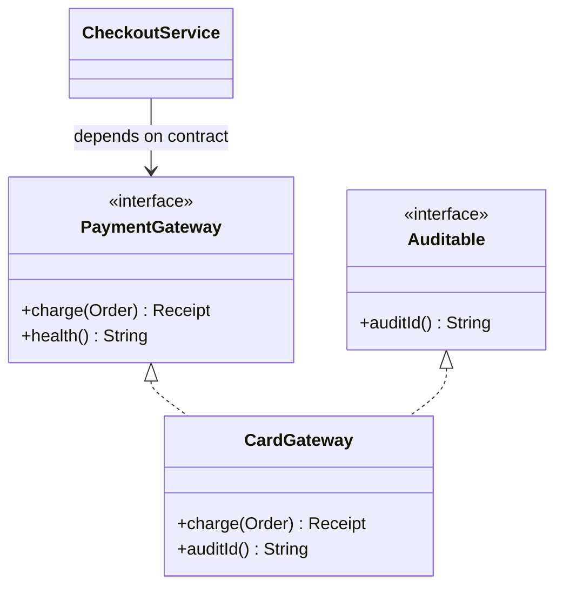
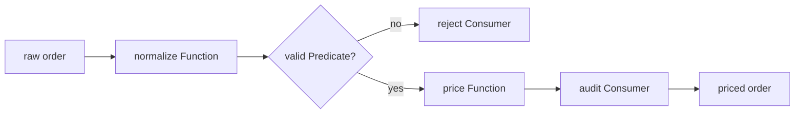
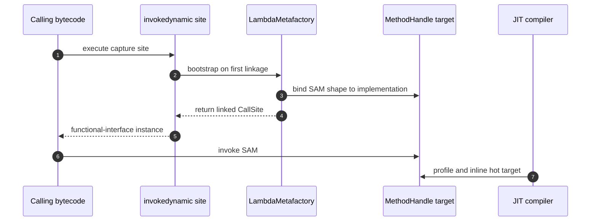

# Java Interfaces, Functional Interfaces & Lambda Expressions

Interfaces define behavioural contracts without coupling callers to a concrete class, while functional interfaces let one behaviour travel as a value. In production Java they underpin collections, streams, callbacks, dependency injection, and asynchronous APIs. Interviewers use them to test API design, type inference, closure semantics, composition, and the JVM's `invokedynamic` linkage model.

---

## 🟢 Beginner Level

### Interfaces as Behavioural Contracts

An interface describes what a type can do.

A class declares `implements` to promise that it supplies the interface's abstract behaviour.

Callers can depend on the interface instead of a particular implementation:

```java
interface PaymentGateway {
    Receipt charge(Order order);
}

final class CardGateway implements PaymentGateway {
    @Override
    public Receipt charge(Order order) {
        return new Receipt(order.id(), "card-approved");
    }
}
```

The implementation method must be `public` because interface methods are public by contract.

An interface can extend one or more interfaces.

A class can implement multiple interfaces even though it can extend only one class.

That makes interfaces Java's primary tool for multiple inheritance of type.



This design lets a test pass a fake `PaymentGateway` without changing `CheckoutService`.

It also lets production select a card, bank, or wallet adapter through configuration.

### The Four Kinds of Interface Methods

Modern interfaces support several method forms with different purposes:

| Method kind | Has body? | Inherited by implementation? | Typical purpose |
|---|---:|---:|---|
| Abstract | No | Contract must be implemented | Required behaviour |
| `default` | Yes | Yes, unless overridden | Backward-compatible API evolution |
| `static` | Yes | No | Factory or interface-level utility |
| `private` | Yes | No | Share implementation inside the interface |

```java
interface Formatter {
    String format(String input);

    default String formatTrimmed(String input) {
        return format(normalize(input));
    }

    static Formatter lowercase() {
        return String::toLowerCase;
    }

    private static String normalize(String input) {
        return input == null ? "" : input.trim();
    }
}
```

Interface fields are implicitly `public static final` constants.

Interface abstract methods are implicitly `public abstract` unless another permitted form is written.

Java 8 added default and static methods.

Java 9 added private instance and private static interface methods.

Private methods reduce duplication between default methods without exposing helpers to implementors.

Static interface methods are called through the interface, such as `Formatter.lowercase()`.

They are not inherited as instance methods by implementing classes.

### Default Methods and Conflict Rules

Default methods let an established interface gain behaviour without forcing every implementation to implement a new abstract method.

`Collection.stream()` is the canonical Java 8 example.

Three rules resolve competing implementations:

1. A concrete class method wins over an interface default.
2. A default from the more specific subinterface wins over a parent interface default.
3. Unrelated conflicting defaults require the implementing class to override explicitly.

```java
interface EmailNotifier {
    default String channel() { return "email"; }
}

interface SmsNotifier {
    default String channel() { return "sms"; }
}

final class AlertNotifier implements EmailNotifier, SmsNotifier {
    @Override
    public String channel() {
        return EmailNotifier.super.channel() + "+sms";
    }
}
```

Default methods do not make interfaces holders of mutable instance state.

They should express behaviour derivable from the public contract, not assumptions about implementation fields.

### Functional Interfaces and the SAM Rule

A functional interface has exactly one abstract method, called its Single Abstract Method or SAM.

The `@FunctionalInterface` annotation asks the compiler to enforce that rule.

```java
@FunctionalInterface
interface Transformer<T, R> {
    R transform(T input);

    default <V> Transformer<T, V> andThen(Transformer<R, V> after) {
        return input -> after.transform(transform(input));
    }
}
```

This interface remains functional despite its default method.

Any number of default, static, and private methods are allowed because they do not add abstract obligations.

Methods matching public methods of `Object`, such as `boolean equals(Object value)`, do not count as extra SAM methods.

Two inherited abstract declarations with override-equivalent signatures can represent one logical SAM.

Incompatible abstract signatures make the interface non-functional.

### Lambda Expressions and Target Types

A lambda is an unnamed implementation of a functional interface's SAM:

```java
Transformer<String, Integer> length = text -> text.length();
Runnable heartbeat = () -> System.out.println("alive");
Comparator<String> byLength = (left, right) ->
        Integer.compare(left.length(), right.length());
```

A lambda has no standalone nominal type.

Its target context supplies the functional interface type, parameter types, return requirements, and allowed checked exceptions.

The same expression can target different compatible interfaces:

```java
Callable<String> task = () -> "ready";
Supplier<String> value = () -> "ready";
```

Use explicit parameter types when inference becomes ambiguous or when annotations are required.

---

## 🟡 Intermediate Level

### Functional interfaces, lambdas, and method references

The standard library provides reusable functional shapes:

| Interface | SAM | Meaning | Example |
|---|---|---|---|
| `Predicate<T>` | `boolean test(T)` | Test a condition | `order -> order.total() > 100` |
| `Function<T,R>` | `R apply(T)` | Transform a value | `Order::customerId` |
| `Consumer<T>` | `void accept(T)` | Perform a side effect | `audit::record` |
| `Supplier<T>` | `T get()` | Produce lazily | `UUID::randomUUID` |
| `UnaryOperator<T>` | `T apply(T)` | Same-type transformation | `String::trim` |
| `BinaryOperator<T>` | `T apply(T,T)` | Combine same-type values | `BigDecimal::add` |
| `BiFunction<T,U,R>` | `R apply(T,U)` | Two-input transformation | `(price, tax) -> price.add(tax)` |

Primitive specialisations such as `IntPredicate`, `IntFunction<R>`, and `ToLongFunction<T>` avoid boxing.

Choose the narrowest standard interface that communicates intent.

A `Predicate<Order>` is clearer than a custom `Function<Order, Boolean>` and avoids boxed booleans.

Checked exceptions are part of the SAM signature.

`Function<T,R>` cannot directly host a lambda that throws `IOException`, so the API must catch, wrap, or expose a custom throwing interface.

### Method References

Method references are compact lambdas used when an existing method already matches the target SAM.

| Form | Example | Equivalent lambda |
|---|---|---|
| Static method | `Integer::parseInt` | `text -> Integer.parseInt(text)` |
| Bound instance | `logger::info` | `message -> logger.info(message)` |
| Unbound instance | `String::trim` | `text -> text.trim()` |
| Constructor | `ArrayList::new` | `() -> new ArrayList<>()` |
| Array constructor | `String[]::new` | `size -> new String[size]` |

An unbound reference uses the first SAM argument as the receiver.

For example, `BiPredicate<String, String> starts = String::startsWith` maps to `(text, prefix) -> text.startsWith(prefix)`.

Prefer a lambda when it makes argument order or adaptation more obvious.

The shortest syntax is not always the most readable syntax.

### Composition and Short-Circuiting

Functional interfaces provide algebra-like composition operations.

`Predicate.and`, `or`, and `negate` combine conditions.

`Function.andThen` executes left-to-right, whereas `Function.compose` executes its argument first.

`Consumer.andThen` sequences side effects.



Predicate composition short-circuits just like `&&` and `||`.

For `first.and(second)`, Java does not evaluate `second` when `first` is false.

That affects both performance and observable side effects.

Functions should normally be pure enough that composition order is easy to reason about.

### Worked Example: A Composed Order Rule

Suppose checkout applies a 10% discount only when an order is active, has at least 3 items, and totals at least \$100.

```java
record Order(boolean active, int itemCount, BigDecimal subtotal) {}

Predicate<Order> active = Order::active;
Predicate<Order> bulk = order -> order.itemCount() >= 3;
Predicate<Order> eligibleAmount =
        order -> order.subtotal().compareTo(new BigDecimal("100.00")) >= 0;

Predicate<Order> discountEligible = active.and(bulk).and(eligibleAmount);

Function<Order, BigDecimal> finalPrice = order ->
        discountEligible.test(order)
                ? order.subtotal().multiply(new BigDecimal("0.90"))
                : order.subtotal();
```

Trace three concrete orders:

| Order | Active | Items | Subtotal | First failed predicate | Final price |
|---|---:|---:|---:|---|---:|
| A | yes | 4 | \$120.00 | none | \$108.00 |
| B | yes | 2 | \$150.00 | `bulk` | \$150.00 |
| C | no | 8 | \$300.00 | `active` | \$300.00 |

For Order A, the calculation is $120.00 \times 0.90 = 108.00$ dollars.

All three predicates execute because each is true.

For Order B, `active` is true and `bulk` is false, so `eligibleAmount` is skipped by short-circuiting.

For Order C, only `active` executes.

Across one million inactive orders, putting the cheap `active` test first can avoid one million amount comparisons.

This ordering matters when a later predicate performs an expensive database lookup, although remote I/O inside predicates is usually a design smell.

### Lexical Scope, `this`, and Captured Variables

Lambdas use lexical scope.

Inside a lambda, `this` refers to the enclosing instance.

Inside an anonymous class, `this` refers to the anonymous-class object.

```java
final class CounterService {
    private final String name = "orders";

    Supplier<String> label(int initialCount) {
        int snapshot = initialCount;
        return () -> this.name + ":" + snapshot;
    }
}
```

A captured local variable must be final or effectively final.

Java captures its value, so reassignment after capture would create confusing split semantics between a method-local slot and a longer-lived lambda object.

Fields may be mutated because the lambda captures the object reference, not an immutable copy of every field.

That does not make field mutation thread-safe.

Capturing a mutable list or array also permits mutation of the object even though the captured reference remains unchanged.

Use `AtomicInteger`, synchronization, or confinement when shared concurrent mutation is genuinely required.

### Overload Resolution and Type Inference

The compiler uses target typing to infer a lambda's parameter and return types.

Overloads with unrelated functional interface parameters can become ambiguous:

```java
static void submit(Callable<String> task) {}
static void submit(Supplier<String> task) {}

// submit(() -> "done"); // ambiguous
submit((Supplier<String>) () -> "done");
```

The cast supplies a target type and resolves the call.

Overloading APIs solely by similar SAM types often harms usability.

Prefer distinct method names or accept one canonical interface.

An expression-bodied lambda must be compatible with the SAM return type.

A block-bodied value lambda must return a value along every reachable path.

Parameter types must be all inferred or all explicitly declared; mixing styles in one parameter list is illegal.

---

## 🔴 Expert Level

### `invokedynamic` and `LambdaMetafactory`

`javac` usually lowers a lambda body to a synthetic method and emits an `invokedynamic` instruction at the capture site.

The class file's bootstrap metadata points to `LambdaMetafactory.metafactory` or `altMetafactory`.

On first linkage, the JVM supplies the SAM method type, implementation method handle, and instantiated method type.

The bootstrap returns a `CallSite` whose target constructs or retrieves an object implementing the requested functional interface.



An anonymous class normally produces an additional class file such as `Checkout$1.class`.

A lambda does not require one extra class file per expression on disk.

The JVM is still free to spin or define hidden implementation classes at runtime; “a lambda creates no class” is therefore too absolute.

Non-capturing lambda instances may be cached, but object identity is intentionally unspecified.

Capturing lambdas generally require captured values to be bound into an instance.

Code must never rely on two evaluations of the same lambda expression returning identical or different objects.

### Runtime Shape, Allocation, and JIT Optimisation

A non-capturing lambda has no per-evaluation captured state.

HotSpot can return a reused singleton-like instance from its call site.

A capturing lambda logically stores its captured arguments, which can create allocation pressure when instantiated in a hot loop.

Escape analysis may eliminate some short-lived allocations when the object does not escape compiled code.

The JIT can inline a stable method-handle target and then optimise across the lambda boundary.

Primitive functional interfaces prevent boxing allocations and unboxing work:

```java
IntUnaryOperator square = value -> value * value;
Function<Integer, Integer> boxedSquare = value -> value * value;
```

The boxed form may allocate `Integer` objects for values outside the cache and expands generic call-site work.

Measure before replacing readable code with specialised variants, but use primitive streams for large numeric pipelines.

Large captured object graphs can remain reachable as long as a callback is registered.

A listener lambda that captures a service may therefore prevent that service and its dependencies from being garbage-collected.

Explicitly unregister long-lived listeners.

### API Design, Exceptions, and Behavioural Contracts

Functional parameters make strategy injection lightweight:

```java
static <T> T retry(Supplier<T> operation, Predicate<RuntimeException> retryable) {
    try {
        return operation.get();
    } catch (RuntimeException failure) {
        if (!retryable.test(failure)) throw failure;
        return operation.get();
    }
}
```

The signature communicates input and output shapes but not every semantic constraint.

Documentation must state whether callbacks may be invoked zero, once, or many times; sequentially or concurrently; and whether `null` is accepted.

Standard interfaces do not declare checked exceptions.

Wrapping an `IOException` in a generic `RuntimeException` can erase useful error taxonomy and rollback behaviour.

Library APIs that genuinely expect checked failures can define a narrowly named `ThrowingFunction<T,R,E extends Exception>`.

Avoid serialising lambdas for durable messages or database records.

Their generated representation and captured implementation details are not a stable cross-version protocol.

Use explicit command records with versioned fields at persistence boundaries.

### Production Failure Modes and Trade-offs

1. **Side effects in parallel pipelines:** a `Consumer` mutating an unsynchronised `ArrayList` can lose data or corrupt state when invoked concurrently. Prefer collectors designed for the execution model or keep the pipeline sequential.
2. **Hidden retention:** a long-lived callback captures `this`, retaining an entire application component. Capture only the small immutable value needed and unregister the callback during shutdown.
3. **Opaque stack traces:** deeply nested, multiline lambdas produce synthetic method names and weak operational context. Extract significant business rules into named methods with domain-specific logging.
4. **Ambiguous overloads:** two overloads taking shape-compatible SAM types make natural lambdas fail compilation. Give the operations distinct names or require an explicit target type.
5. **Unstable identity:** using a lambda as a key and later recreating “the same” expression does not retrieve the entry. Keep and reuse the original listener reference when removal depends on identity.

### Common Misconceptions

1. **“An interface can contain only abstract methods.”**
   Modern interfaces can contain abstract, default, static, and private methods, plus constants. Default methods support evolution, while private methods share internal implementation without enlarging the public contract.
2. **“A lambda is just syntax for an anonymous inner class.”**
   Their observable scoping and bytecode strategies differ: lambdas use enclosing `this` and typically link through `invokedynamic`. Anonymous classes introduce their own `this` and normally compile to separate class files.
3. **“Captured variables are deeply immutable.”**
   Only the captured local reference must remain effectively final. The referenced list, array, or object can still mutate, which can introduce races when callbacks run concurrently.
4. **“A non-capturing lambda is guaranteed to be a singleton.”**
   A JVM may cache it, but the Java specification does not promise identity. Correct code compares behaviour through its contract rather than using `==` on lambda objects.
5. **“Default methods provide multiple inheritance of state.”**
   Interfaces still have no per-instance fields, constructors, or mutable instance state. They provide multiple inheritance of behaviour and type, with explicit rules for conflicts.

### Interview Questions

**Q1. Can an interface with one abstract method and three default methods be a functional interface?** `[easy]`

Yes, because the SAM rule counts abstract obligations, not methods with implementations. Default, static, and private methods do not add abstract obligations, so any number of them may coexist with the single abstract method. `@FunctionalInterface` is optional but useful because the compiler rejects later changes that accidentally add a second SAM.

**Q2. What are the roles of default, static, and private interface methods?** `[easy]`

A default method supplies inheritable behaviour, chiefly so an interface can evolve without breaking every existing implementation. A static method belongs to the interface namespace and commonly serves as a factory or utility, while a private method shares code only among methods inside that interface. Static and private methods are not inherited as implementation instance methods, which keeps their contracts different from defaults.

**Q3. What do `Predicate`, `Function`, `Consumer`, and `Supplier` represent?** `[easy]`

A `Predicate<T>` tests a `T`, a `Function<T,R>` transforms `T` to `R`, a `Consumer<T>` performs a side effect, and a `Supplier<T>` produces a value without an input. Their SAMs are respectively `test`, `apply`, `accept`, and `get`. Choosing these standard shapes improves interoperability, although a domain-specific interface is better when its name or checked-exception contract conveys essential meaning.

**Q4. Does compiling five lambda expressions produce five additional `.class` files?** `[easy]`

No, `javac` normally emits synthetic implementation methods and `invokedynamic` capture sites in the enclosing class rather than one disk class per lambda. At runtime the lambda metafactory links each site and the JVM may define hidden implementation machinery. This differs from anonymous inner classes, which normally create separately named class files, but it does not mean runtime class metadata can never exist.

**Q5. Why must a captured local variable be final or effectively final?** `[medium]`

A lambda captures the local variable's value and can outlive the method activation that originally held the local slot. Allowing later reassignment would make it unclear whether the callback observes the captured value or a changing stack-local variable. The restriction gives stable value-capture semantics, but it does not make a captured object immutable or make mutations to that object thread-safe.

**Q6. How does `invokedynamic` differ from `invokevirtual`?** `[medium]`

`invokevirtual` performs virtual dispatch using a symbolic method reference whose receiver-based meaning is established by normal class linkage. An `invokedynamic` site's target is produced by a bootstrap method, and for lambdas `LambdaMetafactory` links the requested SAM shape to an implementation method handle. The target is linked once for that call site and can be optimised aggressively, but initial linkage still has bootstrap work.

**Q7. How are default-method conflicts resolved?** `[medium]`

A concrete class method has priority over an interface default, and a method from a more specific subinterface has priority over one from its ancestor. If unrelated interfaces contribute the same default signature, the implementing class must override it to resolve the ambiguity. That override may choose one implementation explicitly with `InterfaceName.super.method()` or define entirely new behaviour.

**Q8. What is the difference between `Function.compose` and `Function.andThen`?** `[medium]`

For functions `f` and `g`, `f.andThen(g)` computes `g(f(x))`, so data flows through `f` first. In contrast, `f.compose(g)` computes `f(g(x))`, so `g` executes first. Mixing them up can silently change validation or conversion order, especially when either function has side effects or accepts only a narrow input domain.

**Q9. How does a lambda's `this` differ from an anonymous class's `this`?** `[medium]`

A lambda does not introduce a new `this`; it uses the lexically enclosing instance. An anonymous class creates a distinct object, so `this` inside its methods refers to that anonymous object. Code converted mechanically between the two may change behaviour when it accesses fields, synchronises on `this`, or passes `this` to another method.

**Q10. Why can overloads accepting different functional interfaces make a lambda ambiguous?** `[medium]`

A lambda is target-typed and has no independent nominal type before an invocation context supplies one. If two overloads accept unrelated SAM interfaces with compatible parameter and return shapes, neither target can be selected as more specific. An explicit cast resolves the call, but a public API is usually clearer when such operations have distinct names.

**Q11. Scenario: a parallel stream intermittently loses audit entries collected by a lambda. What should you inspect?** `[hard]`

Inspect whether the lambda mutates a shared non-thread-safe collection such as `ArrayList`, because parallel workers can race on its internal size and array writes. Replace external mutation with a suitable stream collector, a properly concurrent structure, or a sequential stream when ordering and side effects are required. Also verify that every callback dependency is thread-safe, since making only the outer collection concurrent may leave a logger or formatter race unresolved.

**Q12. Scenario: a listener cannot be removed even though deregistration passes an identical-looking method reference. Why?** `[hard]`

Re-evaluating a method reference or lambda is not guaranteed to return the same object identity as the originally registered callback. An identity-based listener registry therefore may not recognise the newly created value and retains both the callback and anything it captures. Store the original functional-interface instance in a field and pass that same reference to registration and removal.

**Q13. Why might a capturing lambda allocate while a non-capturing lambda does not?** `[hard]`

A capturing lambda must bind values such as an enclosing receiver or local argument into the functional object, so evaluating its capture site may require a state-bearing instance. A non-capturing site has no varying state and the runtime may reuse one instance. Escape analysis can eliminate some allocations and neither behaviour is a language guarantee, so profiling is required before treating allocation as a performance defect.

**Q14. Scenario: an API wraps every checked `IOException` from a functional callback in `RuntimeException`, and transaction retries behave incorrectly. How would you redesign it?** `[hard]`

Define a narrowly scoped throwing functional interface or adapt the exception at a boundary into a meaningful domain exception that preserves the cause. Document which failures are retryable and let the transaction layer distinguish transient I/O from permanent validation errors. A blanket runtime wrapper simplifies the signature but destroys error taxonomy, can trigger the wrong rollback policy, and makes observability less useful.

### Further Reading

- [Java Language Specification: Interfaces](https://docs.oracle.com/javase/specs/jls/se21/html/jls-9.html) defines interface members, inheritance, functional interfaces, and default-method rules.
- [Java Language Specification: Lambda Expressions](https://docs.oracle.com/javase/specs/jls/se21/html/jls-15.html#jls-15.27) specifies target typing, bodies, scoping, and capture.
- [Java `java.util.function` package](https://docs.oracle.com/en/java/javase/21/docs/api/java.base/java/util/function/package-summary.html) documents the standard functional shapes and composition methods.
- [JVM Specification: `invokedynamic`](https://docs.oracle.com/javase/specs/jvms/se21/html/jvms-6.html#jvms-6.5.invokedynamic) describes dynamic call-site resolution and linkage.
