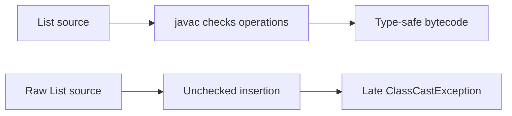
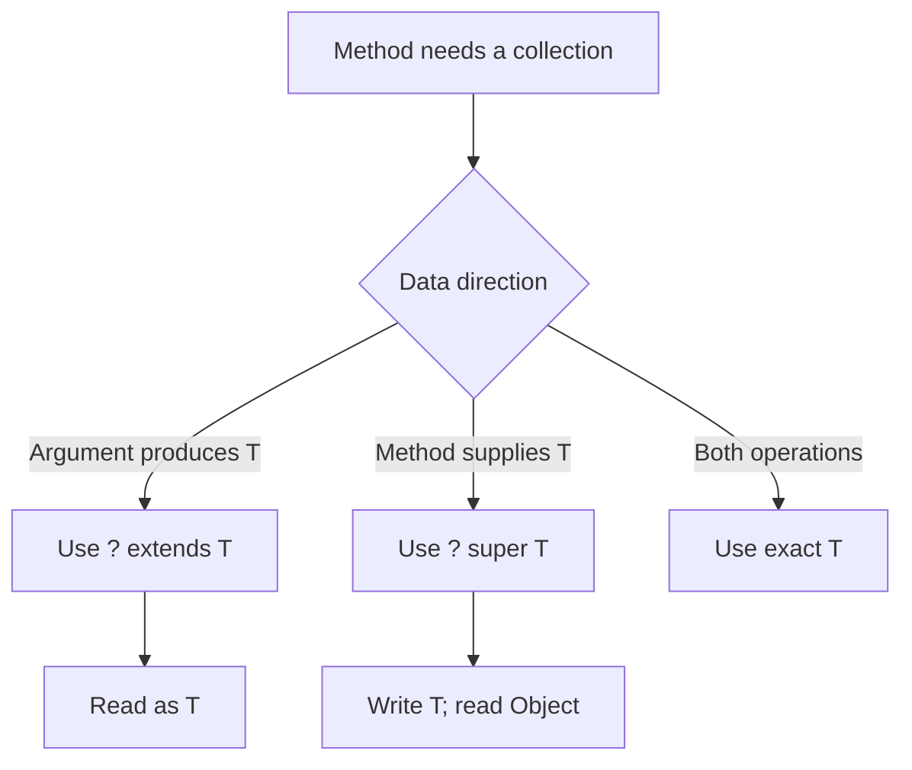
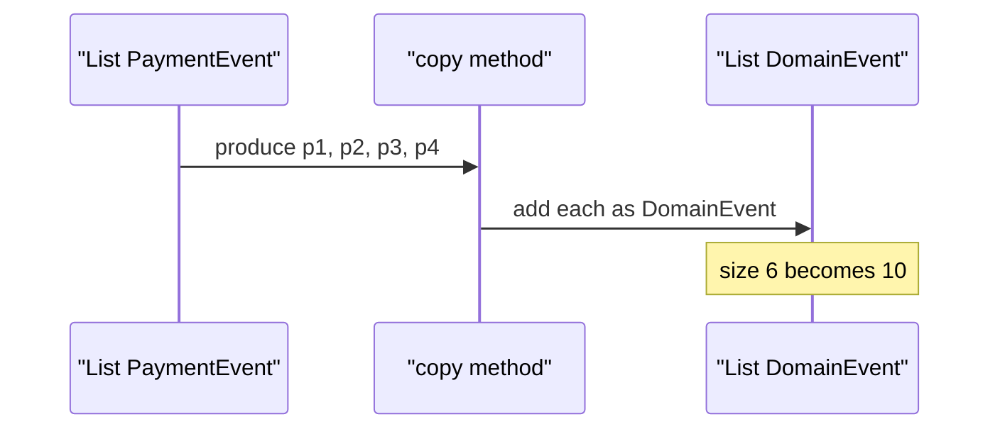
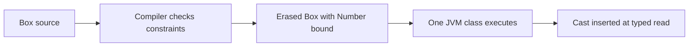

# Generics, Wildcards (PECS) & Type Erasure

Java generics let an API describe the types of values it accepts and returns before execution.
They make collection code safer and give library authors a way to express useful subtype relationships without abandoning compiler checks.
Interviewers ask about generics because a correct `extends` or `super` choice reveals whether someone can design an API rather than only consume one.

---

## 🟢 Beginner Level

### Type safety moves failures earlier

A raw collection stores references without an element-type promise.
The code that retrieves an element must cast it.
That cast can fail long after a different piece of code inserted the wrong value.

```java
List raw = new ArrayList();
raw.add("ready");
raw.add(42);
String label = (String) raw.get(1); // ClassCastException

List<String> labels = new ArrayList<>();
labels.add("ready");
// labels.add(42);                  // compiler error
String safeLabel = labels.get(0);
```

`List<String>` is a compile-time contract.
It says a successful read has type `String`.
It also says a normal insertion must be a `String`.
The diamond operator lets the compiler infer the repeated type argument.



Generics do not put a type tag on every list element at runtime.
Instead, the compiler verifies the program before generating bytecode.
Unchecked code can still violate that proof, so warnings deserve attention.

### Type parameters describe families of classes

A generic declaration introduces a type parameter between angle brackets.
Each use supplies a type argument.
The conventional name `T` is only a name; it is not a Java keyword.

```java
public final class Box<T> {
    private T value;

    public Box(T value) {
        this.value = value;
    }

    public T get() {
        return value;
    }

    public void set(T value) {
        this.value = value;
    }
}

Box<String> name = new Box<>("Ada");
Box<Integer> retries = new Box<>(3);
```

Libraries often use `E` for an element.
They use `K` and `V` for map keys and values.
They use `R` for a result type.
The letters make signatures compact, but a descriptive name is reasonable for a complex public API.

A method may introduce its own type parameter.
The declaration goes before the return type.

```java
public static <T> T requirePresent(T value, String message) {
    return Objects.requireNonNull(value, message);
}

String user = requirePresent("sam", "user is required");
Integer port = requirePresent(8080, "port is required");
```

The method's `T` is inferred independently on each invocation.
It does not need the enclosing class to be generic.
Writing `T` without declaring `<T>` first is a compiler error.

### Invariance protects mutable collections

Java arrays are covariant.
A `Dog[]` can be referenced as `Animal[]`.
The JVM then checks each array store at runtime.

```java
Animal[] animals = new Dog[1];
// animals[0] = new Cat(); // compiles, then ArrayStoreException

List<Dog> dogs = new ArrayList<>();
// List<Animal> animalList = dogs; // rejected at compile time
```

Generic collections are invariant.
`List<Dog>` is not a subtype of `List<Animal>`.
If it were, code receiving `List<Animal>` could insert a `Cat`.
The original dog-list reference would then hold an impossible element.

| Reference type | Refers to `List<Dog>` | Can add `Dog` | Read type |
|---|---:|---:|---|
| `List<Dog>` | Yes | Yes | `Dog` |
| `List<Animal>` | No | Yes | `Animal` |
| `List<? extends Animal>` | Yes | No, except `null` | `Animal` |
| `List<? super Dog>` | Yes | Yes | `Object` |

The wildcard rows are safe views over another list.
They preserve the owner's exact element type.
They are how Java provides controlled variance.

### An unbounded wildcard is one unknown type

`List<?>` means a list of one specific but unknown element type.
It may refer to a `List<String>`, `List<Integer>`, or `List<Object>`.
Every element can be read as `Object`.
No non-null element can safely be added.

```java
static void printAll(List<?> values) {
    for (Object value : values) {
        System.out.println(value);
    }
    // values.add("new value"); // element type is unknown
}
```

`List<Object>` means a different thing.
It needs an actual list declared for `Object` values.
It can accept arbitrary reference values.
It cannot accept a `List<String>`, because that would reopen the mutation problem.

---

## 🟡 Intermediate Level

### PECS selects the wildcard from data direction

PECS means **Producer Extends, Consumer Super**.
Use `? extends T` when an argument produces `T` values for this method to read.
Use `? super T` when an argument consumes `T` values supplied by this method.
Use an exact `T` where the same argument needs both operations.

```java
static double totalWeight(List<? extends Animal> animals) {
    double total = 0;
    for (Animal animal : animals) {
        total += animal.weightKg();
    }
    return total;
}

static void addRescueDogs(List<? super Dog> destination) {
    destination.add(new Dog("Rex", 18.5));
}
```

The first method accepts `List<Dog>` and `List<Cat>`.
Both lists produce values that are safely readable as `Animal`.
The second accepts `List<Dog>`, `List<Animal>`, and `List<Object>`.
Each destination can safely hold a dog.



PECS describes the parameter's role, not the domain inheritance tree.
An `extends` producer cannot accept a `Dog` because its hidden type might be `Cat`.
A `super` consumer yields `Object` because its hidden type might be `Animal` or `Object`.
The compiler rejects the operations it cannot prove safe.

### Bounds encode usable capabilities

An upper bound restricts a type variable to a capability.
`<T extends Number>` gives code access to the methods of `Number`.
It also rejects unrelated types before execution.

```java
static <T extends Number> double average(List<T> values) {
    double sum = 0;
    for (T value : values) {
        sum += value.doubleValue();
    }
    return sum / values.size();
}

static <T extends Comparable<? super T>> T max(List<? extends T> values) {
    T best = values.get(0);
    for (T value : values) {
        if (value.compareTo(best) > 0) {
            best = value;
        }
    }
    return best;
}
```

`Comparable<? super T>` is more flexible than `Comparable<T>`.
It lets a subclass use comparison logic declared on a superclass.
For example, a `Dog` can inherit `Comparable<Animal>` without redeclaring `Comparable<Dog>`.
This pattern appears in the JDK's sorting APIs.

Multiple bounds use `&`.
A class bound, when present, must appear first.

```java
static <T extends Number & Comparable<T>> T larger(T left, T right) {
    return left.compareTo(right) >= 0 ? left : right;
}
```

The bound is an API promise, not a runtime validator.
Erasure later represents `T` using its leftmost bound.

### Worked example: copy a typed event batch

An ingestion service receives four `PaymentEvent` objects.
`PaymentEvent` extends `DomainEvent`.
Its long-lived ledger already contains six `DomainEvent` objects.
The service must append the incoming batch without raw casts.

```java
static <T> void copy(List<? super T> destination, List<? extends T> source) {
    for (T item : source) {
        destination.add(item);
    }
}

List<PaymentEvent> incoming = List.of(p1, p2, p3, p4);
List<DomainEvent> ledger = new ArrayList<>(sixExistingEvents);
copy(ledger, incoming);
```

The incoming list produces `T`, so the source is `? extends T`.
The ledger consumes `T`, so the destination is `? super T`.
The loop executes four times.
The ledger size changes from $6$ to $6 + 4 = 10$.



An exact `copy(List<T>, List<T>)` signature rejects this useful subtype transfer.
A raw signature accepts it but also accepts unrelated values.
The wildcard signature is broad at the safe boundary and narrow at the unsafe one.

### Capture conversion names an unknown type locally

The compiler treats each wildcard as a fresh hidden type.
Compiler diagnostics often call it `CAP#1`.
That name means the compiler cannot prove that an offered value matches the wildcard's actual type.

```java
static void reverse(List<?> list) {
    reverseCaptured(list);
}

private static <T> void reverseCaptured(List<T> list) {
    Collections.reverse(list);
}
```

The public method accepts any list.
The private method captures that list's one unknown element type as `T`.
Swapping elements within the same captured list is therefore safe.
Capture cannot make an arbitrary external `Number` safe to insert into `List<? extends Number>`.

### Generic varargs need a narrow safety promise

Varargs are implemented as arrays.
Generic arrays are not reifiable.
Together, they can create heap pollution if a method leaks or mutates its varargs array.

```java
@SafeVarargs
static <T> List<T> flatten(List<? extends T>... batches) {
    List<T> result = new ArrayList<>();
    for (List<? extends T> batch : batches) {
        result.addAll(batch);
    }
    return result;
}
```

`@SafeVarargs` suppresses a warning after an author audit.
It is allowed only on static, final, private, or otherwise non-overridable methods.
The method must not expose the array or write incompatible values through it.
When possible, accept a collection of collections instead of generic varargs.

---

## 🔴 Expert Level

### Erasure preserves bytecode compatibility

Java implements generics with erasure.
An unbounded type variable becomes `Object` in bytecode.
A bounded variable becomes its leftmost bound.
The compiler inserts casts at typed reads that it already proved safe in source.

```java
public final class Box<T extends Number> {
    private final T value;

    public Box(T value) {
        this.value = value;
    }

    public T get() {
        return value;
    }
}
```

Conceptually, the field and erased return type are `Number`.
At a `Box<Integer>` call site, the generated code casts the returned `Number` to `Integer` when needed.
One erased `Box` class serves all of its source-level instantiations.
This keeps new generic classes interoperable with code compiled before generics existed.



Erasure explains several restrictions.
`new T()` is illegal because the running object does not know which constructor to call.
`T.class` is illegal because there is no unique runtime `T` class token.
`new T[10]` is illegal because arrays check their component type at runtime.

### Bridge methods preserve polymorphism

Erasure can make a specialized overriding method look different from the inherited erased method.
The compiler emits a synthetic bridge method to preserve normal dynamic dispatch.

```java
final class NameComparator implements Comparator<String> {
    @Override
    public int compare(String left, String right) {
        return left.compareTo(right);
    }
}
```

The compiler effectively adds a bridge resembling `compare(Object, Object)`.
That bridge casts both arguments to `String`.
It then delegates to `compare(String, String)`.
Without it, a call made through the erased `Comparator` signature could miss the source-level override.

Use `javap -p -c -v NameComparator` to inspect methods marked `ACC_BRIDGE` and `ACC_SYNTHETIC`.
They are compiler machinery.
Application code should not try to recreate them with manual overloads.
Raw callers can still fail at the bridge cast, which is one reason raw types remain dangerous.

### Reifiable types define the runtime boundary

A reifiable type is fully known to the JVM at runtime.
Non-generic classes, primitive types, raw types, and parameterized types using only unbounded wildcards are reifiable.
`List<String>` is not reifiable because its element argument disappears from an instance's runtime class.

| Operation | `List<String>` | `List<?>` | Reason |
|---|---:|---:|---|
| `instanceof` test | No | Yes | only the wildcard form is reifiable |
| direct generic array | No | no exact generic array | component argument is erased |
| cast from raw input | unchecked | shape checked only | element argument is unavailable |
| runtime class equality | same as `List<Integer>` | same raw class | arguments are erased |

Reflection can inspect a field or method declaration's generic signature.
It cannot normally ask an arbitrary `ArrayList` instance which element argument it was constructed with.
Frameworks needing a runtime type should accept `Class<T>` or a richer type token.
That explicit input makes the runtime dependency visible in the API.

### Heap pollution is an escape hatch

Heap pollution occurs when a parameterized reference points to data that violates its declared argument.
Raw types, unchecked casts, reflection, and unsafe generic varargs can create it.
The visible failure commonly occurs later at a compiler-inserted cast.

```java
List<String> names = new ArrayList<>();
List rawNames = names;
rawNames.add(99);
String name = names.get(0); // late ClassCastException
```

Treat unchecked warnings as defects at module boundaries.
If legacy code forces one conversion, validate the input at the adapter boundary.
Keep `@SuppressWarnings("unchecked")` on the smallest expression or method that carries the proven invariant.
Do not suppress warnings over a whole package or service.

### Variance belongs at API edges

Use exact type parameters for an object that reads and writes its own state.
Use wildcards in input parameters where callers benefit from safe substitution.
Avoid wildcard return types unless the unknown subtype is genuinely part of the contract.

For example, `static <T> List<T> copyOf(Collection<? extends T> source)` returns a useful named result type.
Returning `List<? extends Event>` instead makes every caller handle an element subtype it cannot name or append to.
This distinction matters most in public framework APIs, because a wildcard return type becomes a permanent constraint on downstream users.

### Common Misconceptions

1. **“`? extends Animal` means a list class extends `Animal`.”** It means the hidden element type is some subtype of `Animal`. Reading is safe as `Animal`, but adding a `Dog` is not because the hidden type could be `Cat`.
2. **“Generics eliminate every `ClassCastException`.”** They eliminate casts that normal typed code would otherwise need. Raw types, reflection, unchecked casts, and deserialisation can still violate the contract.
3. **“Use `extends` whenever inheritance appears.”** The wildcard follows data direction, not the word in the class declaration. A list that receives dogs needs `? super Dog`.
4. **“Erasure means no generic information can be inspected at runtime.”** Generic signatures on declarations are often available through reflection. A normal collection instance still does not carry its concrete element argument.
5. **“`@SafeVarargs` makes varargs safe automatically.”** It only tells the compiler that the author has checked the method. Applying it to a method that leaks or corrupts its array hides a real bug.

### Interview Questions

**Q1. What problem do Java generics solve?** `[easy]`

Generics state the input and output types of a collection or API, so invalid usage is rejected during compilation. The compiler can remove many explicit casts and prove typed reads safe. Raw types and unchecked casts can still bypass that proof, so generics are not a runtime validation system.

**Q2. Why is `List<Dog>` not a subtype of `List<Animal>`?** `[easy]`

If that assignment were allowed, code receiving `List<Animal>` could add a `Cat` to the original dog list. Java avoids this mutation hole by making generic collections invariant. Arrays instead permit covariance and pay with runtime `ArrayStoreException` checks.

**Q3. How does `List<Object>` differ from `List<?>`?** `[easy]`

`List<Object>` is exactly a list declared to hold objects and accepts arbitrary reference values. `List<?>` is a reference to a list of one unknown type and can therefore refer to `List<String>`. Elements from that wildcard list are readable only as `Object`, and non-null writes are rejected.

**Q4. Why cannot a `List<? extends Number>` accept an integer?** `[easy]`

The hidden type might be `Double`, `Long`, or another subtype of `Number`, not `Integer`. Inserting an integer could corrupt a `List<Double>` reached through that view. The compiler permits only `null` because it is valid for all reference element types.

**Q5. Explain PECS with one producer and one consumer.** `[medium]`

PECS uses `? extends T` when a parameter produces values that the method reads, and `? super T` when it consumes values the method writes. A sum method can read `List<? extends Number>`, while a method that appends dogs can take `List<? super Dog>`. Use exact `T` when one parameter must support both typed reads and writes.

**Q6. Why does a general copy method use two wildcards?** `[medium]`

The source produces values assignable to `T`, so it needs `? extends T`. The destination consumes those values, so it needs `? super T`. This permits a `List<PaymentEvent>` to be copied into a `List<DomainEvent>` without allowing incompatible values.

**Q7. What happens to `<T extends Number>` after erasure?** `[medium]`

The compiler represents `T` as its leftmost bound, `Number`, in bytecode. It inserts casts where source code requires a narrower argument such as `Integer`. This preserves old bytecode compatibility but makes operations such as `new T()` impossible without explicit runtime type information.

**Q8. What is a synthetic bridge method?** `[medium]`

A bridge method is compiler-generated when erasure would otherwise stop a specialized method from overriding an erased inherited signature. It accepts the erased arguments, casts them, and delegates to the typed implementation. It preserves virtual dispatch, but a raw caller can still fail at its cast.

**Q9. When should `@SafeVarargs` be used?** `[medium]`

Use it only after verifying that a non-overridable generic-varargs method neither exposes its varargs array nor stores incompatible values into it. The annotation suppresses a warning; it does not enforce a safety property at runtime. Prefer a collection parameter if the API can avoid arrays entirely.

**Q10. What does a compiler error mentioning `CAP#1` mean?** `[medium]`

`CAP#1` names the particular unknown type captured by a wildcard in that expression. The compiler is reporting that it cannot prove the proposed value has that hidden type. A generic helper can capture the wildcard for operations within the same list, but it cannot make arbitrary external writes safe.

**Q11. A legacy adapter returns a raw `List` and production later throws `ClassCastException`. What do you change?** `[hard]`

Validate and convert elements at the adapter boundary, then expose only a parameterized list to the rest of the application. Keep any unavoidable unchecked cast in one small, documented location after the invariant is checked. Suppressing warnings across the service only delays the failure and loses the causal location.

**Q12. Your public API returns `List<? extends Event>` and callers cannot append their events. How would you redesign it?** `[hard]`

Return `List<Event>` when the implementation can safely expose the base type, or return a named type parameter when callers need a specific subtype. Wildcards widen input parameters well but export an inconvenient unknown type when used as a return type. Keep the wildcard return only if preserving an unknown subtype is an intentional semantic guarantee.

**Q13. Why are generic arrays forbidden, and what is a safe alternative?** `[hard]`

Arrays enforce a runtime component type, while normal generic arguments are erased, so `new T[10]` cannot build the promised runtime array. Prefer `List<T>` for dynamic data. If an array is required, accept `Class<T>` or `IntFunction<T[]>` so the caller supplies the runtime component type.

**Q14. A JSON framework needs actual `T` at runtime. How can it obtain it?** `[hard]`

The API must receive runtime type information explicitly, such as `Class<T>` for simple classes or a type token for nested parameterized types. It can also inspect a field or subclass declaration whose generic signature was retained in metadata. Calling `getClass()` on an `ArrayList<T>` cannot reveal its erased element type and will select decoders incorrectly.

### Further Reading

- [Java Language Specification: Types, Values, and Variables](https://docs.oracle.com/javase/specs/jls/se17/html/jls-4.html) explains parameterized types, wildcards, and erasure.
- [Java Language Specification: Arrays](https://docs.oracle.com/javase/specs/jls/se17/html/jls-10.html) explains runtime array checks and reifiable component types.
- [Java Collections Framework `Collections.copy` API](https://docs.oracle.com/en/java/javase/17/docs/api/java.base/java/util/Collections.html#copy(java.util.List,java.util.List)) shows PECS in a standard library signature.
- [Java Virtual Machine Specification: Method invocation](https://docs.oracle.com/javase/specs/jvms/se17/html/jvms-6.html#jvms-6.5.invokevirtual) provides dispatch background for bridge methods.
