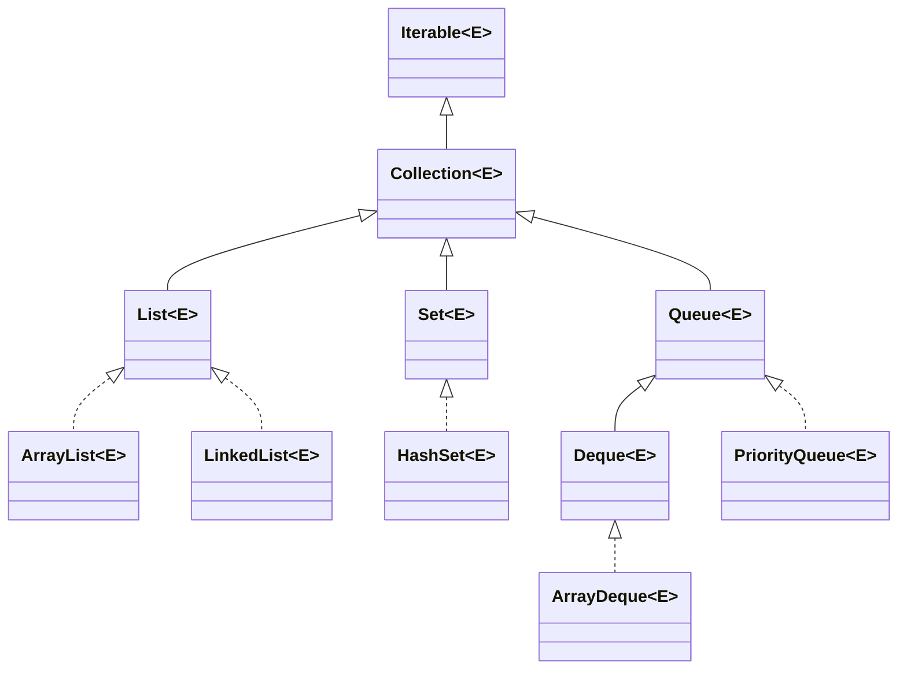
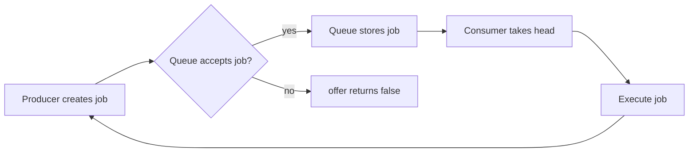
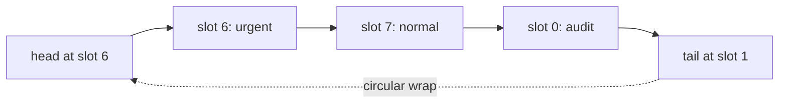
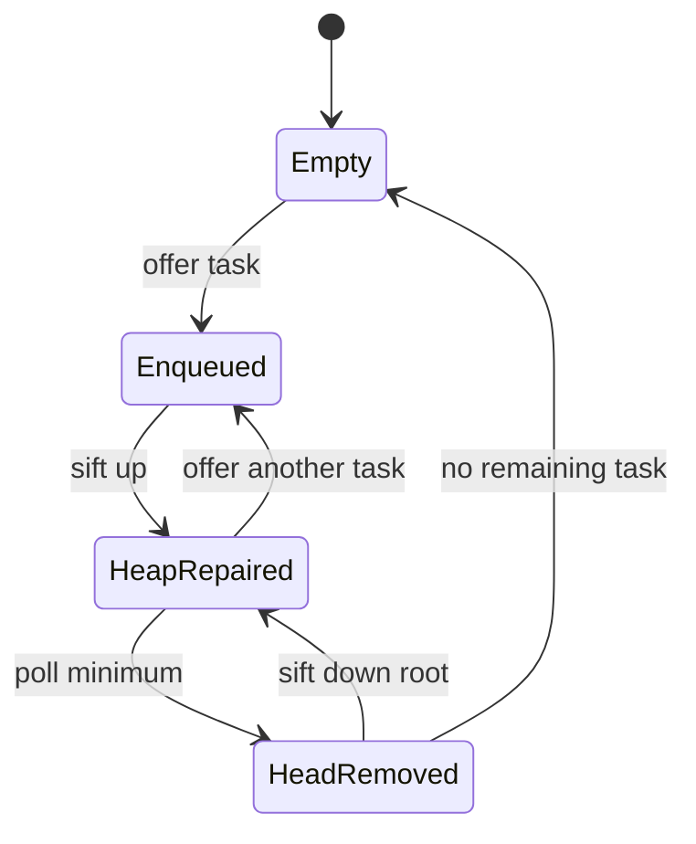

# Java Collections Framework: List, Set, Queue & PriorityQueue

The Java Collections Framework provides the contracts and implementations used to retain, order, deduplicate, and schedule application data.
It sits under caches, request handling, work queues, and domain models, so interviewers expect choices to be justified by workload and semantics rather than by familiarity.
The useful question is which representation preserves the required ordering, uniqueness, lookup, and failure behavior at an acceptable allocation and latency cost.

---

## 🟢 Beginner Level

### Start with the Contract

`Iterable<E>` promises traversal with an iterator or enhanced `for` loop.
`Collection<E>` adds shared operations such as `add`, `remove`, `contains`, `size`, and `clear`.
`List<E>`, `Set<E>`, and `Queue<E>` specialize those operations with different semantic rules.
`Map<K, V>` is a related but independent hierarchy because it maps keys to values instead of storing elements alone.

Choose a `List` when position and duplicate values are meaningful.
Choose a `Set` when membership must be unique.
Choose a `Queue` or `Deque` when consumption order matters.
Choose a `Map` when values must be retrieved by stable keys.



The diagram is a type relationship rather than a performance ranking.
`LinkedList` implements both `List` and `Deque`, but it is not automatically the best default for either role.
Program to the narrowest interface that represents the caller's need.
Select a particular implementation at construction time.

```java
List<String> names = new ArrayList<>();
Deque<Runnable> jobs = new ArrayDeque<>();
Set<Long> seenIds = new HashSet<>();
```

This protects callers from accidental dependence on implementation-only methods.
It also makes an implementation change a local construction decision instead of a broad rewrite.

### Order, Duplicates, and Nulls

An `ArrayList` retains insertion order and permits duplicate elements.
`HashSet` enforces uniqueness with `equals` and `hashCode`, but makes no iteration-order promise.
`LinkedHashSet` retains insertion order while preserving uniqueness.
`TreeSet` orders elements by natural ordering or a comparator and also enforces uniqueness under that order.

`PriorityQueue` promises order only at its head.
`peek()` and `poll()` obtain the least element under its default or supplied comparator.
Iterating a priority queue does not return globally sorted order.
Serializing a priority queue by iteration therefore does not produce a sorted schedule.

Null policy belongs to a collection's contract.
`ArrayList` and `HashSet` permit null in normal use, with a `HashSet` allowing at most one null member.
`ArrayDeque` and `PriorityQueue` reject null because null would conflict with empty-result or comparison behavior.
Use an explicit value model when absence is business data rather than letting null leak through a pipeline.

### Complexity Is a Clue, Not a Latency Guarantee

Big-O describes how work grows with input size.
It does not include cache locality, allocation, garbage collection, contention, or a poor hash distribution.
A dense array can outperform a pointer structure even when both advertise constant-time endpoint operations.
Hash collections are expected $O(1)$ only when key hashes distribute across buckets.

| Need | Good default | Why | Avoid when |
|---|---|---|---|
| Indexed reads and appends | `ArrayList` | Dense storage and $O(1)$ indexing | You remove frequently from the front |
| FIFO queue or LIFO stack | `ArrayDeque` | Circular array without node allocation | You need blocking coordination |
| Unique membership | `HashSet` | Expected $O(1)$ add and lookup | Key state can mutate |
| Next smallest item | `PriorityQueue` | Heap gives $O(1)$ peek and $O(\log n)$ poll | You need sorted iteration |
| Keyed lookup | `HashMap` | Expected $O(1)$ lookup | Keys have unstable equality |

These are workload-oriented defaults, not universal laws.
Measure a hot path before replacing a simple collection only because a complexity table looks attractive.

### Queues Express a Work Protocol

Queue method pairs make normal failure behavior visible.
`add` and `remove` throw if the operation cannot proceed.
`offer` and `poll` return `false` or `null` where that result can be handled by the caller.
`element` and `peek` make the same distinction when inspecting a head.

Use throwing methods where failure violates a local invariant.
Use sentinel-returning methods where an empty queue is expected control flow.
For producer-consumer coordination, choose a `BlockingQueue` instead of repeatedly polling an ordinary queue.



The flow separates a collection's in-memory storage role from the service's backpressure policy.
An unbounded queue can hide overload temporarily and turn it into later heap exhaustion.

---

## 🟡 Intermediate Level

### ArrayList: Direct Indexing and Growth

`ArrayList` stores references in one `Object[]` backing array.
Reading index `i` is $O(1)$ because the JVM calculates the relevant array slot directly.
Appending normally writes to the next free slot.
When capacity is exhausted, the implementation allocates a larger array and copies references into it.

Current OpenJDK implementations grow approximately with `oldCapacity + (oldCapacity >> 1)`.
That is about 1.5 times the old capacity.
The exact growth sequence is an implementation detail rather than a portable API promise.
Appends remain amortized $O(1)$ because a copy is occasional instead of occurring for every append.

### Worked Example: Batch Buffer Sizing

Suppose a request contains 10,000 customer identifiers.
The service appends every identifier once, then processes the values by index.
`new ArrayList<>(10_000)` reserves enough reference slots for the expected batch.
That avoids intermediate array copies during the request.

Starting from an illustrative capacity of 10, an exhausted backing array grows to about 15.
The next growth is about 22, then 33, then 49.
Each growth copies all references already stored, even though it does not copy the referenced customer objects themselves.
For a 10,000-element request, these cumulative copies can be many thousands of references.

```java
List<Long> customerIds = new ArrayList<>(10_000);
for (long id : incomingIds) {
    customerIds.add(id);
}
for (int index = 0; index < customerIds.size(); index++) {
    process(customerIds.get(index));
}
```

Pre-sizing helps when a realistic bound is known.
It is not a reason to allocate a huge backing array for every small request.
Unused capacity remains retained heap memory until the list becomes unreachable or is replaced.
Apply input limits and streaming for untrusted or very large batches.

### LinkedList and ArrayDeque

`LinkedList` stores each value in a separate node linked to neighbors.
Adding or removing at a known endpoint changes nearby links in constant time.
Finding index 500 walks nodes one by one, so indexed access is $O(n)$.
Every node is a separate object allocation with headers and reference fields.

`ArrayDeque` uses a resizable circular array with head and tail positions.
Adding at either end normally writes one array slot and advances a cursor.
When a cursor reaches the last slot, it wraps to the beginning of the backing array.
This representation avoids the per-element node allocation that makes linked structures expensive in many workloads.



The physical slot order is an implementation detail.
The deque API defines the logical front and back regardless of where values sit in the array.
`ArrayDeque` rejects null so `poll` and `peek` can use null to represent an empty result.

### HashSet: Equality Controls Membership

`HashSet<E>` is backed by a `HashMap<E, Object>` with a shared dummy value for each key.
On `add`, it computes a hash, chooses a bucket, and tests candidates for equality.
If an equal value is present, `add` returns `false`.
If none is present, the collection gains a member and `add` returns `true`.

Equal objects must return equal hash codes.
Objects stored in a set must not mutate fields participating in `equals` or `hashCode`.
After mutation, a member can be physically in its old bucket while `contains` searches a bucket selected by its new hash.
That makes a present object appear absent.

```java
record UserKey(long tenantId, String externalId) {}

Set<UserKey> seen = new HashSet<>();
boolean first = seen.add(new UserKey(7L, "acct-42"));
boolean duplicate = seen.add(new UserKey(7L, "acct-42"));
```

Here `first` is true and `duplicate` is false because records use value-based equality for their components.
An immutable key is safer than a mutable entity whose identity changes through its lifecycle.

### PriorityQueue: Heap Instead of Sorted List

`PriorityQueue` stores a complete binary heap in an array.
For zero-based index `k`, the parent is `(k - 1) >>> 1`.
The left child is `2k + 1` and the right child is `2k + 2`.
The invariant says each parent precedes or equals each child under the comparator.

On `offer`, a value starts in the final array slot and sifts upward.
On `poll`, the final value moves to the root and sifts downward through the smaller child.
Each repair follows at most one root-to-leaf path.
That produces $O(\log n)$ insertion and removal with $O(1)$ access to the minimum head.

### Worked Example: Four Scheduled Jobs

Let lower priority number mean more urgent.
Offer jobs `A:5`, `B:2`, `C:8`, and `D:3` in that order.
After A, the array is `[A:5]`.
After B, it sifts above A, producing `[B:2, A:5]`.

After C, B remains the lower parent, producing `[B:2, A:5, C:8]`.
After D, it enters index 3, swaps above A, and stops below B.
The final heap is `[B:2, D:3, C:8, A:5]`.
Calling `poll` returns B, then moves A to the root and sifts it below D.

```java
record Task(String name, int priority) {}

Queue<Task> tasks = new PriorityQueue<>(
        Comparator.comparingInt(Task::priority));
tasks.offer(new Task("audit", 5));
tasks.offer(new Task("invoice", 2));
Task next = tasks.poll();
```

Do not mutate a task's priority while it is in the queue.
The heap does not observe arbitrary field changes and can return an item that is no longer logically minimal.
Remove and reinsert a changed value, or use immutable task objects.

### Iteration, Views, and Fail-Fast Detection

Most general-purpose collection iterators are fail-fast on a best-effort basis.
An iterator records an expected structural modification count.
Adding, removing, or clearing directly on the collection can change that count.
Traversal then may throw `ConcurrentModificationException` when it detects the mismatch.

This is a bug detector rather than a concurrency-control mechanism.
It is not guaranteed to expose every race.
Use `Iterator.remove` for safe one-at-a-time removal during iteration.
Choose a purpose-built concurrent collection when threads mutate shared state.

```java
Iterator<String> iterator = names.iterator();
while (iterator.hasNext()) {
    if (iterator.next().isBlank()) {
        iterator.remove();
    }
}
```

`subList` is a view backed by its original list.
`keySet`, `values`, and `entrySet` are live views backed by their map.
Structural changes through either side can affect the other side's validity and contents.

---

## 🔴 Expert Level

### Costs Big-O Leaves Out

The practical cost of `LinkedList` is commonly allocation and cache misses rather than its endpoint complexity.
Each node has an object header, value reference, and neighbor references, with exact size dependent on JVM options.
An `ArrayDeque` usually visits nearby array slots and creates less garbage.
This is why an array-backed deque often outperforms a linked list in real queue and stack benchmarks.

`ArrayList` growth temporarily needs room for old and new backing arrays while it copies references.
`trimToSize` can release spare capacity, but itself copies and should not be placed in a churn-heavy loop.
Implementation details can change across JDK releases.
Rely on documented contracts, then inspect source and profiles when explaining a measured cost.

### Capacity, Load Factor, and Collisions

`HashMap` and `HashSet` resize when size exceeds capacity multiplied by load factor.
The common default load factor is 0.75.
At capacity 16, the corresponding threshold is 12 entries.
This balances memory consumption, collision depth, and resize frequency.

Expected constant-time lookup assumes hashes spread keys across buckets.
Poor hashes create long collision chains and can reduce a lookup toward linear behavior.
Modern `HashMap` can treeify a sufficiently large collision-heavy bucket under implementation conditions.
That protection improves a pathological bucket but never replaces a sound equality and hashing design.

Prefer immutable keys.
Make the fields used by `equals` and `hashCode` exactly match the application's identity definition.
Be cautious when an ORM assigns an identifier after an entity has already entered a hash collection.

### Ordering and Comparator Consistency

`TreeSet` uses a comparator or natural ordering to decide uniqueness.
Two values that compare as zero are one set member even if `equals` says they differ.
A comparator that only reads last name therefore collapses different people named Smith.
Add a stable tie-breaker when both must remain in the collection.

`PriorityQueue` uses its comparator to select an eligible head.
Comparator equality there does not deduplicate items.
Comparators should be transitive and reflect the intended business ordering.
A cyclic comparator can make ordering behavior impossible to reason about reliably.

```java
Comparator<User> byLastThenId = Comparator
        .comparing(User::lastName)
        .thenComparingLong(User::id);
Set<User> directory = new TreeSet<>(byLastThenId);
```

### Production Failure Modes

Removing index zero from an `ArrayList` shifts all remaining elements left.
Using that operation repeatedly as a queue creates quadratic total reference movement.
Use `ArrayDeque` for ordinary FIFO work instead.

An unbounded `PriorityQueue` has no backpressure or crash durability.
If producers outrun consumers, it retains items until the JVM heap is exhausted.
If jobs must survive restart, pair scheduling policy with durable storage or a broker.

Mutable `HashSet` keys become logically invisible after an equality-field mutation.
Fail-fast exceptions expose some invalid shared mutations but do not prevent races.
Choosing a concurrent collection begins with required ordering, capacity, blocking, and snapshot semantics.



The diagram is an in-memory heap lifecycle, not a durable job-processing architecture.
Persistent delayed jobs require acknowledgment, retry, and storage decisions outside `PriorityQueue`.

### Concurrent Collection Boundaries

Ordinary collections are not automatically safe for concurrent mutation.
`Collections.synchronizedList` serializes individual operations through a monitor.
Callers must still synchronize externally while iterating to keep the traversal coherent.
`CopyOnWriteArrayList` gives snapshot iteration by copying the backing array on each mutation.

That copy-on-write trade-off suits rare writes and many reads.
`ConcurrentHashMap` handles concurrent keyed access.
`ConcurrentLinkedQueue` offers non-blocking FIFO operations.
`ArrayBlockingQueue` and `LinkedBlockingQueue` add capacity and blocking behavior for producer-consumer workloads.

There is no universal thread-safe replacement for every list.
Define ownership and ordering first, then select a synchronization or message-passing design.

### Common Misconceptions

1. **"`LinkedList` is fastest because insertion is $O(1)$."**
   *Correction*: That is true only after the target node is located, and node allocation plus cache misses can dominate. `ArrayList` is normally better for indexed and append-oriented data, while `ArrayDeque` is normally better for endpoint queues and stacks.

2. **"`PriorityQueue` iteration is priority order."**
   *Correction*: Only the head is guaranteed minimal. Repeated `poll` calls produce priority order; iteration exposes the heap's array-oriented order.

3. **"`ConcurrentModificationException` makes a collection thread-safe."**
   *Correction*: Fail-fast detection observes some structural changes on a best-effort basis. It does not serialize access or reliably detect all races.

4. **"Equal objects may have different hash codes."**
   *Correction*: Java requires equal objects to return the same hash code. Unequal objects may share a hash code, after which equality resolves the collision.

5. **"A binary heap is a sorted array."**
   *Correction*: A heap orders parents relative to children only. That weaker invariant is why insertion and removal repair one path in logarithmic time.

### Interview Questions

**Q1. Why is `ArrayDeque` usually preferred over `LinkedList` for a stack or FIFO queue?** `[easy]`

`ArrayDeque` uses a circular array, so endpoint operations normally avoid a node allocation for every element and benefit from contiguous access. `LinkedList` creates and follows separate nodes, increasing memory, cache misses, and garbage-collection pressure. For cross-thread waiting, use a blocking queue rather than assuming either ordinary deque provides coordination.

**Q2. How does `ArrayList` grow, and why is append amortized constant time?** `[easy]`

Current OpenJDK code grows roughly by `oldCapacity + (oldCapacity >> 1)`, approximately 1.5 times the old capacity. A resize copies references, but it happens occasionally after a growing number of appends instead of on every append. The exact formula is implementation detail, so application correctness must not depend on it.

**Q3. Does `HashSet` allow duplicates or null values?** `[easy]`

`HashSet` disallows duplicate membership as determined by `equals` and `hashCode`. It permits one null member because all null membership attempts represent the same value. This differs from `ArrayDeque` and `PriorityQueue`, which reject null to preserve their empty-result or comparison contracts.

**Q4. What distinguishes a `List`, `Set`, and `Queue`?** `[easy]`

A `List` represents an ordered sequence with positional access and possible duplicates. A `Set` represents unique membership, while a `Queue` represents consumption according to insertion or priority policy. Select these semantics before debating concrete implementation costs.

**Q5. How does `PriorityQueue` implement a min-heap without tree node pointers?** `[medium]`

It stores a complete binary tree in a zero-based array, with parent `(k - 1) >>> 1` and children `2k + 1` and `2k + 2`. `offer` sifts upward and `poll` moves the final entry to root then sifts downward. This gives $O(1)$ peek and $O(\log n)$ update operations, but it does not create sorted iteration.

**Q6. Why must hash and equality fields stay stable while an object belongs to a `HashSet`?** `[medium]`

The set puts an object in a bucket chosen by its hash code. Mutating a key field changes the bucket searched by later `contains` and `remove` operations while the object remains stored in its old bucket. Use immutable keys or remove, change, and reinsert the object under a controlled lifecycle.

**Q7. What does a fail-fast iterator detect, and what does it not promise?** `[medium]`

It compares an expected structural modification count with the collection's current count during traversal. A mismatch may throw `ConcurrentModificationException`, revealing an invalid direct mutation during iteration. It is not a lock, a complete race detector, or proof of thread safety.

**Q8. When should `offer` and `poll` be used instead of `add` and `remove`?** `[medium]`

Use `offer` and `poll` when rejection or emptiness is normal flow and the caller can act on a sentinel result. Use `add` and `remove` where inability to proceed violates a local invariant and an exception is clearer. For bounded waiting behavior, use a queue type whose capacity and blocking semantics are explicit.

**Q9. Why is repeatedly removing index zero from `ArrayList` poor queue design?** `[medium]`

Removing the first element shifts every remaining reference left to preserve indices. Repeating that operation causes quadratic total reference movement as the queue drains. `ArrayDeque` advances a head cursor instead and avoids those shifts.

**Q10. How do load factor and capacity influence `HashSet` performance?** `[medium]`

The backing table resizes when size exceeds capacity times load factor; at capacity 16 and factor 0.75, the threshold is 12. A lower factor consumes more memory but usually reduces collision depth, while a higher factor saves memory but can make buckets busier. A poor hash function can still create a slow bucket at any factor.

**Q11. Why can `TreeSet` discard a value that is not equal to an existing value?** `[medium]`

`TreeSet` treats comparator result zero as duplicate membership. A comparator that only compares a person's last name therefore treats distinct people with that last name as the same set value. Add a stable tie-breaker when the application must retain both values.

**Q12. Scenario: a service heap grows until failure while an in-memory `PriorityQueue` holds millions of delayed jobs. What do you inspect and change?** `[hard]`

Compare producer rate with consumer rate and check for retry storms, stuck workers, or delayed-task fanout. `PriorityQueue` has neither a capacity limit nor durable storage, so it retains work until the JVM runs out of heap. Add bounded admission and rejection policy, then use durable scheduling infrastructure when jobs must survive restart.

**Q13. Scenario: `HashSet.contains(entity)` becomes false after a JPA update even though the debugger shows the instance in the set. What caused it?** `[hard]`

The entity likely changed a field used by `equals` or `hashCode`, perhaps when an identifier was assigned or a business key was edited. The set retains it in the bucket from its old hash while lookup probes the new hash's bucket. Stabilize equality for the membership lifetime or remove the entity before mutation and reinsert it afterward.

**Q14. Scenario: concurrent requests intermittently throw `ConcurrentModificationException` while one thread filters a shared list and another appends events. How do you repair it?** `[hard]`

The exception exposes unsynchronized shared mutation, and catching it does not make the outcome coherent. Choose ownership, locking, or a concurrent collection according to required snapshot and write behavior. A lock can protect a mutable list, `CopyOnWriteArrayList` suits rare writes, and a queue or message-passing design can eliminate shared-list mutation altogether.

### Further Reading

- [Java `Collection` interface documentation](https://docs.oracle.com/en/java/javase/17/docs/api/java.base/java/util/Collection.html) explains common operations and optional-operation semantics.
- [Java `ArrayList` documentation](https://docs.oracle.com/en/java/javase/17/docs/api/java.base/java/util/ArrayList.html) documents list behavior and its non-synchronized contract.
- [Java `PriorityQueue` documentation](https://docs.oracle.com/en/java/javase/17/docs/api/java.base/java/util/PriorityQueue.html) specifies head ordering and iteration limitations.
- [OpenJDK `ArrayList` source](https://github.com/openjdk/jdk/blob/master/src/java.base/share/classes/java/util/ArrayList.java) supports deeper inspection of capacity-growth implementation details.
