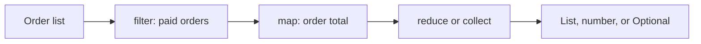
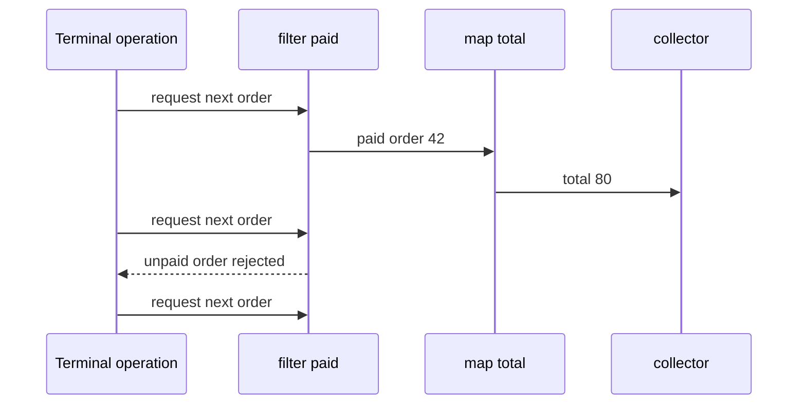
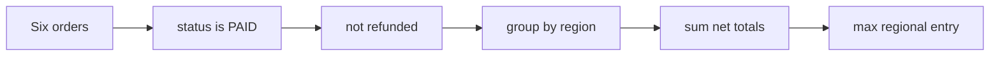
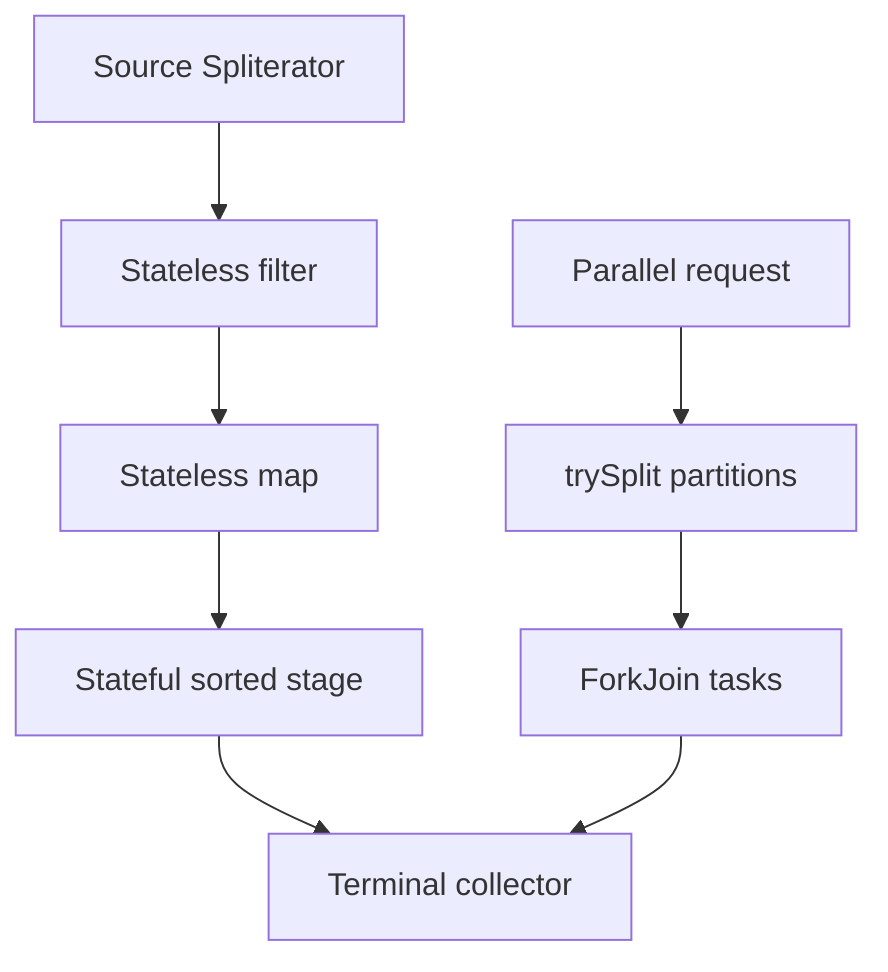

# Java Streams API, Lazy Pipelines, and Optional

The Streams API is Java's declarative way to describe a computation over values without making traversal mechanics the centre of the code. It sits above collections, arrays, files, and generated sequences; it is useful for transformations and aggregation, but it does not replace ordinary loops or concurrency design. Interviewers use Streams and `Optional` to test whether a candidate understands laziness, side effects, resource ownership, and the cost hidden behind concise code.

---

## 🟢 Beginner Level

### A stream is a pipeline, not a container

A `List<Order>` owns and stores order references; a `Stream<Order>` describes how to visit values from some source.

The stream normally does not copy every source value into another collection.

Instead, it links a source, zero or more intermediate operations, and one terminal operation.

That distinction matters because the source may be a collection, an array, a file, a cursor, or an infinite generator.

The source remains responsible for its own mutation rules.

The stream is responsible for traversal of that source.



The pipeline above has no useful result until a terminal operation asks for one.

`filter` and `map` return another stream description.

`toList`, `count`, `findFirst`, and `reduce` consume the description and return a result.

Calling a terminal operation is therefore the point where application work begins.

```java
List<String> names = List.of("Ada", "Grace", "Alan", "Linus");

List<String> longNames = names.stream()
    .filter(name -> name.length() >= 4)
    .map(String::toUpperCase)
    .toList();
```

The source list is still `"Ada", "Grace", "Alan", "Linus"` after this code runs.

`longNames` is a separate unmodifiable list in current JDK implementations of `Stream.toList()`.

That result choice is important when a later caller expects to append to it.

Use `collect(Collectors.toCollection(ArrayList::new))` if a mutable `ArrayList` is explicitly required.

### Stream operations, laziness, and parallelism

Intermediate operations return a stream and are lazy; terminal operations return something else and trigger traversal.

The following comparison is a practical mental model rather than an exhaustive API list.

| Operation kind | Examples | Return shape | When it runs | Typical purpose |
|---|---|---|---|---|
| Intermediate | `filter`, `map`, `flatMap`, `sorted`, `distinct` | Another `Stream<T>` | When a terminal operation pulls values | Describe transformation |
| Stateless intermediate | `filter`, `map`, `peek` | Another `Stream<T>` | One value at a time | Transform or test each value |
| Stateful intermediate | `sorted`, `distinct`, `limit` | Another `Stream<T>` | May retain values or ordering state | Global ordering or de-duplication |
| Short-circuiting terminal | `findFirst`, `anyMatch`, `noneMatch` | Value, boolean, or `Optional<T>` | May stop early | Ask whether enough evidence exists |
| Collecting terminal | `toList`, `collect`, `reduce`, `count` | Collection or summary | Usually drains the needed input | Build a final result |

This code creates a pipeline but does not execute its predicate.

```java
Stream<String> candidates = names.stream()
    .filter(name -> name.startsWith("A"));
```

The first call to `candidates.count()` starts evaluation.

The returned count then consumes this particular stream.

Attempting another terminal operation on the same instance is an error.

```java
long count = candidates.count();
// candidates.findFirst(); // IllegalStateException: stream has already been operated upon or closed
```

Create a new stream from the original reusable source when the program needs another traversal.

```java
long countAgain = names.stream()
    .filter(name -> name.startsWith("A"))
    .count();
```

### Vertical evaluation and short-circuiting

Streams commonly process values vertically: for each input value, the runtime applies as many stateless pipeline stages as possible before asking for the next value.

It does not normally build a complete temporary list after every `filter` or `map`.



Suppose the source is `[12, 5, 20]`.

For `.filter(n -> n > 10).map(n -> n * 2).toList()`, `12` becomes `24` before `5` is considered.

The value `5` fails the filter and never reaches the mapping lambda.

The value `20` becomes `40`.

The result is `[24, 40]`.

This behaviour is called vertical loop fusion.

It can reduce intermediate allocation and can improve locality.

It does not make every stream faster than an explicit loop.

`findFirst`, `anyMatch`, `allMatch`, `noneMatch`, `limit`, and `takeWhile` can stop traversal early.

```java
boolean hasFraudulentOrder = orders.stream()
    .anyMatch(order -> order.riskScore() >= 90);
```

If the first order has score `95`, the remaining orders need not be visited.

Do not assume `anyMatch` always examines every element when reasoning about a predicate with logging or side effects.

### Optional makes absence explicit

`Optional<T>` represents either one present reference or no reference.

It is particularly useful as the return type of a query whose absence is expected.

For example, a repository may find no active subscription for a customer.

```java
Optional<Subscription> findActiveByCustomerId(UUID customerId);
```

The caller must choose what absence means.

It may use a default, branch explicitly, or throw a domain-specific exception.

```java
String plan = repository.findActiveByCustomerId(customerId)
    .map(Subscription::planName)
    .orElse("FREE");
```

`Optional` is not a magic null eliminator.

It cannot prevent a mapper from returning `null` unexpectedly, an API from returning a null `Optional`, or a caller from using `get()` carelessly.

It makes the possibility of absence visible in the method signature and at the call site.

---

## 🟡 Intermediate Level

### Mapping, flattening, and collector choices

`map` transforms one input element into one output element.

`flatMap` transforms one input element into zero, one, or many output elements and then flattens those inner streams.

The latter is common for nested collections.

```java
List<List<String>> teams = List.of(
    List.of("Ada", "Grace"),
    List.of("Alan"),
    List.of("Ada", "Linus")
);

List<String> distinctPeople = teams.stream()
    .flatMap(List::stream)
    .distinct()
    .sorted()
    .toList();
```

The output is `"Ada", "Alan", "Grace", "Linus"` in sorted encounter order.

Without `flatMap`, the pipeline would still contain lists rather than people.

Without `distinct`, repeated input can remain repeated.

`distinct` relies on `equals` and `hashCode`, so a broken domain equality definition causes surprising results.

Collectors express common aggregation shapes.

```java
Map<OrderStatus, Long> counts = orders.stream()
    .filter(Order::isActive)
    .collect(Collectors.groupingBy(
        Order::status,
        Collectors.counting()
    ));
```

`groupingBy` creates a map from each key to a downstream accumulation.

`partitioningBy` is a specialised two-key grouping for a boolean predicate.

`joining` combines strings with a separator.

`summarizingInt` produces count, min, max, sum, and average in one pass.

Choose the simplest collector that states the required output shape.

### Worked example: calculate a revenue dashboard

Assume the service receives these six order records for one day.

| Id | Status | Region | Net total | Refund? |
|---|---|---|---:|---|
| 101 | `PAID` | EU | 120 | No |
| 102 | `PAID` | US | 80 | No |
| 103 | `CANCELLED` | EU | 60 | No |
| 104 | `PAID` | EU | 200 | Yes |
| 105 | `PAID` | US | 50 | No |
| 106 | `PENDING` | EU | 90 | No |

The dashboard definition is: include paid, non-refunded orders, group their net totals by region, and find the largest regional total.

The eligible rows are 101, 102, and 105.

Row 104 is paid but refunded, so it is not recognised revenue.

Rows 103 and 106 do not have `PAID` status.

EU contributes `120`.

US contributes `80 + 50 = 130`.

The largest regional total is therefore US with `130`.

```java
record Order(long id, OrderStatus status, String region, long netTotal, boolean refunded) {}

Map<String, Long> revenueByRegion = orders.stream()
    .filter(order -> order.status() == OrderStatus.PAID)
    .filter(order -> !order.refunded())
    .collect(Collectors.groupingBy(
        Order::region,
        Collectors.summingLong(Order::netTotal)
    ));

Optional<Map.Entry<String, Long>> leader = revenueByRegion.entrySet().stream()
    .max(Map.Entry.comparingByValue());
```

`revenueByRegion` is `{EU=120, US=130}`.

`leader` is present with the `US=130` entry in this input.

The terminal `max` returns `Optional` because an empty map has no largest entry.

The calculation performs $O(n)$ source traversal plus expected map insertion cost.

It allocates a grouping map because the required answer needs every regional subtotal.

If the only requirement were the total revenue, `mapToLong(Order::netTotal).sum()` would avoid the map entirely.



This is clearer than a loop when the domain operations mirror the business rule.

It becomes less clear when lambdas carry mutable state, checked exceptions, or several unrelated branches.

### Primitive streams and avoiding accidental boxing

`Stream<Integer>` stores boxed `Integer` references.

Each conversion between `int` and `Integer` adds indirection and can add allocation pressure.

`IntStream`, `LongStream`, and `DoubleStream` supply primitive-specialised operations.

```java
long total = orders.stream()
    .filter(order -> order.status() == OrderStatus.PAID)
    .mapToLong(Order::netTotal)
    .sum();
```

The `mapToLong` stage changes the pipeline from `Stream<Order>` to `LongStream`.

`sum`, `average`, and `summaryStatistics` then avoid repeatedly boxing numeric values.

This is valuable in a hot, numeric pipeline.

It is rarely worth complicating ordinary application code before a measurement identifies allocation or CPU pressure.

An empty `IntStream.average()` returns `OptionalDouble` because there is no mathematically meaningful average.

An empty `IntStream.sum()` returns `0` because zero is the additive identity.

Know which semantic is appropriate before treating an empty result as ordinary data.

### Optional, date-time, and modern collection APIs

`Optional.of(value)` asserts that `value` is non-null.

It throws `NullPointerException` immediately if that assertion is false.

`Optional.ofNullable(value)` accepts a reference or null, while `Optional.empty()` states absence explicitly.

The Date/Time API uses immutable `Instant`, `LocalDate`, `ZonedDateTime`, and `Duration` values; choose a type that preserves the timezone semantics the domain actually needs.

A Java 21 sequenced collection exposes encounter-order operations such as `getFirst`, `getLast`, and `reversed`; `SequencedSet` and `SequencedMap` extend the same first-to-last model without turning unordered implementations into ordered ones.

`map` transforms a present value and leaves an absent value absent.

`flatMap` is for a mapper that already returns an `Optional`.

```java
Optional<String> country = Optional.ofNullable(user)
    .map(User::address)
    .flatMap(Address::countryCode)
    .filter(code -> code.length() == 2);
```

If `countryCode` returns `Optional<String>`, `flatMap` avoids `Optional<Optional<String>>`.

Use `orElse` for a cheap value that is safe to calculate eagerly.

Use `orElseGet` for a fallback that is expensive, has I/O, or allocates meaningful state.

```java
String label = cachedLabel
    .orElseGet(() -> fetchLabelFromRemoteService(customerId));
```

The supplier is invoked only when `cachedLabel` is empty.

By contrast, the argument to `orElse(fetchLabelFromRemoteService(customerId))` is evaluated before `orElse` runs.

That difference can create a needless remote request even when the optional is present.

`orElseThrow` makes absence a deliberate boundary failure.

```java
Order order = repository.findById(orderId)
    .orElseThrow(() -> new OrderNotFoundException(orderId));
```

The exception belongs at a boundary where absence really violates an invariant.

Do not turn every ordinary optional branch into an exception merely to avoid writing an `if`.

---

## 🔴 Expert Level

### Pipeline internals, spliterators, and stateful stages

The JDK represents a pipeline as linked stages rather than as a chain of eagerly materialised collections.

At terminal evaluation, the implementation builds a traversal strategy around the source `Spliterator`.

A `Spliterator` can traverse elements and, when supported, split a source into subranges for parallel work.

Its characteristics communicate useful facts such as `ORDERED`, `SIZED`, `SORTED`, `DISTINCT`, `IMMUTABLE`, and `CONCURRENT`.

These characteristics can let the runtime optimise a pipeline or enforce a semantic constraint.

Stateless operations such as `filter` and `map` can usually pass one item downstream at a time.

Stateful operations need more context.

`sorted` ordinarily needs to see all relevant values before emitting the first globally sorted output.

`distinct` commonly holds a set of previously observed values.

`limit` can stop a sequential pipeline early, but an ordered parallel pipeline may coordinate substantial work to preserve the first `n` elements.



Order is a semantic cost, not a decorative property.

`findFirst` preserves encounter order and may have to wait for earlier partitions in parallel execution.

`findAny` may return any matching value and gives the implementation more freedom.

Calling `.unordered()` can improve some parallel reductions only when the business result does not depend on order.

Never discard ordering simply because a benchmark gets faster.

### Parallel streams are a constrained tool

`parallelStream()` asks the pipeline to use parallel execution where the source and operations permit it.

For most application calls, it uses the process-wide `ForkJoinPool.commonPool()`.

That pool is also used by other APIs, including some `CompletableFuture` operations that do not receive an explicit executor.

Parallelism is helpful only when there is enough independent CPU-bound work to amortise splitting, scheduling, merging, and coordination.

It is usually a poor fit for JDBC, HTTP, file waiting, locks, or other blocking I/O.

Blocking workers in the common pool can delay unrelated work elsewhere in the JVM.

It is also dangerous when pipeline lambdas mutate shared state.

```java
List<String> names = new ArrayList<>();
orders.parallelStream().forEach(order -> names.add(order.customerName()));
```

`ArrayList` is not safe for concurrent `add` operations.

The code can lose updates, corrupt internal state, or fail unpredictably.

Use a collector designed for the result shape rather than shared mutation.

```java
List<String> names = orders.parallelStream()
    .map(Order::customerName)
    .toList();
```

For a concurrent grouping, verify both the collector and downstream accumulator are suitable.

`groupingByConcurrent` can reduce merge work, but it does not make arbitrary downstream operations safe.

Benchmark with production-shaped data and measure tail latency, not only average throughput.

### Resource streams, closing, and failure boundaries

Most collection-backed streams have no external resource to close.

Streams returned by APIs such as `Files.lines(Path)` may own an open file descriptor.

They must be closed even if a terminal operation throws.

```java
try (Stream<String> lines = Files.lines(path)) {
    long errors = lines.filter(line -> line.startsWith("ERROR")).count();
    audit.record(errors);
}
```

Try-with-resources closes `lines` during both normal and exceptional completion.

An `onClose` handler can attach cleanup to a composed stream, but it is not a substitute for clear ownership.

Calling `close()` does not make a reusable pipeline reusable.

It invalidates the stream and runs close handlers.

Lambdas used in stream stages cannot throw checked exceptions without wrapping or adapting them.

That limitation is often a design signal.

Move I/O to a clear boundary, return a result object, or use a loop when exception handling needs local context.

Avoid helper methods that convert every checked exception into a generic `RuntimeException` and erase useful failure information.

### Production failure modes and observability

The shortest pipeline is not necessarily the safest production implementation.

`peek` is intended mainly for debugging and inspection.

Putting business side effects in `peek` makes correctness depend on evaluation order and whether a short-circuit terminal operation reaches an element.

Mutating the source collection while its stream is traversing can produce `ConcurrentModificationException` or undefined application-level behaviour.

Concurrent collections have different traversal guarantees, but weak consistency is still not a transactional snapshot.

Avoid `Optional.get()` unless an invariant immediately proves the value is present in the same scope.

Prefer `orElseThrow` with a meaningful exception at boundaries, or an explicit branch where absence is normal.

Avoid `Optional` fields in entities and request DTOs.

They complicate serialisation and make nullability conventions harder for frameworks that already represent an absent property as null.

Use `Optional` chiefly for return values where callers benefit from forced acknowledgement of absence.

For observability, measure operation timing around a meaningful unit of work, not inside every lambda.

Per-element logging can destroy the performance properties that made a stream attractive.

Capture input size, result size, error category, and duration at the service boundary instead.

### Common Misconceptions

1. **"Calling `filter` immediately loops through the source."**
   *Correction*: Intermediate operations normally only construct pipeline stages. A terminal operation pulls values, and a short-circuit terminal operation may stop before the whole source has been visited.

2. **"A stream always makes code faster than a loop."**
   *Correction*: Streams can avoid intermediate collections through fusion, but lambdas, boxing, stateful operations, and indirection can cost more than a simple indexed loop. Choose the form that makes the required semantics clearest, then measure hot code.

3. **"`parallelStream()` is a free way to use all CPU cores."**
   *Correction*: It uses shared execution resources and introduces splitting and merge overhead. Blocking I/O, small inputs, ordered stateful operations, and shared mutable state can make it slower or unsafe.

4. **"`Optional` means null can no longer cause failures."**
   *Correction*: An optional can be null if an API violates its contract, and `get()` still throws when empty. The type improves communication about expected absence; it does not validate every value or replace domain policy.

5. **"`orElse` and `orElseGet` are stylistic synonyms."**
   *Correction*: Java evaluates method arguments before the call, so `orElse(expensive())` runs `expensive()` even for a present optional. `orElseGet(() -> expensive())` defers that work until the optional is empty.

### Interview Questions

**Q1. What is the difference between a Java collection and a stream?** `[easy]`

A collection stores elements and can usually be traversed repeatedly, whereas a stream is a one-use computation pipeline over a source. Intermediate stream operations describe transformations and a terminal operation initiates evaluation. The trade-off is that streams express data flow compactly but do not provide random access, mutation APIs, or automatic reuse.

**Q2. Why do intermediate stream operations usually not execute immediately?** `[easy]`

Laziness lets the runtime combine adjacent stages and pull a value through the pipeline only when a terminal result needs it. It also enables short-circuit terminals such as `anyMatch` to stop once they have enough information. The trade-off is that side effects in intermediate lambdas occur later than their textual position may suggest.

**Q3. What happens when a stream is consumed twice?** `[easy]`

A stream pipeline is intended for a single terminal traversal and normally throws `IllegalStateException` if it is used again. The runtime may have already released traversal state or completed a one-pass source, so reuse has no reliable meaning. Create a new stream from a reusable source or create a supplier of fresh streams when multiple traversals are needed.

**Q4. When should a method return `Optional<T>`?** `[easy]`

Return `Optional<T>` when no result is an expected, meaningful outcome that every caller should acknowledge. It is especially useful for lookup-style APIs such as finding an entity by a unique key. Avoid using it for fields and parameters because framework integration and ordinary property absence are usually clearer with established nullability conventions.

**Q5. Explain vertical loop fusion in a stream pipeline.** `[medium]`

Vertical loop fusion means one source element generally passes through `filter`, `map`, and later stateless stages before the next element is requested. This avoids materialising a temporary collection after each stage and lets rejected elements stop early. Stateful stages such as `sorted` can break that simple one-at-a-time picture because they need broader input context.

**Q6. What is the difference between `map` and `flatMap`?** `[medium]`

`map` produces one mapped output per input, so mapping a list to a stream creates a stream of lists. `flatMap` accepts a function that produces a stream and then concatenates those produced streams into one output stream. Use it for nested collections or optional-returning operations, but keep the flattening boundary obvious so a complex pipeline remains readable.

**Q7. Why can `orElse` be unexpectedly expensive compared with `orElseGet`?** `[medium]`

Java evaluates the argument supplied to `orElse` before invoking the method, even when the optional already holds a value. `orElseGet` receives a supplier and invokes it only for an empty optional. Use the lazy form for remote calls, database lookups, or non-trivial object creation, while a constant fallback is fine with `orElse`.

**Q8. How do primitive streams help a numeric pipeline?** `[medium]`

`IntStream`, `LongStream`, and `DoubleStream` provide primitive-specialised operations such as `sum`, `average`, and `summaryStatistics`. They avoid repeatedly boxing primitive values into wrapper objects during the pipeline. The trade-off is conversion between object and primitive stream forms, so use them where numeric work or allocation volume makes that benefit meaningful.

**Q9. Why is `peek` a poor place for business side effects?** `[medium]`

`peek` is primarily an inspection operation and its execution depends on the terminal operation actually pulling each element. Short-circuiting, exceptions, and parallel execution can make the timing and ordering of side effects unsuitable for business logic. Put required writes in an explicit loop or a clearly named terminal action with well-defined error handling.

**Q10. What makes `sorted` more expensive than `map` in a large stream?** `[medium]`

`map` is stateless and can transform one item as soon as it is pulled from the source. A global `sorted` stage generally must retain and compare all relevant values before it can emit the first correctly ordered result. That creates memory, comparison, and parallel coordination costs, so sort only where the consumer truly needs a global order.

**Q11. How does `parallelStream()` execute, and why is blocking I/O risky there?** `[hard]`

Parallel streams split suitable sources through their `Spliterator` and commonly run tasks in the shared `ForkJoinPool.commonPool()`. A blocking database or HTTP call ties up scarce common-pool workers while they wait, which can delay unrelated tasks in the same JVM. Use an explicitly sized executor or asynchronous I/O design when concurrency and blocking must be controlled as an operational resource.

**Q12. Scenario: a service replaces a loop with `parallelStream().forEach(list::add)` and intermittently returns fewer items. What do you check and change?** `[hard]`

The first suspicion is unsafe shared mutation because `ArrayList.add` is not safe when multiple parallel workers update it concurrently. Replace the side-effecting `forEach` with `map(...).toList()` or with a collector whose accumulation and combination rules match the needed result. Then benchmark the full service because ordering, input size, and common-pool contention may still make sequential execution the better choice.

**Q13. Scenario: a report reads a multi-gigabyte log using `Files.lines` and eventually fails with too many open files. What is the fix?** `[hard]`

`Files.lines` can keep an operating-system file descriptor open for the lifetime of the returned stream, unlike a collection-backed stream. Put the stream in a try-with-resources block so it closes on normal completion and on exceptions. Also keep the pipeline streaming rather than collecting every line unless the report truly needs all lines resident in memory.

**Q14. Why does `findFirst` return an `Optional`, and how does ordered parallelism affect it?** `[hard]`

`findFirst` returns `Optional` because a stream may be empty and therefore may have no first element. On an ordered parallel stream, preserving the earliest encounter-order match can require coordination with partitions that conceptually precede a quickly found later match. If any match is acceptable, `findAny` can give the implementation more freedom, but changing it must preserve the business semantics.

### Further Reading

- [Java Stream API documentation](https://docs.oracle.com/en/java/javase/17/docs/api/java.base/java/util/stream/Stream.html) explains pipeline operation contracts and single-use behaviour.
- [Java Optional API documentation](https://docs.oracle.com/en/java/javase/17/docs/api/java.base/java/util/Optional.html) documents absence, mapping, and fallback operations.
- [Java Date/Time API documentation](https://docs.oracle.com/en/java/javase/21/docs/api/java.base/java/time/package-summary.html) explains immutable date, time, duration, and timezone types.
- [Java SequencedCollection API documentation](https://docs.oracle.com/en/java/javase/21/docs/api/java.base/java/util/SequencedCollection.html) defines first-to-last collection operations introduced in Java 21.
