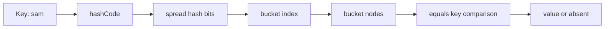
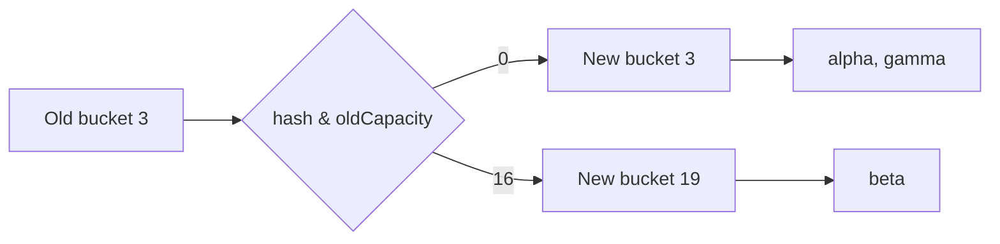
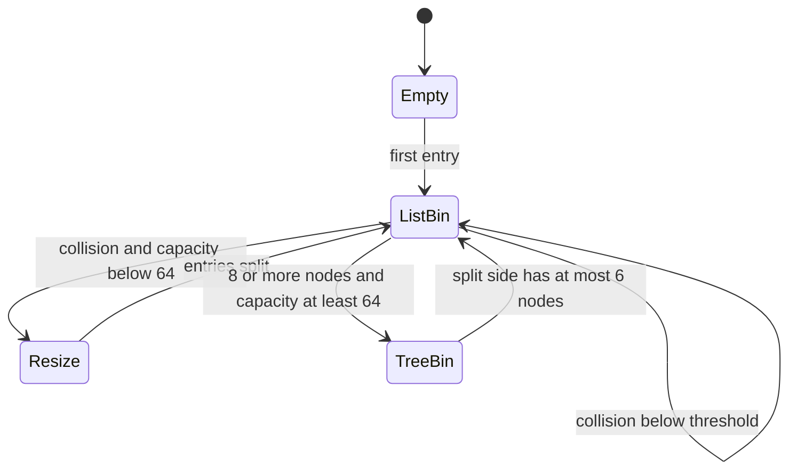

# HashMap Bucket Internals, Treeification & ConcurrentHashMap

`HashMap` is Java's general-purpose in-memory key-value table, used everywhere from request attributes to caches and configuration registries.
Its average constant-time lookup relies on a careful combination of key contracts, bit operations, collision handling, and resizing rather than on a magical no-collision guarantee.
Interviewers ask about it because the same details explain surprising missing keys, latency spikes, and why concurrent code needs a different map implementation.

---

## 🟢 Beginner Level

### A map finds a value by its key

A map stores pairs such as a user ID and its profile.
`put(key, value)` records a pair.
`get(key)` uses the key to find the matching value.
`remove(key)` discards the matching pair.

```java
Map<String, Integer> attempts = new HashMap<>();
attempts.put("sam", 3);
attempts.put("lee", 1);
int samAttempts = attempts.get("sam");
```

Unlike a list, a map does not search entries from index zero on every successful lookup.
It asks the key for a hash code.
It maps that number into an internal bucket array.
It then compares only entries that landed in that bucket.



The hash narrows the search.
`equals` establishes whether two keys mean the same thing.
Both operations matter to a correct lookup.

### Buckets hold entries with the same index

Internally, a `HashMap` has an array whose slots are called buckets.
Each non-empty bucket begins with a node containing a hash, key, value, and next-node reference.
Two distinct keys may compute different full hashes but still map to the same array index.
That event is a collision.

```java
record UserId(long value) { }

Map<UserId, String> users = new HashMap<>();
users.put(new UserId(101), "Ada");
users.put(new UserId(102), "Lin");
```

The map never treats matching bucket indexes as proof that keys are equal.
It compares the stored hash first as a quick filter.
It then checks reference equality or `equals` before replacing or returning a value.
This is why collisions affect speed but should not normally affect correctness.

### equals and hashCode are a collection contract

Keys obey an important contract.
When `a.equals(b)` is true, `a.hashCode()` must equal `b.hashCode()`.
The reverse is not required, because collisions are allowed.

```java
final class AccountKey {
    private final long id;

    AccountKey(long id) { this.id = id; }

    @Override
    public boolean equals(Object other) {
        return other instanceof AccountKey key && id == key.id;
    }

    @Override
    public int hashCode() {
        return Long.hashCode(id);
    }
}
```

Overriding `equals` without `hashCode` breaks this contract.
Two logically equal keys may enter different buckets.
The lookup never reaches the equal stored key and returns `null`.
Use immutable fields in keys whenever possible.

| Key choice | Lookup behaviour | Typical risk |
|---|---|---|
| `String` | stable value equality | low |
| Java record with immutable components | generated value equality | mutable component hazard |
| mutable custom object | hash may change after insertion | entry becomes unreachable |
| identity-only object | default reference equality | equal-looking keys do not match |

### Null has a special but ordinary place

`HashMap` permits one `null` key.
It also permits many `null` values.
The null key uses hash zero and is stored in the bucket selected for zero.

```java
Map<String, String> headers = new HashMap<>();
headers.put(null, "default profile");
headers.put("X-Trace", null);

boolean present = headers.containsKey("X-Trace");
String value = headers.get("X-Trace");
```

Here `get` returns `null` for both an absent key and a present key with a null value.
Use `containsKey` when that distinction matters.
`ConcurrentHashMap` deliberately rejects null keys and values because null would make concurrent absence ambiguous.

---

## 🟡 Intermediate Level

### Hash spreading and power-of-two indexing

Modern `HashMap` computes a spread hash approximately as `h ^ (h >>> 16)`.
The shift folds high-order information into lower bits.
That matters because the index uses low bits.

```java
static final int hash(Object key) {
    int h;
    return key == null ? 0 : (h = key.hashCode()) ^ (h >>> 16);
}
```

The table capacity is a power of two.
For capacity `n`, the index is `(n - 1) & hash`.
This is equivalent to non-negative modulo `n` but avoids integer division.
It also lets a resize split a bucket using one newly relevant bit.

For a table of capacity $16$, the mask is $15$, or binary `0000 1111`.
Suppose a spread hash ends in binary `1011 0110`.
The index is `1011 0110 & 0000 1111 = 0110`, which is bucket $6$.
At capacity $32$, bit $16$ determines whether that same entry remains at $6$ or moves to $22$.

### Load factor trades memory for collision cost

The default initial capacity is $16$.
The default load factor is $0.75$.
The resize threshold is capacity times load factor.

```java
Map<String, Integer> counts = new HashMap<>();
```

With default settings, the first allocated table normally has capacity $16$.
Its threshold is $16 \times 0.75 = 12$ entries.
Inserting the thirteenth distinct entry triggers growth toward capacity $32$.
The new threshold becomes $32 \times 0.75 = 24$.

| Load factor | Memory usage | Collision likelihood | Good fit |
|---|---|---|---|
| `0.50` | higher | lower | read-heavy low-latency table |
| `0.75` | balanced | low for good hashes | JDK default |
| `0.90` | lower | higher | memory-sensitive use with good distribution |
| `1.00+` | lowest | higher and less predictable | specialised cases |

Do not choose a high load factor merely to avoid resizing.
Longer buckets make lookup and insertion more expensive.
For a known entry count, size the map to avoid repeated growth while leaving a reasonable load factor.

### Worked example: one resize without recomputing hashes

Assume a map has capacity $16$ and threshold $12$.
It already holds twelve distinct entries.
The next `put` triggers a resize to capacity $32$.

Take three entries that were all in old bucket $3$.
Their old index depends on the low four hash bits being `0011`.
During the resize, the old-capacity bit, bit $16$, decides each new position.

| Entry | spread hash low five bits | old index at 16 | old-capacity bit | new index at 32 |
|---|---|---:|---:|---:|
| `alpha` | `00011` | 3 | 0 | 3 |
| `beta` | `10011` | 3 | 1 | 19 |
| `gamma` | `00011` | 3 | 0 | 3 |

`alpha` and `gamma` remain at index $3$.
`beta` moves to $3 + 16 = 19$.
No full modulus calculation or `hashCode` recomputation is needed.
The old chain is split into a low list and a high list, preserving relative order in modern implementations.



This efficient split is one reason capacity must remain a power of two.
It is also why resizing is still expensive: every existing bucket must be visited even though hashes are reused.
Pre-sizing a large predictable map reduces resize pauses and garbage pressure.

### Buckets, collisions, resizing, and treeification

Initially, a collision chain is linked nodes.
Searching a chain of $k$ entries is $O(k)$.
Java 8 introduced tree bins to prevent an attacker or poor key distribution from making a single bucket pathologically slow.

Treeification is considered when a bucket reaches at least eight nodes.
The table must also have capacity at least $64$.
If it is smaller, the map prefers a resize because a bigger table may disperse the collision.

After conversion, the bucket uses red-black tree nodes.
Search is approximately $O(\log k)$ rather than $O(k)$.
During resize, a tree bin may revert to a list when a split side has at most six nodes.

| Constant | Value | Reason |
|---|---:|---|
| initial capacity | 16 | useful default allocation |
| default load factor | 0.75 | balance between memory and chains |
| treeify threshold | 8 | avoid tree overhead for small chains |
| untreeify threshold | 6 | avoid flip-flopping near threshold |
| minimum treeify capacity | 64 | resize before treeing a small table |

Treeification is a defensive worst-case measure.
It does not make consistently colliding keys a good design.
Good `hashCode` implementations and bounded key domains remain the first solution.

### `get`, `put`, and replacement follow a precise path

`get` computes the spread hash and bucket index.
It checks the bucket head first.
It walks a list or searches a tree only after a collision.

`put` follows the same lookup path.
If it finds an equal key, it replaces that node's value and returns the old value.
If no equal key exists, it adds a new node, increments size, and may resize or treeify.

```java
Map<AccountKey, Integer> balances = new HashMap<>();
balances.put(new AccountKey(7), 100);
Integer previous = balances.put(new AccountKey(7), 125);
// previous is 100 and map size is still 1
```

Map size counts distinct keys, not successful `put` calls.
Value replacement does not normally change the structural modification count.
That distinction explains iterator fail-fast behaviour later in the lesson.

### Choosing HashMap, LinkedHashMap, or TreeMap

These three maps implement `Map` but make different ordering and performance promises.
`HashMap` has no contractual iteration order and provides expected $O(1)$ lookup with well-distributed keys.
`LinkedHashMap` adds a doubly linked encounter-order chain across entries while retaining hash-based lookup.
`TreeMap` stores entries in a red-black tree ordered by natural ordering or a supplied `Comparator`.

| Implementation | Ordering contract | Typical lookup | Distinctive use |
|---|---|---:|---|
| `HashMap` | no guaranteed order | expected $O(1)$ | general key-value lookup |
| `LinkedHashMap` | insertion order or access order | expected $O(1)$ | predictable iteration or simple LRU policy |
| `TreeMap` | sorted by key comparator | $O(\log n)$ | range queries, nearest keys, sorted traversal |

An access-ordered `LinkedHashMap` moves an entry toward the end when it is accessed.
Overriding `removeEldestEntry` can build a small, synchronised LRU-style map, although production caches usually need stronger expiry, concurrency, and admission policies.

`TreeMap` uses comparison rather than hash buckets.
Its comparator should be consistent with `equals`; otherwise two keys that compare as zero can replace one another even when `equals` returns false.
Mutable fields used by either hashing or ordering are unsafe because changing them breaks the collection's placement invariant.

Neither `HashMap`, `LinkedHashMap`, nor `TreeMap` supports unsynchronised concurrent mutation.
Choose `ConcurrentHashMap` for concurrent key-based access or `ConcurrentSkipListMap` when concurrent sorted navigation is required.

---

## 🔴 Expert Level

### Structural changes and fail-fast iteration

`HashMap` tracks structural changes using an internal modification count.
Iterators capture its expected value when they are created.
On a later traversal step, an unexpected mismatch usually produces `ConcurrentModificationException`.

```java
Map<String, Integer> map = new HashMap<>();
map.put("a", 1);
map.put("b", 2);

for (String key : map.keySet()) {
    map.put("c", 3); // structural mutation during iteration
}
```

This is a bug detector, not a concurrency guarantee.
Fail-fast is explicitly best effort because unsynchronised threads can race before a check is observed.
Replacing the value of an existing key is generally not structural, so it usually does not trip the iterator.
Use the iterator's own `remove`, collect changes first, or choose a concurrent collection for concurrent mutation.

### Mutable keys make entries effectively disappear

An entry's bucket location is chosen from the key hash at insertion time.
Changing a field used by `equals` or `hashCode` changes the logical lookup hash but does not move the entry.
The map then searches the new bucket and cannot find the node in its old bucket.

```java
final class RequestKey {
    String tenant;

    RequestKey(String tenant) { this.tenant = tenant; }

    @Override public int hashCode() { return tenant.hashCode(); }
    @Override public boolean equals(Object o) {
        return o instanceof RequestKey k && tenant.equals(k.tenant);
    }
}

RequestKey key = new RequestKey("blue");
Map<RequestKey, String> cache = new HashMap<>();
cache.put(key, "result");
key.tenant = "green";
// cache.get(key) may now return null
```

The entry still occupies the map and may appear while iterating.
It is merely unreachable through the mutated key's new hash path.
Use immutable keys such as strings, records composed of immutable values, or defensive copies.

### Hash flooding is a security and latency concern

An attacker who can choose request keys may intentionally create many collisions.
Before tree bins, a single operation could degrade toward linear time in the number of colliding keys.
Treeification bounds lookup cost after the bucket crosses thresholds, but it is not a full denial-of-service solution.



Application-level limits remain important.
Bound untrusted form fields and JSON object sizes.
Avoid using adversary-controlled composite keys in long-lived maps without rate limits or validation.
Measure collision-heavy workloads instead of assuming a tree bin removes all overhead.

### `HashMap` is not safe for concurrent mutation

Concurrent reads of a map that is no longer being mutated are normally fine after safe publication.
Concurrent writes, or reads racing with writes, are not supported by `HashMap`.
They can lose updates, expose stale observations, or see an inconsistent structure.

```java
Map<String, Long> counters = new HashMap<>();
// Two threads executing this concurrently can both read 0 and write 1.
counters.put("requests", counters.getOrDefault("requests", 0L) + 1);
```

Synchronising externally around every related operation is valid for a small, tightly controlled map.
For independently concurrent operations, use `ConcurrentHashMap`.
For a single counter, use `LongAdder` or `computeIfAbsent` plus a concurrent counter rather than a read-modify-write sequence.

### ConcurrentHashMap and concurrent map design

Java 8 and later `ConcurrentHashMap` uses a shared table rather than the older segmented layout.
It uses compare-and-set when installing a node into an empty bucket.
It synchronises on a bucket's first node when updating a contended non-empty bucket.
Different buckets can therefore progress independently.

```java
ConcurrentMap<String, LongAdder> counts = new ConcurrentHashMap<>();
counts.computeIfAbsent("/orders", ignored -> new LongAdder()).increment();
```

Its `compute`, `computeIfAbsent`, and `merge` methods make one key's update atomic relative to other map operations.
The mapping function should be short and should not recursively update the same map.
`ConcurrentHashMap` rejects null keys and values so a null result never confuses absence with a stored null.

| Property | `HashMap` | `ConcurrentHashMap` |
|---|---|---|
| concurrent structural mutation | unsafe | supported |
| null key or value | allowed | rejected |
| iterator behaviour | fail-fast best effort | weakly consistent |
| whole-map atomic snapshot | no | no |
| typical update coordination | caller responsibility | CAS and per-bin coordination |

Weakly consistent iteration may see some concurrent changes but never throws `ConcurrentModificationException` merely because of them.
It is not a transactional snapshot.
If an operation requires a consistent view across several keys, coordinate at a higher level with a lock, immutable snapshot, or transaction-like design.

### Common Misconceptions

1. **“A good hash function means collisions never occur.”** A finite bucket array guarantees some different hashes share indexes. A good hash distributes typical keys so those collisions remain short and statistically rare.
2. **“HashMap lookup is always $O(1)$.”** It is expected $O(1)$ for well-distributed hashes at a controlled load factor. A collision chain is linear, and tree bins reduce sufficiently large bins toward $O(\log k)$.
3. **“Treeification happens as soon as eight keys share a bucket.”** The table must also be at least capacity $64$. Smaller maps resize first because the collision may separate naturally.
4. **“Fail-fast iteration makes HashMap thread-safe.”** It only detects many accidental structural modifications. It does not establish memory visibility, atomicity, or a reliable cross-thread failure signal.
5. **“ConcurrentHashMap makes compound business operations atomic.”** It atomically coordinates individual map operations and its compute-family methods per key. A multi-key invariant still needs explicit higher-level coordination.

### Interview Questions

**Q1. How does `HashMap.get` find a value?** `[easy]`

It spreads the key hash, masks it into the current table capacity, and selects one bucket. It checks candidate nodes in that bucket using stored hash and key equality until it finds the matching key. With a good distribution this examines very few nodes, but collisions add work.

**Q2. Why must equal keys have equal hash codes?** `[easy]`

The map chooses a bucket from the hash before it calls `equals`. If equal keys produced different hashes, a lookup could search a different bucket and never compare the keys. Different keys may share one hash, so equality remains necessary after the bucket choice.

**Q3. Why is HashMap capacity a power of two?** `[easy]`

A power-of-two capacity lets the map compute an index with `(n - 1) & hash` rather than division. It also lets resize split an old bucket by testing one new bit of the existing hash. This is fast, but low-bit-only indexing is why the implementation spreads high hash bits down first.

**Q4. What is the difference between an absent key and a key mapped to null?** `[easy]`

`HashMap.get` returns null in both cases because HashMap permits null values. Use `containsKey` when the application must distinguish absence from a stored null. ConcurrentHashMap avoids the ambiguity by rejecting null keys and values.

**Q5. When does HashMap resize with default settings?** `[medium]`

The usual first table capacity is 16 and the default load factor is 0.75, creating a threshold of 12 entries. Adding a thirteenth distinct entry triggers a resize toward capacity 32 and a new threshold of 24. Replacing an existing value does not increase size and therefore does not trigger this threshold.

**Q6. What causes treeification and why is there a capacity check?** `[medium]`

A collision bin is eligible when it reaches eight nodes, but the table must also be at least 64 slots. In a smaller table, resizing is usually cheaper than building tree nodes and can distribute the colliding entries across new buckets. A tree bin reduces lookup within a pathological bin but adds memory and comparison overhead.

**Q7. How does resize avoid recalculating every hash?** `[medium]`

When capacity doubles, each entry either stays at its old index or moves to old index plus old capacity. The decision is the bit corresponding to the old capacity in the existing spread hash. The map still visits buckets and relinks nodes, so pre-sizing remains useful for large predictable loads.

**Q8. Why should HashMap keys be immutable?** `[medium]`

The map stores a node in the bucket selected by the key's insertion-time hash. Changing fields used by `hashCode` or `equals` changes later lookup behaviour without relocating that node. The entry can remain in memory yet become unreachable through normal `get` or `remove` calls.

**Q9. Is `ConcurrentModificationException` a concurrency control mechanism?** `[medium]`

No, it is a best-effort detector for many unexpected structural changes while an iterator is in use. Racy threads may miss the check, and it provides no memory visibility or atomicity. Use synchronisation or a concurrent collection when code actually shares mutation across threads.

**Q10. What does `ConcurrentHashMap.computeIfAbsent` provide?** `[medium]`

It atomically creates or obtains the value for one key relative to other map operations, avoiding a separate check-then-put race. The mapping function should be short, side-effect controlled, and should not recursively update the same map. It does not make a larger multi-key workflow atomic.

**Q11. A service reports intermittent missing cache entries after a key object is reused. What do you inspect first?** `[hard]`

Check whether any field participating in `equals` or `hashCode` changes after the key is inserted. A mutable key can leave its node in the old bucket while later lookup searches a new bucket. Replace it with an immutable value key or snapshot the fields before insertion, then remove stranded entries during remediation.

**Q12. An endpoint accepts arbitrary JSON keys and shows long map-operation latency. How do you investigate?** `[hard]`

Measure bucket distribution, request size, key construction, and CPU profiles to determine whether adversarial or accidental collisions are concentrating work. Confirm that hash functions use stable, well-distributed immutable fields and bound untrusted object sizes before insertion. Treeification limits a large-bin worst case but does not replace input limits, rate controls, or a suitable cache policy.

**Q13. Two request threads increment a HashMap counter and the result is lower than expected. Why and how do you fix it?** `[hard]`

The read-modify-write sequence is not atomic, so both threads can read the same old value and overwrite each other with the same next value. Use `ConcurrentHashMap` with `compute` or store a `LongAdder` obtained through `computeIfAbsent`. If the counter update is tied to other shared state, protect the full invariant with appropriate higher-level coordination.

**Q14. Why is `ConcurrentHashMap` iteration not a consistent snapshot?** `[hard]`

Its iterators are weakly consistent so they can continue while other threads update the map without fail-fast exceptions. They may observe some changes and omit others, depending on timing, while avoiding structurally corrupt traversal. For a coherent report, copy under the required coordination or publish an immutable snapshot.

### Further Reading

- [OpenJDK `HashMap` source](https://github.com/openjdk/jdk/blob/jdk-17%2B35/src/java.base/share/classes/java/util/HashMap.java) documents spreading, thresholds, tree bins, and resize splitting.
- [OpenJDK `ConcurrentHashMap` source](https://github.com/openjdk/jdk/blob/jdk-17%2B35/src/java.base/share/classes/java/util/concurrent/ConcurrentHashMap.java) documents its concurrent table operations and null policy.
- [Java `Map` interface API](https://docs.oracle.com/en/java/javase/17/docs/api/java.base/java/util/Map.html) defines the key equality contract and optional operations.
- [Java `Object.hashCode` API](https://docs.oracle.com/en/java/javase/17/docs/api/java.base/java/lang/Object.html#hashCode()) defines the equality and hash-code invariant.
