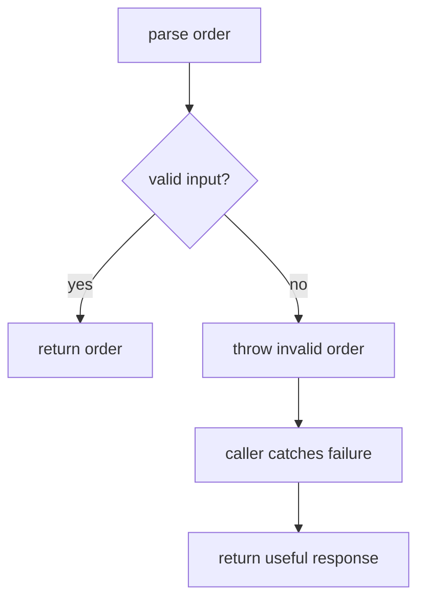
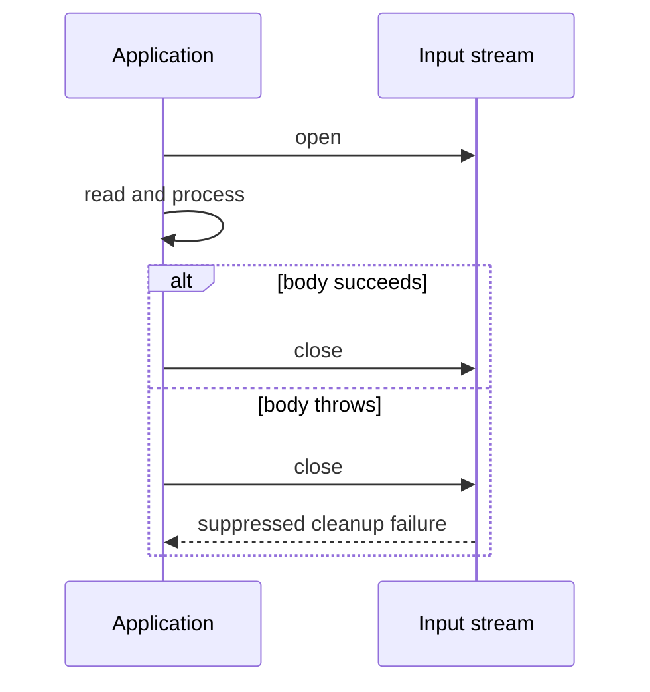
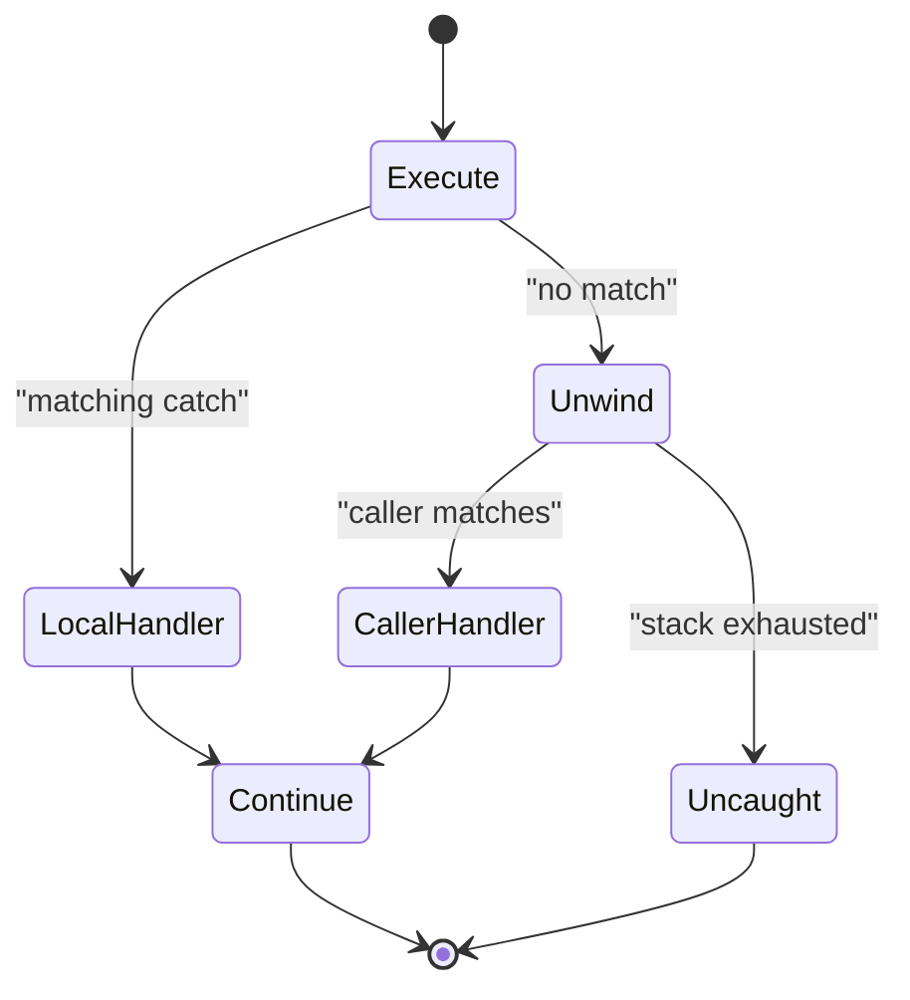

# Java Reflection, Annotations, and Exception Handling

Exceptions give Java a structured route from code that discovers a failure to code that can make a recovery decision.
Reflection and annotations let frameworks inspect classes and attach behavior at runtime.
This topic matters because good API boundaries preserve failures, while framework boundaries must translate them without hiding the cause.

---

## 🟢 Beginner Level

### Failure is a control path

A normal method returns a value to its caller.

An exceptional path begins when the method cannot fulfil its contract.

Java looks for a compatible `catch` block in the current method.

If none exists, it searches callers outward.

That search is called stack unwinding.

`Throwable` is the root of the hierarchy.

`Exception` represents application-level failures.

`Error` represents severe JVM or environment failures.



An exception is not automatically a programming bug.

A missing user-selected file can be expected and recoverable.

A null dereference usually indicates a failed programmer precondition.

The distinction is about recovery, not emotional severity.

### Exception hierarchy and checked exceptions

Checked exceptions extend `Exception` but not `RuntimeException`.

The compiler requires a method to catch or declare them.

`IOException` is checked because a caller may retry, select another file, or report the problem.

Unchecked exceptions are `RuntimeException` and subclasses.

The compiler does not require declarations for `IllegalArgumentException` or `NullPointerException`.

They commonly signal a violated contract in program logic.

| Kind | Compiler requirement | Typical purpose | Example |
| --- | --- | --- | --- |
| Checked | Catch or declare | External operation that can be handled | `IOException` |
| Unchecked | None | Invalid precondition or state | `IllegalStateException` |
| Error | None | JVM or platform cannot continue safely | `OutOfMemoryError` |

Do not add checked exceptions merely because a condition is important.

Use them when callers have a realistic recovery action.

An API with irrelevant checked exceptions forces noise through every layer.

### `throw`, `throws`, `catch`, and `finally`

`throw` performs exceptional control flow with an exception object.

`throws` states that a method may allow a checked exception to propagate.

`catch` receives a compatible exception and chooses an outcome.

`finally` runs as control leaves a `try` block.

```java
try {
    return Files.readString(Path.of(fileName));
} catch (IOException exception) {
    throw new IllegalStateException("Cannot read configuration", exception);
} finally {
    audit.log("Configuration read was attempted");
}
```

The wrapper message names the current abstraction.

The cause preserves the original stack trace.

Never return from `finally`.

It can suppress a return or exception that occurred earlier.

### Stack traces

A stack trace lists active method frames when an exception is created.

Start at the first frame belonging to application code.

`Caused by:` identifies a translated lower-level failure.

`Suppressed:` identifies cleanup failure attached to a primary exception.

The trace shows where a failure was observed, not necessarily why input became invalid.

Pair traces with correlation IDs and safe input metadata.

---

## 🟡 Intermediate Level

### Try-with-resources

Files, sockets, JDBC connections, and locks have lifetimes beyond local variables.

Leaking them eventually exhausts descriptors, connections, or memory.

`try-with-resources` closes each `AutoCloseable` automatically.

It closes multiple resources in reverse declaration order.



```java
try (BufferedReader reader = Files.newBufferedReader(Path.of("orders.csv"));
     Connection connection = dataSource.getConnection()) {
    return importer.importOrders(reader, connection);
}
```

The compiler expands the construct into cleanup logic.

If the body and `close()` both throw, the body failure stays primary.

The cleanup failure is available from `getSuppressed()`.

This preserves the failure that best explains why work stopped.

Use ordinary `finally` for non-ownership work, such as restoring a thread-local context.

### Worked import example

Assume an import has 100 rows.

Rows 1 through 72 are valid.

Row 73 has `quantity=-4`.

The business rule requires a positive quantity.

```java
public ImportResult importFile(Path file) throws IOException {
    try (BufferedReader reader = Files.newBufferedReader(file)) {
        int accepted = 0;
        String line;
        int row = 0;
        while ((line = reader.readLine()) != null) {
            row++;
            Order order = parse(line, row);
            validate(order, row);
            repository.save(order);
            accepted++;
        }
        return new ImportResult(accepted);
    }
}

private void validate(Order order, int row) {
    if (order.quantity() <= 0) {
        throw new InvalidImportException("Row " + row + " has a non-positive quantity");
    }
}
```

At row 73, the domain exception leaves `validate`.

The reader closes while `importFile` unwinds.

The controller maps that type to a 400 response with row 73.

The first 72 writes persist only if the transaction policy permits partial imports.

For an atomic import, one transaction rolls all writes back.

That transaction decision is distinct from exception mechanics.

### Designing an exception API

Use types that communicate a recovery boundary.

Use a specific domain type when callers need a specific branch.

Include an operation and safe identifier in the message.

Attach the cause when translating infrastructure failure.

```java
public Order load(UUID id) {
    try {
        return remoteClient.fetch(id);
    } catch (SocketTimeoutException exception) {
        throw new UpstreamUnavailableException("Order service timed out for " + id, exception);
    }
}
```

Use multi-catch only when recovery action is the same.

```java
catch (MalformedInputException | UnmappableCharacterException exception) {
    throw new InvalidImportException("The file is not valid UTF-8");
}
```

The compiler rejects a multi-catch containing a superclass and its subclass.

The subclass branch would be unreachable.

Avoid exposing plain `Exception` from public APIs.

It conceals the recovery choices callers need.

### Reflection and annotations

Reflection represents types with `Class`, `Method`, `Field`, and `Constructor`.

Annotations attach metadata to program elements.

Metadata does nothing until a compiler, framework, or tool reads it.

```java
@Retention(RetentionPolicy.RUNTIME)
@Target(ElementType.TYPE)
public @interface Audited { }

if (PaymentService.class.isAnnotationPresent(Audited.class)) {
    System.out.println("Service is audited");
}
```

`SOURCE` annotations support compile-time tools.

`CLASS` annotations remain in bytecode but need not be reflective.

`RUNTIME` annotations are visible to reflective frameworks.

Spring uses runtime metadata while scanning component classes.

---

## 🔴 Expert Level

### JVM exception dispatch

Bytecode has an exception table for every method.

Each entry maps protected instructions to a handler and catch type.

The JVM first searches handlers in the current frame.

Without a match it discards the frame and searches the caller.

The first compatible catch block wins.

At the thread boundary, an uncaught-exception handler receives the failure.



Creating exceptions can capture stack trace data.

Using exceptions as routine high-frequency control flow can therefore be costly.

That does not mean real failures should become ignored sentinel values.

Model expected negative outcomes as `Optional`, a status object, or validation results.

Reserve exceptions for violated contracts or interrupted operations.

### Reflection, proxies, and modules

`Class.forName(name)` loads and normally initializes a named class.

Initialization can execute static initializers.

`Widget.class` obtains a class reference without necessarily initializing it.

`Method.invoke` wraps a target exception in `InvocationTargetException`.

Frameworks must unwrap its cause before reporting the application failure.

JDK dynamic proxies implement interfaces at runtime.

They route calls through an invocation handler.

Spring can use proxies for transactions, authorization, and timing.

Subclass proxies work for many concrete classes.

They cannot override final methods.

Java modules may prohibit deep reflection into non-open packages.

`setAccessible(true)` is not a universal bypass in modular applications.

Prefer explicit public API, method handles, or intentional module `opens` declarations.

### Production boundaries

Catch failures where code can add a recovery decision.

An HTTP boundary can map validation failure to 400.

It can map an unavailable dependency to 503.

A repository should not catch `Exception` only to log and rethrow it unchanged.

That causes duplicate logs without new context.

Log once where the request outcome is owned.

Record the exception, correlation ID, operation, and safe identifiers.

Never log passwords, access tokens, or full private documents.

Retry only transient and idempotent operations.

Retrying an ambiguous payment timeout can charge a customer twice.

Use bounded attempts, backoff, timeouts, and idempotency keys together.

### Common Misconceptions

- **“Every exception should be caught immediately.”** Catch only where code can make a useful decision. Let lower layers propagate a typed failure and its cause.

- **“`finally` should close every resource.”** It can, but try-with-resources is simpler and preserves suppressed cleanup errors.

- **“Checked exceptions guarantee robustness.”** They force acknowledgement, not meaningful recovery. Catching and discarding a checked exception is still broken handling.

- **“Reflection is merely slow.”** It also weakens refactoring safety and interacts with module access. It is valuable at framework boundaries, not as ordinary business dispatch.

### Interview Questions

**Q1. What is the difference between checked and unchecked exceptions?** `[easy]`

Checked exceptions must be caught or declared because callers may have a recovery choice. Unchecked exceptions do not have that compiler requirement and usually represent broken preconditions or state. The choice should reflect recoverability, not how severe a message sounds.

**Q2. What is stack unwinding?** `[easy]`

Stack unwinding removes method frames while the JVM searches for a compatible handler. Cleanup in `finally` and try-with-resources runs during that transfer. If no frame handles the exception, the thread uncaught-exception policy sees it.

**Q3. Why preserve an exception cause?** `[easy]`

The cause retains low-level details and its stack trace. A wrapper can add the current abstraction, such as an unavailable order service. Dropping the cause hides whether the actual problem was timeout, authentication, or parsing.

**Q4. When are try-with-resources resources closed?** `[easy]`

They close when control leaves the try block on success, return, or failure. Multiple resources close in reverse declaration order. Cleanup errors become suppressed when a primary failure already exists.

**Q5. Why is catching `Exception` everywhere harmful?** `[medium]`

It hides distinctions between failures requiring different recovery actions. It also produces duplicate logging and often loses type information. Catch broadly only at a boundary where a uniform outcome is intentional.

**Q6. What are suppressed exceptions?** `[medium]`

They are cleanup failures that happen while a primary try-with-resources failure is propagating. Java keeps the primary exception and attaches cleanup failures through `getSuppressed()`. This preserves the causal failure while retaining diagnostic information.

**Q7. Your import says only “failed”; what should change?** `[medium]`

Introduce a domain exception with row number, invalid field, and safe validation message. Map it at the controller to a structured client error and log it once with a correlation ID. Decide explicitly whether row 73 rolls back the prior 72 rows or permits a partial import.

**Q8. What is the difference between `throw` and `throws`?** `[medium]`

`throw` creates an exceptional transfer using an exception object. `throws` declares checked exceptions that may propagate from a method. Declaring `throws` does not itself cause anything to be thrown.

**Q9. How do annotation retention policies differ?** `[medium]`

`SOURCE` exists for source tooling only. `CLASS` remains in bytecode but need not be visible through reflection. `RUNTIME` remains available to frameworks, enabling component scanning at a metadata-space cost.

**Q10. What happens when a reflected target throws?** `[medium]`

`Method.invoke` wraps the target failure in `InvocationTargetException`. Frameworks should inspect and translate its cause where appropriate. Reporting only the wrapper obscures the application error that must be fixed.

**Q11. A service retries every exception and double-charges customers. Why?** `[hard]`

It treats all failures as transient even though the provider may have completed the original request before timeout. Retry only classified, bounded transient failures and supply an idempotency key. Ambiguous outcomes need reconciliation rather than a blind second charge.

**Q12. Why avoid exceptions for ordinary loop termination?** `[hard]`

Stack-trace capture makes high-frequency exceptional control flow needlessly expensive. It also makes normal completion difficult to distinguish from a real failure. An iterator, status, or sentinel result communicates intent more clearly.

**Q13. How do modules affect reflection?** `[hard]`

Modules can strongly encapsulate packages, preventing deep access to private members. A target module must expose or open the package when reflective access is intentional. This improves boundaries but requires frameworks to document configuration.

**Q14. When use a dynamic proxy rather than direct reflection?** `[hard]`

Use a proxy when one behavior such as authorization or transactions should wrap many calls consistently. It centralizes interception and avoids repeated reflective lookup. The trade-off is indirection plus interface and final-method limitations depending on proxy type.

### Further Reading

- [Java Language Specification: exceptions](https://docs.oracle.com/javase/specs/jls/se17/html/jls-11.html)
- [Java `Throwable` API](https://docs.oracle.com/en/java/javase/17/docs/api/java.base/java/lang/Throwable.html)
- [Java `AutoCloseable` API](https://docs.oracle.com/en/java/javase/17/docs/api/java.base/java/lang/AutoCloseable.html)
- [Java reflection API](https://docs.oracle.com/en/java/javase/17/docs/api/java.base/java/lang/reflect/package-summary.html)
