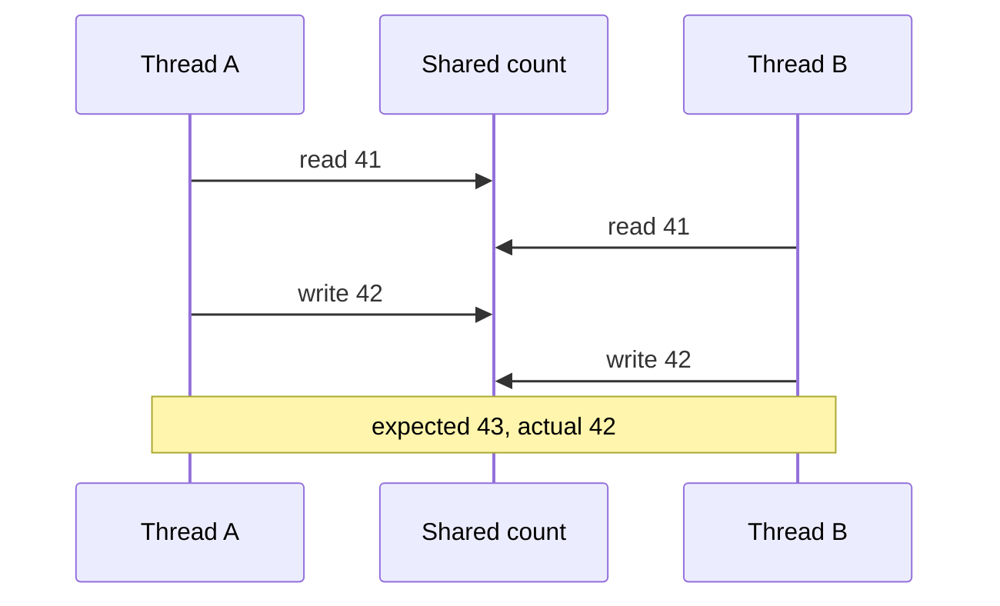
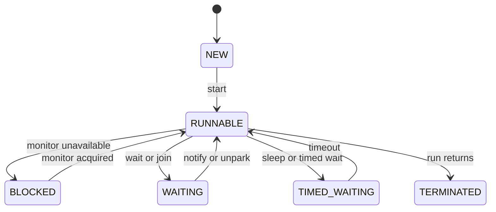
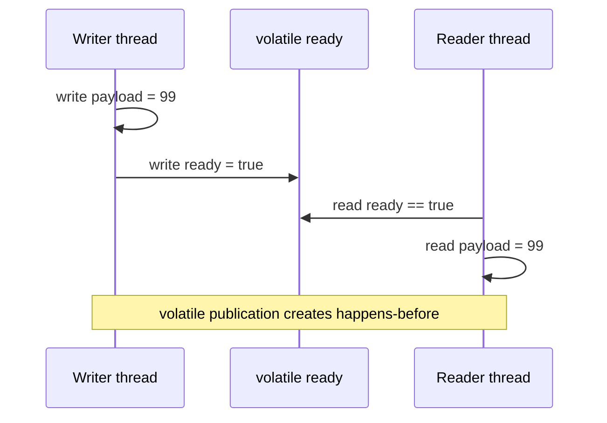
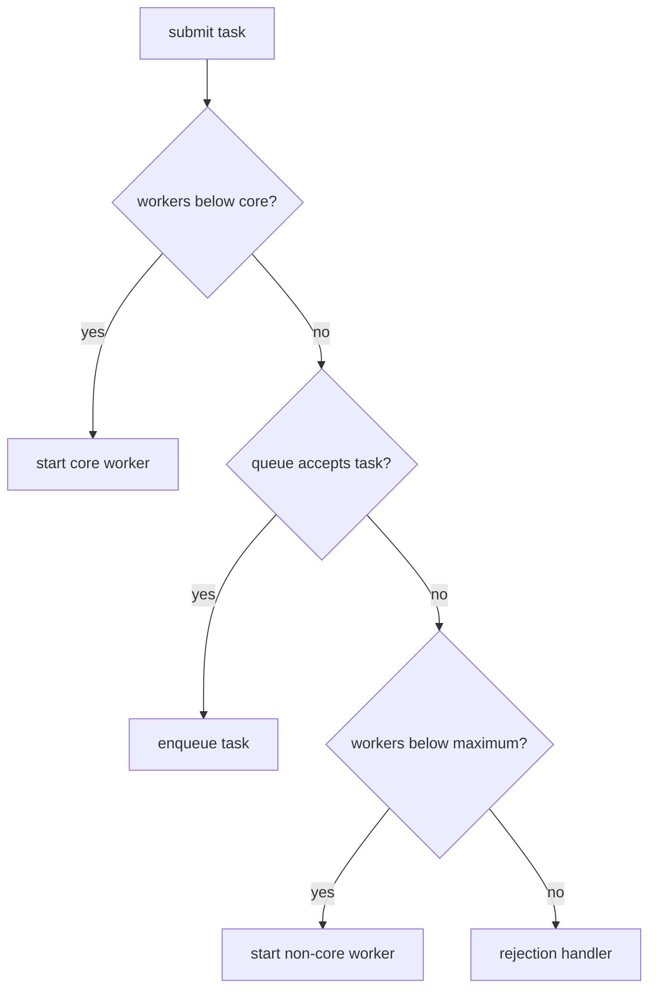

# Java Multithreading, Monitors, Locks, CAS & Executors

Concurrency lets one Java process make progress on independent work while preserving correctness for data that is shared.
It connects application code to the Java Memory Model, operating-system scheduling, and resource limits, which is why interviews move quickly from `synchronized` syntax to visibility, queue saturation, and production failure modes.
Good concurrency design starts by minimizing shared mutable state, then choosing the smallest mechanism that proves the remaining interactions safe.

---

## 🟢 Beginner Level

### Why Threads Create a Correctness Problem

A thread is an independent execution path inside a JVM process.
Threads share the process heap but each has its own call stack and program counter.
That shared heap makes collaboration possible.
It also permits two threads to observe or update the same object at overlapping times.

The three basic correctness concerns are atomicity, visibility, and ordering.
Atomicity means a change appears indivisible to other threads.
Visibility means one thread eventually observes another thread's published write.
Ordering means operations cannot be observed in an invalid rearrangement.

The expression `count++` looks like one instruction in source code.
It is actually read the current value, add one, and write the result.
Two threads can both read 41 and both write 42, losing one increment.
The desired final count after two increments is 43.



The diagram is a race because neither thread owns the read-modify-write sequence.
The fix is not merely making the field visible.
The whole operation must be protected or performed with an atomic primitive.

### Thread Lifecycle and States

Java exposes six `Thread.State` values: `NEW`, `RUNNABLE`, `BLOCKED`, `WAITING`, `TIMED_WAITING`, and `TERMINATED`.
`RUNNABLE` covers both a thread ready to run and one currently running on an operating-system CPU.
It is not a direct report of every operating-system scheduler state.
`BLOCKED` specifically means waiting to enter a `synchronized` monitor.

`WAITING` means waiting indefinitely for another thread to act, such as after `Object.wait`, `Thread.join`, or `LockSupport.park`.
`TIMED_WAITING` is a wait with a deadline, such as `sleep`, timed `join`, or timed `wait`.
Calling `start` schedules a new thread to invoke `run`; calling `run` directly is an ordinary method call and creates no new thread.
A terminated thread cannot be started again.



An application should rarely create raw platform threads for each request.
Thread construction, stack reservation, operating-system scheduling, and lifecycle management are resources that need a deliberate policy.
Use executors for managed task execution unless a specialized lifecycle is truly required.

### Tasks Are Not Threads

A `Runnable` represents work with no result.
A `Callable<T>` represents work that can return `T` or throw a checked exception.
An `Executor` decides when and on which thread that work runs.
This separation lets the caller submit a task without owning a thread directly.

```java
ExecutorService executor = Executors.newSingleThreadExecutor();
try {
    Future<Integer> result = executor.submit(() -> 21 * 2);
    System.out.println(result.get());
} finally {
    executor.shutdown();
}
```

`Future.get` waits for task completion and makes the completed task's effects visible to the thread that retrieves the result.
It can throw `InterruptedException`, so a caller should either propagate it or restore the interrupt flag after handling it.
An executor must be shut down when its owning component ends, or its threads can keep a process alive and leak work.

### Shared-State Strategies

The safest shared state is no shared mutable state.
Pass immutable messages between tasks where practical.
Constrain mutation to one owning thread where a queue or actor-like design fits.
When state must be shared, choose a lock, atomic variable, concurrent collection, or higher-level synchronizer based on the invariant.

| Need | Typical tool | What it guarantees | Important limit |
|---|---|---|---|
| One compound invariant | `synchronized` or `ReentrantLock` | Mutual exclusion and visibility | Long critical sections serialize work |
| Published flag or reference | `volatile` | Visibility and ordering | No atomic read-modify-write |
| Single numeric update | `AtomicInteger` | Atomic CAS-based update | Contention can cause retries |
| Many independent counters | `LongAdder` | Better write throughput under contention | `sum` is not one atomic snapshot |
| Producer-consumer handoff | `BlockingQueue` | Capacity and optional blocking | Does not make task logic safe |

The table describes scopes of correctness.
Do not replace a multi-field invariant with one atomic field simply because atomics are faster in a microbenchmark.

---

## 🟡 Intermediate Level

### Monitors, `synchronized`, `wait`, and `notify`

Every Java object can act as a monitor for `synchronized` code.
Entering `synchronized (lock)` acquires that object's monitor before executing the block.
Exiting normally or exceptionally releases it.
Only one thread owns a monitor at a time, while other attempting threads are normally `BLOCKED`.

The monitor is reentrant.
A thread that already owns it can enter another synchronized block on the same object without deadlocking itself.
The JVM tracks the nested hold count and releases the monitor only when the matching exits complete.
Synchronize on a private final lock or on the object whose invariant is being protected.
Avoid locking publicly reachable objects, interned strings, or class objects without an intentional global coordination design.

`wait` must be called while owning the same monitor.
It releases the monitor and places the caller in that monitor's wait set.
`notify` wakes one arbitrary waiting thread and `notifyAll` wakes all of them, but each awakened thread must reacquire the monitor before continuing.
Always await a predicate in a `while` loop because wakeups may be spurious or another thread may consume the condition first.

```java
private final Object monitor = new Object();
private boolean ready;

void awaitReady() throws InterruptedException {
    synchronized (monitor) {
        while (!ready) {
            monitor.wait();
        }
    }
}

void markReady() {
    synchronized (monitor) {
        ready = true;
        monitor.notifyAll();
    }
}
```

Higher-level types such as `CountDownLatch`, `Semaphore`, `BlockingQueue`, and `Condition` often describe intent better than manually managing wait sets.
They also reduce the risk of signaling the wrong predicate in a monitor that protects multiple conditions.

### The Java Memory Model and Happens-Before

The Java Memory Model defines which writes one thread is allowed to observe from another.
It does not promise that every source-code statement executes in the textual order seen by all threads.
Compilers, CPUs, and caches may reorder or delay operations when that is unobservable in single-threaded code.
Happens-before edges constrain those optimizations for concurrent code.

A monitor unlock happens-before a later lock of that same monitor.
A write to a `volatile` field happens-before a later read of that field.
Calling `Thread.start` happens-before actions in the started thread.
All actions in a task happen-before a successful `Future.get` on its result.



The safe-publication pattern writes ordinary fields first and writes the volatile flag last.
A reader that sees the flag as true then sees the preceding writes from that writer.
This works for publication, not for safely incrementing or jointly updating several fields.

`volatile int count` does not make `count++` atomic.
It makes each read and write visible, but another thread can interleave between them.
Use a lock or an atomic update method such as `incrementAndGet` when the increment itself is shared state.

### CAS, Atomic Variables, and Contention

Compare-and-set, or CAS, performs an atomic conditional update.
It compares a memory location with an expected value and writes a new value only if they match.
If another thread changed the location first, the operation reports failure and caller code may retry.
Atomic classes use this primitive to implement many lock-free operations.

$$\operatorname{CAS}(V, E, N) = \begin{cases} V \leftarrow N & \text{when } V = E \\ \text{fail} & \text{otherwise} \end{cases}$$

```java
AtomicInteger inventory = new AtomicInteger(5);

boolean reserveOne() {
    while (true) {
        int current = inventory.get();
        if (current == 0) return false;
        if (inventory.compareAndSet(current, current - 1)) return true;
    }
}
```

The loop is correct for a single inventory number because the CAS protects its transition from `n` to `n - 1`.
It is not enough if reserving inventory must also atomically create an order, update a second warehouse, and emit a reliable event.
Those broader invariants need a larger transactional boundary.

CAS avoids a blocked monitor, but it can burn CPU repeatedly retrying under high contention.
`LongAdder` spreads increments across internal cells and is often better for metrics with many writers.
It trades away an instant, globally atomic total during concurrent updates.

### Worked Example: A Bounded Executor Under Load

Assume an API has four CPU cores available for a CPU-heavy image validation stage.
Each validation takes about 50 ms of CPU time.
At a sustained 80 requests per second, the stage requires approximately $80 \times 0.050 = 4$ CPU-seconds each second.
Four active workers are a reasonable starting point before measurement, because the work is CPU-bound rather than waiting on network I/O.

Now configure core size 4, maximum size 8, and an `ArrayBlockingQueue` capacity of 100.
If the workers stay busy for two seconds while 160 tasks arrive, four immediately run and 100 queue.
The next 56 submissions can cause the executor to grow toward eight workers, then invoke rejection when both the eight-worker limit and the queue are full.
That rejection is a deliberate overload signal rather than an invisible unbounded-heap growth path.

```java
ThreadPoolExecutor pool = new ThreadPoolExecutor(
        4,
        8,
        30L,
        TimeUnit.SECONDS,
        new ArrayBlockingQueue<>(100),
        new ThreadPoolExecutor.CallerRunsPolicy());
```

With `CallerRunsPolicy`, a submitting application thread executes some overflow work.
That slows admission and can create useful backpressure, but it is dangerous if the caller must never block or is holding a lock.
`AbortPolicy` fails fast with `RejectedExecutionException`, which may be more appropriate for a request that can return a defined overload response.
Capacity should be tied to latency budgets and downstream limits, not selected as a decorative round number.

### Interruption, Cancellation, and Timeouts

Interruption is a cooperative cancellation request.
Calling `interrupt` sets a thread's interrupted status and causes selected interruptible operations, such as `sleep`, `wait`, `join`, and many blocking-queue methods, to throw `InterruptedException`.
It does not forcibly stop arbitrary Java code safely.
The removed `Thread.stop` approach could expose partially updated invariants.

When catching `InterruptedException` and not rethrowing it, restore the flag.
This lets a caller higher in the stack recognize the cancellation request.
Do not swallow interruption and continue expensive work as though cancellation did not occur.

```java
try {
    queue.put(job);
} catch (InterruptedException exception) {
    Thread.currentThread().interrupt();
    return;
}
```

Timeouts are a policy, not proof that underlying work stopped.
`Future.cancel(true)` requests interruption if the task has started, but a task that ignores interruption can continue.
Design blocking calls with timeouts, propagate cancellation to dependent work, and make cleanup idempotent.

---

## 🔴 Expert Level

### Lock Choices, Fairness, and Deadlock Avoidance

`ReentrantLock` offers explicit `lock`, `unlock`, `tryLock`, optional fairness, and multiple `Condition` objects.
Always release it in `finally` because an exception between lock and unlock can permanently block future progress.
`ReadWriteLock` can improve read-heavy access by allowing concurrent readers, but writers still need exclusive access and fairness choices can affect writer starvation.
`StampedLock` adds optimistic reads but its stamps are not reentrant and require careful validation.

Fair locks generally reduce barging by new arrivals.
They often reduce aggregate throughput because handoff and scheduling flexibility decline.
Use fairness only when a measured starvation or tail-latency requirement justifies it.
Do not assume a fair lock makes every surrounding resource fair.

Deadlock requires mutually exclusive resources, hold-and-wait, no forced preemption, and a circular wait.
The standard prevention technique is a global lock order.
If a transfer must lock account A and account B, lock the lower stable identifier first in every code path.
Timed `tryLock` can detect and back away from a contested acquisition, but it requires a safe retry or failure policy.

```java
boolean transfer(Account first, Account second) throws InterruptedException {
    if (!first.lock.tryLock(100, TimeUnit.MILLISECONDS)) return false;
    try {
        if (!second.lock.tryLock(100, TimeUnit.MILLISECONDS)) return false;
        try {
            return moveFunds(first, second);
        } finally {
            second.lock.unlock();
        }
    } finally {
        first.lock.unlock();
    }
}
```

The example only avoids a leaked first lock.
Production code must establish one order before this method is called, and it must avoid returning success if a partial transfer can remain visible.

### `ThreadPoolExecutor` Admission and Rejection

`ThreadPoolExecutor.execute` follows a specific admission path.
It first creates workers until `corePoolSize` is reached.
It then tries to enqueue work.
Only if the queue rejects work does it create non-core workers up to `maximumPoolSize`.
When both queue and worker limit reject the task, the configured rejection handler runs.



This sequence surprises teams that pair a very large queue with a large maximum pool size.
The queue accepts tasks first, so maximum threads may never be created until the queue fills.
An unbounded queue can retain work until the process runs out of heap.

`Executors.newFixedThreadPool` uses an unbounded `LinkedBlockingQueue`.
`Executors.newCachedThreadPool` can create an unbounded number of platform threads with a `SynchronousQueue`.
Both can be reasonable in a tightly controlled tool, but production services normally need explicit bounds and rejection semantics.
Avoid submitting a task that synchronously waits for another task submitted to the same saturated fixed pool, because all workers can be occupied waiting for work that cannot start.

### Virtual Threads: Cheap Blocking, Not Infinite Resources

Virtual threads in Java 21 are JVM-managed threads intended for large numbers of blocking, mostly I/O-bound tasks.
When a virtual thread blocks in supported JDK I/O, the runtime can unmount it from a carrier platform thread.
The carrier can then run a different virtual thread.
This allows imperative blocking code to scale beyond one platform thread per waiting request.

Create virtual threads per task rather than pooling virtual threads themselves.
The scarce resources remain database connections, sockets, file descriptors, CPU, heap, and downstream rate limits.
Use a semaphore or a bounded resource pool to cap those resources even when virtual-thread creation is cheap.

```java
try (var executor = Executors.newVirtualThreadPerTaskExecutor()) {
    for (Request request : requests) {
        executor.submit(() -> callRemoteService(request));
    }
}
```

Pinning can prevent unmounting when a virtual thread blocks while holding a monitor or inside native code.
Current JDKs have improved many synchronized cases, but long blocking operations inside synchronized regions remain a design smell worth profiling.
Large `ThreadLocal` values multiplied across huge virtual-thread counts can also consume substantial heap.
Use Java Flight Recorder and the JDK's virtual-thread diagnostics to observe pinning and scheduler behavior before rewriting synchronization mechanically.

### ABA, Memory Reclamation, and Lock-Free Limits

The ABA problem occurs when one thread reads A, another changes A to B and then back to A, and the first CAS succeeds without noticing the intermediate change.
For reference transitions where that history matters, `AtomicStampedReference` pairs a reference with a version-like stamp.
It makes the expected value include both reference and stamp.
Not every CAS use needs a stamp; a monotonic counter increment does not have the same identity-reuse concern.

Lock-free does not mean wait-free.
An algorithm is lock-free when system-wide progress is guaranteed even if one thread pauses, but a particular thread may repeatedly lose CAS races.
Contention, false sharing, allocation, and memory reclamation can make a lock-free design slower or harder to maintain than a short uncontended lock.
Prefer proven JDK concurrent structures over hand-rolled lock-free linked lists.

### Common Misconceptions

1. **"`volatile` makes `count++` thread-safe."**
   *Correction*: Volatile provides visibility and ordering for its reads and writes, but increment is still a read-modify-write sequence. Use an atomic update or a lock when increments race.

2. **"`sleep` releases a synchronized monitor."**
   *Correction*: Sleeping keeps every monitor the thread already owns. `wait` releases the specified monitor, which is why it must be invoked while owning it.

3. **"A virtual thread removes the need to limit concurrency."**
   *Correction*: Virtual threads reduce platform-thread cost for blocking work, but database connections, heap, file descriptors, and downstream services remain finite. Bound those resources independently.

4. **"Fail-fast iteration or `ConcurrentModificationException` is synchronization."**
   *Correction*: It detects some structural changes on a best-effort basis. It does not coordinate threads or make a result consistent.

5. **"More executor threads always increase throughput."**
   *Correction*: CPU-bound work beyond available cores adds context switching and cache pressure. I/O-bound work needs resource-aware limits, because more concurrent calls can simply overload a dependency.

### Interview Questions

**Q1. What are the three core concurrency properties that shared code must reason about?** `[easy]`

Atomicity makes a compound action appear indivisible, visibility determines whether one thread sees another's writes, and ordering constrains observable reordering. A correct program often needs more than one property at once. For example, a visible counter can still lose updates if increment is not atomic.

**Q2. What is the difference between `BLOCKED` and `WAITING` in `Thread.State`?** `[easy]`

`BLOCKED` means a thread is waiting to enter a `synchronized` monitor held by another thread. `WAITING` means it has voluntarily waited for an action such as `notify`, `join`, or unpark. Both require another event to progress, but only `BLOCKED` specifically concerns monitor entry.

**Q3. Why is `while (!condition) wait()` correct while `if (!condition) wait()` is unsafe?** `[easy]`

A waiting thread can wake spuriously or another awakened thread can consume the condition before it reacquires the monitor. The loop rechecks the predicate under the same lock before proceeding. An `if` permits execution after a wakeup that did not actually establish the required state.

**Q4. What does a `volatile` write guarantee?** `[easy]`

A volatile write happens-before a later volatile read of the same field. Writes before the publishing write become visible to a reader that observes it. It does not bundle several fields into one atomic transaction or make a read-modify-write operation indivisible.

**Q5. How does CAS implement an atomic increment?** `[medium]`

The thread reads the current value, computes a replacement, and asks hardware to write it only if the value is still the expected one. A conflicting update makes CAS fail, so the operation rereads and retries. Under high contention those retries consume CPU, which is why striped counters such as `LongAdder` can be preferable for metrics.

**Q6. Why should a `ReentrantLock` be released in `finally`?** `[medium]`

An exception after successful lock acquisition can otherwise skip the unlock call. The lock remains held and future threads may block forever, turning a local error into a service-wide stall. `finally` preserves release on normal return, exception, and early exit paths.

**Q7. What is the `ThreadPoolExecutor` task-admission order?** `[medium]`

It creates workers up to core size, then attempts to queue a task, then creates non-core workers only when the queue rejects, and finally invokes rejection. This means queue selection changes actual concurrency behavior. A large queue can prevent growth toward maximum size and hide overload as queued latency.

**Q8. Why can `Executors.newFixedThreadPool` cause an out-of-memory failure?** `[medium]`

Its default work queue is an unbounded `LinkedBlockingQueue`. If arrival rate exceeds completion rate, queued task objects accumulate until heap is exhausted. Use an explicit bounded queue and a defined rejection or backpressure policy for production paths.

**Q9. What is thread-starvation deadlock in an executor?** `[medium]`

It happens when all workers in a limited pool run tasks that synchronously wait for other tasks queued to the same pool. The queued tasks cannot begin because no worker is free, while the current tasks cannot finish. Avoid nested blocking submissions or use a separate executor and asynchronous composition.

**Q10. When is `LongAdder` better than `AtomicLong`?** `[medium]`

`LongAdder` is often better for heavily contended statistics where many threads increment and an occasionally approximate concurrent total is acceptable. It distributes updates across internal cells to reduce CAS contention. It is not suitable when each read must be one linearizable global counter value for a business decision.

**Q11. What is virtual-thread pinning, and how do you investigate it?** `[medium]`

Pinning means a virtual thread cannot unmount from its carrier while it blocks, commonly around a monitor-held or native operation. This reduces the carrier's ability to run other virtual threads and can hurt scalability. Use JFR and JDK diagnostics to find the exact blocking region, then shorten or restructure the critical section rather than blindly replacing every lock.

**Q12. Scenario: a CPU-bound service uses 200 worker threads on an 8-core host but throughput drops and latency rises. What do you change first?** `[hard]`

Profile CPU utilization, runnable-thread count, allocation, and context-switch activity to verify that the stage is CPU-bound. Hundreds of runnable workers compete for eight cores and increase scheduling and cache overhead without creating more CPU capacity. Start with a bounded executor near the effective core count, then measure after reducing work, batching, or parallelism.

**Q13. Scenario: a request executor has a queue of 100,000 tasks and eventually crashes with `OutOfMemoryError`. What is the root cause and repair?** `[hard]`

The queue acted as unbounded admission storage while producers outran consumers, so latency and heap usage grew together. Increasing heap only delays failure and does not restore a service-level latency target. Bound the queue, choose a rejection or caller-backpressure strategy, and cap upstream concurrency according to downstream capacity.

**Q14. Scenario: a virtual-thread migration increases database timeouts even though platform-thread usage falls. What should you inspect?** `[hard]`

Virtual threads may have removed thread scarcity and allowed too many concurrent requests to reach a finite database connection pool. Inspect pool utilization, connection wait time, query latency, and downstream retry behavior before blaming the scheduler. Bound database concurrency with the pool or semaphore, set timeouts, and preserve backpressure even when request tasks are cheap.

### Further Reading

- [Java `java.lang.Thread` documentation](https://docs.oracle.com/en/java/javase/21/docs/api/java.base/java/lang/Thread.html) documents lifecycle, interruption, and virtual-thread APIs.
- [Java Language Specification, chapter 17](https://docs.oracle.com/javase/specs/jls/se21/html/jls-17.html) is the primary reference for the Java Memory Model and happens-before rules.
- [Java `ThreadPoolExecutor` documentation](https://docs.oracle.com/en/java/javase/21/docs/api/java.base/java/util/concurrent/ThreadPoolExecutor.html) specifies admission, queueing, and rejection behavior.
- [JEP 444: Virtual Threads](https://openjdk.org/jeps/444) explains the design, intended use, and observability of virtual threads.
