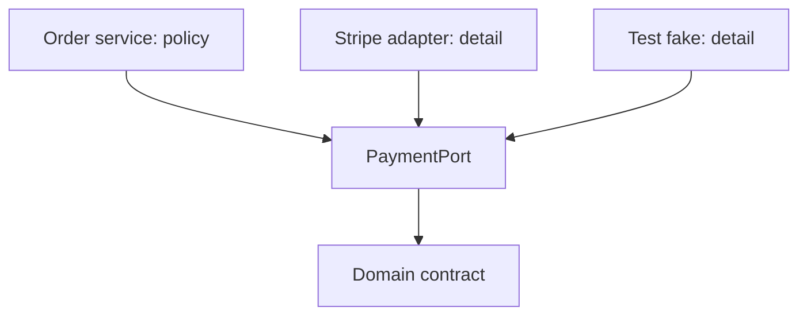
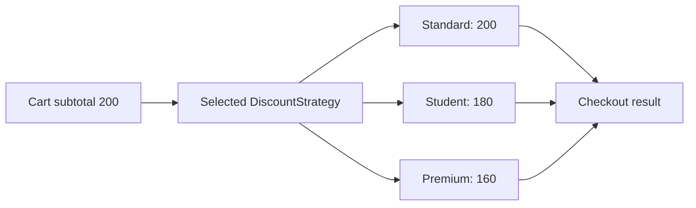
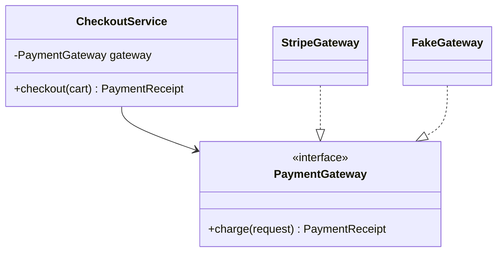

# SOLID Principles and Java Design Patterns

SOLID principles and design patterns are vocabulary for managing change, dependencies, and object collaboration in a codebase that will outlive its first feature. They are not rules that require an interface or a pattern for every class. Interviewers look for the ability to identify a concrete design pressure, select the smallest useful abstraction, and explain its trade-offs.

---

## 🟢 Beginner Level

### Patterns describe recurring forces

A design pattern is a named solution shape for a recurring design problem.

It is not a framework class or a code-generation template.

For example, Strategy describes choosing one interchangeable algorithm through a common contract.

Observer describes one publisher notifying many interested subscribers.

Factory describes separating construction choice from client use.

The name is useful because it makes the relationship and trade-off discussable.


Patterns should follow a demonstrated source of variation.

Adding a factory around a single stable constructor adds indirection without flexibility.

Leaving a growing conditional over changing business rules eventually makes extension risky.

The design goal is understandable code with localised change.

### SOLID in one table

SOLID is a set of related heuristics for keeping dependencies and responsibilities manageable.

| Principle | Direct meaning | Common symptom | Typical response |
|---|---|---|---|
| SRP | One reason to change | Domain class also sends email and formats PDF | Separate policy, presentation, and transport |
| OCP | Extend behaviour without editing stable policy | Repeated type switch for every new variant | Add a strategy or handler |
| LSP | Subtypes honour base expectations | Override throws for a legal base operation | Redesign the abstraction |
| ISP | Clients need small focused contracts | Implementations contain unsupported methods | Split the interface by client need |
| DIP | High-level policy depends on abstractions | Service directly creates database client | Inject a port or interface |

The principles reinforce one another.

Small interfaces often make dependency inversion practical.

Dependency inversion can make an extension point possible.

An extension point is useful only when it preserves the semantic contract required by substitution.

### The dependency direction matters

High-level policy expresses the business decision.

Low-level details include SQL clients, HTTP gateways, file systems, and vendor SDKs.

Dependency inversion means both policy and detail depend on a stable abstraction owned near the policy.



The abstraction should describe what the policy needs, such as `charge(PaymentRequest)`.

It should not mirror every capability of a payment vendor.

Constructor injection exposes the dependency at object creation and makes tests straightforward.

Static global access hides dependencies and tends to make isolation harder.

### Inheritance is not automatic reuse

Inheritance says a subtype can stand in for a base type.

It is safe only when the subtype preserves the base contract.

The classic `Square extends Rectangle` example fails if callers can independently set width and height.

Changing width on a square also changes height, violating that expectation.

Prefer composition when a class needs another object's capability rather than being a specialised form of that object.

Interfaces describe capabilities without inheriting implementation state.

Java permits multiple interfaces because conflicting default methods must be resolved explicitly.

---

## 🟡 Intermediate Level

### Applying SRP, OCP, and DIP to checkout

Suppose a checkout service calculates totals, chooses payment vendors, writes an audit record, and sends confirmation email.

It changes when tax policy changes.

It changes when a payment provider changes.

It changes when the email template changes.

Those are distinct reasons to change.

SRP suggests separating those responsibilities.

OCP suggests adding a payment method by supplying another strategy rather than editing one giant switch.

DIP suggests the checkout policy depends on a `PaymentGateway` contract rather than a concrete SDK.

```java
interface PaymentGateway {
    PaymentReceipt charge(PaymentRequest request);
}

final class CheckoutService {
    private final PaymentGateway payments;
    private final TaxPolicy taxPolicy;

    CheckoutService(PaymentGateway payments, TaxPolicy taxPolicy) {
        this.payments = payments;
        this.taxPolicy = taxPolicy;
    }

    PaymentReceipt checkout(Cart cart) {
        return payments.charge(taxPolicy.price(cart));
    }
}
```

The service still needs a composition root to choose a real gateway.

Spring configuration or a module bootstrap can provide that decision.

The business service no longer imports the vendor SDK directly.

### Worked example: replace a discount switch

Assume a cart subtotal is `200`.

The business supports standard, student, and premium discounts.

Standard subtracts `0`.

Student subtracts 10 percent, so `200 × 0.90 = 180`.

Premium subtracts 20 percent, so `200 × 0.80 = 160`.

The original switch is easy at three variants.

It becomes a conflict point when each new campaign edits the same checkout method.

```java
interface DiscountStrategy {
    BigDecimal apply(BigDecimal subtotal);
}

final class StudentDiscount implements DiscountStrategy {
    public BigDecimal apply(BigDecimal subtotal) {
        return subtotal.multiply(new BigDecimal("0.90"));
    }
}

final class Checkout {
    BigDecimal total(BigDecimal subtotal, DiscountStrategy strategy) {
        return strategy.apply(subtotal);
    }
}
```

The result for the student policy is `180`.

Adding a partner discount adds one implementation and registration rule.

It does not require altering the arithmetic of existing strategies.



This is OCP when the selection mechanism itself is not edited for every variant.

If an `if` statement still selects every known strategy in one method, the pressure may simply have moved.

For a closed set of stable options, a switch expression can be clearer than a hierarchy.

### LSP and interface segregation in practice

LSP concerns behaviour, not merely matching method signatures.

If a base method promises it can accept any nonnegative withdrawal, a subtype that rejects ordinary valid inputs is not substitutable.

Preconditions in a subtype cannot be stronger than the base contract.

Postconditions cannot be weaker.

Invariants promised by the base must remain true.

ISP avoids forcing clients to depend on methods they do not use.

```java
interface Printer { void print(Document document); }
interface Scanner { Scan scan(); }
interface Fax { void fax(Document document); }

final class SimplePrinter implements Printer {
    public void print(Document document) { /* implementation */ }
}
```

This is better than a `Machine` interface that makes `SimplePrinter` throw `UnsupportedOperationException` from scanning and faxing methods.

The smaller contracts give each client a more accurate dependency.

They can also simplify test doubles.

### Creational patterns: construction as policy

The Builder pattern assembles an object with many optional fields while preserving readable construction and validation.

It is valuable when telescoping constructors are unclear or when an immutable object needs a staged build.

```java
UserProfile profile = UserProfile.builder()
    .username("ada")
    .email("ada@example.test")
    .marketingOptIn(false)
    .build();
```

A simple factory centralises creation choice.

Factory Method delegates that choice to subclasses or implementations.

Abstract Factory creates related families of objects, such as a database-specific `ConnectionFactory` and `Dialect` pair.

Singleton means one instance by design, not merely a class with static methods.

Use a singleton only when one shared identity and lifecycle are genuinely required.

Dependency injection often removes the need to implement singleton mechanics yourself.

An enum singleton is robust against reflection and serialisation concerns for the rare cases where one is needed.

---

## 🔴 Expert Level

### Structural and behavioural patterns under load

Adapter translates one interface into another expected by a client.

Facade gives a simple entry point over a complicated subsystem.

Decorator adds behaviour around one object while preserving the same contract.

Proxy controls access, lazy creation, remoting, or transaction interception.

Observer publishes an event to subscribers.

Command packages an action and its parameters as a value.

Template Method fixes an algorithm skeleton while subclasses provide steps.

Strategy chooses one complete algorithm at runtime.

These names are only useful when they expose the actual collaboration.



Decorator and proxy can look similar because both wrap an object.

Decorator usually adds independent behaviour such as metrics or compression.

Proxy usually controls access or lifecycle, such as a lazy association or transaction boundary.

The distinction matters less than preserving the wrapped contract and documenting side effects.

### Observer delivery, failure, and idempotency

An in-process observer can invoke subscribers synchronously.

One slow subscriber then delays the publisher.

An asynchronous event bus decouples latency but introduces ordering, retry, duplicate delivery, and shutdown concerns.

Do not call a network service under an in-memory domain lock merely because it is an observer callback.

For distributed events, consumers should be idempotent.

They may receive the same event more than once after a retry.

Store a processed event id or design operations whose repeated application is safe.

An outbox pattern can atomically store a domain change and pending event in one database transaction.

A relay publishes the event later, avoiding the lost-event gap between database commit and message publish.

### Avoiding pattern-shaped overengineering

Every abstraction adds a contract, code path, test surface, and onboarding cost.

An interface with one implementation is not automatically wrong.

It is justified when it protects a module boundary, supports a real test double, or expresses an enduring policy-detail separation.

It is unnecessary when it only predicts hypothetical future alternatives.

Prefer a direct class until a concrete variation appears, unless a boundary to I/O or a vendor dependency already exists.

Refactor toward a pattern when repeated edits expose a stable axis of change.

Do not use inheritance merely to reuse two methods.

Composition makes dependencies explicit and avoids fragile base-class coupling.

### Testing through contracts and seams

Tests should assert observable behaviour, not the private pattern name.

A checkout test can verify that a chosen discount yields `180` from a subtotal of `200`.

It does not need to mock every helper simply because the implementation uses Strategy.

Contract tests are useful when several adapters implement the same port.

Run the same behavioural suite against a real gateway sandbox and a fake where feasible.

Fakes should preserve important constraints, errors, and latency semantics.

A fake that always succeeds can hide production retry and timeout logic.

### Common Misconceptions

1. **"SOLID means one class per method."**
   *Correction*: SRP means a coherent reason to change, not maximal fragmentation. Several closely related calculations can belong together when they change for the same business rule.

2. **"Open/closed means never modify existing code."**
   *Correction*: Stable code should be extended through well-chosen seams when variation is expected. Refactoring an incorrect abstraction is often safer than preserving it with layers of special cases.

3. **"Every interface should have multiple implementations."**
   *Correction*: An interface can protect a meaningful boundary even with one production implementation. Creating one merely to satisfy a style rule adds indirection without a contract benefit.

4. **"Singleton is the same as global state."**
   *Correction*: A singleton has one controlled instance, but it can still become hidden global mutable state. Dependency injection with explicit lifecycle is often more testable and observable.

5. **"A design pattern guarantees good architecture."**
   *Correction*: Patterns solve specific forces and create new costs. A poorly placed Strategy or Observer can make a simple flow harder to trace than a direct implementation.

### Interview Questions

**Q1. What does the Single Responsibility Principle mean in practice?** `[easy]`

It means a module should have one coherent reason to change, usually one responsibility owned by one actor or policy. A class that calculates invoices, renders PDFs, and sends email changes for three unrelated reasons. Separate those concerns where their policies and release cadence diverge, but do not split tightly related logic mechanically.

**Q2. How does dependency inversion differ from dependency injection?** `[easy]`

Dependency inversion is the design principle that high-level policy should depend on abstractions rather than concrete details. Dependency injection is one technique for supplying those dependencies at runtime, commonly through constructors. Injection can exist without good inversion if the injected type is still a low-level vendor detail.

**Q3. What is a Strategy pattern?** `[easy]`

Strategy encapsulates interchangeable algorithms behind a common contract. The caller selects one strategy and delegates the operation without knowing its internal algorithm. It is useful when policies vary independently, but a stable two-case branch may be simpler than a hierarchy.

**Q4. Why can `Square extends Rectangle` violate LSP?** `[easy]`

A rectangle abstraction often promises callers they can set width and height independently. A square subtype must keep both equal, so setting one dimension changes another and breaks that expectation. The issue is behavioural contract incompatibility, not the mathematical fact that a square is a rectangle.

**Q5. When is a Builder preferable to a constructor?** `[medium]`

A Builder is useful when an object has many optional parameters, validation steps, or values whose positional constructor order is unclear. Named fluent calls make construction readable and can produce an immutable object after validation. It is unnecessary for a small object with two obvious required parameters.

**Q6. How do OCP and Strategy relate?** `[medium]`

Strategy creates a seam through which an algorithm can be added as another implementation. That can let a stable caller remain unchanged while new policies are registered at a composition boundary. It only satisfies OCP meaningfully when the selection mechanism does not require editing the same central conditional for every new case.

**Q7. What is the difference between Adapter and Facade?** `[medium]`

Adapter translates an existing interface into the interface a client expects. Facade exposes a simpler high-level interface over a subsystem without necessarily translating one contract to another. Both reduce coupling, but Adapter is usually driven by incompatibility while Facade is driven by subsystem complexity.

**Q8. Why should interfaces be small under ISP?** `[medium]`

Small interfaces let clients depend only on operations they truly need and prevent implementations from supplying meaningless methods. That avoids unsupported-operation exceptions and makes contracts easier to test. The trade-off is too many microscopic interfaces can obscure a cohesive capability, so split by client usage rather than by every method.

**Q9. What is the practical difference between a Decorator and a Proxy?** `[medium]`

Both wrap an object and preserve a client-facing contract. A Decorator generally adds behaviour such as metrics, caching, or compression, while a Proxy controls access, remote communication, lazy construction, or transactions. Correctness depends on documenting whether the wrapper changes timing, failures, or identity semantics.

**Q10. Why can synchronous Observer delivery be risky?** `[medium]`

The publisher executes subscriber work on its own call path, so a slow or failing subscriber affects publisher latency and availability. This can be acceptable for small in-process invariants but is dangerous for network calls or unbounded listeners. Asynchronous delivery needs idempotency, retry, ordering, and observability design rather than merely a thread pool.

**Q11. Scenario: adding a fourth payment provider requires editing a 500-line checkout switch and retesting unrelated paths. How would you refactor?** `[hard]`

Identify the varying payment operation and define a narrow `PaymentGateway` or strategy contract owned by checkout policy. Move each provider implementation behind that contract and choose it through a registry or composition layer, then add contract tests for shared outcomes and failure mapping. Keep common authorization rules in checkout so providers do not duplicate business policy.

**Q12. Scenario: a new `SimplePrinter` implementation throws `UnsupportedOperationException` for scan and fax methods. Which principle is violated?** `[hard]`

The broad interface violates ISP because the simple client and implementation are forced to depend on irrelevant operations. Split the contract into `Printer`, `Scanner`, and `Fax`, then make consumers request only their needed capability. This also improves LSP because every implementation of each smaller contract can honour its methods.

**Q13. How should a distributed Observer consumer handle duplicate events?** `[hard]`

Assume at-least-once delivery and make the consumer idempotent, for example by recording an event identifier transactionally or using a natural idempotency key. A retry after an acknowledgement loss should not create a second charge or duplicate email. The trade-off is storage and coordination overhead, but it is safer than assuming exactly-once delivery from a messaging library.

**Q14. When is a direct conditional better than a design pattern?** `[hard]`

A direct conditional is better when the variants are few, stable, local, and easy to understand in one place. Introducing factories, strategies, and registries before an actual axis of change creates a larger abstraction surface and can slow comprehension. Refactor when repeated changes, independent deployment, or vendor boundaries demonstrate a real need for extension.

### Further Reading

- [Java language specification: interfaces](https://docs.oracle.com/javase/specs/jls/se21/html/jls-9.html) covers interface contracts and default-method resolution.
- [Java tutorial: nested classes and builders](https://docs.oracle.com/javase/tutorial/java/javaOO/nested.html) provides the language mechanics commonly used by Builder implementations.
- [Spring Framework reference: dependency injection](https://docs.spring.io/spring-framework/reference/core/beans/dependencies/factory-collaborators.html) explains constructor-based dependency injection and explicit dependencies.
- [Martin Fowler: Inversion of Control Containers and the Dependency Injection pattern](https://martinfowler.com/articles/injection.html) gives the original practical framing for dependency injection.
