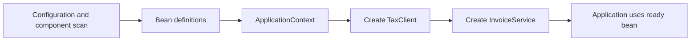
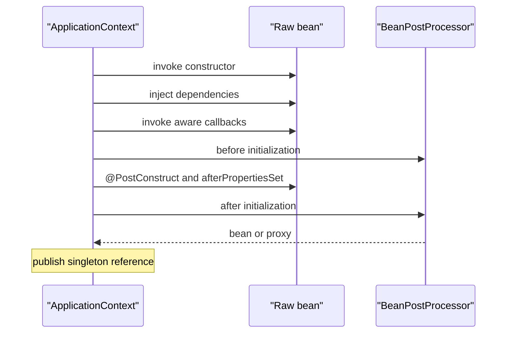
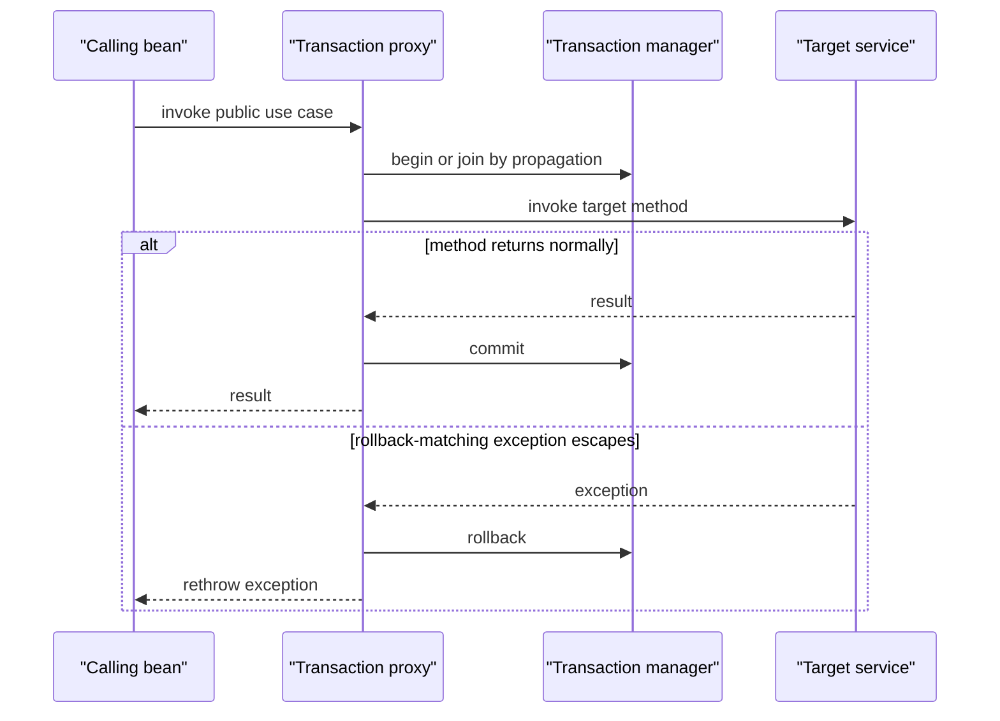
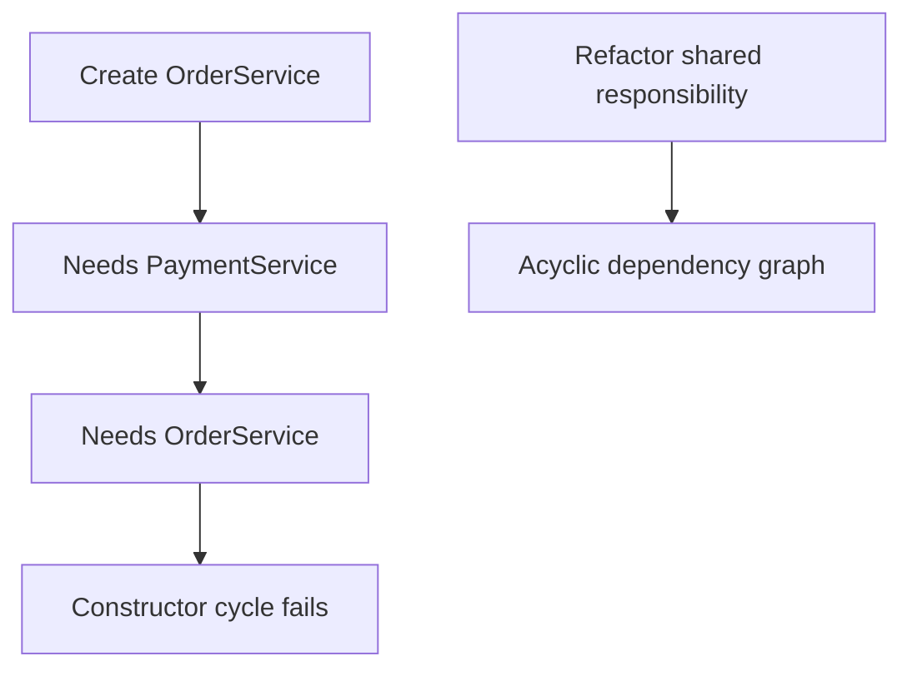

# Spring IoC Container, Bean Lifecycles & Auto-Configuration

Spring's container creates application objects, supplies their dependencies, applies cross-cutting behaviour, and destroys managed resources in an ordered lifecycle.
That lifecycle is where configuration becomes running services, where proxies make annotations such as `@Transactional` work, and where shutdown correctness is won or lost.
Interviewers ask about it because lifecycle ordering explains real failures involving null dependencies, missing transactions, circular references, and leaked connections.

---

## 🟢 Beginner Level

### The container owns bean construction

A Spring bean is an object created and managed by the Spring IoC container.
IoC means application code declares what it needs, while the container controls object creation and wiring.
Dependency injection is the mechanism the container uses to provide those collaborators.

```java
@Service
final class InvoiceService {
    private final TaxClient taxClient;

    InvoiceService(TaxClient taxClient) {
        this.taxClient = taxClient;
    }
}
```

`InvoiceService` does not call `new TaxClient(...)` itself.
Spring identifies a matching bean definition, creates the client, and passes it to the constructor.
The class is easier to test because a test can supply a fake `TaxClient` directly.



The `ApplicationContext` is the usual full-featured container in a Spring application.
It builds on the lower-level `BeanFactory` and additionally provides events, resources, messages, and environment integration.
An object that the application creates with `new` is not automatically a Spring bean.

### Bean definitions are recipes, not objects

Before Spring creates a bean, it records a `BeanDefinition`.
The definition describes the class, scope, constructor arguments, property values, init and destroy callbacks, and other metadata.
The same definition can create one singleton object or many prototype objects depending on scope.

Definitions commonly come from component scanning.

```java
@Component
final class ClockService { }

@Configuration
class AppConfiguration {
    @Bean
    Clock clock() {
        return Clock.systemUTC();
    }
}
```

`@Component`, `@Service`, `@Repository`, and `@Controller` are stereotype annotations discovered by scanning.
`@Bean` registers the return value of a factory method.
`@Configuration` classes are themselves parsed for such methods.

The name is usually the decapitalised class name or method name.
Use an explicit name only when the default would be unclear or when an integration requires one.

### Constructor injection states required dependencies

Constructor injection is Spring's preferred default for mandatory collaborators.
It makes the dependency visible in the type's construction contract.
A `final` field then prevents accidental reassignment.

```java
@Service
final class ReportService {
    private final ReportRepository repository;
    private final Clock clock;

    ReportService(ReportRepository repository, Clock clock) {
        this.repository = repository;
        this.clock = clock;
    }
}
```

Spring automatically chooses the only constructor, so `@Autowired` is not needed in this example.
Field injection hides required dependencies and makes plain unit tests more awkward.
Setter injection can be suitable for a genuinely optional or replaceable collaborator.

| Injection style | Best use | Main trade-off |
|---|---|---|
| constructor | required dependencies | exposes circular dependencies early |
| setter | optional or reconfigurable dependency | object may be temporarily incomplete |
| field | legacy convenience | hidden dependency and weak testability |
| factory method | third-party object construction | configuration owns construction logic |

When several beans have the same type, use `@Qualifier` to name the intended dependency.
Use `@Primary` only when one implementation is the sensible default for most injection sites.
Resolving ambiguity explicitly is safer than relying on bean-name coincidence.

### Scope defines how many objects a definition creates

The default Spring scope is singleton.
One `ApplicationContext` creates one shared instance for that definition.
It is not the GoF singleton pattern, because separate contexts can each have their own instance.

```java
@Scope(ConfigurableBeanFactory.SCOPE_PROTOTYPE)
@Component
class DraftEmail { }
```

A prototype definition yields a fresh instance each time the container is asked for it.
Web applications also use request and session scopes where supported.
Scope changes lifetime and ownership; it does not make a mutable object thread-safe.

---

## 🟡 Intermediate Level

### The singleton lifecycle has ordered extension points

For a normal singleton, Spring first resolves the bean definition and dependencies.
It instantiates the raw object, applies dependency injection and aware callbacks, then invokes initialization callbacks.
Finally, post-processors may wrap the object, and the resulting exposed bean becomes available to consumers.



The exact internal route has more branches for factories, circular references, and special bean types.
The public mental model remains useful: construction is not the same as initialization, and initialization is not the same as proxy exposure.
Do not call a bean from another thread until the container has completed its startup phase.

### Initialization callbacks should establish local readiness

`@PostConstruct` is a concise callback after dependency injection.
`InitializingBean.afterPropertiesSet` and a `@Bean(initMethod = ...)` declaration are alternatives.
Choose one style per codebase instead of making lifecycle work hard to trace.

```java
@Component
final class CurrencyCatalog {
    private final CurrencyGateway gateway;
    private Map<String, BigDecimal> rates;

    CurrencyCatalog(CurrencyGateway gateway) {
        this.gateway = gateway;
    }

    @PostConstruct
    void loadInitialRates() {
        rates = Map.copyOf(gateway.fetchRates());
    }
}
```

The callback should validate configuration, initialise local state, or acquire a short-lived required resource.
Avoid expensive unbounded remote work that makes application startup fragile.
If startup must depend on a remote system, use explicit health reporting, bounded retries, and a clear failure policy.

### Worked example: a pooled client through startup and shutdown

Assume an application has a pool with maximum 20 database connections.
The `DataSource` bean opens no connection until the first query, while a `LedgerClient` needs one startup handshake taking 80 ms.
The context creates the pool, injects it into the client, executes the client's initialization, and then publishes the client.

```java
@Component
final class LedgerClient {
    private final DataSource dataSource;
    private Connection probe;

    LedgerClient(DataSource dataSource) {
        this.dataSource = dataSource;
    }

    @PostConstruct
    void verifyConnection() throws SQLException {
        probe = dataSource.getConnection();
    }

    @PreDestroy
    void closeProbe() throws SQLException {
        if (probe != null) probe.close();
    }
}
```

At startup, one of the 20 possible connections is borrowed for the 80 ms handshake.
After a successful verification, the client is ready, but production code should generally release the probe immediately rather than hold a scarce pool slot.
At shutdown, `@PreDestroy` closes the resource before the pool itself is closed, avoiding a resource leak and an invalid close order.

The numeric constraint matters.
If 25 singleton clients each retain one connection, a 20-connection pool is exhausted before request handling starts.
Lifecycle callbacks should leave shared pools available unless ownership requires a long-lived lease.

### Bean post-processors extend the container

A `BeanPostProcessor` can inspect or replace beans around initialization.
Spring uses post-processors for annotation injection, validation, proxy creation, and many framework features.
They run for many beans, so a slow or overly broad processor slows the whole context.

```java
class TimingPostProcessor implements BeanPostProcessor {
    @Override
    public Object postProcessAfterInitialization(Object bean, String name) {
        return bean;
    }
}
```

Returning the same object means no wrapping occurred.
Returning a different object means consumers receive that replacement.
Post-processors are infrastructure and should not casually depend on ordinary application beans, because that can create early-instantiation surprises.

`BeanFactoryPostProcessor` operates earlier on definitions rather than instances.
It can change configuration metadata before normal beans are created.
This difference is fundamental: one customises recipes, the other customises objects.

### AOP proxies appear after the target is initialized

Annotations such as `@Transactional`, `@Async`, and `@Cacheable` are commonly implemented by wrapping a target bean in a proxy.
The proxy intercepts an external method call and runs advice before, around, or after it.
This wrapping normally occurs in a post-processor after initialization.

An **aspect** groups one cross-cutting concern, such as transaction management or timing.
**Advice** is the action executed by that aspect, a **pointcut** selects matching method executions, and a **join point** is a particular interceptable execution where advice can run.
Spring AOP proxies method calls on Spring beans rather than weaving arbitrary field access or object construction.

Spring can create a **JDK dynamic proxy** when the target exposes an interface; that proxy implements the interface and delegates to the target.
It can instead create a **CGLIB** proxy by subclassing the concrete class, which supports interface-free services but cannot override final methods or subclass a final class.
Code should depend on service interfaces or ordinary bean contracts instead of casting a proxy to an implementation detail.

```java
@Service
class PaymentService {
    @Transactional
    public void settle(Payment payment) {
        // database work
    }
}
```

When another bean calls `paymentService.settle(...)`, the proxy can start and complete a transaction.
When `settle` calls another `@Transactional` method on `this`, the call usually bypasses the proxy.
That self-invocation is a frequent production surprise.

### Transaction proxies and self-invocation

@Transactional is metadata consumed by Spring's transaction interceptor.
When a call enters through the proxy, the interceptor selects a transaction manager, starts or joins a transaction, invokes the target, and then commits or rolls back according to the outcome.
The annotation does not add transaction bytecode to every call site.



**Propagation** defines how a method relates to an existing transaction.
REQUIRED, the default, joins one or starts a new transaction; REQUIRES_NEW suspends the current transaction and starts an independent one; SUPPORTS runs with a transaction when one exists; MANDATORY fails when none exists.
NESTED, NOT_SUPPORTED, and NEVER have specialized semantics whose support depends on the transaction manager and resource.

**Isolation** controls which concurrent effects a transaction can observe.
The DEFAULT value delegates to the database configuration, while READ_COMMITTED, REPEATABLE_READ, and SERIALIZABLE request progressively stronger guarantees with engine-specific costs.
An inner REQUIRED method participates in the existing transaction, so declaring a different isolation level there does not replace the already chosen connection isolation.

By default, Spring rolls back for unchecked `RuntimeException` and `Error` outcomes, but checked exceptions do not trigger rollback unless configured with `rollbackFor` or a matching rule.
If a method catches the exception and returns normally, the proxy sees success and normally commits; either rethrow, mark the transaction rollback-only deliberately, or translate the exception without losing its rollback semantics.

A read-only transaction is an optimization hint and statement of intent, not a universal write firewall.
Some integrations reduce dirty checking or select a read-only connection, but database and driver behaviour varies, so correctness must not depend on the hint rejecting every write.
Keep the transaction boundary around one coherent use case and avoid slow remote calls while holding database locks and pooled connections.

Self-invocation remains the central trap: `this.innerMethod()` never crosses the surrounding proxy, so the inner method's propagation, isolation, and rollback rules are not independently applied.
Move the inner operation to another bean when it is a real transaction boundary, or restructure the public use case so one externally intercepted method owns the transaction.

---

## 🔴 Expert Level

### Circular dependencies expose lifecycle limits

A constructor cycle cannot be created because each constructor needs the other fully constructed object.
Spring reports the cycle rather than guessing a partially valid ordering.
Field or setter cycles have historically been resolvable through early references, but relying on that mechanism makes initialization and proxy behaviour difficult to reason about.



The correct fix is normally a redesign.
Extract a third collaborator, publish an event, or depend on a narrower port rather than making two services own each other.
`@Lazy` can defer creation, but it should be a deliberate runtime boundary rather than a way to silence a design cycle.

### Destruction is ordered and scope-sensitive

On a graceful `ApplicationContext` close, Spring invokes destruction callbacks for managed singleton beans.
`@PreDestroy`, `DisposableBean.destroy`, and configured destroy methods are supported forms.
Dependencies are generally destroyed after beans that depend on them, so a client can release a resource before its provider closes.

```java
@Component
final class AuditBuffer {
    @PreDestroy
    void flushAndClose() {
        // flush bounded work and release resources
    }
}
```

Spring creates prototype beans but does not normally run their destruction callbacks on context shutdown.
The caller that obtains a prototype owns its eventual cleanup.
Request-scoped cleanup depends on the active web infrastructure, so do not assume a request scope works in a non-web test.

| Scope | Creation frequency | Destruction ownership | Typical use |
|---|---|---|---|
| singleton | once per context | Spring on close | stateless service or shared client |
| prototype | each retrieval | caller | short-lived stateful helper |
| request | once per HTTP request | web scope | request metadata |
| session | once per HTTP session | web scope | user session state |

Shutdown hooks should complete promptly.
Long blocking network calls can delay process termination and orchestrator replacement.
Use timeouts and make cleanup idempotent because a partially started bean may also need destruction.

### Auto-configuration is conditional bean registration

Spring Boot auto-configuration imports configuration candidates from `AutoConfiguration.imports`.
Each candidate contributes beans only when its conditions match the classpath, properties, environment, and existing bean definitions.
This is convention with back-off, not hidden magic.

```java
@AutoConfiguration
@ConditionalOnClass(DataSource.class)
class ExampleDataSourceConfiguration {
    @Bean
    @ConditionalOnMissingBean
    DataSource dataSource() {
        return new HikariDataSource();
    }
}
```

`@ConditionalOnClass` avoids creating configuration for a missing library.
`@ConditionalOnProperty` makes a feature opt-in or configurable.
`@ConditionalOnMissingBean` lets an application-provided bean replace Boot's default.

The condition evaluation report is the first diagnostic for “why did Boot create this bean?” or “why is my bean absent?”
Run with debug logging or inspect Actuator's conditions endpoint in a suitably secured environment.
Do not fix a misunderstood auto-configuration by blindly excluding it; provide a deliberate bean or property override.

### Startup ordering is not a substitute for design

`@DependsOn` asks Spring to initialize one bean before another.
`SmartLifecycle` coordinates start and stop phases for components such as listeners.
`ApplicationRunner` and `CommandLineRunner` execute after the context has started.

```java
@Component
final class WarmCacheRunner implements ApplicationRunner {
    @Override
    public void run(ApplicationArguments args) {
        // initiate bounded, observable warmup
    }
}
```

Use these tools when an actual temporal dependency exists, such as starting a listener only after its subscriptions are declared.
Do not use them to conceal ordinary constructor dependency cycles.
In container orchestration, readiness should reflect whether the service can safely receive traffic, not merely whether `main` returned.

### Common Misconceptions

1. **“Every object in a Spring application is a bean.”** Only objects registered with the container are managed beans. Objects created with `new` are ordinary Java objects and receive no injection, proxying, or destruction callbacks.
2. **“`@PostConstruct` runs after a bean is ready for all callers.”** It runs before normal proxy exposure is complete. Calling transactional methods there can bypass the proxy that would apply advice to an external call.
3. **“Singleton means globally single and thread-safe.”** It means one instance per ApplicationContext. Shared mutable singleton state still needs correct concurrency control.
4. **“Prototype beans are cleaned up at application shutdown.”** Spring normally creates and wires prototypes but does not track their complete destruction lifecycle. The code that obtains them owns cleanup.
5. **“Auto-configuration always wins.”** Most Boot auto-configurations back off when a user provides a matching bean or changes a relevant condition. The condition report explains the selected path.

### Interview Questions

**Q1. What is inversion of control in Spring?** `[easy]`

Inversion of control means the container, rather than application code, controls object creation and assembly. The application declares dependencies through constructors, bean methods, or metadata, and Spring resolves them. This improves composition and testing, but only for objects actually managed by the context.

**Q2. Why is constructor injection preferred?** `[easy]`

Constructor injection makes required collaborators explicit and lets fields be final. It prevents an object from existing in an incomplete state and exposes most circular dependencies immediately. Setter injection is still useful for genuine optional dependencies, but field injection hides the contract from tests and readers.

**Q3. What is the difference between a BeanFactory and an ApplicationContext?** `[easy]`

BeanFactory provides the core bean creation and dependency-resolution facilities. ApplicationContext builds on it with application events, resources, messages, environment support, and common eager singleton creation. Most Spring Boot applications use an ApplicationContext directly, while framework internals may work at the lower level.

**Q4. What does singleton scope mean in Spring?** `[easy]`

Singleton scope creates one bean instance per bean definition per ApplicationContext. It does not mean one object across a JVM, cluster, or test suite. A mutable singleton is shared by requests and must still be designed for thread safety.

**Q5. Describe the normal bean lifecycle order.** `[medium]`

Spring resolves the definition, constructs the raw object, injects dependencies, and invokes aware callbacks. It then runs before-initialization post-processors, initialization callbacks such as `@PostConstruct`, and after-initialization post-processors that may return a proxy. Consumers receive the final exposed object, not necessarily the raw instance built by the constructor.

**Q6. What is a BeanPostProcessor used for?** `[medium]`

A BeanPostProcessor customises bean instances around their initialization lifecycle. Spring uses them for tasks such as annotation processing and AOP proxy creation. Because they run broadly and early, custom processors should be small, infrastructure-focused, and careful about dependencies.

**Q7. Why can self-invocation bypass `@Transactional`?** `[medium]`

Spring usually applies transaction advice through a proxy around the bean. A call from another bean enters that proxy, but a call on `this` directly invokes the target method. Move the advised operation to another bean, call through a deliberately obtained proxy, or redesign the boundary rather than assuming the annotation alone intercepts every call.

**Q8. When does Spring call `@PreDestroy`?** `[medium]`

It calls the callback when a managed singleton is destroyed during a graceful context close. The callback should release resources quickly and tolerate partial initialization. Spring does not generally manage prototype destruction, so a prototype consumer must clean up its own instance.

**Q9. How does Boot auto-configuration back off?** `[medium]`

Auto-configuration uses conditional annotations to register defaults only when prerequisites match. A common condition is `@ConditionalOnMissingBean`, which lets a user-defined bean replace the default. Check the condition evaluation report before excluding configuration, because the missing condition often reveals the real configuration error.

**Q10. What is the difference between BeanFactoryPostProcessor and BeanPostProcessor?** `[medium]`

A BeanFactoryPostProcessor changes bean definitions before normal bean instantiation. A BeanPostProcessor works on actual bean instances before and after initialization. Confusing the two can cause code to run at the wrong time or force application beans to initialize too early.

**Q11. Your application fails at startup with a constructor circular dependency. What is the best response?** `[hard]`

Treat the failure as a design signal and identify the responsibility both services are trying to own. Extract a third coordinator, use a domain event, or depend on a narrower interface so the graph becomes acyclic. `@Lazy` may defer a legitimate boundary, but using it only to mask a cycle risks runtime failures and confusing proxy behaviour.

**Q12. A singleton opens a connection in `@PostConstruct` and the pool exhausts during startup. What do you change?** `[hard]`

First measure how many singleton clients retain a connection and compare that count with the pool maximum. Release a verification connection immediately, use lazy acquisition for normal work, or increase capacity only after proving the ownership model needs it. Every retained connection must also have a bounded shutdown path, otherwise a startup workaround becomes a resource leak.

**Q13. A `@Transactional` method called from `@PostConstruct` does not open a transaction. Why?** `[hard]`

Initialization occurs before the bean's final proxy is normally exposed to external callers, and a direct call on the target bypasses proxy interception. Transaction advice therefore may not run even though the annotation is present. Put startup work in a properly designed runner or another proxied bean when it truly requires transactional behaviour.

**Q14. A custom DataSource bean is ignored and Boot creates its default. How do you diagnose it?** `[hard]`

Inspect bean names, types, active profiles, and the auto-configuration condition report to see which condition matched. Confirm that the custom bean is in the scanned or imported configuration and has the type expected by consumers. Prefer a clear user-defined `@Bean` or documented property override instead of excluding unrelated auto-configuration classes blindly.

### Further Reading

- [Spring Framework reference: container overview](https://docs.spring.io/spring-framework/reference/core/beans/introduction.html) explains IoC, bean definitions, and dependency injection.
- [Spring Framework reference: bean lifecycle callbacks](https://docs.spring.io/spring-framework/reference/core/beans/factory-nature.html) documents initialization, destruction, and aware callbacks.
- [Spring Framework reference: container extension points](https://docs.spring.io/spring-framework/reference/core/beans/factory-extension.html) distinguishes post-processors and customisation phases.
- [Spring Boot reference: auto-configuration](https://docs.spring.io/spring-boot/reference/using/auto-configuration.html) explains conditions, back-off, and diagnostics.
