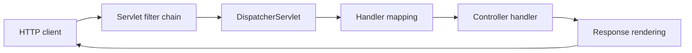
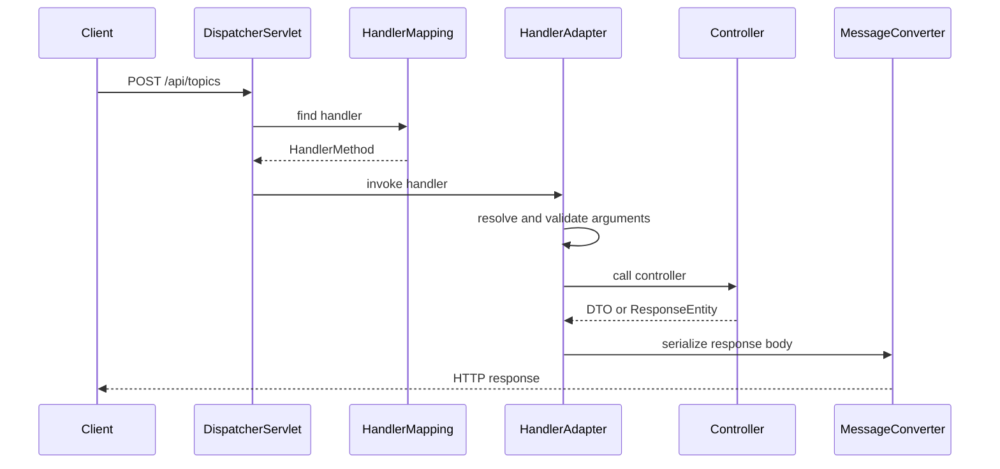
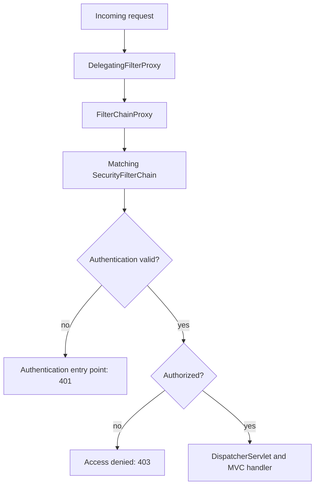

# Spring MVC Request Lifecycle, Filters & Exception Resolution

Spring MVC is Spring's servlet-stack web framework: it turns an HTTP request into a selected handler invocation and turns the resulting model or body into an HTTP response.
Its lifecycle spans the servlet container, application filters, the `DispatcherServlet`, mapping and argument-resolution infrastructure, controller code, and response rendering, so it is a frequent source of subtle security and production-performance questions.
Understanding the boundary between these stages makes controllers thinner, error responses consistent, and overload behavior more predictable.

---

## 🟢 Beginner Level

### The Front-Controller Mental Model

Spring MVC is built on the Jakarta Servlet API.
The servlet container accepts a connection and creates an `HttpServletRequest` and `HttpServletResponse` for each HTTP exchange.
The central `DispatcherServlet` is Spring MVC's front controller.
It coordinates request routing instead of making every controller a separately configured servlet.

A controller is application code that handles one meaningful endpoint.
`@GetMapping`, `@PostMapping`, and related annotations describe which HTTP method and path a handler supports.
`@RestController` means return values normally become response bodies.
`@Controller` is also suited to server-rendered views, where a logical view name is resolved to a template.



The diagram omits details deliberately.
Each box can have extension points, but the central idea remains that MVC routes all servlet requests through one coordinating servlet.
This differs from a manual servlet application where each route can contain its own mapping and rendering logic.

### Filters, Interceptors, and Controllers Have Different Jobs

A servlet `Filter` surrounds the request before it reaches the servlet and again when the response returns.
Filters work with generic servlet request and response objects.
They are a natural place for request IDs, CORS handling, security integration, compression, and low-level logging.
They can stop the chain without invoking Spring MVC at all.

A Spring MVC `HandlerInterceptor` runs after Spring has selected a handler but before and after its invocation.
It is useful for handler-aware concerns such as request timing or tenant checks that depend on the selected controller.
It is not a replacement for Spring Security, because an interceptor runs later than a security filter and does not cover every dispatch in the same way.

A controller validates inputs, calls the application layer, and returns an HTTP-oriented result.
It should not be the location for shared authorization parsing, connection lifecycle management, or an ad hoc global error format.
Keeping those responsibilities separated makes their ordering and tests explicit.

| Stage | Scope | Typical responsibility | Can short-circuit? |
|---|---|---|---|
| Servlet filter | Container request/response | CORS, security bridge, request ID | Yes |
| MVC interceptor | Selected handler execution | Timing, handler-aware metadata | Yes, before handler |
| Controller | One endpoint | Input-to-use-case translation | Returns a result |
| Exception resolver | MVC handler failure | Map failures to HTTP response | Yes |
| Message converter | Request or response body | JSON-to-DTO and DTO-to-JSON | Fails with conversion error |

The order is part of correctness.
An authentication failure should usually be decided before expensive argument binding and controller work.
An error formatter should see exceptions consistently instead of relying on every controller to catch them.

### A Small REST Endpoint End to End

Consider a request for a single course topic.
The mapping includes its HTTP method, path variable, and response media type.
Spring resolves `id` from the URI, invokes the method, and asks an `HttpMessageConverter` such as Jackson to serialize the DTO.

```java
@RestController
@RequestMapping("/api/topics")
class TopicController {
    private final TopicService topicService;

    TopicController(TopicService topicService) {
        this.topicService = topicService;
    }

    @GetMapping("/{id}")
    TopicResponse find(@PathVariable long id) {
        return topicService.find(id);
    }
}
```

If no topic exists, the service should communicate a meaningful application outcome.
MVC can map that outcome to `404 Not Found` in one consistent place.
Returning `null` accidentally may instead become an ambiguous empty response or fail later depending on the endpoint contract.
The HTTP status is part of the public API, not decoration applied after business logic finishes.

### Request Data Is Bound, Not Magically Trusted

Spring can bind path variables, query parameters, headers, cookies, multipart data, and request bodies to method parameters.
`@RequestBody` asks a converter to deserialize a body, often JSON, into a Java type.
`@Valid` invokes Jakarta Bean Validation on a bound object when a validator is configured.
`BindingResult` can expose validation errors directly, but a centralized error policy is often clearer for JSON APIs.

Validation must protect boundaries.
It checks shape, required fields, and local rules before expensive use-case execution.
It does not replace authorization, database constraints, or domain invariants that may depend on current state.
For example, a valid positive `quantity` can still exceed live inventory.

---

## 🟡 Intermediate Level

### DispatcherServlet's Dispatch Sequence

On initialization, `DispatcherServlet` discovers strategy objects from the application context or falls back to defaults.
At request time it asks `HandlerMapping` implementations for a matching handler.
For annotation controllers, `RequestMappingHandlerMapping` normally matches request method, path, parameters, headers, consumes, and produces conditions.
The selected `HandlerAdapter` knows how to invoke that handler type.

`RequestMappingHandlerAdapter` coordinates argument resolvers, data binding, validation, return-value handlers, and message conversion for annotation methods.
This is why a controller parameter can be a `@PathVariable`, `@RequestParam`, `@RequestHeader`, principal, locale, or validated body without controller code parsing the raw servlet request.
The extension point is deliberate: custom argument resolvers can make validated application context available without copy-pasting extraction code.



Handler mapping happens before invocation, but a filter already ran before the servlet was entered.
The handler adapter is where a method's annotation-driven conveniences are applied.
Message conversion is not merely a final formatting step: malformed JSON can fail before a controller is called, while an unsupported response type can fail after it returns.

### Content Negotiation and Message Conversion

An `HttpMessageConverter` reads or writes an HTTP body for a Java type and media type.
Jackson's converter commonly handles `application/json` and maps JSON fields to a DTO.
The `Content-Type` request header states the representation the client sent.
The `Accept` header states representations it is prepared to receive.

For a JSON endpoint, malformed syntax typically becomes `400 Bad Request`.
An unsupported incoming media type is normally `415 Unsupported Media Type`.
If the server cannot produce an acceptable representation, the result can be `406 Not Acceptable`.
Treat these as contract failures with stable, safe error bodies rather than stack traces.

DTOs prevent HTTP representation choices from leaking straight into persistence entities.
They allow API field names, validation rules, and compatibility policies to evolve independently.
They also reduce accidental serialization of internal fields, lazy associations, or security-sensitive properties.

```java
record CreateTopicRequest(
        @NotBlank String title,
        @Size(max = 4000) String summary) {}

@PostMapping(consumes = "application/json", produces = "application/json")
ResponseEntity<TopicResponse> create(
        @Valid @RequestBody CreateTopicRequest request) {
    TopicResponse created = topicService.create(request);
    return ResponseEntity.status(HttpStatus.CREATED).body(created);
}
```

Do not deserialize unbounded request data and only then discover it is too large.
Set container and framework body-size limits appropriate to the endpoint, and handle file uploads with separate limits and storage policies.

### Worked Example: Deriving a Latency Budget

Suppose an endpoint has a 250 ms p95 service-level objective.
The edge proxy consumes 20 ms p95, leaving 230 ms for the application and its dependencies.
Authentication takes 15 ms, MVC binding and serialization take 10 ms, and the database call takes 150 ms p95.
The controller and service layer then have only about $230 - 15 - 10 - 150 = 55$ ms p95 for remaining work.

If an interceptor performs a 100 ms remote authorization call synchronously, the endpoint now consumes 295 ms before ordinary scheduling variance.
Moving that work later does not solve the budget; it must be cached, made local, or assigned a stricter timeout.
The arithmetic makes clear why filters and interceptors must not quietly introduce unbounded network dependencies.

At 200 requests per second with a 150 ms average database wait, Little's Law estimates around $200 \times 0.150 = 30$ concurrent requests waiting on the database on average.
That number helps size connection pools and container threads, but it is not a license to set either pool to an arbitrary large value.
Bounded pools protect the database and reveal overload through queue time or explicit rejection.

### Exception Resolution and Error Contracts

If a handler throws, `DispatcherServlet` asks ordered `HandlerExceptionResolver` implementations to produce a response.
Spring includes resolvers for framework exceptions and supports `@ExceptionHandler` methods in controllers or `@ControllerAdvice` classes.
`@RestControllerAdvice` combines global advice with response-body semantics.
This provides one place to convert domain outcomes and malformed input into documented API errors.

Use an error envelope that clients can parse and operators can correlate.
Spring Framework's `ProblemDetail` aligns with the HTTP problem-details shape and can carry a type, title, status, detail, and extension properties.
Do not put exception messages, SQL text, stack traces, or secrets in a public response.
Log diagnostic details with the request ID on the server side instead.

```java
@RestControllerAdvice
class ApiErrors {
    @ExceptionHandler(TopicNotFoundException.class)
    ProblemDetail notFound(TopicNotFoundException exception) {
        ProblemDetail body = ProblemDetail.forStatus(HttpStatus.NOT_FOUND);
        body.setTitle("Topic not found");
        body.setDetail("The requested topic does not exist.");
        return body;
    }
}
```

An exception handler is not a substitute for returning normal domain alternatives where those improve readability.
Use exceptions for exceptional control flow or boundary translation, and preserve error semantics consistently across endpoints.

### Interceptors and Asynchronous Requests

`HandlerInterceptor.preHandle` runs after handler mapping and can block an invocation.
`postHandle` runs after successful handler execution before view rendering, so it is not a general error hook.
`afterCompletion` runs after request completion and receives an exception if one propagated through MVC.
Use it for cleanup and final timing, not for changing a response that may already be committed.

Servlet MVC can support asynchronous return types such as `Callable`, `DeferredResult`, `WebAsyncTask`, and `CompletionStage`.
Async dispatch releases the original servlet thread while work waits or executes elsewhere, then dispatches completion through MVC.
It improves container-thread utilization for suitable long waits.
It does not make a slow dependency fast, remove the need for timeouts, or make mutable request state safe to access from arbitrary threads.

---

## 🔴 Expert Level

### Spring Security's Filter Boundary

Spring Security normally integrates with the servlet container using `DelegatingFilterProxy`.
That proxy delegates to Spring's `FilterChainProxy`, which selects a matching `SecurityFilterChain` for the request.
The chosen chain contains security filters for concerns such as security-context loading, authentication, authorization, exception translation, and headers.
Exact filters and order depend on enabled features and Spring Security version.

Authentication establishes who the request represents.
Authorization decides whether that identity may access the requested resource.
An authentication failure normally leads to an authentication entry point, often `401 Unauthorized` for a missing or invalid credential.
An authenticated principal denied permission normally yields `403 Forbidden` through an access-denied handler.



Security configuration should use the framework's authorization rules and method security where appropriate.
Do not rely on a controller's UI-facing check as the only authorization decision.
Also avoid logging bearer tokens, authorization headers, passwords, or full personally identifiable request bodies in filters.

### Servlet Thread Limits and Backpressure

Each synchronous servlet request occupies a container worker thread while the controller waits on blocking work.
Increasing the thread count can improve throughput when waits are brief and downstream capacity exists.
Beyond a point, it increases context switching, memory consumption, and downstream concurrency until latency collapses.
The limiting resource may be a database connection pool, outbound HTTP pool, CPU, or a remote service quota rather than Tomcat threads.

Apply timeouts at each network boundary and choose bounded admission where a queue is necessary.
Return an intentional overload response such as `503 Service Unavailable` with retry guidance when the service cannot meet its contract.
Queueing every request until the JVM heap fills converts a recoverable overload into a process crash.
Measure queue wait separately from handler execution, because a low controller duration can conceal a high end-to-end latency.

When using virtual threads for servlet work, platform-thread scarcity changes but downstream resource scarcity does not.
Database connection count and remote API rate limits still need explicit bounds.
Do not confuse a cheaper waiting task with an infinite ability to perform work.

### Observability, Dispatch Types, and Safe Logging

Assign or propagate a request correlation ID at the outer filter boundary.
Include it in structured logs, metrics dimensions with controlled cardinality, and error responses where it is safe for clients to quote to support.
Do not use unbounded request paths, user IDs, or exception text as metric labels because high cardinality can damage monitoring systems.

Servlet dispatch types include initial requests as well as error, async, forward, and include dispatches.
`OncePerRequestFilter` is useful when a filter should avoid duplicate work across a request's dispatch lifecycle, subject to its documented async and error dispatch behavior.
An error dispatch can run through different processing paths from the original request, so test error responses with the real container integration.

Sanitize logs.
Record method, route template, status, duration, and an opaque correlation ID.
Redact authorization headers, passwords, access tokens, cookies, and sensitive request bodies.
Observability that leaks secrets is an incident amplifier rather than a diagnostic tool.

### Production Failure Modes

Adding CORS headers in a controller can leave failed authentication, preflight requests, and static resources inconsistent.
Configure CORS at the security or MVC boundary appropriate to the application instead.
Reading a request body in a filter can consume the input stream and prevent later JSON binding unless the request is deliberately wrapped and bounded.

Returning JPA entities directly can trigger lazy-loading failures, N+1 queries, or accidental exposure of internal fields during serialization.
Use DTOs and define fetch behavior for the endpoint's response shape.
Creating an async controller without propagating security context, tracing context, and cancellation can make logs and authorization behavior inconsistent.

An error handler that returns a stack trace may reveal internals to an attacker.
An error handler that maps every exception to `500` hides client mistakes and makes retry behavior unsafe.
Classify known input, authentication, authorization, not-found, conflict, and saturation outcomes deliberately.

### Paths, Proxies, and Request Normalization

An MVC path is interpreted after the servlet container and often after a reverse proxy have handled the request.
Forwarded host, scheme, and prefix headers should be trusted only from configured proxies.
Otherwise a hostile client can influence generated absolute links, redirect targets, or audit information.
Use Spring's forwarded-header support only with a known deployment boundary.

Trailing slashes, URL decoding, matrix variables, and encoded path separators can affect route matching.
Define one canonical public URL shape and test it through the same proxy configuration used in production.
Avoid constructing redirect URLs from raw request parameters without validation.
These details are routing and security behavior, not cosmetic formatting decisions.
Document the normalization policy so clients and gateway maintainers do not invent incompatible assumptions.

### Common Misconceptions

1. **"A controller is the first Spring code to see every request."**
   *Correction*: Servlet filters run before `DispatcherServlet`, and Spring Security normally makes authentication and authorization decisions in a filter chain. A filter can reject a request before MVC finds a handler.

2. **"`@Valid` secures an endpoint."**
   *Correction*: Validation checks input shape and local constraints. It does not authorize a caller, enforce every live domain invariant, or replace database constraints.

3. **"Async MVC makes downstream calls non-blocking."**
   *Correction*: It can release a servlet thread while work waits, but the downstream call may still block a different thread and consume a connection. Timeouts, bounds, and cancellation remain necessary.

4. **"A huge request queue improves availability."**
   *Correction*: A queue beyond the latency budget only stores work that cannot finish on time and can exhaust heap. Bounded queues and explicit rejection preserve a system's ability to recover.

5. **"Spring Security filter order is one fixed list for all applications."**
   *Correction*: The selected filters depend on configuration, enabled mechanisms, and version. Rely on documented configuration and inspect the active chain when diagnosing behavior.

### Interview Questions

**Q1. What is the role of `DispatcherServlet` in Spring MVC?** `[easy]`

`DispatcherServlet` is the front controller that coordinates routing, handler invocation, exception resolution, and response rendering for MVC requests. It delegates matching to `HandlerMapping` and invocation to a suitable `HandlerAdapter`. This centralization makes common web concerns configurable without placing them in each controller.

**Q2. What is the difference between a servlet filter and a Spring MVC interceptor?** `[easy]`

A filter surrounds the servlet-level request and can run before Spring MVC is entered. An interceptor runs after MVC has selected a handler and can therefore use handler-aware context. Security and low-level request policies usually belong at the filter boundary, while handler timing or MVC-specific metadata can suit an interceptor.

**Q3. Why should REST endpoints use DTOs instead of exposing persistence entities?** `[easy]`

DTOs define the HTTP contract independently of persistence mappings and lazy relationships. They prevent accidental serialization of internal or sensitive fields and allow API validation to be explicit. They also avoid coupling a database schema change directly to public JSON behavior.

**Q4. What do `Content-Type` and `Accept` mean in an HTTP request?** `[easy]`

`Content-Type` identifies the representation the client sent, such as JSON in a request body. `Accept` identifies representations the client can receive in a response. Spring uses these headers with mappings and message converters, and a mismatch can produce 415 or 406 responses.

**Q5. How does Spring MVC select and invoke an annotation controller method?** `[medium]`

A `HandlerMapping` matches the request against method, path, headers, parameters, and media conditions and returns a handler method. `RequestMappingHandlerAdapter` resolves method arguments, performs binding and validation, and invokes that method. It then applies return-value handling and message conversion or view resolution according to the result type.

**Q6. What does `@RestControllerAdvice` provide?** `[medium]`

It provides global exception-handling methods with response-body semantics across controllers. `DispatcherServlet` consults exception resolvers when a handler fails, and advice can turn known exceptions into stable HTTP error contracts. It should avoid exposing stack traces or internal exception messages to callers.

**Q7. Why does malformed JSON often return 400 before a controller method runs?** `[medium]`

Spring must deserialize `@RequestBody` data before it can invoke a method that requires that argument. A JSON converter failure occurs during this binding stage, so no controller business code has run. Centralized exception handling can still format the resulting framework exception consistently.

**Q8. Explain authentication versus authorization in a Spring Security request.** `[medium]`

Authentication establishes the identity represented by credentials such as a session, token, or client certificate. Authorization checks whether that identity has permission for the requested resource or operation. Authentication failure commonly routes to a 401 entry point, while authorization failure commonly results in 403.

**Q9. Why is reading a request body in a filter risky?** `[medium]`

Servlet request input streams are generally consumable, so a filter can leave no body for MVC's later message conversion. Rewrapping can help only when done deliberately with strict size controls and an actual need. Logging full bodies also risks leaking credentials and sensitive data.

**Q10. What does async request processing improve, and what does it not solve?** `[medium]`

Async MVC can release the original servlet worker while a long operation waits or completes elsewhere, improving container-thread utilization. It does not make a dependency faster, eliminate blocking in all worker pools, or remove the need for timeout and cancellation policy. Shared mutable request data and security context also need correct propagation.

**Q11. How should a service handle an executor or queue that is saturated?** `[medium]`

It should reject or apply controlled backpressure according to the endpoint's contract rather than queue indefinitely. A clear overload response, bounded queue, and metrics for queue wait protect latency and heap. The policy must account for whether the caller can safely run work itself or must return promptly.

**Q12. Scenario: valid browser requests fail before reaching a controller, but logs show no controller timing entry. Where do you investigate?** `[hard]`

Start at the outer filter chain, including CORS preflight handling, Spring Security authentication, request-size limits, and proxy behavior. A rejection at those stages never reaches handler mapping or an MVC interceptor that times controllers. Correlate proxy and security logs with a request ID, then test the exact method, origin, and headers of the failing request.

**Q13. Scenario: an endpoint has a 250 ms p95 target but p95 rises to 800 ms while controller code reports only 20 ms. What is likely missing from the measurement?** `[hard]`

The controller timer probably excludes queue wait, filters, security calls, connection-pool acquisition, proxy time, or asynchronous completion. Measure a full request span and break it down by each boundary, including database and outbound HTTP waits. Fix the dominant queue or dependency constraint rather than optimizing the already-small controller body.

**Q14. Scenario: an error response exposes SQL fragments and class names to clients after a database exception. What changes are required?** `[hard]`

Replace raw exception serialization with a global, stable error envelope such as `ProblemDetail` and map known errors to appropriate statuses. Log the diagnostic exception server-side with a correlation ID while returning only safe client-facing detail. Review logging, error pages, and proxy behavior too, because a framework fallback can bypass one controller advice path.

### Further Reading

- [Spring Framework MVC annotated-controller reference](https://docs.spring.io/spring-framework/reference/web/webmvc/mvc-controller.html) explains handler mappings, arguments, return values, and message conversion.
- [Spring Framework exception handling reference](https://docs.spring.io/spring-framework/reference/web/webmvc/mvc-controller/ann-exceptionhandler.html) documents `@ExceptionHandler`, controller advice, and error responses.
- [Spring Security servlet architecture](https://docs.spring.io/spring-security/reference/servlet/architecture.html) describes `DelegatingFilterProxy`, `FilterChainProxy`, and security filter chains.
- [Jakarta Servlet `Filter` API](https://jakarta.ee/specifications/servlet/6.0/apidocs/jakarta.servlet/jakarta/servlet/filter) is the primary contract for servlet filters.
