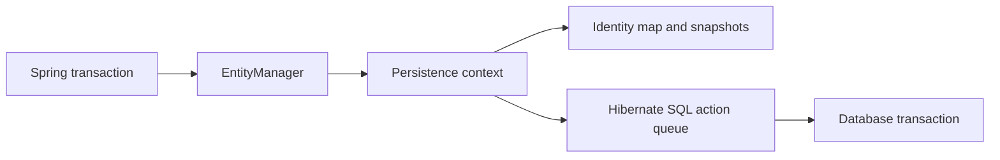
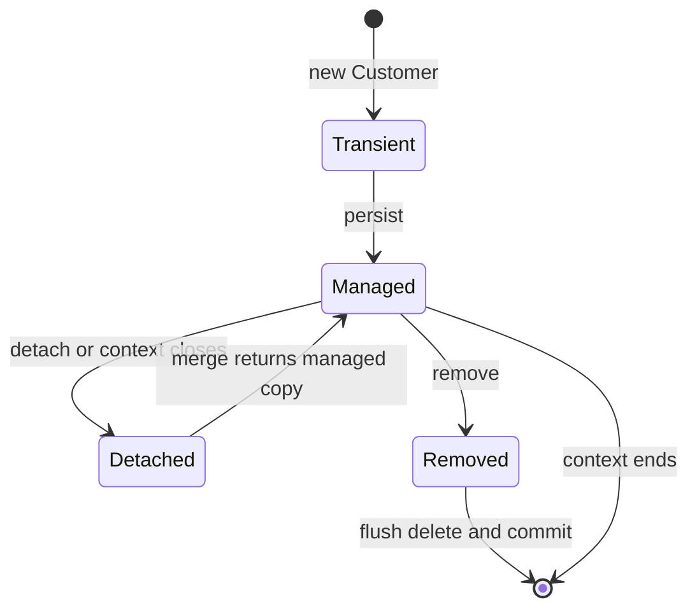
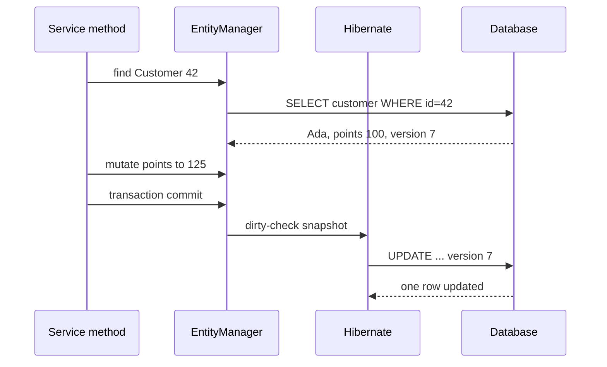
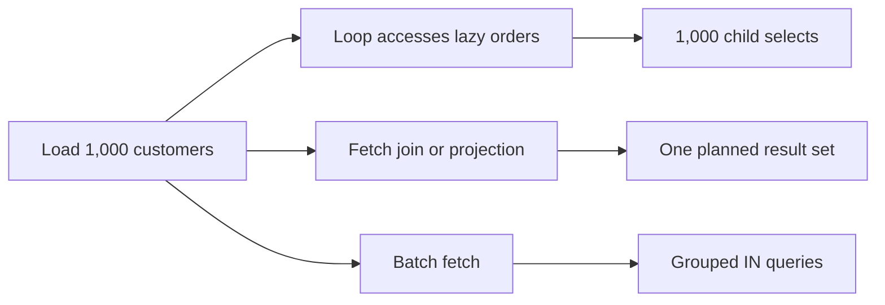

# JPA / Hibernate Entity Lifecycle, Persistence Context, and Query Loading

Jakarta Persistence defines a portable object-relational mapping API, while Hibernate is the implementation most Spring applications use beneath that API. The persistence context tracks entity identity and pending changes for the duration of a unit of work, turning object operations into SQL at controlled boundaries. Interviewers probe this topic because incorrect state transitions, fetching choices, and transaction scope create invisible data bugs and severe database load.

---

## 🟢 Beginner Level

### JPA, Hibernate, and the persistence context

JPA maps Java classes to relational tables.

An entity is an ordinary Java object annotated with mapping metadata such as `@Entity` and `@Id`.

Hibernate translates entity operations into SQL for the configured database dialect.

The `EntityManager` is the JPA interface used to manage entity state.

Hibernate's corresponding native abstraction is `Session`.

The persistence context is an in-memory unit of work associated with that manager.

It is also an identity map.

Within one context, loading the same row identity twice returns the same managed Java object instance.



The persistence context is not a global application cache.

It usually exists only for one transaction or one request-scoped unit of work.

It can reduce duplicate selects within that context.

It does not automatically make stale data correct across multiple transactions.

### The four entity states

An entity can be transient, managed, detached, or removed.

The state determines whether Hibernate tracks mutations and which SQL may be scheduled.



A transient entity is created with `new` and is unknown to the persistence context.

It normally has no database identity assigned yet.

`persist` makes a new entity managed.

A managed entity is tracked by the context and can be changed through ordinary setters.

A detached entity has an identity from a previous context but is no longer tracked.

A removed entity is managed but scheduled for deletion at flush.

### Persist, find, merge, remove, and detach

`persist(entity)` is for a new transient instance.

It makes that same Java instance managed.

The insert may occur immediately or later at flush depending on identifier generation and provider needs.

`find(Customer.class, id)` returns a managed entity if it exists.

It consults the persistence context before issuing SQL.

`getReference` may return a lazy reference without immediately selecting the row.

Accessing a non-identifier property on that reference can trigger a select.

`merge(detached)` copies state from the supplied object into a managed instance.

It returns the managed instance.

The argument passed to `merge` remains detached.

```java
Customer detached = request.customer();
Customer managed = entityManager.merge(detached);
managed.rename("Ada");
// detached is still not tracked by this EntityManager
```

`remove(managed)` marks a managed entity for deletion.

`detach` stops tracking one entity.

`clear` detaches every entity in the current persistence context.

Use these operations deliberately because they change both memory use and update behaviour.

---

## 🟡 Intermediate Level

### Dirty checking and flush timing

Hibernate records a baseline snapshot for many managed entities when it loads them.

Before flushing, it compares current mapped values to that snapshot.

Changed values produce an `UPDATE` without an explicit `save` call for each field.

```java
@Transactional
public void rename(long customerId, String name) {
    Customer customer = entityManager.find(Customer.class, customerId);
    customer.rename(name);
}
```

On transaction commit, Hibernate flushes the pending update before committing the database transaction.

The Java method does not need to call `merge` because `customer` is already managed.

Flush synchronizes in-memory changes with the database.

Commit makes the database transaction durable and visible according to its isolation level.

Flush is therefore not the same as commit.

Hibernate can flush before executing a query when needed to keep query results consistent with pending changes.

Avoid relying on a particular incidental flush point.

Call `flush()` explicitly only when the application must surface a constraint violation or database-generated result before commit.

### Worked example: identity map and dirty update

Assume customer row `42` starts with name `"Ada"` and loyalty points `100`.

The service runs one transaction.

It calls `find(Customer.class, 42)` twice.

The first call executes one select and creates managed object `c1`.

The second call returns the same object, so `c1 == c2` is true.

The service adds `25` points through `c2`.

At flush, Hibernate compares the loaded points `100` with current points `125`.

It schedules an update for row `42`.

```java
@Transactional
public void awardPoints(long id) {
    Customer c1 = entityManager.find(Customer.class, id);
    Customer c2 = entityManager.find(Customer.class, id);
    assert c1 == c2;
    c2.addPoints(25);
}
```

The SQL is conceptually `UPDATE customer SET points = 125 WHERE id = 42`.

With an optimistic `@Version` column equal to `7`, Hibernate typically adds `AND version = 7` and increments it to `8`.

If another transaction already changed that row, the update count is zero and Hibernate throws an optimistic-lock exception.

This prevents a silent lost update.



The example needs one select and one update.

Calling `merge` repeatedly inside the same managed transaction adds confusion and can cause needless state copying.

### Association ownership and cascades

JPA relationships need a clear owning side.

For a bidirectional `@OneToMany` and `@ManyToOne`, the side with the foreign-key mapping owns the database relationship.

In a typical `Customer` and `Order` model, `Order.customer` owns the relationship.

Changing only `Customer.orders` in memory does not necessarily update the foreign key.

Use helper methods that keep both sides consistent.

```java
public void addOrder(Order order) {
    orders.add(order);
    order.setCustomer(this);
}
```

Cascade controls which operations propagate from one entity to an associated entity.

`CascadeType.PERSIST` can save a new child when the parent is persisted.

`CascadeType.REMOVE` can delete children when the parent is deleted.

`orphanRemoval = true` deletes a child removed from a managed collection when the relationship semantics say that child cannot exist independently.

These are domain-lifecycle decisions, not convenience switches.

Never apply `CascadeType.ALL` automatically to a shared association such as `@ManyToMany` users and roles.

### Fetching is a query design decision

`LAZY` means a relationship may be represented by a proxy or persistent collection and loaded when accessed.

`EAGER` asks the provider to make related state available immediately, but it does not guarantee one efficient SQL shape.

The default fetch types are historical defaults, not a query plan.

| Strategy | Strength | Failure mode | Best use |
|---|---|---|---|
| Lazy association | Avoids unused data | N+1 queries or lazy-init failure | Default domain mapping |
| Eager association | Convenient immediate graph | Large joins, extra selects, unbounded graphs | Small always-needed reference |
| JPQL `join fetch` | Request-specific SQL shape | Duplicate parent rows for collections | Known read view |
| Entity graph | Reusable fetch plan | Can conceal query cost | Named API read paths |
| Batch fetching | Reduces repeated lazy selects | Still multiple SQL statements | Many similar references |

Keep mappings mostly lazy.

Choose the fetch plan at the repository query that serves the endpoint.

That keeps a controller from accidentally determining SQL through serialization.

---

## 🔴 Expert Level

### The N+1 query problem and its remedies

N+1 occurs when one query loads a parent list and later code lazily loads an association for each parent.

For 1,000 customers, a loop that accesses `customer.getOrders()` can issue 1 query for customers plus 1,000 child queries.

That is 1,001 round trips, not merely a minor ORM inefficiency.

If each database round trip costs 3 ms when queued, the serial waiting component alone can approach 3 seconds.

```java
List<Customer> customers = entityManager
    .createQuery("select c from Customer c", Customer.class)
    .getResultList();

for (Customer customer : customers) {
    report.add(customer.getOrders().size());
}
```

Use a fetch join when the endpoint needs the associated records.

```java
select distinct c from Customer c left join fetch c.orders
```

Use pagination carefully with collection fetch joins because row multiplication can make page boundaries incorrect.

An entity graph offers a declarative alternative for a named attribute set.

Hibernate batch fetching can convert many individual selects into grouped `IN` queries.

DTO projections can be better than entities for reporting screens that need only selected columns.



The correct remedy follows the required result shape.

Fetch joining every association to suppress N+1 can create a Cartesian-product explosion.

### Transaction scope, proxies, and lazy initialization

A lazy proxy needs an open persistence context when it initializes.

Accessing `customer.getOrders()` after the transaction and context close can throw `LazyInitializationException`.

The durable fix is to fetch the data needed by the use case inside a transaction and map it to a response DTO.

Open Session in View keeps the context open through web rendering.

It can hide lazy failures but moves SQL into the view layer and can hold resources longer than intended.

Do not cure lazy initialization failures by marking every association eager.

Spring's @Transactional annotation normally works through an AOP proxy around the service bean.

When an external caller enters the proxied method, the interceptor opens or joins a database transaction and binds an EntityManager to the current execution context.

That EntityManager owns the persistence context, so entities loaded during the method remain managed and lazy proxies can initialize while the boundary is active.

At normal return, the persistence context flushes pending changes before the transaction commits; a matching runtime failure normally marks the transaction for rollback.

Calling a transactional method through `this.someMethod()` bypasses the Spring proxy.

The inner call therefore does not create its declared propagation boundary, and a method reached without an outer transaction may have no transaction-scoped persistence context at all.

Put transaction boundaries on public service entry points or move the operation to another bean when separate proxy interception is required.

### Optimistic locking and bulk operations

`@Version` adds a version column used to detect conflicting updates.

Each update checks that the database version still equals the version seen by the managed entity.

An update that affects zero rows signals a concurrent modification.

The application can return a conflict response, reload, or apply a domain-specific retry.

Bulk JPQL updates and deletes bypass the normal managed-entity dirty-checking path.

They can leave already-managed entities stale in the persistence context.

Flush pending work before a bulk query when required, then clear or refresh affected managed entities afterward.

Native SQL has the same coherence concern.

### Production failure modes and observability

Enable SQL and bind-parameter logging only carefully in development or incident windows.

Full production logging can expose personal data and significantly increase I/O.

Use metrics for query count, connection-pool wait, transaction duration, and slow query latency.

Use database query plans for expensive SQL rather than assuming an ORM annotation adds an index.

Long transactions hold database connections and can retain a large persistence context.

For batch writes, periodically flush and clear to prevent thousands of managed entities from accumulating in memory.

```java
for (int i = 0; i < imports.size(); i++) {
    entityManager.persist(imports.get(i));
    if ((i + 1) % 50 == 0) {
        entityManager.flush();
        entityManager.clear();
    }
}
```

The batch size should be measured against JDBC batching, database limits, and memory budget.

Clearing also detaches earlier objects, so code must not expect later mutations to be tracked.

### Common Misconceptions

1. **"`merge` attaches the supplied detached object."**
   *Correction*: `merge` copies its state into a managed instance and returns that managed instance. Continue working with the returned instance, not the original detached argument.

2. **"Dirty checking writes SQL every time a setter runs."**
   *Correction*: Hibernate normally compares state at flush and schedules SQL then. Multiple in-memory changes can become one update, although queries and identifier generation can force earlier SQL.

3. **"EAGER prevents N+1 and is the safe default."**
   *Correction*: Eager mappings can still use multiple selects and can inflate unrelated queries. Fetch plans should be chosen per use case, with SQL count and row count observed.

4. **"The first-level cache is a cluster cache."**
   *Correction*: It belongs to one persistence context and is always present. A second-level cache is separate, optional, shared, and must have explicit invalidation and consistency semantics.

5. **"A transaction means every loaded entity remains fresh."**
   *Correction*: The identity map can return the same managed instance even if another transaction changed the row. Use isolation choices, versioning, refresh, or a new transaction when freshness is required.

### Interview Questions

**Q1. What are the four JPA entity lifecycle states?** `[easy]`

Transient entities are new and unknown to a persistence context, managed entities are tracked, detached entities have identity but are not tracked, and removed entities are scheduled for deletion. State determines whether mutations are discovered automatically and whether operations such as `remove` are legal. The transition matters because the same Java object can have a database id yet still be detached.

**Q2. What does `persist` do differently from `merge`?** `[easy]`

`persist` makes a new transient instance managed and normally schedules an insert. `merge` copies state from a detached or transient argument into a managed instance and returns that managed instance. The supplied merge argument remains unmanaged, which is a common source of lost mutations after merge.

**Q3. What is Hibernate dirty checking?** `[easy]`

Hibernate observes managed entity state and compares it with a loaded snapshot when the persistence context flushes. Differences become SQL updates without an explicit repository save for each setter. This is convenient inside a small transaction but can schedule surprising writes if code mutates entities accidentally.

**Q4. Why can the same `find` call avoid a second SQL query?** `[easy]`

The persistence context acts as a first-level identity map keyed by entity type and identifier. Once a row is managed, another `find` for that identity returns the same Java instance in that context. The benefit is consistency within the unit of work, but it also means the object may not reflect an external concurrent update.

**Q5. What is the difference between flush and commit?** `[medium]`

Flush sends pending entity changes to the database so SQL constraints and queries can observe them in the current transaction. Commit finalizes the database transaction and makes its effects durable and visible according to isolation rules. A flush can occur more than once before one commit, and a later rollback can still undo flushed work.

**Q6. What causes the N+1 query problem?** `[medium]`

It occurs when code loads a parent collection with one query and accesses a lazy association once per parent. Each access initiates another select, turning an apparently small loop into hundreds or thousands of round trips. Use a fetch join, entity graph, batch fetching, or DTO projection based on the read shape.

**Q7. Why is `CascadeType.REMOVE` dangerous on shared relationships?** `[medium]`

Remove cascade propagates parent deletion to associated entities, which is correct only when the child lifecycle is exclusively owned by the parent. On shared entities such as roles, tags, or users, it can delete data still referenced elsewhere. Model ownership explicitly and use database constraints to reinforce it.

**Q8. What is the owning side of a bidirectional association?** `[medium]`

The owning side is the association mapping that writes the foreign key or join table. Hibernate uses changes to that side when synchronizing the relationship to the database. Helper methods should update both object references so in-memory navigation and generated SQL agree.

**Q9. How does optimistic locking prevent lost updates?** `[medium]`

An entity with `@Version` includes its previously read version in the update predicate. A concurrent update changes that version, so the stale update affects zero rows and produces an optimistic-lock exception. The application must then surface a conflict or retry using a domain-safe policy rather than silently overwriting data.

**Q10. When are DTO projections preferable to entity loading?** `[medium]`

DTO projections are preferable for read-only views that need a specific subset of fields or aggregates rather than a mutable domain graph. They prevent accidental lazy traversal during serialization and can reduce row width and object allocation. The trade-off is that projections are query-specific and do not provide managed update semantics.

**Q11. Scenario: an endpoint loading 1,000 customers takes 3.2 seconds and emits 1,001 selects. What is your first fix?** `[hard]`

First identify the association accessed in the response loop and define the exact endpoint result shape. Use a fetch join or entity graph for that association, or a DTO projection if only summary fields are required, then verify query count and row multiplication with SQL metrics. Do not globally switch the mapping to eager because another endpoint may need a different graph and could become slower.

**Q12. Scenario: a controller throws `LazyInitializationException` while serializing an order response. How do you fix it?** `[hard]`

The controller is accessing a lazy association after its persistence context has closed. Fetch the required graph inside a service transaction and map it to a response DTO before returning, with an explicit repository fetch plan. Avoid relying on Open Session in View or universal eager fetching because they hide query ownership and can create production N+1 load.

**Q13. Why can bulk JPQL updates make managed entities stale?** `[hard]`

Bulk JPQL executes directly against rows and bypasses Hibernate's per-entity dirty checking and snapshot maintenance. Managed objects already in the persistence context still contain their old field values after the database changes. Flush pending work before the bulk operation when needed, then clear, refresh, or start a new context before using those entities.

**Q14. How should a batch import avoid exhausting persistence-context memory?** `[hard]`

Persist in measured chunks and call `flush` followed by `clear`, for example after every 50 or 100 rows depending on database and heap behaviour. Flushing allows JDBC work to be sent and clearing releases managed snapshots from the first-level context. The trade-off is that earlier entities become detached, so subsequent relationships and error recovery need explicit handling.

### Further Reading

- [Jakarta Persistence specification](https://jakarta.ee/specifications/persistence/3.1/jakarta-persistence-spec-3.1) defines entity state, persistence contexts, and relationships.
- [Hibernate ORM user guide: persistence context](https://docs.hibernate.org/orm/current/userguide/html_single/Hibernate_User_Guide.html#pc) covers managed entities, flush, and dirty checking.
- [Hibernate ORM user guide: fetching](https://docs.hibernate.org/orm/current/userguide/html_single/Hibernate_User_Guide.html#fetching) explains fetch joins, batch fetching, and association loading.
- [Hibernate ORM user guide: optimistic locking](https://docs.hibernate.org/orm/current/userguide/html_single/Hibernate_User_Guide.html#locking-optimistic) details version-based concurrency control.
