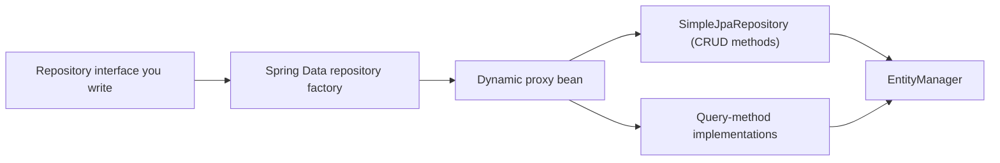
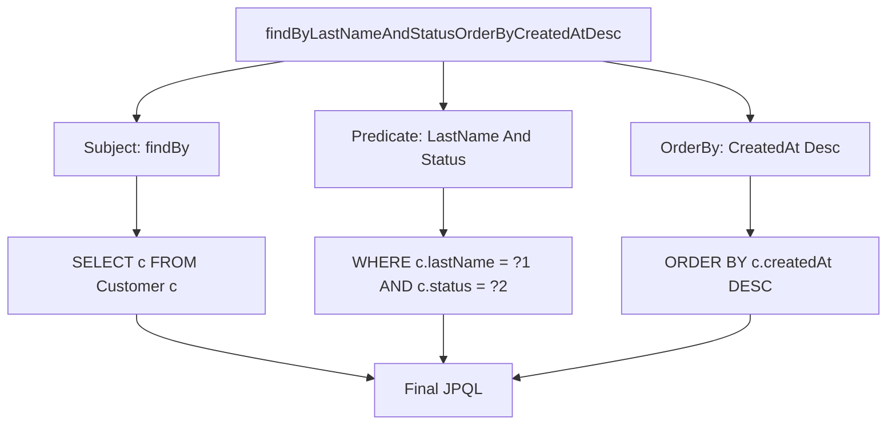
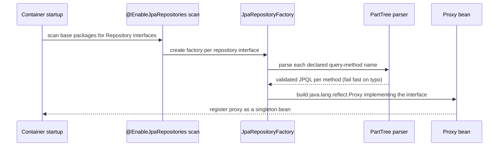

# Spring Data JPA Repositories & Query Derivation

Spring Data JPA sits on top of the JPA/Hibernate persistence layer and removes the boilerplate of writing a DAO by hand: declare an interface, and Spring generates a working implementation at startup. Interviewers probe this topic because the generated implementation is not magic — it is a proxy backed by a real query-derivation algorithm, and misunderstanding how that algorithm works produces slow, wrong, or silently N+1-prone queries in production code that looks perfectly clean.

---

## 🟢 Beginner Level

### What a Spring Data repository actually is

A repository interface has no implementation class in your source tree.

You write `interface CustomerRepository extends JpaRepository<Customer, Long> {}` and nothing else.

At application startup, Spring Data creates a concrete implementation and registers it as a bean.

That implementation delegates ordinary CRUD calls to a shared class, `SimpleJpaRepository`, which itself uses the `EntityManager` covered in `jpa-hibernate-lifecycle` — this topic is about the repository layer built on top of that EntityManager, not a replacement for it.



The interface never needs a `@Repository` or `@Service` annotation to be found.

Spring Data's component scan looks for interfaces extending its marker interfaces, not for stereotype annotations.

### The repository interface hierarchy

`Repository<T, ID>` is the empty marker interface at the root; it exists only so Spring Data can recognize a type as a repository.

`CrudRepository<T, ID>` adds `save`, `findById`, `existsById`, `findAll`, `count`, and `deleteById`.

`PagingAndSortingRepository<T, ID>` adds `findAll(Pageable)` and `findAll(Sort)`.

`JpaRepository<T, ID>` extends both and adds JPA-specific conveniences: batch `saveAll`, `flush`, and `deleteAllInBatch`.

| Interface | Adds | Typical use |
|---|---|---|
| `Repository<T, ID>` | Nothing — marker only | Never extended directly in practice |
| `CrudRepository<T, ID>` | Basic save/find/delete | Minimal repositories, no pagination needed |
| `PagingAndSortingRepository<T, ID>` | `Pageable`/`Sort` overloads | Repositories that need paged reads |
| `JpaRepository<T, ID>` | Batch operations, `flush()`, JPA-specific returns | The default choice for almost every Spring Boot app |

Almost every real repository extends `JpaRepository`, because it is a strict superset and the extra methods cost nothing until called.

### Basic CRUD through JpaRepository

```java
public interface CustomerRepository extends JpaRepository<Customer, Long> {
}
```

That single line gives you `save`, `findById`, `findAll`, `delete`, `count`, and more, fully implemented.

```java
Customer saved = customerRepository.save(new Customer("Ada"));
Optional<Customer> found = customerRepository.findById(saved.getId());
customerRepository.delete(saved);
```

`save` behaves like `persist` for a new entity and like `merge` for a detached entity with a non-null id — Spring Data decides which by checking whether the id is null or whether the entity implements `Persistable` and reports itself as new.

`findById` returns `Optional<T>`, not a possibly-null reference, which forces callers to handle the missing-row case explicitly.

### Registering and scanning repositories

Spring Boot's auto-configuration enables `@EnableJpaRepositories` implicitly when Spring Data JPA is on the classpath and a `DataSource` bean exists.

It scans the package of the main application class and its sub-packages for repository interfaces by default.

A repository interface placed outside that package tree is silently never picked up — no error, just a missing bean at the injection point, which surfaces as a startup `NoSuchBeanDefinitionException` wherever it is autowired.

This scan-by-package-tree behavior is the same reason a repository interface in a shared library module, added without also configuring an explicit `basePackages`, frequently fails to be discovered in a multi-module build.

`@EnableJpaRepositories(basePackages = "com.example.shared.data")` fixes that by widening the scan explicitly, at the cost of one more line of configuration to keep in sync as packages move.

---

## 🟡 Intermediate Level

### Derived query methods — parsing a method name into a query

Spring Data parses the method name itself as a query specification.

`findByLastNameAndStatus(String lastName, Status status)` is decomposed into subject (`findBy`), and a predicate tree built from the property expressions `LastName` and `Status`, joined by `And`.



The generated JPQL for that method is conceptually:

```sql
SELECT c FROM Customer c
WHERE c.lastName = ?1 AND c.status = ?2
ORDER BY c.createdAt DESC
```

Property expressions can traverse associations using the property name: `findByOrders_Status(Status status)` or the equivalent camelCase `findByOrdersStatus` navigates from `Customer.orders` into `Order.status`, producing an implicit join.

Keyword support extends beyond equality: `findByAgeGreaterThan`, `findByNameContainingIgnoreCase`, `findByCreatedAtBetween`, `findByStatusIn(Collection<Status>)`, and `findByDeletedAtIsNull` are all valid, each mapping to a specific JPQL predicate fragment.

`countBy`, `existsBy`, and `deleteBy` prefixes work the same way but change the return type and the generated statement shape instead of the `SELECT` clause.

### Worked example: from method name to executed SQL

Assume `CustomerRepository` declares:

```java
List<Customer> findTop5ByStatusOrderByLoyaltyPointsDesc(Status status);
```

At startup, Spring Data's `PartTree` parser splits `findTop5ByStatusOrderByLoyaltyPointsDesc` into a limiting clause (`Top5`), a subject (`findBy`), a predicate (`Status`), and an order clause (`LoyaltyPoints Desc`).

It validates `status` and `loyaltyPoints` against `Customer`'s mapped properties at that point — an unmapped property name fails **at application startup**, not at first call, because the query is built once when the proxy bean is created.

The resulting JPQL is `SELECT c FROM Customer c WHERE c.status = ?1 ORDER BY c.loyaltyPoints DESC`, executed through the same `EntityManager.createQuery(...).setMaxResults(5)` path a hand-written JPQL query would use.

Calling `findTop5ByStatusOrderByLoyaltyPointsDesc(Status.ACTIVE)` issues exactly one `SELECT` with a `LIMIT 5` (or the dialect's equivalent) — no extra round trip for validating the method name, because that validation already happened once at boot.

This is why a typo in a derived method name (`findByLastNam` instead of `findByLastName`) is a fail-fast startup error in a Spring Boot application, not a runtime surprise discovered by a user.

### `@Query` — JPQL and native SQL

Derived names stop being readable once a query needs more than 3-4 conditions or any aggregation.

`@Query` lets you write the JPQL (or native SQL) directly on the method:

```java
@Query("SELECT c FROM Customer c WHERE c.status = :status AND c.loyaltyPoints >= :minPoints")
List<Customer> findQualifyingCustomers(@Param("status") Status status, @Param("minPoints") int minPoints);
```

Named parameters (`:status`) bound via `@Param` are preferred over positional parameters (`?1`) because they survive a reordering of method arguments without breaking.

`@Query(value = "...", nativeQuery = true)` bypasses JPQL entirely and runs raw SQL against the configured database — useful for database-specific functions JPQL cannot express, at the cost of portability across database vendors.

| Approach | Portable across DBs | Validated at startup | Best for |
|---|---|---|---|
| Derived method name | Yes | Yes | Simple predicates, 1-3 conditions |
| `@Query` (JPQL) | Yes | Yes (JPQL syntax checked) | Complex conditions, joins, aggregates |
| `@Query(nativeQuery = true)` | No | No (SQL only checked at first call) | Vendor-specific functions, hints |
| `Specification` / Querydsl | Yes | N/A (built at runtime) | Fully dynamic filter combinations |

### Pagination and sorting

`findAll(Pageable pageable)` returns a `Page<T>`, which carries the content, the total element count, and page metadata.

```java
Pageable page = PageRequest.of(0, 20, Sort.by("loyaltyPoints").descending());
Page<Customer> result = customerRepository.findAll(page);
```

Computing `Page<T>.getTotalElements()` requires a second query — a `SELECT count(c) FROM Customer c` with the same `WHERE` clause — so a paged endpoint issues two round trips per call, not one.

`Slice<T>` is the lighter alternative: it knows only whether a next page exists (by fetching `pageSize + 1` rows) and skips the count query entirely, which matters for large tables where `COUNT(*)` itself is expensive.

Sorting can also be appended directly to a derived method name (`findByStatusOrderByCreatedAtDesc`) instead of passed as a `Sort` parameter, but a caller-supplied `Sort` is more flexible for endpoints that expose sortable columns to a client.

### Projections — interface-based and DTO

A projection restricts the selected columns instead of loading a full managed entity.

**Closed interface projection** — an interface whose getters name a subset of the entity's properties:

```java
public interface CustomerSummary {
    String getLastName();
    int getLoyaltyPoints();
}

List<CustomerSummary> findByStatus(Status status);
```

Spring Data generates a query that selects only those two columns and backs the interface with a lightweight proxy — no full `Customer` entity is loaded, and the result is not managed by the persistence context.

**DTO (class-based) projection** uses a JPQL constructor expression instead:

```java
@Query("SELECT new com.example.CustomerDto(c.lastName, c.loyaltyPoints) FROM Customer c WHERE c.status = :status")
List<CustomerDto> findSummariesByStatus(@Param("status") Status status);
```

The DTO's constructor must match the selected expression list exactly in order and type — a mismatch is a JPQL compilation error caught at startup, the same fail-fast guarantee derived methods get.

Interface projections read cleaner for simple field subsets; DTO projections are the better choice once the projection needs computed values or is shared outside the repository layer.

### Auditing: timestamps and change tracking without repository code

Spring Data JPA can populate creation and modification metadata automatically, without any code in the repository or service layer.

```java
@Entity
@EntityListeners(AuditingEntityListener.class)
public class Customer {
    @CreatedDate
    private Instant createdAt;

    @LastModifiedDate
    private Instant updatedAt;

    @CreatedBy
    private String createdByUser;
}
```

`@EnableJpaAuditing` on a configuration class activates a JPA entity listener, `AuditingEntityListener`, which hooks into the same `@PrePersist`/`@PreUpdate` JPA lifecycle callbacks Hibernate already fires for every entity — it does not add a separate mechanism, it plugs into the existing one.

`@CreatedBy`/`@LastModifiedBy` need an `AuditorAware<T>` bean supplying the current user, typically read from the security context — without that bean registered, those two fields silently stay `null` rather than failing startup, which is a common source of "why is createdBy empty" bug reports.

This auditing metadata is populated at flush time, alongside the dirty-checking pass `jpa-hibernate-lifecycle` describes — it is not a separate database round trip, just additional field assignment before the same `INSERT`/`UPDATE` statement is built.

### `@Modifying` queries

A `@Query` that performs an `UPDATE` or `DELETE` needs `@Modifying` on the method, or Spring Data throws an `InvalidDataAccessApiUsageException` at call time.

```java
@Modifying
@Query("UPDATE Customer c SET c.status = :status WHERE c.lastLoginAt < :cutoff")
int deactivateStaleCustomers(@Param("status") Status status, @Param("cutoff") Instant cutoff);
```

This executes as bulk JPQL directly against the rows, the same mechanism `jpa-hibernate-lifecycle` covers under "bulk operations" — it bypasses per-entity dirty checking, so managed instances already in the persistence context can go stale.

`@Modifying(clearAutomatically = true)` clears the persistence context after the bulk statement runs, preventing later code in the same transaction from reading pre-update values off a stale managed entity.

---

## 🔴 Expert Level

### How the repository proxy is actually built

Spring Data's `JpaRepositoryFactoryBean` is itself a Spring `FactoryBean` — a bean whose job is to produce another bean, the pattern `spring-bean-lifecycle` covers for infrastructure beans in general.



Every derived-method name is parsed and validated once, during this startup phase, not lazily on first invocation — this is the mechanism behind the earlier claim that a misspelled property name in a method name fails at boot.

The proxy's `InvocationHandler` routes each call: known `CrudRepository` methods go to a shared `SimpleJpaRepository` instance; query-derivation methods go to a pre-built `RepositoryQuery` that already holds the parsed JPQL; custom fragment methods (below) go to your own implementation bean.

### Custom repository implementations (fragments)

A repository sometimes needs logic Spring Data cannot derive or express in JPQL — dynamic criteria queries, batch operations with custom flushing, or calls into a non-JPA API.

The pattern is a fragment interface plus an implementation class, wired together by naming convention:

```java
public interface CustomerRepositoryCustom {
    List<Customer> findByDynamicCriteria(CustomerSearchCriteria criteria);
}

public class CustomerRepositoryImpl implements CustomerRepositoryCustom {
    @PersistenceContext
    private EntityManager entityManager;

    @Override
    public List<Customer> findByDynamicCriteria(CustomerSearchCriteria criteria) {
        // CriteriaBuilder or Querydsl logic here
    }
}

public interface CustomerRepository extends JpaRepository<Customer, Long>, CustomerRepositoryCustom {
}
```

The implementation class name must be the fragment interface name with an `Impl` suffix (configurable, but that is the default Spring Data looks for) so the factory can find and wire it into the composed proxy automatically.

`Specification<T>` (from `JpaSpecificationExecutor<T>`) is the built-in alternative to a hand-rolled fragment for the common case of composable, optional filter predicates — combine multiple `Specification` instances with `.and()`/`.or()` to build a dynamic `WHERE` clause without string concatenation.

Each `Specification` is a small functional object that builds a `Predicate` from a `CriteriaBuilder`, so an optional filter simply contributes nothing when its underlying value is absent, instead of requiring a chain of `if` statements around string-concatenated JPQL. This composability is exactly what a derived method name cannot express: a derived name is fixed at compile time, while a `Specification` chain is assembled at runtime from whatever filters the caller actually supplied.

### Transactions around repository calls

`SimpleJpaRepository` itself is annotated `@Transactional(readOnly = true)` at the class level, with individual write methods (`save`, `delete`) marked `@Transactional` to override that default.

That means a bare call to `customerRepository.save(...)` from outside any service-level `@Transactional` boundary still runs inside its own short transaction — but each derived-query call gets its **own** transaction unless it participates in an existing one, which matters when several repository calls need to be atomic together.

A service method wrapping two repository calls in one `@Transactional` boundary makes both participate in the same transaction (`REQUIRED` propagation, the default) rather than each committing independently — the same propagation mechanics `spring-caching-async` and `spring-bean-lifecycle` describe for the `@Transactional` AOP proxy in general.

Calling a second repository method from inside a `@Transactional` service method after a `@Modifying(clearAutomatically = true)` query ran earlier in that same method can return freshly-reloaded data instead of a stale managed instance — the clear takes effect immediately, within the same transaction, not only after commit.

### Query-derivation limits and when to stop

Property-expression method names lose readability past 3-4 conditions, and Spring Data does not optimize the generated JPQL differently based on method-name complexity — a 6-condition derived method and the equivalent `@Query` JPQL produce comparable SQL, so the tradeoff is purely about the source code's clarity, not runtime performance.

Derived methods also cannot express aggregation functions (`AVG`, `SUM` over groups), subqueries, or database-specific query hints — those require `@Query`, a `Specification`, or a native query.

The `N+1` risk `jpa-hibernate-lifecycle` describes for lazy associations applies identically to entities returned from repository methods; a derived or `@Query` method that returns `List<Customer>` and is then iterated to access `customer.getOrders()` produces the same N+1 pattern regardless of which layer issued the initial `SELECT`. Fix it the same way: a fetch join, an entity graph, or a projection that never needs the association at all.

A repository interface is also not the right place for cross-entity orchestration — a method that needs to update two different aggregates (say, decrementing inventory and creating an order) belongs in a service method wrapping two focused repository calls in one transaction, not in a single repository query trying to do both. Keeping repository methods scoped to one aggregate root keeps the generated queries simple enough for `PartTree` to parse and keeps transaction boundaries visible at the service layer where they belong.

### Common Misconceptions

1. **"`CrudRepository` and `JpaRepository` are interchangeable in practice."**
   *Correction*: `JpaRepository` is a strict superset and is almost always the right default; choosing `CrudRepository` only makes sense when you deliberately want to hide batch and JPA-specific operations from callers, which is rare.

2. **"A derived query method name is documentation Spring reads at runtime, like a comment."**
   *Correction*: The name is parsed into an executable query once, at startup, via `PartTree`. A property-name typo is a startup failure, not a silent no-op — this is closer to compile-time validation than to a runtime convention.

3. **"`@Query` always needs `@Modifying`."**
   *Correction*: `@Modifying` is only required for `UPDATE`/`DELETE` JPQL. A read-only `@Query` with a `SELECT` needs no such annotation.

4. **"`Pageable` makes pagination essentially free."**
   *Correction*: `findAll(Pageable)` issues a `COUNT` query in addition to the paged `SELECT`. On a large table, that count can dominate the query's cost — use `Slice<T>` when the total count is not actually needed.

5. **"Every repository method shares one implicit transaction with the calling service method."**
   *Correction*: `SimpleJpaRepository`'s own methods carry their own `@Transactional` boundaries. They join an existing transaction if the caller has one open, but a bare unwrapped call still runs, and commits, on its own.

### Interview Questions

**Q1. What is the minimum code needed to get a working `save`/`findById`/`delete` repository for an entity?** `[easy]`

An interface extending `JpaRepository<EntityType, IdType>` with no method bodies. Spring Data's repository factory generates a proxy implementation at startup and registers it as a bean, backed by `SimpleJpaRepository` for the inherited CRUD methods. No `@Repository` annotation or manual bean registration is required.

**Q2. What does `findById` return, and why not a plain nullable reference?** `[easy]`

It returns `Optional<T>`. Forcing the `Optional` wrapper makes the missing-row case visible at the call site instead of relying on a null check the caller might forget; the type signature itself documents that the row may not exist.

**Q3. What is the difference between `JpaRepository` and `PagingAndSortingRepository`?** `[easy]`

`PagingAndSortingRepository` adds `findAll(Pageable)` and `findAll(Sort)` on top of `CrudRepository`. `JpaRepository` extends both and layers on JPA-specific conveniences such as batch `saveAll`, explicit `flush()`, and JPA-flavored return types; it is the interface almost every application should extend by default.

**Q4. Why does a typo in a derived method name fail the application at startup rather than at first call?** `[easy]`

Spring Data's `PartTree` parser decomposes and validates every derived method name against the entity's mapped properties when the repository proxy bean is created during container startup. An unmapped property name in the method name is therefore a bean-creation failure, not a runtime `NoSuchElement`-style surprise on first use. This is the same fail-fast guarantee `@Query` gets from JPQL syntax checking, and it is one reason teams prefer Spring Data repositories over hand-written string-concatenated queries that only fail when a specific code path finally executes.

**Q5. How does Spring Data turn `findByLastNameAndStatus` into a query?** `[medium]`

It splits the method name into a subject (`findBy`) and a predicate expression tree built from the property names `LastName` and `Status`, joined by the `And` keyword. That tree becomes JPQL equivalent to `SELECT e FROM Entity e WHERE e.lastName = ?1 AND e.status = ?2`, executed the same way a hand-written JPQL query would be. The parsing happens once at startup rather than per invocation, so the runtime cost of calling the method is identical to calling an equivalent hand-written `@Query`.

**Q6. When should you write `@Query` instead of relying on a derived method name?** `[medium]`

Once a predicate needs more than roughly 3-4 conditions, involves aggregation, or needs a join shape a property-expression name cannot express cleanly, a derived name becomes unreadable without any performance benefit over `@Query`. `@Query` with named parameters keeps the query portable and still validated at startup, unlike a native query. Aggregation functions such as `AVG` or `SUM` over a grouped result cannot be expressed as a derived method name at all, so `@Query` is not just a readability choice in that case but a hard requirement.

**Q7. Why is `Pageable`-based pagination more expensive than it looks?** `[medium]`

`findAll(Pageable)` issues two queries: the paged `SELECT ... LIMIT/OFFSET` and a separate `SELECT count(*)` with the same filter to populate `Page.getTotalElements()`. On a large table that count can be the more expensive of the two; `Slice<T>` avoids it by only checking for a next page via an `pageSize + 1` fetch.

**Q8. What is the practical difference between an interface projection and a DTO projection?** `[medium]`

An interface projection is a proxy Spring Data builds over a partial-column query result, matched to the interface's getter names; it stays entirely inside repository-return conventions. A DTO projection uses an explicit JPQL constructor expression (`new com.example.Dto(...)`) and is a plain object, easier to pass across layers or serialize, but the constructor argument list and order must match the selected expressions exactly.

**Q9. Why must a modifying `@Query` be annotated `@Modifying`?** `[medium]`

Without it, Spring Data assumes the query returns a result set and throws `InvalidDataAccessApiUsageException` when it encounters an `UPDATE`/`DELETE` statement instead. `@Modifying` tells the proxy to execute the statement via `Query.executeUpdate()` and return the affected-row count. It is a deliberate guard rail: a `SELECT`-shaped method that accidentally contained a destructive statement would otherwise fail in a confusing way rather than being rejected outright at the framework level.

**Q10. Why can a `@Modifying` bulk update leave already-loaded entities stale?** `[medium]`

Bulk JPQL executes directly against database rows and bypasses Hibernate's per-entity dirty-checking and snapshot machinery entirely — the same mechanism `jpa-hibernate-lifecycle` describes for bulk operations in general. Any entity already managed in the persistence context keeps its old in-memory field values until it is refreshed, cleared, or reloaded; `clearAutomatically = true` handles this by detaching the context immediately after the bulk statement runs.

**Q11. Scenario: adding a repository interface in a utility module outside the main application package causes a `NoSuchBeanDefinitionException` at startup. Why, and what's the fix?** `[hard]`

`@EnableJpaRepositories` (enabled implicitly by Spring Boot auto-configuration) scans from the main application class's package downward by default; an interface outside that tree is never discovered, so no proxy bean is ever created for it, and injecting it fails with a missing-bean error rather than a repository-specific one. The fix is either moving the interface under the scanned package tree or explicitly widening `@EnableJpaRepositories(basePackages = ...)`.

**Q12. Scenario: a paginated customer-search endpoint that used to return in 40ms now takes 900ms after the table grew past 10 million rows, with no code change. What do you check first?** `[hard]`

Check whether the endpoint uses `Page<T>` (which issues a `COUNT(*)` alongside the paged select) rather than `Slice<T>`; a full-table count that used to be cheap on a small table becomes the dominant cost once the table is large, especially without an index that covers the filter predicate. If the client genuinely does not need a total-results count for its UI, switching to `Slice<T>` removes that query outright.

**Q13. Scenario: two sequential repository calls inside one `@Transactional` service method — a `@Modifying(clearAutomatically = true)` bulk update, followed by a `findById` for a row that update touched — return the pre-update value. Why, and is that expected?** `[hard]`

That would be unexpected given `clearAutomatically = true`: the clear detaches the persistence context immediately after the bulk statement executes, within the same transaction, so a subsequent `findById` should issue a fresh `SELECT` rather than return a stale managed instance. The likely bug is a missing `clearAutomatically = true` (it defaults to `false`) or a second, separate persistence context/transaction boundary that never saw the clear — check both before assuming a framework defect. Also confirm the update actually committed the value being checked for, since a value that looks stale can just as easily be a predicate bug in the bulk statement itself.

**Q14. Scenario: a dynamic search endpoint needs to combine up to six optional filters (name, status, date range, region, tag, minimum points) in any combination the client sends. What repository approach fits, and why not derived methods?** `[hard]`

A derived method name covering six optional predicates in every combination would require dozens of method overloads or unreadable method names, and cannot express "this predicate only if the field is present." `Specification<T>` (via `JpaSpecificationExecutor`) or a `CriteriaBuilder`-backed custom fragment builds the `WHERE` clause dynamically at runtime from only the filters actually supplied, without string concatenation or combinatorial method explosion.

### Further Reading

- [Spring Data JPA reference: query methods](https://docs.spring.io/spring-data/jpa/reference/jpa/query-methods.html) covers the full derived-query keyword grammar.
- [Spring Data JPA reference: repository query keywords](https://docs.spring.io/spring-data/jpa/reference/repositories/query-keywords-reference.html) is the exhaustive property-expression keyword table.
- [Spring Data Commons: projections](https://docs.spring.io/spring-data/commons/reference/repositories/projections.html) details interface vs. DTO projection mechanics.
- [Spring Data JPA reference: specifications](https://docs.spring.io/spring-data/jpa/reference/jpa/specifications.html) covers dynamic, composable query predicates.
