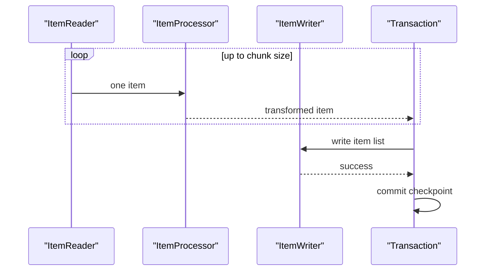
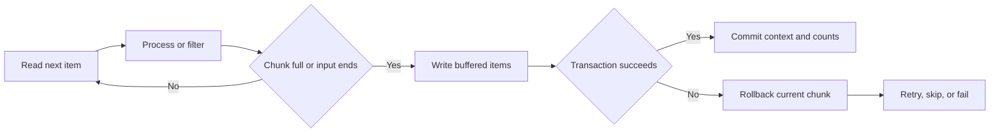
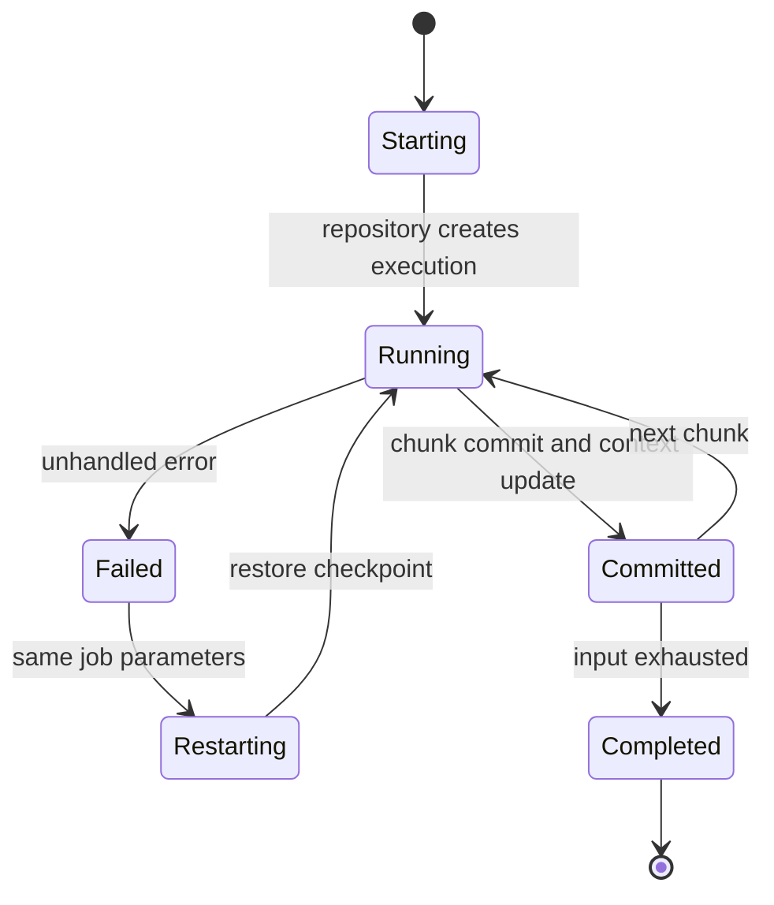

# Spring Batch Architecture, Chunk Execution Lifecycle & Fault Tolerance

Spring Batch provides a repeatable execution model for large, finite workloads such as imports, settlements, migrations, and report generation.
It turns a business batch into named jobs and steps, persists execution metadata, and makes restart, retry, skip, and transaction boundaries explicit.
Interviewers use it to test whether a candidate understands throughput together with correctness when a job fails halfway through millions of records.

---

## 🟢 Beginner Level

### A job is an identifiable batch run

A **Job** is the top-level Spring Batch unit.
It contains one or more **Steps**.
A **JobLauncher** starts a job with a set of identifying job parameters.

```java
JobParameters parameters = new JobParametersBuilder()
    .addString("businessDate", "2026-08-29")
    .toJobParameters();

jobLauncher.run(settlementJob, parameters);
```

The job name and its identifying parameters form a logical job instance.
Running `settlementJob` for the same business date is not necessarily a new business operation.
That identity prevents accidentally repeating a completed batch with the same inputs.


A job definition is reusable.
Each attempt to run it is a job execution with a lifecycle and status.
The same logical instance can have another execution when an earlier one failed and is restarted.

### A step performs one bounded responsibility

A step is a phase of a job with its own execution status and metrics.
One step may import a file.
Another may calculate totals.
A third may notify a downstream system.

```java
@Bean
Job settlementJob(JobRepository repository, Step importStep, Step publishStep) {
    return new JobBuilder("settlementJob", repository)
        .start(importStep)
        .next(publishStep)
        .build();
}
```

Steps should have clear restart and idempotency semantics.
Do not combine unrelated database loading, email delivery, and deletion in one opaque step.
Separating responsibilities makes failure diagnosis and compensation practical.

### Chunk processing batches work transactionally

The usual step style is chunk-oriented processing.
An `ItemReader` produces one input item at a time.
An optional `ItemProcessor` validates or transforms it.
An `ItemWriter` receives a list when the chunk is ready.

```java
new StepBuilder("importCustomers", repository)
    .<CustomerRow, Customer>chunk(100, transactionManager)
    .reader(customerReader())
    .processor(customerProcessor())
    .writer(customerWriter())
    .build();
```

With chunk size 100, the framework reads and processes up to 100 inputs.
It writes the resulting list in one transaction.
On success, it commits that chunk and begins another.



Chunking balances database round trips against rollback cost.
A tasklet step is another model for one-off work such as deleting an archive or calling a command.
Use a tasklet when there is no meaningful item stream to read and commit in chunks.

### The repository remembers what happened

Spring Batch stores metadata in a `JobRepository`.
The repository tracks logical job instances, executions, step executions, parameters, and execution context.
It is the basis for monitoring and restartability.

| Metadata record | What it represents | Useful evidence |
|---|---|---|
| job instance | job name plus identifying parameters | one logical business run |
| job execution | one attempt of that instance | start, end, status, exit code |
| step execution | one attempt of one step | read, write, skip, commit counts |
| execution context | persisted reader or step state | restart position |

The standard JDBC repository uses `BATCH_JOB_INSTANCE`, `BATCH_JOB_EXECUTION`, and `BATCH_STEP_EXECUTION` tables among others.
Treat these tables as operational records, not as an application business ledger.
Business outcomes need their own durable domain tables and audit trail.

---

## 🟡 Intermediate Level

### A chunk boundary is a failure boundary

Within a chunk-oriented step, the writer normally executes inside the chunk transaction.
If a reader, processor, or writer failure is not handled, the current chunk rolls back.
Earlier committed chunks remain durable.

For a chunk size of 100, suppose records 1 through 200 have committed.
Records 201 through 300 are being processed.
If record 247 causes an unhandled validation error, the current transaction is rolled back.
The committed position remains 200, not 246.

```java
@Bean
Step importOrders(JobRepository repository, PlatformTransactionManager tx) {
    return new StepBuilder("importOrders", repository)
        .<OrderRow, Order>chunk(100, tx)
        .reader(orderReader())
        .processor(orderProcessor())
        .writer(orderWriter())
        .build();
}
```

The reader's checkpoint state is persisted with the successful transaction.
On restart, a restartable reader can resume from the last committed boundary.
This does not automatically make external side effects idempotent, which is why writer design matters.

### Worked example: choose a chunk size from failure cost

Consider a nightly settlement job with 5,000,000 records.
Each item takes 2 ms to read and process.
Writing a chunk has 12 ms fixed database overhead plus 0.1 ms per row.

With a chunk size of 100, one successful chunk takes approximately:

$$
100 \times 2\text{ ms} + 12\text{ ms} + 100 \times 0.1\text{ ms} = 222\text{ ms}
$$

The job needs about $5{,}000{,}000 / 100 = 50{,}000$ chunk commits.
Ignoring parallelism and other overhead, that is about $50{,}000 \times 222\text{ ms} = 11{,}100$ seconds, or roughly 185 minutes.

With a chunk size of 1,000, a chunk takes approximately:

$$
1{,}000 \times 2\text{ ms} + 12\text{ ms} + 1{,}000 \times 0.1\text{ ms} = 2{,}112\text{ ms}
$$

There are 5,000 commits, so the simplified total is 10,560 seconds, or 176 minutes.
The larger chunk saves only nine minutes in this model but can roll back almost ten times as much CPU work and holds more items in memory.

| Chunk size | Approximate commits | Work lost on one rollback | Memory and retry cost |
|---:|---:|---:|---|
| 10 | 500,000 | up to 10 items | low, more transaction overhead |
| 100 | 50,000 | up to 100 items | balanced starting point |
| 1,000 | 5,000 | up to 1,000 items | higher heap and replay cost |

Choose from measured write latency, database lock time, item size, failure rate, and restart objective.
Do not choose 1,000 merely because it is a common blog example.
A remote writer often needs much smaller chunks and explicit timeouts.



The writer must not treat a buffered item as durable before the commit succeeds.
The execution context moves forward only with the successful chunk.
This alignment is what makes the restart position meaningful.

### Readers, processors, and writers have different ownership

An `ItemReader` supplies the next input or `null` when exhausted.
It should maintain a restartable position when its input supports one.
A database paging reader, cursor reader, file reader, and message reader have different consistency and restart trade-offs.

An `ItemProcessor` transforms one item or returns `null` to filter it.
Filtering is not an error and increments filter metrics rather than write count.
The processor should avoid hidden writes, because retries could repeat them.

An `ItemWriter` receives a collection of processed items.
It should make the destination state consistent with the transaction boundary.
For a database writer, batch inserts or updates generally join the step transaction.

```java
ItemProcessor<OrderRow, Order> processor = row -> {
    if (row.cancelled()) return null;
    return new Order(row.id(), row.total());
};
```

The writer is a particularly important idempotency boundary.
Use a stable business key and upsert, unique constraint, or exactly-once handoff protocol when a restart could replay an external effect.
Never assume a successful remote call rolls back just because the local chunk transaction does.

### Skip and retry policies classify failures

Retry is for transient failures that may succeed after the same operation is attempted again.
Typical examples are a deadlock loser, a short network interruption, or a temporary database connection problem.
Skip is for known bad input that the job may record and continue past.

```java
new StepBuilder("processOrders", repository)
    .<OrderRow, ProcessedOrder>chunk(100, tx)
    .reader(orderReader())
    .processor(orderProcessor())
    .writer(orderWriter())
    .faultTolerant()
    .skip(ValidationException.class).skipLimit(10)
    .retry(TransientDataAccessException.class).retryLimit(3)
    .build();
```

A skip limit is a safety budget, not a way to ignore data quality indefinitely.
If the eleventh validation error occurs in this configuration, the step fails.
A retry limit needs backoff and observability; immediate retries can intensify a database overload.

The supplied simulation's rule is important: with chunk size 100 and a skipped error at item 47, no partial first attempt commits.
Spring Batch rolls back and uses fault-tolerant processing to isolate the bad item.
It can then commit the remaining 99 valid items according to the configured policy.

---

## 🔴 Expert Level

### Restartability depends on persisted checkpoints and idempotent output

The repository persists execution context at successful chunk boundaries.
A restartable reader restores its last saved cursor, line number, page, or other position.
The restarted job instance must use the same identifying parameters unless the business intent is a new instance.



Checkpointing protects the input position, not arbitrary side effects.
If a writer sends an email and the process crashes before the repository records the commit, a restart may send it again.
Use an outbox table, an idempotency key at the remote endpoint, or a durable business-status update to make replay safe.

### Job parameters determine identity

Identifying job parameters distinguish logical job instances.
A business date is commonly identifying for a daily settlement job.
A random run ID may create a new instance every time, which is useful for ad hoc jobs but defeats normal restart semantics.

```java
JobParameters parameters = new JobParametersBuilder()
    .addLocalDate("businessDate", LocalDate.of(2026, 8, 29), true)
    .addString("requestedBy", "scheduler", false)
    .toJobParameters();
```

Here `businessDate` identifies the instance while `requestedBy` documents the execution without changing identity.
Submitting a completed instance again with the same identifying values normally results in an already-complete condition.
Decide intentionally whether reprocessing should be a restart, a new versioned instance, or a separate correction job.

### Parallelism changes partition and transaction design

Multi-threaded steps let one step process chunks concurrently.
Partitioning divides input into independent ranges and runs worker step executions, locally or remotely.
Parallel flows run separate steps concurrently when their dependencies allow it.

```java
@Bean
Step workerStep(JobRepository repository, PlatformTransactionManager tx) {
    return new StepBuilder("workerStep", repository)
        .<OrderRow, Order>chunk(200, tx)
        .reader(partitionReader())
        .processor(orderProcessor())
        .writer(orderWriter())
        .build();
}
```

For a 10,000,000-row range, ten partitions of 1,000,000 rows offer a simple ownership boundary.
Every partition needs a disjoint range and a restartable execution context.
Shared reader state, non-thread-safe writers, and database hot spots can remove all expected speedup.

Measure the slowest partition, not only average throughput.
Skewed keys can leave nine workers idle while one partition processes most records.
Correctness is usually easier when each worker owns deterministic input and an idempotent destination key.

### Metadata is an operational control plane

`BATCH_STEP_EXECUTION` counts reads, writes, commits, rollbacks, filters, and skips.
These metrics distinguish a slow source from a slow processor, writer bottleneck, or repeated rollback.
The repository also prevents conflicting executions according to its job-instance rules.

Do not purge metadata casually.
Retention has to balance database growth against the ability to audit, restart, and diagnose historical runs.
Archive or purge only under a documented policy after business and operations teams agree on retention requirements.

Use listeners for bounded metrics and audit hooks.
Do not put core business side effects exclusively in a listener unless its retry and transaction semantics are as carefully designed as the writer's.
Listeners often run at points where a failure changes the job outcome.

### Common Misconceptions

1. **“A chunk is one item.”** A chunk is a transactionally coordinated group of items. Readers and processors work item by item, while the writer typically receives the accumulated list.
2. **“Restartability gives exactly-once delivery everywhere.”** It restores framework execution state and can prevent re-reading committed input. External systems still require idempotency or an outbox-style protocol.
3. **“Every exception should be skipped.”** Skipping is appropriate only for classified, auditable bad input within a finite limit. Infrastructure and invariant failures should usually fail the job or retry with a controlled policy.
4. **“Larger chunks are always faster.”** They reduce transaction overhead but increase memory use, lock duration, and replay work after a failure. The right value comes from measured throughput and failure cost.
5. **“Partitioning automatically makes a step safe.”** It only provides parallel execution structure. Input ownership, writer idempotency, database contention, and restart metadata still need deliberate design.

### Interview Questions

**Q1. What are the main Spring Batch building blocks?** `[easy]`

A Job groups one or more Steps into a named batch workflow. A chunk-oriented step coordinates an ItemReader, optional ItemProcessor, and ItemWriter, while JobRepository persists execution metadata. JobLauncher starts an execution with parameters that determine its logical identity.

**Q2. What does an ItemProcessor returning null mean?** `[easy]`

Returning null filters the item out of the output without treating it as a failed item. The framework records filtering separately from writing, so operations can see that input was intentionally discarded. Use an exception and a skip policy instead when invalid input must be audited as an error.

**Q3. Why is a chunk transaction boundary important?** `[easy]`

It defines the set of reads and writes that succeed or roll back together. Previously committed chunks remain durable when a later chunk fails, which bounds replay work. The boundary must align with writer idempotency because external calls do not automatically participate in the local database transaction.

**Q4. What is the role of JobRepository?** `[easy]`

JobRepository stores job instances, executions, step metrics, parameters, and checkpoint context. It lets Spring Batch decide whether an instance may run, diagnose failures, and restart from committed state. It is framework metadata, so business facts should also be written to domain-owned storage.

**Q5. What happens if an unhandled processor exception occurs in a chunk?** `[medium]`

The current chunk transaction rolls back, so none of that chunk's writer changes commit. Earlier chunks remain committed and the step normally fails unless a fault-tolerant policy handles the exception. A skip policy can isolate a known bad item and allow the remaining valid items to proceed within its configured limit.

**Q6. How do skip and retry differ?** `[medium]`

Retry repeats an operation expected to succeed later, such as after a transient deadlock or connection fault. Skip records and bypasses a classified bad item so the batch can continue. Both need finite limits and monitoring because a retry storm or unlimited skip budget can hide a wider incident.

**Q7. How does Spring Batch restart a failed job?** `[medium]`

It creates a new execution of the same logical job instance and restores persisted execution context for restartable components. A reader can resume from the last successful chunk checkpoint rather than from the beginning. The output path must still be idempotent because a crash around external side effects can cause replay.

**Q8. Why should an ItemProcessor avoid hidden database writes?** `[medium]`

Processors may be invoked again during rollback, retry, skip isolation, or restart paths. A hidden write can therefore happen more than once or outside the writer's intended transaction semantics. Keep transformation pure when possible and put durable output behind an explicitly idempotent writer.

**Q9. How do job parameters affect whether a run can restart?** `[medium]`

Identifying parameters form the logical job-instance identity, so the same values identify a restartable business run. Non-identifying parameters can document a request without changing that identity. Adding a random identifying value to every launch creates a new instance and prevents the normal restart path from finding the previous one.

**Q10. When would you use a tasklet instead of chunk processing?** `[medium]`

Use a tasklet for a discrete action such as moving an archive, invoking a command, or checking a prerequisite when there is no item stream to batch. Use chunks for a large sequence where transaction size, restart position, and write grouping matter. A tasklet still needs explicit idempotency if it has side effects and can be restarted.

**Q11. A 5-million-row job fails repeatedly because of corrupt customer records. What policy would you implement?** `[hard]`

Classify the corruption with a specific exception, configure a conservative skip limit, and write an auditable record containing the input identity and reason. Keep infrastructure failures outside the skip class and use bounded retries with backoff for genuinely transient problems. Monitor the skip rate, because a sudden rise may mean an upstream schema change rather than isolated bad data.

**Q12. A job crashed after sending a partner API request but before its chunk checkpoint committed. How do you prevent duplicate partner actions on restart?** `[hard]`

Use an idempotency key accepted by the partner, or persist an outbox record in the same local transaction and deliver it separately with deduplication. The repository checkpoint alone cannot prove whether the external system completed the request. Replaying the input without such a protocol can repeat a charge, notification, or shipment.

**Q13. A larger chunk reduces commit count but makes production recovery worse. How do you decide the final size?** `[hard]`

Measure writer latency, database lock duration, item heap size, failure frequency, and the amount of work operations can tolerate replaying. Compare several sizes under representative load and choose the smallest size that meets the throughput objective with acceptable rollback cost. Revisit the decision when input size, database capacity, or error rate changes rather than treating it as a permanent constant.

**Q14. Why can partitioned processing be slower than a single thread?** `[hard]`

Partitions can contend on the same database indexes, output files, network service, or non-thread-safe reader and writer resources. Skew can make one partition much larger, leaving other workers idle while total job time follows the slowest worker. Define disjoint deterministic ranges, monitor per-partition metrics, and scale only after the destination can absorb concurrent writes.

### Further Reading

- [Spring Batch reference: domain language of batch](https://docs.spring.io/spring-batch/reference/domain.html) defines jobs, steps, executions, and repository metadata.
- [Spring Batch reference: chunk-oriented processing](https://docs.spring.io/spring-batch/reference/step/chunk-oriented-processing.html) documents reader, processor, writer, and transaction behaviour.
- [Spring Batch reference: retry and skip logic](https://docs.spring.io/spring-batch/reference/step/chunk-oriented-processing/configuring-skip.html) explains fault-tolerant step configuration.
- [Spring Batch reference: scaling and parallel processing](https://docs.spring.io/spring-batch/reference/scalability.html) covers multi-threaded steps and partitioning.
