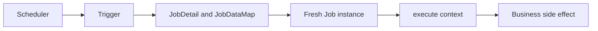
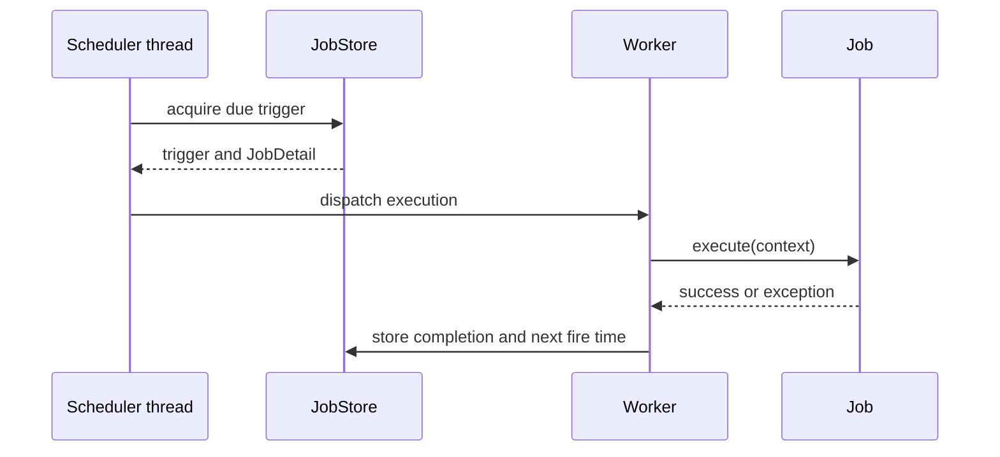
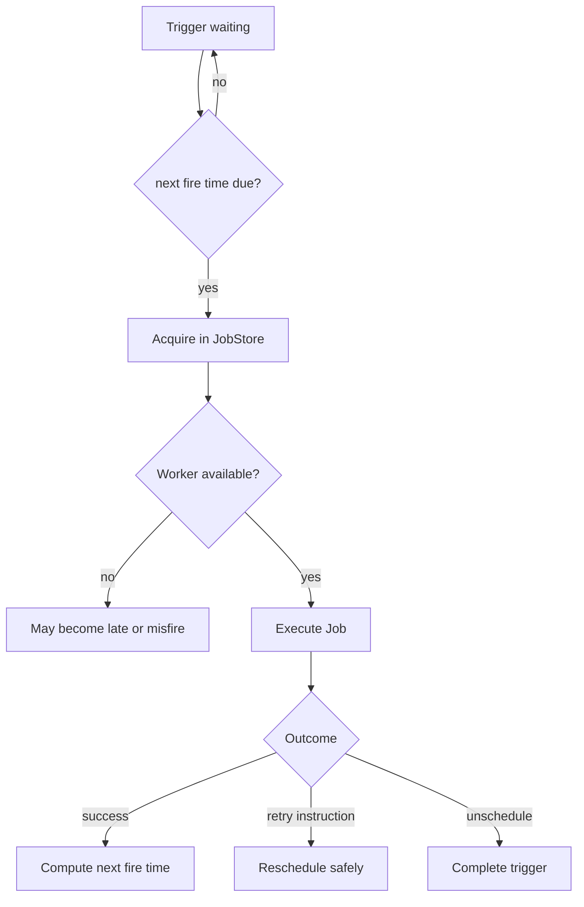
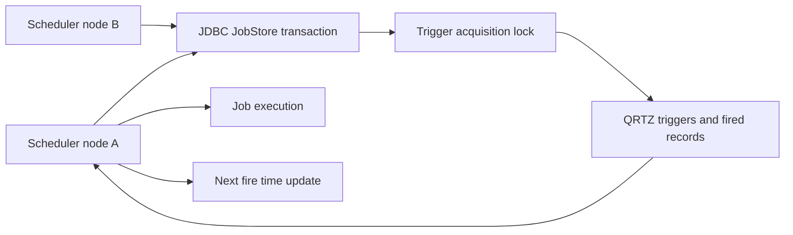

# Quartz Scheduler Architecture, Clustering & Misfire Policies

Quartz is a Java scheduling engine for work that must run at a defined time or recurrence, from one-off reminders to clustered maintenance jobs.
Unlike a simple in-process timer, Quartz persists scheduling metadata, coordinates trigger acquisition, and exposes policies for missed executions, which makes its behavior under restart and overload central to production correctness.
Interviewers use Quartz to test whether a candidate distinguishes an execution schedule from business idempotency and understands that distributed scheduling is never a substitute for safe job design.

---

## 🟢 Beginner Level

### The Four Core Objects

In Quartz, a JobDetail is the durable definition that binds a Job class to a stable identity, configuration, and job data. A Trigger points to that JobDetail, while the Scheduler resolves the pair and dispatches a fresh Job execution when the trigger becomes due. A persistent JobStore records both objects, and clustered Quartz nodes coordinate through that shared store so only one node deliberately acquires a firing. This explicit persisted model is the key distinction from Spring's simpler @Scheduled method invocation, which does not provide Quartz job identity, durable triggers, or database-backed cluster coordination by itself.

A `Job` contains the unit of work Quartz should execute.
A `JobDetail` gives that job an identity, durable metadata, and a `JobDataMap`.
A `Trigger` describes when a particular job detail should fire.
A `Scheduler` owns the registry, chooses eligible triggers, and dispatches work to its thread pool.

Quartz normally creates a new job-class instance for each execution.
That means an ordinary instance field is not a reliable place for state shared between runs.
Pass configuration through the `JobDataMap`, use injected services carefully, and persist durable state in an external system when it matters after restart.
Job code should do one small, observable unit of business work rather than becoming an application-wide background-service container.



The job detail describes what should run.
The trigger describes when it should run.
Keeping those identities separate lets multiple triggers point at one job definition and lets an operator pause or replace a trigger without rewriting job logic.

### Simple Triggers and Cron Triggers

A `SimpleTrigger` starts at a time and repeats at a fixed interval for a selected number of times or forever.
It is useful for work such as retrying every 30 seconds or running a one-off action after five minutes.
A `CronTrigger` uses a Quartz cron expression to describe calendar-oriented schedules.
It is appropriate for statements such as “at 02:15 every weekday in a stated time zone.”

Quartz cron expressions have seconds as their first field, unlike the common five-field Unix cron form.
For example, `0 15 2 ? * MON-FRI` means 02:15:00 Monday through Friday.
The `?` field means no specific value for day-of-month or day-of-week when the other field supplies the schedule.
Cron expressions can be precise, but precision does not remove timezone and daylight-saving decisions.

```java
JobDetail cleanup = JobBuilder.newJob(CleanupJob.class)
        .withIdentity("cleanup", "maintenance")
        .usingJobData("retentionDays", 30)
        .build();

Trigger nightly = TriggerBuilder.newTrigger()
        .withIdentity("nightly-cleanup", "maintenance")
        .withSchedule(CronScheduleBuilder
                .cronSchedule("0 15 2 ? * MON-FRI")
                .inTimeZone(TimeZone.getTimeZone("UTC")))
        .build();
```

Specify a timezone instead of inheriting a host default accidentally.
For financial or tenant-specific schedules, store the intended timezone as domain data and test daylight-saving transitions explicitly.

### Scheduling Is Not Delivery Semantics

Quartz can decide that a trigger is due and dispatch a job.
It cannot make an external email, payment, or HTTP call exactly once by itself.
A process can crash after the external system accepted a side effect but before Quartz records completion.
The recovered scheduler may then re-run work that already happened.

Design each job as idempotent where possible.
Use a deterministic business key, an outbox record, a database uniqueness constraint, or an external idempotency key to make a retry safe.
Record both scheduling attempts and business outcomes so an operator can distinguish “Quartz fired” from “the work completed.”

### A First Execution Timeline

The scheduler sees a trigger whose next fire time is due.
It acquires the trigger from the selected job store.
It obtains the job detail and gives a worker thread an execution context.
The worker invokes `execute`, then Quartz records the resulting trigger state and calculates the next time.



This timeline includes bookkeeping before and after user code.
A successful method return does not necessarily mean the next recurrence is identical; calendar rules, trigger instructions, and misfires affect it.
An exception should be classified deliberately because retrying every failure can cause a tight failure loop.

---

## 🟡 Intermediate Level

### Job Identity, Data, and State

A job key consists of a name and group.
A trigger key likewise has a name and group.
Stable names make operational actions such as pause, unschedule, replace, and audit unambiguous.
Generating random names for recurring production jobs makes cleanup and diagnosis harder.

`JobDataMap` holds serializable or otherwise job-store-compatible configuration data.
It should contain small configuration values such as tenant ID, report type, or retention interval.
It should not contain open connections, Spring application objects, a giant mutable cache, or secrets that will be persisted in a readable database table.
Pass identifiers and look up resources inside execution instead.

`@PersistJobDataAfterExecution` asks Quartz to store changes made to the job's data map after successful execution.
`@DisallowConcurrentExecution` prevents concurrent executions of the same `JobDetail` key.
Together they help a stateful sequential workflow, but they can reduce throughput and turn a slow run into a backlog.
They do not lock a different job key that calls the same downstream resource.

| Requirement | Quartz mechanism | Benefit | Limitation |
|---|---|---|---|
| Repeat at a duration | `SimpleTrigger` | Clear interval behavior | Calendar exceptions need more logic |
| Run by calendar rule | `CronTrigger` | Expressive recurring time | DST and timezone need testing |
| Prevent same detail overlap | `@DisallowConcurrentExecution` | Serializes one job key | Does not protect other job keys |
| Store per-job progress | `@PersistJobDataAfterExecution` | Persists small map changes | Requires safe serialization and retry logic |
| Durable clustered schedule | JDBC `JobStore` | Recovery and coordination | Database becomes a critical dependency |

The right mechanism follows from a concrete invariant.
For example, preventing two monthly invoices for the same tenant is normally a database uniqueness requirement as well as a scheduling preference.

### Trigger States and Priorities

Quartz tracks trigger states such as waiting, acquired, executing, paused, complete, error, and blocked.
The exact state transitions depend on trigger type, job annotations, and outcome.
An acquired trigger has been selected for execution and should not be acquired independently by another scheduler instance.
A trigger can become blocked when its job detail disallows concurrent execution and another firing is still running.

Trigger priority influences which eligible trigger Quartz prefers when several have the same fire time.
It is not a global quality-of-service guarantee across every job and node.
Thread-pool capacity, database acquisition timing, and long-running jobs still affect actual start time.
Use priority for small local scheduling choices, not to hide insufficient capacity.

### Worked Example: Catch-Up Policy After an Outage

Assume a report trigger is scheduled every five minutes at 10:00, 10:05, 10:10, and 10:15.
The service is unavailable from 10:01 until 10:17.
At restart, the trigger has missed three nominal fire times: 10:05, 10:10, and 10:15.
The next ordinary time is 10:20.

With a “fire now” style misfire instruction, Quartz can perform one immediate catch-up execution around 10:17 and then continue with the normal schedule at 10:20.
It does not necessarily run three back-to-back executions, which is useful when a report represents current state rather than every missed interval.
With “do nothing,” it skips missed occurrences and waits for 10:20.
The correct choice depends on business meaning, not on a desire to make dashboards look complete.

If each five-minute firing bills a separate metered period, skipping may lose required work.
If each firing recomputes one daily summary, replaying three identical jobs may waste resources or send duplicates.
For mandatory interval processing, persist unprocessed interval keys and have the job claim exactly those keys; do not rely on a scheduler's generic catch-up alone.

### Misfires and Their Threshold

A misfire occurs when a trigger's next fire time is sufficiently behind the scheduler's current time according to the job store's misfire threshold.
The default threshold is a configuration choice, commonly 60,000 ms, but it should be verified in the deployed version and configuration.
The scheduler periodically scans for such triggers and applies the trigger's misfire instruction.
A short transient delay should not necessarily become a semantic “missed schedule.”

For cron triggers, policies include choices comparable to firing once now, ignoring missed times, or rescheduling from the next relevant calendar time.
For simple triggers, the policy can also account for remaining repeat count and interval.
Read the exact builder and Quartz version documentation for the selected instruction.
Generic labels such as “retry” are dangerous because a misfire handles scheduler lateness, not necessarily business failure.

### Spring Integration and Dependency Boundaries

Spring can create and configure a Quartz `Scheduler` through `SchedulerFactoryBean`.
When jobs need Spring services, use a job factory or supported integration pattern to let new Quartz job instances receive dependencies.
Avoid storing service instances in `JobDataMap`, because durable stores serialize the map and because service instances belong to the application context lifecycle.
Keep Quartz jobs thin: validate the execution context, invoke an application use case, and map a known outcome to Quartz instructions.

The scheduler thread pool is distinct from a servlet request pool.
Choose its size based on job mix and downstream capacity.
Blocking database or HTTP work can occupy every Quartz worker and create trigger lateness even if the web application appears healthy.
Use separate job categories or external queues when long-running work should not delay short critical schedules.

### Trigger Selection and Completion Decisions

At each scheduler cycle, Quartz evaluates triggers that are eligible according to their next fire time and state.
The job store must atomically mark a chosen trigger as acquired before a worker can execute it.
After the job returns or throws, Quartz chooses the follow-up state from the execution result and trigger policy.
This is why operators should inspect trigger state as well as application logs when a schedule looks “stuck.”



An acquisition record is not proof of business success.
It only shows that the scheduler assigned an attempt to an instance.
The job should emit an outcome record with the business unit key, attempt number, duration, and safe error category.

### Configuration Values Need a Capacity Story

`org.quartz.threadPool.threadCount` limits simultaneous Quartz job executions on one instance.
It should be derived from measured work type and downstream bottlenecks.
Eight CPU-heavy report builders on a four-core pod may spend more time context switching than computing.
Eight I/O-bound jobs may still overload a database pool with only four available connections.

`clusterCheckinInterval` controls how often a clustered instance announces that it is alive.
Shorter intervals detect a dead instance sooner but add database traffic and make transient pauses more visible.
Longer intervals reduce traffic but leave acquired work unclaimed longer after a real node failure.
Choose it with failure-detection and recovery objectives, then test a paused or terminated node.

Job-store table cleanup is also capacity work.
Completed fired-trigger rows, audit records, and application outcome records need a retention policy.
Deleting them immediately destroys forensic evidence, while retaining every record forever slows queries and fills storage.
Aggregate operational metrics separately from detailed attempt logs when long retention is needed.

### Testing a Schedule as a Contract

Unit-test job logic by constructing only the inputs it needs and asserting domain effects.
Integration-test the actual job store, trigger configuration, and application wiring with a controlled clock or short trigger interval.
Test an overlap where one run exceeds its interval, a database restart, a misfire, and a graceful shutdown.
Tests should assert externally visible business outcomes rather than only that `execute` was called.

For cron schedules, include representative timezone transitions in automated tests.
For cluster behavior, use at least two scheduler instances against the same ephemeral database in an integration environment.
Verify that a job key does not intentionally run concurrently, then deliberately simulate a crash near its side effect to validate idempotency.
This is more valuable than a screenshot showing that one happy-path cron expression fired once.

Record the Quartz fire instance ID alongside the domain attempt identifier during these tests.
That correlation makes it possible to distinguish duplicate scheduler attempts from duplicate business effects.
Also test scheduler startup when a trigger's referenced job class or data map is invalid.
A configuration error should fail loudly and alert an operator rather than silently leaving an expected business process inactive.
Document who owns pausing, resuming, and manually re-running each production job.
An emergency manual run must use the same idempotency boundary as its scheduled counterpart.
This keeps operational recovery from becoming an untracked second scheduling system.

---

## 🔴 Expert Level

### JDBC JobStore and Cluster Coordination

`JobStoreTX` persists jobs, triggers, fired-trigger records, calendars, and scheduler state in Quartz tables.
Multiple scheduler instances can share that database when they are configured with the same scheduler name, clustering enabled, and unique instance IDs.
Each node periodically checks in so other nodes can recognize a failed instance.
The database job store coordinates acquisition using transactional locking and updates trigger metadata so one eligible node owns a firing.



The database lock prevents independent nodes from deliberately selecting the same trigger at the same moment.
It cannot prevent duplicate external side effects across crashes, network partitions, or an uncertain completion boundary.
Clustered Quartz therefore provides coordinated scheduling, not exactly-once business processing.
Use database transactions and idempotent side-effect designs around the job's real action.

Clock synchronization matters.
Nodes with materially different clocks disagree about when a trigger is due and about failure check-in timing.
Use reliable time synchronization, a consistent database configuration, and observability for node check-ins and trigger acquisition latency.
Do not run a cluster against copied local databases or a database topology that cannot supply the transactional semantics the job store needs.

### Recovery, Requests for Re-execution, and Idempotency

Jobs can request immediate re-execution through a `JobExecutionException` with the relevant instruction, but retries must be bounded.
An always-failing job that retries immediately can consume all worker threads and delay unrelated schedules.
Apply retry count, backoff, exception classification, and alerting in the business workflow or a durable retry mechanism.
Quartz's reschedule behavior should be observable with trigger key, fire instance ID, and error category.

For recovery after node failure, mark a job as requesting recovery only when replaying it is safe and meaningful.
The recovered execution should use a business idempotency key derived from its intended unit of work.
For example, a monthly invoice job can claim `(tenant_id, billing_month)` in a transactional table before calling an external payment provider.
If a restart produces another Quartz execution, the unique claim tells it the month is already being handled.

Never make job state depend only on “this process got to the end of `execute`.”
The process may die after committing an external side effect but before Quartz can record completion.
Persist enough domain state to decide whether a retry should create, resume, verify, or skip work.

### Calendar, DST, and Timezone Failure Modes

“Run at 02:30 local time” can mean zero, one, or two actual instants around daylight-saving transitions.
On a spring-forward day, a local 02:30 may not exist.
On a fall-back day, a local 02:30 can occur twice depending on zone rules.
Choose whether the business rule means a UTC instant, a local calendar occurrence, or an elapsed duration.

Use UTC for infrastructure tasks that have no local-time business meaning.
For customer-facing schedules, store an IANA timezone such as `Europe/London`, test representative DST dates, and communicate skipped or duplicated local times clearly.
Changing the JVM default timezone after deployment can silently alter jobs that did not specify one.
Avoid using server-local time as an implicit part of a billing rule.

### Operations: Capacity, Lock Contention, and Safe Shutdown

Monitor scheduler worker utilization, executing jobs, acquired triggers, misfire counts, job duration, database lock wait, and cluster check-in health.
A growing count of misfires can be caused by insufficient worker threads, a stalled database, a long stop-the-world pause, clock drift, or a slow downstream dependency.
Adding workers without diagnosing the downstream constraint can magnify a database or partner-API incident.
Separate measured CPU-bound and I/O-bound work where possible.

On shutdown, put the service into a state that stops accepting new application traffic, then apply the scheduler's configured shutdown behavior deliberately.
Waiting for jobs to complete may be appropriate for short idempotent work, while a long job may need an external lease, timeout, and recovery plan.
Kubernetes termination grace periods must be longer than the chosen graceful-shutdown window or the platform can terminate the process mid-execution.
Test node termination during a real job rather than assuming a clean local shutdown covers the failure case.

### Common Misconceptions

1. **"A clustered Quartz job executes exactly once."**
   *Correction*: The JDBC store coordinates trigger acquisition, but a crash near an external side effect creates an uncertain completion boundary. Business operations still need idempotency and durable outcome recording.

2. **"`@DisallowConcurrentExecution` prevents all duplicate work."**
   *Correction*: It serializes executions for one `JobDetail` key. Different job keys, other services, manual operations, and retries can still target the same business resource.

3. **"A misfire is the same as a failed job."**
   *Correction*: A misfire describes a trigger that was late relative to its schedule and threshold. A job failure is an outcome after execution began and needs separate retry policy.

4. **"Cron expressions are timezone-independent."**
   *Correction*: Cron fields are interpreted in a timezone, explicit or inherited. Daylight-saving changes and host defaults can change actual instants substantially.

5. **"Persisting a `JobDataMap` makes arbitrary Java object state durable."**
   *Correction*: Persistent job stores impose serialization and compatibility requirements. Store small durable identifiers and configuration, not live services, connections, or opaque mutable graphs.

### Interview Questions

**Q1. What is the difference between `JobDetail` and `Trigger` in Quartz?** `[easy]`

`JobDetail` identifies the job class and its configuration, while a trigger identifies when that work should run. Multiple triggers can refer to one job detail. Separating them lets scheduling policy change without changing the job's business implementation.

**Q2. Why does Quartz normally create a new job instance for each firing?** `[easy]`

Fresh instances avoid accidental in-memory state leakage across independent executions. Instance fields therefore are not durable job progress. Store durable state in a compatible job map only when appropriate, or preferably in an explicit domain store.

**Q3. What does `@DisallowConcurrentExecution` guarantee?** `[easy]`

It prevents concurrent executions with the same `JobDetail` key. It is useful when one job's state or downstream operation must be serialized. It does not lock different job details that happen to operate on the same database row or external account.

**Q4. Why should a cron trigger specify a timezone?** `[easy]`

A cron expression represents calendar fields that only become an instant in a timezone. Relying on a host default makes deployments and daylight-saving behavior surprising. An explicit timezone makes the business rule testable and portable.

**Q5. What is a Quartz misfire?** `[medium]`

A misfire is a trigger whose next fire time is sufficiently behind current time under the configured threshold. Quartz applies the trigger's configured misfire instruction to decide how scheduling resumes. It is about lateness of a schedule, not proof that a job execution failed.

**Q6. How does `JobStoreTX` coordinate a Quartz cluster?** `[medium]`

It persists scheduler metadata in relational tables and uses transactional locking while instances acquire eligible triggers and update next fire times. A cluster node that acquires a firing records ownership so another node does not intentionally run it at the same time. The database and clock configuration therefore become part of scheduler availability.

**Q7. Why is a `JobDataMap` a poor place for Spring beans or connections?** `[medium]`

Durable job stores persist the map and require values compatible with that storage mechanism. Beans and open resources are lifecycle-managed, may not serialize, and can be stale on recovery. Store an identifier or simple setting and obtain the resource from the application context during execution.

**Q8. What is the difference between `SimpleTrigger` and `CronTrigger`?** `[medium]`

`SimpleTrigger` models a start time and repeat interval, which fits elapsed-duration work. `CronTrigger` models calendar fields, which fits schedules such as a weekday local time. Calendar schedules require explicit timezone and DST policy, while duration schedules need clear handling of downtime.

**Q9. Why can a large Quartz worker pool make an incident worse?** `[medium]`

More workers can create more simultaneous database queries or partner API calls when the downstream service is already slow. This increases contention, retries, and lock waits while unrelated triggers fall behind. Size the pool from observed job behavior and downstream limits, then use backpressure and alerts for saturation.

**Q10. How should a job handle a retryable external failure?** `[medium]`

Classify the failure, record enough context to retry safely, and use bounded backoff rather than immediate infinite re-execution. The job's side effect should accept a stable idempotency key or be protected by a durable business claim. Alert after a defined retry budget so a permanent error is not hidden by scheduler churn.

**Q11. What business guarantee should be paired with clustered scheduling?** `[medium]`

Use idempotency or a transactional uniqueness claim for the intended work unit. Quartz cluster locking coordinates who acquires a trigger, but it cannot know whether an external side effect completed during a crash. The domain record decides whether a repeated execution should create, resume, verify, or skip the action.

**Q12. Scenario: a five-minute report job was down for 16 minutes. Should it run three times on restart?** `[hard]`

First determine whether each missed interval represents distinct required work or whether the report is simply a view of current state. For a current-state report, one fire-now catch-up or waiting for the next schedule may be correct, while replaying three times creates redundant load. For interval-specific work, persist and claim each missed interval explicitly instead of depending only on generic misfire behavior.

**Q13. Scenario: two pods both appear to send the same invoice after a database failover. What do you investigate and change?** `[hard]`

Inspect scheduler check-ins, database transaction and lock behavior, trigger fire records, clock synchronization, and the exact crash or failover timeline. Even correct trigger coordination cannot prove an invoice provider did not accept a request before an execution record was lost or uncertain. Add a durable invoice-period uniqueness claim and provider idempotency key, then make retries verify existing outcomes before sending.

**Q14. Scenario: a 02:30 daily tenant job skipped once in March and ran twice in November. Is this a Quartz bug?** `[hard]`

It is likely the timezone's daylight-saving transition: a local wall time can be missing in spring and repeated in autumn. Confirm the trigger timezone, zone rules, and the intended business definition of a daily occurrence. Use an explicit timezone and policy, or schedule by UTC instant if local-time semantics are not required.

### Further Reading

- [Quartz Scheduler tutorial](https://www.quartz-scheduler.org/documentation/quartz-2.3.0/tutorials/) introduces jobs, triggers, scheduling, and job stores from the project maintainers.
- [Quartz `JobStoreTX` configuration reference](https://www.quartz-scheduler.org/documentation/quartz-2.3.0/configuration/ConfigJobStoreTX.html) documents transactional JDBC persistence and clustering settings.
- [Quartz `CronTrigger` API](https://www.quartz-scheduler.org/api/2.3.0/org/quartz/CronTrigger.html) specifies calendar trigger behavior and misfire instructions.
- [Spring Framework Quartz integration reference](https://docs.spring.io/spring-framework/reference/integration/scheduling.html#scheduling-quartz) explains `SchedulerFactoryBean` and Spring-managed jobs.
